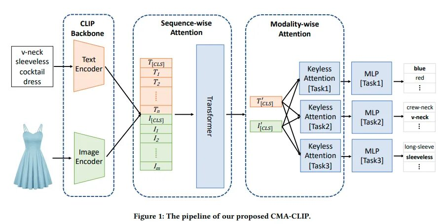
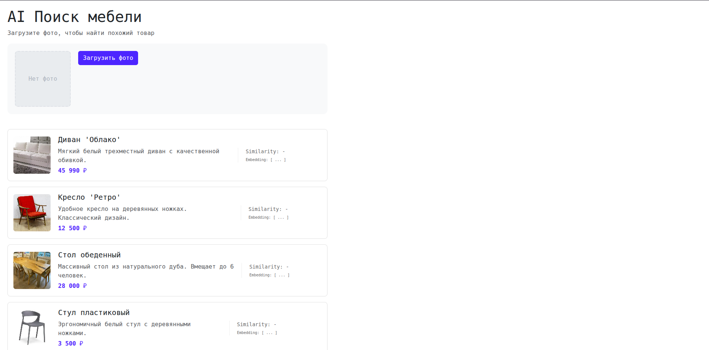
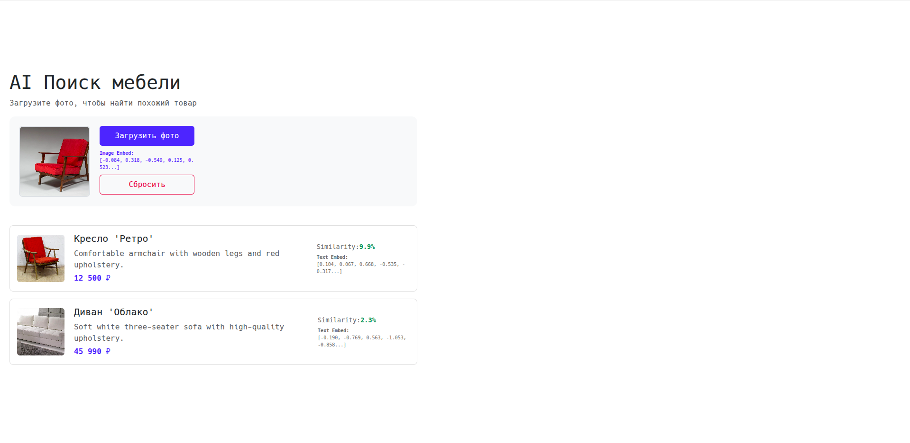

# Методическое пособие по интеграции поиска карточек по изображению.

В данном методическом пособии на примере магазина мебели будет показано применение <a href="https://huggingface.co/docs/transformers.js/index">`transformers.js`</a> для полной реализации поиска карточки с подходящим описанием по картинке через CLIP-модель. 

Для начала мы реализуем простое React-приложение интернет-магазина мебели с простым текстовым происком. Затем мы уже интегрируем поиск по изображению.
Первичное приложение будет во многом повторять ЛР по React, так что задерживаться на создании сильно не будем. 

## Теория про CLIP

Для реализации поиска по изображению в данной работе используются технологии глубокого обучения (Deep Learning), основанные на архитектуре Трансформер (Transformer). Чтобы понять, как именно происходит "магия" сопоставления картинки и текста, разберем ключевые компоненты системы.

#### 1. Трансформер как «черный ящик»
Архитектура Трансформер, совершившая революцию в обработке естественного языка (NLP), состоит из двух основных блоков:
*   **Энкодер (Encoder)** - отвечает за понимание входных данных и перевод их в векторное представление.
*   **Декодер (Decoder)** - отвечает за генерацию новых данных на основе информации от энкодера.

В контексте нашей задачи нас интересует только **Энкодер**. Можно представить его как «черный ящик»: на вход он получает данные (например, предложение), а на выходе выдает **эмбеддинг** - числовой вектор фиксированной длины. Этот вектор является "смысловым слепком" входных данных: если два предложения похожи по смыслу, их векторы-эмбеддинги будут находиться близко друг к другу в математическом пространстве.

#### 2. Визуальные трансформеры (Vision Transformers)
Долгое время трансформеры применялись только к тексту. Однако выяснилось, что Энкодер трансформера - устройство универсальное. Ему неважно, что именно подается на вход, главное - представить данные как последовательность элементов.

Чтобы скормить Энкодеру изображение, применяется следующий алгоритм (Vision Transformer, ViT):
1.  **Нарезка на патчи:** Изображение разбивается на сетку квадратов (например, 16x16 пикселей).
2.  **Линеаризация:** Каждый квадрат (патч) "вытягивается" в плоскую последовательность пикселей. Теперь картинка для модели выглядит как набор фрагментов, аналогично тому, как предложение выглядит как набор слов.
3.  **Позиционное кодирование (Positional Encoding):** Чтобы модель понимала, где находится какой фрагмент (где левый верхний угол, а где центр), к данным каждого патча добавляется специальный вектор позиции.
4.  **Эмбеддинг:** Подготовленная последовательность проходит через слои Энкодера, и на выходе мы получаем один итоговый вектор - **эмбеддинг изображения**.

Для наглядности приведена схема ViT


#### 3. Модель CLIP: единое смысловое пространство
Проблема классических подходов в том, что модели для текста и модели для картинок существуют в разных "мирах". Вектор слова "собака" и вектор фотографии собаки, полученные разными нейросетями, математически никак не связаны. Их нельзя просто взять и сравнить.

Здесь на сцену выходит **CLIP (Contrastive Language-Image Pre-training)**.
CLIP - это мультимодальная архитектура, которая обучает два Энкодера одновременно:
1.  **Text Encoder:** превращает текст в вектор.
2.  **Image Encoder:** превращает картинку в вектор.

Главная особенность CLIP заключается в том, что эти два энкодера обучаются так, чтобы **проецировать данные в общее смысловое (векторное) пространство**. В процессе обучения модель видит миллионы пар "картинка + описание" и настраивает свои веса так, чтобы:
*   Вектор изображения собаки и вектор текста "фотография собаки" были **близки**.
*   Вектор изображения собаки и вектор текста "тарелка супа" были **далеки** друг от друга.

Также приведем схему CLIP


#### 4. Применение для поиска
Благодаря тому, что CLIP (и его современные вариации, такие как SigLIP) создает единое пространство для разных модальностей, мы можем реализовать поиск без использования сложной классификации и разметки данных:
1.  Берем изображение от пользователя и прогоняем через **Image Encoder** $\rightarrow$ получаем вектор $V_{img}$.
2.  Берем описания всех товаров в базе и прогоняем через **Text Encoder** $\rightarrow$ получаем набор векторов $V_{text\_1}, V_{text\_2}, \dots$.
3.  Считаем **косинусное сходство** (Cosine Similarity) между $V_{img}$ и каждым из текстовых векторов.
4.  Товары, чьи текстовые векторы оказались "ближе" всего к вектору картинки, и являются искомыми объектами.

В данной лабораторной работе мы используем модель <a href="https://huggingface.co/Xenova/siglip-base-patch16-224">SigLIP</a> (улучшенную версию CLIP от Google), которая работает по тому же принципу, но обладает более высокой точностью и поддержкой множества языков.

### Что такое transfomers.js?

Простыми словами, `transformers.js` - это перевод библиотеки <a href="https://huggingface.co/docs/transformers/index">HF Transformers</a> с python на JavaScript. Сущности из оригинальной библиотеки постарались перенести в JS, также некоторые модели, которые раньше запускались **только** через python, теперь могут работать на JavaScript. 

Теперь быстренько перепишем интерфейс под новые функции, и подронбно разберем саму логику работы с `transfomers.js` в нашем проекте. 


## Создание простого React-приложения

### 1. Инициализация проекта

Откройте терминал и выполните следующую команду для создания проекта с использованием Vite:

```bash
npm create vite@latest furniture-shop -- --template react-ts
```

Перейдите в папку проекта:

```bash
cd furniture-shop
```

Установите базовые зависимости:

```bash
npm install
```

Установите дополнительные библиотеки:

```bash
npm install bootstrap react-bootstrap
```

### Структура

В папку src добавье папку modules. 

#### `src/modules/mock.ts`
Определение типов и моковых данных. Убедитесь, что в папке `src/assets` есть изображения `1.jpg` ... `8.jpg`, `default.jpg`. Взять их можно в <a href="https://github.com/David-bomb/CLIP_method/tree/main/card_images">папке</a>. 

**Примечание:** Mock описания **обязательно** писать на английском языке. Дело в том, что создатель библиотеки `transformers.js`, Xenova, еще не конвертировал под свою библиотеку ни одну поддерживающую русский язык модель типа CLIP. На русском языке векторы будут формироваться неправильно. Названия оставим русскими, они в формировании эмбеддинга не участвуют.

```typescript
import img1 from '../assets/1.jpg';
import img2 from '../assets/2.jpg';
import img3 from '../assets/3.jpg';
import img4 from '../assets/4.jpg';
import img5 from '../assets/5.jpg';
import img6 from '../assets/6.jpg';
import img7 from '../assets/7.jpg';
import img8 from '../assets/8.jpg';
import defaultImg from '../assets/default.jpg'; 

export interface IFurniture {
    id: number;
    name: string;
    description: string;
    price: number;
    image: string;
    embedding?: number[]; // Эмбеддинг
}

export const FURNITURE_MOCK: IFurniture[] = [
    {
        id: 1,
        name: "Диван 'Облако'",
        description: "Soft white three-seater sofa with high-quality upholstery.",
        price: 45990,
        image: img1
    },
    {
        id: 2,
        name: "Кресло 'Ретро'",
        description: "Comfortable armchair with wooden legs and red upholstery.",
        price: 12500,
        image: img2
    },
    {
        id: 3,
        name: "Стол обеденный",
        description: "Solid natural oak table. Seats up to 6 people.",
        price: 28000,
        image: img3
    },
    {
        id: 4,
        name: "Стул пластиковый",
        description: "Gray plastic chair with plastic legs.",
        price: 3500,
        image: img4
    },
    {
        id: 5,
        name: "Торшер напольный",
        description: "Gray metal loft-style floor lamp.",
        price: 5900,
        image: img5
    },
    {
        id: 6,
        name: "Комод белый",
        description: "White dresser with three handle-less drawers.",
        price: 15990,
        image: img6
    },
    {
        id: 7,
        name: "Кровать двуспальная",
        description: "White double bed with a padded headboard.",
        price: 32000,
        image: img7
    },
    {
        id: 8,
        name: "Полка настенная",
        description: "Wooden shelf with an unusual S-shaped design.",
        price: 1900,
        image: img8
    },
    // Карточки без картинок. Это показательный пример того, что поиск идет именно по описанию.
    {
        id: 9,
        name: "Шкаф-купе",
        description: "Large oak sliding-door wardrobe with a full-length mirror.",
        price: 45000,
        image: defaultImg
    },
    {
        id: 10,
        name: "Тумба прикроватная",
        description: "Small oak bedside table for the bedroom.",
        price: 4500,
        image: defaultImg
    },
    {
        id: 11,
        name: "Зеркало настенное",
        description: "Round mirror in a gold frame.",
        price: 3200,
        image: defaultImg
    }
];
```

#### `src/modules/math.ts`

В машинном обучении для сравнения векторов чаще всего используется **Косинусное сходство (Cosine Similarity)**.
Если не вдаваться в глубокую геометрию: это вычисление косинуса угла между двумя векторами.
*   **1.0**: Векторы сонаправлены (идеальное совпадение).
*   **0.0**: Векторы перпендикулярны (ничего общего).
*   **-1.0**: Векторы противоположны.

Создадим файл для математических функций. Он нам понадобится.

```typescript
export function cosineSimilarity(vecA: number[], vecB: number[]): number {
    let dotProduct = 0;
    let normA = 0;
    let normB = 0;

    for (let i = 0; i < vecA.length; i++) {
        dotProduct += vecA[i] * vecB[i];
        normA += vecA[i] * vecA[i];
        normB += vecB[i] * vecB[i];
    }

    if (normA === 0 || normB === 0) return 0;
    return dotProduct / (Math.sqrt(normA) * Math.sqrt(normB));
}
```


#### `src/App.css`

Изменим файл App.css

```css
.app-container {
  max-width: 900px;
  margin: 0 auto;
  padding: 20px;
  font-family: system-ui, -apple-system, sans-serif;
}

.search-section {
  display: flex;
  gap: 20px;
  align-items: flex-start;
  margin-bottom: 40px;
  padding: 20px;
  background: #f8f9fa;
  border-radius: 12px;
}

.action-panel {
  display: flex;
  flex-direction: column;
  gap: 8px;
  width: 200px;
}

.action-btn {
  width: 100%;
  min-height: 42px;
}

.action-progress {
  width: 100%;
}

.embed-preview {
  font-size: 10px;
  color: #0d6efd;
  max-width: 100%;
  word-break: break-all;
}

.preview-image {
  width: 150px;
  height: 150px;
  object-fit: cover;
  border-radius: 8px;
  border: 2px solid #dee2e6;
}

.placeholder-image {
  width: 150px;
  height: 150px;
  background: #e9ecef;
  display: flex;
  align-items: center;
  justify-content: center;
  border-radius: 8px;
  color: #adb5bd;
  border: 2px dashed #dee2e6;
}

.furniture-row {
  display: flex;
  gap: 20px;
  padding: 15px;
  border: 1px solid #e0e0e0;
  border-radius: 8px;
  margin-bottom: 15px;
  align-items: center;
  background: white;
  transition: box-shadow 0.2s;
}

.furniture-row:hover {
  box-shadow: 0 4px 12px rgba(0,0,0,0.1);
}

.row-image {
  width: 100px;
  height: 100px;
  object-fit: cover;
  border-radius: 6px;
  flex-shrink: 0;
}

.row-content {
  flex-grow: 1;
}

.row-stats {
  width: 250px;
  padding-left: 20px;
  border-left: 1px solid #eee;
  font-family: monospace;
  font-size: 0.85rem;
  color: #666;
}

.similarity-value {
    font-weight: bold;
    color: #198754; 
}

.embed-preview-text {
    font-size: 10px; 
    margin-top: 5px; 
    word-break: break-all; 
    color: #666;
}
```

#### `src/App.tsx`

Теперь создадим страницу с карточками с нашими стилями. Пока мы будем использовать заглушки для симуляции работы CLIP (фрагмент с ними выделен знаками "="), потом мы этот фрагмент заменим на **реальные** сущности. В остальном это уже готовый код файла `App.tsx`.

```tsx
import { useState, useRef } from 'react';
import { Button, ProgressBar } from 'react-bootstrap';
import { FURNITURE_MOCK } from './modules/mock';
import type { IFurniture } from './modules/mock';
import './App.css';
import 'bootstrap/dist/css/bootstrap.min.css';

// Расширяем интерфейс для UI (добавляем score и видимость)
interface IProcessedItem extends IFurniture {
    score: number;      
    isVisible: boolean; 
}

function App() {
  const [selectedImage, setSelectedImage] = useState<string | null>(null);
  const fileInputRef = useRef<HTMLInputElement>(null);

  // === ЗАГЛУШКИ (В будущем заменим на хук) ===
  const ready = true; // Делаем вид, что модель загружена
  const progress = 0;
  const imageEmbedding: number[] | null = null;
  // Просто отображаем моки, как будто score = 0
  const items: IProcessedItem[] = FURNITURE_MOCK.map(i => ({...i, score: 0, isVisible: true}));
  
  const searchByImage = (file: File) => { console.log("Searching...", file) };
  const resetSearch = () => { console.log("Resetting...") };
  // ===========================================

  const handleImageUpload = (e: React.ChangeEvent<HTMLInputElement>) => {
    const file = e.target.files?.[0];
    if (file) {
      const imageUrl = URL.createObjectURL(file);
      setSelectedImage(imageUrl);
      searchByImage(file);
    }
  };

  const handleClear = () => {
    setSelectedImage(null);
    resetSearch();
    if (fileInputRef.current) fileInputRef.current.value = '';
  };

  const uploadLabel = ready ? 'Загрузить фото' : 'Загрузка нейросети...';
  const isUploadDisabled = !ready;
  const canReset = Boolean(selectedImage);

  return (
    <div className="app-container">
      <h1>AI Поиск мебели</h1>
      <p className="text-muted">Загрузите фото, чтобы найти похожий товар</p>

      <div className="search-section">
        <input 
          type="file" 
          accept="image/*" 
          ref={fileInputRef}
          style={{ display: 'none' }}
          onChange={handleImageUpload}
        />

        <div style={{ flexShrink: 0 }}>
            {selectedImage ? (
                
            ) : (
                <div className="placeholder-image">Нет фото</div>
            )}
        </div>

        <div className="action-panel">
            <Button 
              className="action-btn" 
              variant="primary" 
              onClick={() => fileInputRef.current?.click()} 
              disabled={isUploadDisabled}
            >
                {uploadLabel}
            </Button>

            {!ready && (
              <ProgressBar className="action-progress" now={progress} label={`${Math.round(progress)}%`} animated />
            )}

            {imageEmbedding && (
                <div className="embed-preview">
                    <strong>Image Embed: </strong><br/>
                    [{imageEmbedding.slice(0, 5).map(n => n.toFixed(3)).join(', ')}...]
                </div>
            )}
            
            <Button 
              className="action-btn" 
              variant="outline-danger" 
              onClick={handleClear} 
              disabled={!canReset}
            >
              Сбросить
            </Button>
        </div>
      </div>

      <div className="items-list">
        {items.map((item) => {
            if (!item.isVisible) return null;

            return (
              <div key={item.id} className="furniture-row">
                    
                    
                    <div className="row-content">
                        <h5>{item.name}</h5>
                        <p className="text-muted mb-1">{item.description}</p>
                        <strong className="text-primary">{item.price.toLocaleString()} ₽</strong>
                    </div>

                    <div className="row-stats">
                        <div>
                            Similarity: 
                            <span className="similarity-value">
                                { `${(item.score * 100).toFixed(1)}%`}
                            </span>
                        </div>
                        
                        {/* Отображаем вектор, если он есть */}
                        {item.embedding && (
                            <div className="embed-preview-text">
                                <strong>Text Embed:</strong><br/>
                                [{item.embedding.slice(0, 5).map(n => n.toFixed(3)).join(', ')}...]
                            </div>
                        )}
                    </div>
                </div>
            );
        })}
      </div>
    </div>
  );
}

export default App;
```


### Запуск проекта

```bash
npm run dev
```

Тут у вас должно получиться простое React-приложение интернет магазина.

**Главная**



## Интерграция SigLIP

В этом этапе мы создадим новый файл, где будет прописана логика работы SigLIP, а также внедрим подсчет эмбеддингов для карточек. Сортировка по эмбеддингам будет интегрирована позже. 

### Подготовка

Для начала нужно установить саму библиотеку `@huggingface/transformers`. Это может занять время.

```bash
npm install @huggingface/transformers
```

### Разработка search.worker.js

Здесь мы разработаем главную часть нашей работы. Этот файл несет в себе логику нарботы с SigLIP. 

Сначала мы разберем фрагменты, которые должны быть в этом файле, а затем соберем их воедино.

#### Импорты и настройки окружения

```ts
import { 
    env, 
    AutoTokenizer, 
    AutoProcessor, 
    SiglipTextModel, 
    SiglipVisionModel,
    RawImage 
} from '@huggingface/transformers';

env.allowLocalModels = false;
env.allowRemoteModels = true;

const MODEL_ID = 'Xenova/siglip-base-patch16-224';
```

Мы импортируем env для настроек библиотеки, токенизатор и процессор. Также мы импортируем SiglipTextModel и SoglipVisionModel, это те энкодеры, которые помогут нам векторизовать тексты описаний и картинку поиска. А вот RawImage - это спициальный тип, к которому приводят картинку, чтобы Porcessor не воспринял картинку как текст. RawImage напрямую указывает, что процессору дана именно картинка.

Далее мы задаем локальные настройки и обозначаем какую модель мы используем.

#### Singleton сервис

```tsx
class SiglipService {
    static tokenizer: any = null;
    static processor: any = null;
    static textModel: any = null;
    static visionModel: any = null;

    static async init(progress_callback?: (data: any) => void) {
        if (!this.tokenizer) {
            // Используем q8 для баланса качества и скорости
            const options = { device: 'wasm', dtype: 'q8' } as const;

            this.tokenizer = await AutoTokenizer.from_pretrained(MODEL_ID, { progress_callback });
            this.processor = await AutoProcessor.from_pretrained(MODEL_ID, { progress_callback });
            this.textModel = await SiglipTextModel.from_pretrained(MODEL_ID, {...options, progress_callback });
            this.visionModel = await SiglipVisionModel.from_pretrained(MODEL_ID, {...options, progress_callback });
        }
    }
}
```

Это класс-синглтон. Его задача — загрузить модель один раз и хранить её в памяти.
Если бы мы загружали модель при каждом нажатии кнопки "Искать", пользователю приходилось бы ждать загрузку каждый раз. Здесь мы проверяем if (!this.tokenizer): если модели уже в памяти, мы пропускаем загрузку.
Мы загружаем 4 компонента, необходимых для работы мультимодальной нейросети.

Также стоит упомянть о настройках запуска. В данном случае запускается квантизованная модель и CPU. В качестве device запуска можно также указывать `webgpu`, и тогда модель будет работать на GPU. А про доступные степени квантизации в методичке написано следующее:
> While the available options may vary depending on the specific model, typical choices include "fp32" (default for WebGPU), "fp16", "q8" (default for WASM), and "q4".
Подробней про квантизацию в `transformers.js` можно прочитать <a href="https://huggingface.co/docs/transformers.js/guides/dtypes">здесь</a>, а про то, что такое квантизация в принципе - <a href="https://habr.com/ru/articles/887466/">тут</a>.

#### Обработчик сообщений

```tsx
self.addEventListener('message', async (event) => {
    const { type, data } = event.data;

    try {
        if (type === 'init') {
            await SiglipService.init((msg) => {
                self.postMessage({ type: 'progress', data: msg });
            });

            const items = data;
            const embeddings: Record<number, number[]> = {};

            // Все описания РАЗОМ
            const descriptions = items.map((item: any) => item.description);
            
            // max_length нужен для одинаковой длины 
            const text_inputs = await SiglipService.tokenizer(descriptions, { 
                padding: 'max_length', 
                truncation: true,
            });

            // Получаем выход текстовой модели, мы заэмбеддили все описания за раз, сделав 1 эмбеддинг
            const { pooler_output: textOutput } = await SiglipService.textModel(text_inputs);

            // Размерность выхода SigLIP base = 768
            const embeddingSize = 768; 

            for (let i = 0; i < items.length; i++) {
                const start = i * embeddingSize;
                const end = start + embeddingSize;
                // Этот кусок - вектор для одного описания
                const textVector = textOutput.data.slice(start, end);
                
                const itemId = items[i].id; 
                embeddings[itemId] = Array.from(textVector);
            }

            self.postMessage({ type: 'text_embeddings_ready', data: embeddings });
        }

        // Если загрузили картинку
        if (type === 'image') {
            // Считываем
            const imageUrl = URL.createObjectURL(data); 
            // RawImage - утилита для работы с изображениями, без нее процессор может воспринять картинку как текст, и visionModel выдаст ошибку
            const image = await RawImage.read(imageUrl);
            
            // Обрабатываем картинку и получаем вектор
            const imageInputs = await SiglipService.processor(image);
            const { pooler_output } = await SiglipService.visionModel(imageInputs);
            
            self.postMessage({ 
                type: 'image_embedding_ready', 
                data: Array.from(pooler_output.data) 
            });
            
            URL.revokeObjectURL(imageUrl);
        }

    } catch (error) {
        console.error(error);
        self.postMessage({ type: 'error', data: error });
    }
});
```

Обработчик ждет команды от основного приложения (App.tsx).
event.data содержит данные, которые мы передали через postMessage. Мы смотрим на поле type, чтобы понять, что от нас хотят: инициализацию или обработку картинки.

Здесь расположена логика работы поиска. Эмбеддинги описаний карточек рассчитываются сразу, как и обе модели SigLIP загружаются сразу. А вот эмбеддинг картинки рассчитыватся только при ее загрузке, что логично. 

В нашем проекте карточек немного, поэтому мы можем себе позволить векторизовать все описания разом. В случае большого количества карточек в индустрии принято проводить "корзиночную" (batch) обработку, обычно в одном батче обрабатывается 16 или 32 объекта.

#### Полный код

```tsx
import { 
    env, 
    AutoTokenizer, 
    AutoProcessor, 
    SiglipTextModel, 
    SiglipVisionModel,
    RawImage 
} from '@huggingface/transformers';

env.allowLocalModels = false;
env.allowRemoteModels = true;

const MODEL_ID = 'Xenova/siglip-base-patch16-224';

class SiglipService {
    static tokenizer: any = null;
    static processor: any = null;
    static textModel: any = null;
    static visionModel: any = null;

    static async init(progress_callback?: (data: any) => void) {
        if (!this.tokenizer) {
            // Используем q8 для баланса качества и скорости
            const options = { device: 'wasm', dtype: 'q8' } as const;

            this.tokenizer = await AutoTokenizer.from_pretrained(MODEL_ID, { progress_callback });
            this.processor = await AutoProcessor.from_pretrained(MODEL_ID, { progress_callback });
            this.textModel = await SiglipTextModel.from_pretrained(MODEL_ID, {...options, progress_callback });
            this.visionModel = await SiglipVisionModel.from_pretrained(MODEL_ID, {...options, progress_callback });
        }
    }
}

self.addEventListener('message', async (event) => {
    const { type, data } = event.data;

    try {
        if (type === 'init') {
            await SiglipService.init((msg) => {
                self.postMessage({ type: 'progress', data: msg });
            });

            const items = data;
            const embeddings: Record<number, number[]> = {};

            // Все описания РАЗОМ
            const descriptions = items.map((item: any) => item.description);
            
            // max_length нужен для одинаковой длины 
            const text_inputs = await SiglipService.tokenizer(descriptions, { 
                padding: 'max_length', 
                truncation: true,
            });

            // Получаем выход текстовой модели, мы заэмбеддили все описания за раз, сделав 1 эмбеддинг
            const { pooler_output: textOutput } = await SiglipService.textModel(text_inputs);

            // Размерность выхода SigLIP base = 768
            const embeddingSize = 768; 

            for (let i = 0; i < items.length; i++) {
                const start = i * embeddingSize;
                const end = start + embeddingSize;
                // Этот кусок - вектор для одного описания
                const textVector = textOutput.data.slice(start, end);
                
                const itemId = items[i].id; 
                embeddings[itemId] = Array.from(textVector);
            }

            self.postMessage({ type: 'text_embeddings_ready', data: embeddings });
        }

        // Если загрузили картинку
        if (type === 'image') {
            // Считываем
            const imageUrl = URL.createObjectURL(data); 
            // RawImage - утилита для работы с изображениями, без нее процессор может воспринять картинку как текст, и visionModel выдаст ошибку
            const image = await RawImage.read(imageUrl);
            
            // Обрабатываем картинку и получаем вектор
            const imageInputs = await SiglipService.processor(image);
            const { pooler_output } = await SiglipService.visionModel(imageInputs);
            
            self.postMessage({ 
                type: 'image_embedding_ready', 
                data: Array.from(pooler_output.data) 
            });
            
            URL.revokeObjectURL(imageUrl);
        }

    } catch (error) {
        console.error(error);
        self.postMessage({ type: 'error', data: error });
    }
});
```

### `src/hooks/useFurnitureSearch.ts`

Нам нужно создать хуки для взаимодействия с воркером. Это лучше сделать в отдельном файле с хуками, и эти же хуки потом использовать в `App.tsx`

```tsx
import { useState, useRef, useEffect } from 'react';
import type { IFurniture } from '../modules/mock';
import { cosineSimilarity } from '../modules/math';

// Расширяем интерфейс для UI (добавляем score и видимость)
export interface IProcessedItem extends IFurniture {
    score: number;
    isVisible: boolean;
}

export const useFurnitureSearch = (initialItems: IFurniture[]) => { 
    const [items, setItems] = useState<IProcessedItem[]>(
        initialItems.map(item => ({ ...item, score: 0, isVisible: true }))
    );
    
    const [imageEmbedding, setImageEmbedding] = useState<number[] | null>(null);
    const [ready, setReady] = useState(false);
    const [progress, setProgress] = useState(0);
    
    const workerRef = useRef<Worker | null>(null);

    // 1. Инициализация и получение текстовых векторов
    useEffect(() => {
        workerRef.current = new Worker(new URL('../workers/search.worker.ts', import.meta.url), {
            type: 'module'
        });

        workerRef.current.onmessage = (e) => {
            const { type, data } = e.data;

            switch (type) {
                case 'progress':
                    if (data.status === 'progress') setProgress(data.progress);
                    else if (data.status === 'ready') setReady(true);
                    break;
                
                case 'text_embeddings_ready':
                    setItems(prev => prev.map(item => ({
                        ...item,
                        embedding: data[item.id]
                    })));
                    setReady(true);
                    break;

                case 'image_embedding_ready':
                    setImageEmbedding(data);
                    break;
            }
        };

        workerRef.current.postMessage({ type: 'init', data: initialItems });

        return () => workerRef.current?.terminate();
    }, [initialItems]);

    // 2. Логика поиска и сортировки
    useEffect(() => {
        if (!imageEmbedding) return;

        setItems(prevItems => {
            // Если вектора описаний еще не посчитаны, нет смысла искать
            if (!prevItems[0].embedding) return prevItems;

            const threshold = 0.005;

            const processed = prevItems.map(item => {
                if (!item.embedding) return item; 
                
                const similarity = cosineSimilarity(imageEmbedding, item.embedding);
                
                return {
                    ...item,
                    score: similarity,
                    isVisible: similarity > threshold
                };
            });

            // Сортировка по убыванию рейтинга
            processed.sort((a, b) => b.score - a.score);
            
            return processed;
        });

    }, [imageEmbedding]);

    // 3. Методы управления
    const searchByImage = (file: File) => {
        workerRef.current?.postMessage({ type: 'image', data: file });
    };

    const resetSearch = () => {
        setImageEmbedding(null);
        // Сброс: возвращаем исходный порядок (по ID), обнуляем score
        setItems(prev => {
            const sortedById = [...prev].sort((a, b) => a.id - b.id);
            return sortedById.map(item => ({
                ...item,
                score: 0,
                isVisible: true
            }));
        });
    };

    return {
        items,
        ready,
        progress,
        imageEmbedding,
        searchByImage,
        resetSearch
    };
};
```

Здесь получаются эмбеддинги и происходит сортировка. Сортировка здесь происходит с помощью `cosineSimilarity`, который мы ранее описали в `math.ts`. 

Ранжирование идет по следующему принципу:

1.  Мы проходимся по всем товарам.
2.  Берем вектор описания товара (который мы посчитали при старте).
3.  Сравниваем его с вектором картинки через `cosineSimilarity`.
4.  Сортируем массив: товары с наибольшим сходством поднимаются наверх.

> **Примечание про Threshold (порог):** Порог был взят маленький в силу особенности SigLIP, так как в нем вместо softmax используется Sigmoid. Подробнее про это можно посмотреть в виде <a href="https://habr.com/ru/articles/908168/">статьи</a>. 


### Теперь обновим `src/App.tsx`

#### Обновление импортов

Добавим импортирование нашего `useFurnitureSearch`.

```tsx
import { useFurnitureSearch } from './hooks/useFurnitureSearch';
```

Так как вся работа с `IProcessedItem` есть в `useFurnitureSearch`, объявление `IProcessedItem` в `App.tsx` теперь не нужно, ровно как и импорт `IFurniture`. Фрагменты с объявлением интерфейса `IProcessedItem` и импортом `IFurniture` можно безболезненно удалить.

#### Замена моков на хук

Тот фрагмент кода с моками который мы выделили знаками `=` теперь можно заменить на **реальное** использование `useFurnitureSearch`. 

Вот код реального использования:

```tsx
  const { 
    items, 
    ready, 
    progress, 
    imageEmbedding, 
    searchByImage, 
    resetSearch 
  } = useFurnitureSearch(FURNITURE_MOCK);
 ```


## Запуск

Теперь запускаем приложение:
```bash
npm run dev
```

Теперь мы можем проводить полноценный поиск! В целом за одну сессию использования браузера можно перезапускать проект и модели будут сохраняться. Если вы хотите вручную удалить модели из памяти, то зайдите в режим разработчика => `Application` => `Storage` => `Clear Site Data`. После этого модели будут загружаться заново. 


Для проверки работы подготовлены картинки для ввода в поиск в <a href="https://github.com/David-bomb/CLIP_method/tree/main/search_examples">папке</a>. 

Вот пример поиска при вводе картинки с белой кроватью:


