# Методичка по использованию ChatGPT 

## Оглавление
1. [Введение](#введение)
2. [Начало работы с чатом](#начало-работы-с-чатом)
    - [Регистрация](#регистрация)
    - [Настройка чата](#настройка-чата)
3. [Лайфхаки при использовании](#лайфхаки-при-использовании)
4. [Запросы](#запросы)
5. [Создание своей модели](#создание-своей-модели)
6. [Пример](#пример-на-redux)
7. [Заключение](#заключение)

---

## Введение

Эта методичка предназначена для тех, кто хочет научиться эффективно использовать ChatGPT для решения различных задач. Здесь вы найдете информацию о том, как начать работу с ChatGPT, какие запросы можно отправлять и как это делать правильно. С помощью ChatGPT вы сможете решать проблемы с кодом, получать объяснения сложных концепций и улучшать свои навыки программирования.

Для начала советую ознакомиться с данной статьей, в которой подробно рассказывается о том, как работает нейросеть ChatGPT: [Habr](https://habr.com/ru/articles/739014/).

---

## Начало работы с чатом

В данной методичке используется модель **ChatGPT-4o** (бесплатно 10 запросов каждые 3 часа). Для использования требуется VPN. 

### Альтернативы:
- [Phind](https://www.phind.com/)  
  Бесплатная модель, не требует VPN. Подходит для быстрой проверки кода или решения простой задачи, также предоставляет ссылки на источники информации.
  
- [DeepSeek](https://chat.deepseek.com/)  
  Бесплатная и оптимальная для работы с кодом.

- [MashaGPT](https://mashagpt.ru/chat)  
  Бесплатная, копия GPT, есть бесплатные запросы 4o и 4o-mini.

---

### Регистрация

1. Перейдите на сайт [OpenAI](https://openai.com) и зарегистрируйтесь.  
   - Если вы не хотите регистрироваться, можете использовать чат без сохранения истории, но данные чатов не сохранятся.
2. Для упрощения регистрации используйте аккаунт Google.  
   ⚠️ Регистрация с российским номером телефона недоступна.

**Полезная ссылка**: [Подробная статья о регистрации на Habr](https://habr.com/ru/articles/755896/)

---

### Настройка чата

1. Откройте страницу чата.
2. Нажмите на иконку аккаунта.
3. Выберите "Настроить ChatGPT".

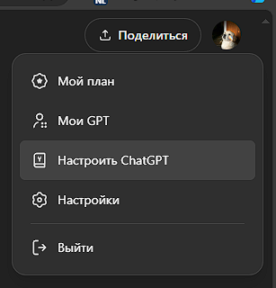

### Рекомендации по пользовательским настройкам

**Укажите информацию о себе:**
1. **Ваш уровень знаний и опыт:**  
   Укажите, студент вы, профессионал или новичок.  
   _Пример:_  
   `Я студент технического вуза, изучаю программирование на языке Python.`
   
2. **Ваши цели и задачи:**  
   Опишите, зачем вам нужен ChatGPT.  
   _Пример:_  
   `Хочу получить помощь в понимании сложных концепций и решении практических задач по программированию.`
   
3. **Области интересов:**  
   Укажите темы, которые вам интересны.  
   _Пример:_  
   `Интересуюсь разработкой веб-приложений и алгоритмами.`


**Настройки ответов:**
1. **Язык общения:**  
   Укажите, на каком языке хотите получать ответы.  
   _Пример:_  
   `Пожалуйста, отвечайте на русском языке.`
   
2. **Стиль и тон:**  
   Определите стиль общения: формальный, дружелюбный и т. д.  
   _Пример:_  
   `Предпочитаю дружелюбный и понятный стиль общения, без излишнего использования технического жаргона.`
   
3. **Форматирование и структура:**  
   Укажите, как структурировать ответы.  
   _Пример:_  
   `Пожалуйста, предоставляйте пошаговые инструкции и примеры кода.`
   
4. **Длина ответа:**  
   Уточните, хотите ли вы краткие или развернутые ответы.  
   _Пример:_  
   `Хотелось бы получать подробные объяснения для глубокого понимания.`


**Пример желаемого ответа:**
1. **Ясный и понятный:**  
   Ответ должен быть изложен простым языком. Попросите объяснять сложные термины.  

2. **Содержательный и точный:**  
   Попросите избегать избыточной информации и отвечать прямо на вопрос.

3. **Структурированный:**  
   Укажите, что ответы должны содержать заголовки, списки или шаги для лучшего восприятия.  

4. **С примерами:**  
   Попросите включать примеры, особенно кода, с пояснениями.  

**Файл настроек:**  
Вы можете скопировать пример настроек из файла [text.txt](./text.txt)

---

## Лайфхаки при использовании

1. **Создавайте новый чат для новой темы:**  
   - Не смешивайте разные темы в одном чате — это снижает качество ответов.  
   - Если ответ вас не устроил, уточняйте запрос в текущем чате, а не создавайте новый.  

   _Пример:_  
`Если вы обсуждаете программирование, продолжайте диалог в текущем чате. Для обсуждения рецептов начните новый чат.`

2. **Проверяйте факты:**  
   - Не доверяйте информации ChatGPT на 100%.  
   - Всегда проверяйте полученные данные через надежные источники.  
   - На официальном сайте OpenAI указано, что модель может предоставлять некорректные данные.

---

## Запросы

Промпт ― это задание для нейросети, сформулированное на естественном языке. Представьте, что ставите задачу ассистенту: подробно опишите, чего вы хотите, и предоставьте необходимые данные.

**Структура идеального промпта:**
1. **Цель** — чего вы хотите достичь.  
2. **Задача** — что конкретно должен сделать ChatGPT.  
3. **Контекст и детали** — сопутствующая информация для точного ответа.  
4. **Роль** — роль, в которой должен выступить бот.  
5. **Лимиты** — ограничения на формат ответа.

**Пример идеального промпта:**

> Цель: написать функцию для сортировки массива.  
> Задача: функция должна принимать массив чисел и возвращать отсортированный массив.  
> Контекст: массив может быть пустым или содержать повторяющиеся числа.  
> Роль: выступи в роли опытного Python-разработчика.  
> Лимит: предоставь функцию и краткое объяснение.

Более подробно про промпты можно прочитать здесь: [Habr](https://habr.com/ru/articles/765126/).

Во вкладке "Обзор GPT" можно посмотреть и использовать другие модели, которые уже настроены под конкретные задачи и языки программирования.  
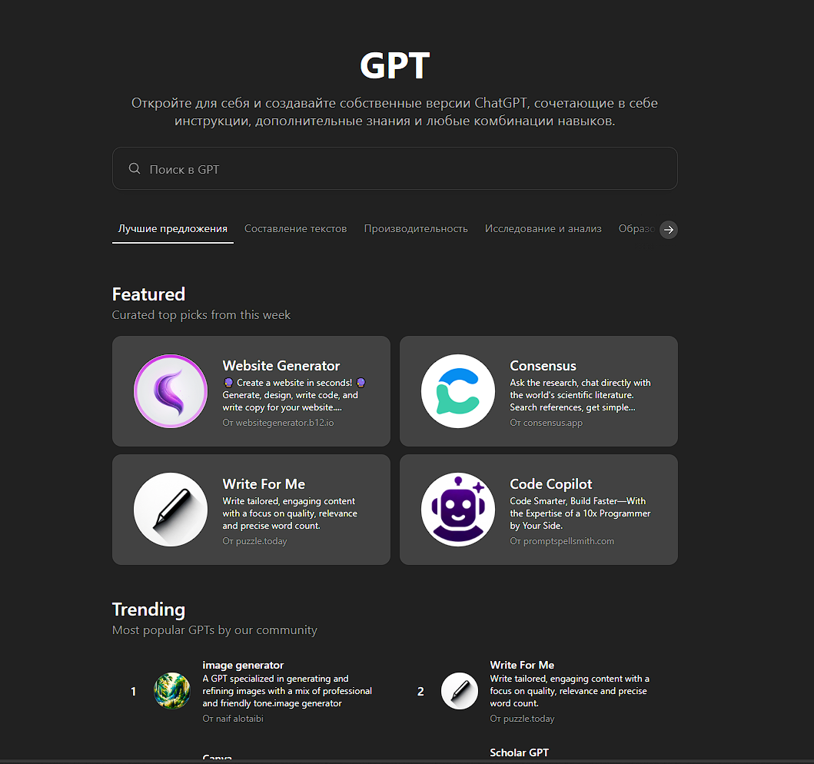

---

## Пример на Redux

Теперь покажу примеры плохих и хороших запросов. Попробуем создать сайт на React и подключить к нему Redux.

### 1. Создание приложения на React

**Первый запрос:**  
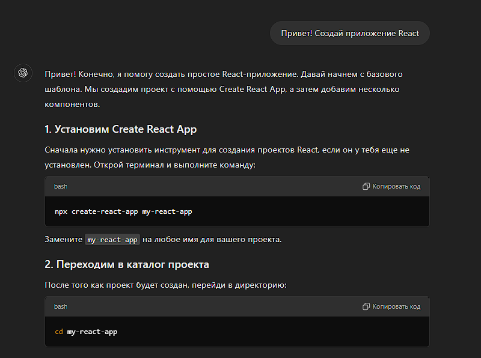  
Чат выдал **плохой ответ**: он не указал, как установить необходимые библиотеки и Node.js.  

**Правильный запрос:**  
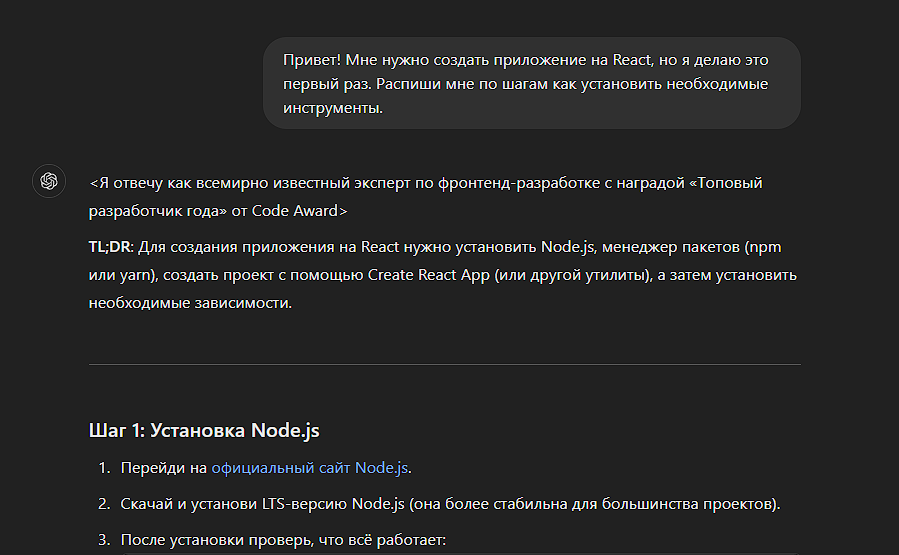  
Чат предоставил подробную пошаговую инструкцию по инициализации проекта.  

**Результат:**   
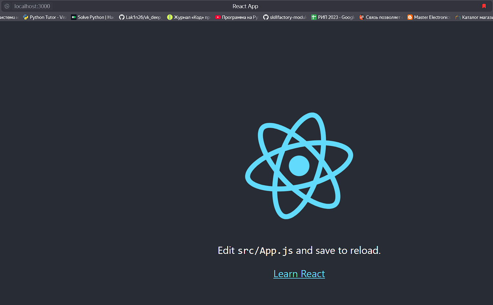  

---

### 2. Создание страницы с инпутом и кнопкой

**Хороший запрос:**  
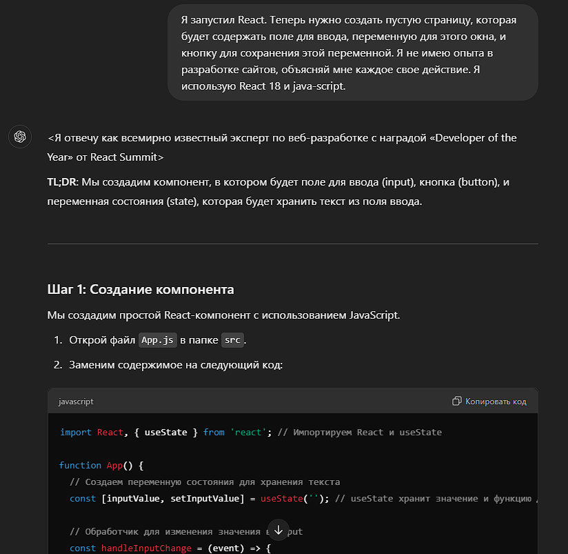  
- Указаны технологии (React, CSS).  
- Детально описана задача.  
- В ответе структурированный план действий.  

**Результат:**  
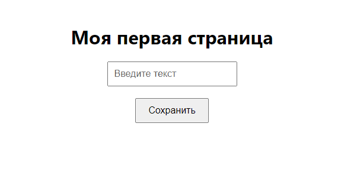  


**Плохой запрос:**  
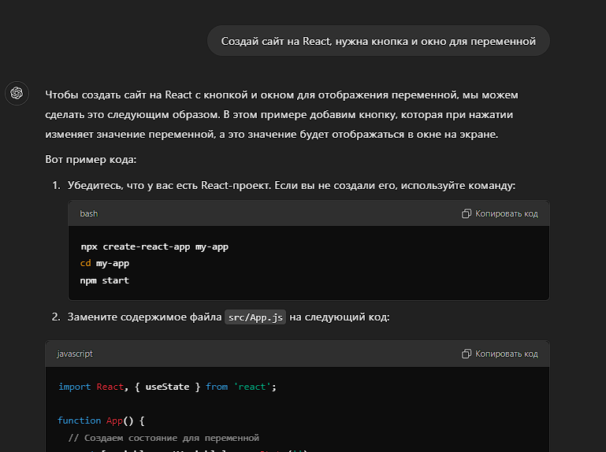  
- Ответ был сухим.  
- Код оказался неполным и с пробелами.  

**Результат:**  
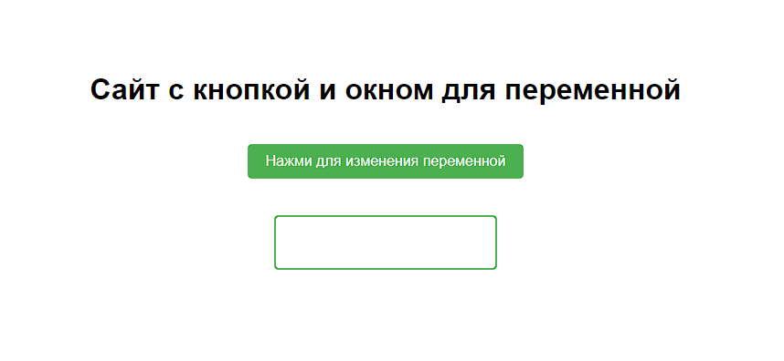  

---

### 3. Подключение Redux

**Запрос:**  
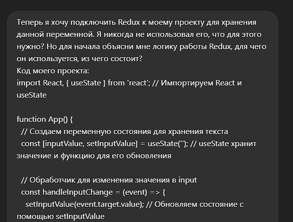  
Чат предоставил подробные разъяснения с кодом.  
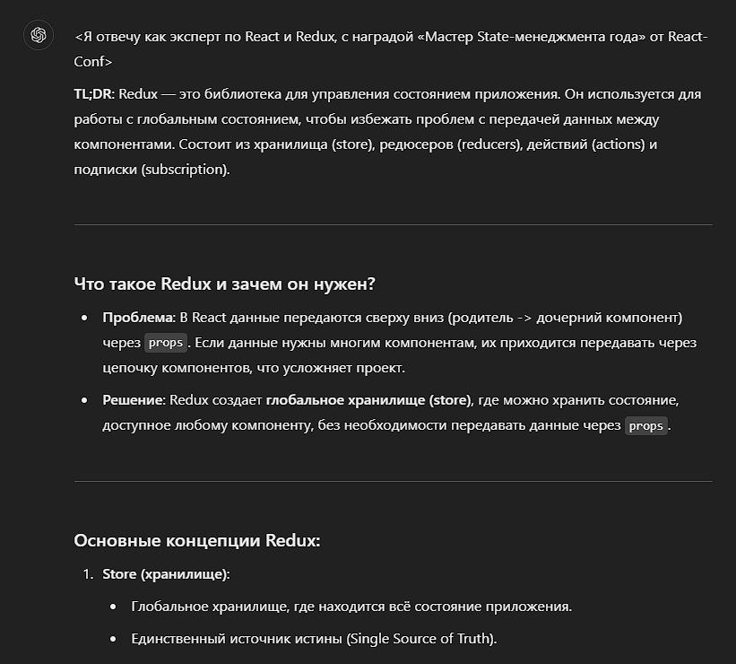 

Пример `ReduxSlice` полученного в ответ от `ChatGPT`:  
```javascript
import { configureStore, createSlice } from '@reduxjs/toolkit';

// Создаем срез состояния (slice)
const inputSlice = createSlice({
  name: 'input',
  initialState: { value: '' },
  reducers: {
    setInputValue: (state, action) => {
      state.value = action.payload; // Обновляем состояние
    },
  },
});

// Экспортируем действия
export const { setInputValue } = inputSlice.actions;

// Создаем хранилище
const store = configureStore({
  reducer: {
    input: inputSlice.reducer,
  },
});

export default store;
```
Как видим, чат справился с задачей, и через **Redux DevTools** можно отследить срабатывание `dispatch`:  
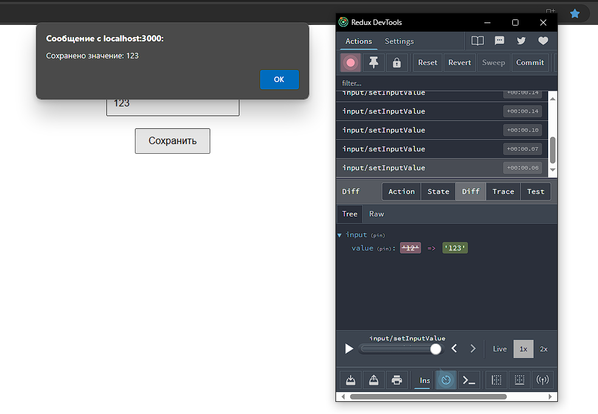

Если задать чату плохой запрос, то он выдаст ответ, который совсем не соответствует задаче:  


Без кода GPT выдал редьюсеры с `Increment` и `Decrement`, которые нам вовсе не нужны.


## Заключение

Следуя этой методичке, вы сможете эффективно использовать ChatGPT для решения учебных задач, анализа кода и освоения новых технологий. Не бойтесь экспериментировать с настройками и запросами, чтобы максимально адаптировать чат под свои нужды.
