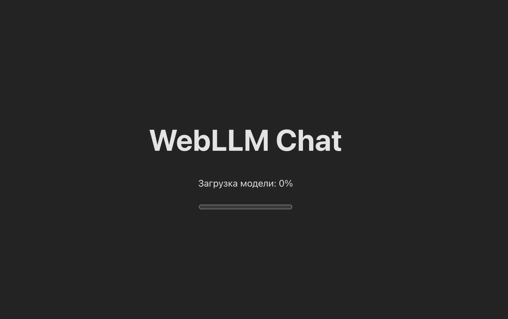
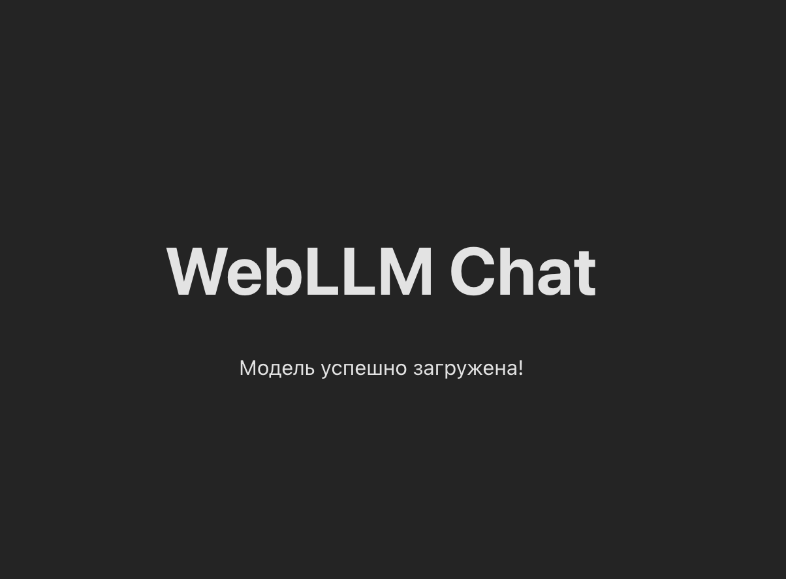
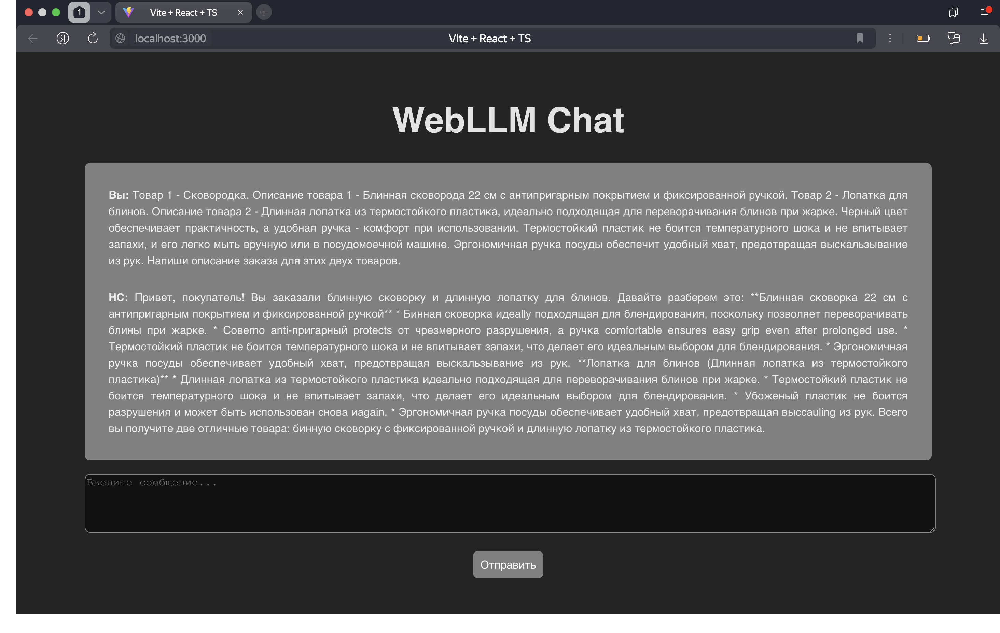

# Добавление нейронной сети в проект

## WebLLM
WebLLM - пакет JavaScript, который позволяет запускать LLM прямо в браузере. Данный пакет использует WebGPU - JavaScript API, предназначенный для работы с компьютерной графикой. 

Познакомиться можно по ссылке - https://chat.webllm.ai/

## Добавление WebLLM в React-проект
### 1. Установка библиотеки
Необходимо установить библиотеку для работы с WebLLM
```bash
npm install @mlc-ai/web-llm
```
### 2. Структура проекта
Разделим логику работы с нейронной сетью (НС) на компоненты. Структура проекта будет выглядить следующим образом:
```
src/
├── components/
│   ├── llm/ 
│   │    ├── Message.tsx
│   │    ├── ChatWindow.tsx
│   │    ├── ModelLoader.tsx
│   └────└── InputArea.tsx
├── hooks/
│   └── useWebLLM.tsx  
├── LlmTypes.tsx
├── Llm.tsx
└── Llm.css

```
### 3. Инициализация НС

#### 3.1. Создание хука
Создадим отдельный хук для инициализации НС. По умолчанию будем использовать модель ``Llama-3.2-1B-Instruct``. 

Выбрать модель можно по этой ссылке - https://huggingface.co/mlc-ai. В данном репозитории модели лежат в формате, который обрабатывает WebLLM библиотека.

  Запишем в ``hooks/llm/useWebLLM.tsx`` следующий код:

```TypeScript
import { useState, useEffect } from 'react';
import { CreateMLCEngine, MLCEngine } from '@mlc-ai/web-llm'; // Импорт фабрики создания движка и самого движка
import type { InitProgressReport } from '@mlc-ai/web-llm'; // Импорт типа отчета по прогрессу загрузки

// В параметрах - id модели с huggingface
const useWebLLM = (model: string = 'Llama-3.2-1B-Instruct-q4f16_1-MLC') => {
  const [engine, setEngine] = useState<MLCEngine | null>(null); // Сохранение инстанса модели
  const [progress, setProgress] = useState<number>(0); // Сохранение прогресса загрузки модели
  const [error, setError] = useState<string | null>(null); // Сохранение ошибки
  const [isLoading, setIsLoading] = useState<boolean>(true); // Сохранение состояния загрузки

  useEffect(() => {
    const initEngine = async () => {
      try {
        setIsLoading(true);
        setError(null);
        // Инициализация модели
        const engineInstance = await CreateMLCEngine(model, {
          initProgressCallback: (report: InitProgressReport) => { // Инициализируем прогресс загрузки модели
            setProgress(report.progress);
          }
        });
        
        setEngine(engineInstance); // Запись инстанса в состояние
      } catch (err) {
        console.error('Ошибка инициализации модели:', err);
        setError('Не удалось загрузить модель. Пожалуйста, попробуйте позже.');
      } finally {
        setIsLoading(false);
      }
    };

    initEngine();
  }, [model]);

  // Возвращаем движок с загруженной моделью, прогресс загрузки, ошибку и статус загрузки
  return { engine, progress, error, isLoading };
};

export default useWebLLM;
```

API WebLLM доступно через интерфейс ``MLCEngine``. Будем создавать экземпляр движка через фабрику ``CreateMLCEngine``.

Инициализируем модель при открытии странице (в ``useEffect()``) и прокидываем ее инстанс в ``state``. Также обернем весь код в блок ``try/catch`` для отлова ошибки.

#### 3.2. Отображение состояния загрузки

В отдельном компоненте пропишем отображение состояния загрузки модели. Запишем следующий код в ``components/llm/ModelLoader.tsx``:

```TypeScript
import type { FC } from 'react';
import { Container } from "react-bootstrap";

interface ModelLoaderProps {
  progress: number;
}

const ModelLoader: FC<ModelLoaderProps> = ({ progress }) => (
  <Container className="loading">
    <p>Загрузка модели: {(progress * 100).toFixed(0)}%</p>
    <progress value={progress} max={1} />
  </Container>
);

export default ModelLoader;
```

#### 3.3. Добавление на страницу

Добавим вызов хука и отображения состояния загрузки модели в ``Llm.tsx`` (Необходимо предварительно добавить роут для данной страницы):

```TypeScript
import type { FC } from 'react';
import './Llm.css';
import { Container } from "react-bootstrap";
import useWebLLM  from './hooks/llm/useWebLlm';
import ModelLoader from './components/llm/ModelLoader';

const LlmPage: FC = () => {
  // Вызываем хук, для инициализации модели  
  const { engine, progress, error, isLoading: modelLoading } = useWebLLM(); // В параметрах хука можно указать id модели с huggingface, которую вы выберите

  return (
    <Container>
      <h1>WebLLM Chat</h1>
      
      {modelLoading ? (
        <ModelLoader progress={progress} /> // Подключаем компонент прогресса загрузки
      ) : error ? (
        <div className="error">
          <p>{error}</p>
          <p>Попробуйте перезагрузить страницу</p>
        </div>
      ) : (
        <>
          <p>Модель успешно загружена!</p>
        </>
      )}
    </Container>
  );
};

export default LlmPage;
```

При открытие страницы должен появиться прогресс-бар:



После того, как модель загрузится появится надпись "Модель успешно загружена!"



### 4. Логика работы с нейронной сетью

Пропишем логику взаимодействия с нейронной сетью.

#### 4.1. Добавление общего типа

Вынесем общий тип для работы с НС в отдельный файл ``LlmTypes.tsx``:
```TypeScript
export type ChatMessage = {
  role: 'user' | 'system' | 'assistant';
  content: string;
};
```
Есть три роли: пользователь (user), НС (assistant) и система (system), в которой можно указать инструкции по генерации ответа. В ``content`` будем записывать промпт от пользователя или ответ от нейронной сети (либо системное дополнение).

#### 4.2. Добавление обработчика

Добавим обработчик для логики работы с НС в ``Llm.tsx``:

```TypeScript
  const [messages, setMessages] = useState<ChatMessage[]>([]); // Сохранение сообщений
  const [input, setInput] = useState(''); // Сохранение промпта
  const [loading, setLoading] = useState(false); // Сохранение состояния генерации

  // Инициализация модели с прошлого пункта
  const { engine, progress, error, isLoading: modelLoading } = useWebLLM();

  const handleSend = async () => {
    if (!input.trim() || !engine) return; // Если нет запроса или не загружена модель, то выходим из обработки

    // Определяем промпт от пользователя
    const newMessages: ChatMessage[] = [ // ChatMessage - наш собственный тип
      { role: "system", content: "You are a helpful AI assistant." }, // Системный промпт, можно задать инструкцию для генерации ответа
      { role: 'user', content: input }
    ];

    // Запоминаем сообщение, обнуляем вход и ставим флаг генерации 
    setMessages(newMessages);
    setInput('');
    setLoading(true);

    try {
        const chatRequest: ChatCompletionMessageParam[] = newMessages;

        // Запускаем генерацию ответа с параметрами
        const stream = await engine.chat.completions.create({
            messages: chatRequest, // Промпт от пользователя
            temperature: 0.1, // Параметр вариативности ответа: низкая температура оставляет только токены с высокими вероятностями
            top_p: 0.9, // Коэффициент случайности и разнообразия
            max_tokens: 2000, // Максимальное кол-во токенов
            frequency_penalty: 0.5, // Штраф за частоту
            presence_penalty: 0.3, // Штраф за повторения
            stream: true // Флаг для потокового вывода сообщений 
        });

        // По мере поступления текста добавляем его в ответ от НС
        let reply = '';
        for await (const chunk of stream) {
            reply += chunk.choices?.[0]?.delta?.content || '';
            setMessages([
                ...newMessages,
                { role: 'assistant', content: reply }
            ]);
        }
    } catch (error) {
        console.error('Ошибка генерации:', error);
        setMessages([
          ...newMessages,
          { role: 'assistant', content: 'Извините, произошла ошибка генерации' },
        ]);
    } finally {
        setLoading(false);
    }
```

В данном коде происходит обработка промпта с параметрами модели и потоковый вывод сообщения пользователю.

Чтобы выводить ответ только когда он будет полностью готов нужно изменить код в блоке ``try``:

```TypeScript
const chatRequest: ChatCompletionMessageParam[] = newMessages;

// Убираем флаг потокового вывода
const reply = await engine.chat.completions.create({
    messages: chatRequest,
    temperature: 0.1,
    top_p: 0.9,
    max_tokens: 2000,
    frequency_penalty: 0.5,
    presence_penalty: 0.3
});

// После генерации ответа записываем результат в state
setMessages([
    ...newMessages,
    { role: 'assistant', content: reply.choices[0].message.content ?? '' }
]);
```

Такой обработчик можно также использовать в случае необходимости неявной генерации.

#### 4.3. Добавление отображения сообщений

Добавим несколько компонентов для ввода промпта и вывода ответа от НС.

Добавим компонент для ввода промпта в ``components/llm/InputArea.tsx``:

```TypeScript
import type { FC } from 'react';
import { Button } from "react-bootstrap";

// Определяем интерфейс для входных параметров
interface InputAreaProps {
  input: string;
  loading: boolean;
  onInputChange: (value: string) => void;
  onSend: () => void;
}

const InputArea: FC<InputAreaProps> = ({ 
  input, 
  loading, 
  onInputChange, 
  onSend 
}) => (
  <> 
    <textarea
      rows={3}
      placeholder="Введите сообщение..."
      value={input}
      onChange={(e) => onInputChange(e.target.value)}
    />
    <Button onClick={onSend} disabled={loading || !input.trim()}>
      {loading ? 'Генерация...' : 'Отправить'}
    </Button>
  </>
);

export default InputArea;
```

Добавим компонент для отображения введенного промпта или ответа от НС в ``components/llm/Message.tsx``:

```TypeScript
import type { FC } from 'react';
import type { ChatMessage } from '../../LlmTypes';
import { Container } from "react-bootstrap";

// В интерфейсе входной параметр из нашего типа
interface MessageProps {
  msg: ChatMessage;
}

const Message: FC<MessageProps> = ({ msg }) => (
  <Container className={`msg ${msg.role}`}>
    <strong>{msg.role === 'user' ? 'Вы' : 'НС'}: </strong>
    {msg.content}
  </Container>
);

export default Message;
```

Добавим компонент для окна чата в ``components/llm/ChatWindow.tsx``:

```TypeScript
import type { FC } from 'react';
import type { ChatMessage } from '../../LlmTypes';
import Message from './Message';
import { Container } from "react-bootstrap";

// Также сообщения передаются в нашем типе
interface ChatWindowProps {
  messages: ChatMessage[];
}

const ChatWindow: FC<ChatWindowProps> = ({ messages }) => (
  <Container className="chat-window">
    {messages.filter(msg => msg.role !== 'system').map((msg, idx) => (
      <Message key={idx} msg={msg} />
    ))}
  </Container>
);

export default ChatWindow;
```

Добавим все компоненты в ``Llm.tsx``:

```TypeScript
import ChatWindow from './components/llm/ChatWindow';
import ModelLoader from './components/llm/ModelLoader';
import InputArea from './components/llm/InputArea';

...

return (
    <Container>
      <h1>WebLLM Chat</h1>
      
      {modelLoading ? (
        <ModelLoader progress={progress} />
      ) : error ? (
        <div className="error">
          <p>{error}</p>
          <p>Попробуйте перезагрузить страницу</p>
        </div>
      ) : (
        <>
          <ChatWindow messages={messages} /> // Отображение чата
          <InputArea // Поле ввода от пользователя
            input={input}
            loading={loading}
            onInputChange={setInput}
            onSend={handleSend}
          />
        </>
      )}
    </Container>
  );
```

### 5. Итоговый файл и добавление стилей

Итоговый вариант ``Llm.tsx``:

```TypeScript
import { useState } from 'react';
import type { FC } from 'react';
import './Llm.css';
import type { ChatCompletionMessageParam } from '@mlc-ai/web-llm';
import { Container } from "react-bootstrap";
import useWebLLM  from './hooks/llm/useWebLlm';

import ChatWindow from './components/llm/ChatWindow';
import ModelLoader from './components/llm/ModelLoader';
import InputArea from './components/llm/InputArea';
import type { ChatMessage } from './LlmTypes';

const LlmPage: FC = () => {
  const [messages, setMessages] = useState<ChatMessage[]>([]);
  const [input, setInput] = useState(''); 
  const [loading, setLoading] = useState(false);

  const { engine, progress, error, isLoading: modelLoading } = useWebLLM();

  const handleSend = async () => {
    if (!input.trim() || !engine) return;

    const newMessages: ChatMessage[] = [
      { role: "system", content: "You are a helpful AI assistant." },
      { role: 'user', content: input }
    ];

    setMessages(newMessages);
    setInput('');
    setLoading(true);

    try {
        const chatRequest: ChatCompletionMessageParam[] = newMessages;

        const stream = await engine.chat.completions.create({
            messages: chatRequest,
            temperature: 0.1,
            top_p: 0.9,
            max_tokens: 2000,
            frequency_penalty: 0.5,
            presence_penalty: 0.3,
            stream: true
        });

        let reply = '';
        for await (const chunk of stream) {
            reply += chunk.choices?.[0]?.delta?.content || '';
            setMessages([
                ...newMessages,
                { role: 'assistant', content: reply }
            ]);
        }
    } catch (error) {
        console.error('Ошибка генерации:', error);
        setMessages([
          ...newMessages,
          { role: 'assistant', content: 'Извините, произошла ошибка генерации' },
        ]);
    } finally {
        setLoading(false);
    }
  };

  return (
    <Container>
      <h1>WebLLM Chat</h1>
      
      {modelLoading ? (
        <ModelLoader progress={progress} />
      ) : error ? (
        <div className="error">
          <p>{error}</p>
          <p>Попробуйте перезагрузить страницу</p>
        </div>
      ) : (
        <>
          <ChatWindow messages={messages} />
          <InputArea
            input={input}
            loading={loading}
            onInputChange={setInput}
            onSend={handleSend}
          />
        </>
      )}
    </Container>
  );
};

export default LlmPage;
```

Добавим стилей в ``Llm.css``:

```css
.llm {
  max-width: 100%;
  margin: auto;
  font-family: sans-serif;
  padding: 20px;
}

.chat-window {
  max-height: 400px;
  overflow-y: auto;
  background: gray;
  padding: 20px;
  margin-bottom: 20px;
  border-radius: 8px;
}

.msg {
  padding: 15px;
  border-radius: 12px;
  line-height: 1.5;
  position: relative;
  text-align: justify;
}

textarea {
  width: 100%;
  align-self: center;
  font-size: 1rem;
  resize: vertical;
  border-radius: 8px;
  min-height: 80px;
}

button {
  margin-top: 20px;
  padding: 10px;
  font-size: 16px;
  background-color: gray;
  color: #fff;
}
```

В итоге получаем следующую страницу с тестовым промптом:




### 6. Полезные ссылки

- [Модели для локального использования с WebLLM](https://huggingface.co/mlc-ai)
- [WebLLM Chat](https://chat.webllm.ai/)
- [Документация WebLLM](https://webllm.mlc.ai/docs/index.html)
