# Методические указания по выполнению домашнего задания для платформы Android

### Команда курса благодарит Низовцева Романа Александровича за активное участие в подготовке данного руководства.

# План

1. Создание проекта
2. Структура проекта
3. Создание разметки главной Activity
4. Создание шаблона элементов
5. Реализация запросов к API
6. Создание POJO класса
7. Демонстрация полученных данных пользователю
8. Запуск локального сервера
9. Создание второй активити

# Создание проекта

Создаем новый проект в `Android Studio`. В качестве шаблона выбираем `Empty Activity`.


Указываем путь и имя. `Minimum SDK` оставляем без изменений. Язык: `java`. Завершаем создание проекта.

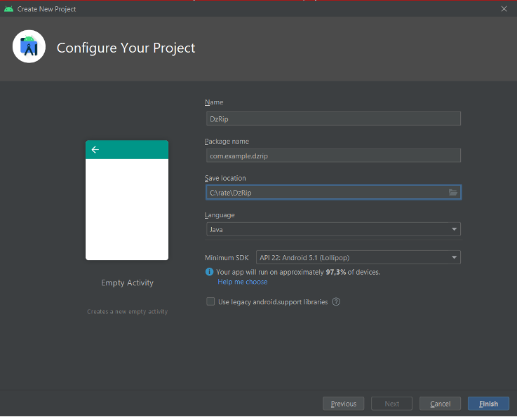

# Структура проекта

Проект создан. У нас сразу открываются файлы `MainActivity.java` и `activity_main.xml`. Оба файла относятся к главной и пока единственной странице нашего приложения `(Activity)`. 
`MainActivity.java` –программная часть. В этом файле мы будем писать код на языке `java`. 
`activity_main.xml` – визуальная часть. В этом файле мы будем работать с `xml` разметкой (добавлять элементы, с которыми пользователь будет взаимодействовать).

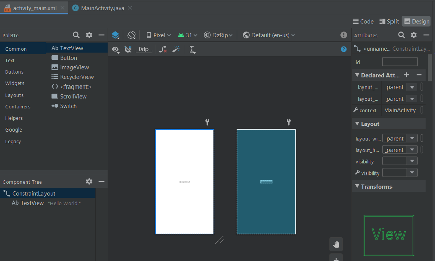

Посмотрим на структуру проекта:

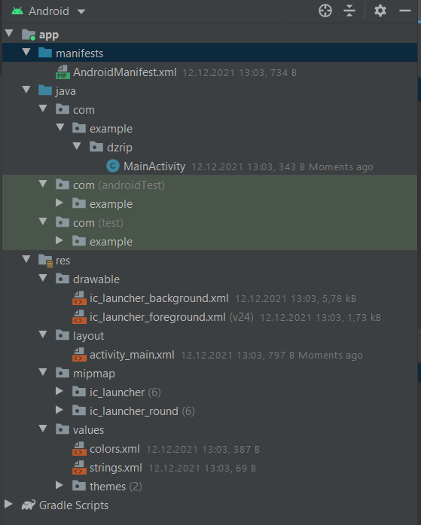

`AndroidManifest.xml` - это необходимый файл в любом проекте. Он определяет глобальные значения для вашего пакета, в нем вы описываете, что находится внутри вашего приложения - деятельности, сервисы и т.д.
`Res-папка`, где хранятся все ресурсы приложения.
`Layout` - папка с файлами разметки `Активити`.

# Создание разметки главной Activity

Перейдем к файлу `activity_main.xml`, добавим элемент `ScrollView` c параметрами высоты и ширины : `match_parent`. В таком случае элемент займет всю площадь экрана.
Внутри ScrollView присутствует `LinearLayout`. Зададим ему `id: linear_main`

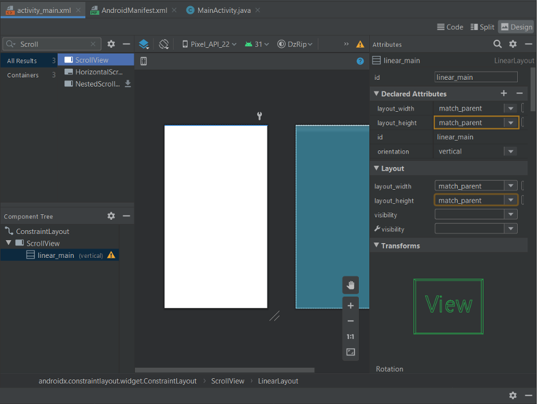

# Создание шаблона элементов

Создаем новый `layout-файл`, кликнув по папке с соответствующим названием правой кнопкой мыши `New->Layout Resource File` и называем его `item_view`. 
Добавляем на экран `LinearLayout` c параметрами ширины и высоты: `match_parent`. Внутрь кладем элементы `ImageView` и три `TextView`.
Код разметки:

```xml
<?xml version="1.0" encoding="utf-8"?>
<androidx.constraintlayout.widget.ConstraintLayout xmlns:android="http://schemas.android.com/apk/res/android"
    android:layout_width="match_parent"
    android:layout_height="wrap_content"
    android:layout_marginTop="8dp"
    xmlns:app="http://schemas.android.com/apk/res-auto">
        <LinearLayout
            android:layout_width="match_parent"
            android:layout_height="match_parent"
            android:orientation="vertical"
            android:background="#FF6200EE"
            >

            <ImageView
                android:id="@+id/imageView2"
                android:layout_width="match_parent"
                android:layout_margin="8dp"
                android:layout_height="200dp"
                 />

            <TextView
                android:id="@+id/title"
                android:layout_width="wrap_content"
                android:layout_height="wrap_content"
                android:layout_gravity="center_horizontal"
                android:text="Заголовок"
                android:textColor="@color/white"
                android:textStyle="bold"
                android:textSize="28dp" />

            <TextView
                android:id="@+id/descr"
                android:layout_width="wrap_content"
                android:layout_marginTop="8dp"
                android:layout_height="wrap_content"
                android:layout_marginStart="8dp"
                android:text="Описание"
                android:textColor="@color/white"
                android:textStyle="bold"
                android:textSize="16dp" />

            <TextView
                android:id="@+id/version"
                android:layout_width="wrap_content"
                android:layout_marginTop="8dp"
                android:layout_marginStart="8dp"
                android:layout_height="wrap_content"
                android:text="Версия"
                android:textColor="@color/white"
                android:textStyle="bold"
                android:textSize="18dp" />
        </LinearLayout>
</androidx.constraintlayout.widget.ConstraintLayout>
```

# Реализация запросов к API

Для выполнения запросов к `API` будем использовать `REST` клиент для `Java` и `Android Retrofit 2`. 

Настройка `Retrofit`
Добавьте следующую зависимость в файл `build.gradle (app)`:
`implementation 'com.squareup.retrofit2:retrofit:2.4.0'`
Мы будем использовать Gson для преобразования `JSON` в `POJO. Retrofit` предоставляет зависимость, которая автоматически конвертирует `JSON` в `POJO`. Для этого добавьте ещё одну зависимость в файл `build.gradle`:
`implementation 'com.squareup.retrofit2:converter-gson:2.3.0'`
Добавьте разрешение на работу с сетью в файл `AndroidManifest`:
`<uses-permission android:name="android.permission.INTERNET"/>`
После того, как зависимости добавлены, нам необходимо написать код для настройки библиотеки `Retrofit`.
Создайте класс с именем `NetworkService`:

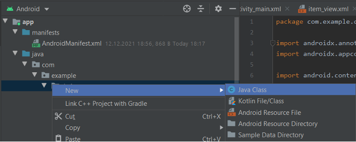

Этот класс должен быть `singleton-объектом`, поэтому объявляем статическую переменную и функцию, которая создаёт и возвращает переменную того же типа, что и класс. Объявим и инициализируем `Retrofit` в конструкторе `NetworkService`:
Получаем следующее:

```java
public class NetworkService {
    private static NetworkService mInstance;
    private static final String BASE_URL = "http://192.168.100.108:8000";
    private Retrofit mRetrofit;

    private NetworkService() {
        mRetrofit = new Retrofit.Builder()
                .baseUrl(BASE_URL)
                .addConverterFactory(GsonConverterFactory.create())
                .build();
    }

    public static NetworkService getInstance() {
        if (mInstance == null) {
            mInstance = new NetworkService();
        }
        return mInstance;
    }
    
}
```

# Создание POJO класса

`POJO` класс – класс объекты которого будут создаваться из полученного `json`. Основу составляют переменные, геттеры и сеттеры. 
Наше `API` имеет следующий вид:

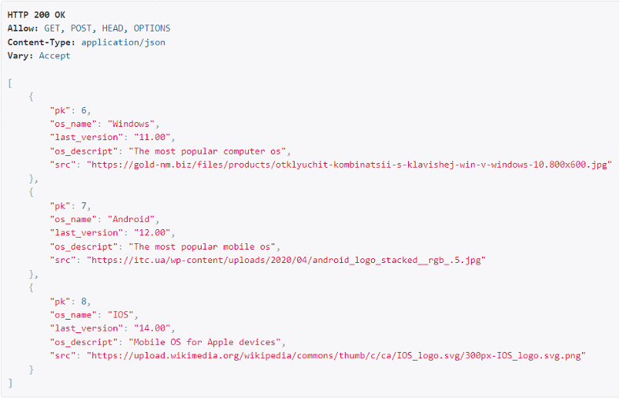

Для него `Pojo` класс будет следующим:

```java
public class Post {
    @SerializedName("pk")
    @Expose
    private int pk;
    @SerializedName("os_name")
    @Expose
    private String osName;
    @SerializedName("last_version")
    @Expose
    private float lastVersion;
    @SerializedName("os_descript")
    @Expose
    private String osDescript;
    @SerializedName("src")
    @Expose
    private String src;

    public int getPk() {
        return pk;
    }

    public String getOsName() {
        return osName;
    }

    public float getLastVersion() {
        return lastVersion;
    }

    public String getOsDescript() {
        return osDescript;
    }

    public String getSrc() {
        return src;
    }

}
```

Подобно классу создаем интерфейс `JSONPlaceHolderApi`. Он будет определять конечную точку запроса к `API`. 

```java
public interface JSONPlaceHolderApi {
    @GET("/os")
    public Call<List<Post>> getAllPosts();
}
```

Теперь нам нужно, чтобы `Retrofit` предоставил реализацию интерфейса `JSONPlaceHolderApi`. Для этого используем метод `create()`:

```java
public class NetworkService {
    private static NetworkService mInstance;
    private static final String BASE_URL = "http://192.168.100.108:8000";
    private Retrofit mRetrofit;

    private NetworkService() {
        mRetrofit = new Retrofit.Builder()
                .baseUrl(BASE_URL)
                .addConverterFactory(GsonConverterFactory.create())
                .build();
    }

    public static NetworkService getInstance() {
        if (mInstance == null) {
            mInstance = new NetworkService();
        }
        return mInstance;
    }
    public JSONPlaceHolderApi getJSONApi() {
        return mRetrofit.create(JSONPlaceHolderApi.class);
    }
}
```

Добавим в `MainActivity.java` отправление запроса:

```java
NetworkService.getInstance()
        .getJSONApi()
        .getAllPosts()
        .enqueue(new Callback<List<Post>>() {
            @Override
            public void onResponse(@NonNull Call<List<Post>> call, @NonNull Response<List<Post>> response) {
                List<Post> postList = response.body();

                //Запрос успешно получен, в postList лежат объекты класса Post из нашего Api
                }

            }

            @Override
            public void onFailure(@NonNull Call<List<Post>> call, @NonNull Throwable t) {

             //Что-то пошло не так…
                t.printStackTrace();
            }
        });
```

# Демонстрация полученных данных пользователю

Добавим в `build.gradle (app)` зависимости:

```java
implementation 'com.github.bumptech.glide:glide:4.11.0'
annotationProcessor 'com.github.bumptech.glide:compiler:4.11.0'
```

Создадим функцию `addCardView(Post post, int i)` в классе `MainActivity`

```java
public void addCardView(Post post, int i) {

//Преобразование лаяута шаблона в элемент типа View
    final View view = getLayoutInflater().inflate(R.layout.item_view, null); 


//Создание Layout Params для настройки отступов от границ экрана.
    LinearLayout.LayoutParams params = new LinearLayout.LayoutParams(
            LinearLayout.LayoutParams.MATCH_PARENT,
            LinearLayout.LayoutParams.WRAP_CONTENT
    );
    params.setMargins(24, 0, 24, 24);

// Инициализация элементов шаблона
    TextView title = view.findViewById(R.id.title);
    TextView descr = view.findViewById(R.id.descr);
    TextView version = view.findViewById(R.id.version);
    ImageView image = view.findViewById(R.id.imageView2);

//Заполнение элементов шаблона из объекта post
    Glide.with(this).load(post.getSrc()).into(image);
    title.setText(post.getOsName());
    descr.setText(post.getOsDescript());
    version.setText(post.getLastVersion() + "");
    view.setLayoutParams(params);
//Создание Bundle объекта для передачи данных на другую страницу и добавление этого объекта в List 
    Bundle bundle = new Bundle();
    bundle.putString("os_name", post.getOsName());
    bundle.putString("os_descript", post.getOsDescript());
    bundle.putString("last_version", post.getLastVersion() + "");
    bundle.putString("src", post.getSrc());
    bundles.add(bundle);

// Установка тега с номером по списку этого шаблонного элемента
    view.setTag(i + "");

//Добавление слушателя нажатий 
    view.setOnClickListener(new View.OnClickListener() {
        @Override
        public void onClick(View view) {
	//Создание объекта Intent для открытия другой активити и передача данных туда. 

        }
    });

// Добавление заполненного шаблонного элемента в LinearLayout на главном экране. 
    linMain.addView(view);
}
```

Также необходимо создать вне метода `onCreate` переменные

```java
LinearLayout linMain;
ArrayList<Bundle> bundles;
```

и проинициализировать их внутри этого метода. 

```java
bundles = new ArrayList<>();
linMain = findViewById(R.id.linear_main);
```

Добавляем вызовы созданной ранее функции внутрь метода `onResponse(…)`

```java
for (int i = 0; i < postList.size(); i++) {
    addCardView(postList.get(i), i);
}
```

Таким образом, код класса `MainActivity`

```java
public class MainActivity extends AppCompatActivity {
    LinearLayout linMain;
    ArrayList<Bundle> bundles;

    @Override
    protected void onCreate(Bundle savedInstanceState) {
        super.onCreate(savedInstanceState);

        setContentView(R.layout.activity_main);
        bundles = new ArrayList<>();
        linMain = findViewById(R.id.linear_main);
        NetworkService.getInstance()
                .getJSONApi()
                .getAllPosts()
                .enqueue(new Callback<List<Post>>() {
                    @Override
                    public void onResponse(@NonNull Call<List<Post>> call, @NonNull Response<List<Post>> response) {
                        List<Post> postList = response.body();

                        for (int i = 0; i < postList.size(); i++) {
                            addCardView(postList.get(i), i);
                        }

                    }

                    @Override
                    public void onFailure(@NonNull Call<List<Post>> call, @NonNull Throwable t) {


                        t.printStackTrace();
                    }
                });
    }

    public void addCardView(Post post, int i) {
        final View view = getLayoutInflater().inflate(R.layout.item_view, null);
        LinearLayout.LayoutParams params = new LinearLayout.LayoutParams(
                LinearLayout.LayoutParams.MATCH_PARENT,
                LinearLayout.LayoutParams.WRAP_CONTENT
        );
        params.setMargins(24, 0, 24, 24);

        TextView title = view.findViewById(R.id.title);
        TextView descr = view.findViewById(R.id.descr);
        TextView version = view.findViewById(R.id.version);
        ImageView image = view.findViewById(R.id.imageView2);
        Glide.with(this).load(post.getSrc()).into(image);
        title.setText(post.getOsName());
        descr.setText(post.getOsDescript());
        version.setText(post.getLastVersion() + "");
        view.setLayoutParams(params);
        Bundle bundle = new Bundle();
        bundle.putString("os_name", post.getOsName());
        bundle.putString("os_descript", post.getOsDescript());
        bundle.putString("last_version", post.getLastVersion() + "");
        bundle.putString("src", post.getSrc());
        bundles.add(bundle);
        view.setTag(i + "");
        view.setOnClickListener(new View.OnClickListener() {
            @Override
            public void onClick(View view) {
                Intent intent = new Intent(MainActivity.this, DetailedActivity.class);
                intent.putExtras(bundles.get(Integer.parseInt(view.getTag().toString())));
                startActivity(intent);
            }
        });


        linMain.addView(view);
    }


}
```

# Запуск локального сервера
    
Добавляем в `settings` `django` проекта с `API`.

`ALLOWED_HOSTS = ["192.168.100.108", "localhost", "127.0.0.1"]` где 
`192.168.100.108` - `IPV4` нашего компьютера.

Запускаем из командной строки и папки проекта сервер

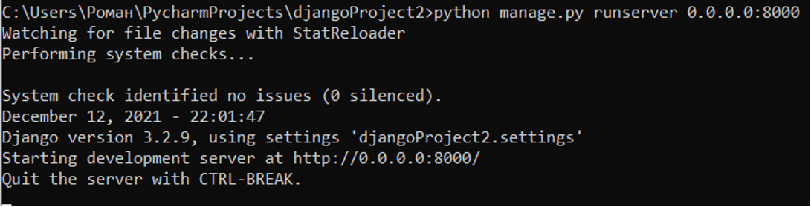
    
Меняем в классе `InternetService` переменную `BASE_URL`, подставляя свой `ipv4`. Порт оставляем тот же. 

```
"http://192.168.100.108:8000"  
```

Проверка работы
Запускаем предварительно установленный эмулятор(Рекомендуется `Pixel 4 API 26`)

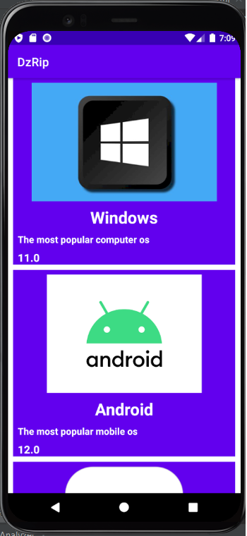
    
# Создание второй активити
    
Создадим Активити следующим образом:

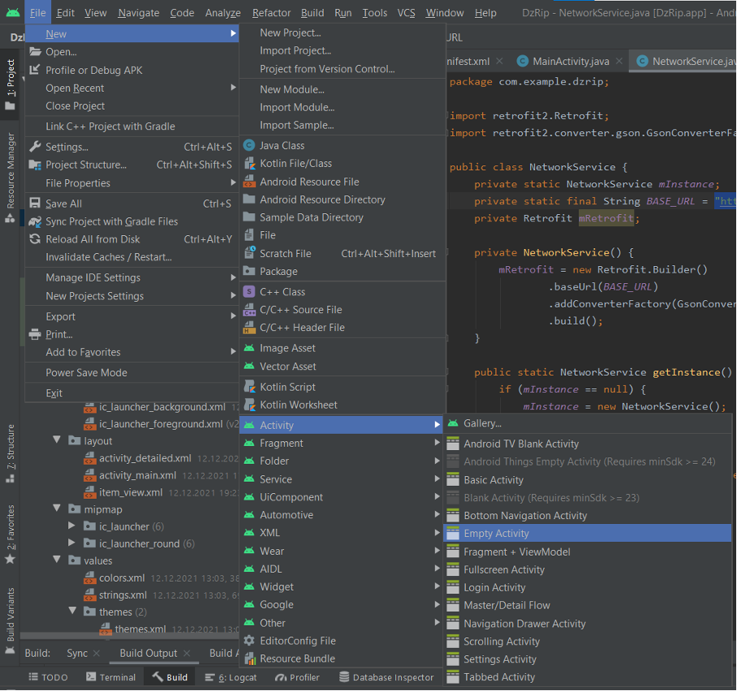
   
Назовем ее `DetailedActivity`.
Разметку сделайте самостоятельно, подобно этой:

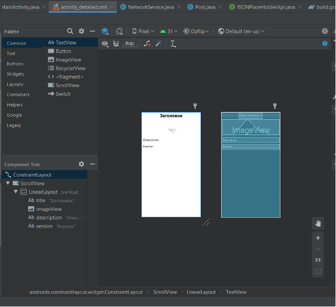
    
Добавим Создание объекта `Intent` для открытия другой активити и передача данных туда в обработчик нажатий на `MainActivity`:

```java
Intent intent = new Intent(MainActivity.this, DetailedActivity.class);
                intent.putExtras(bundles.get(Integer.parseInt(view.getTag().toString())));
                startActivity(intent);
```

И рассмотрим код `DetailedActivity`:
```java
public class DetailedActivity extends AppCompatActivity {

    @Override
    protected void onCreate(Bundle savedInstanceState) {
        super.onCreate(savedInstanceState);
        setContentView(R.layout.activity_detailed);
//Инициализация компонентов активити
        TextView title=findViewById(R.id.title);
        TextView description=findViewById(R.id.description);
        TextView version=findViewById(R.id.version);
        ImageView image=findViewById(R.id.imageView);
//Получение объекта Bundle и проверка получения.
        Bundle bundle =getIntent().getExtras();
        if(bundle!=null)
        { //Заполнение компонентов активити из Bundle.
	    Glide.with(this).load(bundle.getString("src")).into(image);
            title.setText(bundle.getString("os_name"));
            description.setText(bundle.getString("os_descript"));
            version.setText("Версия: "+bundle.getString("last_version"));

        }
    }
}
```

Теперь по нажатию на элементы главной активити будет открываться вторая активити с детальной информацией.

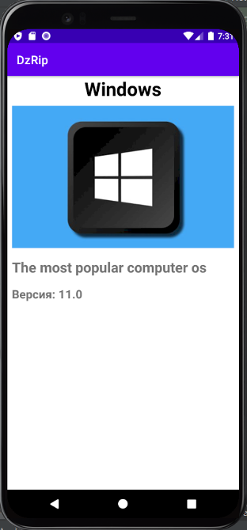
