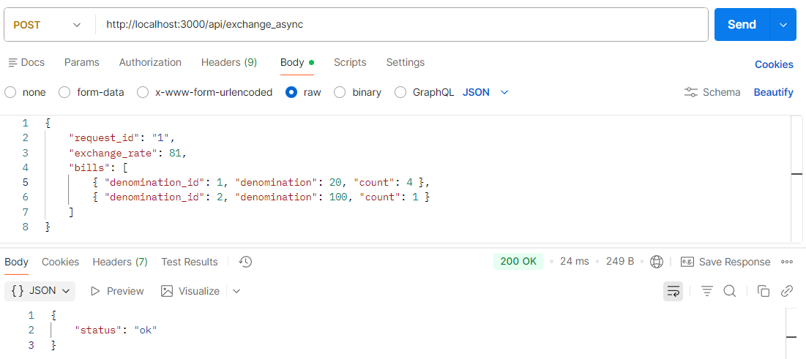
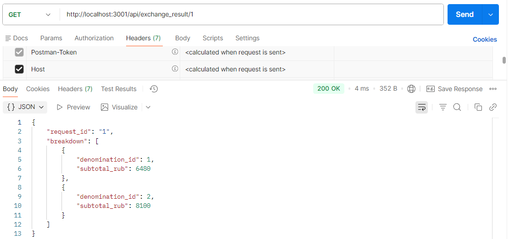

# Методические указания по Асинхронным сервисам

## Задачи:
- Создать асинхронный сервис для выполнения долгой задачи
- Показать межсервисное взаимодействие между новым сервисом и сервисом из прошлых лабораторных

## Создание приложения на NestJS

1.  **Подготовка окружения.** В начале работы необходимо удостовериться в наличии среды выполнения Node.js, проверив версию командой `node -v`; если команда не найдена, следует установить LTS-версию с официального сайта (https://nodejs.org/), после чего глобально инсталлировать утилиту CLI для управления проектами NestJS с помощью команды `npm i -g @nestjs/cli`.

2.  **Инициализация проекта.** Для развертывания базовой структуры приложения выполните в терминале команду `nest new async-service`, при появлении интерактивного запроса выберите пакетный менеджер **npm** (клавиша Enter), что приведет к созданию каталога `async-service` с необходимыми конфигурационными файлами.

3.  **Вход в рабочий каталог.** После успешного создания файлов проекта перейдите в его корневую директорию для выполнения дальнейших команд настройки, введя в терминале команду `cd async-service`.

4.  **Генерация компонентов.** Используя встроенный генератор кода, создайте модуль, контроллер и сервис для сущности "exchange" последовательным выполнением команд `nest g module exchange`, `nest g controller exchange` и `nest g service exchange`, что автоматически сформирует папку `src/exchange` с нужными файлами и подключит их к главному модулю приложения.

5.  **Установка зависимостей.** Для реализации межсервисного взаимодействия и отправки HTTP-запросов к внешнему API установите пакет `axios`, выполнив в терминале команду `npm install axios`.

6.  **Настройка точки входа.** Откройте файл `src/main.ts` и измените функцию `bootstrap`, добавив вызов `app.enableCors()` для разрешения CORS-запросов и изменив при необходимости порт в методе `app.listen(3000)`, чтобы приложение запускалось не на порту 3000, но в нашем случае мы не будем менять порт, оставив стандартный 3000

```typescript
// Пример итогового содержимого src/main.ts
import { NestFactory } from '@nestjs/core';
import { AppModule } from './app.module';

async function bootstrap() {
  const app = await NestFactory.create(AppModule);
  app.enableCors(); // Разрешаем внешние подключения
  await app.listen(3000); // При необходимости замените порт с 3000 на любой свободный
}
bootstrap();
```

## Синхронный веб-сервер
В этой лабораторной мы хотим показать межсерверное взаимодействие. Мы создадим новый веб-сервер, который будет принимать запросы из БД основного сервера из предыдущих работ. Затем новый веб-сервер "рассчитает" новое значение для какого-то поля этого объекта и отправит PUT-запрос к основному серверу.

В NestJS бизнес-логика (расчеты) размещается в **Service**, а обработка входящих запросов — в **Controller**.

В примере мы будем рассчитывать числовое поле `subtotal_rub` валюту после обмена. Функция для "расчётов" `calculateBillValues`:

```typescript
export function calculateBillValues(bills: Bill[], rate: number) {
  return bills.map((b) => ({
    denomination_id: b.denomination_id,
    subtotal_rub: b.denomination * b.count * rate,
  }));
}
```

Для отправки PUT-запроса будем использовать модуль `axios`. В файле `src/exchange/exchange.service.ts` реализуем метод `sendExchangeResult`, который выполняет расчет и отправляет данные ( включая ваш токен ):

```typescript
import { Injectable } from '@nestjs/common';
import axios from 'axios';

export interface Bill { denomination_id: number; denomination: number; count: number; }
export interface RequestData { request_id: string; exchange_rate: number; bills: Bill[]; }

export function calculateBillValues(bills: Bill[], rate: number) {
  return bills.map((b) => ({
    denomination_id: b.denomination_id,
    subtotal_rub: b.denomination * b.count * rate,
  }));
}

@Injectable()
export class ExchangeService {
  private readonly MAIN_SERVICE_URL = 'http://localhost:3001/api/exchange_result';
  private readonly SECRET_TOKEN = 'MY_SECRET_TOKEN'; // Ваш токен

  async sendExchangeResult(data: RequestData) {
    const billvalues = calculateBillValues(data.bills, data.exchange_rate);
    
    await axios.put(this.MAIN_SERVICE_URL, {
      token: this.SECRET_TOKEN,
      request_id: data.request_id,
      breakdown: billvalues,
    });
  }
}
```

В NestJS для обработки запросов используются контроллеры. В файле `src/exchange/exchange.controller.ts` добавим обработчик POST-метода, который:
- принимает запрос
- получает результат "расчётов" из сервиса
- отправляет PUT-запрос к основному серверу

```
import { Controller, Post, Body, BadRequestException } from '@nestjs/common';
import { ExchangeService } from './exchange.service';

@Controller('api/exchange_async')
export class ExchangeController {
  constructor(private readonly exchangeService: ExchangeService) {}

  @Post()
  async submitRequest(@Body() body: any) {
    if (!body.request_id || !body.exchange_rate || !body.bills) {
      throw new BadRequestException('Invalid payload');
    }

    await this.exchangeService.sendExchangeResult(body);

    return { status: 'ok' };
  }
}

```

## Асинхронный веб-сервер

Может так случиться, что дополнительный веб-сервер выполняет расчёты слишком долго. В Nest.js имитацию длительной операции можно реализовать с помощью `setTimeout`, обернув его в `Promise`.

Изменим файл `src/stocks/stocks.service.ts` и добавим задержку в 5–10 секунд перед отправкой результата:

```typescript
async sendExchangeResult(data: RequestData) {
  const delay = Math.random() * 5000 + 5000;
  await new Promise(resolve => setTimeout(resolve, delay));


  await axios.put(this.MAIN_SERVICE_URL, {
    token: this.SECRET_TOKEN,
    request_id: data.request_id,
    breakdown: calculateBillValues(data.bills, data.exchange_rate),
  });
}
```

В таком случае, если бы мы использовали `await` в контроллере, основной сервер завис бы в ожидании на 5-10 секунд.
Мы хотим, чтобы сервер быстро отвечал на запрос (200 OK), а долгая задача запускалась "в фоновом режиме".

В NestJS архитектура уже асинхронная (Event Loop). Чтобы запустить задачу в фоне, достаточно просто **вызвать асинхронный метод сервиса без использования ключевого слова await**.

Обновим в `src/stocks/stocks.controller.ts`:

```typescript
@Post()
async submitRequest(@Body() body: any) {
  if (!body.request_id || !body.exchange_rate || !body.bills) {
    throw new BadRequestException('Invalid payload');
  }

  this.exchangeService.sendExchangeResult(body);

  return { status: 'ok' };
}
```

Также NestJS по умолчанию возвращает 201 Created для POST-запросов, поэтому явно укажем возврат 200 OK, используя @HttpCode(200) и не забывая импортировать его

Обновим в `src/stocks/stocks.controller.ts`:

```typescript
import { Controller, Post, Body, BadRequestException, HttpCode } from '@nestjs/common';

@Post()
@HttpCode(200)
async submitRequest(@Body() body: any) {
  if (!body.request_id || !body.exchange_rate || !body.bills) {
    throw new BadRequestException('Invalid payload');
  }

  this.exchangeService.sendExchangeResult(body);

  return { status: 'ok' };
}
```

Теперь наш обработчик POST-запроса запустит задачу `sendExchangeResult` и тут же продолжит выполнение (отправит ответ 200 OK основному серверу). А спустя 5-10 секунд сработает логика внутри сервиса и отправит PUT-запрос.

### Полный код файлов для проверки

**src/exchange/exchange.service.ts**:
```typescript
import { Injectable } from '@nestjs/common';
import axios from 'axios';

export interface Bill { denomination_id: number; denomination: number; count: number; }
export interface RequestData { request_id: string; exchange_rate: number; bills: Bill[]; }

export function calculateBillValues(bills: Bill[], rate: number) {
  return bills.map((b) => ({
    denomination_id: b.denomination_id,
    subtotal_rub: b.denomination * b.count * rate,
  }));
}

@Injectable()
export class ExchangeService {
  private readonly MAIN_SERVICE_URL = 'http://localhost:3001/api/exchange_result';
  private readonly SECRET_TOKEN = 'MY_SECRET_TOKEN'; // Ваш токен

  async sendExchangeResult(data: RequestData) {
    const delay = Math.random() * 5000 + 5000;
    await new Promise(resolve => setTimeout(resolve, delay));


    await axios.put(this.MAIN_SERVICE_URL, {
      token: this.SECRET_TOKEN,
      request_id: data.request_id,
      breakdown: calculateBillValues(data.bills, data.exchange_rate),
    });
  }
}
```

**src/exchange/exchange.controller.ts**:
```typescript
import { Controller, Post, Body, BadRequestException, HttpCode } from '@nestjs/common';
import { ExchangeService } from './exchange.service';

@Controller('api/exchange_async')
export class ExchangeController {
  constructor(private readonly exchangeService: ExchangeService) {}

  @Post()
  @HttpCode(200)
  async submitRequest(@Body() body: any) {
    if (!body.request_id || !body.exchange_rate || !body.bills) {
      throw new BadRequestException('Invalid payload');
    }

    this.exchangeService.sendExchangeResult(body);

    return { status: 'ok' };
  }
}
```

## Тестирование
Для тестирования в качестве примера будет использоваться этот [основной сервис](https://github.com/Mallartt/main-service-nestjs)

Проверим работу асинхронного сервера. Отправляем запрос, и нам спустя несколько миллисекунд приходит ответ со статусом 200. 
Спустя примерно 5-10 секунд данные на основном сервере из предыдущих лабораторных обновляются. 



