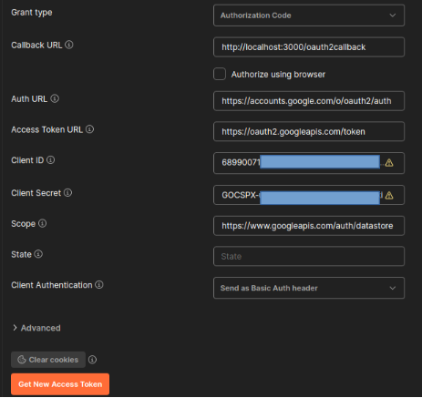
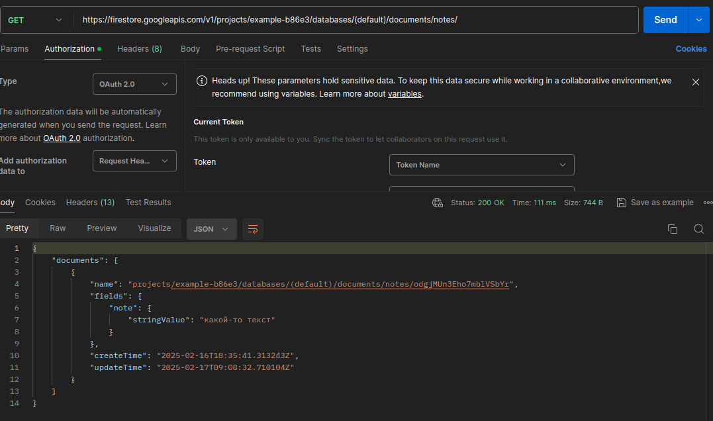

# Создание API c помощью Firebase

Если вы оказались на этой странице, вероятно, вы заинтересованы в том, чтобы узнать, как эффективно начать работу с **Firebase Firestore и Postman**. В данном руководстве мы предоставим детальные инструкции и полезную информацию для успешного освоения данных инструментов и их интеграции в ваши проекты.

**Firebase Firestore** — это облачная база данных, предоставляемая Google, которая позволяет разработчикам легко управлять и синхронизировать данные для веб и мобильных приложений. Она обеспечивает надежное хранение данных с возможностью создания сложных запросов и поддержкой автономной работы.

## 1. Создание проекта в Firebase:
 Перейти в [Firebase Console](https://console.firebase.google.com/) для создания проекта, при необходимости войдите с учетной записью Google

 Создайте новый проект, вписав название вашего проекта. Жмем *Continue*.

 

Подклчючение ИИ Gemini, если необходим, то оставляем кнопку в положении *Enable*. Для работы с Postman он не пригодится.

 

Отключаем аналитику, она не пригодится для работы с Postman.

 

После создания проекта, вы автоматически переходите на страницу с вашим проектом. 

## 2.Добавление Firestore в проект
Нажимаем на странице на Cloud Firestore

 

Попадаем на страницу Cloud Firestore. Жмем на *create database*.

Выбираем Location (локацию) eur3 (Europe) жмем *Next*.

Оставляем на следующем шаге все, как есть и жмем *Create*.

После этого вы попадаете на страницу вашей облачной базы данных.

Переходим во вкладку Rules меняем значение *false* на *request.auth != null;* и жмем *Publish*.  В данном коде доступ будет у тех, кто авторизован.

**Не используйте true, если собираетесь использовать проект в продакшн.**

Для этого можете настроить свои условия вместо *true*.  
Более подробная информация [тут](https://firebase.google.com/docs/firestore/security/get-started?hl=en&authuser=0#allow-all).

## 3. Создание коллекций (таблиц) в Firestore

Создадим произовольную коллекцию *notes* , для этого жмем на *Start collection*, пишем *notes*, жмем на *Next*.

Далее на следующем шаге создаем поля для notes, пусть у нас будет произвольный индекс, для этого нажимаем на *Auto-ID*.

В поле Field мы записываем название полей (столбца), пусть будет *note*, его тип данных *string*, его значение пусть будет *какой-то текст*, далее жмем Save.

Результат должен быть вот такой.

## 4. Подключение RestAPI в GoogleCloud
Заходим на сайт https://console.cloud.google.com/ ,далее переходим на вкладку *APi & Services*

Переходим на вкладку *Credentials*

Жмем на *+CREATE CREDENTIALS*, чтобы создать клиента, для взаимодействия с RestAPI. Далее выбираем *OAuth Client ID*.

В поле Name пишем *Example*, в Application type выбираем *Web application*

Жмем на +ADD URI в Authorized redirect URIs, пишем http://localhost:3000/oauth2callback . Далее нажимаем на *CREATE*

После создания у вас должно быть видны Client ID, Client Secret, которые понадобятся в 7 шаге.

## 5. Установка Postman
Скачайте и установите [Postman](https://www.postman.com/) с официального сайта.

## 6. Создание рабочего пространства и коллекции. 
Войдите под учетной записью Google, под которым заходили в Firebase, создайте новое рабочее пространство (Workspaces -> Create Workspace -> Blank Workspace -> *Next*).

Пишем название рабочего пространства в *Name* и жмем *Create*.

Создаем новую коллекцию: пишем название, жмем *add request*

## 7. Добавление токена и url адреса в Postman.
Заходим в настройки проекта Firestore Project settings запоминаем Project ID.

Заходим в Postman прописываем адрес 
https://firestore.googleapis.com/v1/projects/(YOUR_ID_BASE)/databases/(default)/documents/notes

Вместо (YOUR_ID_BASE) вводим Project ID, в нашем случае это *example-b86e3*.

Если мы попытаемся отправить запрос, нажав  Send, получим ошибку такого рода. 

Означает, что мы не добавили токен, и у нас нет прав к доступу по данному адресу.

Поэтому переходим во вкладку Authorization, выбираем тип OAuth 2.0

В **Callback URL** записываем адрес *http://localhost:3000/oauth2callback*, который записан на сайте Google Cloud во вкладке Clients.

В поле **Auth URL** записываем https://accounts.google.com/o/oauth2/auth

В поле **Acces Token URL** записываем https://oauth2.googleapis.com/token

В поля **Client ID и Client** secret заполняем исходя из данных на странице Client.

В поле **Scope** заполняем https://www.googleapis.com/auth/datastore 

Далее жмем на *Get New Acces Token*. Заходите на аккаунт Google, под которым вы заходили на сайт Google Cloud. Далее жмете *Разрешить*.
После всего у вас должно появиться такое окно.

.

Жмем на *Use Token*.
После этого жмем на повторную отправку запроса *Send*.

Для безопасности данных в Authorization, используйте variables, более подробная информация [тут](https://learning.postman.com/docs/sending-requests/variables/variables/) 

## 8. Источники

[Firestore REST API Reference ](https://cloud.google.com/firestore/docs/reference/rest) - официальная документация по REST API Firestore, где представлены все доступные методы и параметры.

[Google Cloud Console](https://console.cloud.google.com) - Платформа для управления вашими проектами и сервисами Google Cloud. Здесь вы можете управлять настройками Firestore и просматривать журналы активности.

[Introduction to Postman](https://learning.postman.com/docs/introduction/overview/) - Основные принципы работы с Postman.

[Automating API Tests](https://learning.postman.com/docs/tests-and-scripts/write-scripts/intro-to-scripts/) - Описание того, как автоматизировать тестирование API с помощью Postman.
