# Методические указания для Flutter


##  Установите редактор кода
- **Рекомендуется**: [Visual Studio Code](https://code.visualstudio.com/) или [Android Studio](https://developer.android.com/studio).
  - Для **VS Code**: Установите расширения **Flutter** и **Dart**.
  - Для **Android Studio**: Установите плагины **Flutter** и **Dart** через раздел **Plugins**.

---


## 4. Проверьте установку Flutter
Запустите команду:
```bash
flutter doctor
```
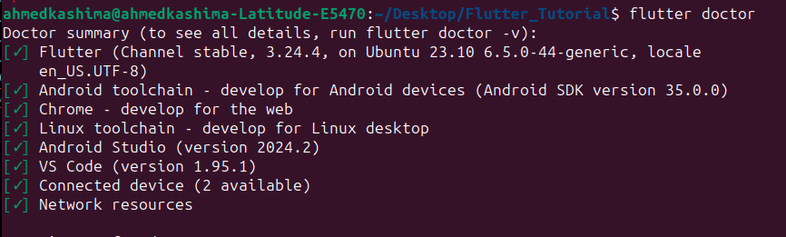


# 1. Создание проекта

*В командной строке создайте новый проект:*
```bash
flutter create shopingapp
```
*Перейдите в папку проекта:*
```bash
cd shopingapp
```

**Запустите приложение Flutter**

```bash
flutter run
```

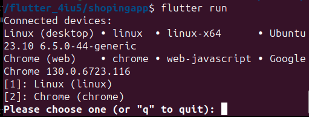

У вас будет список доступных устройств, на которых можно запустить приложение Flutter:

    Linux (desktop): Ваше приложение будет запущено как настольное приложение для Linux.
    Chrome (web): Ваше приложение будет запущено как веб-приложение в браузере Google Chrome.

выберите 1

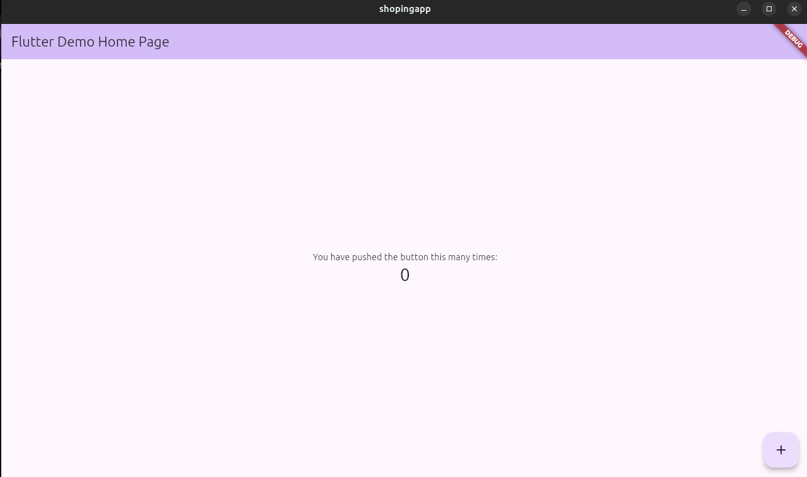


Создаем папку screens, в ней создадим две страницы – главную страницу магазина(`shop_screen.dart`) и страницу товара(`device_screen.dart`)

`shop_screen.dart`

```dart
import 'package:flutter/material.dart';

class ShopScreen extends StatelessWidget {
  @override
  Widget build(BuildContext context) {
    return Scaffold(
      appBar: AppBar(title: Text('Shop')),
      body: Center(
        child: ElevatedButton(
          onPressed: () {
            // Navigate to the DeviceScreen
            Navigator.pushNamed(context, '/device');
          },
          child: Text('Go to device screen'),
        ),
      ),
    );
  }
}
```


Обновите файл `main.dart`:

```dart
import 'package:flutter/material.dart';
import 'screens/shop_screen.dart';
import 'screens/device_screen.dart';

void main() {
  runApp(MyApp());
}

class MyApp extends StatelessWidget {
  @override
  Widget build(BuildContext context) {
    return MaterialApp(
      title: 'Shopping App',
      initialRoute: '/shop', 
      routes: {
        '/shop': (context) => ShopScreen(),
        '/device': (context) => DeviceScreen(),
      },
    );
  }
}
```
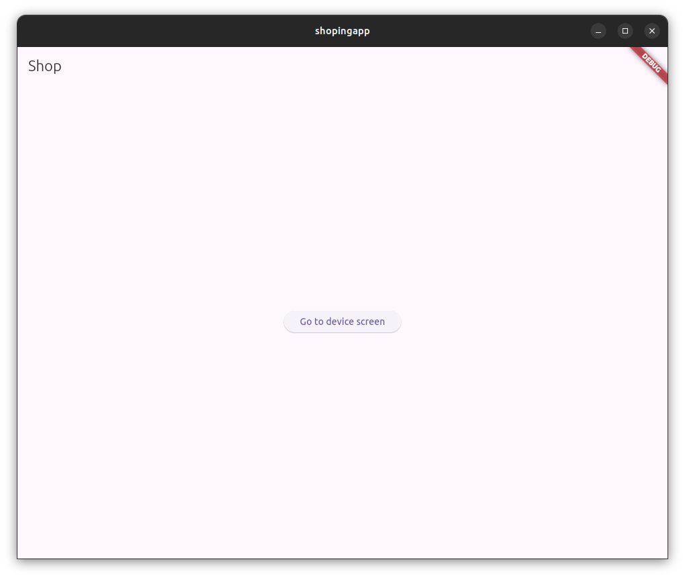


Структура каталога

<pre>
lib/
  screens/
    shop_screen.dart
    device_screen.dart
  main.dart
</pre>

Теперь

создаем <code>store.dart</code>

```dart
class AppState {
  final List<Device> devices;    
  final Device? selectedDevice; 

  AppState({required this.devices, this.selectedDevice});
}
```
AppState описывает структуру состояния приложения:
devices: Список всех доступных устройств.
selectedDevice: Одно устройство, которое выбрано пользователем.


```dart
class SetDevicesAction {
  final List<Device> devices;

  SetDevicesAction(this.devices);
}
```

Экшен — это класс, описывающий действие, которое нужно выполнить с состоянием.
`SetDevicesAction`:
Содержит список устройств devices, который будет установлен в глобальное состояние.

```dart
AppState appReducer(AppState state, dynamic action) {
  if (action is SetDevicesAction) {
    return AppState(devices: action.devices, selectedDevice: state.selectedDevice);
  }
  return state;
}
```
редюсер — функция, которая принимает текущее состояние (state) и экшен (action), а затем возвращает новое состояние.
В данном случае:

Если получен экшен `SetDevicesAction`, обновляется список устройств в состоянии.
В противном случае возвращается текущее состояние.


```dart
final store = Store<AppState>(
  appReducer,  // Основной редюсер.
  initialState: AppState(devices: [], selectedDevice: null), // Начальное состояние.
);
```
Хранилище (Store):
Объединяет:
Редюсер (appReducer).
Начальное состояние приложения (initialState).
     initialState:
devices: Пустой список.
        selectedDevice: null.

```dart

import 'package:redux/redux.dart';
import 'package:shopingapp/models/device.dart'; 
class AppState {
  final List<Device> devices;
  final Device? selectedDevice;

  AppState({required this.devices, this.selectedDevice});
}

class SetDevicesAction {
  final List<Device> devices;

  SetDevicesAction(this.devices);
}

AppState appReducer(AppState state, dynamic action) {
  if (action is SetDevicesAction) {
    return AppState(devices: action.devices, selectedDevice: state.selectedDevice);
  }
  return state;
}

final store = Store<AppState>(
  appReducer,
  initialState: AppState(devices: [], selectedDevice: null),
);
```


создаем модель устройства (Device), которая используется для представления данных об устройствах в приложении

```dart

class Device {
  final int id;
  final String title;
  final String brand;
  final double price;
  final String image;

  Device({
    required this.id,
    required this.title,
    required this.brand,
    required this.price,
    required this.image,
  });

  factory Device.fromJson(Map<String, dynamic> json) {
    return Device(
      id: json['id'],
      title: json['title'],
      brand: json['brand'],
      price: json['price'].toDouble(),
      image: json['image'],
    );
  }
}
```


Обновите файл `shop_screen.dart`:


1. ShopScreen

    Основной виджет (StatelessWidget):
        Это главный экран, где отображается список устройств.
        Используется StoreConnector из пакета flutter_redux, чтобы получить данные из хранилища состояния (AppState).

```dart
StoreConnector<AppState, List<Device>>(
  converter: (store) => store.state.devices,
```
converter: Функция, которая преобразует данные из Redux-хранилища в список устройств devices.

Добавление устройств по умолчанию (если список пуст):

```dart
if (devices.isEmpty) {
  devices = [
    Device(
      id: 1,
      title: 'Samsung s24 ultra',
      price: 2000,
      image: 'assets/images/device1.jpg',
      brand: 'SAMSUNG',
    ),
    ...
  ];
}
```
Отображение списка устройств:
```dart
ListView.builder(
  itemCount: devices.length,
  itemBuilder: (context, index) {
    final device = devices[index];
    ...
```
Переход на экран деталей устройства:
```dart
ElevatedButton(
  onPressed: () {
    Navigator.push(
      context,
      MaterialPageRoute(
        builder: (context) => DeviceDetailScreen(device: device),
      ),
    );
  },
  child: Text('View Details'),
),
```
2. `DeviceDetailScreen`
    Экран с подробностями устройства:
```dart
class DeviceDetailScreen extends StatelessWidget {
  final Device device;

  DeviceDetailScreen({required this.device});
```

Отображение деталей устройства:
```dart
Center(
  child: Column(
    mainAxisAlignment: MainAxisAlignment.center,
    children: [
      Image.asset(device.image),
      Text('Brand: ${device.brand}'),
      Text('Price: \$${device.price}'),
    ],
  ),
),
```
`shop_screen.dart`

```dart
import 'package:flutter/material.dart';
import 'package:flutter_redux/flutter_redux.dart';
import 'package:shopingapp/models/device.dart'; 
import 'package:shopingapp/store/store.dart'; 

class ShopScreen extends StatelessWidget {
  @override
  Widget build(BuildContext context) {
    return StoreConnector<AppState, List<Device>>(
      converter: (store) => store.state.devices,  
      builder: (context, devices) {
        if (devices.isEmpty) {
          devices = [
            Device(
              id: 1,
              title: 'Samsung s24 ultra ',
              price: 2000,
              image: 'assets/images/device1.jpg',
              brand: 'SAMSUNG',
            ),
            Device(
              id: 2,
              title: 'Iphone 15 pro max',
              price: 1000,
              image: 'assets/images/device2.jpg',
              brand: 'IPHONE',
            ),
          ];
        }

        return Scaffold(
          appBar: AppBar(title: Text('Shop')),
          body: ListView.builder(
            itemCount: devices.length,
            itemBuilder: (context, index) {
              final device = devices[index];
              return Padding(
                padding: const EdgeInsets.all(8.0),
                child: Card(
                  elevation: 5,
                  shape: RoundedRectangleBorder(
                    borderRadius: BorderRadius.circular(15),
                  ),
                  child: Padding(
                    padding: const EdgeInsets.all(12.0),
                    child: Column(
                      children: [
                        ClipRRect(
                          borderRadius: BorderRadius.circular(10),
                          child: Image.asset(
                            device.image,
                            height: 200, 
                            fit: BoxFit.cover,  //!!! Makes the image fit the size
                          ),
                        ),
                        SizedBox(height: 12),
                        Text(
                          device.title,
                          style: TextStyle(fontSize: 18, fontWeight: FontWeight.bold),
                        ),
                        SizedBox(height: 6),
                        Text('${device.price} USD'),
                        SizedBox(height: 12),
                        ElevatedButton(
                          onPressed: () {
                            Navigator.push(
                              context,
                              MaterialPageRoute(
                                builder: (context) => DeviceDetailScreen(device: device),
                              ),
                            );
                          },
                          child: Text('View Details'),
                        ),
                      ],
                    ),
                  ),
                ),
              );
            },
          ),
        );
      },
    );
  }
}

class DeviceDetailScreen extends StatelessWidget {
  final Device device;

  DeviceDetailScreen({required this.device});

  @override
  Widget build(BuildContext context) {
    return Scaffold(
      appBar: AppBar(title: Text(device.title)),
      body: Center(
        child: Column(
          mainAxisAlignment: MainAxisAlignment.center,
          children: [
            Image.asset(device.image),  
            Text('Brand: ${device.brand}'),
            Text('Price: \$${device.price}'),
          ],
        ),
      ),
    );
  }
}
```
Добавление зависимостей

Откройте файл pubspec.yaml и добавьте необходимые пакеты для работы приложения.

```dart
dependencies:
  flutter:
    sdk: flutter
  flutter_redux: ^0.8.0
  redux: ^4.0.0
  provider: ^6.0.0
```
for pics
```bash
flutter:
  assets:
    - assets/images/
```


И конечно Обновите файл <code>main.dart</code>:

```dart
import 'package:flutter/material.dart';
import 'package:flutter_redux/flutter_redux.dart';
import 'package:shopingapp/store/store.dart'; 
import 'package:shopingapp/screens/shop_screen.dart';
import 'package:shopingapp/store/sotre.dart'; 

void main() {
  runApp(MyApp());
}

class MyApp extends StatelessWidget {
  @override
  Widget build(BuildContext context) {
    return StoreProvider(
      store: store,  
      child: MaterialApp(
        home: ShopScreen(), 
      ),
    );
  }
}
```


Структура каталога lib

<pre>
── lib
│   ├── main.dart
│   ├── models
│   │   └── device.dart
│   ├── screens
│   │   └── shop_screen.dart
│   └── store
│       └── store.dart
</pre>

**assets**

<pre>
├── assets
│   └── images
│       ├── device1.jpg
│       └── device2.jpg
</pre>

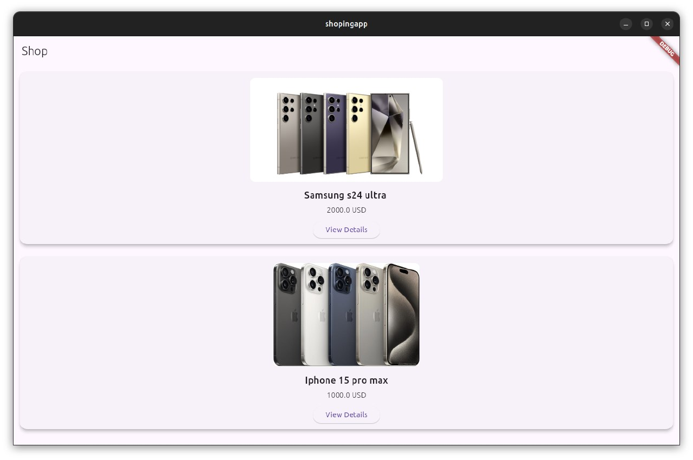


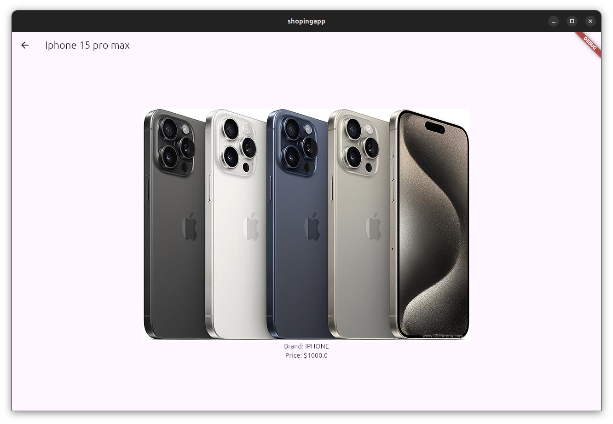


# создать корзина

создаем <code>cart_screen.dart</code>

```dart
import 'package:flutter/material.dart';
import 'package:flutter_redux/flutter_redux.dart';
import 'package:shopingapp/models/device.dart'; 
import 'package:shopingapp/store/store.dart'; 

class CartScreen extends StatelessWidget {
  @override
  Widget build(BuildContext context) {
    return StoreConnector<AppState, List<Device>>(
      converter: (store) => store.state.cart,  
      builder: (context, cart) {
        return Scaffold(
          appBar: AppBar(title: Text('Your Cart')),
          body: cart.isEmpty
              ? Center(child: Text('Your cart is empty!'))
              : ListView.builder(
                  itemCount: cart.length,
                  itemBuilder: (context, index) {
                    final device = cart[index];
                    return Padding(
                      padding: const EdgeInsets.all(8.0),
                      child: Card(
                        elevation: 5,
                        child: ListTile(
                          leading: Image.asset(device.image, width: 50),
                          title: Text(device.title),
                          subtitle: Text('\$${device.price}'),
                          trailing: IconButton(
                            icon: Icon(Icons.remove_circle),
                            onPressed: () {
                              // Remove the device from the cart
                              StoreProvider.of<AppState>(context).dispatch(RemoveFromCartAction(device));
                            },
                          ),
                        ),
                      ),
                    );
                  },
                ),
        );
      },
    );
  }
}
```

создаем <code>device_detail_screen.dart</dart>


```dart
return Scaffold(
  appBar: AppBar(title: Text(device.title)), // Заголовок с названием устройства.
  body: Center(
    child: Column(
      mainAxisAlignment: MainAxisAlignment.center,
      children: [
        Image.asset(device.image),            // Картинка устройства.
        Text('Brand: ${device.brand}'),       // Бренд устройства.
        Text('Price: \$${device.price}'),     // Цена устройства.

```
AppBar: Отображает название устройства.
Image.asset: Показывает картинку устройства из локального хранилища (assets).
Text: Отображает бренд и цену устройства.

Добавление устройства в корзину
```dart
ElevatedButton(
  onPressed: () {
    StoreProvider.of<AppState>(context).dispatch(AddToCartAction(device));
    ScaffoldMessenger.of(context).showSnackBar(
      SnackBar(content: Text('${device.title} added to cart')),
    );
  },
  child: Text('Add to Cart'),
),
```

Кнопка "Add to Cart":
При нажатии выполняет следующие действия:
Получает доступ к глобальному хранилищу Redux через StoreProvider.of<AppState>(context).
Отправляет (dispatch) действие AddToCartAction(device), чтобы добавить устройство в корзину.
Показывает уведомление (SnackBar) с подтверждением.
Важно:
Для работы этой кнопки необходим экшен AddToCartAction и соответствующий редюсер, который добавляет устройство в корзину (их нужно реализовать в Redux-хранилище).

 Кнопка "Back to Shop"
```dart
ElevatedButton(
  onPressed: () {
    Navigator.pop(context);
  },
  child: Text('Back to Shop'),
),
```
Возвращает пользователя на предыдущий экран (в данном случае, на экран магазина).

Redux: Добавление устройства в корзину

Чтобы функциональность "добавления в корзину" работала, необходимо:

Создать экшен AddToCartAction:
```dart
class AddToCartAction {
  final Device device;

  AddToCartAction(this.device);
}

    Добавить корзину (cart) в состояние AppState:

class AppState {
  final List<Device> devices;
  final List<Device> cart;        // Корзина
  final Device? selectedDevice;

  AppState({
    required this.devices,
    required this.cart,           // Инициализация корзины
    this.selectedDevice,
  });
}
```

Обновить редюсер (appReducer):

```dart
AppState appReducer(AppState state, dynamic action) {
  if (action is AddToCartAction) {
    return AppState(
      devices: state.devices,
      cart: List.from(state.cart)..add(action.device), // Добавляем устройство в корзину.
      selectedDevice: state.selectedDevice,
    );
  }
  return state;
}
```


```dart
import 'package:flutter/material.dart';
import 'package:shopingapp/models/device.dart';
import 'package:shopingapp/store/store.dart'; 
import 'package:flutter_redux/flutter_redux.dart';

class DeviceDetailScreen extends StatelessWidget {
  final Device device;

  DeviceDetailScreen({required this.device});

  @override
  Widget build(BuildContext context) {
    return Scaffold(
      appBar: AppBar(title: Text(device.title)),
      body: Center(
        child: Column(
          mainAxisAlignment: MainAxisAlignment.center,
          children: [
            Image.asset(device.image),  
            Text('Brand: ${device.brand}'),
            Text('Price: \$${device.price}'),
            SizedBox(height: 20),
            ElevatedButton(
              onPressed: () {
                StoreProvider.of<AppState>(context).dispatch(AddToCartAction(device));
                ScaffoldMessenger.of(context).showSnackBar(SnackBar(content: Text('${device.title} added to cart')));
              },
              child: Text('Add to Cart'),
            ),
            SizedBox(height: 20),
            ElevatedButton(
              onPressed: () {
                Navigator.pop(context);
              },
              child: Text('Back to Shop'),
            ),
          ],
        ),
      ),
    );
  }
}
```


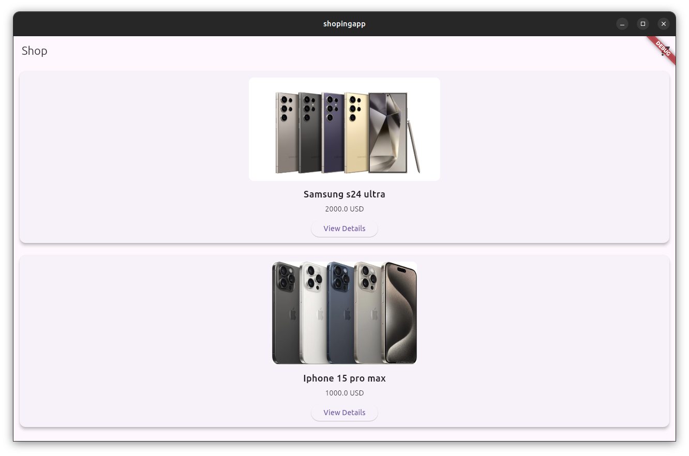
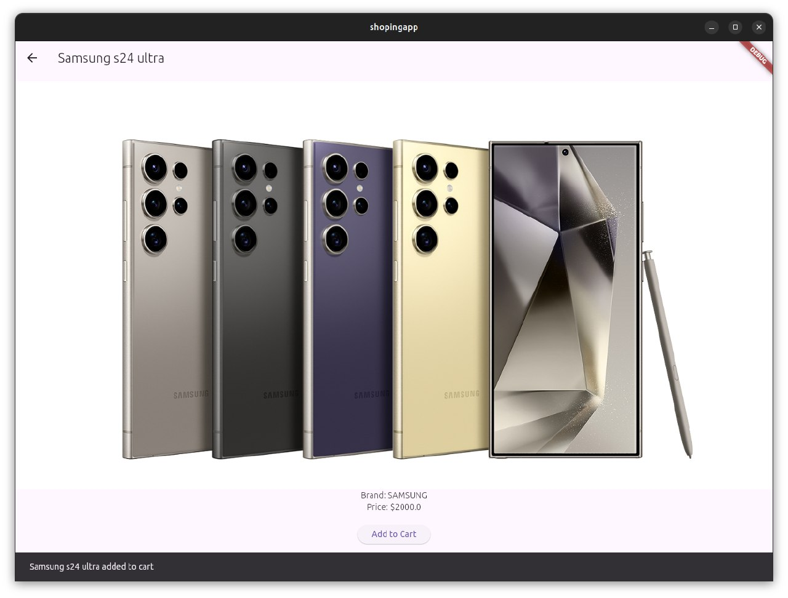
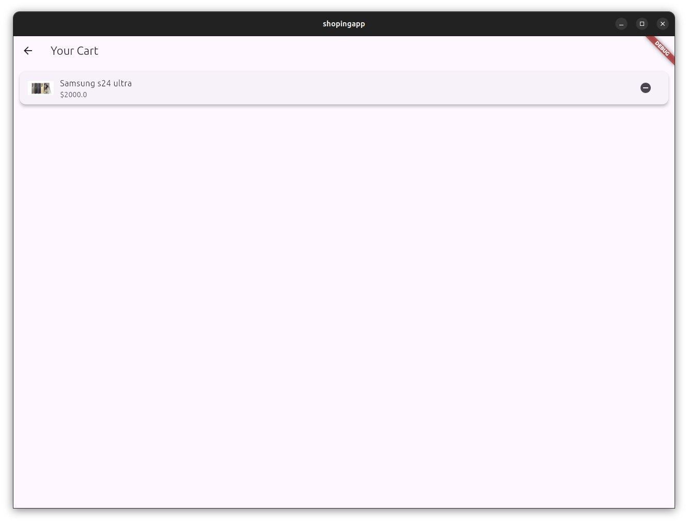


## Сохранение Flutter-приложения в виде APK-файла 

Проверка окружения

Убедитесь, что у вас установлены все необходимые инструменты для сборки Android-приложений:

Android Studio (с установленным SDK).
Flutter SDK.
Правильно настроенные переменные окружения (flutter и adb должны быть доступны в терминале).
Проверьте работоспособность Flutter и Android SDK командой:
```bash
flutter doctor
```
Все пункты должны быть отмечены зелёным.

### Сборка APK в режиме Release

APK-файл для публикации нужно собирать в режиме release, чтобы исключить отладочные функции и улучшить производительность.

Выполните следующую команду:
```bash
flutter build apk --release
```
После успешной сборки APK будет находиться в папке:
<code>build/app/outputs/flutter-apk/app-release.apk</code>


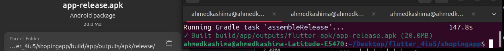
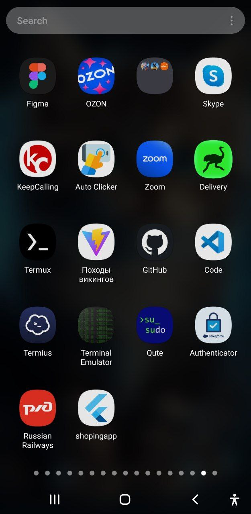
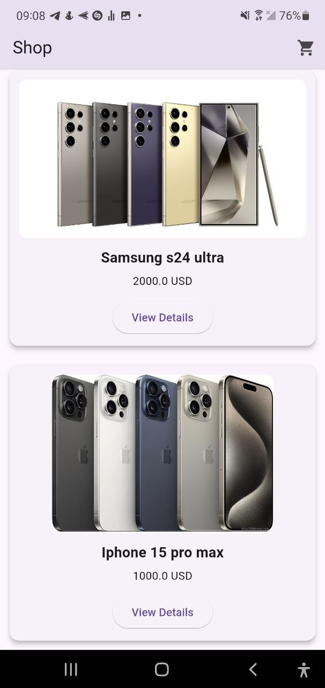
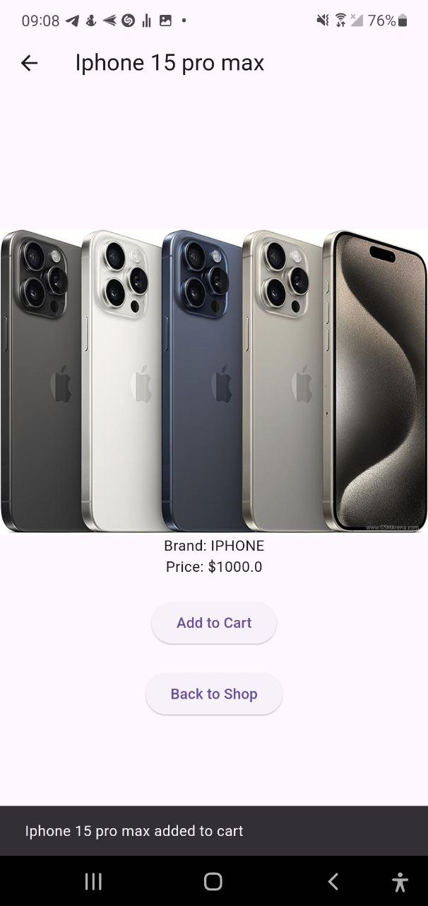


# Создайте Django Backend для входа и регистрации

Установите Django и настройте проект


```bash
pip install django
```
Создайте новый проект:
```bash
django-admin startproject auth_backend
cd auth_backend
```
Создайте приложение для аутентификации:
```bash
python manage.py startapp auth_app
```

Добавьте приложение в `INSTALLED_APPS` в файле `settings.py`:

    ```python
    INSTALLED_APPS = [
        ...
        'auth_app',
        'rest_framework',  # Для разработки API
    ]
    ```

Установите Django REST Framework


```bash
    pip install djangorestframework
```

Добавьте Django REST Framework в `INSTALLED_APPS`:

```python
    INSTALLED_APPS = [
        ...
        'rest_framework',
    ]
```

`auth_app/views.py`

```python

from django.contrib.auth.models import User
from django.http import JsonResponse
from django.views.decorators.csrf import csrf_exempt
from rest_framework.decorators import api_view
from django.contrib.auth import authenticate
import json
from .models import CustomUser
from django.contrib.auth import get_user_model

CustomUser = get_user_model()

@csrf_exempt
def register(request):
    if request.method == "POST":
        data = json.loads(request.body)
        email = data.get("email")
        password = data.get("password")

        if CustomUser.objects.filter(username=email).exists():
            return JsonResponse({"error": "User already exists"}, status=400)

        # Save the user with plain_password and hashed password
        user = CustomUser.objects.create_user(
            username=email,
            email=email,
            password=password,
            plain_password=password,  # Save plain password for your specific need
        )
        return JsonResponse({"message": "User registered successfully"}, status=201)

    return JsonResponse({"error": "Invalid method"}, status=405)

@csrf_exempt
def login_view(request):
    if request.method == "POST":
        data = json.loads(request.body)
        email = data.get("email")
        password = data.get("password")

        user = authenticate(username=email, password=password)

        if user is not None:
            return JsonResponse({"message": "Login successful"}, status=200)
        else:
            return JsonResponse({"error": "Invalid credentials"}, status=400)

    return JsonResponse({"error": "Invalid method"}, status=405)
```

`auth_app/urls.py`
```python
from django.urls import path
from . import views

urlpatterns = [
    path('register/', views.register, name='register'),
    path('login/', views.login_view, name='login'),
]

]
```

`admin.py`
```python
from django.contrib import admin
from django.contrib.auth.admin import UserAdmin
from .models import CustomUser

@admin.register(CustomUser)
class CustomUserAdmin(UserAdmin):
    list_display = ('id', 'username', 'email', 'is_active')
    search_fields = ('username', 'email')
    ordering = ('id',)

```
`models.py`
```python
from django.contrib.auth.models import AbstractUser
from django.db import models

class CustomUser(AbstractUser):
    plain_password = models.CharField(max_length=128, blank=True, null=True)

    # Provide unique related_name values to avoid conflicts
    groups = models.ManyToManyField(
        'auth.Group',
        related_name='customuser_groups',  # Unique related name
        blank=True,
    )
    user_permissions = models.ManyToManyField(
        'auth.Permission',
        related_name='customuser_permissions',  # Unique related name
        blank=True,
    )
```
`settings.py` `INSTALLED_APPS` 
```python
INSTALLED_APPS = [
    ...
    'auth_app',
    'rest_framework',  # Для разработки API
]
```
# Подключите свое приложение Flutter к бэкэнду

в папку `screens` создаем `login_screen.dart` и `register_screen.dart`

`login_screen.dart`


### **Импорты**
```dart
import 'dart:convert'; // Для кодирования/декодирования JSON
import 'package:http/http.dart' as http; // Для выполнения HTTP-запросов
import 'package:flutter/material.dart'; // Для создания пользовательского интерфейса
```
cоздаем классы

```python
class LoginScreen extends StatelessWidget {
  final TextEditingController emailController = TextEditingController();
  final TextEditingController passwordController = TextEditingController();
```
Метод `build`
```dart
@override
Widget build(BuildContext context)
```
Метод отвечает за построение пользовательского интерфейса.
Возвращает виджет Scaffold, который содержит структуру экрана с полем для ввода данных и кнопками.

Кнопка "Login"
```dart
ElevatedButton(
  onPressed: () async {
    String email = emailController.text.trim();
    String password = passwordController.text.trim();

    if (email.isNotEmpty && password.isNotEmpty) {
      var response = await http.post(
        Uri.parse('http://127.0.0.1:8000/api/auth/login/'),
        headers: {'Content-Type': 'application/json'},
        body: jsonEncode({
          'email': email,
          'password': password,
        }),
      );

      if (response.statusCode == 200) {
        ScaffoldMessenger.of(context).showSnackBar(
          SnackBar(content: Text('Login successful!')),
        );
        Navigator.pushReplacementNamed(context, '/shop');
      } else {
        var errorMessage = jsonDecode(response.body)['error'] ?? 'Invalid credentials';
        ScaffoldMessenger.of(context).showSnackBar(
          SnackBar(content: Text(errorMessage)),
        );
      }
    } else {
      ScaffoldMessenger.of(context).showSnackBar(
        SnackBar(content: Text('Please fill in all fields')),
      );
    }
  },
  child: Text('Login'),
),
```
Функционал кнопки:
Собирает данные из текстовых полей emailController и passwordController.
Проверяет, что оба поля заполнены.
Отправляет POST-запрос на сервер (Django API) по адресу `http://127.0.0.1:8000/api/auth/login/`.
В заголовках указывается, что данные отправляются в формате JSON.
Если сервер возвращает статус `200`, пользователь получает сообщение об успешной авторизации и перенаправляется на экран /shop.
Если сервер возвращает ошибку, показывается сообщение с текстом ошибки.

`login_screen.dart`

```dart
import 'dart:convert'; // For JSON encoding/decoding
import 'package:http/http.dart' as http; // For HTTP requests
import 'package:flutter/material.dart';

class LoginScreen extends StatelessWidget {
  final TextEditingController emailController = TextEditingController();
  final TextEditingController passwordController = TextEditingController();

  @override
  Widget build(BuildContext context) {
    return Scaffold(
      appBar: AppBar(
        title: Text('Login'),
      ),
      body: Padding(
        padding: const EdgeInsets.all(16.0),
        child: Column(
          mainAxisAlignment: MainAxisAlignment.center,
          children: [
            TextField(
              controller: emailController,
              decoration: InputDecoration(labelText: 'Email'),
            ),
            TextField(
              controller: passwordController,
              decoration: InputDecoration(labelText: 'Password'),
              obscureText: true,
            ),
            SizedBox(height: 20),
            ElevatedButton(
              onPressed: () async {
                // Retrieve user input
                String email = emailController.text.trim();
                String password = passwordController.text.trim();

                if (email.isNotEmpty && password.isNotEmpty) {
                  // Send API request to backend
                  var response = await http.post(
                    Uri.parse('http://127.0.0.1:8000/api/auth/login/'), // Django API endpoint
                    headers: {'Content-Type': 'application/json'},
                    body: jsonEncode({
                      'email': email,
                      'password': password,
                    }),
                  );

                  if (response.statusCode == 200) {
                    // Successful login
                    ScaffoldMessenger.of(context).showSnackBar(
                      SnackBar(content: Text('Login successful!')),
                    );
                    Navigator.pushReplacementNamed(context, '/shop'); // Navigate to Shop Screen
                  } else {
                    // Handle error response
                    var errorMessage = jsonDecode(response.body)['error'] ?? 'Invalid credentials';
                    ScaffoldMessenger.of(context).showSnackBar(
                      SnackBar(content: Text(errorMessage)),
                    );
                  }
                } else {
                  // Show validation error
                  ScaffoldMessenger.of(context).showSnackBar(
                    SnackBar(content: Text('Please fill in all fields')),
                  );
                }
              },
              child: Text('Login'),
            ),
            TextButton(
              onPressed: () {
                Navigator.pushNamed(context, '/register'); // Navigate to Register Screen
              },
              child: Text('Don\'t have an account? Register here'),
            ),
          ],
        ),
      ),
    );
  }
}
```

`register_screen.dart`
создаем класс 
```dart
class RegisterScreen extends StatelessWidget {
  final TextEditingController emailController = TextEditingController();
  final TextEditingController passwordController = TextEditingController();
```
`RegisterScreen` — виджет, который отображает экран регистрации.
`emailController` и `passwordController` — контроллеры для полей ввода email и пароля, соответственно.

Метод `build`
```dart
@override
Widget build(BuildContext context)
```

Метод `build` строит пользовательский интерфейс.
Возвращается виджет `Scaffold`, который содержит все элементы на экране.


`register_screen.dart`
```dart
ElevatedButton(
  onPressed: () async {
    String email = emailController.text.trim();
    String password = passwordController.text.trim();

    if (email.isNotEmpty && password.isNotEmpty) {
      try {
        var response = await http.post(
          Uri.parse('http://127.0.0.1:8000/api/auth/register/'), // Обновите URL, если нужно
          headers: {'Content-Type': 'application/json'},
          body: jsonEncode({'email': email, 'password': password}),
        );

        if (response.statusCode == 201) {
          ScaffoldMessenger.of(context).showSnackBar(
            SnackBar(content: Text('Account created successfully!')),
          );
          Navigator.pushReplacementNamed(context, '/login');
        } else {
          var errorMessage = jsonDecode(response.body)['error'] ?? 'Registration failed';
          ScaffoldMessenger.of(context).showSnackBar(
            SnackBar(content: Text(errorMessage)),
          );
        }
      } catch (e) {
        ScaffoldMessenger.of(context).showSnackBar(
          SnackBar(content: Text('Something went wrong: $e')),
        );
      }
    } else {
      ScaffoldMessenger.of(context).showSnackBar(
        SnackBar(content: Text('Please fill in all fields')),
      );
    }
  },
  child: Text('Register'),
),
```
Функциональность кнопки "Register":

Когда кнопка нажата, происходит следующее:
Собираются значения из полей emailController и passwordController.
Проверяется, что оба поля заполнены.
Если поля заполнены, отправляется POST-запрос на сервер для создания аккаунта. URL запроса: `http://127.0.0.1:8000/api/auth/register/`.
В заголовках указывается, что данные отправляются в формате JSON.
Если регистрация успешна (статус `201`), показывается сообщение о успешной регистрации и пользователь перенаправляется на экран авторизации (`/login`).
Если произошла ошибка (например, неправильные данные или уже существует аккаунт), выводится соответствующее сообщение об ошибке.
В случае исключения (например, проблемы с интернет-соединением) также показывается сообщение об ошибке.


```dart
import 'dart:convert'; // For encoding/decoding JSON
import 'package:http/http.dart' as http; // For making HTTP requests
import 'package:flutter/material.dart';

class RegisterScreen extends StatelessWidget {
  final TextEditingController emailController = TextEditingController();
  final TextEditingController passwordController = TextEditingController();

  @override
  Widget build(BuildContext context) {
    return Scaffold(
      appBar: AppBar(
        title: Text('Register'),
      ),
      body: Padding(
        padding: const EdgeInsets.all(16.0),
        child: Column(
          mainAxisAlignment: MainAxisAlignment.center,
          children: [
            TextField(
              controller: emailController,
              decoration: InputDecoration(labelText: 'Email'),
            ),
            TextField(
              controller: passwordController,
              decoration: InputDecoration(labelText: 'Password'),
              obscureText: true,
            ),
            SizedBox(height: 20),
            ElevatedButton(
                          onPressed: () async {
              String email = emailController.text.trim();
              String password = passwordController.text.trim();

              if (email.isNotEmpty && password.isNotEmpty) {
                try {
                  var response = await http.post(
                    Uri.parse('http://127.0.0.1:8000/api/auth/register/'), // Update URL if needed
                    headers: {'Content-Type': 'application/json'},
                    body: jsonEncode({'email': email, 'password': password}),
                  );

                  if (response.statusCode == 201) {
                    ScaffoldMessenger.of(context).showSnackBar(
                      SnackBar(content: Text('Account created successfully!')),
                    );
                    Navigator.pushReplacementNamed(context, '/login');
                  } else {
                    var errorMessage = jsonDecode(response.body)['error'] ?? 'Registration failed';
                    ScaffoldMessenger.of(context).showSnackBar(
                      SnackBar(content: Text(errorMessage)),
                    );
                  }
                } catch (e) {
                  ScaffoldMessenger.of(context).showSnackBar(
                    SnackBar(content: Text('Something went wrong: $e')),
                  );
                }
              } else {
                ScaffoldMessenger.of(context).showSnackBar(
                  SnackBar(content: Text('Please fill in all fields')),
                  );
                }
              },
              child: Text('Register'),
            ),
          ],
        ),
      ),
    );
  }
}
```

структура `lib`
<pre>
lib/
├── main.dart
├── screens/
│   ├── login_screen.dart        
│   ├── register_screen.dart      
</pre>


## Проверка

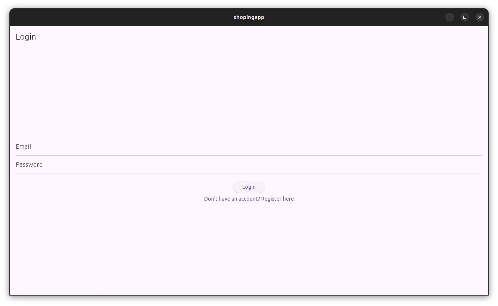
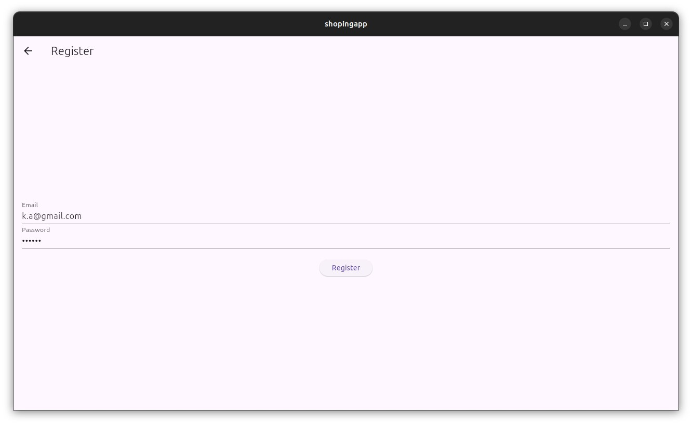
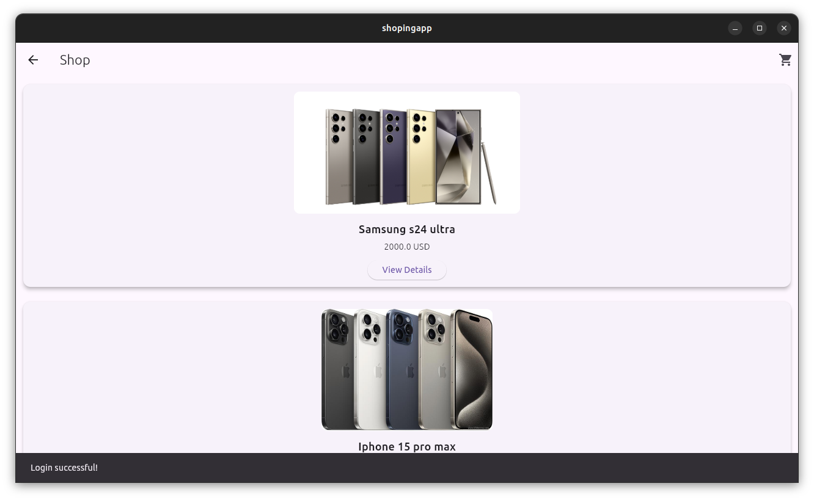


## Проверка запросов

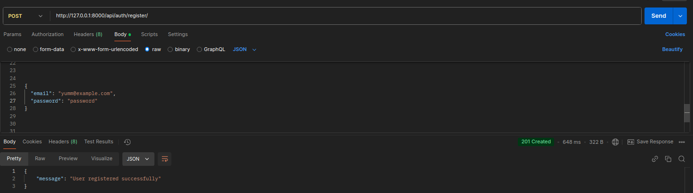
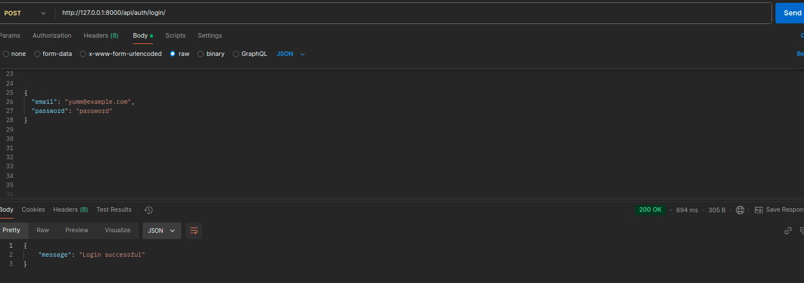


