# Основы работы с Git и Docker Compose

# Основы работы с git
## Введение
Git - система контроля версий, которая позволяет интегрировать потоки работы, выполненные несколькими участниками, в течение определенного времени.
Важно, что не стоит путать git и `github`/`gitlab`/`bitbucket` и др. Все эти платформы представляют собой веб-службу размещения для репозиториев git. У `github` имеется свой процесс `workflow` который немного отличается от остальных.


Умение работать с git очень важно, т.к. это неотделимая часть каждого процесса разработки, которая позволяет организовывать flow работы. Поэтому ниже будут перечислены все основные команды, которые стоит знать, так как если они не пригодятся Вам в учебе, но при устройстве в любую компанию разработчиком, Вы будете их обязательно использовать.
**Ниже будут перечислены команды для работы с git из терминала!**
## Основные команды, которые стоит знать
1. Инициализация и клонирование репозитория
-	`git init` - команда, которая позволяет инициализировать новый репозиторий или пересоздать уже 	существующий.
	Подробнее: https://git-scm.com/docs/git-init
Клонирование репозитория.
- `git clone <URL_ADDR>` - клонирование существующего репозитория, в параметр <URL_ADDR> необходимо передать адрес вашего репозитория, который находится на github.
Пример:
`git clone https://github.com/iu5git/Web` - склонируется репозиторий курса РИП из github.
При выполнении этой команды у Вас склонируется репозиторий в текущую активную директорию, из которой Вы выполняли эту команду.
Подробнее: https://git-scm.com/docs/git-clone
2. Работа с ветками.
- `git branch -m "Название ветки"` - создание новой ветки с названием, "Название ветки" - пример названия, Вы его можете заменить на любое другое и у Вас создастся ветка с этим названием.
Пример:
`git branch -m "Server Side Rendering"` - локально у вас создастся ветка с названием "Server Side Rendering"
Подробнее: https://git-scm.com/docs/git-branch
- `git push --set-upstream origin "Название ветки"` - "заливает" Вашу созданную ветку с названием "Название ветки" в репозиторий.
Пример:
`git push --set-upstream origin "Server Side Rendering"` - данная команда зальет ветку с названием "Server Side Rendering" в репозиторий.
Подробнее: https://git-scm.com/docs/git-push
- `git checkout "Название ветки"` - позволяет перейти к ветке с названием "Название ветки".
Пример:
`git checkout "Server Side Rendering"` - переместит Вас в ветку с названием "Server Side Rendering".
Подробнее: https://git-scm.com/docs/git-checkout
3. Работа с изменениями (Подробнее: https://git-scm.com/book/ru/v2/%D0%9F%D1%80%D0%B8%D0%BB%D0%BE%D0%B6%D0%B5%D0%BD%D0%B8%D0%B5-C:-%D0%9A%D0%BE%D0%BC%D0%B0%D0%BD%D0%B4%D1%8B-Git-%D0%9E%D1%81%D0%BD%D0%BE%D0%B2%D0%BD%D1%8B%D0%B5-%D0%BA%D0%BE%D0%BC%D0%B0%D0%BD%D0%B4%D1%8B).
- `git add .` - добавляет изменение из рабочего каталога в раздел проиндексированных файлов. При наличии у Вас измененных файлов, перед commit'ом необходимо проиндексировать те файлы, которые Вы хотите залить в Ваш репозиторий, данная команда проиндексирует все Ваши файлы.
- `git commit -m "Название коммита"` - команда делает снимок измененных проиндексированных файлов на данный момент времени с заданным названием. "Название коммита" - пример названия коммита.
**Важно: каждый коммит должен содержать в себе не тарабарщину, а определенное название, чтобы человек, не знакомый с содержанием изменений, мог понять что происходит в данном коммите.**
Пример хорошего коммита:
`git commit -m "Connected Redis"` - из названия коммита понятно, что он содержит в себе изменения, связанные с добавлением подключением Redis'а.
Пример плохого коммита:
`git commit -m "Redis"` - Что Redis? Кто Redis? Явно видно, что были какие-то изменения, связанные с Redis'ом, а что с ним сделали - непонятно.
Подробнее: https://git-scm.com/docs/git-commit
- `git push` - команда заливает Ваши коммиты в репозиторий.
Подробнее: https://git-scm.com/docs/git-push

## Установка Git
1. Скачайте Git по ссылке: 
   [Git for Windows](https://github.com/git-for-windows/git/releases/download/v2.48.1.windows.1/Git-2.48.1-64-bit.exe)
2. Проверьте успешную установку, выполнив команду:
   ```sh
   git --version
   ```
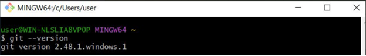

## Создание репозитория и подготовка
1. Создайте папку с таким же названием, как у вашего репозитория (например, `it-maintenance-backend`).
2. Репозиторий должен быть **публичным**.
3. Откройте папку в VS Code (**Открыть с помощью → VS Code**).
4. Инициализируйте репозиторий:
   ```sh
   git init
   ```
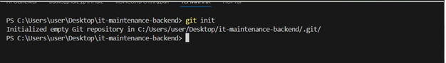

   Внутри появится скрытая папка `.git`.

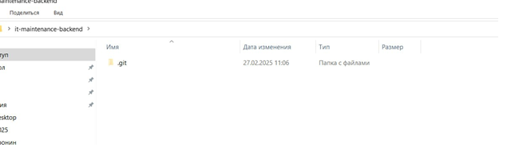

5. Создайте файл `README.md` и добавьте описание:
   ```md
   # Репозиторий backend по курсу "Разработка интернет-приложений"
   ```
6. Зафиксируйте изменения:
   ```sh
   git add .
   git commit -m "first commit"
   ```
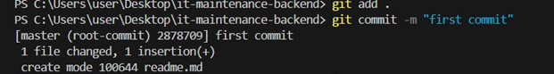

## Загрузка кода в GitHub
1. Введите последовательно команды:
   ```sh
   git remote add origin <URL_репозитория>
   git branch -M main
   git push -u origin main
   ```
2. В открывшемся окне авторизации введите учетные данные GitHub.

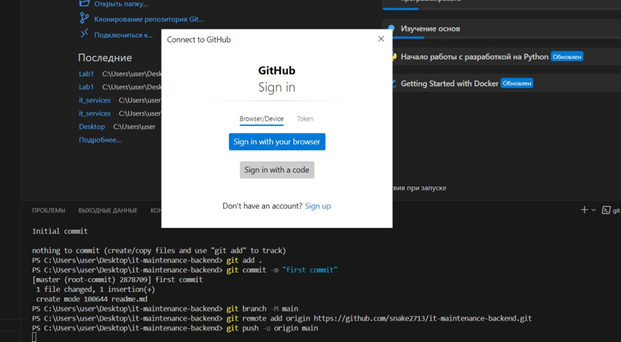

3. После успешного выполнения команды файлы появятся в репозитории.

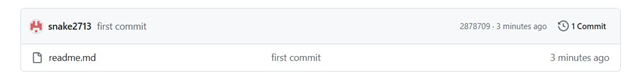

## Работа с ветками
Для каждой лабораторной работы создайте отдельную ветку. 
Примеры:
- **1 лабораторная** → `ssr_imMemory`
- **2 лабораторная** → `ssr_inDb`
- **3 лабораторная** → `SPA_backend`
- **4 лабораторная** → `SPA_backend_swagger`

### Создание новой ветки и загрузка файлов
```sh
# Создание и переход в ветку
git checkout -b "ssr_imMemory"
```
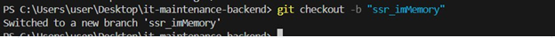

Необходимо перенести файлы лабораторной работы в нашу папку 

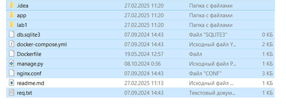
```sh
# Добавление файлов
git add .
git commit -m "lab1 first commit"
```
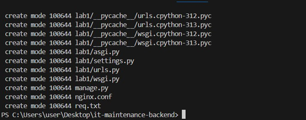

Отправка изменений. Изначально достаточно написать просто git push и терминал вам предложит ввести полную команду. В нашем случае она будет:
```sh
git push --set-upstream origin ssr_imMemory
```

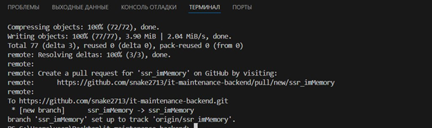

### Проверка изменений
1. Скопируйте команду, которую выдаст терминал после `git push`.
2. Перейдите в репозиторий на GitHub и убедитесь, что файлы загружены.

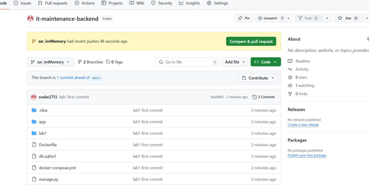

### Возвращение в основную ветку
```sh
git checkout main
```

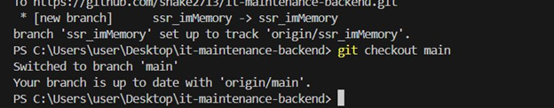

### Файлы из папки исчезнут, так как вы переключились на другую ветку.

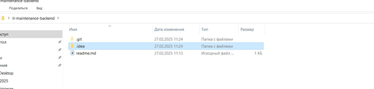

## Повторение для следующих лабораторных работ
Для каждой следующей работы повторите цикл:
1. Создайте новую ветку: `git checkout -b "<название_ветки>"`
2. Перенесите файлы лабораторной работы в папку проекта.
3. Зафиксируйте и отправьте изменения: 
   ```sh
   git add .
   git commit -m "labX first commit"
   git push --set-upstream origin <название_ветки>
   ```


## Дополнительно
Также есть достаточно удобный сайт для изучения git: https://learngitbranching.js.org/?locale=ru_RU , на ней можно изучить базовые основы работы с git'ом.


# Документация по работе файла `docker-compose.yml`

Этот [файл](docker-compose.yml) конфигурации `docker-compose.yml` предназначен для запуска и настройки трех сервисов: базы данных PostgreSQL, хранилища объектов MinIO и кеша Redis. Ниже описаны детали каждого сервиса и его конфигурация.

---

## Общая структура

- **version**: Указана версия Docker Compose (в данном случае `"3.8"`).
- **services**: Определяет три сервиса:
  - `db` (PostgreSQL)
  - `minio` (MinIO)
  - `redis` (Redis)
- **volumes**: Настройки томов для сохранения данных сервисов.

---

## Сервисы

### 1. `db` (PostgreSQL)

PostgreSQL используется как база данных.

- **Имя образа**: `postgres:12` — скачивает и использует PostgreSQL версии 12.
- **Порты**: 
  - `5432:5432` — связывает порт 5432 контейнера с портом 5432 хоста.
- **Переменные окружения**:
  - `POSTGRES_USER`: Задает имя пользователя базы данных (`root`).
  - `POSTGRES_DB`: Название создаваемой базы данных (`RIP`).
  - `POSTGRES_PASSWORD`: Пароль пользователя (`root`).
- **Том**:
  - `postgresdb-data` монтируется в `/var/lib/postgresql/data` для хранения данных базы.

---

### 2. `minio` (MinIO)

MinIO предоставляет функциональность объектного хранилища.

- **Имя образа**: `minio/minio:latest` — последняя версия MinIO.
- **Порты**:
  - `9000:9000` — порт для API MinIO.
  - `9001:9001` — порт для консоли управления MinIO.
- **Переменные окружения**:
  - `MINIO_ACCESS_KEY`: Устанавливает ключ доступа (`root`).
  - `MINIO_SECRET_KEY`: Устанавливает секретный ключ (`root`).
  - `MINIO_CONSOLE_ADDRESS`: Указывает адрес для консоли (`:9001`).
- **Том**:
  - `minio-data` монтируется в `/data` для хранения объектов.
- **Команда**:
  - `server /data` — запускает MinIO и указывает путь для хранения данных.

---

### 3. `redis` (Redis)

Redis используется как кеш-сервис.

- **Имя образа**: `redis:6.2-alpine` — компактная версия Redis 6.2 на базе Alpine Linux.
- **Порты**:
  - `6379:6379` — связывает порт 6379 контейнера с портом 6379 хоста.
- **Переменные окружения**: Не используются напрямую, но настроен пароль.
- **Команда**:
  - `redis-server --save 20 1 --loglevel warning --requirepass password` — конфигурирует Redis:
    - Сохраняет данные каждые 20 секунд при наличии хотя бы 1 изменения.
    - Логирование установлено на уровень предупреждений (`warning`).
    - Задает пароль для доступа (`password`).
- **Том**:
  - `redis-data` монтируется в `/data` для сохранения данных.

---

## Томы

Для каждого сервиса предусмотрены отдельные тома для сохранения данных:

- `postgresdb-data` — хранит данные PostgreSQL.
- `minio-data` — хранит объекты MinIO.
- `redis-data` — хранит данные Redis.

### Настройки томов

Все тома используют локальный драйвер:

```yaml
volumes:
  postgresdb-data:
    driver: local
  minio-data:
    driver: local
  redis-data:
    driver: local
```

## Запуск

Для того, чтобы запустить у вас локально данный контейнер, необходимо убедиться, что установлен Docker Desktop, так как через него удобнее следить за состоянием контейнеров и управлять ими.

*Docker Desktop можно установить по ссылке: https://www.docker.com/products/docker-desktop/*

После установки необходимо открыть терминал в директории, где находится `docker-compose.yml` и написать команду `docker-compose up -d`.

В случае успешной сборки контейнера, в терминале увидите следующее:

```
[+] Running 7/7
 ✔ Network downloads_default           Created                                                                                                                               0.2s 
 ✔ Volume "downloads_minio-data"       Created                                                                                                                               0.0s 
 ✔ Volume "downloads_redis-data"       Created                                                                                                                               0.0s 
 ✔ Volume "downloads_postgresdb-data"  Created                                                                                                                               0.0s 
 ✔ Container downloads-db-1            Started                                                                                                                               1.9s 
 ✔ Container downloads-redis-1         Started                                                                                                                               1.8s 
 ✔ Container minio                     Started                                                                                                                               1.9s 
```

А в Docker Desktop появится 3 контейнера, в которые будут гореть зеленым цветом.


После этого можно подключать ваше приложение к БД, MinIO и Redis, запущенным в контейнере.