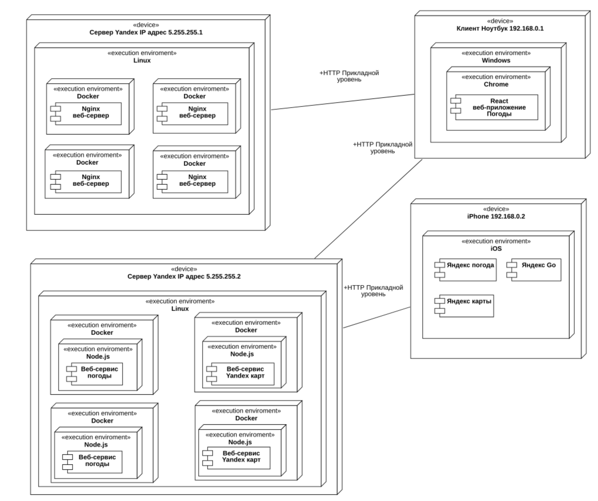

# Методические указания по выполнению Домашнего задания

## План

1. Доработка приложения
    1. Добавление разрешений для разных групп пользователей в методы бекенда с авторизацией. [Методичка](Permissions.md)
    2. Добавление новых страниц и компонентов для интерфейса менеджера 
2. Отчет
    1. Описание бизнес-процессов
    2. Описание архитектуры
    3. Описание алгоритмов обработки информации

## Описание бизнес-процессов

Функции пользователей в системе и их рабочие места указаны на диаграмме прецедентов. Также мы разделяем интерфейс на части для различных пользователей

На диаграмме деятельности описан характерный бизнес-процесс нашего приложения

А на диаграмме состояний приводим список статусов заказа (заявок и тд) и возможные переходы между ними в приложении

## Описание архитектуры

На диаграмме развертывания перечисляем физические узлы нашей системы и протоколы взаимодействия. Также на диаграмме приведены программные компоненты и требуемые им среды исполнения.  

Структура базы данных приведена на ER-диаграмме. Назначение таблиц ... 

Более детально программные компоненты системы и их зависимости описаны на диаграмме классов.

## Описание алгоритмов обработки информации

Диаграмму последовательности используем для описания AJAX запросов от приложений к веб-сервису

