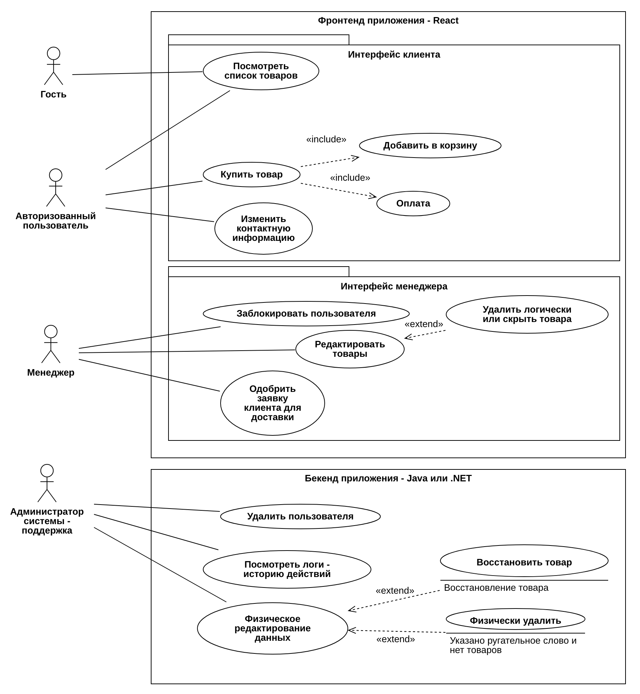
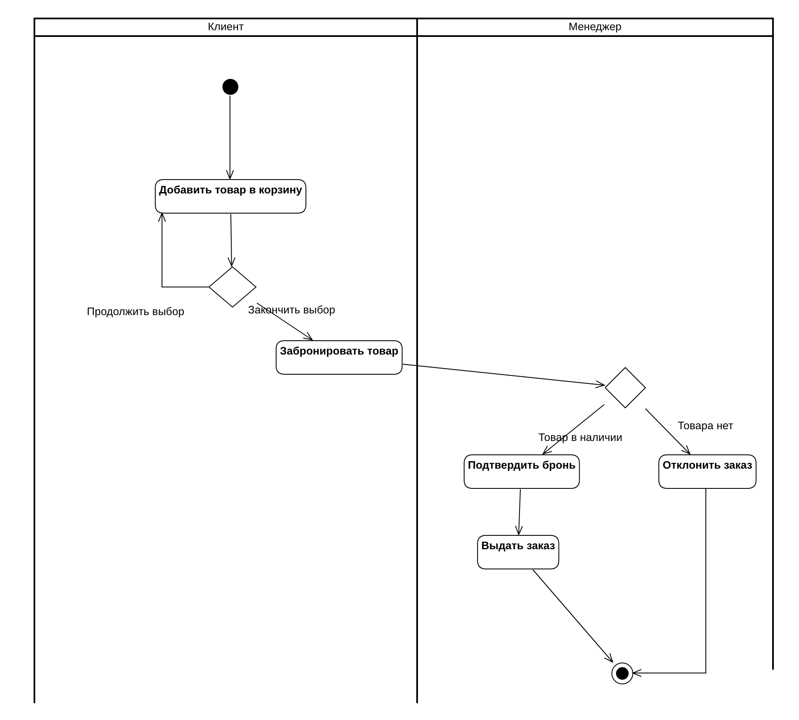
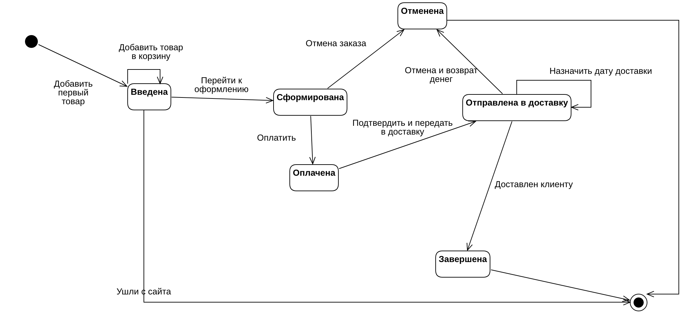
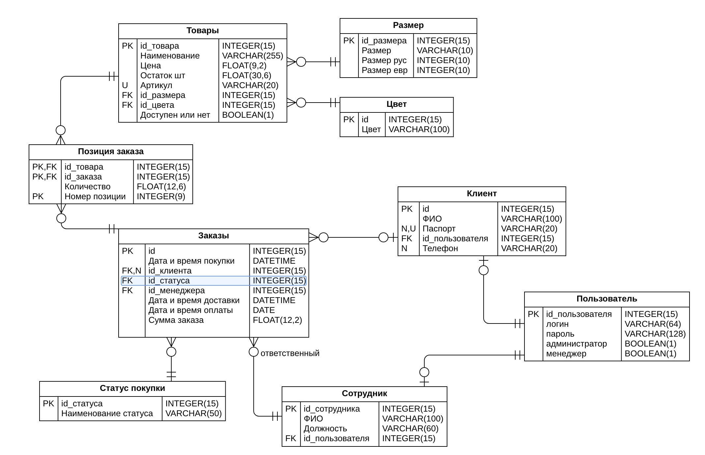
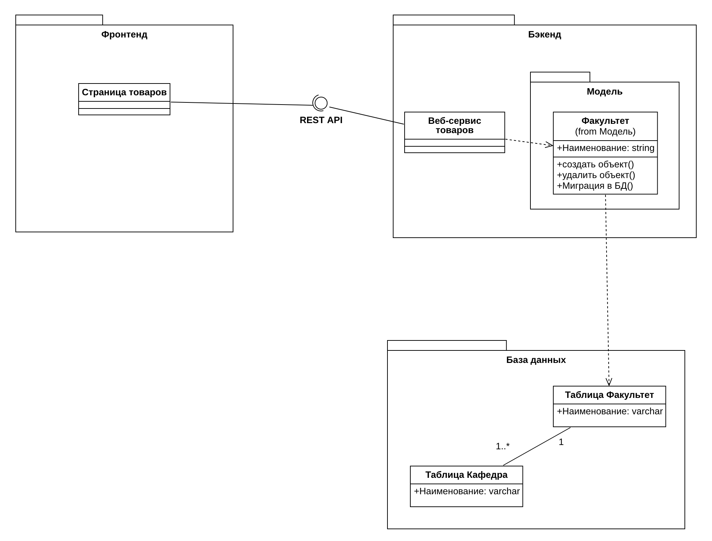
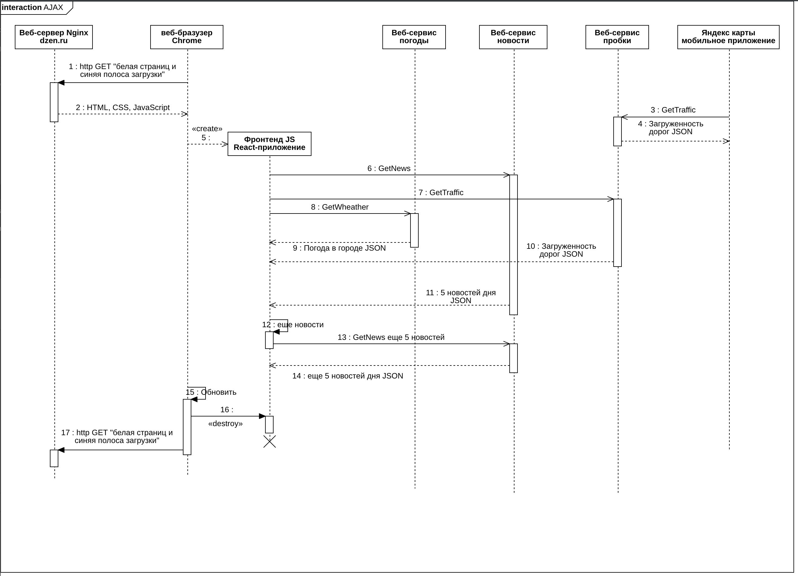

# Методические указания по выполнению Домашнего задания

## to-do Главное меню приложения

## Список диаграмм

#### Диаграмма прецедентов

#### Диаграмма деятельности

#### Диаграмма состояний

#### Диаграмма развертывания

#### Диаграмма ER

#### Диаграмма классов

#### Диаграмма последовательности

