# Установка NodeJS, Python, Docker & Git

Навигация по документу:

-   Установка [Python](#установка-python)
-   Установка [Node.js](#установка-nodejs)
-   Установка [Git](#установка-git)
-   Установка [Docker](#установка-docker)

# Установка Python

# Linux

## 1. Установка Python

Python является частью многих дистрибутивов Linux, поэтому он предустановлен.
Сначала посмотрите какая версия Python установлена в вашей системе. Для этого выполните команду:

```sh
 python3 --version
```

На момент написания методического указания последней версией Python является 3.12. Она предустановлена в новейших версиях Ubuntu.
Если по каким-либо причинам она не установлена у вас, то введите в терминале:

```sh
sudo apt update && sudo apt install python3.12
```

Теперь при вводе команды `python3` у вас будет запускаться Python 3.12.

## 2. Установка пакетов

Для управления программными пакетами Python используется инструмент pip, предназначенный для установки и управления пакетами программирования.

```sh
sudo apt install -y python3-pip
```

Пакеты Python можно установить с помощью следующей команды:

```sh
pip3 install package_name
```

Для того, чтобы не вводить каждый раз `python3`, а вводить просто `python`, можно установить пакет `python-is-python3`. Он просто создает псевдоним для `python3`.

```sh
sudo apt install python-is-python3
```

## 3. [Виртуальное окружение][venv-info]

Чтобы создать виртуальную среду, мы используем модуль venv. Это удобный инструмент для управления зависимостями и изоляции проектов, который выстроен в Python, начиная с версии Python 3.3+. Поэтому модуль venv нельзя использовать для изоляции программ Python 2.
Установка venv:

```sh
sudo apt install python3-venv -y
```

## Создание проекта

Приступим к созданию проекта. Первым делом следует создать папку проекта и перейти в нее, в Linux это можно сделать при помощи следующих команд:

```sh
mkdir my_python_project
cd my_python_project
```

## Создание виртуальной среды

Теперь создадим в этой папке виртуальную среду:

```sh
python3 -m venv .venv
```

## Активация виртуальной среды

Осталось активировать виртуальную среду при помощи команды:

```sh
source .venv/bin/activate
```

## Проверка установленных пакетов

Теперь проверим установленные пакеты pip внутри виртуальной среды:

```sh
pip3 list
```

## Выход из виртуальной среды

Для выхода из виртуальной среды необходимо выполнить команду:

```sh
deactivate
```

## Перенос установленных пакетов

Для переноса установленных пакетов в другую среду на Linux можно использовать простую команду:

```sh
python3 -m pip freeze > requirements.txt
```

Она создаст файл `requirements.txt`, в котором будет находится список всех установленных пакетов.

## Импорт пакетов в другую среду

Теперь можно перейти в другую виртуальную среду и импортировать пакеты следующей командой:

```sh
pip3 install -r requirements.txt
```

## Pip-compile

Файл requirements.txt содержит сырой список зависимостей с жестко объявленными версиями. По этому списку часто сложно понять набор действительно необходимых пакетов для работы системы, а также управлять перекрестными зависимостями (теми, которые необходимы для работы пакетов первой необходимости).

Для подобных целей существует инструмент `pip-compile`. Он позволяет разделить требования к виртуальному окружению и список устанавливаемых зависимостей. Для этого требуется сформировать файл `requirements.in`, где записывается набор пакетов с необходимыми ограничениями по версиям (при необходимости). Пример `requirements.in`:

```sh
# requirements.in
django
```

Далее путем применения отдельной команды `pip-compile` данный файл "компилируется" и преобразуется в набор неконфликтующих зависимостей с зафиксированными версиями (файл `requirements.txt`).

Подробнее в [документации][pip-tools]

# Windows

## Скачивание установщика

С официального [сайта][python-downloads-site] скачайте необходимую версию Python на Windows

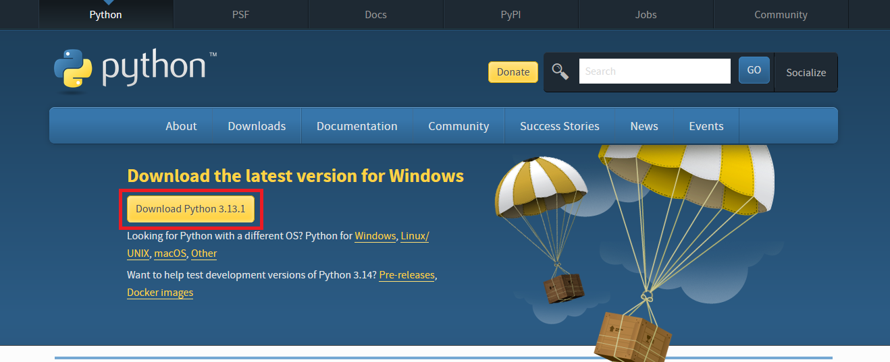

## 1. Установка Python

Запустите установщик и нажмите `Install Now` после чего Python установится на ваш компьютер.
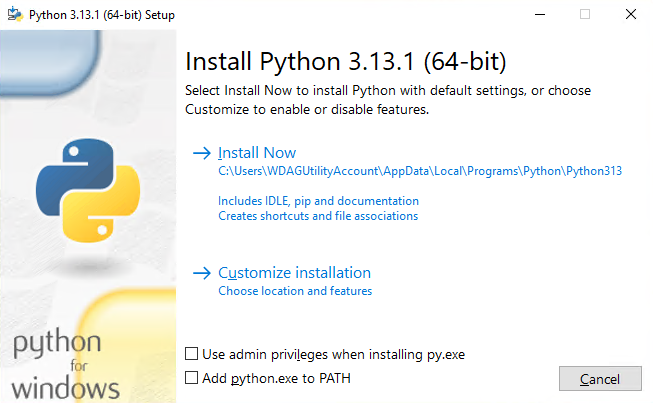

> [!IMPORTANT]  
> Важно: после установки на некоторых системах python будет доступен не по имени `python`, а как `py`. Например, чтобы запустить скрипт, надо ввести не `python main.py`, а `py main.py`

## 2. Установка пакетов

Для управления программными пакетами Python используется инструмент `pip`, предназначенный для установки и управления пакетами программирования.

Пакеты Python можно установить с помощью следующей команды:

```sh
python -m pip install *имя пакета*
```

# 3. [Виртуальное окружение][venv-info]

Чтобы создать виртуальную среду, мы используем модуль `venv`. Это удобный инструмент для управления зависимостями и изоляции проектов, который выстроен в Python, начиная с версии Python 3.3+. Поэтому модуль venv нельзя использовать для изоляции программ Python 2.
Он был установлен вместе с Python установщиком, поэтому ничего дополнительно скачивать не нужно.

## Создание проекта

Приступим к созданию проекта. Первым делом следует создать папку проекта и перейти в нее, в Windows, как и в Linux, это можно сделать при помощи следующих команд:

```sh
mkdir my_python_project
cd my_python_project
```

## Создание виртуальной среды

Теперь создадим в этой папке виртуальную среду:

```sh
python -m venv .venv/
```

## Активация виртуальной среды

Осталось активировать виртуальную среду при помощи команды (в среде `Powershell`):

```powershell
& .venv\Scripts\activate
```

В случае успешного выполнения команды у вас должна появиться надпись `(.venv)`, что означает, что вы находитесь в виртуальной среде.


У вас могла возникнуть такая ошибка:
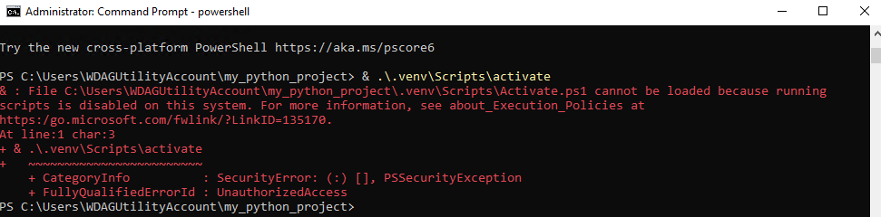
Это происходит, потому что по умолчанию скрипты Powershell блокируются для запуска. Механизм этот называется [Execution Policy][pwsh-execution-policy]. Однако, зачастую необходимо разрешить выполнение скриптов, чтобы, например, иметь возможность выполнять их по расписанию в планировщике заданий.

### Смена политики выполнения скриптов

Чтобы сменить политику, необходимо воспользоваться командой:

```
Set-ExecutionPolicy
```

Доступные значения:
`Unrestricted, RemoteSigned, AllSigned, Restricted, Default, Bypass, Undefined`
Наиболее интересны для нас первые четыре:
• `Restricted` — выполнение сценариев запрещено. Эта опция установлена по умолчанию. Команды в таком случае можно выполнять только в интерактивном режиме.
• `All Signed` — разрешено выполнение только сценариев, подписанных доверенным издателем.
• `RemoteSigned` — разрешено выполнение любых сценариев, созданных локально, а сценарии, созданные на удаленных системах, выполняются только в том случае, если подписаны доверенным издателем.
• `Unrestricted` — разрешено выполнение абсолютно любых сценариев.
Наиболее безопасным будет параметр RemoteSigned, который будет выполнять только сценарии, созданные вами локально.
Чтобы изменить политику, запустите Powershell от имени администратора и введите:

```powershell
Set-ExecutionPolicy RemoteSigned
```

Видим запрос

```
Изменение политики выполнения
Политика выполнения защищает компьютер от ненадежных сценариев. Изменение политики выполнения может поставить под угрозу безопасность системы, как описано в разделе справки, вызываемом командой about_Execution_Policies и расположенном по адресу https:/go.microsoft.com/fwlink/?LinkID=135170 . Вы хотите изменить политику выполнения?
[Y] Да — Y [A] Да для всех — A [N] Нет — N [L] Нет для всех — L [S] Приостановить — S [?] Справка
(значением по умолчанию является «N»):
```

Выбираем пункт A .

## Проверка установленных пакетов

Теперь проверим установленные пакеты pip внутри виртуальной среды:

```sh
pip3 list
```

## Выход из виртуальной среды

Для выхода из виртуальной среды необходимо выполнить команду:

```sh
deactivate
```

После чего можно увидеть, что надпись `(.venv)` пропала, что означает успешную деактивацию виртуальной среды.

## Перенос установленных пакетов

Для переноса установленных пакетов в другую средуможно использовать простую команду:

```sh
python -m pip freeze > requirements.txt
```

Она создаст файл `requirements.txt`, в котором будет находится список всех установленных пакетов.

## Импорт пакетов в другую среду

Теперь можно перейти в другую виртуальную среду и импортировать пакеты следующей командой:

```sh
pip3 install -r requirements.txt
```

## Pip-compile

Файл requirements.txt содержит сырой список зависимостей с жестко объявленными версиями. По этому списку часто сложно понять набор действительно необходимых пакетов для работы системы, а также управлять перекрестными зависимостями (теми, которые необходимы для работы пакетов первой необходимости).

Для подобных целей существует инструмент `pip-compile`. Он позволяет разделить требования к виртуальному окружению и список устанавливаемых зависимостей. Для этого требуется сформировать файл `requirements.in`, где записывается набор пакетов с необходимыми ограничениями по версиям (при необходимости). Пример `requirements.in`:

```sh
# requirements.in
django
```

Далее путем применения отдельной команды `pip-compile` данный файл "компилируется" и преобразуется в набор неконфликтующих зависимостей с зафиксированными версиями (файл `requirements.txt`).

Подробнее в [документации][pip-tools]

# macOS

Мы будем использовать homebrew для установки Python.

## Устанока homebrew

Сначала установим homebrew:

```sh
# Download and install Homebrew
curl -o- https://raw.githubusercontent.com/Homebrew/install/HEAD/install.sh | bash
```

## Установка Python

Теперь установим сам python

```sh
brew install python
```

## 2. Установка пакетов

Для управления программными пакетами Python используется инструмент pip, предназначенный для установки и управления пакетами программирования. Brew уже установил pip вместе с python.

Пакеты Python можно установить с помощью следующей команды:

```sh
pip3 install package_name
```

## 3. [Виртуальное окружение][venv-info]

Чтобы создать виртуальную среду, мы используем модуль venv. Это удобный инструмент для управления зависимостями и изоляции проектов, который выстроен в Python, начиная с версии Python 3.3+. Поэтому модуль venv нельзя использовать для изоляции программ Python 2.

## Создание проекта

Приступим к созданию проекта. Первым делом следует создать папку проекта и перейти в нее, в macOS это можно сделать при помощи следующих команд:

```sh
mkdir my_python_project
cd my_python_project
```

## Создание виртуальной среды

Теперь создадим в этой папке виртуальную среду:

```sh
python3 -m venv .venv
```

## Активация виртуальной среды

Осталось активировать виртуальную среду при помощи команды:

```sh
source .venv/bin/activate
```

## Проверка установленных пакетов

Теперь проверим установленные пакеты pip внутри виртуальной среды:

```sh
pip3 list
```

## Выход из виртуальной среды

Для выхода из виртуальной среды необходимо выполнить команду:

```sh
deactivate
```

## Перенос установленных пакетов

Для переноса установленных пакетов в другую среду на macOS можно использовать простую команду:

```sh
python3 -m pip freeze > requirements.txt
```

Она создаст файл `requirements.txt`, в котором будет находится список всех установленных пакетов.

## Импорт пакетов в другую среду

Теперь можно перейти в другую виртуальную среду и импортировать пакеты следующей командой:

```sh
pip3 install -r requirements.txt
```

## Pip-compile

Файл requirements.txt содержит сырой список зависимостей с жестко объявленными версиями. По этому списку часто сложно понять набор действительно необходимых пакетов для работы системы, а также управлять перекрестными зависимостями (теми, которые необходимы для работы пакетов первой необходимости).

Для подобных целей существует инструмент `pip-compile`. Он позволяет разделить требования к виртуальному окружению и список устанавливаемых зависимостей. Для этого требуется сформировать файл `requirements.in`, где записывается набор пакетов с необходимыми ограничениями по версиям (при необходимости). Пример `requirements.in`:

```sh
# requirements.in
django
```

Далее путем применения отдельной команды `pip-compile` данный файл "компилируется" и преобразуется в набор неконфликтующих зависимостей с зафиксированными версиями (файл `requirements.txt`).

Подробнее в [документации][pip-tools]

[python-downloads-site]: https://www.python.org/downloads/
[venv-info]: https://blog.sedicomm.com/2021/06/29/chto-takoe-venv-i-virtualenv-v-python-i-kak-ih-ispolzovat/#1
[pip-tools]: https://pypi.org/project/pip-tools/
[pwsh-execution-policy]: https://winrcmd.wordpress.com/2019/01/23/razreshit-powershell-scripty-powershell-execution-policy/

# Установка Node.js

## 1. Что такое node, npm и package.json

### Node.js

Наш JavaScript код, который мы писали в предыдущих лабораторных, исполняется в браузере. В браузере у нас есть компилятор JavaScript кода в машинных код, в Google Chrome это движок [V8][v8]. Если мы хотим запускать код на нашем компьютере, а не в браузере, то нам нужно использовать [Node.js][node]. Node - это программная платформа, которая позволяет компилировать JavaScript код в машинный на нашем компьютере. Node.js добавляет возможность нам взаимодействовать с утройствами ввода-вывода, подключать внешние библиотеки. На нем в основном пишут веб-сервера, но есть возможность разрабатывать и десктопные оконные приложения и даже программировать микроконтроллеры.

### Npm

В любом языке программирования нам нужно уметь работать с внешними библиотеками. На фронтенде для этого используется пакетный менеджер [Npm][npm]. С помощью npm мы можем скачивать нужные нам пакеты, которые потом будем использовать в нашем приложении. Все наши библиотеки скачиваются в специальную папку `node_modules`, вы увидите ее у себя в проекте, когда скачаете первую библиотеку.

### Package.json и package-lock.json

[Package.json][package.json] - это основной файл в нашем приложении, который хранит всю информацию о проекте. В этом файле хранится название проекта, описания, версия, скрипты и многое другое. Именно в этом файле храниться информация о всех пакетах, которые мы поставили через npm, и версия этих зависимостей.

[Package-lock.json][package-lock.json] - это файл, который хранит дерево зависимостей. Библиотеки, которые мы устанавливаем, могут иметь вложенные зависимости и этот файл хранит полное дерево.

## 2. Установка

## Linux

В данном разделе мы будем устанавливать NodeJS на Ubuntu. В системах с другим пакетным менеджером все делается аналогично.

### 1. Обновление дистрибутива

Для начала нужно обновить дистрибутив. Используйте команду:

```sh
sudo apt update && sudo apt upgrade
```


### 2. Установка nvm

После обновления системы и информации о репозиториях давайте установим nvm. Мы будем использовать для этого встроенную утилиты `wget` или `curl`.

Если у вас в системе установлена **curl**, то введите команду:
`curl -o- https://raw.githubusercontent.com/nvm-sh/nvm/master/install.sh | bash`

Если же у вас не установлена curl, но есть **wget**, то:
`wget -q -O - https://raw.githubusercontent.com/nvm-sh/nvm/master/install.sh | bash`

После установки у вас должно появиться следующее сообщение:
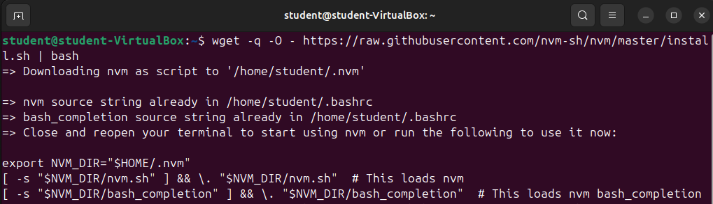
**После этого обязательно перезапустите терминал!** Это необходимо сделать, чтобы команда nvm была доступна.

### 3. Установка NodeJS

И, наконец, установка NodeJS
Выполните команду `nvm install --lts` для установки последней LTS версии NodeJS. LTS версии дольше поддерживаются разработчиками NodeJS чем обычные версии.

\*После установки можно посмотреть список всех установленных версий: `nvm list`, где будет одна только что установленная нами версия (начинается с `->`)


### 4. Давайте проверим версию node и npm:

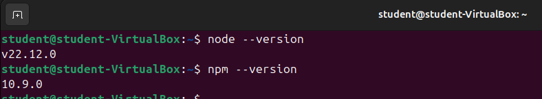

Как видим, NodeJS и npm успешно установлены.

### 5. Запуск скрипта через Node.js

1. Давайте создадим простой скрипт `hi.js` со следующим содержимым:

```js
console.log("Hello world!");
```

2. Теперь запустим этот скрипт:

```sh
node hi.js
```

Нам должна вывеститься строка `Hello world!` в консоль.

Итого, `Node.js` успешно установлен

## Windows

Мы будем использовать программу nvm-windows для установки NodeJS, потому что версии NodeJS меняются очень быстро и в будущем при работе с различными проектами вам потребуется переключаться между несколькими версиями NodeJS в зависимости от версии, которая требуется для выбранного проекта.
Node version manager, чаще называемый nvm, является самым популярным способом установки нескольких версий Node.js, но доступен только для Mac/Linux и не поддерживается в Windows. Для Windows есть nvm-windows — это инструмент, который позволяет управлять несколькими версиями Node.js на одном компьютере с ОС Windows.

> [!CAUTION]
> Перед установкой диспетчера версий рекомендуется удалить все существующие установки Node.js или npm из операционной системы, так как различные типы установки могут привести к странным и запутанным конфликтам.

### 1. Загрузка установщика

В первую очередь нужно перейти на [страницу релизов nvm-windows][win-nvm-releases]. На ней нужно скачать nvm-setup.exe

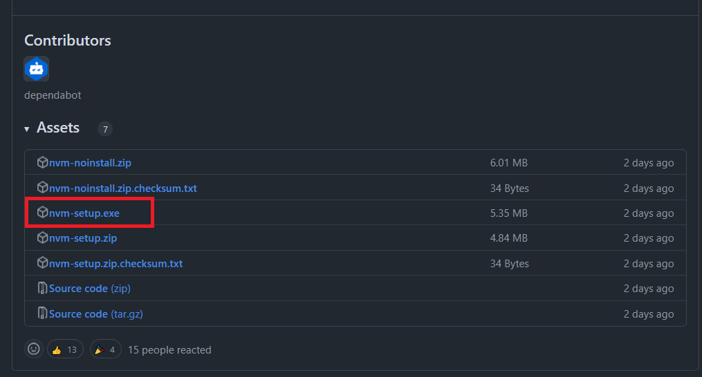

### 2. Установка NVM

Установите NVM

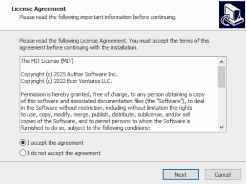

### 3. Установка Node

После установки NVM запустите powershell с правами администратора.

Выполните команды:

-   `nvm install latest --lts` для установки последней LTS версии Node
-   `nvm use xx.xx.xx`, где xx.xx.xx -- последняя версия. В моем случае это 23.5.0. Этой командой мы указываем какую версию NodeJS собираемся использовать
-   `npm --version` для проверки работоспособности npm
-   `node --version` для проверки работоспособности node

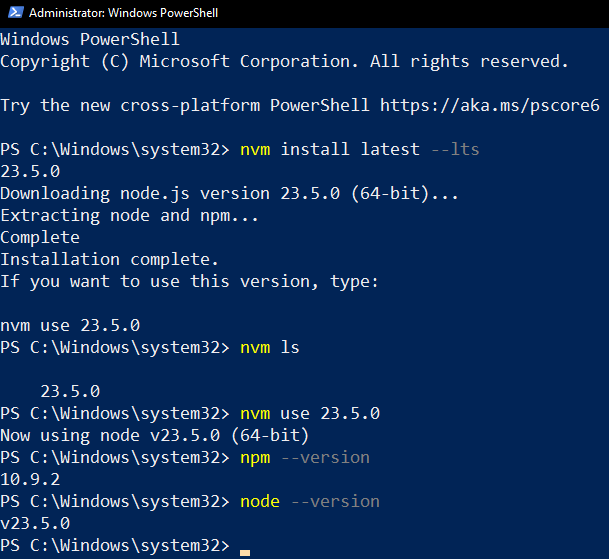

### 4. Запуск скрипта через Node.js

1. Давайте создадим простой скрипт `hi.js` со следующим содержимым:

```js
console.log("Hello world!");
```

2. Теперь запустим этот скрипт:

```sh
node hi.js
```

Нам должна вывеститься строка `Hello world!` в консоль.

Итого, `Node.js` успешно установлен

## macOS

### 1. Установка Homebrew

Homebrew — это популярный пакетный менеджер для macOS (и Linux), который упрощает установку и управление программным обеспечением. Он позволяет пользователям легко устанавливать, обновлять и удалять программы и библиотеки, используя командную строку.

Установите Homebrew:

```sh
# Download and install Homebrew
curl -o- https://raw.githubusercontent.com/Homebrew/install/HEAD/install.sh | bash
```

### 2. Установка Node.js

Установите Node.js:

```sh
brew install node@22
```

Проверьте, установился ли Node.js и npm:

```sh
node -v # Должна вывести "v22.12.0".

npm -v # Должна вывести "10.9.0".
```

[v8]: https://v8.dev
[node]: https://nodejs.org
[package.json]: https://docs.npmjs.com/cli/v9/configuring-npmpackage-json
[package-lock.json]: https://docs.npmjs.com/cli/v9/configuring-npm/package-lock-json
[npm]: https://www.npmjs.com

### 3. Запуск скрипта через Node.js

1. Давайте создадим простой скрипт `hi.js` со следующим содержимым:

```js
console.log("Hello world!");
```

2. Теперь запустим этот скрипт:

```sh
node hi.js
```

Нам должна вывеститься строка `Hello world!` в консоль.

Итого, `Node.js` успешно установлен

# Инициализация проекта

-   Создаем пустую папку и открываем ее в VS Code.
-   Инициализируем проект в npm с помощью команды `npm init`.

При инициализации проекта у нас будут спрашивать много вопросов, но их все можно пропустить нажав `Enter`. В конце у нас появится настроенный файл `package.json`.

Во все проекты принято добавлять `.gitignore` файл, который не будет добавлять лишнее в наш git репозиторий. Подробнее о `.gitignore` можно почитать [тут][about-gitignore].

-   Создаем файл `.gitignore` и копируем туда содержимое [файла][gitignore-file].

Мы создали проект, который состоит из файлов `package.json` и `.gitignore`. Можно приступать к написанию основного кода.

**_По итогу мы имеем следующую структуру проекта._**

```bash
├── .gitignore
├── package.json
```

[about-gitignore]: https://tyapk.ru/blog/post/gitignore
[gitignore-file]: https://github.com/iu5git/JavaScript/blob/main/tutorials/lab3/assets/.gitignore
[win-nvm-releases]: https://github.com/coreybutler/nvm-windows/releases

# Установка Git

## Linux

Для установки `git` достаточно ввести в терминале

```sh
sudo apt update && sudo apt install git
```

## Windows

### Загрузка установщика

Скачайте с [сайта][win-git-download-link] установщик git
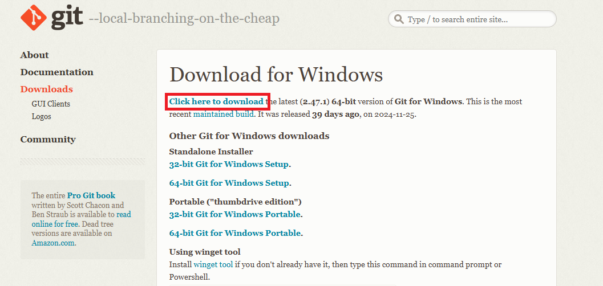

### Установка

Установите git. В процессе установки можно оставить все значения по умолчанию.
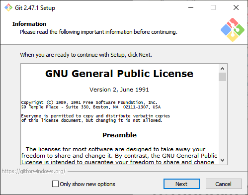

После этого `git` будет успешно установлен.

## macOS

Установка будет проходить через Homebrew. Homebrew — это популярный менеджер пакетов для macOS, который упрощает установку программного обеспечения.

### Установка Homebrew

Установите Homebrew, если он еще не установлен. Введите в терминале:

```sh
/bin/bash -c "$(curl -fsSL https://raw.githubusercontent.com/Homebrew/install/HEAD/install.sh)"
```

### Установка git

После установки Homebrew, введите следующую команду для установки Git:

```sh
brew install git
```

### Проверка версии

После установки проверьте версию Git в терминале:

```sh
git --version
```

# Установка Docker

Мы будем устанавливать не только Docker, но еще и Docker Desktop!
Docker — это платформа контейнеризации с открытым исходным кодом, разработанная для создания, доставки и запуска приложений в контейнерах.
Docker Desktop — это приложение, которое предоставляет графический интерфейс для работы с Docker.

То есть Docker Desktop — это удобный интерфейс для Docker, чтобы нам намного меньше приходилось вводить команды для работы с контейнерами в терминале.

## Linux

### Удаление конфликтующих пакетов

Перед установкой Docker необходимо удалить конфликтующие пакеты, если конечно они были установлены:

```sh
for pkg in docker.io docker-doc docker-compose docker-compose-v2 podman-docker containerd runc; do sudo apt-get remove $pkg; done
```

### Добавление репозитория Docker

Нужно добавить репозиторий Docker в apt. Для этого введите в терминале:

```sh
# Add Docker's official GPG key:
sudo apt-get update
sudo apt-get install ca-certificates curl
sudo install -m 0755 -d /etc/apt/keyrings
sudo curl -fsSL https://download.docker.com/linux/ubuntu/gpg -o /etc/apt/keyrings/docker.asc
sudo chmod a+r /etc/apt/keyrings/docker.asc

# Add the repository to Apt sources:
echo \
  "deb [arch=$(dpkg --print-architecture) signed-by=/etc/apt/keyrings/docker.asc] https://download.docker.com/linux/ubuntu \
  $(. /etc/os-release && echo "$VERSION_CODENAME") stable" | \
  sudo tee /etc/apt/sources.list.d/docker.list > /dev/null
sudo apt-get update
```

### Установка Docker & Docker Desktop

Скачайте по [ссылке][ubuntu-docker-binary] DEB пакет Docker Desktop, в который входит и Docker Engine, и Docker Desktop.

После скачивания откройте терминал, перейдите в "Загрузки" и установите скачанный пакет:

```sh
cd ~/Downloads
sudo apt update
sudo apt install ./docker-desktop-amd64.deb -y
```

После установки обязательно перезагрузите компьютер.

### Проверка работоспобности Docker

Чтобы проверить, работает ли Docker, введите в терминале:

```sh
docker run hello-world
```

На что Docker должен вывести:

```Hello from Docker!
This message shows that your installation appears to be working correctly.

To generate this message, Docker took the following steps:
 1. The Docker client contacted the Docker daemon.
 2. The Docker daemon pulled the "hello-world" image from the Docker Hub.
    (amd64)
 3. The Docker daemon created a new container from that image which runs the
    executable that produces the output you are currently reading.
 4. The Docker daemon streamed that output to the Docker client, which sent it
    to your terminal.

To try something more ambitious, you can run an Ubuntu container with:
 $ docker run -it ubuntu bash

Share images, automate workflows, and more with a free Docker ID:
 https://hub.docker.com/

For more examples and ideas, visit:
 https://docs.docker.com/get-started/
```

### Ошибка Cannot connect to the Docker daemon

Если у вас возникла ошибка `docker: Cannot connect to the Docker daemon at unix:///home/user/.docker/desktop/docker.sock. Is the docker daemon running?`, то введите следующую команду, чтобы пользователь имел права доступа к демону Docker:

```sh
sudo usermod -aG docker $USER
```

## Windows

### Загрузка установщика

Скачайте с [официального сайта][docker-site] Docker Desktop

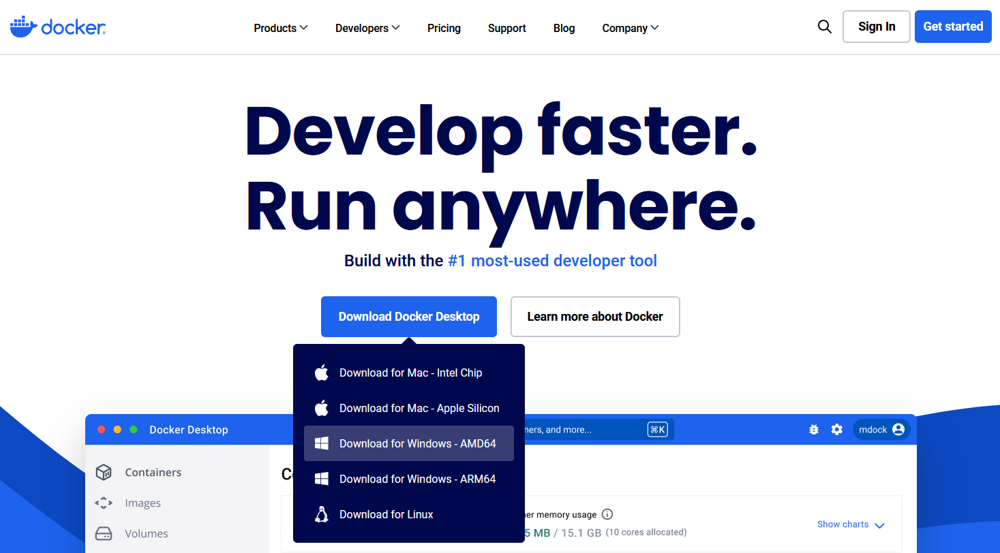

Запустите установщик.
Нажмите `OK`.
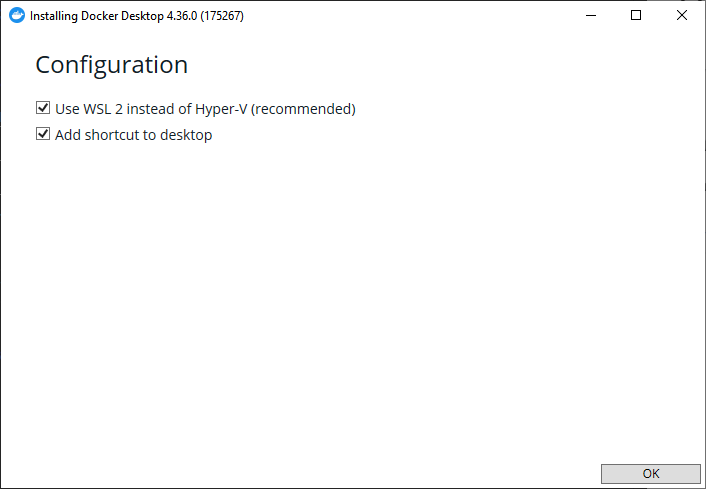

После установки запустите `Docker`
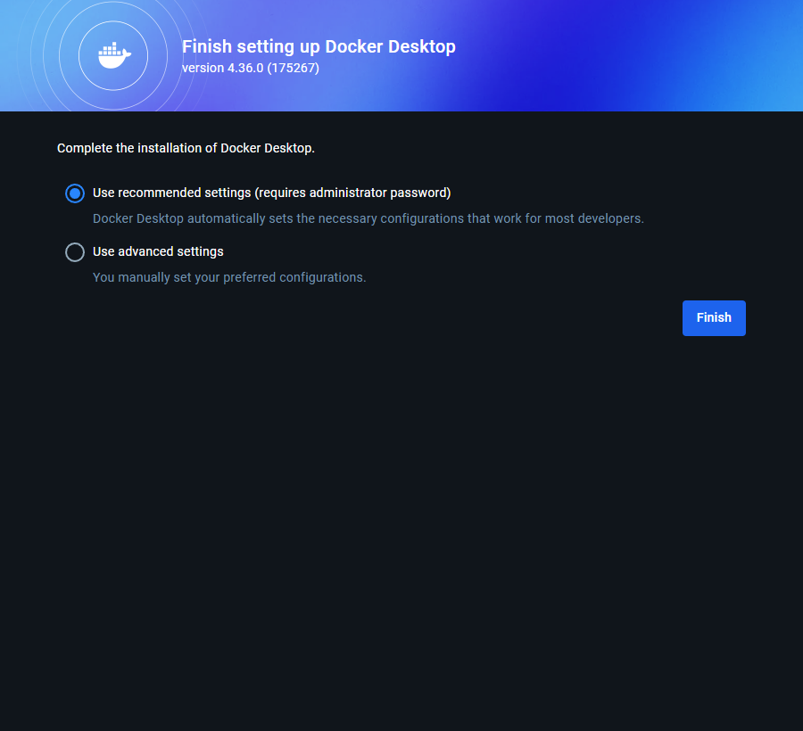
Выберите пункт `Use recommended settigns`.

Пропустите шаги, если вы не хотите входить в аккаунт Docker Hub


### Проверка работоспобности Docker

Чтобы проверить, работает ли Docker, введите в командной строке:

```sh
docker run hello-world
```

На что Docker должен вывести:

```Hello from Docker!
This message shows that your installation appears to be working correctly.

To generate this message, Docker took the following steps:
 1. The Docker client contacted the Docker daemon.
 2. The Docker daemon pulled the "hello-world" image from the Docker Hub.
    (amd64)
 3. The Docker daemon created a new container from that image which runs the
    executable that produces the output you are currently reading.
 4. The Docker daemon streamed that output to the Docker client, which sent it
    to your terminal.

To try something more ambitious, you can run an Ubuntu container with:
 $ docker run -it ubuntu bash

Share images, automate workflows, and more with a free Docker ID:
 https://hub.docker.com/

For more examples and ideas, visit:
 https://docs.docker.com/get-started/
```

Установка Docker и Docker Desktop на этом завершена.

## macOS

### Загрузка установщика

Скачайте с [официального сайта][docker-site] Docker Desktop под вашу платформу
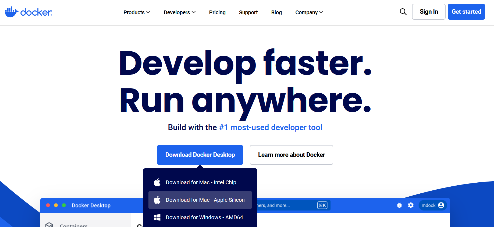

### Установка

Просто перетащите Docker в папку Applications
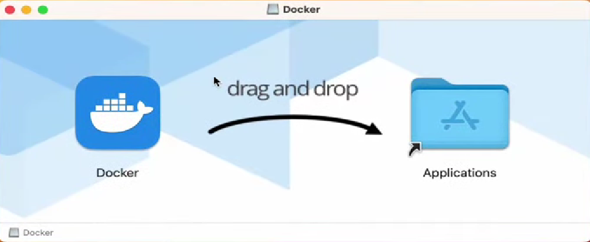

### Проверка работоспобности Docker

Чтобы проверить, работает ли Docker, введите в терминале:

```sh
docker run hello-world
```

На что Docker должен вывести:

```Hello from Docker!
This message shows that your installation appears to be working correctly.

To generate this message, Docker took the following steps:
 1. The Docker client contacted the Docker daemon.
 2. The Docker daemon pulled the "hello-world" image from the Docker Hub.
    (amd64)
 3. The Docker daemon created a new container from that image which runs the
    executable that produces the output you are currently reading.
 4. The Docker daemon streamed that output to the Docker client, which sent it
    to your terminal.

To try something more ambitious, you can run an Ubuntu container with:
 $ docker run -it ubuntu bash

Share images, automate workflows, and more with a free Docker ID:
 https://hub.docker.com/

For more examples and ideas, visit:
 https://docs.docker.com/get-started/
```

На этом установка Docker завершена!

[win-git-download-link]: https://git-scm.com/downloads/win
[ubuntu-docker-binary]: https://desktop.docker.com/linux/main/amd64/docker-desktop-amd64.deb
[docker-site]: https://www.docker.com/
