# Методические указания по выполнению задания для платформы iOS

### Данное методическое указание подходит только для устройств с операционной системой macOS!

# План

1. Установка
2. Создание проекта
3. Запуск и отладка приложения
4. Создание модели отображения
5. Добавление таблицы на экран
6. Создание ячейки
7. Работа с изображением в ячейке
8. Подкючение приложения к собственному сервису
9. Поиск
10. Экран с детальной информацией
11. Примечания
12. Полезные ссылки

# 1. Установка
Зайти на [сайт](https://xcodereleases.com) и открыть вкладку `Releases`. Найти `Xcode`, совместимый с вашим устройством. Или можно зайти в `AppStore` и скачать там `Xcode`.
После установки `Xcode` необходимо зарегистрировать собственный `AppleID` для подписи приложения.
Для этого открыть `Xcode->Preferences->Accounts`, нажать на кнопку `+` и выбрать `AppleID`.


# 2. Создание проекта
В данном пункте мы создадим пустой проект. Для этого необходимо открыть Xcode и нажать Create a new Xcode project.
Выбрать вкладку iOS и нажать App и Next.
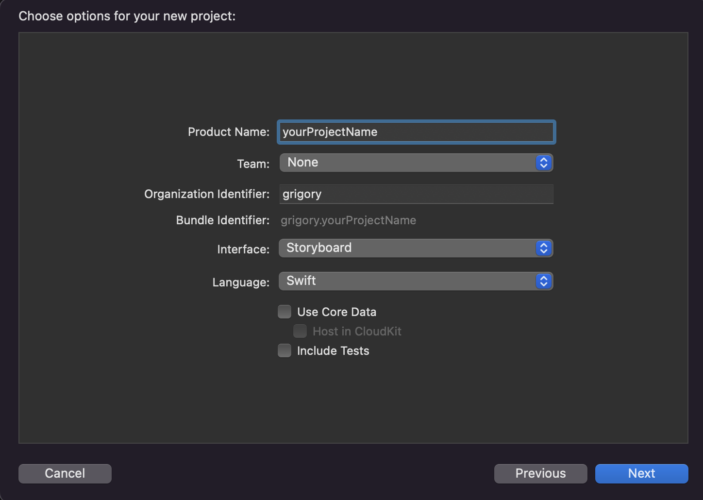

Настройки по вкладкам: Product Name – указать название разрабатываемого приложения. 
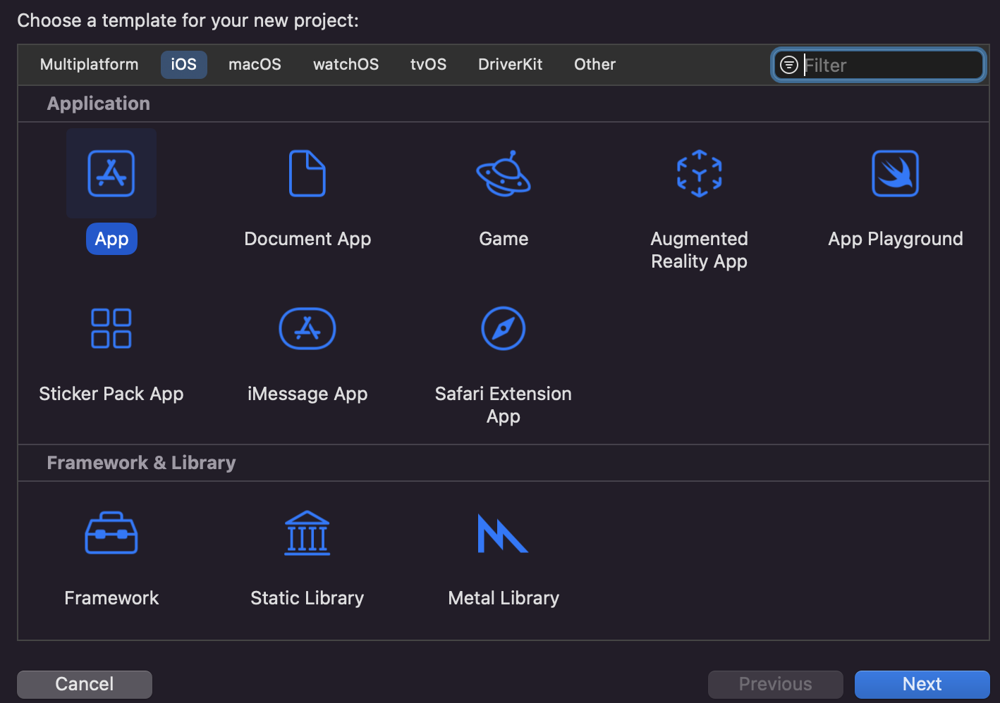
далее выбираете папку, где будет лежать Ваш проект
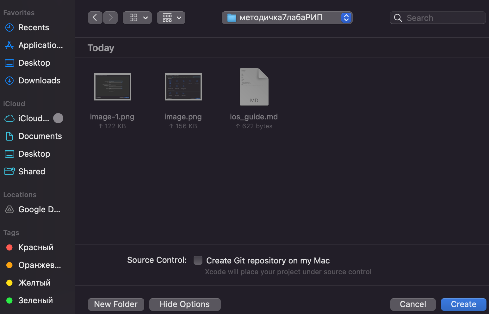
нажимаете create

При создании проекта Xcode автоматически сгенерирует файл <code>ViewController</code>, который является экраном, с которого запускается приложение.
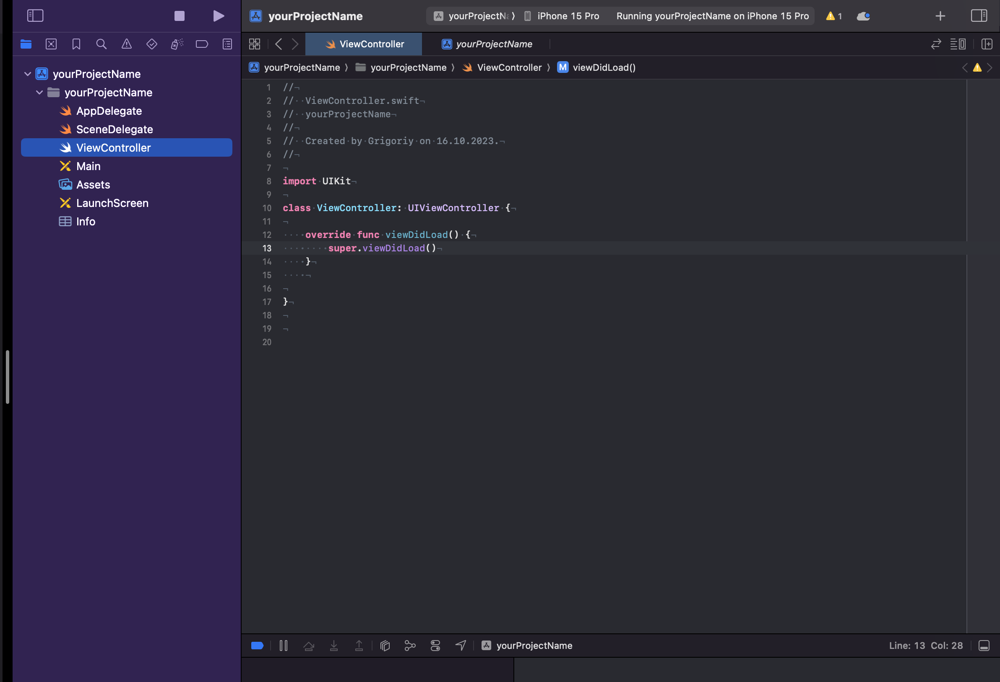

ViewController следует переименовать в соответствии с вашей предметной областью. В нашем случае это `SongListViewController` (для вашей предметной области лучше давать более осмысленное название). 
Далее создадим папки и файлы
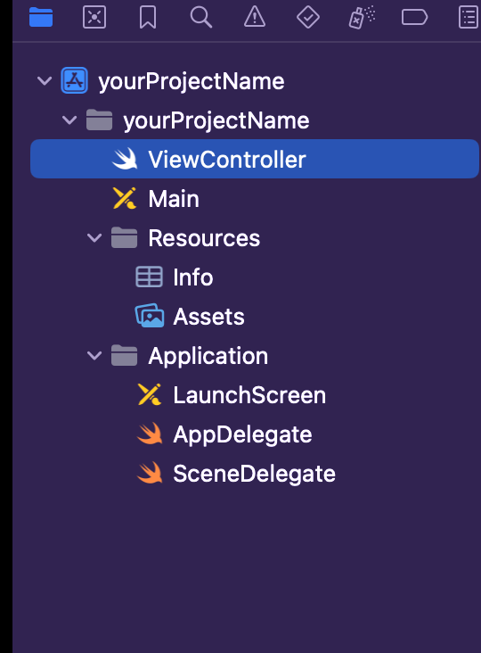

Примечание: в `Swift` принято `CamelCase`
Для удаления папки или файла из проекта необходимо нажать ПКМ или сочетание клавиш `Command+backspace`, выбрать `Delete` и в открывшемся диалоговом окне выбрать `Move to Trash`.
После организации структуры проекта необходимо его собрать. Для этого нажать в верхней панели `Xcode` `Product->Build` (`Command+B`).
Если вы перемещали файл `Info.plist` (переместили из начальной директории) из корня проекта, то проект не соберется и появится ошибка: `Build input file cannot be found`. 
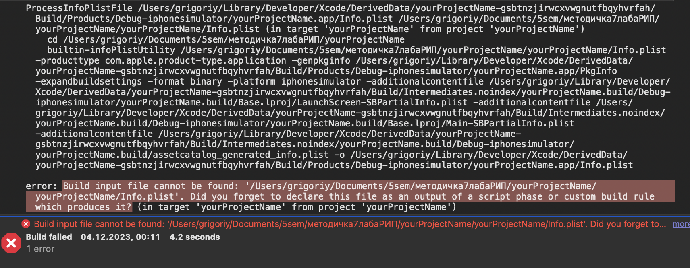

Для решения данной ошибки необходимо нажать на иконку проекта в левом меню, перейти на вкладку `Build Settings` и в поиске набрать `plist`.


В разделе `Packaging` пункта `Info.plist File` необходимо 2 раза щелкнуть ЛКМ на расположение файла `info.plist`, прописать там новый путь до этого файла и нажать `Enter`.

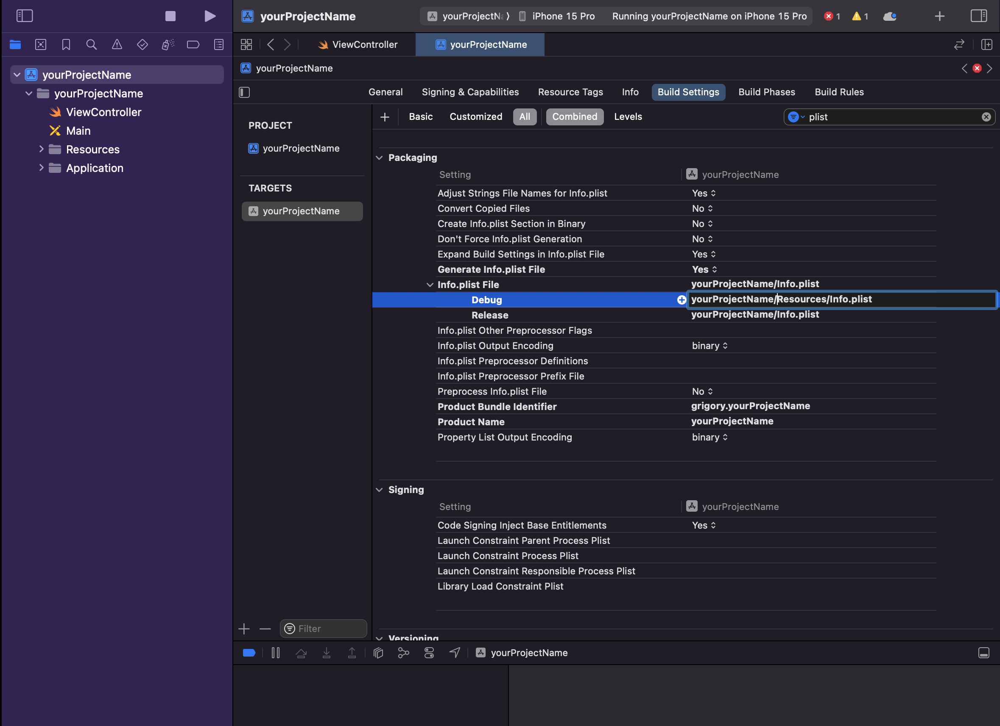

После этого проект должен собираться без ошибок.
Также можно выбрать устройство, с которого будет запускаться приложение путем нажатия на панель изображенную ниже:

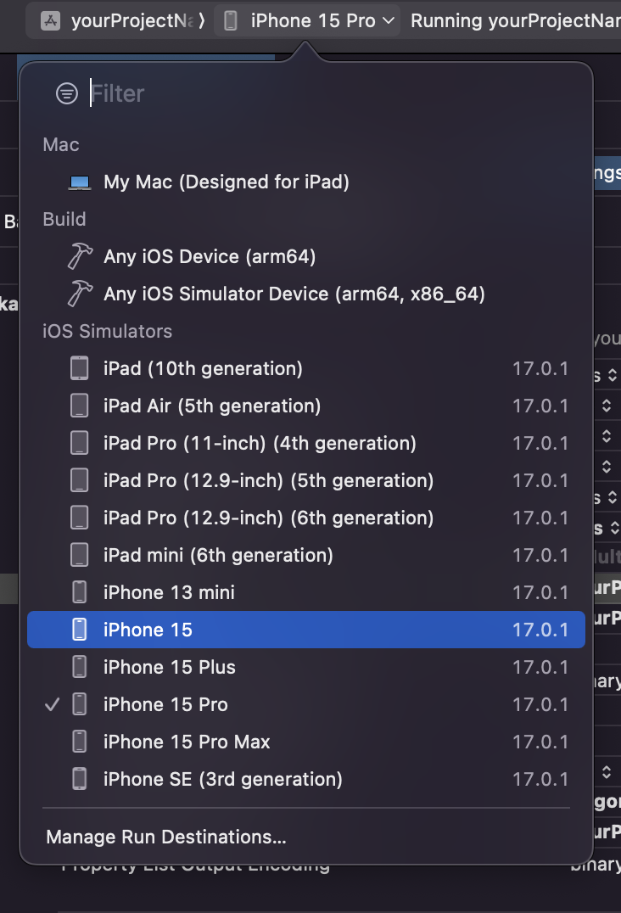

# 3. Запуск и отладка приложения

После этого в файле `SongListViewController.swift` в функции `viewDidLoad` добавим код.


```swift
    override func viewDidLoad() {
        super.viewDidLoad()
        
        view.backgroundColor = .red
    }
```

После этого запустим приложение (Cmd + R)

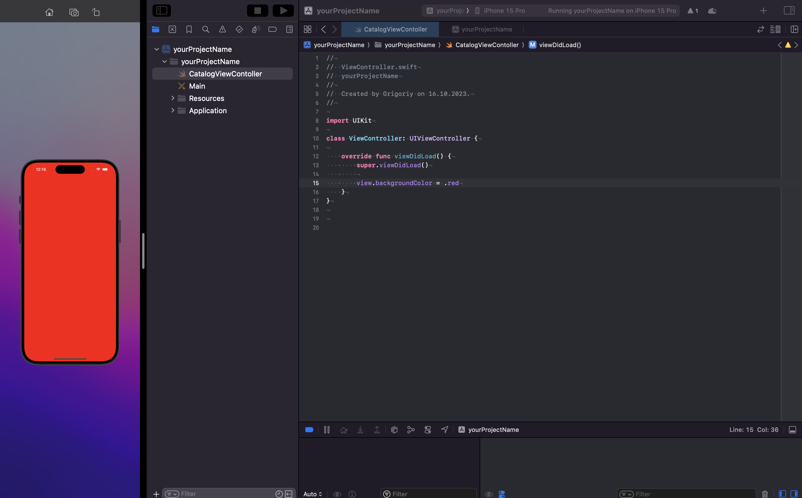

изменим в файле SceneDelegate функцию func scene(_ scene: UIScene, willConnectTo session: UISceneSession, options connectionOptions: UIScene.ConnectionOptions) для того чтобы запускался SongListViewController

```swift
    func scene(_ scene: UIScene, willConnectTo session: UISceneSession, options connectionOptions: UIScene.ConnectionOptions) {
        guard let windowScene = scene as? UIWindowScene else { return }
        window = UIWindow(windowScene: windowScene)
        window?.rootViewController = UINavigationController(rootViewController: SongListViewController())
        window?.makeKeyAndVisible()
    }
```

# 4. Создание модели отображения

Создадим `SongModel`, которая включает в себя следующие поля:

```swift
struct SongModel {
    var trackId: Int?
    var collectionName: String?
    var artistName: String?
    var artworkUrl100: String?
    var releaseDate: String?
    var collectionPrice: Double?
}
```

В созданном `SongListViewController` замокаем данные для отображения:

```swift
class SongListViewController: UIViewController {

    private let models = [SongModel(trackId: 0,
                                    collectionName: "mock collectionName 1",
                                    artistName: "mock artistName 1",
                                    artworkUrl100: "https://static.wixstatic.com/media/5a922b_6cd50e8a382c42bd9660cadc04bae1cd~mv2_d_2000_2000_s_2.jpg",
                                    releaseDate: "01.01.2000",
                                    collectionPrice: 5.75),
                          SongModel(trackId: 1,
                                    collectionName: "mock collectionName 2",
                                    artistName: "mock artistName 2",
                                    artworkUrl100: "https://static.wixstatic.com/media/5a922b_6cd50e8a382c42bd9660cadc04bae1cd~mv2_d_2000_2000_s_2.jpg",
                                    releaseDate: "01.01.2000",
                                    collectionPrice: 5.75)]
 ```

 `models` - массив `SongModel`, в котором хранятся объекты для отображения в таблице

#  5. Добавление таблицы на экран
Сейчас мы добавим на экран таблицу, в которой в будущем сможем отобразить информацию по выбранной тематике, которая придет с бэкенда (В методичке используется данные из API https://itunes.apple.com/search?term=$%7Bterm%7D&media=music&entity=song).


Для того, чтобы на экране отобразилась таблица, необходимо создать переменную класса `SongListViewController` типа `UITableView` и задать там первичные настройки: флаг `translatesAutoresizingMaskIntoConstraints`, `delegate`, `dataSource`, `register`.
Примечаение:

Identifier: `SongList` - должен совпадать с тем что прописан в реализации делегата,
`SongListTableViewCell` - класс, отвечающий за отображение ячейки (код данного класса ниже)

```swift
    private lazy var songList: UITableView = {
        let tableView = UITableView()
        tableView.delegate = self // подписываемся на протокол
        tableView.dataSource = self  // подписываемся на протокол
        tableView.register(SongTableViewCell.self, forCellReuseIdentifier: "SongList") 
        return tableView
    }()
```

Добавление таблицы и последующая верстка происходит с помощью механизма `Auto Layout`. 
Оборачиваем код в функцию и вызваем ее во `viewDidLoad()`:

```swift
    // задаем отступы (в данном слечае прибито к краям экрана)
    private func setSongList() {
        songList.translatesAutoresizingMaskIntoConstraints = false
        songList.topAnchor.constraint(equalTo: view.safeAreaLayoutGuide.topAnchor).isActive = true
        songList.bottomAnchor.constraint(equalTo: view.safeAreaLayoutGuide.bottomAnchor).isActive = true
        songList.leftAnchor.constraint(equalTo: view.safeAreaLayoutGuide.leftAnchor).isActive = true
        songList.rightAnchor.constraint(equalTo: view.safeAreaLayoutGuide.rightAnchor).isActive = true
    }
```

Вызов из `viewDidLoad()`:

```swift
    override func viewDidLoad() {
        super.viewDidLoad()
        
        view.addSubview(songList)
        title = "Наш Список"
        setSongList()
    }
```

После добавления таблицы на `view` и заданием первичных настроек необходимо реализовать `delegate` и `dataSource` таблицы:

```swift
extension SongListViewController: UITableViewDelegate, UITableViewDataSource {
    // колечество ячеек в таблице
    func tableView(_ tableView: UITableView, numberOfRowsInSection section: Int) -> Int {
        models.count
    }

    // создание ячеек
    func tableView(_ tableView: UITableView, cellForRowAt indexPath: IndexPath) -> UITableViewCell {
        guard let cell =  tableView.dequeueReusableCell(withIdentifier: "SongList", for: indexPath)
                          as? SongTableViewCell else {
            return .init()
        }
        return cell
    }
}
```
Создадим класс для ячейки
```swift
final class SongTableViewCell: UITableViewCell {
    
}
```

Получим

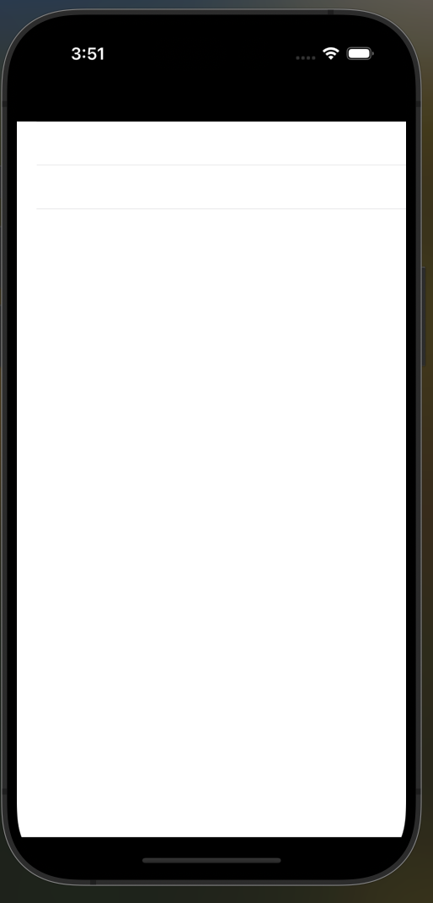

Далее можно изменить размер ячейки
```swift
    // меняем размер ячейки
    func tableView(_ tableView: UITableView, heightForRowAt indexPath: IndexPath) -> CGFloat {
        150
    }
```

# 6. Создание ячейки
В ячейке будем отображать изображение и 2 заголовка:

```swift
final class SongTableViewCell: UITableViewCell {
    private let collectionImage = UIImageView()
    private let collectionName = UILabel()
    private let artistName = UILabel()
    
    override init(style: UITableViewCell.CellStyle, reuseIdentifier: String?) {
        super.init(style: style, reuseIdentifier: reuseIdentifier)

        [collectionImage, collectionName, artistName].forEach {
            addSubview($0)
        }

        backgroundColor = .systemPink.withAlphaComponent(0.6)
        setAppearence()
        setConstraints()
    }

    required init?(coder: NSCoder) {
        fatalError("init(coder:) has not been implemented")
    }
}
```
далее добавим методы setAppearence и setConstraints, 1ый отвечает за отображение (размер, количество строк), 2ой за верстку

```swift
//MARK: - Private Methods
private extension SongTableViewCell {
    func setAppearence() {
        collectionImage.contentMode = .scaleAspectFit
        collectionImage.clipsToBounds = true

        collectionName.numberOfLines = 0
        artistName.numberOfLines = 0
    }

    func setConstraints() {
        setCollectionImage()
        setCollectionName()
        setArtistName()
    }

    func setCollectionImage() {
        collectionImage.translatesAutoresizingMaskIntoConstraints = false
        collectionImage.topAnchor.constraint(equalTo: topAnchor, constant: 5).isActive = true
        collectionImage.bottomAnchor.constraint(equalTo: bottomAnchor, constant: -5).isActive = true
        collectionImage.leftAnchor.constraint(equalTo: leftAnchor, constant: 5).isActive = true
        collectionImage.widthAnchor.constraint(equalToConstant: 140).isActive = true
    }

    func setCollectionName() {
        collectionName.translatesAutoresizingMaskIntoConstraints = false
        collectionName.topAnchor.constraint(equalTo: topAnchor,
                                            constant: 20).isActive = true
        collectionName.leftAnchor.constraint(equalTo: collectionImage.rightAnchor,
                                            constant: 5).isActive = true
        collectionName.rightAnchor.constraint(equalTo: rightAnchor,
                                            constant: 5).isActive = true
    }

    func setArtistName() {
        artistName.translatesAutoresizingMaskIntoConstraints = false
        artistName.topAnchor.constraint(equalTo: collectionName.bottomAnchor,
                                            constant: 20).isActive = true
        artistName.leftAnchor.constraint(equalTo: collectionImage.rightAnchor,
                                            constant: 5).isActive = true
        artistName.rightAnchor.constraint(equalTo: rightAnchor,
                                            constant: 5).isActive = true
    }
}
```


Также добавим функцию, через которую будем передавать ячейке информацию для конфигурирования

```swift
//MARK: - Public Methods
extension SongTableViewCell {
    func cellConfigure(with model: SongModel) {
        collectionName.text = model.collectionName
        artistName.text = model.artistName
        collectionImage.image = UIImage(systemName: "pencil")!
    }
}
```

и добавим конфигурацию ячейки в `SongListViewController`
```swift 
    // создание ячеек
    func tableView(_ tableView: UITableView, cellForRowAt indexPath: IndexPath) -> UITableViewCell {
        guard let cell =  tableView.dequeueReusableCell(withIdentifier: "SongList", for: indexPath)
                          as? SongTableViewCell else {
            return .init()
        }

        cell.cellConfigure(with: models[indexPath.row])

        return cell
    }
```

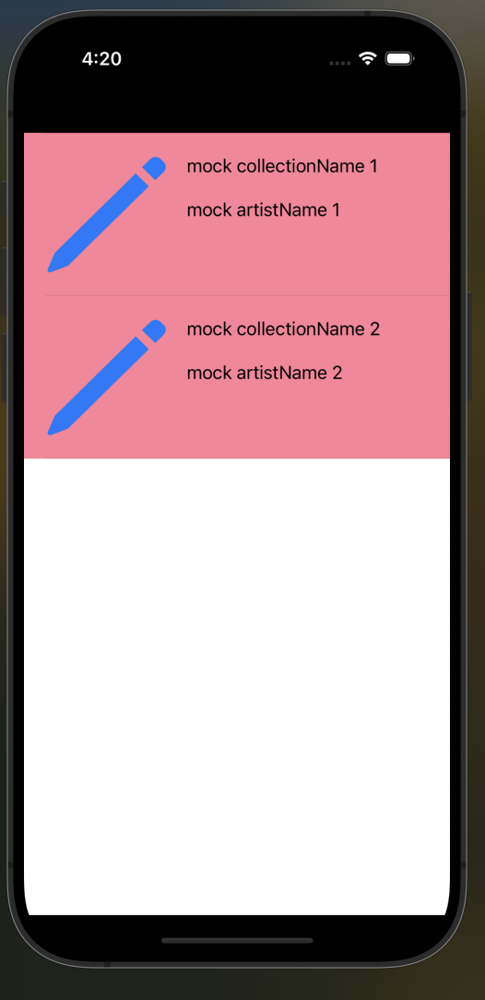

# 7. Работа с изображением в ячейке
Преобразуем текст в изображение

```swift
extension SongTableViewCell {
    func cellConfigure(with model: SongModel) {
        collectionName.text = model.collectionName
        artistName.text = model.artistName

        guard let artworkUrl100 = model.artworkUrl100,
              let url = URL(string: artworkUrl100),
              let data = try? Data(contentsOf: url),
              let image = UIImage(data: data) else {
            return
        }

        collectionImage.image = image
    }
}
```
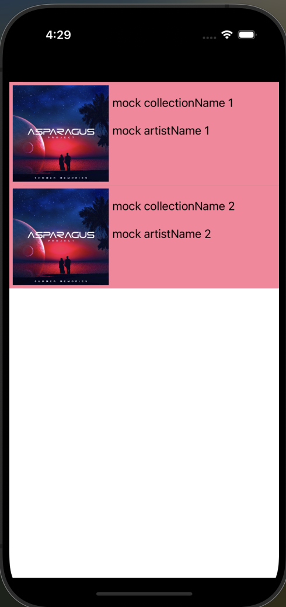

Хоть на первый взгляд и кажется, что все хорошо отображается, при увелечении количестве ячеек и скролле появляются подторбаживания.
Для этого создадим `ImageManager`, который будет асинхронно преобразовывать Data (url изображения) в UIImage

```swift
import Foundation

enum ImageManagerErrors: Error {
    case unexpectedError
}

protocol ImageManagerDescription {
    func loadImage(from url: URL, completion: @escaping (Result<Data, Error>) -> Void)
}

final class ImageManager: ImageManagerDescription {

    static let shared = ImageManager()
    private init() {}

    private let networkImageQueue = DispatchQueue(label: "networkImageQueue", attributes: .concurrent) // новый поток (конкуретный)

    func loadImage(from url: URL, completion: @escaping (Result<Data, Error>) -> Void) {
        let mainTreadCompletion: (Result<Data, Error>) -> Void = { result in
            DispatchQueue.main.async { // асинхронно выполняем на главном потоке (последовательный), отвечает за UI
                completion(result)
            }
        }

        networkImageQueue.async { // асинхронно выполняем на созданном потоке, чтобы не тормозить ui
            guard let imageData = try? Data(contentsOf: url) else {
                mainTreadCompletion(.failure(ImageManagerErrors.unexpectedError))
                return
            }
            mainTreadCompletion(.success(imageData))
        }
    }
}
```
После этого создадим `NetworkImageView`, который в отличие от обычного UIImageView, этот преобразовает изображение из url в UIImage
```swift
import UIKit

final class NetworkImageView: UIImageView {
    var currentUrl: URL?
    let shared = ImageManager.shared
    
    func loadImage(with url: URL) {
        currentUrl = url
        shared.loadImage(from: url) { [weak self] result in
            guard let self = self else {
                return
            }
            switch result {
            case .success(let data):
                if self.currentUrl != url {
                    return
                }
                self.image = UIImage(data: data)
            case .failure(let error):
                print(error.localizedDescription)
                return
            }
        }
    }
}
```
Заменим `UIImageView` на `NetworkImageView` и обновим метод `cellConfigure`

```swift
    final class SongTableViewCell: UITableViewCell {
    private let imageManager = ImageManager.shared
    private let collectionImage = NetworkImageView()

    code ...
    }

//MARK: - Public Methods
extension SongTableViewCell {
    func cellConfigure(with model: SongModel) {
        collectionName.text = model.collectionName
        artistName.text = model.artistName
        
        guard let artworkUrl100 = model.artworkUrl100,
              let url = URL(string: artworkUrl100) else {
            return
        }

        imageManager.loadImage(from: url) { [weak self] result in
            switch result {
            case .success(let data):
                self?.collectionImage.image = UIImage(data: data)
            case .failure(let error):
                print(error.localizedDescription)
            }
        }
    }
}
```

Теперь изображение загружается асинхронно и не тормозит главный поток.

# 8. Подключение приложения к собственному сервису

В данном пункте мы создадим модель данных, которая соответствует тому, что бэкенде. В эту модель данных будет парситься `json`. Также мы создадим запрос к нашему сервису и сам парсинг ответа.

Прежде чем приступать к созданию подключения сервиса необходимо задать модель с данными, которые придут в ответе от сервиса.
Создадим их в отдельном файле

```swift
import Foundation

struct SongModel: Decodable {
    var trackId: Int?
    var collectionName: String?
    var artistName: String?
    var artworkUrl100: String?
    var releaseDate: String?
    var collectionPrice: Double?
}

struct CollectionModel: Decodable {
    var resultCount: Int?
    var results: [SongModel]
}
```

Примечание: поля у структуры желательно должны быть такими же, как в `json` ответе. Если нужно переименовать поля, то следует воспользоваться `CodingKeys`.

После создания модели можно приступать к созданию своего типа запроса для соединения с сервисом. Также в отдельном файле.

Напишем функцию для генерации определенного запроса:
```swift
import Foundation
// enum для пробрасывания ошибок
enum NetworkError: Error {
    case urlError
    case emptyData
}

protocol SongListServiceProtocol {
    func getData(completion: @escaping (Result<CollectionModel, Error>) -> Void)
}

final class SongListService: SongListServiceProtocol {
    private init() {} // singleton
    static let shared: SongListServiceProtocol = SongListService() // singleton

    //(completion: @escaping (Result<CollectionModel, Error>) -> Void) - замыкание
    // (Result<CollectionModel, Error>) - принимает 1 из двух состояний CollectionModel или Error
    func getData(completion: @escaping (Result<CollectionModel, Error>) -> Void) {
        let urlString = "https://itunes.apple.com/search?term=$%7Bterm%7D&media=music&entity=song"

        guard let url = URL(string: urlString) else {
            completion(.failure(NetworkError.urlError))
            return
        }
        
        URLSession.shared.dataTask(with: url, completionHandler: { data, _, error in  // completionHandler – замыкание для обработки  данных  в другом слое (в данном случае  view controller)
            //if let, guard let - разные виды развертывания опционала
            if let error = error {
                print("error") // внутри error != nil
                completion(.failure(error))
            }
            // снаружи error == nil
                           
            guard let data = data else {
                completion(.failure(NetworkError.emptyData)) // внутри data == nil
                return
            }
            // снаружи data != nil

            do {
                let catalogData = try JSONDecoder().decode(CollectionModel.self, from: data) //декодируем json в созданную струткру с данными
                completion(.success(catalogData))
            } catch let error {
                print("JSONDecoder error", error)
                completion(.failure(error))
            }
        }).resume() // запускаем задачу
    }
}
```

Создадим класс Model (архитектура MVC)
```swift
import Foundation

final class SongListModel {
    private let songListService = SongListService.shared
    
    func loadCatalog(completion: @escaping (Result<CollectionModel, Error>) -> Void) {
        songListService.getData{ result in
            completion(result)
        }
    }
}
```

добавим модельку в `SongListViewController` и добавим вызов загрузки с бека
```swift
    override func viewDidLoad() {
        super.viewDidLoad()
        
        view.addSubview(songList)
        title = "Наш Список"

        loadSongs()
        setSongList()
    }

    private func loadSongs() {
        songListModel.loadCatalog { [weak self] result in
            switch result {
            case .success(let collectionModel):
                self?.models = collectionModel.results
                DispatchQueue.main.async {
                    self?.songList.reloadData()
                }
            case .failure(let error):
                print(error.localizedDescription)
            }
        }
    }
```
Получим:
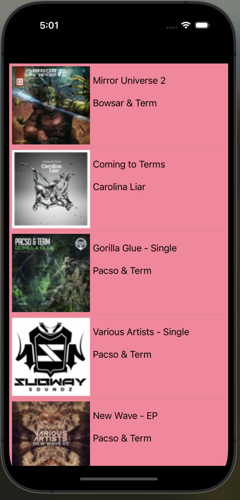


# 9. Поиск
создаем ButtonItem для поиска и метод для обработки нажатия на кнопку поиска
```swift
    override func viewDidLoad() {
        super.viewDidLoad()
        
        view.addSubview(songList)
        title = "Наш Список"

        loadSongs()
        setSongList()
        let rightBarButtonItem = UIBarButtonItem(image: UIImage(systemName: "magnifyingglass"),
                                                style: .done,
                                                target: self,
                                                action: #selector(findButtonTapped))
        navigationItem.rightBarButtonItem = rightBarButtonItem
    }
    
    @objc
    private func findButtonTapped() {
        // Создаем UIAlertController
        let alertController = UIAlertController(title: "Найти",
                                                message: nil,
                                                preferredStyle: .alert)

        // Добавляем текстовое поле
        alertController.addTextField { textField in
            textField.placeholder = "Введите название альбома"
        }

        // Добавляем кнопку Найти
        let findAction = UIAlertAction(title: "Найти", style: .default) { [weak self] _ in
            // код по обработке введенных данных
            if let searchText = alertController.textFields?.first?.text {
                self?.handleSearch(searchText)
            }
        }
        alertController.addAction(findAction)

        // Добавляем кнопку Отмена
        let cancelAction = UIAlertAction(title: "Отмена", style: .cancel, handler: nil)
        alertController.addAction(cancelAction)

        // Показываем UIAlertController
        present(alertController, animated: true, completion: nil)
    }

    private func handleSearch(_ songName: String) {
        // идем в бек
        songListModel.loadCatalog(with: songName) { [weak self] result in
            switch result {
            case .success(let data):
                DispatchQueue.main.async {
                    self?.models = data.results
                    self?.songList.reloadData()
                }
            case .failure(let error):
                print(error.localizedDescription)
            }
        }
    }
```
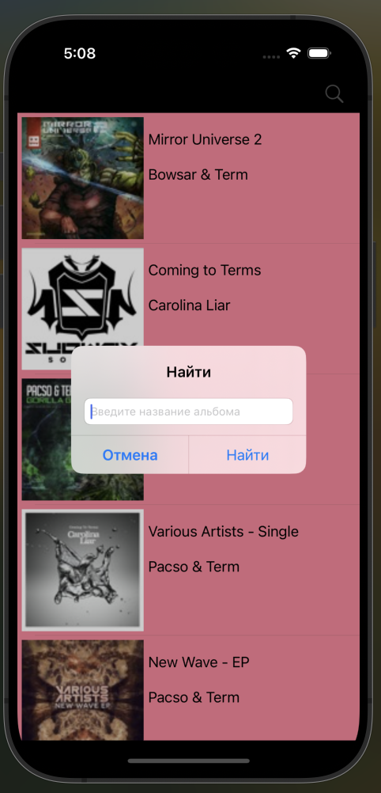


# 10. Экран с детальной информацией

Следующей частью задания является создание второго экрана с детальной информацией о каждом объекте из каталога.
Для этого необходимо создать новый `UIViewController`. 

Структура проекта:
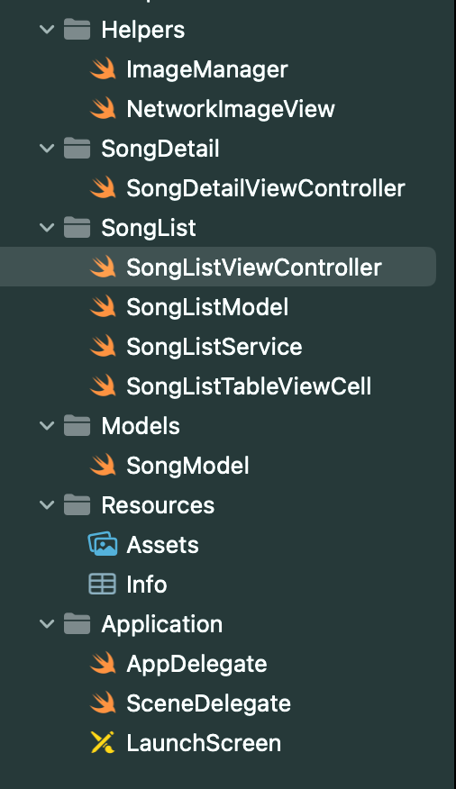

```swift
final class SongDetailViewController: UIViewController {
    
    override func viewDidLoad() {
        super.viewDidLoad()
        
        view.backgroundColor = .systemRed.withAlphaComponent(0.2)
    }
}
```

Добавим метод для обработки нажатия на ячейку (для перехода к `SongDetailViewController`):
```swift
    func tableView(_ tableView: UITableView, didSelectRowAt indexPath: IndexPath) {
         navigationController?.pushViewController(SongDetailViewController(), animated: true)
    }
```

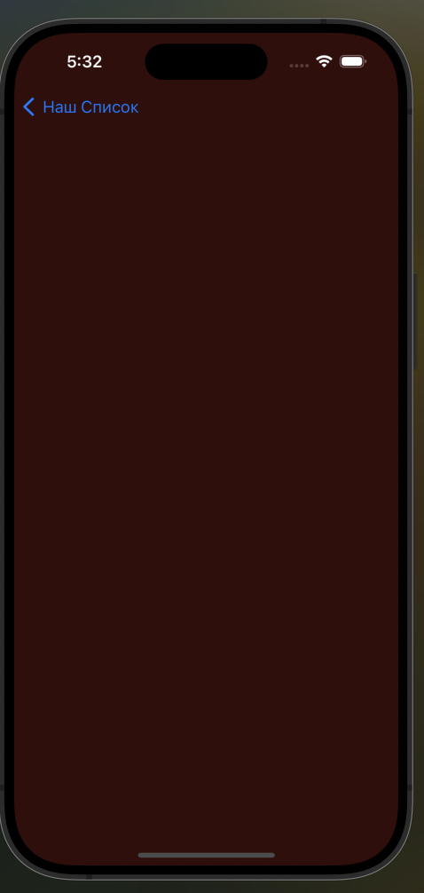

Добавим информацию на `SongDetailViewController`. Все аналогично ячейке, создадим UI объекты, которые будем отображать на экране и сверстаем. Также нужно добавить pubic (internal) метод для передачи информации между экранами.

```swift

import UIKit

final class SongDetailViewController: UIViewController {

    private let imageManager = ImageManager.shared

    private let collectionImage = NetworkImageView()
    private let collectionName = UILabel()
    private let artistName = UILabel()
    private let releaseDate = UILabel()
    private let collectionPrice = UILabel()
    
    override func viewDidLoad() {
        super.viewDidLoad()

        view.backgroundColor = .systemRed.withAlphaComponent(0.2)

        setAppearence()
        setConstraints()
    }
}

//MARK: - Public Methods
extension SongDetailViewController {
    func configure(with model: SongModel) {
        collectionName.text = model.collectionName
        artistName.text = model.artistName
        collectionPrice.text = "Цена: \(model.collectionPrice ?? 0)$"

        releaseDate.text = model.releaseDate
        
        guard let artworkUrl100 = model.artworkUrl100,
              let url = URL(string: artworkUrl100) else {
            return
        }

        imageManager.loadImage(from: url) { [weak self] result in
            switch result {
            case .success(let data):
                self?.collectionImage.image = UIImage(data: data)
            case .failure(let error):
                print(error.localizedDescription)
            }
        }
    }
}

//MARK: - Private Methods
private extension SongDetailViewController {
    func setAppearence() {
        collectionImage.contentMode = .scaleAspectFit
        collectionImage.clipsToBounds = true
        collectionImage.layer.cornerRadius = 10

        collectionName.numberOfLines = 0
        collectionName.font = .boldSystemFont(ofSize: 30)
        artistName.numberOfLines = 0

        [collectionName, artistName, releaseDate, collectionPrice].forEach {
            $0.textColor = .white
        }
    }

    func setConstraints() {
        [collectionImage, collectionName, artistName, releaseDate, collectionPrice].forEach {
            view.addSubview($0)
        }

        setCollectionImage()
        setCollectionName()
        setArtistName()
        setReleaseDate()
        setCollectionPrice()
    }

    func setCollectionImage() {
        collectionImage.translatesAutoresizingMaskIntoConstraints = false
        collectionImage.topAnchor.constraint(equalTo: view.safeAreaLayoutGuide.topAnchor, constant: 10).isActive = true
        collectionImage.leadingAnchor.constraint(equalTo: view.leadingAnchor, constant: 10).isActive = true
        collectionImage.trailingAnchor.constraint(equalTo: view.trailingAnchor, constant: -10).isActive = true
        collectionImage.heightAnchor.constraint(equalToConstant: view.bounds.width - 20).isActive = true
    }

    func setCollectionName() {
        collectionName.translatesAutoresizingMaskIntoConstraints = false
        collectionName.topAnchor.constraint(equalTo: collectionImage.bottomAnchor, constant: 10).isActive = true
        collectionName.centerXAnchor.constraint(equalTo: view.centerXAnchor).isActive = true
    }

    func setArtistName() {
        artistName.translatesAutoresizingMaskIntoConstraints = false
        artistName.topAnchor.constraint(equalTo: collectionName.bottomAnchor, constant: 10).isActive = true
        artistName.leadingAnchor.constraint(equalTo: view.leadingAnchor, constant: 10).isActive = true
        artistName.trailingAnchor.constraint(equalTo: view.trailingAnchor, constant: -10).isActive = true
    }

    func setReleaseDate() {
        releaseDate.translatesAutoresizingMaskIntoConstraints = false
        releaseDate.topAnchor.constraint(equalTo: artistName.bottomAnchor, constant: 25).isActive = true
        releaseDate.leadingAnchor.constraint(equalTo: view.leadingAnchor, constant: 10).isActive = true
        releaseDate.trailingAnchor.constraint(equalTo: view.trailingAnchor, constant: -10).isActive = true
    }

    func setCollectionPrice() {
        collectionPrice.translatesAutoresizingMaskIntoConstraints = false
        collectionPrice.topAnchor.constraint(equalTo: releaseDate.bottomAnchor, constant: 100).isActive = true
        collectionPrice.leadingAnchor.constraint(equalTo: view.leadingAnchor, constant: 10).isActive = true
        collectionPrice.trailingAnchor.constraint(equalTo: view.trailingAnchor, constant: -10).isActive = true
    }
}
```
Получим:
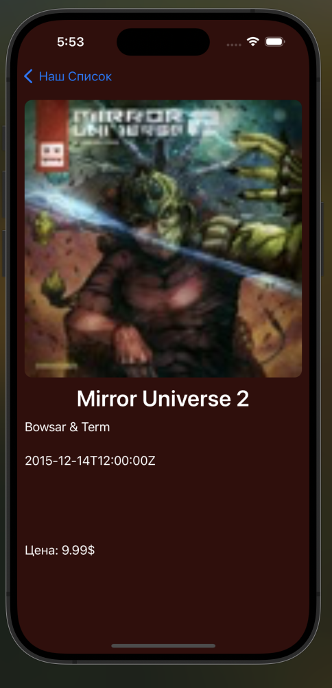

# 11. Примечания
swift по умолчанию блокирует http запросы, чтобы это изменить необходимо зайти в info.plist  и добавить:
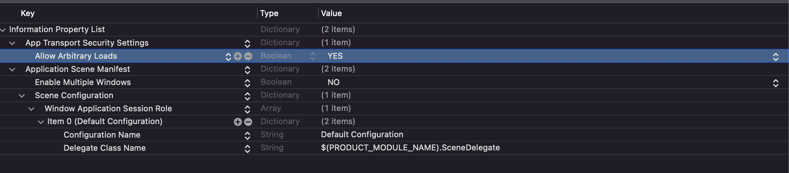

# 12. Полезные ссылки

1. [Книга по Swift](https://docs.swift.org/swift-book/)
2. [Перевод книги из первой ссылки](https://swiftbook.ru/contents/doc/)
