# Методические указания по созданию дизайна в графических онлайн-редакторах и верстке с помощью HTML и CSS

## План
1. [Figma](#Figma) <br>
   [Начало работы](#начало-работы-с-Figma) <br>
   [Создание фрейма](#создание-фрейма-в-Figma) <br>
   [Создание карточки](#создание-карточки-в-Figma) <br>
2. [Pixso](#Pixso) <br>
   [Начало работы](#начало-работы-с-Pixso) <br>
   [Создание фрейма](#создание-фрейма-в-Pixso) <br>
   [Создание карточки](#создание-карточки-в-Pixso) <br>
   [Экспорт CSS](#экспорт-CSS-в-Pixso) <br>
3. [HTML](#HTML)
4. [CSS](#CSS)
5. [Верстка страницы с карточками](#верстка-страницы-с-карточками)
6. [Верстка карточки](#верстка-карточки)

## Figma
### Начало работы с Figma

Figma (Фигма) — это графический онлайн-редактор для совместной работы. Figma используют в основном для создания прототипов сайтов и приложений.
С фигмой можно работать с помощью [сайта](https://www.figma.com/) и [десктопного приложения](https://www.figma.com/downloads/) (после нажатия на "Desktop app for macOS" или "Desktop app for Windows"). Далее необходимо войти в аккаунт или зарегистрироваться.

После авторизации открывается главная страница, на которой в центре отображаются проекты, слева панель для перехода к недавним проектам, черновикам, избранными и проектами команд (можно создавать команды и вместе создавать и работать над общими проектами).


Для создания проекта на левой панели нажимаем Drafts, затем на верхней панели Design file.<br>
Интерфейс можно разделить на 4 области:
1. Слева - слои
2. В центре - рабочее пространство
3. Справа - редактирование свойств объектов
4. Сверху - инструменты  


### Создание фрейма в Figma
Фрейм — основной элемент дизайна в Фигме. Это законченный документ, который может быть страницей сайта или экраном мобильного приложения. Фрейм объединяет объекты внутри себя.


Добавим странице цвет, нажимаем на фрейм, в правой панели находим вкладку Fill - она отвечает за заливку, нажимаем на квадратик. Ползунок позволяет выбрать цвет или можно ввести код цвета. <br>


### Создание карточки в Figma
Карточка будет отображать картинку, название, краткое описание, цену и кнопку для перехода к странице подробного описания продукта.
Необходимы - 2 прямоугольника, картинка, 3 текстовых блока.

Для создания прямоугольника надо выбрать его в панеле инструментов или нажать клавишу R, в рабочей области удерживая левую кнопку мыши создать прямоугольник произвольного размера.
Во вкладке с прямоугольником можно выбрать линию, стрелку, эллипс, многоугольник, звезду и изображение.


Создадим еще один прямоугольник, добавим изображение и текстовые элементы. Когда мы создаем внутри фрейма элементы, они автоматически в панели слоев создаются внтури этого фрейма.


#### Свойства элементов
Свойства элементов настраиваются в правой панели.

Свойства текста:
1. Шрифт. Выбрать шрифт можно на сайте [Google Fonts](https://fonts.google.com/). Нажимаем на Filters->Language. Выбираем Cyrillic, чтоб выбрать шрифт, поддерживающий русский язык.

2. Стиль - у краткого описания и кнопки пусть будет Medium, у названия и цены - SemiBold.
3. Размер - на сайтах для обычного текста имеют размер 14px, сделаем для краткого описания и кнопки так же, а название и цену размера 16px, чтоб они выделялись.

Выбираем текстовый элемент, во вкладке Text нажимаем на название шрифта, находим необходимый шрифт, ниже устанавливаем стиль и размер шрифта. Если нажать на три точки, то откроется со всеми настройками шрифта.<br>


Аналогично сделаем для других текстовых элементов.

Свойства геометрических элементов:
1. Цвет. Это уже умеем делать
2. Скругление углов.
Рассмотрим параметры этой вкладки: X, Y - координаты элемента внтури фрейма, W, H - ширина и высота, пиктограмма угла - угол поворота элемента, скругление углов.<br>
Сделаем скругление у карточки и изображения 20px, а у кнопки 10px.


3. Обводка. У кнопки сделаем обводку, а заливку уберем.
Для этого в Stroke нажмем на "+", добавится обводка. У нее можно настроить цвет, толщину, стороны, для которых их добавить. В Fill нажмем на "-" у цвета.


Свойства изображения:<br>
Для изменения размера нужно потянуть за границы изображения, при этом для пропорционального изменения сторон необходимо зажимать Shift.<br>
Если вам необходимо обрезать картинку, перейдите во вкладку Fill и нажмите на изображение. В открывшемся окне над изображением есть выпадающий список, в нем надо выбрать Crop и менять границы. Если вы хотите заменить картинку, наведите на картинку в этом окне, появится кнопка "Choose image". <br>


#### Компановка элементов карточки и Auto Layout
Мы подготовили все элементы, теперь скомпануем их.<br>
Для начала сгруппируем кнопку. Выбираем с нажатой клавишей Shift прямоугольник и текст для кнопки, в правой панели в самой первой вкладке можно настраивать выравнивание, нам надо выровнять элементы относительно друг друга по вертикали и горизонтали, нажимаем на 2 и 5 значки, затем нажмите Ctrl+G (группировка элементов).

https://github.com/ssofiica/Design-tutorial/assets/91909561/60044485-36dd-43af-821f-07cb02d2d0b8

Теперь собираем карточку, переносим элементы на прямоугольник, являющийся фоном карточки, выравниваем элементы, располагаем цену и кнопку на одном уровне и группируем. Если несколько элементов сгруппированы, то при одном клике на элемент, будет выделена вся группа, поэтому надо два раза кликнуть по элементу, чтоб выделить именно его.

В фигме есть такой инструмент, как Auto Layout. Это позволяет создавать контейнеры, которые могут содержать другие элементы интерфейса, затем можно настроить правила расположения, такие как выравнивание или расстояние между элементами. Auto layout можно сравнить с flex в css.
Выделяем все элементы карточки, включая ее фон, в правой панели находим вкладку Auto layout, нажимаем плюс.


Выбираем вертикально расположение, внутренний отступ (padding) 20px, интервал между элементами 10px. 
Копируем карточку, меняем содержимое.
Итог:


### Страница подробного описания

Сделаем картинку и описание на отдельных блоках.

## Pixso
### Начало работы с Pixso

Pixso (Пиксо) — это кросс-платформенный облачный сервис для дизайна и прототипирования, ориентированный на совместную работу. Pixso преимущественно применяется для создания интерфейсов и графических элементов для веб-сайтов и мобильных приложений.

Доступ к Pixso осуществляется через [веб-сайт](https://pixso.net/) или [десктопное приложение](https://pixso.net/download) (скачивание начнется после выбора версии, подходящей для вашей операционной системы). Для начала работы требуется войти в существующий аккаунт или зарегистрироваться.

После авторизации открывается главная страница, на которой в центре отображаются кнопки создания нового дизайн-проекта (Design file) или новой доски (Whiteboard file), а также кнопка импорта файлов. Ниже кнопок представлены файлы (дизайн проекты, доски, проекты axure) с возможностью фильтрации. Слева располагается панель для перехода к недавним проектам, черновикам, избранными файлам, а также проектам сообщества Pixso. Pixso предоставляет возможность бесплатно создать командy для работы над одним общим проектом, содержащим максимум 3 файла.


Для создания дизайн-проекта нажимаем кнопку "New design file". После перехода в файл следует переименовать его в левом верхнем углу.

Интерфейс можно разделить на 4 области:
1. Слева - слои, компоненты, ресурсы.
2. В центре - рабочее пространство.
3. Справа - редактирование свойств объектов, переключение на режим разработчика и прототипирование.
4. Сверху - инструменты.
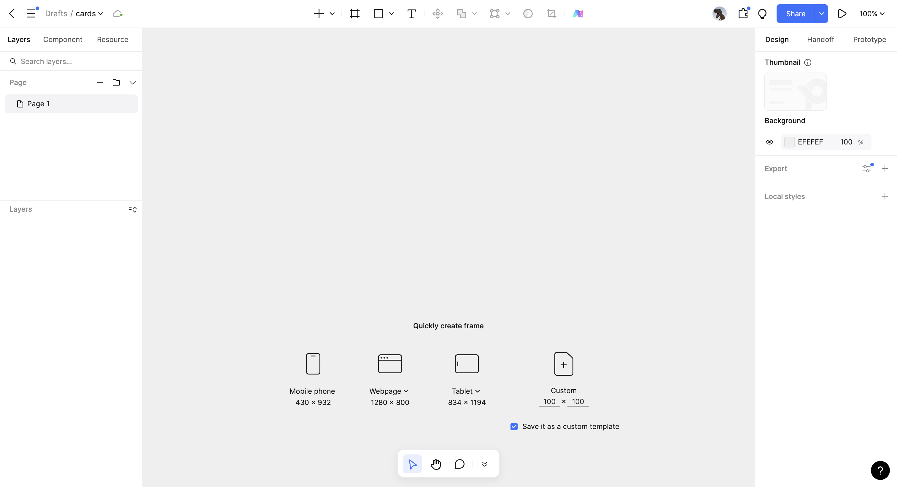

### Создание фрейма в Pixso
Фрейм — основной элемент дизайна в Pixso. Это законченный документ, который может быть страницей сайта или экраном мобильного приложения. Фрейм объединяет объекты внутри себя.
При первом открытии проекта Pixso сразу предлагает создать фрейм. Фрейм также можно создать с помощью соответствующей кнопки на панели инструментов.
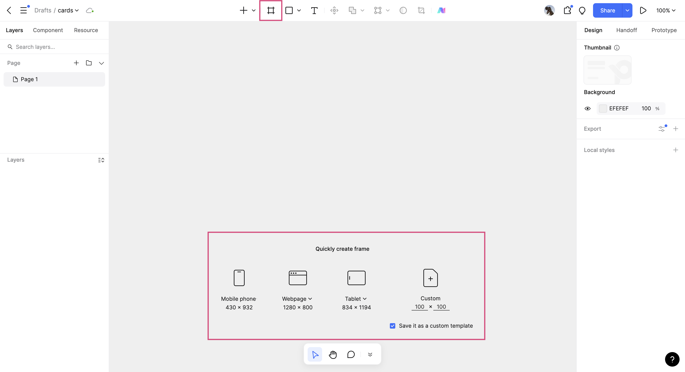

Рассмотрим варианты создания фреймов.


Добавим странице цвет, нажимаем на фрейм, в правой панели находим вкладку **Заполнить** - она отвечает за заливку, нажимаем на квадратик. Ползунок позволяет выбрать цвет. Можно также выбрать цветовую модель и ввести код цвета. <br>
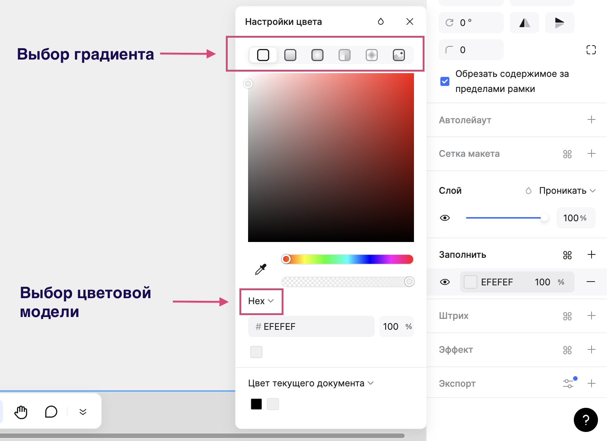

### Создание карточки в Pixso
Карточка будет отображать картинку, название, краткое описание, цену и кнопку для перехода к странице подробного описания продукта.
Необходимы - 2 прямоугольника, картинка, 3 текстовых блока.

Для создания прямоугольника надо выбрать его в панеле инструментов или нажать клавишу R, а затем в рабочей области, удерживая левую кнопку мыши, создать прямоугольник произвольного размера.
Во вкладке с прямоугольником можно выбрать линию, стрелку, эллипс, многоугольник, звезду и изображение.

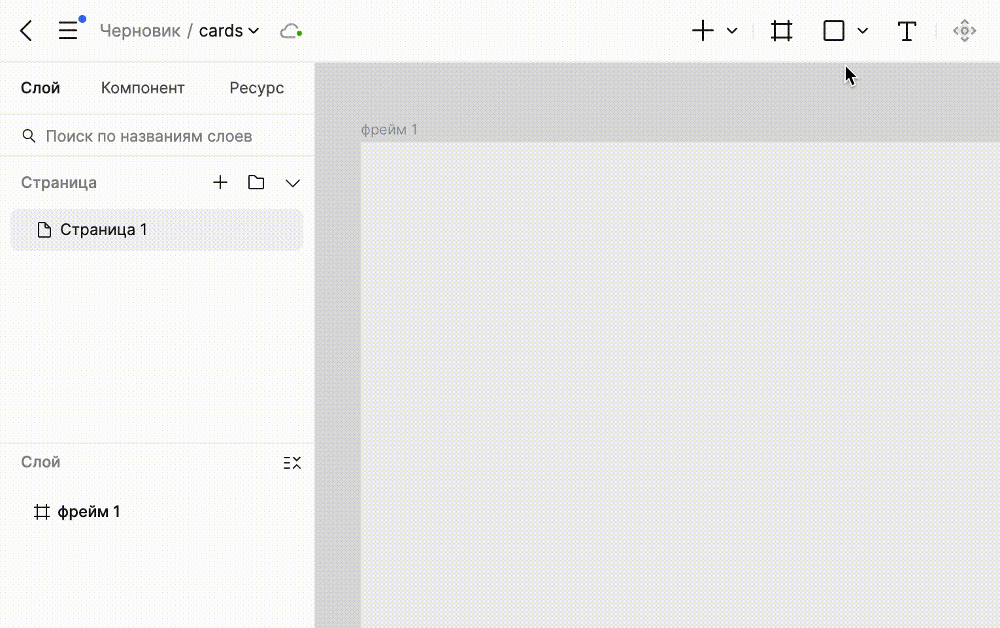

Создадим еще один прямоугольник, добавим изображение и текстовые элементы. Когда мы создаем внутри фрейма элементы, они автоматически в панели слоев создаются внтури этого фрейма.

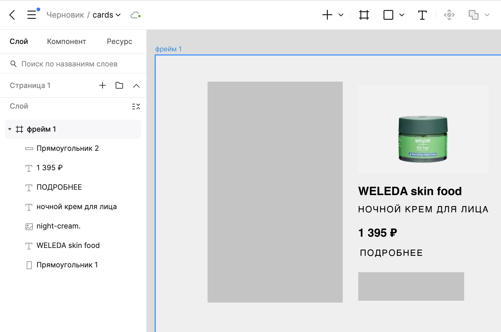

#### Свойства элементов
Свойства элементов настраиваются в правой панели.

Свойства текста:
1. Шрифт. Выбрать шрифт можно на сайте [Google Fonts](https://fonts.google.com/). Нажимаем на Filters->Language. Выбираем Cyrillic, чтобы отобрать шрифты, поддерживающие русский язык.
<br>
В примере будем использовать Open Sans.<br>
Что делать если понравившегося шрифта не оказалось в Pixso?<br>
Если его нет у вас на компьютере, то можно скачать с сайта Google Fonts. В Pixso нужно перейти на вкладку "Локальный" и нажать на синюю кнопку. Автоматически скачается программа PixsoLocalFont, которая позволяет управлять локальными шрифтами.
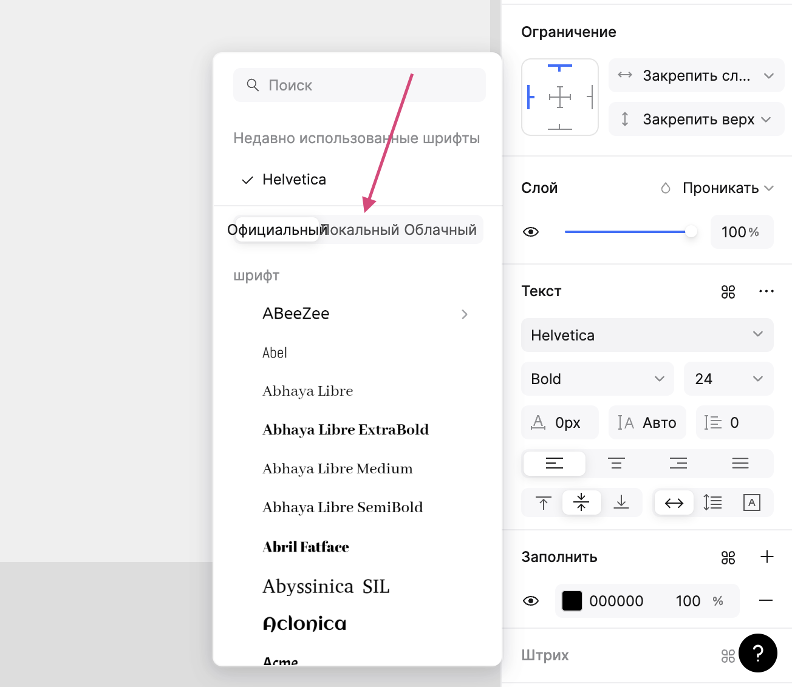
3. Стиль - у краткого описания и кнопки пусть будет Medium, у названия и цены - Bold.<br>
4. Размер - на сайтах для обычного текста имеет размер 14px. Сделаем для краткого описания и кнопки так же, а название и цену размера 16px, чтобы они выделялись.<br>

Выбираем текстовый элемент, во вкладке Текст нажимаем на название шрифта, находим необходимый шрифт, ниже устанавливаем стиль и размер шрифта. Если нажать на три точки, то откроется с дополнительными настройками шрифта.<br>

Для описания и кнопки укажем Межбуквенный интервал 2px, Текстовый регистр - Верхний, Настройка базовой линии текста - стандарт.<br>
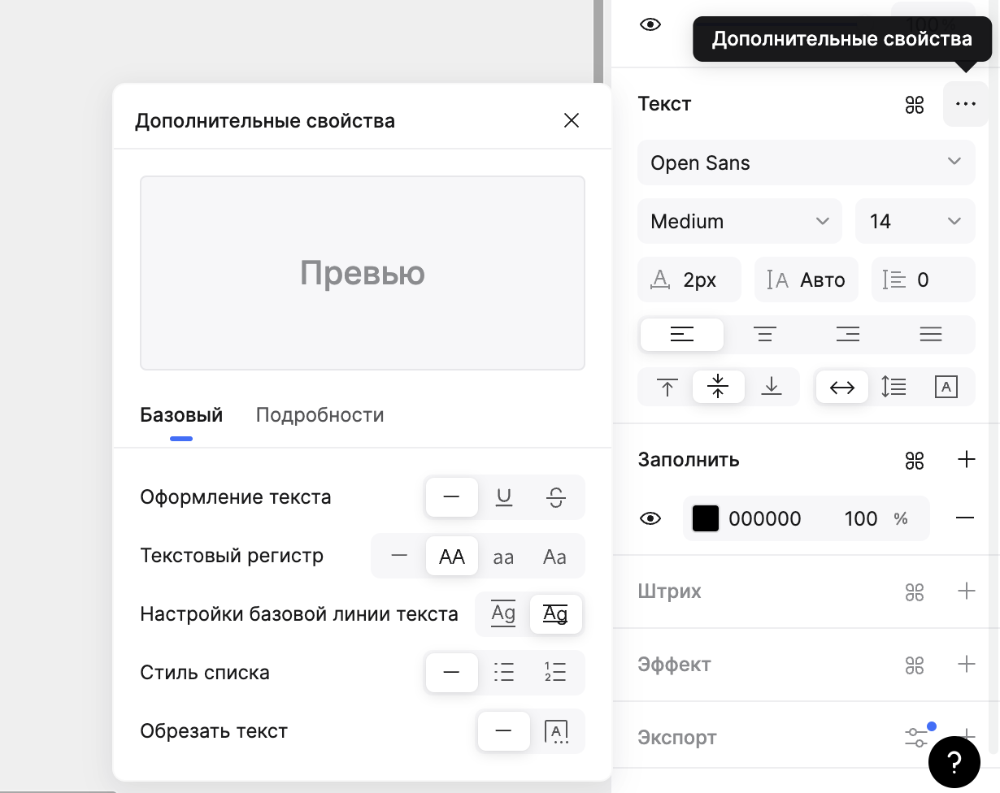

Свойства геометрических элементов:
1. Цвет. Это уже умеем делать
2. Скругление углов.
Рассмотрим параметры этой вкладки: X, Y - координаты элемента внтури фрейма, W, H - ширина и высота, отзеркаливание по горизонтали/вертикали, угол поворота элемента, скругление углов.<br>
По умолчанию скругление настраивается для всех углов фигуры одинаково. Однако вы можете настроить скругление по-разному, если нажмете на кнопку "Независимые углы" и для каждого угла укажите свое значение.<br>
Сделаем скругление у кнопки и изображения 8px.<br>
Про правила выбора радиуса скругления можно прочитать в [статье](https://dsgners.ru/ui/2118-podbiraete-radius-skrugleniya-na-glaz-eti-5-pravil-pomogut-skruglyat-uglyi-kak-senor). 
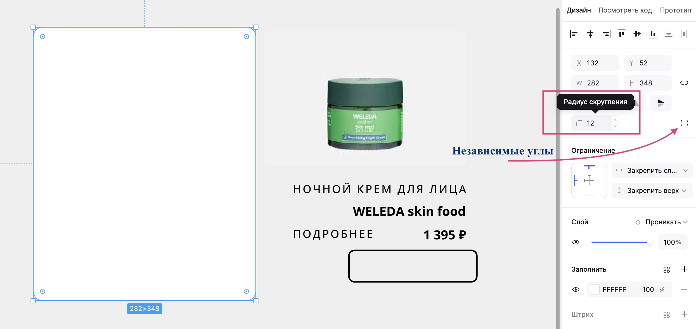

4. Обводка. У кнопки сделаем обводку, а заливку уберем.
Для этого в Штрих нажмем на "+", добавится обводка. У нее можно настроить цвет, толщину, стороны, для которых их добавить. В Заполнить нажмем на "-" у цвета.


Свойства изображения:<br>
Для перехода к своствам изображения можно два раза кликнуть на него. Для изменения размера нужно потянуть за границы изображения, при этом для пропорционального изменения сторон необходимо зажимать Shift.<br>
Если вам необходимо обрезать картинку, перейдите к ее своствам. В открывшемся окне над изображением есть выпадающий список, в нем надо выбрать Обрезать и изменить границы. Если вы хотите заменить картинку, наведите на картинку в этом окне, появится кнопка "Выбрать изображение". <br>
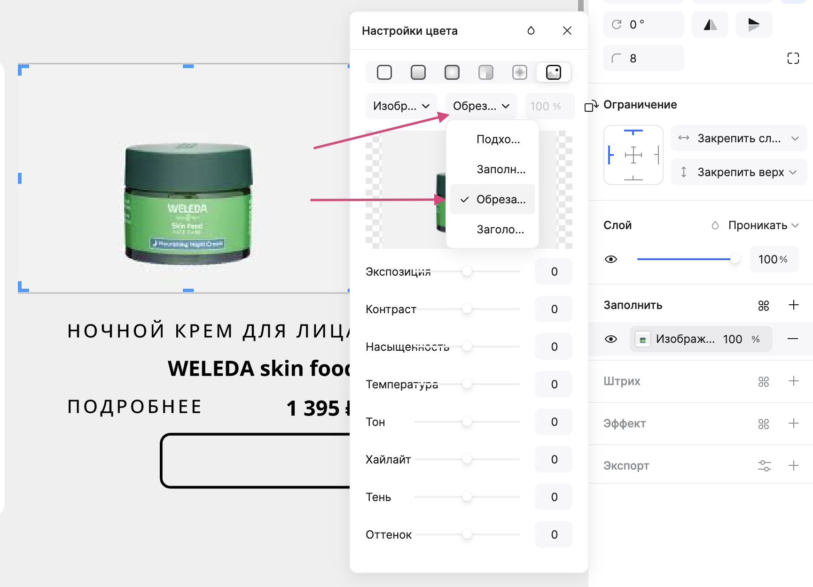

#### Компановка элементов карточки и Auto Layout
Мы подготовили все элементы, теперь скомпануем их.<br>
Для начала сгруппируем кнопку. Выбираем с нажатой клавишей Shift прямоугольник и текст для кнопки, в правой панели в самой первой вкладке можно настраивать выравнивание, нам надо выровнять элементы относительно друг друга по вертикали и горизонтали, а затем сгруппировать их, нажав Ctrl+G (группировка элементов). Замечаем, что в левой вкладке появилось Сочетание, включающее прямоугольник и текст. 

https://github.com/user-attachments/assets/1985fb94-8100-4bda-ab59-df3b2b8b53fe

Для удаления элемента нужно нажать на него, а затем Backspace на клавиатуре. Удалим большой прямоугольник.

В Pixso есть такой инструмент, как Автолейаут. Это позволяет создавать контейнеры, которые могут содержать другие элементы интерфейса, затем можно настроить правила расположения, такие как выравнивание или расстояние между элементами. Автолейаут можно сравнить с flex в css.

Cобираем карточку: 
1. Перетаскиваем все элементы на фон, т.е. вне фрейма. 
2. Группируем цену и кнопку, предварительно выравнив их по горизонтали и указав расстояние между ними 20px.
3. Выравниваем элементы и сочетание (кнопка + цена) по правому краю.
4. Выделяем все элементы и сочетание, а затем либо нажиимаем Shift+A либо ПКМ и выбираем "Добавить автолейаут". <br>
Если несколько элементов сгруппированы, то при одном клике на элемент, будет выделена вся группа, поэтому надо два раза кликнуть по элементу, чтоб выделить именно его.

Выбираем вертикально расположение, интервал между элементами 10px, внутренний отступ (padding) 8px. Добавляем заливку белым цветом. Скругление углов 12px. Проверяем, что изменение размера по вертикали/горизонтали - Hug.

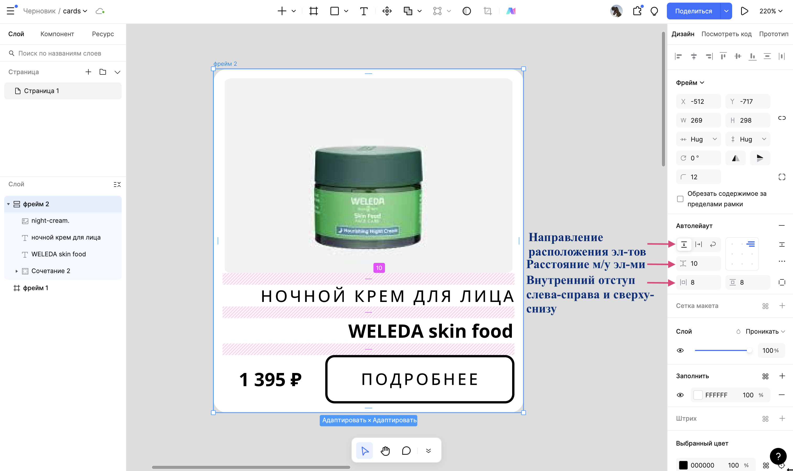

Копируем карточку, меняем содержимое.
Итог:
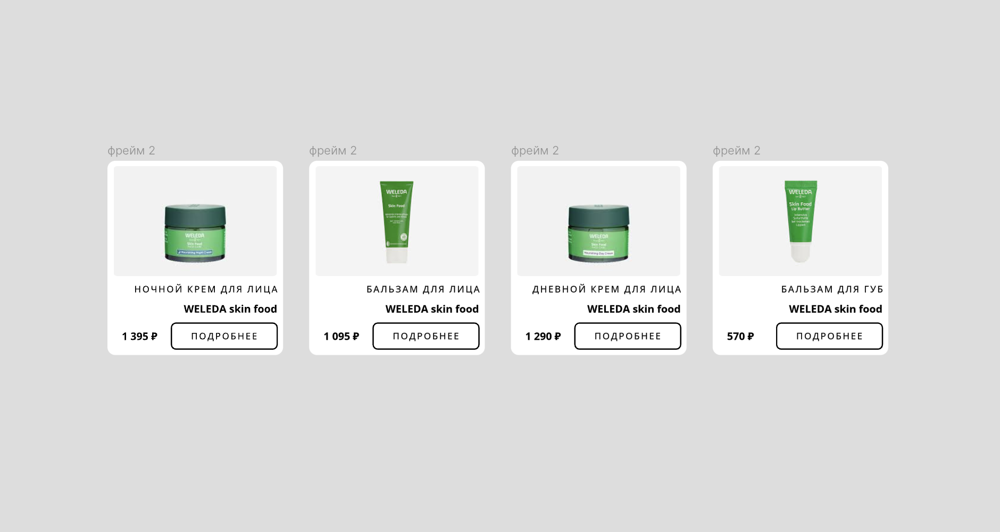

### Экспорт CSS в Pixso

Для того, чтобы экспортировать css перейдите справа во вкладку "Посмотреть код" и нажмите кнопку "Вход в режим разработчика". 

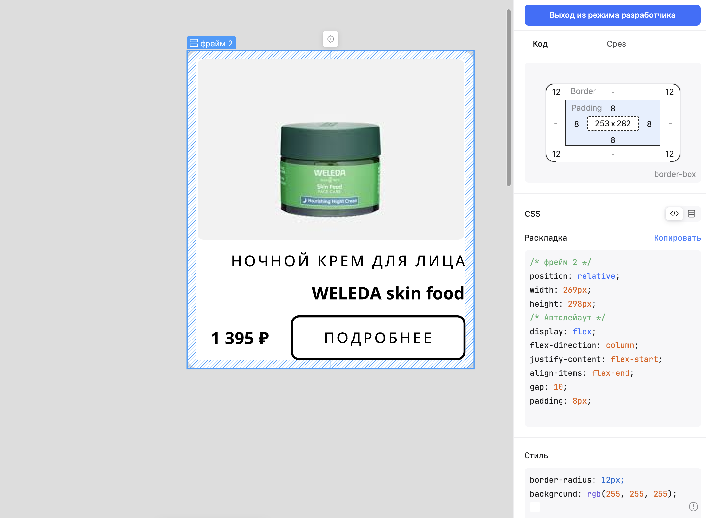

### Страница подробного описания

Сделаем картинку и описание на отдельных блоках.

## HTML

HTML - это язык разметки, используемый для определения структуры веб-страниц, посещаемых пользователями.
HTML состоит из ряда элементов, которые вы используете для того, чтобы охватить, обернуть или разметить различные части содержимого, чтобы оно имело определённый вид или срабатывало определённым способом.

Элемент = открывающий тег + содержимое + закрывающий тег<br>
```<p>Hello world!</p>```

Открывающий тег: состоит из названия (обозначения) тега, помещённого внутри угловых скобок. Данный тег служит признаком начала элемента, с этого момента тег начинает влиять на следующее после него содержимое<br>
Закрывающий тег: выглядит как и открывающий, но содержит слеш перед названием тега<br>
Содержимое: включает текст или другие элементы<br>

Рассмотрим теги, которые нам необходимы:
- ```<div>..</div>```. Cлужит для структуризации контента на веб-странице, для заключения содержимого в отдельные блоки. div создает блок, который по умолчанию растягивается по всей ширине браузера, а следующий после div элемент переносится на новую строку.
- ```<p>..</p>```. Представляет собой абзац, как блоки текста, отделенные от соседних блоков пустыми строками и/или отступами первой строки.
- ```<h1-6>..</h1-6>```. Представляют шесть уровней заголовков разделов. ```<h1>``` - это самый высокий уровень раздела, а ```<h6>``` - самый низкий. По умолчанию все элементы заголовка начинатся с новой строки и занимают всю ширину, доступную в содержащем их блоке.
- ``````. Добавляет изображение. Атрибут src обязателен и содержит путь к изображению (как путь до файла, так и ссылка на изображение в интернете), которое вы хотите вставить, атрибут alt содержит текстовую замену изображения.  Поисковые системы по текстовой замене могут индексировать изображение, а при проблемах с выводом изображения, браузер показывает текстовую замену. Существует большое колчество атрибутов для настройки изображения, но это можно сделать и через css.
Пример: ``````
- ```<a>..</a>```. Используется с атрибутом href и создает гиперссылку на веб-страницы, файлы, адреса электронной почты, местоположения на той же странице или на что-либо еще, к чему может быть обращен URL.

Больше информации про [теги](https://developer.mozilla.org/en-US/docs/Web/HTML/Element/).

## CSS

CSS (Cascading Style Sheets) - это язык таблиц стилей, язык описания внешнего вида веб-страницы.
С помощью html мы создаем элементы, а с помощью css - задаем им свойства.
Предположим, что мы создали разметку с помощью html. Теперь мы хотим сделать красивый вншений вид страницы, поэтому нам надо описать, как должен выглядеть каждый элемент. Для этого надо описать набор правил форматирования элемента или просто стиль.

Набор правил = селектор {свойство: значение;}
```css
div {
    background: #EFEFEF;
}
```
Селектор - имя элемента, которому будет присвоен стиль<br>
Свойство - то, что хотим поменять<br>
Значение - одно из возможных проявлений свойства<br>

### Селекторы
| Тип селектора | css                             | html                          | Устанавливает правила для                                                            |
|---------------|---------------------------------|-------------------------------|--------------------------------------------------------------------------------------|
| Тег           | p {<br> color: #ffffff;<br> }      | ```<p>```                                 | Всех тегов p                                                                                          |
| Идентификатор | #my-id {<br>color: #ffffff;<br> } | ```<p id="my-id">```                      | Элемента с данным  идентификатором. На странице каждое значение идентификатора должно быть уникальным |
| Класс         | .title {<br>color: #ffffff;<br> } | ```<p class="title> <h3 class="title">``` | Для всех элементов с указанным классом. На странице может быть несколько экземпляров класса           |
| Псевдокласс   | p:hover {<br>color: #252525;<br> } | ```<p>```                              | Указанного элемента в указанном состоянии. В этом примере ```<p>``` меняет цвет на при наведении мыши       |

### Свойства

Свойств и их значений огромное количество, рассмотрим маленькую их часть, без которых не обойтись, остальное изучайте по мере необходимости.

### 1. Размеры и расстояния

**width** - определяет ширину элемента. Может быть указана в пикселях(px), процентах(%), em, rem, vw, vh (о них ниже)<br>
**height** - определяет высоту элемента<br>
**border** - рамка вокруг элемента. Можно настроить толщину, стиль рамки и цвет. Например, border: 1px solid black<br>
**border-radius** - скругление краев в пикселях или процентах относительно элемента<br>
**margin** - размер внешнего отступа вокруг элемента, указывается в px, %, auto и др<br>
**padding** - размер внутреннего отступа, указывается в px, %, auto и др<br>

Как указать margin и padding?
1. Постфиксы: top, right, left, bottom. Примерs: { margin-top: 10px; padding-left: 2%; }
2. Количество значений:
- { margin: 1px; } - отступ в 1px со всех сторон
- { margin: 1px 5px; } - первое значение для верхнего и нижнего отступов, второе для левого и правого отступов
- { margin: 1px 5px auto; } - первое значение для верхнего отступа, второе - левого и правого, третье - нижнего
- { margin: 1px 5px auto 0; } - по часовой стрелке для каждой из сторон: сверху, справа, снизу и слева.

### 2. Разметка

**display** - отображение элементов.<br>
Значения: block - элемент начинается с новой строки и занимает всю ширину контейнера, inline - элемент располагается внутри родительского элемента и не занимает отдельную строку, none - элемент не отображается, grid - элемент отображается в виде сетки, flex - гибкий.

**display: flex**<br>
Основная идея — гибкое распределение места между элементами, гибкая расстановка, выравнивание, гибкое управление.

Свойства, которые будем использовать:
- justify-content - выравнивание элементов внутри контейнера по основной оси
- flex-direction - направление расположения элементов (в строку, в столбец и др.)
- align-items - выравнивание элементов внутри контейнера по поперечной оси
Эти свойства используются только при указании ```{ display: flex; }```
Пример:
```css
.container{
    display: flex;
    /* Элементы расположены в колонку */
    flex-direction: column;
    /* Между элементами равные интервалы */
    justify-content: space-between; 
}
```
Подробнее про [значения](https://doka.guide/css/flexbox-guide/) для этих свойств.

**display: grid**<br>
Grid(сетка) в отличии от флекс-контейнера, одновременно работающего только с одним измерением, гриды дают возможность работать одновременно с двумя: горизонталью и вертикалью. Можно объединять отдельные ячейки, менять размеры строк и столбцов, регулировать отступы между ними.

Свойства, которые будем использовать:
- grid-template-columns, grid-template-rows - задают размеры и количество колонок или рядов сетки.
```css
.container {
  display: grid;
  /* Будет создано 3 колонки */
  grid-template-columns: 150px auto 40%;
  /* Будет создано 2 ряда */
  grid-template-rows: 200px 250px;
}
```
Если нужны одинаковые колонки или ряды, то можно воспользоваться функцией repeat(). Для grid есть своя единица измерения - fr, которая рассчитывается автоматические.
```css
grid-template-columns: repeat(3, 1fr) /*три колонки, каждая из которых будет занимать 1/3 ширины родителя*/
grid-template-columns: repeat(3, 250px); /*три колонки по 250 пикселей*/
```

- gap - устанавливает отступы. Первое значение - отступы между строками, второе - отступы между колонками
```gap: 50px 20px;```

Подробнее про [сетку](https://doka.guide/css/grid-guide/).

### 3. Текст и цвет
**background-color** - цвет фона элемента<br>
**color** - цвет текста<br>
**font-family** - шрифт текста<br>
**font-size** - размер шрифта<br>
**font-weight** - стиль шрифта<br>
**text-align** - выравнивание текста внутри элемента<br>

### 4. Изображения
**background-image** - фоновое изображение<br>
**object-fit** - масштабирование и размещение изображения внутри контейнера<br>

Единицы измерения:
- em — равна размеру шрифта родительского элемента. Если у родителя размер шрифта равен 16px, то 1em будет равен 16px. Это полезно, когда нужно, чтобы элемент изменялся вместе с размером шрифта родителя
- rem — равна размеру шрифта корневого элемента (html). Это полезно для тех элементов, которые должны быть привязаны к размеру шрифта html, а не к размеру шрифта конкретного родителя
- vw и vh используются для задания размеров в процентах от ширины или высоты окна браузера. Они полезны для создания адаптивных дизайнов, которые подстраиваются под разные размеры экранов. 1vw равен 1% от ширины окна браузера, а 1vh равен 1% от высоты окна

## Верстка страницы с карточками


Сначала создадим разметку, а потом будем прописывать стили.<br>
Создаем файл index.html и style.css, в index.html пишем.

```html
<!DOCTYPE html>
<html lang="rus">
  <head>
    <meta charset="UTF-8" />
    <meta http-equiv="X-UA-Compatible" content="IE=edge" />
    <meta name="viewport" content="width=device-width, initial-scale=1.0" />
    <title>Магазин</title>
    <link rel="stylesheet" href="style.css"/>
  </head>
  <body>
    <div class="space">
        <div class="header"></div>
        <div class="container"></div>
    </div>
  </body>
</html>
```
Внутри body создадим div с именем space, внутри которого будем располагать элементы страницы. Страница разделена на две части: хедер и контейнер. В хедер вы можете добавить название компании, навигационную панель. В контейнере будут карточки.

**Файл style.css**

Когда создавали в Фигме карточку, то на сайте [Google Fonts](https://fonts.google.com/) надо было выбрать шрифт, теперь на странице шрифта надо нажать Get Font->Get embed code->переключиться на @import->скопировать его. Этот import добавляем в начало style.css<br>


```css
@import url('https://fonts.googleapis.com/css2?family=Montserrat:ital,wght@0,100..900;1,100..900&display=swap');
*{
    margin: 0;
    padding: 0;
    font-family: 'Montserrat', sans-serif;
    color: #000000; 
}
body{
    background: #EFEFEF;
}
.space{
    width: 80%;
    margin-left: auto;
    margin-right: auto;
}
``
Что мы сделали с помощью стилей?
- установили фон для всей страницы
- контейнер со всеми элементами составляет 80% от ширины экрана и центрирован по середине за счет того

**Стили контейнера**
Пусть карточки располагаются по 4 в ряд и расстояние между ними будет 20px
```css
.container{
    display: grid;
    grid-template-columns: repeat(4,1fr);
    gap: 20px;
}
```

## Верстка карточки

Карточка состоит из картинки, заголовка, описания, цены и кнопки. Будем использовать ```div class="card"```, который объединит все элементы.<br>
Добавим это внутрь класса container
```html
<div class="card">
    
    <p class="title">LA ROCHE-POSAY effaclar</p>
    <p class="short-description">Крем-гель для проблемной кожи</p>
    <p>1348 ₽</p>
    <a href="" class="card-button">Подробнее</a> 
</div>
```
Теперь у нас на странице есть просто картинка и текстовые элементы.

### Стили

**Стили для фона**<br>
В фигме смотрим, какие у нас свойства у фона карточки:
- цвет фона - #FFFAFA
- скругление краев - 20px
- внутренний отступ 20px, но давайте сделаем в процентах - 10%
```css
.card{
    border-radius: 20px;
    background-color: #FFFAFA;
    padding: 10%;
    display: flex;
    flex-direction: column;
    justify-content: space-between;
}
```
Чтобы размеры карточки менялась вместе с содержимым и можно было управлять расположением элементом, сделаем ее флекс-контейнером, элементы должны быть в столбик с одинаковым расстоянием между друг другом.

**Стили для картинки**<br>
Из фигмы возьмем высоту и скругление. 
Свойство **object-fit** - управляет масштабированием и размещением картинки<br>
Значения: 
- cover - изображение масштабируется таким образом, чтобы полностью заполнить родительский элемент, пропорции сохранятся, но всё, что не поместится в размер элемента, обрежется
- contain - изображение пропорционально масштабируется, чтобы целиком поместиться внутри родительского элемента, этом изображение может иметь пустые области по бокам, сверху или снизу
- fill - изображение заполняет всю доступную область элемента, при этом его пропорции могут быть искажены
- none - изображение будет отображаться в своих естественных размерах, игнорируя размеры родительского элемента
- scale-down — это значение определяется автоматически и выбирает более подходящее значение между none и contain, т.е. если размеры изображения больше размеров родительского элемента, то scale-down будет вести себя как contain, иначе — как none
```css
.image{
    width: 100%;
    height: 211px;
    border-radius: 20px;
    object-fit: cover;
}
```
Картинка будет занимать 100% доступной ей ширины, так как у карточки padding - 10%, то картника будет заполнять в ширину 80% карточки и располагаться по центру.


**Стили для названия** <br>
Размер шрифта - 16px, стиль - bold (так же можно указывать в числах, bold - 700). Давайте еще сделаем отступ сверху в 16px.
```css
.title{
    margin-top: 16px;
    font-size: 16px;
    font-weight: bold;
}
```

**Стили для описания** <br>
Размер шрифта - 14px, стиль - Medium, сделаем отступ сверху и снизу - 10px, и чтоб текст заполнял в ширину 100% доступного ему пространства.
```css
.short-description{
    font-size: 14px;
    font-weight: 500;
    width: 100%;
    margin-top: 10px;
    margin-bottom: 10px;
}
```

**Стили для кнопки** <br>
У текста ссылок по умолчанию устанавливается подчеркивание, убрать его можно с помощью ```text-decoration: none;```
Для padding указано 2 значения, вспомним, первое - это верхний и нижний отступы, второе - правый и левый.
```css
.card-button{
    padding: 8px 10px; 
    border-radius: 10px;
    border: 1px solid #000000;
    text-decoration: none;
    font-size: 14px;
    font-weight: 500;
}
```
Посмотрим, что получилось:<br>


Теперь объединим картинку, заголовок и описание в один div, а цену и кнопку в другой.

```html
<div class="card">
    <div class="info">
        
        <p class="title">LA ROCHE-POSAY nutritic intense riche</p>
        <p class="short-description">Питательный крем для глубокого восстановления сухой кожи</p>
    </div>
    <div class="down">
        <p>1915 ₽</p>
        <a href="" class="card-button">Подробнее</a>
    </div>
</div>
```

Напишем стиль для элемента ```down```, чтоб цена и кнопка располагались в строку и цена была у левого края, а кнопка у правого, для этого сделаем ```down``` флекс-контейнером и установим ```justify-content: space-between;```, ```align-items``` отвечает за выравнивание.<br>
Указать в качестве селектора тег, находящийся внутри класса можно так: ```.<имя класса> <имя тэга>```. Для цены указываем размер шрифта и стиль.
```css
.down{
    display: flex;
    justify-content: space-between;
    align-items: center;
}
.down p{
    font-size: 16px;
    font-weight: 700;
}
```
В итоге получаем такую карточку<br>


Добавив еще карточки и название компании в хэдер получилось так<br>

