# إرشادات منهجية لإنشاء التصميم في Figma والتنسيق باستخدام HTML و CSS

## الخطة
1. [البدء باستخدام Figma](#البدء-باستخدام-figma)
2. [إنشاء إطار](#إنشاء-إطار)
3. [إنشاء بطاقة](#إنشاء-بطاقة)
4. [HTML](#html)
5. [CSS](#css)
6. [تنسيق صفحة البطاقات](#تنسيق-صفحة-البطاقات)
7. [تنسيق البطاقة](#تنسيق-البطاقة)


## البدء باستخدام Figma

(فيجما) Figma هو محرر رسومي عبر الإنترنت للتصميم التعاوني. يُستخدم Figma بشكل أساسي لإنشاء نماذج أولية للمواقع والتطبيقات.  
يمكنك العمل مع Figma عبر [الموقع الإلكتروني](https://www.figma.com/) أو [تطبيق سطح المكتب](https://www.figma.com/downloads/) (بالنقر على "Desktop app for macOS"
أو "Desktop app for Windows"). بعد ذلك، يجب تسجيل الدخول إلى الحساب أو إنشاء حساب جديد.

بعد تسجيل الدخول، ستظهر الصفحة الرئيسية حيث تُعرض المشاريع في الوسط. على الجانب الأيسر توجد لوحة للتنقل إلى المشاريع الحديثة، المسودات، المفضلة، ومشاريع الفرق (يمكن إنشاء فرق للعمل على مشاريع مشتركة وتعديلها معًا).
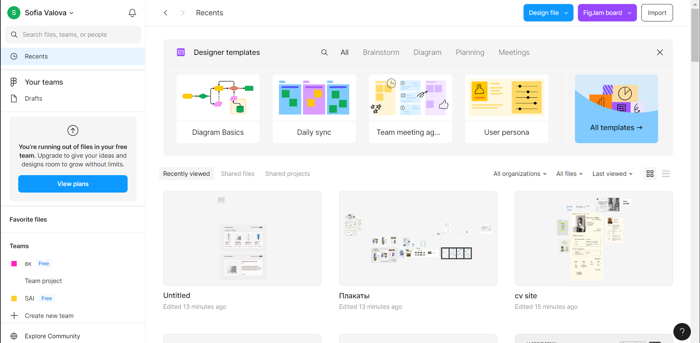

لإنشاء مشروع، نضغط على "Drafts" في اللوحة اليسرى، ثم "Design file" في اللوحة العلوية.<br>
يمكن تقسيم الواجهة إلى أربع مناطق:
1. على اليسار - الطبقات
2. في الوسط - مساحة العمل
3. على اليمين - تحرير خصائص العناصر
4. في الأعلى - الأدوات

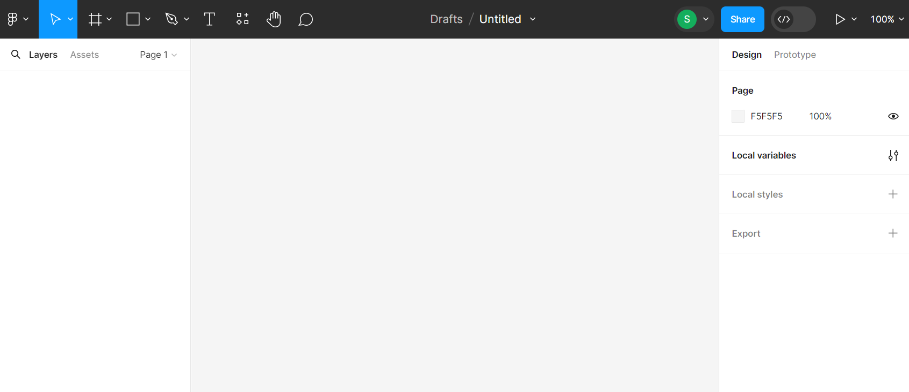

## إنشاء إطار
الإطار هو العنصر الأساسي للتصميم في Figma. يُعد الإطار وثيقة مكتملة يمكن أن تكون صفحة لموقع ويب أو شاشة لتطبيق جوّال. يجمع الإطار العناصر المختلفة داخله.


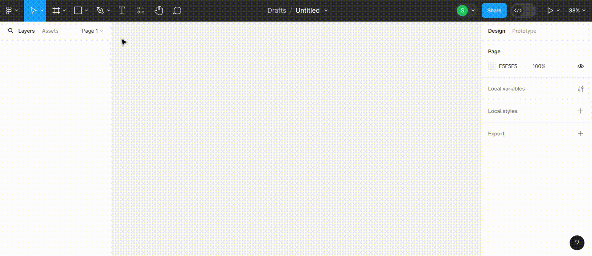

لإضافة لون إلى الصفحة، نضغط على الإطار، ثم ننتقل إلى علامة التبويب "Fill" في اللوحة اليمنى - وهي المسؤولة عن تعبئة اللون، ثم نضغط على المربع. يمكننا اختيار اللون باستخدام شريط التمرير أو إدخال رمز اللون يدويًا.
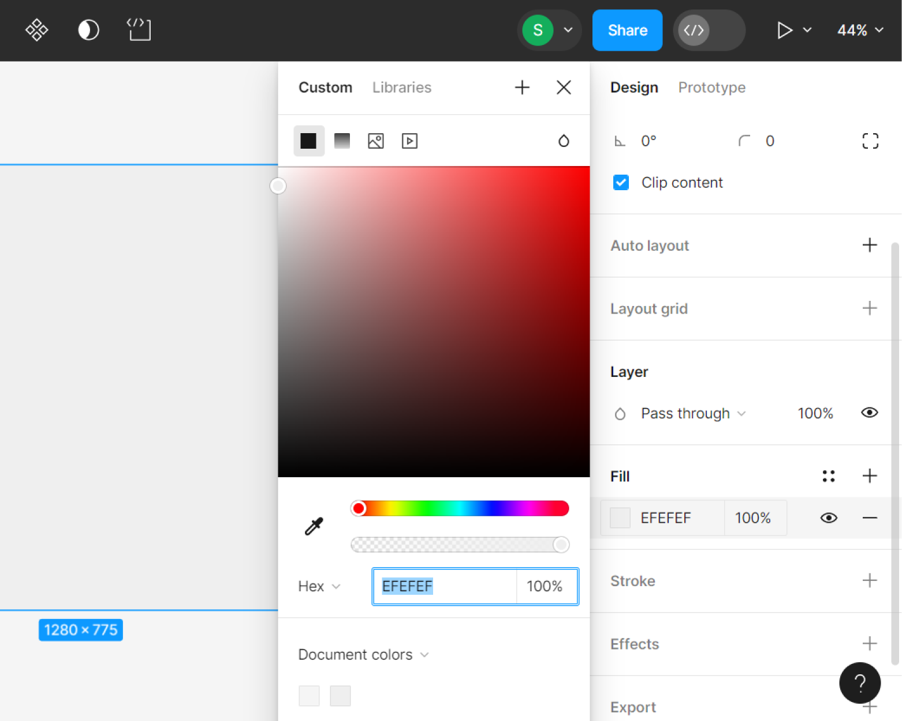

## إنشاء بطاقة
ستعرض البطاقة صورة، اسمًا، وصفًا مختصرًا، سعرًا، وزرًا للانتقال إلى صفحة وصف المنتج التفصيلية.
نحتاج إلى - 2 مستطيل، صورة، و3 كتل نصية.

لإنشاء مستطيل، اختره من لوحة الأدوات أو اضغط على المفتاح R، ثم أنشئ مستطيلًا بحجم عشوائي في مساحة العمل أثناء الضغط على زر الفأرة الأيسر.
في علامة التبويب الخاصة بالمستطيل، يمكنك اختيار خط، سهم، شكل بيضاوي، مضلع، نجمة، أو صورة.

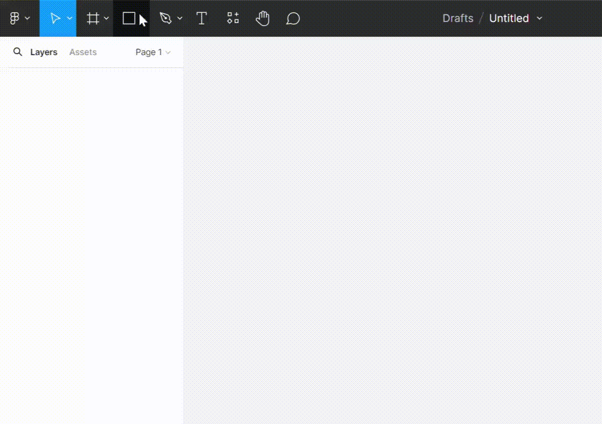
سننشئ مستطيلًا آخر، ونضيف صورة وعناصر نصية. عند إنشاء عناصر داخل الإطار، يتم إنشاؤها تلقائيًا في لوحة الطبقات داخل هذا الإطار.

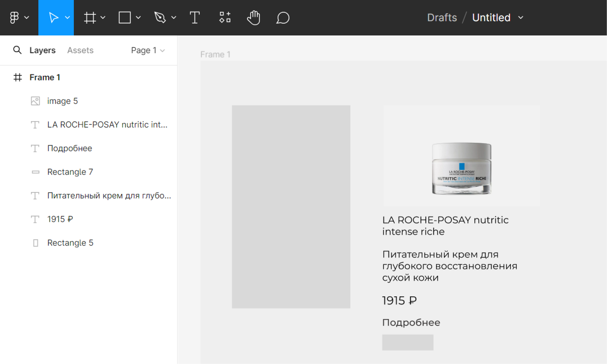

### خصائص العناصر
يتم ضبط خصائص العناصر في اللوحة اليمنى.

خصائص النص:
1. **الخط**. يمكنك اختيار الخط من موقع [Google Fonts](https://fonts.google.com/). اضغط على Filters <- Language. اختر Cyrillic لاختيار خط يدعم اللغة الروسية.
<div dir="rtl">
2. النمط - اجعل الوصف المختصر وزر الضغط بخط Medium، والعنوان والسعر بخط SemiBold.<br>
3. الحجم - عادةً ما تكون أحجام النصوص على المواقع 14px، لذا سنجعل الوصف المختصر والزر بهذا الحجم، بينما سيكون حجم العنوان والسعر 16px، ليتميزوا عن باقي النصوص.
</div>


نختار عنصر النص، في علامة التبويب Text نضغط على اسم الخط، ثم نبحث عن الخط المطلوب، ونقوم بتعيين النمط وحجم الخط أدناه. إذا قمت بالنقر على الثلاث نقاط، ستظهر جميع إعدادات الخط.<br>
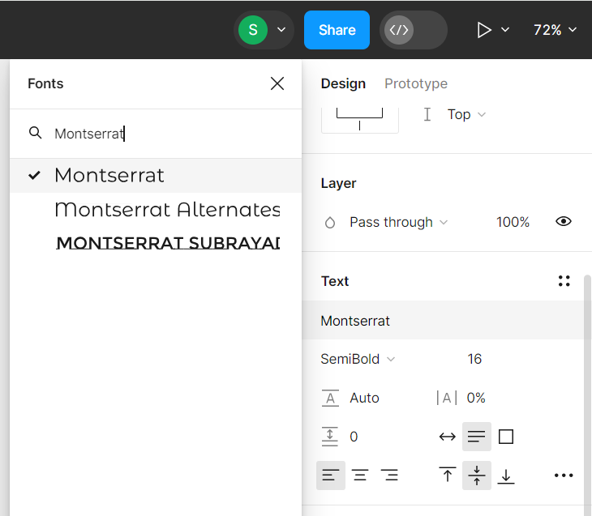


سنجري نفس الشيء على عناصر النص الأخرى.

خصائص العناصر الهندسية:
1. **اللون**. نحن نعرف كيفية القيام بذلك بالفعل.
2. **تدوير الزوايا**. 
لنستعرض معًا إعدادات هذه العلامة: X و Y - إحداثيات العنصر داخل الإطار، W و H - العرض والارتفاع، رمز الزاوية - زاوية دوران العنصر، وتدوير الزوايا.<br>
سنقوم بتدوير الزوايا للبطاقة والصورة بمقدار 20px، بينما ستكون الزوايا في الزر بمقدار 10px.
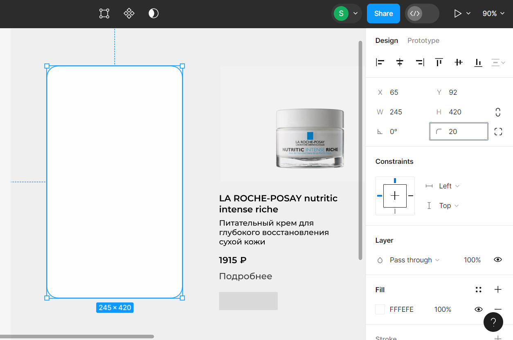


3. **الإطار**. سنضيف إطارًا للزر ونتخلص من التعبئة.
لذلك، في قسم Stroke نضغط على "+", وسنضيف إطارًا. يمكننا ضبط اللون، السماكة، والجهات التي نريد إضافة الإطار لها. في قسم Fill، نضغط على "-" لإزالة اللون.

**خصائص الصورة:**<br>
لتغيير الحجم، يجب سحب حدود الصورة، مع الضغط على مفتاح Shift لتغيير الأبعاد بشكل متناسب.<br>
إذا كنت بحاجة إلى قص الصورة، انتقل إلى علامة التبويب Fill واضغط على الصورة. في النافذة التي ستظهر، ستجد قائمة منسدلة فوق الصورة، اختر منها Crop وقم بتغيير الحدود. إذا كنت ترغب في استبدال الصورة، قم بالتحريك على الصورة في هذه النافذة، وستظهر لك زر "Choose image".<br>
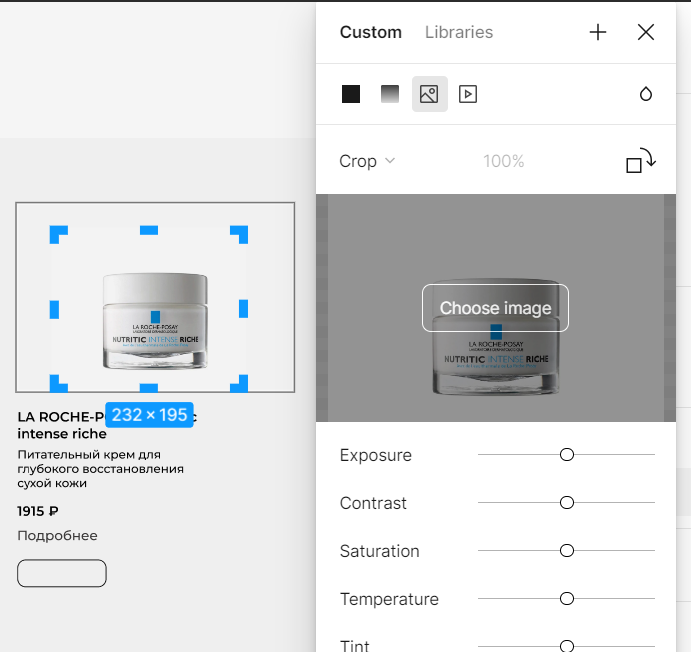


### تنسيق عناصر البطاقة و Auto Layout
لقد أعددنا جميع العناصر، والآن سنقوم بتنسيقها.<br>
أولاً، دعنا نجمع الزر. اختر المستطيل والنص الخاص بالزر مع الضغط على مفتاح Shift، في اللوحة اليمنى في أول علامة تبويب، يمكنك ضبط المحاذاة. نحتاج إلى محاذاة العناصر بالنسبة لبعضها البعض عموديًا وأفقيًا، اضغط على الأيقونتين 2 و 5، ثم اضغط على Ctrl+G (لتجميع العناصر).

[رابط الصورة](https://github.com/ssofiica/Design-tutorial/assets/91909561/60044485-36dd-43af-821f-07cb02d2d0b8)


الآن سنقوم بتجميع البطاقة، وننقل العناصر إلى المستطيل الذي يشكل خلفية البطاقة، ونقوم بمحاذاة العناصر، ونجعل السعر والزر في نفس المستوى ثم نقوم بتجميعها. إذا كانت عدة عناصر مجمعة، فعند النقر مرة واحدة على عنصر، سيتم تحديد المجموعة بأكملها، لذلك يجب النقر مرتين على العنصر لتحديده فقط.

في Figma، هناك أداة تُعرف باسم Auto Layout. هذه الأداة تسمح بإنشاء حاويات يمكن أن تحتوي على عناصر واجهة مستخدم أخرى، ثم يمكن ضبط قواعد الترتيب، مثل المحاذاة أو المسافة بين العناصر. يمكن مقارنة Auto Layout بـ flex في CSS.
نحدد جميع عناصر البطاقة، بما في ذلك الخلفية، وفي اللوحة اليمنى نجد علامة التبويب Auto Layout، ونضغط على الزر الإضافي.

<div dir="rtl">
نختار الترتيب العمودي، والpadding الداخلي 20px، والمسافة بين العناصر 10px.<br>
نقوم بنسخ البطاقة وتغيير المحتوى.
</div>

النتيجة:


## صفحة التفاصيل

سنجعل الصورة والوصف في كتل منفصلة.

## HTML

تعريف لغه (HTML) - هي لغة ترميز تُستخدم لتحديد هيكل صفحات الويب التي يزورها المستخدمون. تتكون HTML من مجموعة من العناصر التي تستخدمها لتغطية أو لف أو وضع علامات على أجزاء مختلفة من المحتوى، بحيث يكون له مظهر محدد أو يعمل بطريقة معينة.

العنصر = علامة بداية + المحتوى + علامة نهاية<br>
```<p>Hello world!</p>```

علامة البداية: تتكون من اسم (تسمية) العلامة، الموضوعة داخل أقواس الزاوية. تعمل هذه العلامة كمؤشر لبداية العنصر، ومن هذه اللحظة تؤثر العلامة على المحتوى الذي يليها<br>
علامة النهاية: تبدو مثل علامة البداية، ولكنها تحتوي على شريط مائل قبل اسم العلامة<br>
المحتوى: يشمل نصًا أو عناصر أخرى<br>

دعونا نلقي نظرة على العلامات التي نحتاجها:

<div dir="rtl" style="text-align: right;">
    
<li><code>&lt;div&gt;..&lt;/div&gt;</code>. يستخدم لتنظيم المحتوى على صفحة الويب ووضع المحتوى في كتل منفصلة. ينشئ عنصر div كتلة تمتد بشكل افتراضي عبر عرض المتصفح بالكامل، ويتم نقل العنصر التالي إلى سطر جديد.</li>
    <li><code>&lt;p&gt;..&lt;/p&gt;</code>. يمثل فقرة نصية، ويُستخدم للفصل بين كتل النصوص بمسافات أو خطوط فارغة.</li>
    <li><code>&lt;h1-6&gt;..&lt;/h1-6&gt;</code>. يمثل ستة مستويات من العناوين للأقسام. <code>&lt;h1&gt;</code> هو أعلى مستوى، و<code>&lt;h6&gt;</code> هو الأدنى. بشكل افتراضي، تبدأ عناوين العناصر في سطر جديد وتحتل كامل العرض المتاح في الكتلة المحتوية.</li>
    <li><code>&lt;img/&gt;</code>. يضيف صورة. السمة src ضرورية وتحتوي على مسار الصورة (سواء كان مسار ملف أو رابط من الإنترنت)، وتحتوي السمة alt على النص البديل. محركات البحث تستخدم النص البديل لفهرسة الصورة، وإذا كان هناك مشكلة في عرض الصورة، يظهر النص البديل. يمكن تعديل إعدادات الصورة من خلال css.<br> 
    مثال: <code>&lt;img src="./img/sun.png" alt="Картинка солнца"/&gt;</code></li>
    <li><code>&lt;a&gt;..&lt;/a&gt;</code>. يُستخدم مع السمة href لإنشاء رابط تشعبي إلى صفحات ويب، ملفات، عناوين بريد إلكتروني، مواقع داخل نفس الصفحة، أو أي عنصر يمكن الوصول إليه عبر URL.</li>
    
</div>


لمزيد من المعلومات حول [العلامات](https://developer.mozilla.org/en-US/docs/Web/HTML/Element/).

## CSS
تعريف لغه (CSS)  (؛Cascading Style Sheets؛) - هي لغة جداول الأنماط، لغة لوصف مظهر صفحة الويب.
من خلال HTML نقوم بإنشاء العناصر، ومن خلال CSS نقوم بتعيين الخصائص لها.
لنفترض أننا أنشأنا تخطيطًا باستخدام HTML. الآن نريد أن نجعل مظهر الصفحة جميلاً، لذلك نحتاج إلى وصف كيف يجب أن يبدو كل عنصر. لهذا، يجب وصف مجموعة من قواعد تنسيق العنصر أو ببساطة النمط.

مجموعة القواعد = محدد {خاصية: قيمة;}

```css
div {
    background: #EFEFEF;
}
```
### CSS

**المحددات** - اسم العنصر الذي سيتم تعيين نمط له  
**الخصائص** - ما نريد تغييره  
**القيمة** - واحدة من المضاهر الممكنة للخاصية

### المحددات

| نوع المحدد       | css                                   | html                                            | يحدد القواعد ل                                                                                           |
|------------------|---------------------------------------|-------------------------------------------------|-----------------------------------------------------------------------------------------------------------|
| عنصر             | p {<br> color: #ffffff;<br> }        | ```<p>```                                       |  لجميع عناصر p                                                                                             |
| معرف             | #my-id {<br>color: #ffffff;<br> }    | ```<p id="my-id">```                           | العنصر الذي يحمل هذا المعرف. يجب أن تكون كل قيمة معرف فريدة في الصفحة                                   |
| فئة              | .title {<br>color: #ffffff;<br> }    | ```<p class="title"> <h3 class="title">```    | لجميع العناصر التي تحمل الفئة المحددة. يمكن أن يكون هناك عدة أمثلة للفئة في الصفحة                       |
| فئة زائفة        | p:hover {<br>color: #252525;<br> }   | ```<p>```                                      | العنصر المحدد في الحالة المحددة. في هذا المثال ```<p>```، يغير  اللون عند تمرير الماوس                 |


### الخصائص

يوجد عدد هائل من الخصائص وقيمها، دعونا نستعرض جزءًا صغيرًا منها، والتي لا يمكن الاستغناء عنها، يمكنك دراسة الباقي عند الحاجة.


### 1. الأحجام والمسافات

<div dir="rtl">
width - يحدد عرض العنصر. يمكن تحديده بوحدات البكسل (px)، النسب المئوية (%)، em، rem، vw، vh (مزيد من التفاصيل أدناه).<br>  
height - يحدد ارتفاع العنصر.<br>  
border - إطار حول العنصر. يمكن تخصيص سمك الإطار، نوعه ولونه. مثال: `border: 1px solid black`.<br>  
border-radius - يجعل زوايا العنصر مستديرة ويحدد ذلك بوحدات البكسل أو النسب المئوية بالنسبة لحجم العنصر.<br>  
margin - حجم المسافة الخارجية حول العنصر، يُحدد بوحدات px، %، auto، وغيرها.<br>  
padding - حجم المسافة الداخلية داخل العنصر، يُحدد بوحدات px، %، auto، وغيرها.<br>  
</div>


### كيف تحدد الهوامش (margin) والهوامش الداخلية (padding)؟

1. اللاحقات: top, right, left, bottom. على سبيل المثال: { margin-top: 10px; padding-left: 2%; }
2. عدد القيم:
<ul dir="rtl">
  <li>{ margin: 1px } - هوامش بمقدار 1px من جميع الجوانب</li>
  <li>{ margin: 1px 5px } - القيمة الأولى للهوامش العليا والسفلية، والثانية للهوامش اليسارية واليمنية</li>
  <li>{ margin: 1px 5px auto } - القيمة الأولى لهامش الجزء العلوي، والثانية لليسار واليمين، والثالثة للأسفل</li>
  <li>{ margin: 1px 5px auto 0 } - باتجاه عقارب الساعة لكل جانب: الأعلى، اليمين، الأسفل، واليسار</li>
</ul>


### 2. وضع العلامات
<div dir="rtl">
display - عرض العناصر.<br>
القيم:<br>
- block - يبدأ العنصر بسطر جديد ويشغل كامل عرض الحاوية.<br>
- inline - يتم وضع العنصر داخل العنصر الأب ولا يشغل سطرًا منفصلًا.<br>
- none - العنصر لا يظهر.<br>
- grid - يظهر العنصر في شكل شبكة.<br>
- flex - مرن.<br>
</div>


<div dir="rtl">
<br><br>
display: flex
</div>

الفكرة الأساسية - توزيع مرن للمساحة بين العناصر، ترتيب مرن، محاذاة، وإدارة مرنة.
</div>


### الخصائص التي سنستخدمها:
<div dir="rtl">
- justify-content - محاذاة العناصر داخل الحاوية على المحور الرئيسي.<br>
- flex-direction - اتجاه ترتيب العناصر (في صف، في عمود، وما إلى ذلك).<br>
- align-items - محاذاة العناصر داخل الحاوية على المحور العرضي.<br>
</div>


تستخدم هذه الخصائص فقط عند تحديد ```{ display: flex; }```.

مثال:
```css
.container{
    display: flex;
/* العناصر مرتبة في عمود */
    flex-direction: column;
/* الفواصل متساوية بين العناصر */
    justify-content: space-between; 
}
```
### المزيد عن [القيم](https://doka.guide/css/flexbox-guide/) لهذه الخصائص.

<div dir="rtl">
display: grid
</div>

### الشبكة (Grid)

على عكس حاوية الفليكس التي تعمل بعدد واحد فقط من الأبعاد، تتيح الشبكات (grids) العمل مع بعدين في وقت واحد: الأفقي والعمودي. يمكنك دمج خلايا فردية، وتغيير أحجام الصفوف والأعمدة، وضبط الهوامش بينها.

### الخصائص التي سنستخدمها:
<div dir="rtl"> - grid-template-columns و grid-template-rows - 
تحدد أبعاد وعدد الأعمدة أو الصفوف في الشبكة.  
</div> 

```css
.container {
  display: grid;
/* سيتم إنشاء 3 أعمدة */
  grid-template-columns: 150px auto 40%;
/* سيتم إنشاء صفين */
  grid-template-rows: 200px 250px;
}
```
إذا كنت بحاجة إلى أعمدة أو صفوف متساوية، يمكنك استخدام دالة `repeat()`. بالنسبة للشبكة، هناك وحدة قياس خاصة بها وهي `fr`، التي تُحسب تلقائيًا.

```css
grid-template-columns: repeat(3, 1fr) /* ثلاثة أعمدة، كل منها سيشغل 1/3 من عرض العنصر الأب */
grid-template-columns: repeat(3, 250px); /* ثلاثة أعمدة بارتفاع 250 بكسل */
```

<div dir="rtl">
gap - يحدد المسافات الفاصلة. القيمة الأولى هي المسافات بين الصفوف، والقيمة الثانية هي المسافات بين الأعمدة.
  gap: 50px 20px;
</div>


لمزيد من المعلومات حول [الشبكة](https://doka.guide/css/grid-guide/).

### 3. النص واللون

<div dir="rtl">
background-color - لون خلفية العنصر<br>
color - لون النص<br>
font-family - خط النص<br>
font-size - حجم الخط<br>
font-weight - نمط الخط<br>
text-align - محاذاة النص داخل العنصر<br>
</div>


### 4. الصور
<div dir="rtl">
background-image - صورة الخلفية<br>
object-fit - تغيير حجم الصورة وتحديد مكانها داخل الحاوية<br>
</div>


## وحدات القياس: 

<div dir="rtl">
- em — تعادل حجم خط العنصر الأب. إذا كان حجم خط الأب يساوي 16px، فإن 1em سيكون مساويًا 16px. هذا مفيد عندما تحتاج إلى أن يتغير العنصر مع حجم خط الأب.<br>
- rem — تعادل حجم خط العنصر الجذري (html). هذا مفيد لتلك العناصر التي يجب أن ترتبط بحجم خط html، بدلاً من حجم خط أب معين.<br>
- vw و vh تُستخدم لتعيين الأحجام كنسب مئوية من عرض أو ارتفاع نافذة المتصفح. إنها مفيدة لإنشاء تصميمات مرنة تتكيف مع أحجام الشاشات المختلفة. 1vw يساوي 1% من عرض نافذة المتصفح، و 1vh يساوي 1% من ارتفاع النافذة.
</div>


## تصميم صفحة مع بطاقات


أولاً، سنقوم بإنشاء التخطيط، ثم سنقوم بكتابة الأنماط.  
نقوم بإنشاء ملف `index.html` و `style.css`، ونكتب في `index.html`.


```html
<!DOCTYPE html>
<html lang="rus">
  <head>
    <meta charset="UTF-8" />
    <meta http-equiv="X-UA-Compatible" content="IE=edge" />
    <meta name="viewport" content="width=device-width, initial-scale=1.0" />
    <title>Магазин</title>
    <link rel="stylesheet" href="style.css"/>
  </head>
  <body>
    <div class="space">
        <div class="header"></div>
        <div class="container"></div>
    </div>
  </body>
</html>
```
داخل عنصر `body`، سنقوم بإنشاء `div` باسم `space`، والذي سنقوم بترتيب عناصر الصفحة داخله. تم تقسيم الصفحة إلى جزئين: الرأس والحاوية. يمكنك إضافة اسم الشركة، وشريط التنقل في الرأس. ستكون البطاقات داخل الحاوية.

**ملف style.css**

عند إنشاء البطاقة في Figma، كان من الضروري اختيار خط من موقع [Google Fonts](https://fonts.google.com/). الآن على صفحة الخط، يجب الضغط على "Get Font" -> "Get embed code" -> التبديل إلى `@import` -> نسخ الكود. نضيف هذا `import` في بداية ملف `style.css`.

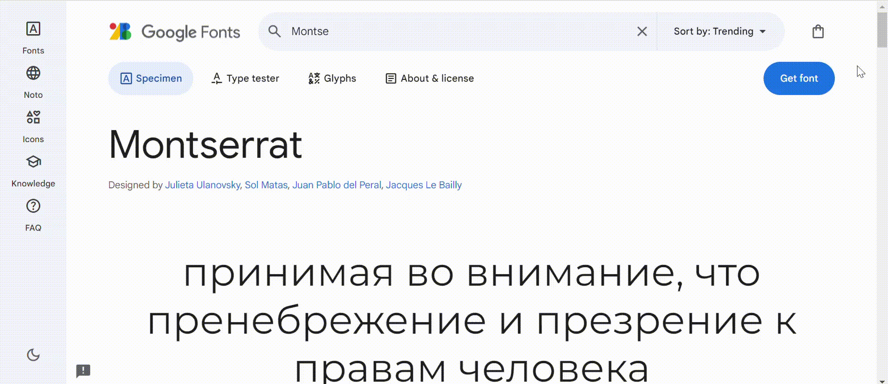

```css
@import url('https://fonts.googleapis.com/css2?family=Montserrat:ital,wght@0,100..900;1,100..900&display=swap');
*{
    margin: 0;
    padding: 0;
    font-family: 'Montserrat', sans-serif;
    color: #000000; 
}
body{
    background: #EFEFEF;
}
.space{
    width: 80%;
    margin-left: auto;
    margin-right: auto;
}
``
ماذا فعلنا من خلال الأنماط؟
- قمنا بتعيين خلفية للصفحة بالكامل
- الحاوية التي تحتوي على جميع العناصر تشكل 80% من عرض الشاشة ومركزة في المنتصف بسبب ذلك


**أنماط الحاوية**
دع البطاقات تتوزع بواقع 4 بطاقات في الصف والمسافة بينها 20 بكسل.

```css
.container{
    display: grid;
    grid-template-columns: repeat(4,1fr);
    gap: 20px;
}
```

## تصميم البطاقة

تتكون البطاقة من صورة، عنوان، وصف، سعر وزر. سنستخدم ```div class="card"``` الذي يجمع جميع العناصر معًا.<br>
سنضيف ذلك داخل فئة الحاوية

```html
<div class="card">
    
    <p class="title">LA ROCHE-POSAY effaclar</p>
    <p class="short-description">Крем-гель для проблемной кожи</p>
    <p>1348 ₽</p>
    <a href="" class="card-button">Подробнее</a> 
</div>
```
الآن لدينا على الصفحة صورة بسيطة وعناصر نصية.

### الأنماط

**أنماط للخلفية**<br>
في Figma، نرى ما هي خصائص خلفية البطاقة:
- لون الخلفية - #FFFAFA
- تقوس الحواف - 20px
- الحشوة الداخلية 20px، ولكن دعنا نجعلها كنسبة مئوية - 10%

```css
.card{
    border-radius: 20px;
    background-color: #FFFAFA;
    padding: 10%;
    display: flex;
    flex-direction: column;
    justify-content: space-between;
}
```
لكي تتغير أبعاد البطاقة مع المحتوى ويمكننا التحكم في ترتيب العناصر، سنجعلها حاوية فليكس، يجب أن تكون العناصر في عمود مع مسافة متساوية بينها.


**أنماط الصورة**<br>
سنأخذ الارتفاع والتدوير من فيغما. 
خاصية **object-fit** - تتحكم في تغيير حجم الصورة وترتيبها<br>
القيم: 
<div dir="rtl">
- cover - يتم تغيير حجم الصورة بحيث تملأ العنصر الأب بالكامل، مع الحفاظ على النسب، ولكن كل ما لا يتناسب مع حجم العنصر سيتم قصه<br>
- contain - يتم تغيير حجم الصورة بشكل متناسب لتناسب تمامًا داخل العنصر الأب، في هذه الحالة قد تحتوي الصورة على مناطق فارغة على الجوانب أو من الأعلى أو من الأسفل<br>
- fill - تملأ الصورة المساحة المتاحة بالكامل للعنصر، وقد تتشوه نسبها<br>
- none - ستظهر الصورة بأحجامها الطبيعية، متجاهلة أحجام العنصر الأب<br>
- scale-down — هذه القيمة تحدد تلقائيًا وتختار القيمة الأنسب بين none و contain، أي إذا كانت أبعاد الصورة أكبر من أبعاد العنصر الأب، فسيتصرف scale-down مثل contain، وإلا فسيتصرف مثل none
</div>
****

```css
.image{
    width: 100%;
    height: 211px;
    border-radius: 20px;
    object-fit: cover;
}
```
ستشغل الصورة 100% من العرض المتاح لها، حيث أن البطاقة تحتوي على padding بنسبة 10%، وبالتالي ستملأ الصورة 80% من عرض البطاقة وستكون في المنتصف.


**أنماط العنوان** <br>
حجم الخط - 16px، النمط - bold (يمكن أيضًا تحديده بالأرقام، bold - 700). دعونا نضيف أيضًا هامشًا من الأعلى بمقدار 16px.

```css
.title{
    margin-top: 16px;
    font-size: 16px;
    font-weight: bold;
}
```

**أنماط الوصف** <br>
حجم الخط - 14px، النمط - Medium، دعونا نضيف هامشًا من الأعلى والأسفل بمقدار 10px، وأن يكون النص مليئًا بعرض 100% من المساحة المتاحة له.

```css
.short-description{
    font-size: 14px;
    font-weight: 500;
    width: 100%;
    margin-top: 10px;
    margin-bottom: 10px;
}
```

**أنماط الزر** <br>
يتم تعيين خط تحت نص الروابط بشكل افتراضي، ويمكن إزالته باستخدام ```text-decoration: none;```
بالنسبة لـ padding، يتم تحديد قيمتين، فلنتذكر أن القيمة الأولى هي للهامش العلوي والسفلي، والثانية هي للهامش الأيمن والأيسر.

```css
.card-button{
    padding: 8px 10px; 
    border-radius: 10px;
    border: 1px solid #000000;
    text-decoration: none;
    font-size: 14px;
    font-weight: 500;
}
```
دعونا نرى ما حصلنا عليه:<br>


الآن سنجمع الصورة والعنوان والوصف في div واحد، والسعر والزر في div آخر.

```html
<div class="card">
    <div class="info">
        
        <p class="title">LA ROCHE-POSAY nutritic intense riche</p>
        <p class="short-description">Питательный крем для глубокого восстановления сухой кожи</p>
    </div>
    <div class="down">
        <p>1915 ₽</p>
        <a href="" class="card-button">Подробнее</a>
    </div>
</div>
```

سنكتب نمطًا لعنصر ```down``` بحيث يتم وضع السعر والزر في صف واحد، ويكون السعر على الحافة اليسرى، والزر على الحافة اليمنى. للقيام بذلك، سنجعل ```down``` حاوية مرنة وسنقوم بتعيين ```justify-content: space-between;```، بينما يتحكم ```align-items``` في المحاذاة.<br>
لتحديد كعلامة داخل الفئة، يمكنك القيام بذلك على النحو التالي: ```.<اسم الفئة> <اسم العلامة>```. بالنسبة للسعر، نقوم بتحديد حجم الخط والأسلوب.

```css
.down{
    display: flex;
    justify-content: space-between;
    align-items: center;
}
.down p{
    font-size: 16px;
    font-weight: 700;
}
```
في النهاية نحصل على بطاقة مثل هذه


بعد إضافة المزيد من البطاقات واسم الشركة في الرأس، أصبح الشكل كالتالي:
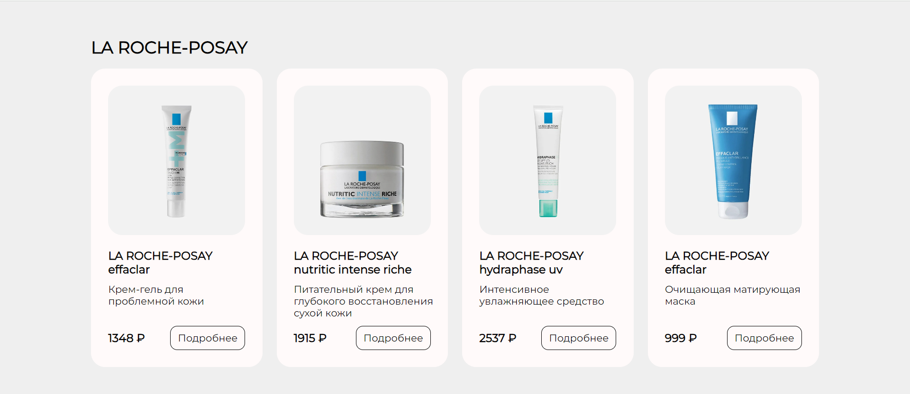
