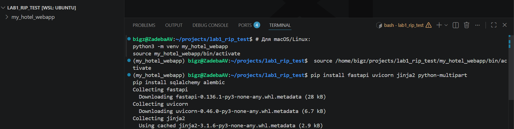
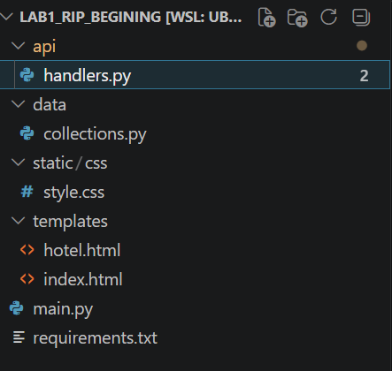
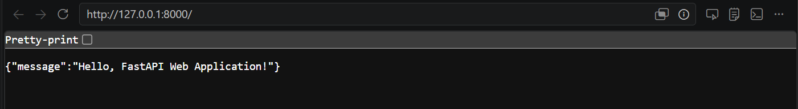
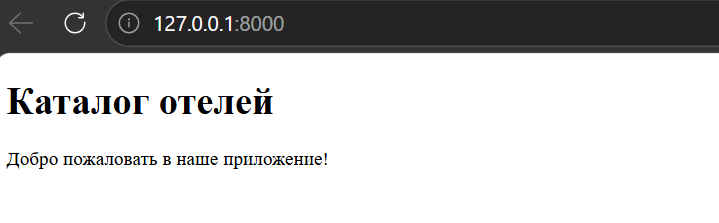
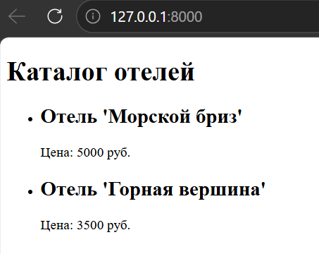
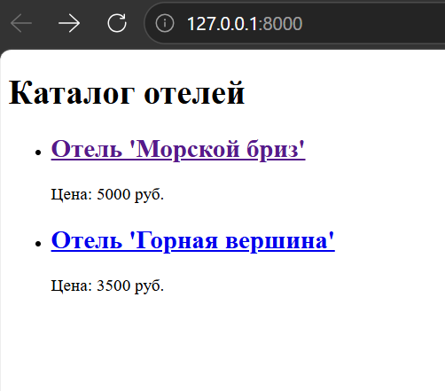
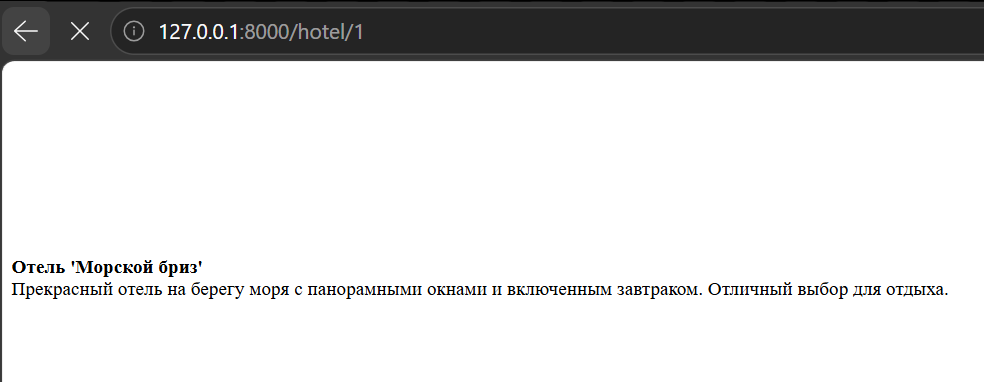
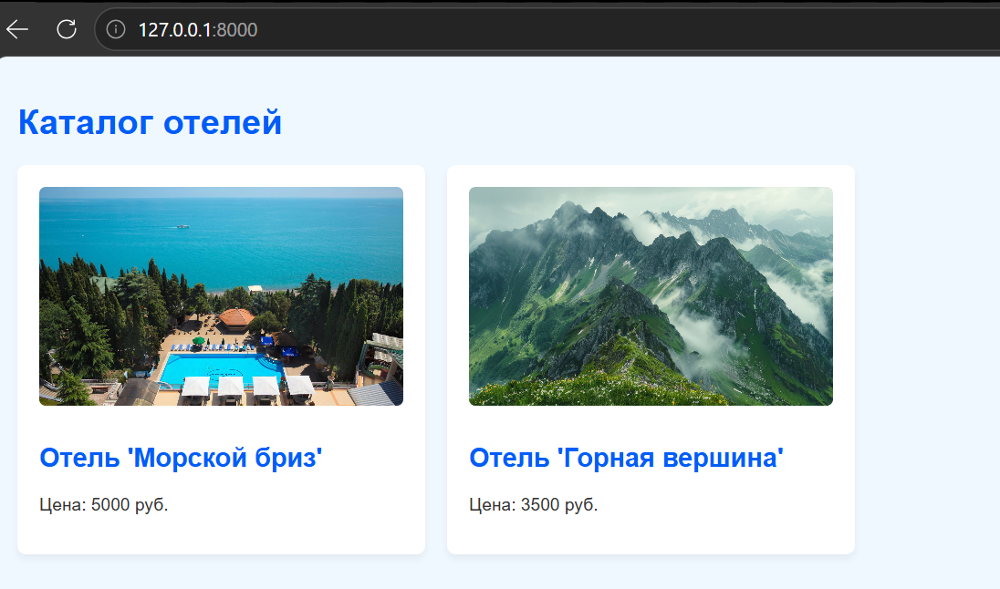
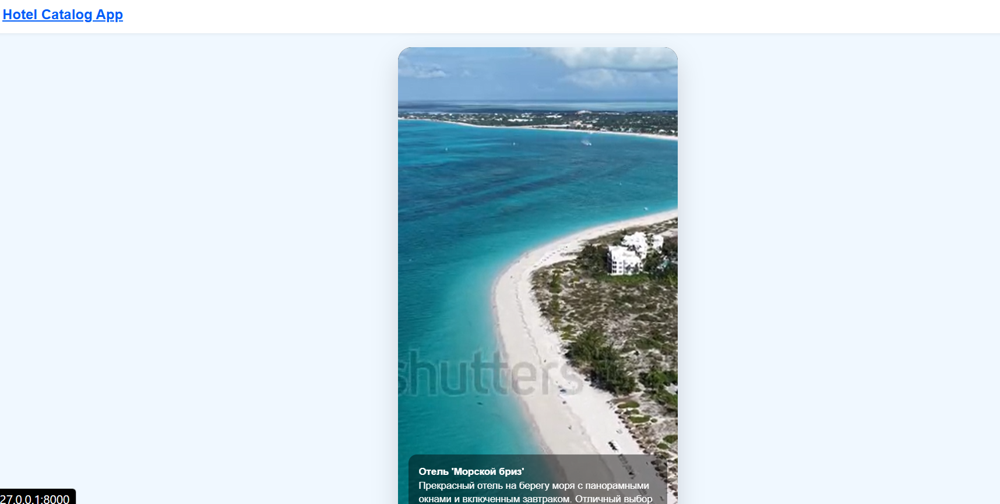

# Методические указания №1 FastAPI (Jinja2, SQLAlchemy, Alembic)

Для выполнения лабораторной работы потребуется установленный **Python 3.10+**, пакетный менеджер **pip**, редактор кода (рекомендуется **Visual Studio Code** или **PyCharm**) и установленный **Docker** (для запуска Minio).

В данной лабораторной работе мы познакомимся с основами построения бэкенда на современном фреймворке FastAPI, разберем базовую шаблонизацию, работу с роутингом и настроим S3-совместимое хранилище для статики.


## План работы

1. Подготовка окружения
2. Структура проекта
3. Первая программа
4. Шаблонизация с Jinja2
5. Коллекции данных (Массивы)
6. Роутинг и страница «Подробнее» (формат Reels/TikTok)
7. Подключение статики (CSS и медиа)
8.  Переход на S3-совместимое хранилище (MinIO)
9. FAQ

## 1. Подготовка окружения

**FastAPI** — это современный, быстрый (высокопроизводительный) веб-фреймворк для создания API на Python 3.7+, в основе которого лежат стандартные аннотации типов Python. В отличие от Django или Flask, FastAPI изначально построен на асинхронной архитектуре (ASGI), что позволяет ему обрабатывать огромное количество запросов одновременно, соревнуясь в скорости с Node.js и Go.

Рекомендуется использовать виртуальное окружение, чтобы зависимости проекта не конфликтовали с глобальными пакетами операционной системы.

Откройте терминал, перейдите в папку будущего проекта и выполните команды:

```bash
# Создание виртуального окружения. 
# Вместо 'my_hotel_webapp' вы можете использовать любое свое название по теме проекта
python -m venv my_hotel_webapp
```

```bash
# Активация виртуального окружения (для Windows):
my_hotel_webapp\Scripts\activate
```

```bash
# Активация виртуального окружения (для macOS/Linux):
source my_hotel_webapp/bin/activate
```

Установим основные пакеты. В первой лабораторной мы не используем базу данных, но сразу подготовим стек (установим алхимию и алембик на будущее):

```bash
pip install fastapi uvicorn jinja2 python-multipart aiofiles
pip install sqlalchemy alembic
```



**Создание файла requirements.txt**
Чтобы Docker в будущем мог установить те же самые библиотеки при сборке контейнера, нам нужно зафиксировать их в текстовый файл. Выполните команду сохранения зависимостей:

```bash
pip freeze > requirements.txt
```

После этого в корне проекта появится файл `requirements.txt` со списком всех установленных библиотек и их точными версиями.

## 2. Структура проекта (Архитектура)

Где положить файл? В современных веб-приложениях принято следовать паттернам, разделяющим логику (например, **MVC** — Model-View-Controller или **MVT** — Model-View-Template). Это позволяет не превращать код в «спагетти».

* **Модели (Data/Models):** Отвечают за структуру данных и связь с БД.
* **Контроллеры/Роутеры (API/Handlers):** Принимают HTTP-запросы, вызывают нужную логику и возвращают ответ.
* **Представления (Templates):** Отвечают за то, как данные будут показаны пользователю (HTML).

Создайте следующую структуру папок и файлов:



## 3. Первая программа

Файл `main.py` должен содержать минимум логики — это точка сборки приложения. Напишем базовый код для запуска сервера.

Откройте `main.py` и добавьте:

```python
from fastapi import FastAPI
import uvicorn

app = FastAPI(title="Hotel Catalog App")

@app.get("/")
def read_root():
    return {"message": "Hello, FastAPI Web Application!"}

if __name__ == "__main__":
    # Запуск сервера. reload=True автоматически перезапускает сервер при изменении кода
    uvicorn.run("main:app", host="127.0.0.1", port=8000, reload=True)
```

Запустите программу из терминала:

```bash
python main.py
```

Откройте браузер и перейдите по адресу `http://127.0.0.1:8000`. Вы должны увидеть JSON-ответ:
`{"message": "Hello, FastAPI Web Application!"}`



## 4. Шаблонизация с Jinja2

JSON — это формат для передачи данных (API), но нам нужно отдавать пользователю красивые веб-страницы. Для этого используется шаблонизатор Jinja2.

Создадим базовый HTML-шаблон. В папке `templates` создайте файл `index.html`:

```html
<!DOCTYPE html>
<html lang="ru">
<head>
    <meta charset="UTF-8">
    <title>Каталог</title>
</head>
<body>
    <h1>Каталог отелей</h1>
    <p>Добро пожаловать в наше приложение!</p>
</body>
</html>
```

Теперь обновим логику, чтобы отдавать этот файл. Создадим контроллер в `api/handlers.py`:

```python
from fastapi import APIRouter, Request
from fastapi.templating import Jinja2Templates

router = APIRouter()
# Указываем, где искать HTML файлы
templates = Jinja2Templates(directory="templates")

@router.get("/")
def get_catalog(request: Request):
    # Возвращаем скомпилированный HTML шаблон
    return templates.TemplateResponse(request=request, name="index.html")
```

В `main.py` необходимо подключить этот роутер:

```python
from fastapi import FastAPI
import uvicorn
from api.handlers import router

app = FastAPI(title="Hotel Catalog App")

# Подключаем наши роуты
app.include_router(router)

if __name__ == "__main__":
    uvicorn.run("main:app", host="127.0.0.1", port=8000, reload=True)
```

Перезагрузите страницу в браузере. Вы увидите отображение чистого HTML (пока без стилей).



## 5. Коллекции данных (Массивы)

Пока мы не подключили реальную БД, будем использовать списки словарей. Изображения положим в папку static/img 

В файле `data/collections.py` создадим массив:

```python
hotels_db = [
    {
        "id": 1,
        "title": "Отель 'Морской бриз'",
        "price": 5000,
        "description": "Прекрасный отель на берегу моря с панорамными окнами и включенным завтраком. Отличный выбор для отдыха.",
        "./assets/image_url": "/static/img/hotel.jpg",
        "video_url": "/static/img/hotel_vid.mp4"
    },
    {
        "id": 2,
        "title": "Отель 'Горная вершина'",
        "price": 3500,
        "description": "Уютное шале в горах. Идеально подходит для любителей зимних видов спорта и активного отдыха.",
        "./assets/image_url": "/static/img/mountains.jpg",
        "video_url": "/static/img/mountains.mp4"
    },
]
```

Передадим эти данные в шаблон. Изменим `api/handlers.py`:

```python
from fastapi import APIRouter, Request
from fastapi.templating import Jinja2Templates
from data.collections import hotels_db

router = APIRouter()
templates = Jinja2Templates(directory="templates")

@router.get("/")
def get_catalog(request: Request):
    # Добавляем context явно
    return templates.TemplateResponse(
        request=request,
        name="index.html", 
        context={"hotels": hotels_db}
    )

```

Обновим `templates/index.html`, добавив цикл ``:

```html
<!DOCTYPE html>
<html lang="ru">
<head>
    <meta charset="UTF-8">
    <title>Каталог</title>
</head>
<body>
    <h1>Каталог отелей</h1>
    
    <ul>
        
        <li>
            <h2>{{ hotel.title }}</h2>
            <p>Цена: {{ hotel.price }} руб.</p>
        </li>
        
    </ul>
</body>
</html>
```

Обновите страницу. Вы увидите списочный вывод данных из вашего Python-массива.



## 6. Роутинг и страница «Подробнее» (формат Reels/TikTok)

Теперь сделаем так, чтобы по клику на отель открывалась подробная страница в популярном вертикальном формате с зацикленным видео (9:16).

Добавим новый путь в `api/handlers.py`. Для этого используем Path-параметр `hotel_id`:

```python
#код необходимо ДОБАВИТЬ к существующим маршрутам в файле
@router.get("/hotel/{hotel_id}")
def get_hotel_detail(request: Request, hotel_id: int):
    hotel = next((h for h in hotels_db if h["id"] == hotel_id), None)
    
    return templates.TemplateResponse(
        request=request,
        name="hotel.html", 
        context={"hotel": hotel}
    )
```

Создадим шаблон `templates/hotel.html` со следующей структурой:

```html
<!DOCTYPE html>
<html lang="ru">
<head>
    <meta charset="UTF-8">
    <title>{{ hotel.title }}</title>
</head>
<body class="detail-page-body">
    
    <header class="detail-header">
        <a href="/" class="home-link">Hotel Catalog App</a>
    </header>

    <main class="video-layout">
        <div class="tiktok-container">
            <video autoplay loop muted playsinline>
                <source src="{{ hotel.video_url }}" type="video/mp4">
            </video>
            
            <div class="description-overlay">
                <strong>{{ hotel.title }}</strong><br>
                {{ hotel.description }}
            </div>
        </div>
    </main>
    
</body>
</html>
```
> **Обратите внимание на навигацию:** Внутри тега `<header>` мы разместили элемент `<a href="/" class="app-title">Главная</a>`. Вы можете заменить этот текст на картинку (``), чтобы сделать полноценный логотип. Благодаря атрибуту `href="/"` по нажатию на этот заголовок или логотип пользователь из любой точки приложения всегда будет возвращаться на главную страницу со списком всех услуг (отелей).

Добавим ссылки в цикл for `index.html`, чтобы карточки вели на детальную страницу:

```html
<ul>
    
    <li>
        <a href="/hotel/{{ hotel.id }}">
                        
            <h2>{{ hotel.title }}</h2>
        </a>
        <p>Цена: {{ hotel.price }} руб.</p>
    </li>
    
</ul>
```
Теперь главная страница выглядит так:


И появляется страница подробнее об услуге:



## 7. Подключение статики (CSS)

Чтобы интерфейс стал опрятным, подключим каскадные таблицы стилей.

В `main.py` укажем FastAPI, где брать статику:

```python
from fastapi.staticfiles import StaticFiles

# Добавить перед app.include_router(router)
app.mount("/static", StaticFiles(directory="static"), name="static")
```

Подключим CSS в `head` файла `index.html` и `hotel.html`:

```html
<link rel="stylesheet" href="/static/css/style.css">
```

Создайте `static/css/style.css`. В дизайне использована свежая палитра: бледно-голубой фон для легкости чтения и яркий цвет «электрик» для интерактивных элементов:

```css
/* Базовые стили каталога */
body {
    font-family: Arial, sans-serif;
    background-color: #f0f8ff; /* Бледно-голубой фон */
    color: #333;
    margin: 0;
    padding: 20px;
}

h1 {
    color: #005df9; /* Электрический синий */
}

ul {
    list-style: none;
    padding: 0;
    display: grid;
    grid-template-columns: repeat(auto-fill, minmax(300px, 1fr));
    gap: 20px;
}

li {
    background: #ffffff;
    padding: 20px;
    border-radius: 8px;
    box-shadow: 0 4px 6px rgba(0,0,0,0.05);
    transition: transform 0.2s ease;
}

li:hover {
    transform: translateY(-5px);
}

a {
    text-decoration: none;
    color: #005df9;
}

/* Стили для страницы Подробнее (формат Reels/TikTok) */
.detail-page-body {
    background-color: #f0f8ff; /* Сохраняем бледно-голубой фон */
    margin: 0;
    padding: 0;
    display: flex;
    flex-direction: column;
    height: 100vh; /* Занимает всю высоту экрана */
}

/* Белая шапка-хедер */
.detail-header {
    background-color: #ffffff;
    padding: 15px 20px;
    box-shadow: 0 2px 4px rgba(0,0,0,0.05);
}

/* Кнопка "Домой" (Название проекта) */
.home-link {
    font-size: 20px;
    font-weight: bold;
    color: #005df9; /* Электрический синий */
    text-decoration: none;
}

.home-link:hover {
    text-decoration: underline;
}

/* Выравнивание плеера по центру оставшегося экрана */
.video-layout {
    flex: 1;
    display: flex;
    justify-content: center;
    align-items: center;
    padding: 20px;
    box-sizing: border-box;
}

/* Контейнер в виде "смартфона" (TikTok формат) */
.tiktok-container {
    position: relative;
    width: 100%;
    max-width: 400px; /* Ширина мобильного устройства */
    aspect-ratio: 9/16;
    background: #000;
    border-radius: 20px; /* Скругляем углы самого плеера */
    box-shadow: 0 15px 35px rgba(0,0,0,0.15); /* Тень, чтобы отделить от фона */
    overflow: hidden; /* Обрезаем видео, чтобы оно не вылезало за скругления */
}

.tiktok-container video {
    width: 100%;
    height: 100%;
    object-fit: cover; /* Заполняет экран плеера, обрезая края */
}

.description-overlay {
    position: absolute;
    bottom: 20px;
    left: 15px;
    right: 15px;
    background: rgba(0, 0, 0, 0.45); /* Полупрозрачная подложка */
    color: #ffffff;
    padding: 15px;
    border-radius: 12px;
    font-size: 14px;
    line-height: 1.4;
    
    /* Ограничение текста в 4 строки с многоточием */
    display: -webkit-box;
    -webkit-line-clamp: 4;
    -webkit-box-orient: vertical;
    overflow: hidden;
}

.hotel-./assets/image {
    width: 100%;             /* Картинка занимает всю ширину карточки */
    height: 200px;           /* Фиксированная высота */
    object-fit: cover;       /* Обрезает картинку без искажения пропорций */
    border-radius: 6px;      /* Слегка скругляем углы */
    margin-bottom: 10px;
}
```

Обновите страницу. Вы увидите аккуратную сетку карточек каталога. 


При клике на карточку откроется полноэкранный вертикальный блок с зацикленным видео и текстовым слоем поверх него.


Для возврата в меню выбора услуг полльзователю достаточно нажать на логотип `Hotel Catalog App`

## 8. Переход на S3-совместимое хранилище (MinIO)

Хранить медиафайлы локально в папке `static/img` удобно на этапе первоначальной верстки и тестирования шаблонов. Однако по требованиям Лабораторной работы №1 все статические медиаресурсы (изображения и видеоролики услуг) должны отдаваться из объектного S3-хранилища.

Для перевода приложения на работу с MinIO выполните следующие шаги:

1. Разверните и настройте локальное S3-хранилище, руководствуясь **[Мини-гайдом по развертыванию MinIO](/tutorials/minio/MinIO_bucket_setup_ReadMe.md)**.
2. Загрузите изображения и видеоролики для ваших услуг в созданный публичный бакет (например, `media`) через веб-интерфейс MinIO Console (`http://localhost:9001`).
3. Модифицируйте вашу коллекцию данных в файле `data/collections.py`, заменив локальные пути на полноценные URL-адреса из вашего S3-хранилища.

Пример изменений в `data/collections.py`:

Было (локальные файлы из папки static):
```python
hotels_db = [
    {
        "id": 1,
        "title": "Отель 'Морской бриз'",
        "price": 5000,
        "description": "Прекрасный отель на берегу моря...",
        "image_url": "/static/img/hotel.jpg",
        "video_url": "/static/img/hotel_vid.mp4"
    },
]
```
Стало (внешние ссылки на объектное хранилище MinIO):
```python

hotels_db = [
    {
        "id": 1,
        "title": "Отель 'Морской бриз'",
        "price": 5000,
        "description": "Прекрасный отель на берегу моря...",
        "image_url": "http://localhost:9000/media/hotel.jpg",
        "video_url": "http://localhost:9000/media/hotel_vid.mp4"
    },
]
```

## 9. FAQ

**Где изучить больше по FastAPI?**
Существует прекрасная официальная документация по фреймворку: [https://fastapi.tiangolo.com/](https://www.google.com/search?q=https://fastapi.tiangolo.com/)

**Почему мы не использовали БД (SQLAlchemy) в первой лабораторной?**
По требованиям задания №1, мы знакомимся с архитектурой, роутингом, шаблонизацией и дизайном интерфейсов. Данные должны храниться атомарно прямо в коде. Подключение базы данных с помощью SQLAlchemy и системы миграций Alembic будет производиться в следующих лабораторных работах на уже подготовленный в рамках этого этапа фундамент.

**Почему в main.py указан host 127.0.0.1, а в Docker Compose — 0.0.0.0?**
Когда вы запускаете сервер локально без Докера, 127.0.0.1 (localhost) безопасен и доступен только с вашего компьютера. Однако внутри Docker-контейнера своя изолированная сеть. Если запустить сервер на 127.0.0.1 внутри контейнера, он будет недоступен снаружи (из вашего браузера). Указание 0.0.0.0 говорит серверу слушать запросы со всех сетевых интерфейсов, позволяя пробросить порт 8000 наружу.