# Методические указания по выполнению лабораторной работы №1

Для выполнения лабораторной работы потребуется [Goland](https://www.jetbrains.com/goland/download/) или [VS Code](https://code.visualstudio.com). Также необходимо изучить первые основы golang перед написанием проекта, подробнее в online-компиляторе [A Tour of Go](https://go.dev/tour/welcome/1)

## План работы
1. Создание проекта
   - Настройка окржения для VS Code
2. Структура проекта
3. Первая программа
4. Первый веб-сервис
5. Работа с шаблонами
6. Простой вариант чистой архитектуры
7. Гиперссылки
8. Поиск
9. Статика
10. FAQ
## 1. Создание проекта
`File -> New -> Project...`\
В меню выбираем создание нового проекта


GOROOT — это переменная, указывающая, где лежит,вся бинарная сборка Go и исходные коды. Устанавливать эту переменную руками нужно только в тех случаях, если вы ставите Go под Windows не с помощью MSI-инсталлера, а из zip-архива. Или если вы хотите держать несколько версий Go, каждая в своей директории.
Возможно у вас еще не будет установлена необходимая версия, тогда следуем низлежащей инструкции.

Нажимаем на "+", Download, попадаем в такое окно. Выбираем версию golang, которую вы хотите установить, советуем устанавливать релиз 1.20 и выше.

Нажимаем "Create" и проверяем в консоли работоспособность нашей новой установленной версии из терминала.


В нашем проекте должен появиться файл go.mod в котором указано название вашего проекта в модуле и версия golang


### Настройка окружения для VS Code
Если по каким-то причинам не получается работать в среде GoLand, тогда есть возможность разрабатывать на Go в VSCode.
Для этого первоначально рекомендуется установить данное расширение, которое включает в себя набор необходимых инструментов.


После этого для создания проекта создайте папку на своем компьютере и перейдите в нее в VSCode.


Далее в терминале выполните команду ```go mod init <Название проекта>```. После этого в папке должен появиться файл go.mod.


Добавим файл main.go с кодом, который выводит сообщение Привет в консоль. Запускать можно двумя способами: через терминал (рекомендуется) и через VSCode.


Запуск через терминал.\


Запуск через VSCode. В левом меню выбираем Run & Debug и нажимаем запуск. Возможно, в выпадающем меню потребуется выбрать язык для запуска кода - необходимо выбрать Go.


## 2. Структура проекта
#### Предисловие
"Зачем общая структура? Где хочу - там и положу файл!" - к сожалению это утверждение ошибочно, вы - разработчик, командный игрок и если все будут придерживаться единой структуры, вашим коллегам будет проще читать ваш код. 
В комьюнити golang есть негласное соглашение о том как лучше строить структуру своего проекта,
ознакомиться с ней можно по ссылке https://github.com/golang-standards/project-layout.
#### Содержание
Создадим скелет из папок. Нажатием правой кнопочки мыши переходим к созданию папок. \

Создаем следующую структуру папок и создадим 2 файла:\

Отступление о папках:

```cmd/``` - папка в которой хранятся все возможные main файлы.
Собрав их у вас получится исполняемый файл(он же бинарник)
В нашем случае будет исполняться только основная программа(сервис), который называется так же как и проект. 

```internal/``` - как уже понятно по названию там будут все внутренности приложения. Пока упростим себе понимание шаблона проекта на го и просто сделаем папку api

## 3. Первая программа
1. Заходим в файл main.go 
2. Переименовываем имя пакета на main

> 💡 Для чего мы это делаем? Переименование пакета на main необходимо, когда мы создаём исполняемую программу (то есть конечное приложение, а не библиотеку).

> Пакет с именем main сообщает компилятору, что именно этот пакет будет запускаться как самостоятельное приложение. Это значит, что программа будет искать в нём функцию main(), с которой начнётся выполнение программы.

> Если пакет не назван main, то он будет собран как библиотека, которую можно подключать и использовать в других проектах, но не как автономный исполняемый файл. То есть он предназначен для повторного использования кода, а не для запуска самостоятельного приложения.

3. Пишем функцию main
4. С помощью пакета fmt выведем приветсвие самому себе! Писать import при использовании внутренних пакетов самому не обязательно, обычно в таком случае за вас это сделает ваша IDE\


5. Нажимем запустить программу
6. В консоли появилось "Hello world!"\


### Важно!
В golang ошибки обрабатываются явно, тут нет try/catch. Отличие в том, что try/catch автоматически перехватывает и обрабатывает все ошибки, возникшие в блоке try, что может скрывать ошибки или приводить к пропуску обработки некоторых из них. В Go ошибки возвращаются как обычные значения, которые нужно проверять явно. Это помогает:

Сделать код надёжнее: Видно, где именно и какие ошибки могут возникнуть, и они обрабатываются сразу же. Нет автоматического "подавления" ошибок, как иногда бывает в try/catch.

Избежать скрытых ошибок: В Go нужно вручную проверять результат каждой операции, что вынуждает разработчика задуматься о возможных сбоях и их корректной обработке, делая код более читаемым и предсказуемым.
Пример с пустым массивом в Python:
```python
def get_first_element(arr):
    if len(arr) == 0:
        raise ValueError("массив пустой")
    return arr[0]

arr = []
try:
    value = get_first_element(arr)
    print("Первый элемент:", value)
except ValueError as e:
    print("Ошибка:", e)
```
Пример в Golang:
```go
func GetFirstElement(arr []int) (int, error) {
    if len(arr) == 0 {
        return 0, errors.New("массив пустой")
    }
    return arr[0], nil
}

func main() {
    arr := []int{}
    value, err := GetFirstElement(arr)
    if err != nil {
        fmt.Println("Ошибка:", err)
    } else {
        fmt.Println("Первый элемент:", value)
    }
}
```
Сравнение:

- В Go ошибка обрабатывается "на месте" через проверку, и программист контролирует каждый шаг, где может возникнуть ошибка.
- В Python ошибка вызывает исключение, которое перехватывается блоком try/catch. Этот подход может быть удобнее для краткости, но может скрывать ошибки, если try/catch используется слишком широко.

## 4. Первый веб-сервис
Рекомендации к изучению:

- Что такое HTTP: https://habr.com/ru/post/215117
- Что такое веб сервис: https://habr.com/ru/post/46374
- Используемый фреймворк: https://github.com/gin-gonic/gin

Начнем с написания нашего веб сервиса:

О файле main: файл main.go должен содержать минимум логики.

Как выводить в консоль? Мы будем использовать логер(библиотека, которая выводит сообщения в консоль с дополнительной метаинформацией: когда это произошло? в каком месте кода? какой тип сообщения - ошибка, информативный лог, лог предупреждения)

Напишем функцию, которая стартует наш сервер, пока она только логирует что сервер поднялся

Напишем логику для main.go

Попробуйте запустить и убедитесь что все логи отобразились верно
```shell
2022/08/31 01:37:51 Application start!
2022/08/31 01:37:51 Server start up
2022/08/31 01:37:51 Server down
2022/08/31 01:37:51 Application terminated!
```

Установим веб фреймвор gin-gonic. Для этого откроем терминал и введем в него(замечание: вводить нужно только то что находится после символа $ на той же строке, все остальное - последующий консольный вывод):
```shell
$ go get github.com/gin-gonic/gin 
go: downloading github.com/gin-gonic/gin v1.8.1
go: downloading github.com/goccy/go-json v0.9.7
go: downloading github.com/go-playground/validator/v10 v10.10.0
go: downloading github.com/ugorji/go/codec v1.2.7
go: downloading golang.org/x/sys v0.0.0-20210806184541-e5e7981a1069
go: added github.com/gin-contrib/sse v0.1.0
go: added github.com/gin-gonic/gin v1.8.1
go: added github.com/go-playground/locales v0.14.0
go: added github.com/go-playground/universal-translator v0.18.0
go: added github.com/go-playground/validator/v10 v10.10.0
go: added github.com/goccy/go-json v0.9.7
go: added github.com/json-iterator/go v1.1.12
go: added github.com/leodido/go-urn v1.2.1
go: added github.com/mattn/go-isatty v0.0.14
go: added github.com/modern-go/concurrent v0.0.0-20180228061459-e0a39a4cb421
go: added github.com/modern-go/reflect2 v1.0.2
go: added github.com/pelletier/go-toml/v2 v2.0.1
go: added github.com/ugorji/go/codec v1.2.7
go: added golang.org/x/crypto v0.0.0-20210711020723-a769d52b0f97
go: added golang.org/x/net v0.0.0-20210226172049-e18ecbb05110
go: added golang.org/x/sys v0.0.0-20210806184541-e5e7981a1069
go: added golang.org/x/text v0.3.6
go: added google.golang.org/protobuf v1.28.0
go: added gopkg.in/yaml.v2 v2.4.0
```
Это значит наш пакет и все его зависимости подтянулись и уже появились в файле ```go.mod```. Также вы можете заметить что в проекте появился файл ```go.sum``` - это вспомогательный файл чтобы зависимости скачивались быстрее, его удалять не стоит, но если такое произошло введите в консоли ```$ go mod tidy``` и он появится вновь.

Опишем наш сервер до конца:
```go
package api

import (
	"log"
	"net/http"

	"github.com/gin-gonic/gin"
)

func StartServer()  {
	log.Println("Server start up")

	r := gin.Default()
	r.GET("/ping", func(c *gin.Context) {
		c.JSON(http.StatusOK, gin.H{
			"message": "pong",
		})
	})
	r.Run() // listen and serve on 0.0.0.0:8080 (for windows "localhost:8080")
	
	log.Println("Server down")
}
```
Пробуем запустить. Получаем в консоли следующее:
```shell
2022/08/31 01:45:23 Application start!
2022/08/31 01:45:23 Server start up
[GIN-debug] [WARNING] Creating an Engine instance with the Logger and Recovery middleware already attached.

[GIN-debug] [WARNING] Running in "debug" mode. Switch to "release" mode in production.
 - using env:   export GIN_MODE=release
 - using code:  gin.SetMode(gin.ReleaseMode)

[GIN-debug] GET    /ping                     --> awesomeProject/internal/api.StartServer.func1 (3 handlers)
[GIN-debug] [WARNING] You trusted all proxies, this is NOT safe. We recommend you to set a value.
Please check https://pkg.go.dev/github.com/gin-gonic/gin#readme-don-t-trust-all-proxies for details.
[GIN-debug] Environment variable PORT is undefined. Using port :8080 by default
[GIN-debug] Listening and serving HTTP on :8080
```
Перейдем по адресу http://127.0.0.1:8080/ping, он же http://localhost:8080/ping (у некоторых может быть http://0.0.0.0:8080/ping), в ответе должно быть следующее
```shell
{"message":"pong"}
```
Заметим что в коносоли уже началось информативное отображание того что делают с вашим веб сервисом(там есть время за которое сервер смог сделать ответ, время когда запрос был совершен,адрес и статус ответа):
```shell
[GIN] 2022/08/31 - 01:46:38 | 200 |    1.892917ms |       127.0.0.1 | GET      "/ping"
[GIN] 2022/08/31 - 01:48:05 | 200 |     120.208µs |       127.0.0.1 | GET      "/ping"
```
## 5. Работа с шаблонами
- Документация пакета стандартного шаблонизатора: https://pkg.go.dev/text/template
- Полезная статья, которой мы и будем следовать: https://golangify.com/template-engine

Создадим папку `templates` в корне проекта, и там файл `index.html`:
```html
<html lang="en">
    <h1>
        Hello world
    </h1>
</html>
```

Внутрь сервера добавим считывание файлов-шаблонов с помощью метода роутера ```r.LoadHTMLGlob("templates/*")``` и новый эндпоинт (так называется путь веб-сервера по которому он что-то отдает). Теперь наш файл server.go выглядит следующим образом:
```go
package api

import (
	"github.com/gin-gonic/gin"
	"log"
	"net/http"
)

func StartServer() {
	log.Println("Starting server")

	r := gin.Default()
	// добавляем наш html/шаблон
	r.LoadHTMLGlob("templates/*") // указываем путь, по которому лежат html/шаблоны, в моем случае это папка templates
	
	r.GET("/hello", func(ctx *gin.Context) {
		ctx.HTML(http.StatusOK, "index.html", gin.H{})
	})

	r.Run() // listen and serve on 0.0.0.0:8080 (for windows "localhost:8080")
	log.Println("Server down")
}

```

Запускаем `cmd/awesomeProject/main.go`:
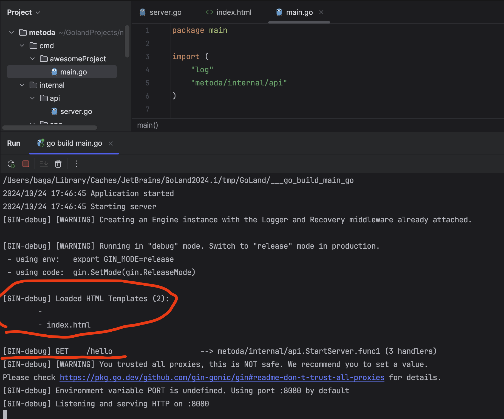

Видим сообщение об успешной загрузке нашего шаблона и информацию о эндпоинте
Теперь в браузере переходим на `localhost:8080/hello` и получаем:
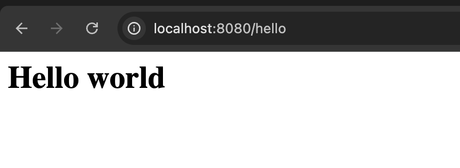

Теперь в наш шаблон добавим переменную (они заключаются в двойные фигурные скобки, и перед названием переменной нужно поставить точку)\
Пусть это будет текущее время:
```html
<html lang="en">
    <h1>
        {{ .time }}
    </h1>
</html>
```
Теперь остается передать нашу переменную в шаблон (это делается в gin.H{}, ранее он был пустым, так как переменных не было)
```go
func StartServer() {
	log.Println("Starting server")

	r := gin.Default()
	// добавляем наш html/шаблон
	r.LoadHTMLGlob("templates/*")

	r.GET("/hello", func(ctx *gin.Context) {
		ctx.HTML(http.StatusOK, "index.html", gin.H{
			"time": time.Now().Format("15:04:05"), // вот наша переменная
			// как вы уже наверное поняли: слева название переменной, по которому мы будем к ней обращаться в шаблоне,
			// а справа ее содержимое
		})
	})

	r.Run() // listen and serve on 0.0.0.0:8080 (for windows "localhost:8080")
	log.Println("Server down")
}

```

Запускаем наш проект и на странице `localhost:8080/hello` получаем такой результат:
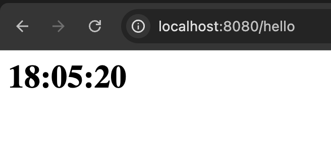

Теперь давайте попробуем добавить еще массив строк в качестве переменной, но функцию для обработчика вынесем отдельно и получим паттерн MVC (коллекция, обработчик и шаблон):
```go
package api

import (
  "github.com/gin-gonic/gin"
  "log"
  "net/http"
  "time"
)

var lines = []string{"first line", "second line", "third line", "fourth line"}

func HelloHandler(ctx *gin.Context) {
  ctx.HTML(http.StatusOK, "index.html", gin.H{
    "time":   time.Now().Format("15:04:05"),
    "massiv": lines,
  })
}

func StartServer() {
  log.Println("Starting server")

  r := gin.Default()
  // добавляем наш html/шаблон
  r.LoadHTMLGlob("templates/*")

  r.GET("/hello", HelloHandler)

  r.Run() // listen and serve on 0.0.0.0:8080 (for windows "localhost:8080")
  log.Println("Server down")
}

```

Запускаем сервер:
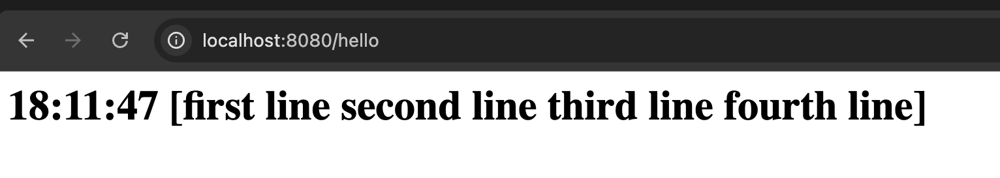

Результат не совсем удовлетворительный. Попробуем теперь использовать range в шаблоне:
```html
<html lang="en">
    <h1>
        {{ .time }}
    </h1>
    {{ range .massiv }}
        <h2>
            {{ . }}
            <!--Через range мы проходимся по каждому индексу, получается попав 
            в massiv[0] мы получаем саму строку, там нет переменной, к которой мы 
            могли бы обратиться через точку, поэтому после точки ничего не пишем и 
            она нам вернет информацию, на которую попала-->
        </h2>
    {{ end }}
</html>
```
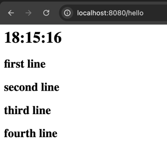

## 6. Приведем в порядок наш код (простой вариант чистой архитектуры)

#### Создаем новые папки в `internal`

- internal/app/repository # пакет отвечающий за обращения к хранилищам данных(БД). В нашем случае мы работаем с коллекциями, а не с БД
- internal/app/handler # пакет, в котором будут храниться обработчики(ручки) для наших запросов:
  тут у нас обрабатываются входящие запросы, валидируются данные и вызываются методы уровня репозитория.

Из уровня хендлера мы имеем доступ к методам репозитория, а вот из репозитория доступа к методам хендлера у нас нет
Не переживайте, дальше все будет куда понятней

Также мы слегка изменим коллекцию, с которой будем работать.\
Теперь вместо просто строк у нас в массиве будут храниться id + строка

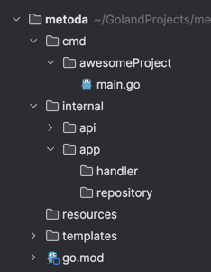

В файле `internal/app/repository/repository.go` создаем объект репозитория и функцию, которая будет возвращать нам новый репозиторий:
```go
package repository

type Repository struct {
}

func NewRepository() (*Repository, error) {
	return &Repository{}, nil
}
```

В файле `internal/app/handler/handler.go` создаем объект хендлера и функцию, которая будет возвращать нам новый хендлер:
```go
package handler

import "metoda/internal/app/repository"

type Handler struct {
  Repository *repository.Repository
}

func NewHandler(r *repository.Repository) *Handler {
  return &Handler{
    Repository: r,
  }
}
```
Как видите мы внедреям в объект хендлера репозиторий, отсюда и появляется доступ к полям репозитория из хендлера.

Теперь давайте попробуем разделить уже имеющийся у нас код на эти уровни:\
`internal/app/repository/repository.go`:
```go
package repository

import (
  "fmt"
)

type Repository struct {
}

func NewRepository() (*Repository, error) {
  return &Repository{}, nil
}

type Order struct { // вот наша новая структура 
  ID    int // поля структур, которые передаются в шаблон
  Title string // ОБЯЗАТЕЛЬНО должны быть написаны с заглавной буквы (то есть публичными)
}

func (r *Repository) GetOrders() ([]Order, error) {
  // имитируем работу с БД. Типа мы выполнили sql запрос и получили эти строки из БД
  orders := []Order{ // массив элементов из наших структур
    {
      ID:    1,
      Title: "first order",
    },
    {
      ID:    2,
      Title: "second order",
    },
    {
      ID:    3,
      Title: "third order",
    },
  }
  // обязательно проверяем ошибки, и если они появились - передаем выше, то есть хендлеру
  // тут я снова искусственно обработаю "ошибку" чисто чтобы показать вам как их передавать выше
  if len(orders) == 0 {
    return nil, fmt.Errorf("массив пустой")
  }

  return orders, nil
}

```
Скачаем logrus чтобы логировать наши ошибки: `go get github.com/sirupsen/logrus`

`internal/app/handler/handler.go`:
```go
package handler

import (
  "github.com/gin-gonic/gin"
  "github.com/sirupsen/logrus"
  "metoda/internal/app/repository"
  "net/http"
  "time"
)

type Handler struct {
  Repository *repository.Repository
}

func NewHandler(r *repository.Repository) *Handler {
  return &Handler{
    Repository: r,
  }
}

func (h *Handler) GetOrders(ctx *gin.Context) {
  orders, err := h.Repository.GetOrders()
  if err != nil {
    logrus.Error(err)
  }

  ctx.HTML(http.StatusOK, "index.html", gin.H{
    "time":   time.Now().Format("15:04:05"),
    "orders": orders,
  })
}

```

Также не забываем откорректировать наш `server.go` файл:
```go
package api

import (
  "github.com/gin-gonic/gin"
  "github.com/sirupsen/logrus"
  "log"
  "metoda/internal/app/handler"
  "metoda/internal/app/repository"
)

func StartServer() {
  log.Println("Starting server")

  repo, err := repository.NewRepository()
  if err != nil {
    logrus.Error("ошибка инициализации репозитория")
  }

  handler := handler.NewHandler(repo)

  r := gin.Default()
  // добавляем наш html/шаблон
  r.LoadHTMLGlob("templates/*")

  r.GET("/hello", handler.GetOrders)

  r.Run() // listen and serve on 0.0.0.0:8080 (for windows "localhost:8080")
  log.Println("Server down")
}
```

И чуть-чуть меняем наш шаблон под новые передаваемые данные:
```html
<html lang="en">
    <h1>
        {{ .time }}
    </h1>
    {{ range .orders }}
        <h2>
            {{ .ID }}. {{ .Title }}
          <!--Как вы можете заметить теперь у нас точки не пустые, так как
          теперь при переходе на orders[0] мы попадаем в элемент, у которого есть id и title.
          Для еще большего понимания можете вернуться к старому шаблону и посмотреть что выведется-->
        </h2>
    {{ end }}
</html>
```
Получаем примерно тот же результат, но зато теперь нам будет куда легче структурировать нашу работу и не запутаться. Также другим людям будет легче читать ваш код и понимать его. И главное - мы сможем переиспользовать общие функции, структуры и данные\
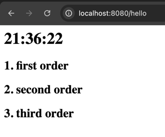

Вот такая структура должна была у вас получиться:\
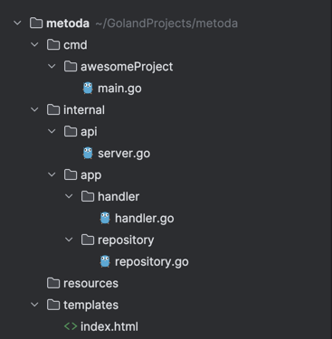

## 7. Гиперссылки - переходим на другие страницы
Откорректируем наш шаблон `templates/index.html`:
```html
<html lang="en">
<header>
    <h1>
        <a href="/hello">Список</a>
<!--Простой хедер, чтобы возвращаться на главную страницу-->
    </h1>
</header>
    <h1>
        {{ .time }}
    </h1>
    <ul>
        {{ range .orders }}
        <li>
            <a href="/order/{{ .ID }}"> {{ .Title }} </a>
        </li>
        {{ end }}
    </ul>
</html>
```
Теперь у нас не просто строки, а гиперссылки, при нажатии на которые нас будет перенаправлять на
`localhost:8080/order/id_заказа_на_который_нажали`\
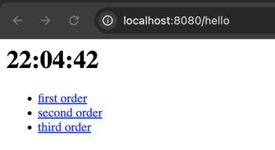

Но при нажатии на ссылку мы получаем следующее:
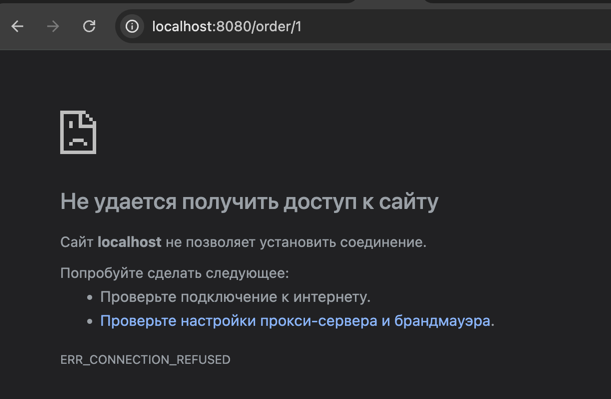

Почему же это? Потому что мы не сделали обработчик для данного url. У нас есть обработчик для `/hello`, но не для `/order/:id`\
Создадим новую страницу (новый шаблон), где будет отображать информацию о заказе `templates/order.html`:
```html
<html lang="en">
<header>
    <h1>
        <a href="/hello">Список</a>
        <!--Простой хедер, чтобы возвращаться на главную страницу-->
    </h1>
</header>
    <h1>Информация о заказе №{{ order.ID }}</h1>
    <h2>Заголовок: {{ order.Title }}</h2>
</html> 
```
Действуем по отработанной схеме: делаем метод репозитория, потом метод хендлера (функция для обработчика) и добавим новый обработчик:
`internal/app/repository/repository.go`:
```go
func (r *Repository) GetOrder(id int) (Order, error) {
	// тут у вас будет логика получения нужной услуги, тоже наверное через цикл в первой лабе, и через запрос к БД начиная со второй 
	orders, err := r.GetOrders()
	if err != nil {
		return Order{}, err // тут у нас уже есть кастомная ошибка из нашего метода, поэтому мы можем просто вернуть ее
	}

	for _, order := range orders {
		if order.ID == id {
			return order, nil // если нашли, то просто возвращаем найденный заказ (услугу) без ошибок
		}
	}
	return Order{}, fmt.Errorf("заказ не найден") // тут нужна кастомная ошибка, чтобы понимать на каком этапе возникла ошибка и что произошло
}
```
`internal/app/handler/handler.go`:
```go
func (h *Handler) GetOrder(ctx *gin.Context) {
	idStr := ctx.Param("id") // получаем id заказа из урла (то есть из /order/:id)
	// через двоеточие мы указываем параметры, которые потом сможем считать через функцию выше
	id, err := strconv.Atoi(idStr) // так как функция выше возвращает нам строку, нужно ее преобразовать в int
	if err != nil {
		logrus.Error(err)
	}

	order, err := h.Repository.GetOrder(id)
	if err != nil {
		logrus.Error(err)
	}

	ctx.HTML(http.StatusOK, "order.html", gin.H{
		"order": order,
	})
}
```
`internal/api/server.go`:
```go
func StartServer() {
	log.Println("Starting server")

	repo, err := repository.NewRepository()
	if err != nil {
		logrus.Error("ошибка инициализации репозитория")
	}

	handler := handler.NewHandler(repo)

	r := gin.Default()
	// добавляем наш html/шаблон
	r.LoadHTMLGlob("templates/*")

	r.GET("/hello", handler.GetOrders)
	r.GET("/order/:id", handler.GetOrder) // вот наш новый обработчик

	r.Run() // listen and serve on 0.0.0.0:8080 (for windows "localhost:8080")
	log.Println("Server down")
}
```
Запускаем наше приложение и замечаем, что загрузился новый шаблон и появился новый доступный url:
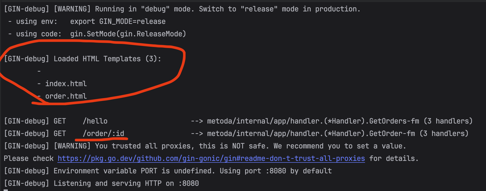

А так выглядят наши страницы:
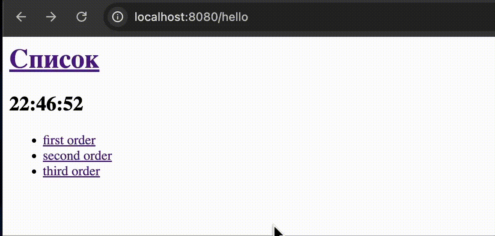

## Поиск
Добавляем поле для поиска и кнопку "найти" на нашу страницу:
`templates/index.html`:
```html
<html lang="en">
<header>
    <h1>
        <a href="/hello">Список</a>
    </h1>
</header>
<form action="/hello" method="GET">
    <input type="text" name="query" placeholder="Введите запрос" value="{{ .query }}">
    <!-- value="{{ .query }}"  нужно для того, чтобы из обработчика передавать 
    введенный запрос обратно на страницу. Тем самым введенный текст в поле поиска будет сохраняться-->
    <button type="submit">Найти</button>
</form>
<h2>
    {{ .time }}
</h2>
<ul>
    {{ range .orders }}
    <li>
        <a href="/order/{{ .ID }}"> {{ .Title }} </a>
    </li>
    {{ end }}
</ul>
</html>
```
В репозитории нам нужен новый метод для поиска нужных нам заказов:\
`internal/app/repository/repository.go`:
```go
func (r *Repository) GetOrdersByTitle(title string) ([]Order, error) {
	orders, err := r.GetOrders()
	if err != nil {
		return []Order{}, err
	}

	var result []Order
	for _, order := range orders {
		if strings.Contains(strings.ToLower(order.Title), strings.ToLower(title)) {
			result = append(result, order)
		}
	}

	return result, nil
}
```
Теперь немного модифицируем наш хендлер:\
`internal/app/handler/handler.go`:
```go
func (h *Handler) GetOrders(ctx *gin.Context) {
	var orders []repository.Order
	var err error

	searchQuery := ctx.Query("query") // получаем значение из поля поиска
	if searchQuery == "" {            // если поле поиска пусто, то просто получаем из репозитория все записи
		orders, err = h.Repository.GetOrders()
		if err != nil {
			logrus.Error(err)
		}
	} else {
		orders, err = h.Repository.GetOrdersByTitle(searchQuery) // в ином случае ищем заказ по заголовку
		if err != nil {
			logrus.Error(err)
		}
	}

	ctx.HTML(http.StatusOK, "index.html", gin.H{
		"time":   time.Now().Format("15:04:05"),
		"orders": orders,
		"query":  searchQuery, // передаем введенный запрос обратно на страницу
		// в ином случае оно будет очищаться при нажатии на кнопку
	})
}
```
И вот что у нас получилось:


## Раздача статики
Что такое статические файлы?

Статические это те которые отдаются в неизменном виде, которые серверу не нужно обрабатывать. Например JS, CSS, jpg, png, html, txt и т. д. Динамические файлы это те которые сервер обрабатывает: php, pl, cgi и т.д.

Создадим папку resources в корне нашего проекта `resources/`

Создадим там папку `img` и поместим туда какую-либо картинку. В нашем примере - image.jpg . Добавим код, чтобы раздать всю статику в этой папке, согласно документации gin-gonic, получим следующее содержание файла server.go:

```go
package api

import (
	"github.com/gin-gonic/gin"
	"github.com/sirupsen/logrus"
	"log"
	"metoda/internal/app/handler"
	"metoda/internal/app/repository"
)

func StartServer() {
	log.Println("Starting server")

	repo, err := repository.NewRepository()
	if err != nil {
		logrus.Error("ошибка инициализации репозитория")
	}

	handler := handler.NewHandler(repo)

	r := gin.Default()
	// добавляем наш html/шаблон
	r.LoadHTMLGlob("templates/*")
	r.Static("/static", "./resources")
	// слева название папки, в которую выгрузится наша статика
	// справа путь к папке, в которой лежит статика

	r.GET("/hello", handler.GetOrders)
	r.GET("/order/:id", handler.GetOrder)

	r.Run() // listen and serve on 0.0.0.0:8080 (for windows "localhost:8080")
	log.Println("Server down")
}
```
На обеих страницах в хедере заменяем надпись "Список" на картинку. Сейчас только пример, а так я рекомендую использовать svg, ведь его можно вставить прямо в файл.
```html
<header>
    <h1>
        <a href="/hello"></a>
    </h1>
</header>
```
Пример использования svg (но мы будем использовать png далее):
```html
<header>
    <h1>
        <a href="/hello">
            <svg width="50px" height="50px" viewBox="0 0 24 24" fill="none" xmlns="http://www.w3.org/2000/svg">
                <path opacity="0.5" d="M2 12.2039C2 9.91549 2 8.77128 2.5192 7.82274C3.0384 6.87421 3.98695 6.28551 5.88403 5.10813L7.88403 3.86687C9.88939 2.62229 10.8921 2 12 2C13.1079 2 14.1106 2.62229 16.116 3.86687L18.116 5.10812C20.0131 6.28551 20.9616 6.87421 21.4808 7.82274C22 8.77128 22 9.91549 22 12.2039V13.725C22 17.6258 22 19.5763 20.8284 20.7881C19.6569 22 17.7712 22 14 22H10C6.22876 22 4.34315 22 3.17157 20.7881C2 19.5763 2 17.6258 2 13.725V12.2039Z" stroke="#1C274C" stroke-width="1.5"/>
                <path d="M12 15L12 18" stroke="#1C274C" stroke-width="1.5" stroke-linecap="round"/>
            </svg>
        </a>
    </h1>
</header>
```
Если вы запустите сервер, то увидите, что картинка растянулась на весь экран. Чтобы это исправить добавим простейшие стили на наши страницы. Создадим папку `resources/styles` и внутри два файла `index_style.css` и `order_style.css`.\
`index_style.css`:
```css
header img { /*задаем размер картинки*/
    width: 50px;
    height: 50px;
    cursor: pointer;
}


ul li a {
    text-decoration: none;
    color: #333;
    font-size: 18px;
}

ul li a:hover {
    text-decoration: underline;
}

h2 {
    color: #333;
    font-size: 18px;
    margin-top: 20px;
}
```
`order_style.css`:
```css
header img { /*задаем размер картинки*/
    width: 50px;
    height: 50px;
    cursor: pointer;
}

h1 {
    color: #333;
    font-size: 24px;
}

h2 {
    color: #333;
    font-size: 18px;
}
```
Теперь нужно подключить наши стили к файлам html:
`index.html`:
```html
<html lang="en">
<head>
    <title>Metoda</title>
    <link rel="stylesheet" href="/static/styles/index_style.css">
</head>
<header>
    <h1>
        <a href="/hello"></a>
    </h1>
</header>
<form action="/hello" method="GET">
    <input type="text" name="query" placeholder="Введите запрос" value="{{ .query }}">
    <!-- value="{{ .query }}"  нужно для того, чтобы из обработчика передавать
    введенный запрос обратно на страницу. Тем самым введенный текст в поле поиска будет сохраняться-->
    <button type="submit">Найти</button>
</form>
    <h2>
        {{ .time }}
    </h2>
    <ul>
        {{ range .orders }}
        <li>
            <a href="/order/{{ .ID }}"> {{ .Title }} </a>
        </li>
        {{ end }}
    </ul>
</html>
```
`order.html`:
```html
<html lang="en">
<head>
    <title>Metoda</title>
    <link rel="stylesheet" href="/static/styles/order_style.css">
</head>
<header>
    <h1>
        <a href="/hello"></a>
    </h1>
</header>
    <h1>Информация о заказе №{{ .order.ID }}</h1>
    <h2>Заголовок: {{ .order.Title }}</h2>
</html>
```

Запускаем сервер и видим, что наша статика успешно загружена:
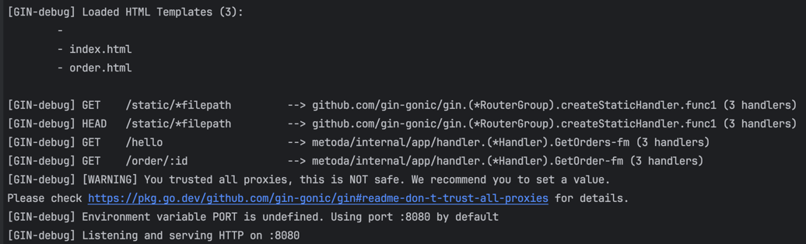


Вот конечная структура нашего проекта:

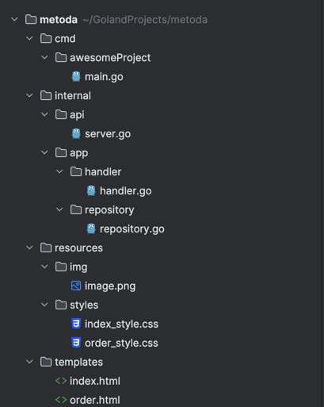

## FAQ

#### Где изучить больше по go?
Есть прекрасный "Tour by go" от разработчиков языка: https://go.dev/tour/welcome/1