# Методические указания по выполнению лабораторной работы №1

Для выполнения лабораторной работы потребуется [Goland](https://www.jetbrains.com/goland/download/) или [VS Code](https://code.visualstudio.com). Также необходимо изучить первые основы golang перед написанием проекта, подробнее в online-компиляторе [A Tour of Go](https://go.dev/tour/welcome/1)

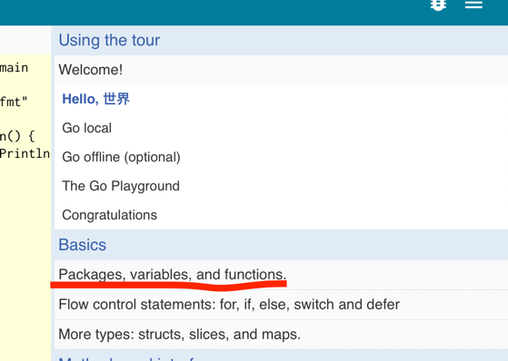

## Создание проекта
`File -> New -> Project...`\
В меню выбираем создание нового проекта
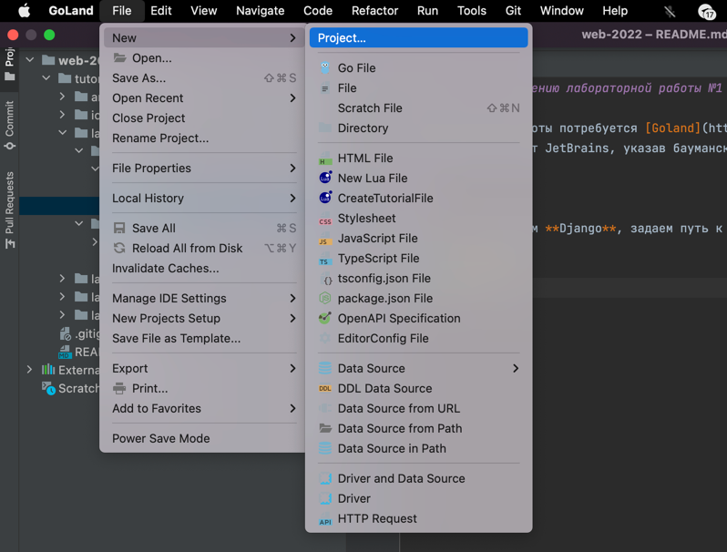
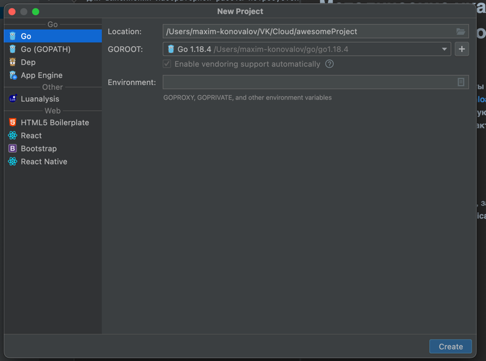

GOROOT — это переменная, указывающая, где лежит,вся бинарная сборка Go и исходные коды. Устанавливать эту переменную руками нужно только в тех случаях, если вы ставите Go под Windows не с помощью MSI-инсталлера, а из zip-архива. Или если вы хотите держать несколько версий Go, каждая в своей директории.
Возможно у вас еще не будет установлена необходимая версия, тогда следуем низлежащей инструкции.

Нажимаем на "+", Download, попадаем в такое окно. Выбираем версию golang, которую вы хотите установить, советуем устанавливать релиз 1.20 и выше.
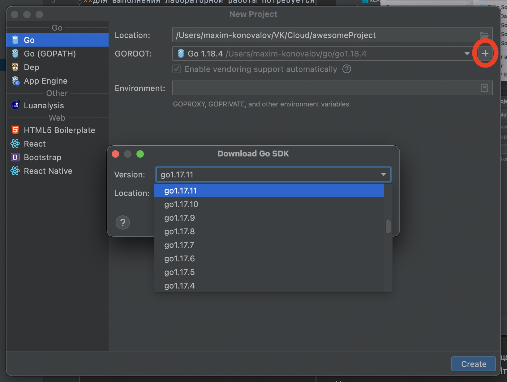
Нажимаем "Create" и проверяем в консоли работоспособность нашей новой установленной версии из терминала.

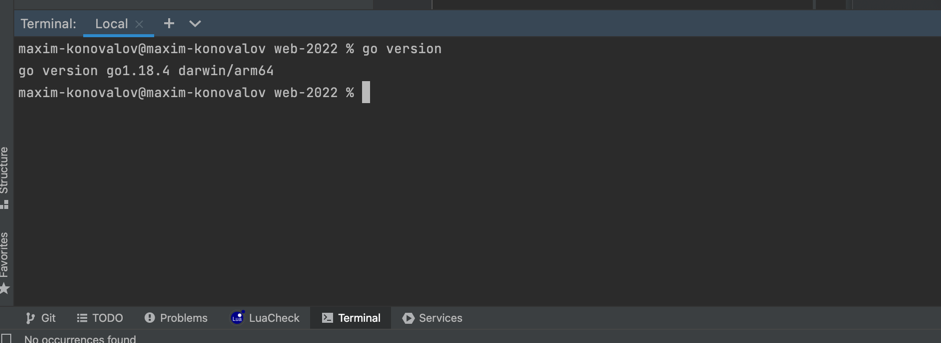
В нашем проекте должен появиться файл go.mod в котором указано название вашего проекта в модуле и версия golang
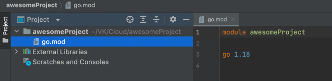

## Настройка окружения для VS Code
Если по каким-то причинам не получается работать в среде GoLand, тогда есть возможность разрабатывать на Go в VSCode.
Для этого первоначально рекомендуется установить данное расширение, которое включает в себя набор необходимых инструментов.


После этого для создания проекта создайте папку на своем компьютере и перейдите в нее в VSCode.


Далее в терминале выполните команду ```go mod init <Название проекта>```. После этого в папке должен появиться файл go.mod.


Добавим файл main.go с кодом, который выводит сообщение Привет в консоль. Запускать можно двумя способами: через терминал (рекомендуется) и через VSCode.


Запуск через терминал.\


Запуск через VSCode. В левом меню выбираем Run & Debug и нажимаем запуск. Возможно, в выпадающем меню потребуется выбрать язык для запуска кода - необходимо выбрать Go.


## Структура проекта
#### Предисловие
"Зачем общая структура? Где хочу - там и положу файл!" - к сожалению это утверждение ошибочно, вы - разработчик, командный игрок и если все будут придерживаться единой структуры, вашим коллегам будет проще читать ваш код. 
В комьюнити golang есть негласное соглашение о том как лучше строить структуру своего проекта,
ознакомиться с ней можно по ссылке https://github.com/golang-standards/project-layout.
#### Содержание
Создадим скелет из папок. Нажатием правой кнопочки мыши переходим к созданию папок. 
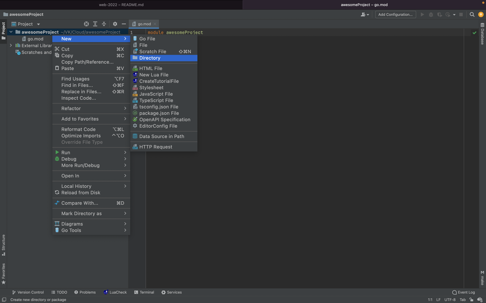
Создаем следующую структуру папок и создадим 2 файла:
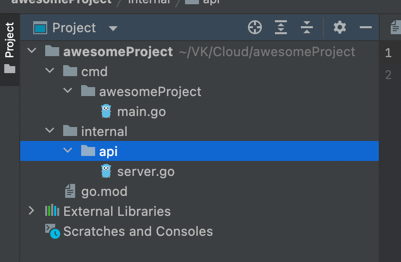
Отступление о папках:

```cmd/``` - папка в которой хранятся все возможные main файлы.
Собрав их у вас получится исполняемый файл(он же бинарник)
В нашем случае будет исполняться только основная программа(сервис), который называется так же как и проект. 

```internal/``` - как уже понятно по названию там будут все внутренности приложения. Пока упростим себе понимание шаблона проекта на го и просто сделаем папку api

## Первая программа
1. Заходим в файл main.go 
2. Переименовываем имя пакета на main
3. Пишем функцию main
4. С помощью пакета fmt выведем приветсвие самому себе! Писать import при использовании внутренних пакетов самому не обязательно, обычно в таком случае за вас это сделает ваша IDE

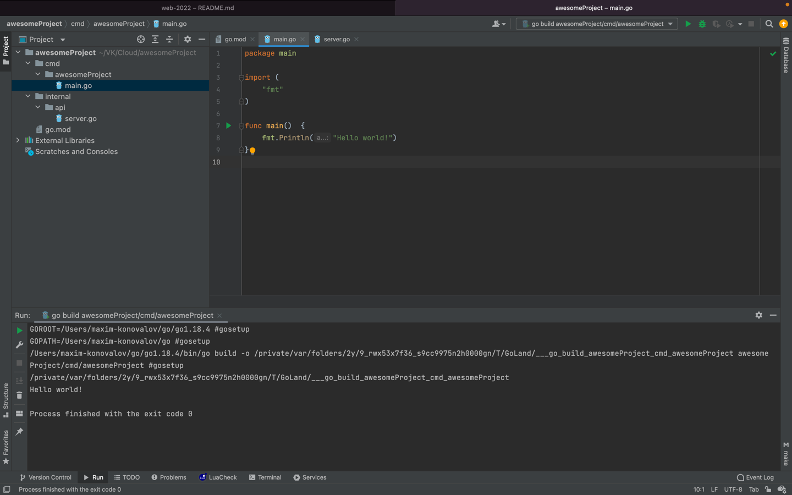

5. Нажимем запустить программу
6. В консоли появилось "Hello world!"

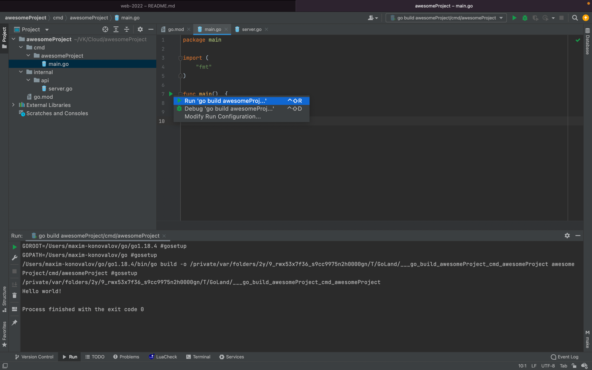
## Первый веб сервис
Рекомендации к изучению:

- Что такое HTTP: https://habr.com/ru/post/215117
- Что такое веб сервис: https://habr.com/ru/post/46374
- Используемый фреймворк: https://github.com/gin-gonic/gin

Начнем с написания нашего веб сервиса:

О файле main: файл main.go должен содержать минимум логики.

Как выводить в консоль? Мы будем использовать логер(библиотека, которая выводит сообщения в консоль с дополнительной метаинформацией: когда это произошло? в каком месте кода? какой тип сообщения - ошибка, информативный лог, лог предупреждения)

Напишем функцию, которая стартует наш сервер, пока она только логирует что сервер поднялся
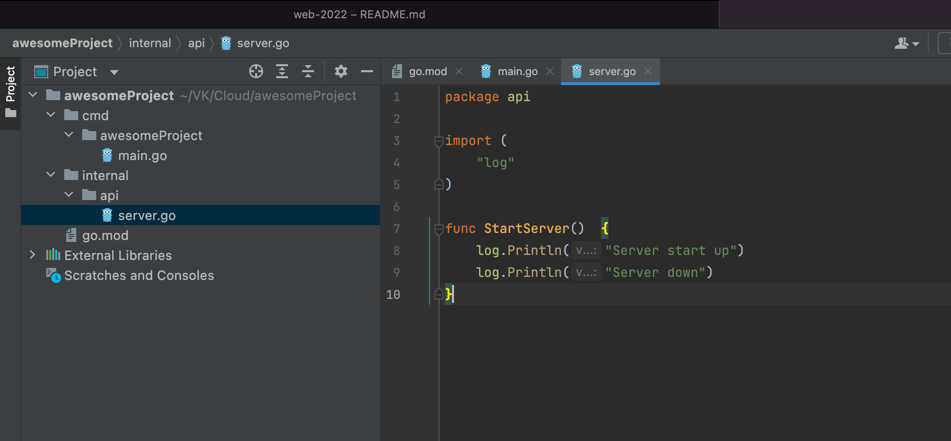
Напишем логику для main.go
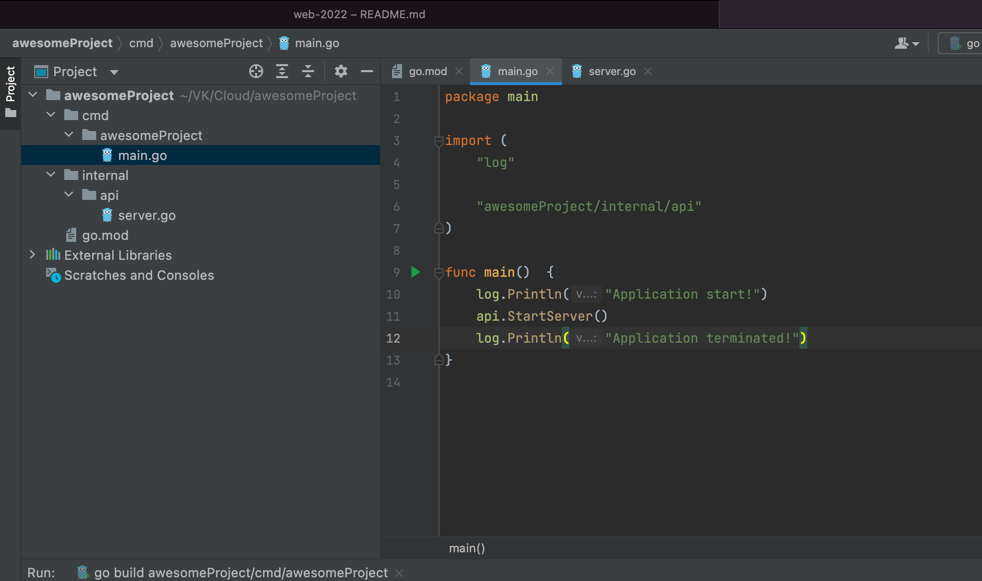
Попробуйте запустить и убедитесь что все логи отобразились верно
```shell
2022/08/31 01:37:51 Application start!
2022/08/31 01:37:51 Server start up
2022/08/31 01:37:51 Server down
2022/08/31 01:37:51 Application terminated!
```
Установим веб фреймвор gin-gonic. Для этого откроем терминал и введем в него(замечание: вводить нужно только то что находится после символа $ на той же строке, все остальное - последующий консольный вывод):
```shell
$ go get github.com/gin-gonic/gin 
go: downloading github.com/gin-gonic/gin v1.8.1
go: downloading github.com/goccy/go-json v0.9.7
go: downloading github.com/go-playground/validator/v10 v10.10.0
go: downloading github.com/ugorji/go/codec v1.2.7
go: downloading golang.org/x/sys v0.0.0-20210806184541-e5e7981a1069
go: added github.com/gin-contrib/sse v0.1.0
go: added github.com/gin-gonic/gin v1.8.1
go: added github.com/go-playground/locales v0.14.0
go: added github.com/go-playground/universal-translator v0.18.0
go: added github.com/go-playground/validator/v10 v10.10.0
go: added github.com/goccy/go-json v0.9.7
go: added github.com/json-iterator/go v1.1.12
go: added github.com/leodido/go-urn v1.2.1
go: added github.com/mattn/go-isatty v0.0.14
go: added github.com/modern-go/concurrent v0.0.0-20180228061459-e0a39a4cb421
go: added github.com/modern-go/reflect2 v1.0.2
go: added github.com/pelletier/go-toml/v2 v2.0.1
go: added github.com/ugorji/go/codec v1.2.7
go: added golang.org/x/crypto v0.0.0-20210711020723-a769d52b0f97
go: added golang.org/x/net v0.0.0-20210226172049-e18ecbb05110
go: added golang.org/x/sys v0.0.0-20210806184541-e5e7981a1069
go: added golang.org/x/text v0.3.6
go: added google.golang.org/protobuf v1.28.0
go: added gopkg.in/yaml.v2 v2.4.0
```
Это значит наш пакет и все его зависимости подтянулись и уже появились в файле ```go.mod```. Также вы можете заметить что в проекте появился файл ```go.sum``` - это вспомогательный файл чтобы зависимости скачивались быстрее, его удалять не стоит, но если такое произошло введите в консоли ```$ go mod tidy``` и он появится вновь.

Опишем наш сервер до конца:
```go
package api

import (
	"log"
	"net/http"

	"github.com/gin-gonic/gin"
)

func StartServer()  {
	log.Println("Server start up")

	r := gin.Default()
	r.GET("/ping", func(c *gin.Context) {
		c.JSON(http.StatusOK, gin.H{
			"message": "pong",
		})
	})
	r.Run() // listen and serve on 0.0.0.0:8080 (for windows "localhost:8080")
	
	log.Println("Server down")
}
```
Пробуем запустить. Получаем в консоли следующее:
```shell
2022/08/31 01:45:23 Application start!
2022/08/31 01:45:23 Server start up
[GIN-debug] [WARNING] Creating an Engine instance with the Logger and Recovery middleware already attached.

[GIN-debug] [WARNING] Running in "debug" mode. Switch to "release" mode in production.
 - using env:   export GIN_MODE=release
 - using code:  gin.SetMode(gin.ReleaseMode)

[GIN-debug] GET    /ping                     --> awesomeProject/internal/api.StartServer.func1 (3 handlers)
[GIN-debug] [WARNING] You trusted all proxies, this is NOT safe. We recommend you to set a value.
Please check https://pkg.go.dev/github.com/gin-gonic/gin#readme-don-t-trust-all-proxies for details.
[GIN-debug] Environment variable PORT is undefined. Using port :8080 by default
[GIN-debug] Listening and serving HTTP on :8080
```
Перейдем по адресу http://127.0.0.1:8080/ping (у некоторых может быть http://0.0.0.0:8080/ping), в ответе должно быть следующее
```shell
{"message":"pong"}
```
Заметим что в коносоли уже началось информативное отображание того что делают с вашим веб сервисом(там есть время за которое сервер смог сделать ответ, время когда запрос был совершен,адрес и статус ответа):
```shell
[GIN] 2022/08/31 - 01:46:38 | 200 |    1.892917ms |       127.0.0.1 | GET      "/ping"
[GIN] 2022/08/31 - 01:48:05 | 200 |     120.208µs |       127.0.0.1 | GET      "/ping"
```
## Работа с шаблонами
- Документация пакета стандартного шаблонизатора: https://pkg.go.dev/text/template
- Полезная статья, которой мы и будем следовать: https://golangify.com/template-engine

Создадим папку templates в корне проекта ```./templates``` и положим туда наш первый шаблон.
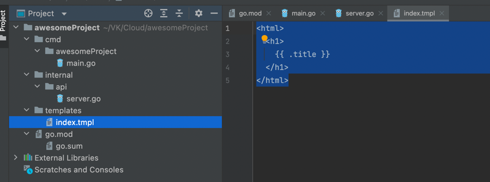

Можем заметить, что внутри нашего шаблона есть переменная tittle. Внутрь сервера добавим считывание файлов-шаблонов с помощью метода роутера(```r.LoadHTMLGlob("templates/*")```),  новый ендпоинт(так называется путь веб сервера по которому он что-то отдает) и переменную шаблона title. Теперь наш файл server.go выглядит следующим образом:
```go
package api

import (
	"log"
	"net/http"

	"github.com/gin-gonic/gin"
)

func StartServer()  {
	log.Println("Server start up")

	r := gin.Default()

	r.GET("/ping", func(c *gin.Context) {
		c.JSON(http.StatusOK, gin.H{
			"message": "pong",
		})
	})

	r.LoadHTMLGlob("templates/*")

	r.GET("/home", func(c *gin.Context) {
		c.HTML(http.StatusOK, "index.tmpl", gin.H{
			"title": "Main website",
		})
	})

	r.Run() // listen and serve on 0.0.0.0:8080 (for windows "localhost:8080")

	log.Println("Server down")
}
```
Зайдем на путь, который мы назначили для нашего шаблона и получим ответ:
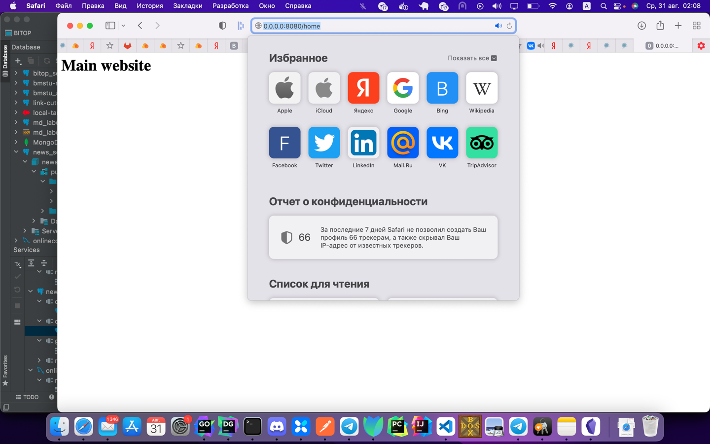

## Раздача статики
Что такое статические файлы?

Статические это те которые отдаются в неизменном виде, которые серверу не нужно обрабатывать. Например JS, CSS, jpg, png, html, txt и т. д. Динамические файлы это те которые сервер обрабатывает: php, pl, cgi и т. д. 2.

Создадим папку resources в корне нашего проекта `resources/`

Поместим туда какую-либо картинку. В нашем примере - image.jpg . Добавим код, чтобы раздать всю статику в этой папке, согласно документации gin-gonic, получим следующее содержание файла server.go:

```go
package api

import (
	"log"
	"net/http"

	"github.com/gin-gonic/gin"
)

func StartServer()  {
	log.Println("Server start up")

	r := gin.Default()

	r.GET("/ping", func(c *gin.Context) {
		c.JSON(http.StatusOK, gin.H{
			"message": "pong",
		})
	})

	r.LoadHTMLGlob("templates/*")

	r.GET("/home", func(c *gin.Context) {
		c.HTML(http.StatusOK, "index.tmpl", gin.H{
			"title": "Main website",
		})
	})

	r.Static("/image", "./resources")


	r.Run() // listen and serve on 0.0.0.0:8080 (for windows "localhost:8080")

	log.Println("Server down")
}
```

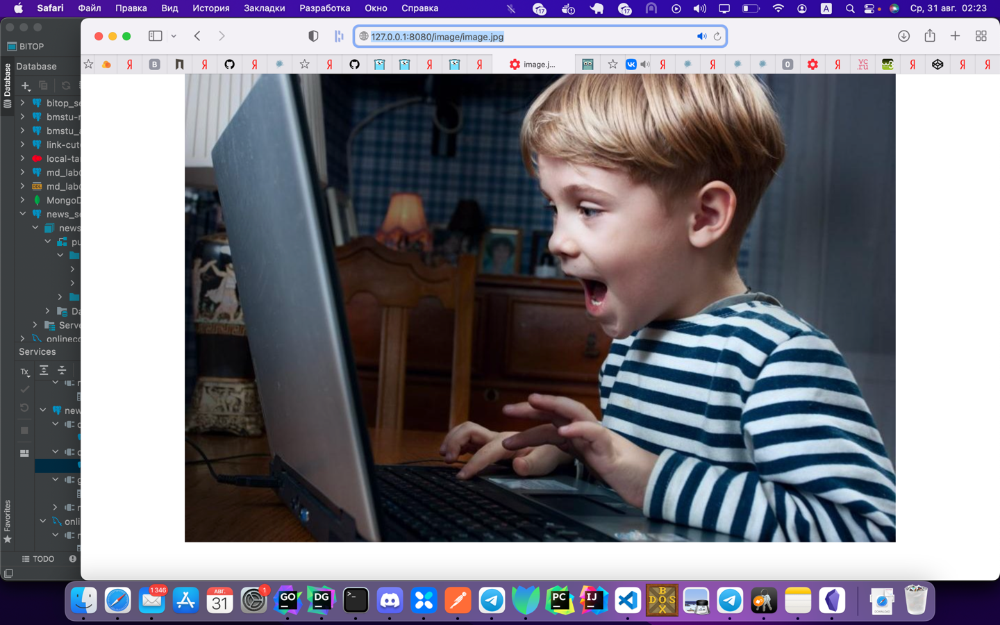

## Самостоятельное задание:
Создайте еще один эндпоинт, который будет отдавать файл шаблона, в котором будет список ваших желанных подарков на день рождения. Для этого изучите библиотеку templates и найдите как обрабатывать ей иттерацию по списку, чтобы налету генерировать то, что отдастся пользователю в результате.

## FAQ

#### Где изучить больше по go?
Есть прекрасный "Tour by go" от разработчиков языка: https://go.dev/tour/welcome/1

#### Я хочу в IT – Как?
https://vk.com/@seversiter_1-ya-hochu-v-it-kak
