# Методические указания №1 NestJS (TS, Nest, Handlebars)

Для выполнения лабораторной работы потребуется установленный [**Node.js (LTS)**](https://nodejs.org/en/download), пакетный менеджер **npm** (или **yarn**) и редактор кода [**Visual Studio Code**](https://code.visualstudio.com/)
## План работы
1. Создание проекта локально
   - Установка NestJS CLI
   - Структура проекта
   - Запуск приложения
2. Как работать с Controller и Module
3. Шаблонизация в NestJS (Handlebars)
   - Установка зависимостей
   - Настройка шаблонов
   - Рендеринг шаблона из контроллера
   - Переменные в шаблоне
   - Циклы и условия
4. Наследование шаблонов в Handlebars (NestJS)
5. Подключение статических файлов в NestJS (CSS, изображения, JS)
6. Получение данных из формы (Input, POST-запрос)
7. FAQ

# **1. Создание проекта локально**

---

Рекомендуемая версия: Node.js 18 LTS
Проверить наличие Node.js и npm можно командами:

`terminal`

```bash
node -v
npm -v
```

## Установка NestJS CLI

---

**NestJS CLI** — это официальный инструмент командной строки, который позволяет быстро генерировать модули, контроллеры, сервисы и другие элементы проекта, автоматически подключая их в структуру приложения.

Для установки Nest CLI используется команда `npm install -g @nestjs/cli` .
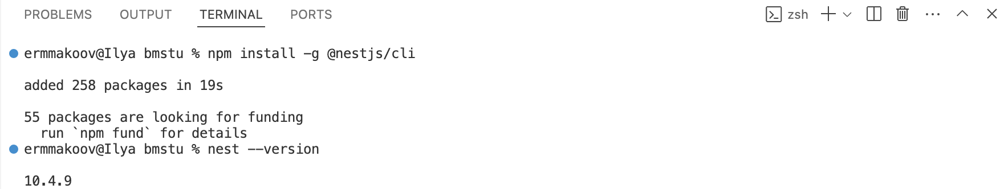

Создаем проект с помощью NestJS комндой - `nest new <your_project_name>` .

NestJS использует **Node-пакеты**, поэтому для работы проекта после выполнения команды необходимо выбрать нужный **пакетный менеджер**. Существуют три основных варианта

| Менеджер | Описание | Команда установки пакетов |
| --- | --- | --- |
| **npm** *(по умолчанию, идёт вместе с Node.js)* | Стандартный менеджер, используется по умолчанию во всех проектах | `npm install` |
| **yarn** | Более быстрый аналог npm, кэширует пакеты агрессивнее | `yarn install` |
| **pnpm** | Экономит место — хранит пакеты один раз и делает «жёсткие ссылки» в проекты | `pnpm install` |

В данной лабораторной работе будем использовать **npm**.

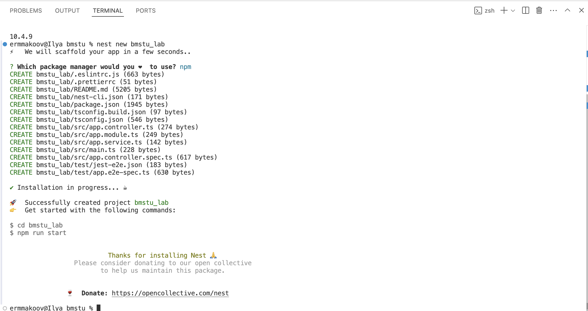

## **Структура проекта**

---

В папке проекта `bmstu_lab`:

`package.json` - список зависимостей проекта и скриптов для запуска.

`tsconfig.json` - настройки TypeScript для компиляции проекта.

`nest-cli.json` - конфигурация Nest CLI, определяет структуру проекта и автогенерацию файлов. 

В пакете `src`:

`main.ts` - обработчики приложения.

`app.module.ts` - главный модуль приложения, регистрирует остальные модули.

`app.controller.ts` - контроллер, отвечает за маршруты HTTP-запросов.

`app.service.ts` - сервис с логикой обработки данных.


> Позже будет добавлена папка `views` — **аналог `templates`** в Django, где будут размещаться Handlebars-шаблоны (`.hbs`файлы).
> 

## **Запуск приложения**

---

Запускаем проект командой - `npm run start` или в режиме разработки с автообновлением: `npm run start:dev`

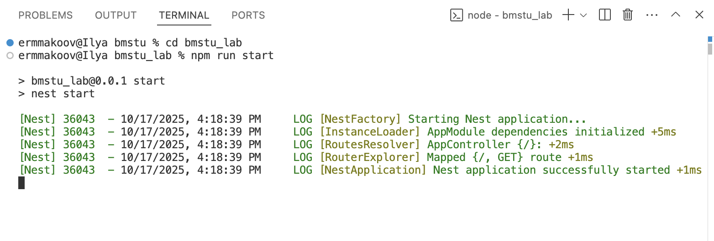

> По умолчанию сервер запускается на [**http://localhost:3000**](http://localhost:3000/)
> 
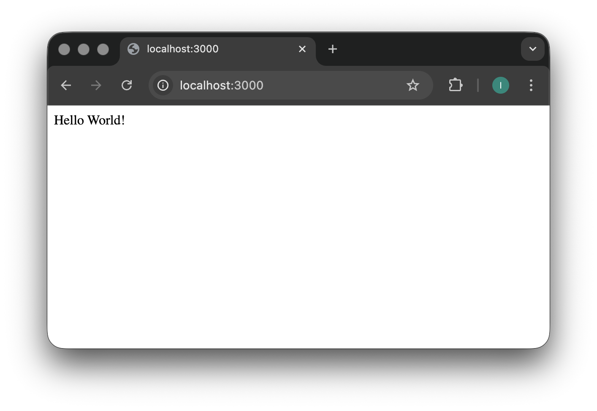

# **2. Как работать с Controller и Module**

В NestJS функциональность проекта делится на независимые области (feature-модули). Для каждой области сразу создаются **три элемента:**

- **Module** — регистрирует контроллер и сервис (аналог `apps.py` в Django).
- **Controller** — принимает HTTP-запросы и определяет маршруты (аналог `views.py` + `urls.py`).
- **Service** — содержит бизнес-логику (аналог `logic / helpers` в Django, то, что обычно прячут из view).

Например, чтобы создать контроллеры, модули и сервисы `bmstu_lab`, используется команды: 

`nest g controller bmstu_lab` - создание контроллера

`nest g module bmstu_lab` - создание модуля

`nest g service bmstu_lab` - создание сервиса


После выполнения команд Nest создаст папку `bmstu_lab`:

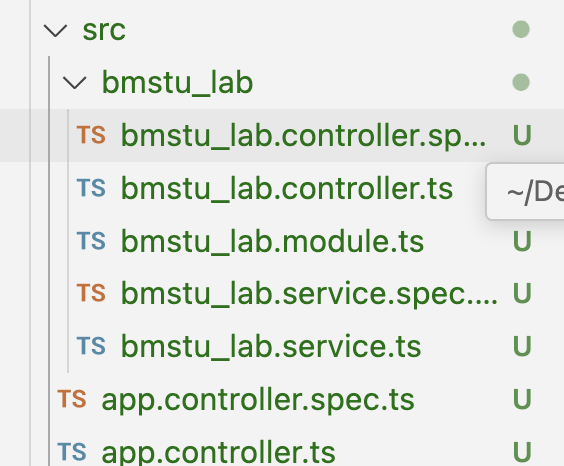

После того, как мы создали собственный функциональный модуль `bmstu_lab`, именно он становится основной рабочей областью приложения.
В нём определяются свои контроллеры, сервисы и маршруты, а базовые файлы `app.controller.ts` и `app.service.ts` больше не выполняют никакой роли — приложение может функционировать полностью через собственный модуль. Поэтому можем эти файлы удалить

Пример контроллера

```tsx
import { Controller,Get } from '@nestjs/common';

@Controller('bmstu-hello') //Путь по которому переходит пользователь
export class BmstuLabController {
    @Get() // Обработка GET /bmstu-hello
    getHello(): string {
    return 'Hello BMSTU Students!';
  }
}
```

Пример модуля

```tsx
import { Module } from '@nestjs/common';
import { BmstuLabService } from './bmstu_lab.service';
import { BmstuLabController } from './bmstu_lab.controller';

@Module({
  controllers: [BmstuLabController], // Здесь указываем контроллеры, которые будут частью модуля
  providers: [BmstuLabService] // Здесь указываем сервисы (провайдеры), доступные в модуле
})
export class BmstuLabModule {}
```

В приведённом выше примере сервис подключён, но не используется — это сделано для простоты демонстрации структуры NestJS. В следующих разделах (например, при работе с базой данных через Sequelize) сервис будет задействован полностью, и контроллеры будут обращаться к методам сервиса для получения данных.

Теперь у нас доступна страница по адресу [`http://localhost:3000/bmstu-hello`](http://localhost:3000/bmstu-hello) вы должны увидеть
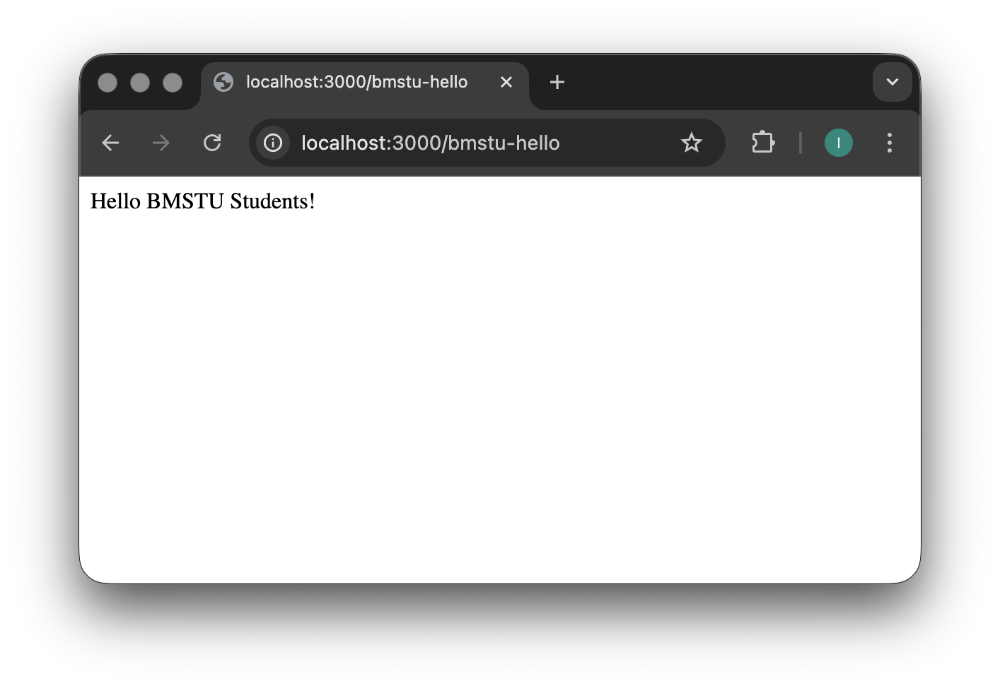

Таким образом, код **hello** bmstu students будет вызван при обращении к серверу по **/bmstu-hello**

# 3. Шаблонизация в NestJS (Handlebars)

В NestJS шаблонизация работает через **View Engine**. Мы будем использовать Handlebars (`.hbs` файлы)
В корне проекта (где находится `package.json`) устанавливаем необходимые пакеты:

## Установка зависимостей

Для работы с шаблонами нужно установить движок Handlebars и интеграцию с Express (так как NestJS основан на ExpressJS):

`npm install @nestjs/platform-express hbs`
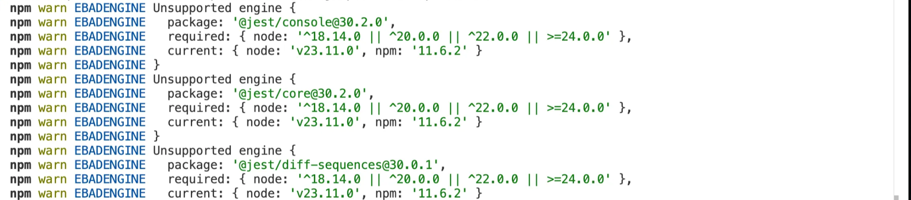

После установки появятся зависимости в package.json, а движок будет доступен для подключения в основном файле приложения.

## Настройка шаблонов

В файле `src/main.ts` необходимо указать, где находятся шаблоны и какой движок используется:

```tsx
import { NestFactory } from '@nestjs/core';
import { AppModule } from './app.module';
import { NestExpressApplication } from '@nestjs/platform-express';
import { join } from 'path';
import * as hbs from 'hbs';

async function bootstrap() {
  const app = await NestFactory.create<NestExpressApplication>(AppModule);

  // Подключаем Handlebars
  app.setBaseViewsDir(join(__dirname, '..', 'views')); //Указываем директорию с шаблонами
  app.setViewEngine('hbs'); //Устанавливаем Handlebars как шаблонизатор

  await app.listen(process.env.PORT ?? 3000);
}
bootstrap();
```

## Создание шаблонов

В корне проекта создаём папку `views`, в ней создаём файл main`main.hbs`:

`views/main.hbs`

```html
<!doctype html>
<html lang="en" class="h-100">
<head>
  <meta charset="utf-8">
    <title>BMSTU</title>
</head>
<body>
    <h1>Hello BMSTU Students!</h1>
    <p>Welcome to NestJS + Handlebars example.</p>
</body>
</html>
```

## Рендеринг шаблона из контроллера

В NestJS есть декоратор `@Render()`, который упрощает работу с шаблонами.
Он позволяет вернуть HTML-страницу без ручного обращения к объекту Response.

Пример контроллера:

```tsx
import { Controller, Get, Render } from '@nestjs/common';

@Controller('bmstu-hello')
export class BmstuLabController {
  @Get()
  @Render('main') // Рендерит views/main.hbs
  getHello() {
    return { message: 'BMSTU Students!' }; // можно передать данные в шаблон
  }
}
```

## **Переменные в шаблоне**

Переменные в Handlebars записываются в виде `{{ variable }}`.

При рендеринге NestJS подставит в это место значение, переданное из контроллера.

Пример:

`main.hbs`

```html
<!doctype html>
<html lang="en">
<head>
  <meta charset="utf-8">
  <title>BMSTU</title>
</head>
<body>
  <h1>Hello BMSTU students!</h1>
  <h2>Today is {{ currentDate }} </h2>
</body>
</html>

```

`bmstu_lab.controller.ts`

```tsx
import { Controller, Get, Render } from '@nestjs/common';

@Controller('bmstu-hello')
export class BmstuLabController {
  @Get()
  @Render('main') // Рендерит views/hello.hbs
  getHello() {
    return { currentDate: new Date().toLocaleDateString()  }; // можно передать данные в шаблон
  }
}
```

После запуска сервера по пути `http://localhost:3000/bmstu-hello/` вы должны увидеть

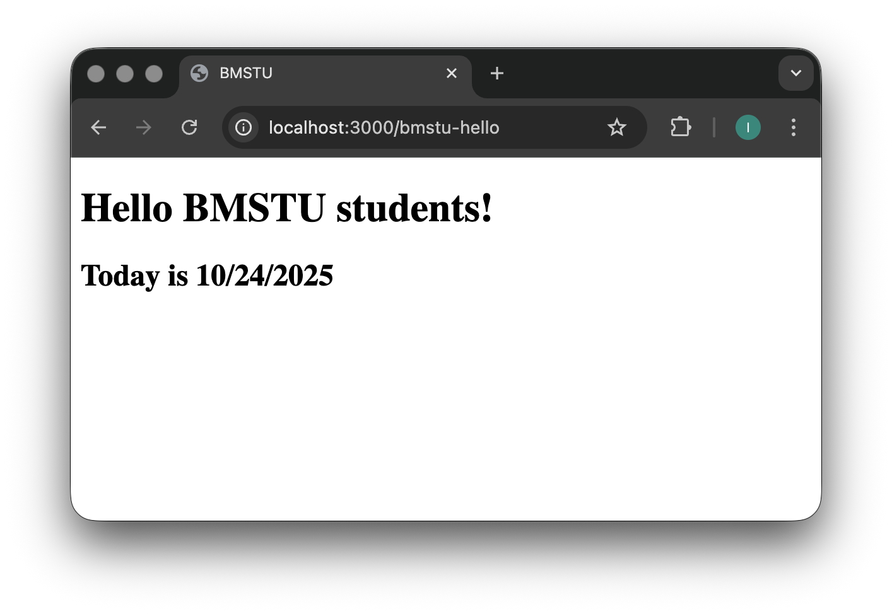

## **Циклы и условия**

Handlebars поддерживает конструкции, похожие на Django-теги:

- `{{#each list}} ... {{/each}}` — цикл
- `{{#if}} ... {{else}} ... {{/if}}` — условие

Пример:

`views/hello.hbs`

```html
<ul>
  {{#each list}}
    {{#if this.like}}
      <li>We like {{ this.name }}!</li>
    {{else}}
      <li>We do not like {{ this.name }}.</li>
    {{/if}}
  {{/each}}
  </ul>
```

`views/bmstu_lab.controller.ts`

```tsx
import { Controller, Get, Render } from '@nestjs/common';

@Controller('bmstu-hello')
export class BmstuLabController {
  @Get()
  @Render('hello') // Рендерит views/hello.hbs
  getHello() {
    return {
      currentDate: new Date().toLocaleDateString(),
      list: [
        { name: 'NestJS', like: true },
        { name: 'Django', like: false },
        { name: 'HTML', like: true },
      ],
    };
  }
}
```

Теперь Handlebars сгенерирует список, где каждое значение будет отображаться по условию. После запуска сервера по пути `http://localhost:3000/bmstu-hello/` вы должны увидеть

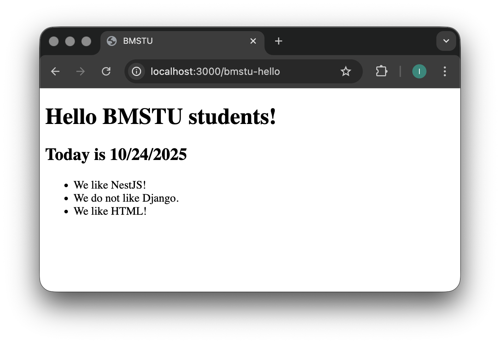

# 4. Наследование шаблонов в Handlebars (NestJS)

В отличие от Django, где шаблоны наследуются через конструкции

` и `, 

в Handlebars **наследования как такового нет**.

Вместо этого используется **механизм частичных шаблонов** — *partials*, которые позволяют подключать повторяющиеся части страниц (шапка, подвал, меню и т.д.) и собирать итоговую страницу как из «блоков».

```html
{{> partialName }}

```

Например, у вас есть общие элементы сайта:

- шапка (`header`)
- меню (`navbar`)
- подвал (`footer`)

Чтобы не дублировать их в каждом шаблоне — выносите их в отдельные `.hbs` файлы и подключаете как partials.

## Настройка partials в NestJS

Чтобы NestJS понимал, где искать частичные шаблоны, необходимо зарегистрировать папку с partials в main.ts.

```tsx
import { NestFactory } from '@nestjs/core';
import { AppModule } from './app.module';
import { NestExpressApplication } from '@nestjs/platform-express';
import { join } from 'path';

const hbs = require('hbs'); 

async function bootstrap() {
  const app = await NestFactory.create<NestExpressApplication>(AppModule);

  // Подключаем Handlebars
  app.setBaseViewsDir(join(__dirname, '..', 'views')); //Указываем директорию с шаблонами
  app.setViewEngine('hbs'); //Устанавливаем Handlebars как шаблонизатор
  
  // Регистрируем папку с частичными шаблонами (например, меню)
  hbs.registerPartials(join(__dirname, '..', 'views/partials'));
  
  
  await app.listen(process.env.PORT ?? 3000);
}
bootstrap();

```

Создадим в папке `views/` директорию `partials` и добавим в неё несколько повторяющихся элементов.

views/partials/header.hbs

```html
<header>
  <h1>BMSTU Application</h1>
  <hr>
</header>
```

views/partials/menu.hbs

```html
<ul>
    {{#each data.orders}}
      <li><a href="/bmstu-hello/order/{{this.id}}">{{this.title}}</a></li>
    {{else}}
      <li>Список пуст</li>
    {{/each}}
  </ul>
```

Теперь эти элементы можно подключать из любого шаблона с помощью конструкции:

```html
{{> header }}
{{> menu }}
```

Теперь создадим основной шаблон страницы — `views/main.hbs`, в который будем подключать эти части.

```html
<!DOCTYPE html>
<html lang="ru">
<head>
  <meta charset="UTF-8">
  <title>{{title}}</title>
</head>
<body>
  <main>
    {{> header }} <!-- Подключаем шапку -->
    <h1>Hello {{ name }} students!</h1>
    <h2>Wellcome to main {{ name }} page!</h2>
    {{> menu}}   <!-- Подключаем меню -->
  </main>
</body>
</html>
```

Теперь создадим контроллер, который:

1. отдаёт главную страницу со списком заказов;
2. отображает информацию о конкретном заказе.

```tsx
import { Controller, Get, Param, Render } from '@nestjs/common';

@Controller('bmstu-hello')
export class BmstuLabController {
  private orders = [
    { title: 'Книга с картинками', id: 1 },
    { title: 'Бутылка с водой', id: 2 },
    { title: 'Коврик для мышки', id: 3 },
  ];
  
  // Главная страница со списком заказов
  @Get()
  @Render('main')
  getOrders() {
    return {
      title: 'Product List',
      name: 'BMSTU',
      data: {
        current_date: new Date().toLocaleDateString(),
        orders: this.orders,
      },
    };
  }

  // Страница конкретного заказа
  @Get('order/:id')
  @Render('order')
  getOrder(@Param('id') id: string) {
    const order = this.orders.find(o => o.id === Number(id));
    return {
      title: order ? order.title : 'Не найдено',
      data: {
        id,
        current_date: new Date().toLocaleDateString(),
        order,
      },
    };
  }
}

```

Создадим отдельный шаблон `views/order.hbs` для отображения деталей заказа:

```html
<!doctype html>
<html lang="ru">
<head>
  <meta charset="utf-8">
  <title>Заказ №{{data.id}}</title>
</head>
<body>
  <h1>Информация о заказе №{{data.id}}</h1>
  <p>Дата: {{data.current_date}}</p>
</body>
</html>

```

Теперь при переходе на:[`http://localhost:3000/bmstu-hello`](http://localhost:3000/bmstu-hello/order/1) появится список заказов.

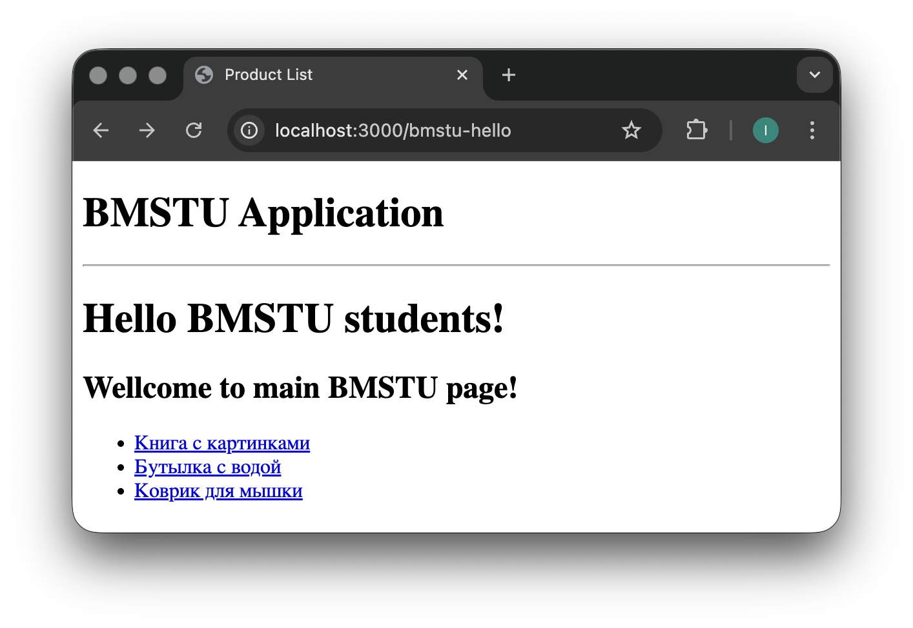

А при переходе на: [`http://localhost:3000/bmstu-hello/order/1`](http://localhost:3000/bmstu-hello/order/1)информация по конкретному заказу

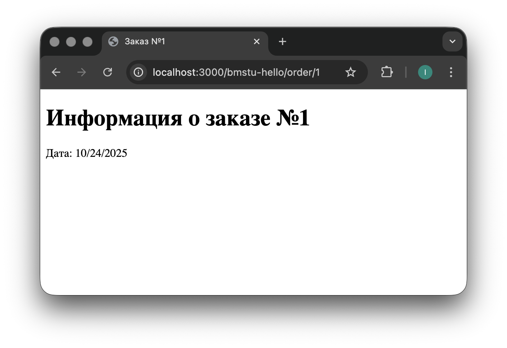

## **Итоговая структура проекта**

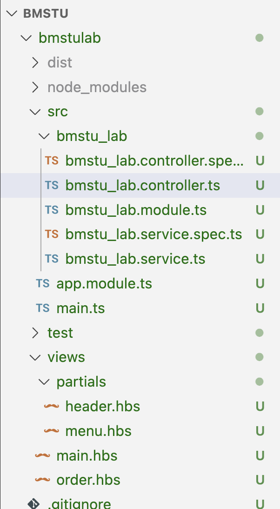

# **5. Подключение статических файлов в NestJS (CSS, изображения, JS)**
Что такое статические файлы?

Статические это те которые отдаются в неизменном виде, которые серверу не нужно обрабатывать. Например JS, CSS, jpg, png, html, txt и т. д. Динамические файлы это те которые сервер обрабатывает: php, pl, cgi и т.д.
Чтобы NestJS “видел” и отдавал статические ресурсы (например, style.css), нужно в `main.ts` добавить строку для регистрации папки со статикой:

```tsx
app.useStaticAssets(join(__dirname, '..', 'public'));
```

Теперь NestJS будет автоматически отдавать все файлы, лежащие в папке public в корне проекта.

Пример файла `public/style.css` 

```css
body {
    font-family: Arial, sans-serif;
    background-color: #f5f6f7;
    color: #222;
    margin: 40px;
  }
  
  h1 {
    color: #004aad;
  }
  
  .order-text {
    font-size: 24px;
    margin-top: 20px;
    color: #333;
  }
```
Создадим там папку img и поместим туда какую-либо картинку. В нашем примере - logo.png . Добавим код, чтобы получить статику в шапке сайта в файле header.hbs:

```html
<header>
  <div class="header-content">
    <a href="/orders" class="logo-link">
      
    </a>
    <h1>BMSTU Application</h1>
  </div>
  <hr>
</header>
```
Добавим стили для картинки в файле /public/style.css
```css
  .header-logo {
    height: 120px;
    width: auto;
    cursor: pointer;
  }
```
Запускаем сервер и видим, что наша статика успешно загружена:


# **6. Получение данных из формы (Input, POST-запрос)**

Добавим в Handlebars-шаблон простую HTML-форму:

```html
<form action="/orders" method="POST">
      <input type="text" name="query" placeholder="Введите запрос" value="{{data.query}}">
      <button type="submit">Найти</button>
</form>
```

В контроллере добавим новый метод, который примет данные из POST-запроса:

`src/bmstu_lab/bmstu_lab.controller.ts`

```tsx
   @Post()
   @Render('main')
   async searchOrders(@Body() body: { query?: string }) {
    // Извлекаем поисковый запрос из тела POST-запроса
    const query = body?.query || '';
    let orders: Order[];
    
    // Если запрос не пустой, выполняем поиск по названию заказа
    if (query && query.trim()) {
      // Фильтруем заказы по названию (регистронезависимый поиск)
      const searchQuery = query.toLowerCase();
      orders = this.orders.filter(order => 
        order.title.toLowerCase().includes(searchQuery)
      );
    } else {
      // Если запрос пустой, возвращаем все заказы
      orders = this.orders;
    }
    
    return {
      title: 'Список заказов',
      name: 'BMSTU',
      data: {
        current_date: new Date().toLocaleDateString(),
        orders: orders,
        query: query || '', // Сохраняем запрос для отображения в поле ввода
      },
    };
  }
```

После отправки формы в текстовое поле и нажатии кнопки найти можно увидеть отображение товара, который ввели, или его отсутсвтие на главной странице

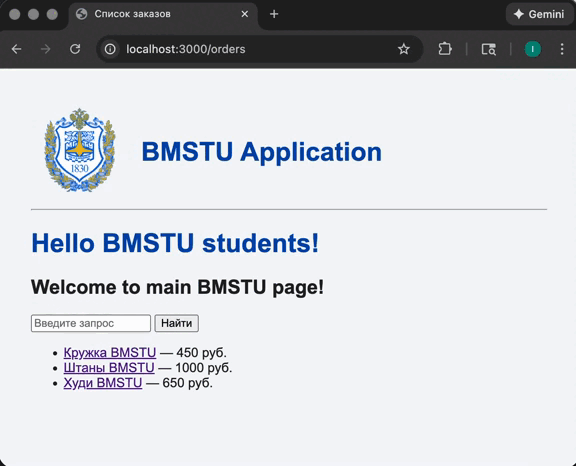

## FAQ

#### Где изучить больше по NestJS?
Есть прекрасная документация по языку: https://docs.nestjs.com
