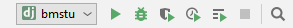
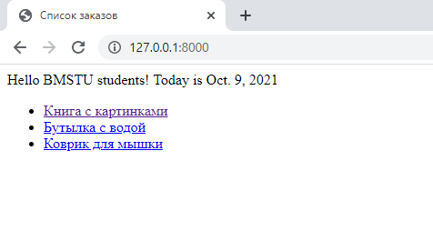
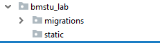

# Методические указания по выполнению лабораторной работы №1  

**Для выполнения лабораторной работы потребуется [PyCharm Professional](https://www.jetbrains.com/pycharm/download/)\
Лицензию можно получить через сайт JetBrains, указав бауманскую почту.**
Также django-проект можно создать руками по этому [тьюториалу](https://docs.djangoproject.com/en/1.10/intro/tutorial01/)

## Создание проекта локально
`File -> New Project...`\
В меню **New Project...** выбираем **Django**, задаем путь к проекту в **Location** и задаем имя нашему приложению в **Application name**


## Создание проекта на виртуальной машине (удаленно) 
Для того, чтобы подключиться к виртуальной машине и в дальнейшем создать проект в нем делаем следующее:
- Открываем VS Code и устанавливаем расширение **Remote Development**


**ВНИМАНИЕ! На этом шаге у вас уже должна быть запущена виртуальная машина!**
- После установки расширения появится такой значок в левом нижнем углу, нажимаем на него


- Выбираем пункт **Connect to Host...**


- Строка подключния будет иметь такой вид - **user_name@remote_host_ip**


- Следующим шагом необходимо выбрать, где будет размещаться ваш проект. Рекомендую для проектов создать отдельную директорию, например, как у меня - **pythonProjects**


- Нажимаем **ОК** и вводим пароль
- Если подключние прошло удачно, то видим следующее


#### Создаем проект Django

- Создаем папку с желаемым названием проекта и переходим в нее


- Создаем виртуальное окружение с помощью утилиты **venv** и активируем его


- После активации виртуального окружения уставанвливаем Django (на момент написания методички актуальная версия - 4.2.4)


- Создаем проект с помощью Django комндой - `django-admin startproject <your_project_name> .`


- После создания проекта переходим в файл **settings.py** и в **ALLOWED_HOSTS** добавляем звездочку


- Запускаем проект командой - `python manage.py runserver 0.0.0.0:8000`
    **ВНИМАНИЕ!** Чтобы сревис был доступен с домашней ОС - обязательно надо запускать на широковещательном адресе **0.0.0.0**. Порт может быть любой, в данном случае - 8000


- Делаем запрос с домашней ОС, для этого вводим в браузере адрес ВМ + порт: который указали при запуске проекта


Остальная работа выполняется точно также, как и на основной машине.

## Структура проекта
В папке проекта `bmstu`:\
`settings.py - настройки проекта, в проекте может быть несколько приложений`\
`urls.py - соответствие урлам обработчиков(views).`

В пакете `bmstu_lab`:\
`views - обработчики приложения`

**templates - папка для шаблонов (html-файлы)**


## Запуск приложения

Нажимаем на кнопку **Run** в правом меню и запускаем приложение.



При этом в консоли должен вывестись трейс-лог о запуске приложения на **localhost** на порту **:8000**


По адресу `http://127.0.0.1:8000/` в браузере должна показаться стандартная страница django-приложения.


## Как работать с View и Urls

`views.py`
```python
from django.http import HttpResponse

def hello(request):
    return HttpResponse('Hello world!')
```

`urls.py`
```python
from bmstu_lab import views

urlpatterns = [
    path('admin/', admin.site.urls),
    path('hello/', views.hello),
]
```

После запуска сервера по пути `http://127.0.0.1:8000/hello/` вы должны увидеть


Таким образом, код **hello** будет вызван при обращении к серверу по урлу
**/hello**

## Шаблонизация

Шаблоном является обычный текстовой файл, чаще всего html, который
содержит в себе переменные и теги. Эти конструкции при отрисовке шаблона
подменяются на данные, которые пользователь передает в качестве параметров
шаблонизации. В конечном итоге у нас получается html-файл, который может быть
показан в браузере пользователя.

Для начала будем отдавать пользователю статичную html-страницу, в ней не
будет никаких конструкций шаблонизатора.

Создаем html-файл в директории ‘templates’.

`index.html`
```html
<!doctype html>
<html lang="en" class="h-100">
<head>
  <meta charset="utf-8">
    <title>BMSTU</title>
</head>
<body>
    Hello BMSTU students!
</body>
</html>
```
Чтобы вернуть пользователю созданный файл, используйте метод render.
Например данный код возвращает страницу `index.html`, которая была создана в
папке templates.

`views.py`
```python
def hello(request):
    return render(request, 'index.html')
```

После запуска сервера по пути `http://127.0.0.1:8000/hello/` вы должны увидеть


## Переменные в шаблонизации

В шаблоне переменная имеет вид: `{{ some_variable }}`. Когда шаблонизатор
рендерит страницу и находит переменную, то вместо нее он подставляет результат,
который вычисляется в этой переменной. 

Добавим в статичную страницу переменные.

`index.html`
```html
<!doctype html>
<html lang="en" class="h-100">
<head>
  <meta charset="utf-8">
    <title>BMSTU</title>
</head>
<body>
    Hello BMSTU students!
    Today is {{ current_date }}
</body>
</html>
```

Чтобы передать значение переменной из кода:

`views.py`
```python
from datetime import date

def hello(request):
    return render(request, 'index.html', {
        'current_date': date.today()
    })
```

Если значение переменной не было передано, то она будет заменена пустой
строкой. В именах переменных не может быть пробелов или знаков препинания.

После запуска сервера по пути `http://127.0.0.1:8000/hello/` вы должны увидеть


В качестве переменной может быть словарь, тогда к вложенным полям можно
обращаться через точку.

```python
def hello(request):
    return render(request, 'index.html', { 'data' : {'current_date': date.today()}})
```

```python
    Today is {{ data.current_date }}
```

## Теги в шаблонизации

В шаблоне теги выглядят как ``. С помощью тегов можно реализовывать
условия, циклы, свою логику. Большинство тегов должны закрываться:
` content `

Допустим, нам нужно вывести список элементов. Для этого воспользуемся ``

`index.html`
```html
<!doctype html>
<html lang="en" class="h-100">
<head>
  <meta charset="utf-8">
    <title>BMSTU</title>
</head>
<body>
    Hello BMSTU students!
    Today is {{ data.current_date }}
<ul>
    
        <li>We like {{ var }}</li>
    
</ul>
</body>
</html>
```

`views.py`
```python
from datetime import date

def hello(request):
    return render(request, 'index.html', { 'data' : {
        'current_date': date.today(),
        'list': ['python', 'django', 'html']
    }})
```

После запуска сервера по пути `http://127.0.0.1:8000/hello/` вы должны увидеть


**for** итерируется по списку, доступ к элементам можно получать через
созданную переменную, в данном случае `var`.

`` позволяет выводить содержимое блока, если значение переменной
“true” (или значение существует, либо если список и он не пустой)
Вместе с этим тегом можно использовать ``, ``

`index.html`
```html
<ul>
    
        
            <li>We like {{ var }}</li>
        
            <li>We like {{ var }} a lot!</li>
        
            <li>We do not like {{ var }}</li>
        
    
</ul>
```

После запуска сервера по пути `http://127.0.0.1:8000/hello/` вы должны увидеть


В теге **if** можно использовать:
- and
- or
- not
- операторы сравнения
- in (проверка что значение существует в списке)

## Наследование шаблонов

Наследование шаблонов позволяет создать основной шаблон, который
содержит общие элементы, а частные места будут переопределять наследники.
Места, которые могут быть переопределены помечаются тегами ``

Допустим, есть базовый шаблон `base.html`:

`base.html`
```html
<!doctype html>
<html lang="en" class="h-100">
<head>
  <meta charset="utf-8">
    <title></title>
</head>
<body>
    Hello BMSTU students!
    
</body>
</html>
```

Здесь определена часть, которая будет присутствовать у нас на каждой
странице, которая наследуется от него.
Создадим наследника `orders.html`, который будет выводить список заказов:

`orders.html`
```html


Список заказов


<ul>
    
        <li><a href="">{{ order.title }}</a> </li>
    
        <li>Список пуст</li>
    
</ul>

```

`views.py`
```python
def GetOrders(request):
    return render(request, 'orders.html', {'data' : {
        'current_date': date.today(),
        'orders': [
            {'title': 'Книга с картинками', 'id': 1},
            {'title': 'Бутылка с водой', 'id': 2},
            {'title': 'Коврик для мышки', 'id': 3},
        ]
    }})
```

Для каждого товара добавили ссылку на его отдельную с траницу в формате ``

В файле `urls.py`необходимо определить url с именем ‘order_url’, который будет
принимать id заказа:

`urls.py`
```python
urlpatterns = [
    path('admin/', admin.site.urls),
    path('', views.GetOrders),
    path('order/<int:id>/', views.GetOrder, name='order_url'),
]
```

Создадим шаблон для страницы товара `order.html` и ее view

`order.html`
```html


Заказ №{{ data.id }}


    <div>Информация о заказе №{{ data.id }}</div>

```

`views.py`
```python
def GetOrder(request, id):
    return render(request, 'order.html', {'data' : {
        'current_date': date.today(),
        'id': id
    }})
```

После запуска сервера по пути `http://127.0.0.1:8000/` вы должны увидеть



По пути `http://127.0.0.1:8000/order/2` вы должны увидеть


## Include в шаблонизации

Позволяет рендерить в месте использования тега другой шаблон

`orders.html`
```html


Список заказов


<ul>
    
       
    
        <li>Список пуст</li>
    
</ul>

```

`order_element.html`
```html
 <li><a href="">{{ element.title }}</a> </li>
```

**with** - позволяет сменить контекст. Т.е. в шаблоне `order_element.html` будут доступны не только *order*, *orders* , но и *element*

## Подключение статических файлов

В `settings.py` указан путь до статических файлов
```python
STATIC_URL = '/static/'
```

В приложении создаем папку и кладем туда файлы:



Файлы `.css` кладем в отдельную папку `static/css` 

Перед использованием ссылки на статический файл, в шаблоне:
```html

```

Используем ссылку:
```html
<link rel="stylesheet" type="text/css" href="">
```

Пример `.css`
```css
.order-text {
  font-size: 40px;
}
```

Пример шаблона с `css`

```html
<div class="order-text">Информация о заказе №{{ data.id }}</div>
```

## Получение данных из запроса, input

Для передачи данных из браузера на сервер Django, необходимо добавить форму, кнопку и поле ввода в наш шаблон
```html
<form action="sendText" method="post" enctype="multipart/form-data">
    
    <input name="text" type="text"><br><br>
    <input type="submit" value="Submit" >
</form>
```

Добавить в `urls.py` обработчик нашего POST-запроса `views.sendText` для url [/sendText]()
```python
path('sendText', views.sendText, name='sendText'),
```

А в обработчик `sendText` в `views.py` добавляем код получения значения передаваемого параметра из POST-запроса

```python
def sendText(request):
    input_text = request.POST['text']
    ...
```