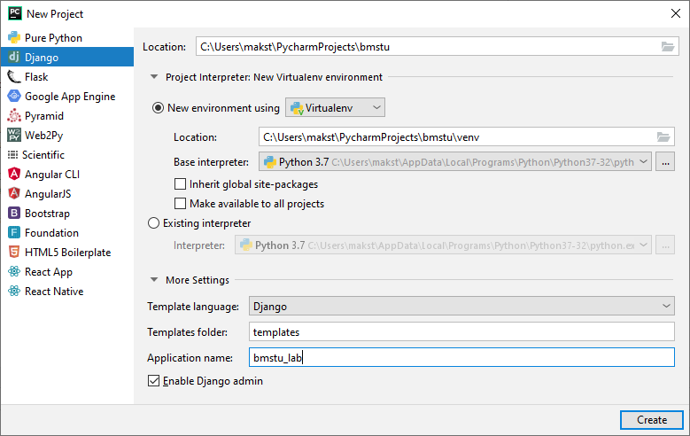
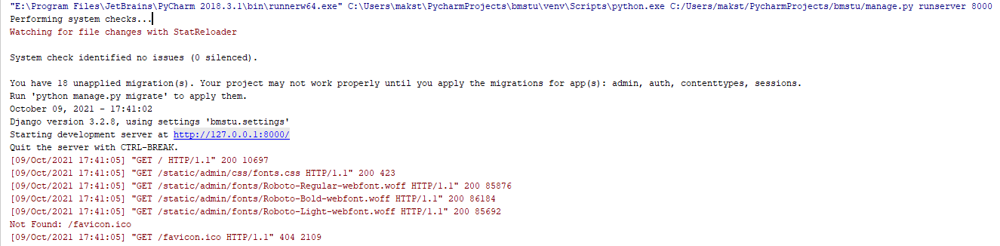
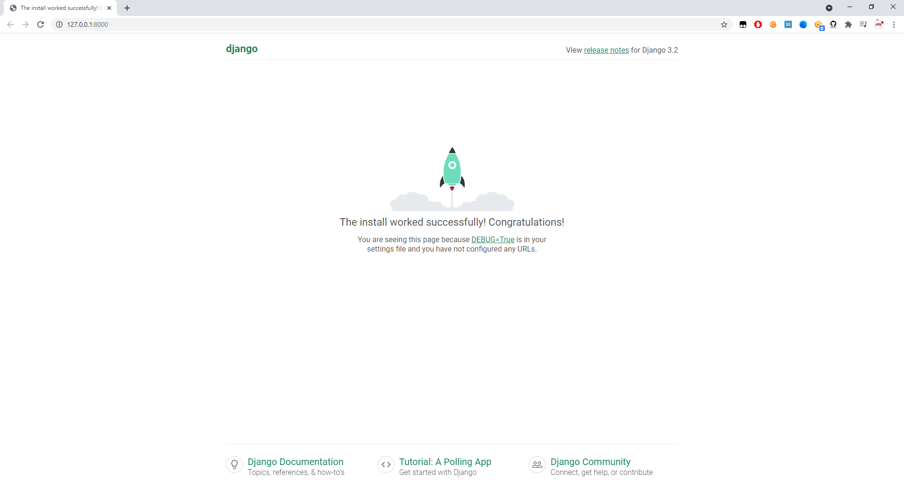
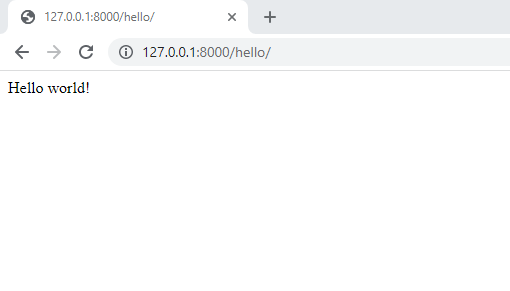
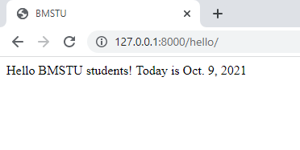
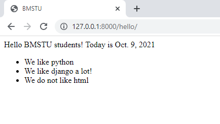

# 实验室工作指南 №1  

要完成本实验，您将需要 [VS Code](https://code.visualstudio.com) 或者 [PyCharm Professional](https://www.jetbrains.com/pycharm/download/)

## 本地创建项目
PyCharm 示例\
`File -> New Project...`\
在**New Project..**.中，选择**Django** ，在**Location**中设置项目的路径，并在**Application name**中设置我们应用程序的名称



## 在虚拟机上创建项目（远程）
为了连接到虚拟机并随后在其中创建项目，请执行以下操作：
- 打开 VS Code 并安装远程开发扩展 **Remote Development**


**注意！在此步骤中，您应该已经运行了一个虚拟机！**
- 安装扩展后，左下角会出现这个图标，点击它


- 选择连接到主机 **Connect to Host...**

如何查看虚拟机的IP：
在虚拟机上输入命令 - **ifconfig**  
，找到以太网接口，本例为 - enp0s3 查看第二行，找到 **inet** 旁边的 IP 地址，请注意，虚拟机的“网络”设置中，连接类型应设置为“桥接模式”。\


- 连接字符串将如下所示 - **user_name@remote_host_ip**


- 下一步是选择您的项目所在的位置。我建议为项目创建一个单独的目录，例如我的 - **pythonProjects**


- 单击**OK**并输入密码
- 如果连接成功，我们会看到以下内容


#### 创建 Django 项目

- 使用所需的项目名称创建一个文件夹，然后寻址到该文件夹


- 使用venv实用程序创建虚拟环境并激活这个虚拟环境


- 激活虚拟环境后，安装Django（在编写手册时，当前版本是4.2.4）


- 使用以下命令创建Django 项目 - `django-admin startproject <your_project_name> .`


- 创建项目后，进入 **settings.py**文件，在 **ALLOWED_HOSTS** 处添加星号


- 我们正在作为一个团队启动该项目 - `python manage.py runserver 0.0.0.0:8000`
    注意！为了使您的家庭操作系统可以使用该服务，必须在广播地址**0.0.0.0**上启动该服务。端口可以​​是任何端口，在本例中为 8000


- 我们从主操作系统发出请求，为此，我们在浏览器中输入**虚拟机地址+端口**：这是在启动项目时指定的


其余工作与在主机上完全相同。

## 项目结构
在项目文件夹中 `bmstu`:\
`settings.py - настройки проекта, в проекте может быть несколько приложений`\
`urls.py - соответствие урлам обработчиков(views).`

在文件夹中 `bmstu_lab`:\
`views - обработчики приложения`

**templates - 模板文件夹（html 文件）**


## 启动应用程序

单击右侧菜单中的**Run**按钮并启动应用程序。


在这种情况下，控制台应显示有关在端口**8000**上的**localhost**(本地主机)上运行的应用程序的跟踪日志



浏览器中的地址 `http://127.0.0.1:8000/` 应显示 Django 应用程序的标准页面



## 如何使用视图和 URL

`views.py`
```python
from django.http import HttpResponse

def hello(request):
    return HttpResponse('Hello world!')
```

`urls.py`
```python
from bmstu_lab import views

urlpatterns = [
    path('admin/', admin.site.urls),
    path('hello/', views.hello),
]
```

沿着路径启动服务器后 `http://127.0.0.1:8000/hello/` 您应该看到



因此，当使用**/hello** 这个URL路径访问服务器时，将调用 **hello代码**，返回一条“Hello, World!”的消息


## 模板化

模板是一个普通的文本文件，通常是 HTML 文件，其中包含变量和标签。这些结构在渲染模板时会被替换成用户作为模板参数传递的数据。最终，我们得到一个可以在用户浏览器中显示的 HTML 文件。

首先，我们将给用户提供一个静态的 HTML 页面，其中不会包含任何模板引擎的结构。

在目录中创建一个 html 文件 ‘templates’.

`index.html`
```html
<!doctype html>
<html lang="en" class="h-100">
<head>
  <meta charset="utf-8">
    <title>BMSTU</title>
</head>
<body>
    Hello BMSTU students!
</body>
</html>
```

要告诉 Django 在哪里查找我们的模板，请检查`settings.py`.其中，`TEMPLATES`字段中的变量`DIRS`应指示模板的路径

```python
TEMPLATES = [
    {
        # ...
        "DIRS": [BASE_DIR / "bmstu_lab/templates"],
        # ...
    },
]
```

要将创建的文件返回给用户，请使用 render 方法。例如，以下代码返回了位于 templates 文件夹中的 `index.html` 页面。

`views.py`
```python
from django.shortcuts import render

def hello(request):
    return render(request, 'index.html')
```

沿着路径启动服务器后 `http://127.0.0.1:8000/hello/` 您应该看到


## 模板中的变量

在模板中，变量如下所示: `{{ some_variable }}`. 当模板引擎渲染页面并找到一个变量时，它会将其替换为在该变量中计算的结果。

让我们向静态页面添加变量.

`index.html`
```html
<!doctype html>
<html lang="en" class="h-100">
<head>
  <meta charset="utf-8">
    <title>BMSTU</title>
</head>
<body>
    Hello BMSTU students!
    Today is {{ current_date }}
</body>
</html>
```

要从代码传递变量的值:

`views.py`
```python
from datetime import date

def hello(request):
    return render(request, 'index.html', {
        'current_date': date.today()
    })
```

如果变量的值未传递，它将被替换为空字符串。变量名称不能包含空格或标点符号.

沿着 `http://127.0.0.1:8000/hello/`路径启动服务器后，您应该看到



变量可以是字典，然后可以通过**点**访问嵌套字段。

```python
def hello(request):
    return render(request, 'index.html', { 'data' : {'current_date': date.today()}})
```

```python
    Today is {{ data.current_date }}
```

## 模板中的标签

在模板中，标签看起来像这种格式 ``. 使用标签，您可以实现条件、循环和您自己的逻辑。大多数标签都有结束标志:
` content `

假设我们需要显示一个元素列表。为此，我们将使用 ``

`index.html`
```html
<!doctype html>
<html lang="en" class="h-100">
<head>
  <meta charset="utf-8">
    <title>BMSTU</title>
</head>
<body>
    Hello BMSTU students!
    Today is {{ data.current_date }}
<ul>
    
        <li>We like {{ var }}</li>
    
</ul>
</body>
</html>
```

`views.py`
```python
from datetime import date

def hello(request):
    return render(request, 'index.html', { 'data' : {
        'current_date': date.today(),
        'list': ['python', 'django', 'html']
    }})
```

沿着 `http://127.0.0.1:8000/hello/`路径启动服务器后，您应该看到


**for** 迭代列表，可以通过创建的变量（在本例中 ）访问元素，在这种情况下是 `var`.

`` 允许在变量的值为“true”（或变量存在，或者是一个非空列表）时输出块的内容。这个标签可以与 ``、`` 一起使用。

`index.html`
```html
<ul>
    
        
            <li>We like {{ var }}</li>
        
            <li>We like {{ var }} a lot!</li>
        
            <li>We do not like {{ var }}</li>
        
    
</ul>
```

沿着 `http://127.0.0.1:8000/hello/`路径启动服务器后，您应该看到



在**if**标签中你可以使用：

- and
- or
- not
- 比较运算符
- in（检查该值是否存在于列表中）

## 模板继承

模板继承允许创建一个包含公共元素的主模板，而具体的部分则由继承者重写。可以被重写的部分使用 `` 标签标记

假设有一个基本模板 `base.html`:

`base.html`
```html
<!doctype html>
<html lang="en" class="h-100">
<head>
  <meta charset="utf-8">
    <title></title>
</head>
<body>
    Hello BMSTU students!
    
</body>
</html>
```

在这里，我们定义了将出现在继承它的每个页面上的部分。让我们创建一个`orders.html`显示订单列表的后继者:

`orders.html`
```html


Список заказов


<ul>
    
        <li><a href="">{{ order.title }}</a> </li>
    
        <li>Список пуст</li>
    
</ul>

```

`views.py`
```python
def GetOrders(request):
    return render(request, 'orders.html', {'data' : {
        'current_date': date.today(),
        'orders': [
            {'title': 'Книга с картинками', 'id': 1},
            {'title': 'Бутылка с водой', 'id': 2},
            {'title': 'Коврик для мышки', 'id': 3},
        ]
    }})
```

对于每个产品，我们添加了一个指向其单独页面的链接，格式如下 ``

在文件 `urls.py` 中，需要定义一个名为 `order_url` 的 URL，它将接收订单的 id：

`urls.py`
```python
urlpatterns = [
    path('admin/', admin.site.urls),
    path('', views.GetOrders),
    path('order/<int:id>/', views.GetOrder, name='order_url'),
]
```

让我们为产品页面`order.html`及其视图创建一个模板

`order.html`
```html


Заказ №{{ data.id }}


    <div>Информация о заказе №{{ data.id }}</div>

```

`views.py`
```python
def GetOrder(request, id):
    return render(request, 'order.html', {'data' : {
        'current_date': date.today(),
        'id': id
    }})
```

沿着`http://127.0.0.1:8000/`路径启动服务器后，您应该看到


而沿着 `http://127.0.0.1:8000/order/2`路径启动服务器后，您应该看到


## 包含在模板中

允许您渲染使用该标签的另一个模板

`orders.html`
```html


Список заказов


<ul>
    
       
    
        <li>Список пуст</li>
    
</ul>

```

`order_element.html`
```html
 <li><a href="">{{ element.title }}</a> </li>
```

`with` 允许改变上下文。也就是说，在模板 `order_element.html` 中，将不仅仅可以访问 `order` 和 `orders`，还可以访问 `element`。

## 连接静态文件

指定`settings.py`静态文件的路径
```python
STATIC_URL = '/bmstu_lab/static/'
```

```python
STATICFILES_DIRS = [
    BASE_DIR / "static",
]
```

在应用程序中，创建一个文件夹并将文件放入其中：


将`.css`结尾的文件放在单独的文件夹中`static/css`

在使用静态文件的链接之前，在模板中：
```html

```

我们使用链接：
```html
<link rel="stylesheet" type="text/css" href="">
```

例子 `.css`
```css
.order-text {
  font-size: 40px;
}
```

示例模板包含 `css`

```html
<div class="order-text">Информация о заказе №{{ data.id }}</div>
```

## 从请求接收数据, input

要将数据从浏览器传输到 Django 服务器，我们需要向模板添加表单、按钮和输入字段
```html
<form action="sendText" method="post" enctype="multipart/form-data">
    
    <input name="text" type="text"><br><br>
    <input type="submit" value="Submit" >
</form>
```

在 `urls.py` 中添加处理我们 POST 请求的处理函数 `views.sendText`，对应的 URL 是 `/sendText`。
```python
path('sendText', views.sendText, name='sendText'),
```

在 `views.py` 中的 `sendText` 处理函数中，添加获取通过 POST 请求传递的参数值的代码。

```python
def sendText(request):
    input_text = request.POST['text']
    ...
```