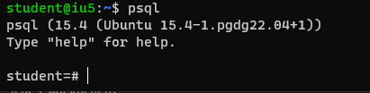
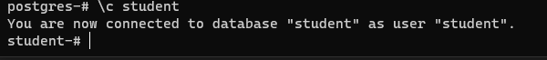

# Методические указания по выполнению лабораторной работы №2  


## Рекомендации по установке PostgreSQL в Docker контейнер

Если ваш выбор пал на установку СУБД в docker-container можете использовать данный compose файл `docker-compose.yml`.

### Шаги для установки
1. Скопировать compose файл в новую папку
2. Выполнить в терминала команду
 
   ```
   docker-compose up
   ```

Подробнее можно причитать [здесь](https://habr.com/ru/post/578744/).


### Дополнительный вариант развертывания PostgreSQL в Docker контейнер

1. Скачиваем образ из Docker Hub
```console
docker pull postgres
```
2. Запускаем контейнер с СУБД
```console
docker run --name postgres -p 5455:5432 -e POSTGRES_USER=postgres -e POSTGRES_PASSWORD=postgres1234 -e POSTGRES_DB=test_db -d postgres
```


## Работа с PostgreSQL

На вирутальной машине Ubuntu 22.04 уже установлен PostgreSQL, чтобы начать с ним взаимодействовать непосредственно на ВМ необходимо активировать терминальный клиент **psql** одноименной командой



Если вы устанавливаете PostgreSQL на свою машину самостоятельно, вам в помощь хорошая статья - [How To Install PostgreSQL on Ubuntu 20.04](https://www.digitalocean.com/community/tutorials/how-to-install-postgresql-on-ubuntu-20-04-quickstart)


Некоторые стандартные команды терминального клиента:
- **\l** - показать доступные базы данных
- **\с <имя базы>** - выбрать базу данных
- **\dt** - показать таблицы в выбранной базе данных
- **\d+ <имя таблицы>** - вывести схему таблицы

Для начала необходимо создать пользователя базы данных. На вирутальной машине он уже создан, его имя также - student

```sql
create user user_name with password 'mypassword';
```

После этого нужно создать базу данных. Этот шаг можно также сделать в дайльнейшем через IDE. Дефолтная база данных называется postgres.


```sql
createdb `student`;
```

И выдать права новому пользователю на эту базу данных.

```sql
grant all privileges on database student to user_name;;
```

Теперь можно создавать таблицу в этой базе данных, но сначала нужно в
нее перейти:



Чтобы создать таблицу нужно использовать команду create table.
Рассмотрим простой пример с созданием таблицы “книга”, в которой будет
название книги и ее описание:

```sql
CREATE TABLE books (
    id SERIAL PRIMARY KEY,
    name VARCHAR(30) NOT NULL,
    description VARCHAR(255) NOT NULL
);
```

Для добавления/чтения/обновления/удаления (CRUD) записей служат
команды INSERT, DELETE, UPDATE, SELECT. Подробно эти команды
рассмотрены в курсе баз данных.

```sql
INSERT INTO books (id, name, description) VALUES(1, 'Мастер и Маргарита', 'Крутая книга');

SELECT * FROM books;
```

## Подключение к БД через IDE
В данном случае пример показан на DBeaver, но вы можете использовать то IDE, которое для вас удобнее, например PG Admin или же DtaGrip

Открываем окно для создания соединения и выбираем PostgreSQL


Далее открывается окно, где необходимо прописать креды
Хост: vm_ip (в данном случае 192.168.0.189)
База данных: по умолчанию postgresql, но можно выбрать и свою: если вы создали его через psql
Пользователь: student
Пароль: root


После этого у вас должно установиться соединение с БД


