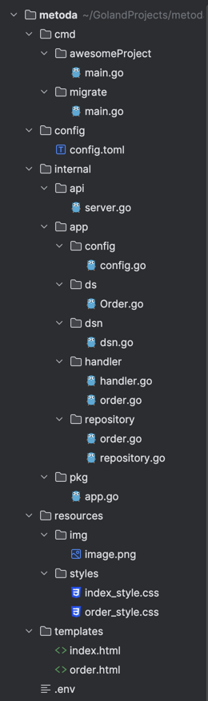
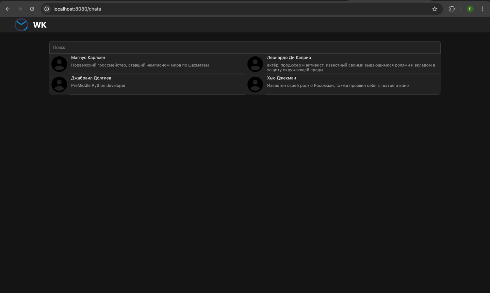
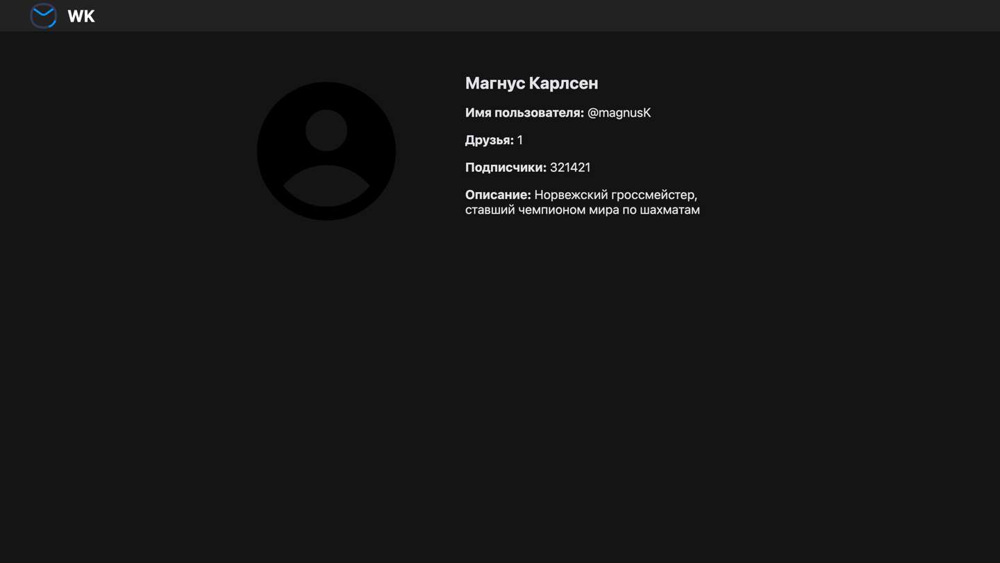
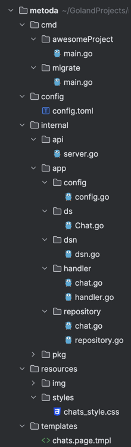
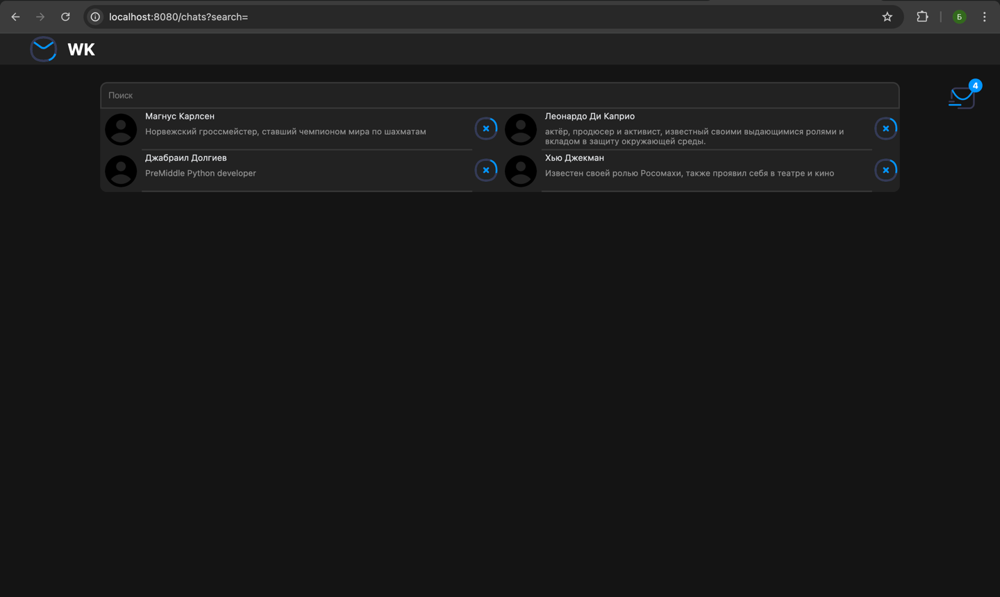
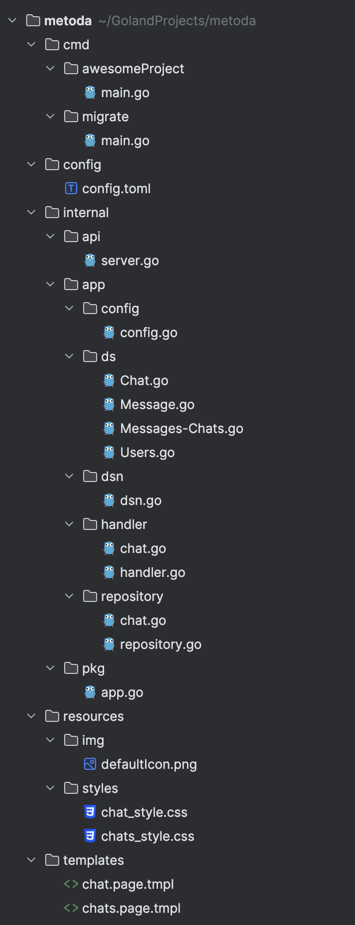

# Методические указания по выполнению лабораторной работы №2

## План работы
1. Работа с PostgreSQL
2. Подключение к БД через IDE
3. Про конфигурацию и переменные окружения
      - Файлы конфигурации
      - Переменные окружения
4. Подключаемся к БД (gORM)
5. Работаем с настоящими примерами. Иконка корзины. Тема: чаты (сервис рассылки сообщений)
6. Удаление услуги

## Работа с PostgreSQL

Процесс запуска и настройки PostgreSQL в Docker-контейнере при помощи docker-compose подробно описан в [соответствующих методических указаниях](../lab2-db/README.md).

При объяснении интеграции Python и Django с PostgreSQL я буду исходить из того, что сам PostgreSQL у вас уже поднят и доступен для подключения.

## Подключение к БД через IDE
В данном случае пример показан на DBeaver, но вы можете использовать то IDE, которое для вас удобнее, например PG Admin или же DtaGrip

Открываем окно для создания соединения и выбираем PostgreSQL


Далее открывается окно, где необходимо прописать креды
Хост: vm_ip (в данном случае 192.168.0.189)
База данных: по умолчанию postgresql, но можно выбрать и свою: если вы создали его через psql
Пользователь: student
Пароль: root


После этого у вас должно установиться соединение с БД


## Про конфигурацию и переменные окружения
Так или иначе прежде чем запустить проект хочется менять в нем
какие-то параметры(на каком порту запустить, какую информацию писать в лог)

Потому есть 2 основных способа передачи конфигурации вашему приложению:
- файлы конфигурации
- переменные окружения
### Поговорим про файлы конфигурации
Файл конфигурации - обычный текстовый файл, в каком-либо общеизвестном
или общепринятом формате, например: .yml, .yaml, .toml, .json, .hcl, .config

Все эти файлы - просто текстовые, с одним небольшим условием,
что декларативное описание сущностей(каких-то параметров) ведется в определенном
стандартизированном формате, приведем пару примеров файлов конфигурации:

```config.toml```
```toml 
ServiceHost = "0.0.0.0" # просто ключ значение
ServicePort = 80

[BMSTUNewsConfig] # вложенный объект
SiteAddress = "api.www.bmstu.ru" # значения полей этого объекта
Protocol = "https"
DayLimit = 30
```
```config.yaml```
```yaml
service_host: "0.0.0.0" # просто ключ значение
service_port: 80
bmstu_news_config:
  site_address: "api.www.bmstu.ru"
  protocol: "https"
  day_limit: 30
```

Для нашего проекта давайте создадим файл конфигурации в `/config/config.toml`
```dotenv
ServiceHost = "0.0.0.0"
ServicePort = 80 
```
### Поговорим про переменные окружения
Для начала приведем определение:
Переменные окружения — именованные переменные, содержащие текстовую информацию, которую могут использовать запускаемые программы. Такие переменные могут содержать общие настройки системы, параметры графической или командной оболочки, данные о предпочтениях пользователя и многое другое.

Выведем переменные окружения которые сейчас у нас есть. Для этого в консоли введем(далее мы не будем говорить,
что что-то нужно ввести в коносль, вам об этом говорит знак $ - это просто строка приглашения в Linux терминалах.
Он означает что вы работаете под обычным пользователем, а # - под root. Это и есть его основное назначение, никаких дополнительных функций в этом символе нет):
```shell
$ env
PWD=/Users/maxim-konovalov/MyProj/web-2022/tutorials
OLDPWD=/Users/maxim-konovalov/MyProj/web-2022/tutorials
HOMEBREW_PREFIX=/opt/homebrew
HOMEBREW_CELLAR=/opt/homebrew/Cellar
HOMEBREW_REPOSITORY=/opt/homebrew
MANPATH=/opt/homebrew/share/man::
INFOPATH=/opt/homebrew/share/info:
_=/usr/bin/env
...
```
Запишем свою переменную:
```shell
$ export test=123
```
Проверим ее наличие:
```shell
$ env | grep 123   # | grep 123 значит что вы передаете выходной поток утилите grep, эта утилита позволяет осуществлять поиск
test=123
```

Переменные окружения - key value значния, которые могту быть локальными и глобальными(локальные - видно только в конкретной директории,
глобальные - видно во всех директориях, например переменная PWD или PATH). С помощью них можно так же передавать
данные вашему сервису, обычно ее используют, чтобы передавать и обмениваться секретными данными пользователь-сервис, сервис - сервис

## Подключаемся к БД (gORM)
В прошлый раз мы имитировали работу с БД используя слайс со значениями, вот как это выглядело:
`internal/app/repository/repository.go`:
```go
func (r *Repository) GetOrders() ([]Order, error) {
	// имитируем работу с БД. Типа мы выполнили sql запрос и получили эти строки из БД
	orders := []Order{
		{
			ID:    1,
			Title: "first order",
		},
		{
			ID:    2,
			Title: "second order",
		},
		{
			ID:    3,
			Title: "third order",
		},
	}
	// обязательно проверяем ошибки, и если они появились - передаем выше, то есть хендлеру
	// тут я снова искусственно обработаю "ошибку" чисто чтобы показать вам как их передавать выше
	if len(orders) == 0 {
		return nil, fmt.Errorf("массив пустой")
	}

	return orders, nil
}
```

Сейчас же мы подключимся к настоящей базе данных и будем брать значения из нее.
Для этого нам нужно будет немного изменить структуру нашего проекта:\
- Создадим конфиг файл, в котором будет лежать информация о нашем сервисе (просто для примера)\
`config/config.toml`:
```toml
ServiceHost = "0.0.0.0"
ServicePort = 8080
```
- Создадим файл для чтения информации из созданного нами конфигурационного файла\
`internal/app/config/config.go`
```go
package config

import (
	"os"
	
   "github.com/joho/godotenv"
	log "github.com/sirupsen/logrus"
	"github.com/spf13/viper"
)

type Config struct {
	ServiceHost string
	ServicePort int
}

func NewConfig() (*Config, error) {
	var err error

   configName := "config"
   _ = godotenv.Load()
   if os.Getenv("CONFIG_NAME") != "" {
      configName = os.Getenv("CONFIG_NAME")
   }

   viper.SetConfigName(configName)
   viper.SetConfigType("toml")
   viper.AddConfigPath("config")
   viper.AddConfigPath(".")
   viper.WatchConfig()

	err = viper.ReadInConfig()
	if err != nil {
		return nil, err
	}

	cfg := &Config{} // создаем объект конфига
	err = viper.Unmarshal(cfg) // читаем информацию из файла, 
	// конвертируем и затем кладем в нашу переменную cfg
	if err != nil {
		return nil, err
	}

	log.Info("config parsed")

	return cfg, nil
}
```
- Теперь нам нужен файл с переменными окружения, в который мы положим информацию, которая нам нужна для подключения к БД. Не забудьте прописать его в `.gitingore`\
`.env`:
```dotenv
DB_HOST=localhost
DB_NAME=mailing_db
DB_PORT=5432
DB_USER=postgres
DB_PASS=password
```
- Для удобства мы с вами напишем отдельную функцию, которая будет брать переменные окружения, составлять из них dsn строку и возвращать ее 
`internal/app/dsn/dsn.go`:
```go
package dsn

import (
	"fmt"
	"os"
)

func FromEnv() string {
	host := os.Getenv("DB_HOST")
	if host == "" {
		return ""
	}
	port := os.Getenv("DB_PORT")
	user := os.Getenv("DB_USER")
	pass := os.Getenv("DB_PASS")
	dbname := os.Getenv("DB_NAME")
    // И вот мы возвращаем dsn, который необходим для подключения к БД
	return fmt.Sprintf("host=%s port=%s user=%s password=%s dbname=%s sslmode=disable", host, port, user, pass, dbname)
}
```
- `internal/app/repository/repository.go` видоизменяем, подключив gORM. Теперь он будет выглядеть так:
```go
package repository

import (
   "fmt"
   "strings"

   "gorm.io/driver/postgres"
   "gorm.io/gorm"
)

type Repository struct {
   db *gorm.DB
}

func New(dsn string) (*Repository, error) {
   db, err := gorm.Open(postgres.Open(dsn), &gorm.Config{}) // подключаемся к БД
   if err != nil {
      return nil, err
   }

   // Возвращаем объект Repository с подключенной базой данных
   return &Repository{
      db: db,
   }, nil
}
```
- `internal/app/handler/handler.go` тоже видоизменяем. Теперь он будет выглядеть так:
```go
package handler

import (
	"net/http"
	"strconv"
	"time"

	"github.com/gin-gonic/gin"
	"github.com/sirupsen/logrus"
	"metoda/internal/app/repository"
)

type Handler struct {
	Repository *repository.Repository
}

func NewHandler(r *repository.Repository) *Handler {
	return &Handler{
		Repository: r,
	}
}

// RegisterHandler Функция, в которой мы отдельно регистрируем маршруты, чтобы не писать все в одном месте
func (h *Handler) RegisterHandler(router *gin.Engine) {
	router.GET("/", h.GetOrders)
	router.GET("/order/:id", h.GetOrder)
}

// RegisterStatic То же самое, что и с маршрутами, регистрируем статику
func (h *Handler) RegisterStatic(router *gin.Engine) {
	router.LoadHTMLGlob("templates/*")
	router.Static("/styles", "./styles")
}

// errorHandler для более удобного вывода ошибок 
func (h *Handler) errorHandler(ctx *gin.Context, errorStatusCode int, err error) {
	logrus.Error(err.Error())
	ctx.JSON(errorStatusCode, gin.H{
		"status":      "error",
		"description": err.Error(),
	})
}
```
- Создаем пакет, в котором у нас будут лежать наши модели, которые мы будем использовать как в коде, так и для миграций БД\
`internal/app/ds/Order.go`:
```go
package ds

type Order struct {
	ID    int
	Title string
}
```
- Переносим наши функции из `internal/app/repository/repository.go`  в `internal/app/repository/order.go` и меняем их уже с использованием gORM:\
`internal/app/repository/order.go`
```go
package repository

import (
	"fmt"

	"metoda/internal/app/ds"
)

func (r *Repository) GetOrders() ([]ds.Order, error) {
	var orders []ds.Order
	err := r.db.Find(&orders).Error
	// обязательно проверяем ошибки, и если они появились - передаем выше, то есть хендлеру
	if err != nil {
		return nil, err
	}
	if len(orders) == 0 {
		return nil, fmt.Errorf("массив пустой")
	}

	return orders, nil
}

func (r *Repository) GetOrder(id int) (ds.Order, error) {
	order := ds.Order{}
	err := r.db.Where("id = ?", id).First(&order).Error
	if err != nil {
		return ds.Order{}, err
	}
	return order, nil
}

func (r *Repository) GetOrdersByTitle(title string) ([]ds.Order, error) {
	var orders []ds.Order
	err := r.db.Where("name ILIKE ?", "%"+title+"%").Find(&orders).Error
	if err != nil {
		return nil, err
	}
	return orders, nil
}

```
- Переносим наши функции из `internal/app/handler/handler.go`  в `internal/app/handler/order.go` и меняем их уже с использованием gORM:\
```go
package handler

import (
	"net/http"
	"strconv"
	"time"

	"github.com/gin-gonic/gin"
	"github.com/sirupsen/logrus"
	"metoda/internal/app/ds"
)

func (h *Handler) GetOrders(ctx *gin.Context) {
	var orders []ds.Order
	var err error

	searchQuery := ctx.Query("query") // получаем значение из нашего поля
	if searchQuery == "" {            // если поле поиска пусто, то просто получаем из репозитория все записи
		orders, err = h.Repository.GetOrders()
		if err != nil {
			logrus.Error(err)
		}
	} else {
		orders, err = h.Repository.GetOrdersByTitle(searchQuery) // в ином случае ищем заказ по заголовку
		if err != nil {
			logrus.Error(err)
		}
	}

	ctx.HTML(http.StatusOK, "index.html", gin.H{
		"time":   time.Now().Format("15:04:05"),
		"orders": orders,
		"query":  searchQuery, // передаем введенный запрос обратно на страницу
		// в ином случае оно будет очищаться при нажатии на кнопку
	})
}

func (h *Handler) GetOrder(ctx *gin.Context) {
	idStr := ctx.Param("id") // получаем id заказа из урла (то есть из /order/:id)
	// через двоеточие мы указываем параметры, которые потом сможем считать через функцию выше
	id, err := strconv.Atoi(idStr) // так как функция выше возвращает нам строку, нужно ее преобразовать в int
	if err != nil {
		logrus.Error(err)
	}

	order, err := h.Repository.GetOrder(id)
	if err != nil {
		logrus.Error(err)
	}

	ctx.HTML(http.StatusOK, "order.html", gin.H{
		"order": order,
	})
}

```
- Создаем файл `internal/pkg/app.go`. В нем мы будем запускать сервер:
```go
package pkg

import (
   "fmt"

   "github.com/gin-gonic/gin"
   "github.com/sirupsen/logrus"
   "metoda/internal/app/config"
   "metoda/internal/app/handler"
)

type Application struct {
   Config  *config.Config
   Router  *gin.Engine
   Handler *handler.Handler
}

func NewApp(c *config.Config, r *gin.Engine, h *handler.Handler) *Application {
   return &Application{
      Config:  c,
      Router:  r,
      Handler: h,
   }
}

func (a *Application) RunApp() {
   logrus.Info("Server start up")

   a.Handler.RegisterHandler(a.Router)
   a.Handler.RegisterStatic(a.Router)

   serverAddress := fmt.Sprintf("%s:%d", a.Config.ServiceHost, a.Config.ServicePort)
   if err := a.Router.Run(serverAddress); err != nil {
      logrus.Fatal(err)
   }
   logrus.Info("Server down")
}
```
- Удаляем `internal/api/server.go`, он нам больше не понадобится, его функционал мы перенесли по другим функциям
- Создаем `cmd/migrate/main.go`. Если вы его запустите, то в вашей БД создадутся указанными вами таблицы, в данном случае мы указали ds.Order и будет создана таблица orders:
```go
package main

import (
	"github.com/joho/godotenv"
	"gorm.io/driver/postgres"
	"gorm.io/gorm"
	"metoda/internal/app/ds"
	"metoda/internal/app/dsn"
)

func main() {
	_ = godotenv.Load()
	db, err := gorm.Open(postgres.Open(dsn.FromEnv()), &gorm.Config{})
	if err != nil {
		panic("failed to connect database")
	}

	// Migrate the schema
	err = db.AutoMigrate(
		&ds.Order{},
	)
	if err != nil {
		panic("cant migrate db")
	}
}
```
- Меняем `cmd/projectName/main.go`:
```go
package main

import (
	"fmt"

	"github.com/gin-gonic/gin"
	"github.com/sirupsen/logrus"
	"metoda/internal/app/config"
	"metoda/internal/app/dsn"
	"metoda/internal/app/handler"
	"metoda/internal/app/repository"
	"metoda/internal/pkg"
)

func main() {
	router := gin.Default()
	conf, err := config.NewConfig()
	if err != nil {
		logrus.Fatalf("error loading config: %v", err)
	}

	postgresString := dsn.FromEnv()
	fmt.Println(postgresString)

	rep, errRep := repository.New(postgresString)
	if errRep != nil {
		logrus.Fatalf("error initializing repository: %v", errRep)
	}

	hand := handler.NewHandler(rep)

	application := pkg.NewApp(conf, router, hand)
	application.RunApp()
}
```

Все, теперь можно смело класть данные в ваши таблицы и проверять вывод данных. Вот структура, которая у нас имеется на данный момент:\


## Работаем с настоящими примерами. Иконка корзины. Тема: чаты (сервис рассылки сообщений)
Вот такие модели у нас будут:\
`internal/app/ds/Chat.go`:
```go
package ds

type Chat struct {
	ID          int    `gorm:"primaryKey"`
	IsDelete    bool   `gorm:"type:boolean not null;default:false"`
	Img         string `gorm:"type:varchar(100)"`
	Name        string `gorm:"type:varchar(25);not null"`
	Info        string `gorm:"type:varchar(100)"`
	Nickname    string `gorm:"type:varchar(15);not null"`
	Friends     int
	Subscribers int
}
```
`internal/app/ds/Message.go`:
```go
package ds

import (
	"database/sql"
	"time"
)

type Message struct {
	ID          uint           `gorm:"primaryKey"`
	Status      string         `gorm:"type:varchar(15);not null"`
	Text        sql.NullString `gorm:"type:text;default:null"`
	DateCreate  time.Time      `gorm:"not null"`
	DateUpdate  time.Time
	DateFinish  sql.NullTime `gorm:"default:null"`
	CreatorID   uint         `gorm:"not null"`
	ModeratorID uint

	Creator   Users `gorm:"foreignKey:CreatorID"`
	Moderator Users `gorm:"foreignKey:ModeratorID"`
}
```
`internal/app/ds/Messages-Chats.go`:
```go
package ds

type MessageChat struct {
	ID        uint `gorm:"primaryKey"`
	MessageID uint `gorm:"not null;uniqueIndex:idx_message_chat"`
	ChatID    uint `gorm:"not null;uniqueIndex:idx_message_chat"`
	Sound     bool `gorm:"default:true"`

	Message Message `gorm:"foreignKey:MessageID"`
	Chat    Chat    `gorm:"foreignKey:ChatID"`
}
```
`internal/app/ds/Users.go`:
```go
package ds

type Users struct {
	ID          uint   `gorm:"primary_key" json:"id"`
	Login       string `gorm:"type:varchar(25);unique;not null" json:"login"`
	Password    string `gorm:"type:varchar(100);not null" json:"-"`
	IsModerator bool   `gorm:"type:boolean;default:false" json:"is_moderator"`
}
```

Не забываем изменить файл миграций (добавить наши новые модели):
```go
package main

import (
	"RIP/internal/app/ds"
	"RIP/internal/app/dsn"
	"github.com/joho/godotenv"
	"gorm.io/driver/postgres"
	"gorm.io/gorm"
)

func main() {
	_ = godotenv.Load()
	db, err := gorm.Open(postgres.Open(dsn.FromEnv()), &gorm.Config{})
	if err != nil {
		panic("failed to connect database")
	}

	// Migrate the schema
	err = db.AutoMigrate(
		&ds.Chat{},
		&ds.Message{},
		&ds.MessageChat{},
		&ds.Users{},
	)
	if err != nil {
		panic("cant migrate db")
	}
}
```

Создаем файл `internal/app/repository/chat.go`:
```go
package repository

import (
	"github.com/sirupsen/logrus"
	"metoda/internal/app/ds"
)

func (r *Repository) GetAllChats() ([]ds.Chat, error) {
	// тут мы пользуемся ORM
	var chats []ds.Chat
	err := r.db.Find(&chats).Error
	if err != nil {
		return nil, err
	}
	return chats, nil
}

func (r *Repository) GetChatByID(id int) (*ds.Chat, error) {
   // тут мы пользуемся "курсором" для примера
   query := "SELECT id, img, name, info, nickname, friends, subscribers FROM chats WHERE id = $1"

   // Создание курсора (строковый указатель)
   row := r.db.Raw(query, id).Row()

   // Создание объекта для хранения данных
   chat := &ds.Chat{}

   // Сканирование строки в структуру
   err := row.Scan(
      &chat.ID,
      &chat.Img,
      &chat.Name,
      &chat.Info,
      &chat.Nickname,
      &chat.Friends,
      &chat.Subscribers,
   )
   if err != nil {
      if errors.Is(err, sql.ErrNoRows) {
         return nil, nil // Возвращаем nil, если записи нет
      }
      return nil, err
   }

   return chat, nil
}

func (r *Repository) SearchChatsByName(name string) ([]ds.Chat, error) {
	var chats []ds.Chat
	err := r.db.Where("name ILIKE ?", "%"+name+"%").Find(&chats).Error
	if err != nil {
		return nil, err
	}
	return chats, nil
}

// GetCartCount для получения количества услуг в заявке (чатов в сообщении в моем случае)
func (r *Repository) GetCartCount() int64 {
	var messageID uint
	var count int64

	err := r.db.Model(&ds.Message{}).Where("status = ?", "черновик").Select("id").First(&messageID).Error
	if err != nil {
		return 0
	}

	err = r.db.Model(&ds.MessageChat{}).Where("message_id = ?", messageID).Count(&count).Error
	if err != nil {
		logrus.Println("Error counting records in lists_chats:", err)
	}

	return count
}
```

Создаем файл `internal/app/handler/chat.go`:
```go
package handler

import (
	"net/http"
	"strconv"

	"github.com/gin-gonic/gin"
	"github.com/sirupsen/logrus"
	"metoda/internal/app/ds"
)

func (h *Handler) GetAllChats(ctx *gin.Context) {
	var chats []ds.Chat
	var err error

	search := ctx.Query("search")
	if search == "" {
		chats, err = h.Repository.GetAllChats()
	} else {
		chats, err = h.Repository.SearchChatsByName(search)
	}

	if err != nil {
		ctx.JSON(http.StatusInternalServerError, gin.H{
			"error": err.Error(),
		})
		logrus.Error(err)
		return
	}

	ctx.HTML(http.StatusOK, "chats.page.tmpl", gin.H{
		"data":       chats,
		"cart_count": h.Repository.GetCartCount(),
		"search":     search,
	})
}

func (h *Handler) GetChatById(ctx *gin.Context) {
	strId := ctx.Param("id")
	id, err := strconv.Atoi(strId)
	if err != nil {
		ctx.JSON(http.StatusInternalServerError, gin.H{
			"error": err.Error(),
		})
		logrus.Error(err)
		return
	}

	chat, err := h.Repository.GetChatByID(id)
	if err != nil {
		ctx.JSON(http.StatusInternalServerError, gin.H{
			"error": err.Error(),
		})
		logrus.Error(err)
		return
	}

	ctx.HTML(http.StatusOK, "chat.page.tmpl", chat)
}
```

Наши страницы:\
`templates/chats.page.tmpl`:
```html
<!DOCTYPE html>
<html lang="ru">
<head>
    <meta charset="UTF-8">
    <meta name="viewport" content="width=device-width, initial-scale=1.0">
    <title>WK</title>
    <link rel="stylesheet" href="/styles/chats_style.css">
</head>
<body>
    <header class="site-header">
        <a href="/chats" class="home-link">
            <svg width="45px" height="45px" viewBox="0 0 24 24" fill="none" xmlns="http://www.w3.org/2000/svg">
                <path d="M4.73824 5.89023C4.4012 5.64944 3.93278 5.72746 3.69199 6.0645C3.4512 6.40153 3.52922 6.86995 3.86625 7.11074L4.73824 5.89023ZM10.0825 10.6301L9.64647 11.2404L10.0825 10.6301ZM13.9175 10.6301L13.4815 10.0199L13.9175 10.6301ZM20.1337 7.11074C20.4708 6.86995 20.5488 6.40153 20.308 6.0645C20.0672 5.72746 19.5988 5.64944 19.2617 5.89023L20.1337 7.11074ZM3.86625 7.11074L9.64647 11.2404L10.5185 10.0199L4.73824 5.89023L3.86625 7.11074ZM14.3535 11.2404L20.1337 7.11074L19.2617 5.89023L13.4815 10.0199L14.3535 11.2404ZM9.64647 11.2404C11.0543 12.2462 12.9456 12.2462 14.3535 11.2404L13.4815 10.0199C12.5953 10.6531 11.4047 10.6531 10.5185 10.0199L9.64647 11.2404Z" fill="#0095FF"/>
                <path d="M2.88539 15.1513L3.61329 14.9705L2.88539 15.1513ZM2.88539 8.84875L3.61329 9.02949L2.88539 8.84875ZM21.1146 8.84876L21.8425 8.66801L21.1146 8.84876ZM21.1146 15.1512L21.8425 15.332L21.1146 15.1512ZM15.1156 20.659L14.9533 19.9267H14.9533L15.1156 20.659ZM8.88443 20.659L8.72217 21.3912H8.72218L8.88443 20.659ZM8.88443 3.34105L8.72218 2.60881V2.60881L8.88443 3.34105ZM15.1156 3.34105L14.9533 4.07329L15.1156 3.34105ZM8.43055 20.5584L8.59281 19.8261H8.59281L8.43055 20.5584ZM15.5694 20.5584L15.7317 21.2906H15.7317L15.5694 20.5584ZM15.5694 3.44162L15.7317 2.70938V2.70938L15.5694 3.44162ZM8.43056 3.44162L8.59281 4.17386L8.43056 3.44162ZM8.59281 4.17386L9.04668 4.07329L8.72218 2.60881L8.2683 2.70938L8.59281 4.17386ZM14.9533 4.07329L15.4072 4.17386L15.7317 2.70938L15.2778 2.60881L14.9533 4.07329ZM15.4072 19.8261L14.9533 19.9267L15.2778 21.3912L15.7317 21.2906L15.4072 19.8261ZM9.04668 19.9267L8.59281 19.8261L8.2683 21.2906L8.72217 21.3912L9.04668 19.9267ZM3.61329 14.9705C3.1289 13.0198 3.1289 10.9802 3.61329 9.02949L2.1575 8.668C1.61417 10.8561 1.61417 13.1439 2.1575 15.332L3.61329 14.9705ZM20.3867 9.0295C20.8711 10.9802 20.8711 13.0198 20.3867 14.9705L21.8425 15.332C22.3858 13.1439 22.3858 10.8561 21.8425 8.66801L20.3867 9.0295ZM14.9533 19.9267C13.008 20.3578 10.992 20.3578 9.04668 19.9267L8.72218 21.3912C10.8812 21.8696 13.1188 21.8696 15.2778 21.3912L14.9533 19.9267ZM9.04668 4.07329C10.992 3.64224 13.008 3.64224 14.9533 4.07329L15.2778 2.60881C13.1188 2.1304 10.8812 2.1304 8.72218 2.60881L9.04668 4.07329ZM8.59281 19.8261C6.14627 19.284 4.21736 17.4032 3.61329 14.9705L2.1575 15.332C2.89874 18.3171 5.26576 20.6253 8.2683 21.2906L8.59281 19.8261ZM15.7317 21.2906C18.7342 20.6253 21.1013 18.3171 21.8425 15.332L20.3867 14.9705C19.7826 17.4032 17.8537 19.284 15.4072 19.8261L15.7317 21.2906ZM15.4072 4.17386C17.8537 4.71598 19.7826 6.5968 20.3867 9.0295L21.8425 8.66801C21.1013 5.68288 18.7342 3.3747 15.7317 2.70938L15.4072 4.17386ZM8.2683 2.70938C5.26576 3.3747 2.89874 5.68288 2.1575 8.668L3.61329 9.02949C4.21736 6.59679 6.14627 4.71598 8.59281 4.17386L8.2683 2.70938Z" fill="#0095FF"/>
                <path d="M2.88539 15.1513L3.61329 14.9705L2.88539 15.1513ZM2.88539 8.84875L3.61329 9.02949L2.88539 8.84875ZM21.1146 8.84876L21.8425 8.66801L21.1146 8.84876ZM20.3867 14.9705C20.2869 15.3725 20.5319 15.7793 20.9339 15.8791C21.3359 15.979 21.7427 15.734 21.8425 15.332L20.3867 14.9705ZM15.1156 20.659L14.9533 19.9267H14.9533L15.1156 20.659ZM8.88443 20.659L8.72217 21.3912H8.72218L8.88443 20.659ZM8.88443 3.34105L8.72218 2.60881V2.60881L8.88443 3.34105ZM15.1156 3.34105L14.9533 4.07329L15.1156 3.34105ZM8.43055 20.5584L8.59281 19.8261H8.59281L8.43055 20.5584ZM15.7317 21.2906C16.1361 21.201 16.3913 20.8005 16.3017 20.3961C16.2121 19.9917 15.8116 19.7365 15.4072 19.8261L15.7317 21.2906ZM15.5694 3.44162L15.7317 2.70938V2.70938L15.5694 3.44162ZM8.43056 3.44162L8.59281 4.17386L8.43056 3.44162ZM8.59281 4.17386L9.04668 4.07329L8.72218 2.60881L8.2683 2.70938L8.59281 4.17386ZM14.9533 4.07329L15.4072 4.17386L15.7317 2.70938L15.2778 2.60881L14.9533 4.07329ZM15.4072 19.8261L14.9533 19.9267L15.2778 21.3912L15.7317 21.2906L15.4072 19.8261ZM9.04668 19.9267L8.59281 19.8261L8.2683 21.2906L8.72217 21.3912L9.04668 19.9267ZM3.61329 14.9705C3.1289 13.0198 3.1289 10.9802 3.61329 9.02949L2.1575 8.668C1.61417 10.8561 1.61417 13.1439 2.1575 15.332L3.61329 14.9705ZM20.3867 9.0295C20.8711 10.9802 20.8711 13.0198 20.3867 14.9705L21.8425 15.332C22.3858 13.1439 22.3858 10.8561 21.8425 8.66801L20.3867 9.0295ZM14.9533 19.9267C13.008 20.3578 10.992 20.3578 9.04668 19.9267L8.72218 21.3912C10.8812 21.8696 13.1188 21.8696 15.2778 21.3912L14.9533 19.9267ZM9.04668 4.07329C10.992 3.64224 13.008 3.64224 14.9533 4.07329L15.2778 2.60881C13.1188 2.1304 10.8812 2.1304 8.72218 2.60881L9.04668 4.07329ZM8.59281 19.8261C6.14627 19.284 4.21736 17.4032 3.61329 14.9705L2.1575 15.332C2.89874 18.3171 5.26576 20.6253 8.2683 21.2906L8.59281 19.8261ZM15.4072 4.17386C17.8537 4.71598 19.7826 6.5968 20.3867 9.0295L21.8425 8.66801C21.1013 5.68288 18.7342 3.3747 15.7317 2.70938L15.4072 4.17386ZM8.2683 2.70938C5.26576 3.3747 2.89874 5.68288 2.1575 8.668L3.61329 9.02949C4.21736 6.59679 6.14627 4.71598 8.59281 4.17386L8.2683 2.70938Z" fill="#363853"/>
            </svg>
            <span class="logo-text">WK</span>
        </a>
        <div class="cart-icon">
            {{ if ne .cart_count 0 }}
            <a href="/message/{{ .draft_id }}">
                {{ end }}
                <svg width="40px" height="40px" viewBox="-0.5 0 25 25" fill="none" xmlns="http://www.w3.org/2000/svg">
                    <path d="M9.00977 21.39H19.0098C20.0706 21.39 21.0881 20.9685 21.8382 20.2184C22.5883 19.4682 23.0098 18.4509 23.0098 17.39V7.39001C23.0098 6.32915 22.5883 5.31167 21.8382 4.56152C21.0881 3.81138 20.0706 3.39001 19.0098 3.39001H7.00977C5.9489 3.39001 4.93148 3.81138 4.18134 4.56152C3.43119 5.31167 3.00977 6.32915 3.00977 7.39001V12.39" stroke="#363853" stroke-width="1.5" stroke-linecap="round" stroke-linejoin="round"/>
                    <path d="M1.00977 18.39H11.0098" stroke="#0095FF" stroke-width="1.5" stroke-linecap="round" stroke-linejoin="round"/>
                    <path d="M1.00977 15.39H5.00977" stroke="#363853" stroke-width="1.5" stroke-linecap="round" stroke-linejoin="round"/>
                    <path d="M22.209 5.41992C16.599 16.0599 9.39906 16.0499 3.78906 5.41992" stroke="#0095FF" stroke-width="1.5" stroke-linecap="round" stroke-linejoin="round"/>
                </svg>
                {{ if ne .cart_count 0 }}
                <span class="cart-count">{{ .cart_count }}</span>
            </a>
            {{ end }}
        </div>
    </header>
    <div class="container">
        <div class="search-bar">
            <form action="/chats" method="GET">
                <input type="text" name="search" placeholder="Поиск" value="{{ .search }}">
            </form>
        </div>
        <div class="content">
            {{ range .data }}
            <a href="/chats/{{ .ID }}" class="contact-card">
                <div class="avatar">
                    
                </div>
                <div class="contact-info">
                    <h3>{{ .Name }}</h3>
                    <p>{{ .Info }}</p>
                </div>
            </a>
            {{ end }}
        </div>
    </div>
</body>
</html>
```

`templates/chat.page.tmpl`:
```html
<!DOCTYPE html>
<html lang="ru">
<head>
    <meta charset="UTF-8">
    <meta name="viewport" content="width=device-width, initial-scale=1.0">
    <title>Профиль</title>
    <link rel="stylesheet" href="/styles/chat_style.css">
</head>
<body>
<header class="site-header">
    <a href="/chats" class="home-link">
        <svg width="45px" height="45px" viewBox="0 0 24 24" fill="none" xmlns="http://www.w3.org/2000/svg">
            <path d="M4.73824 5.89023C4.4012 5.64944 3.93278 5.72746 3.69199 6.0645C3.4512 6.40153 3.52922 6.86995 3.86625 7.11074L4.73824 5.89023ZM10.0825 10.6301L9.64647 11.2404L10.0825 10.6301ZM13.9175 10.6301L13.4815 10.0199L13.9175 10.6301ZM20.1337 7.11074C20.4708 6.86995 20.5488 6.40153 20.308 6.0645C20.0672 5.72746 19.5988 5.64944 19.2617 5.89023L20.1337 7.11074ZM3.86625 7.11074L9.64647 11.2404L10.5185 10.0199L4.73824 5.89023L3.86625 7.11074ZM14.3535 11.2404L20.1337 7.11074L19.2617 5.89023L13.4815 10.0199L14.3535 11.2404ZM9.64647 11.2404C11.0543 12.2462 12.9456 12.2462 14.3535 11.2404L13.4815 10.0199C12.5953 10.6531 11.4047 10.6531 10.5185 10.0199L9.64647 11.2404Z" fill="#0095FF"/>
            <path d="M2.88539 15.1513L3.61329 14.9705L2.88539 15.1513ZM2.88539 8.84875L3.61329 9.02949L2.88539 8.84875ZM21.1146 8.84876L21.8425 8.66801L21.1146 8.84876ZM21.1146 15.1512L21.8425 15.332L21.1146 15.1512ZM15.1156 20.659L14.9533 19.9267H14.9533L15.1156 20.659ZM8.88443 20.659L8.72217 21.3912H8.72218L8.88443 20.659ZM8.88443 3.34105L8.72218 2.60881V2.60881L8.88443 3.34105ZM15.1156 3.34105L14.9533 4.07329L15.1156 3.34105ZM8.43055 20.5584L8.59281 19.8261H8.59281L8.43055 20.5584ZM15.5694 20.5584L15.7317 21.2906H15.7317L15.5694 20.5584ZM15.5694 3.44162L15.7317 2.70938V2.70938L15.5694 3.44162ZM8.43056 3.44162L8.59281 4.17386L8.43056 3.44162ZM8.59281 4.17386L9.04668 4.07329L8.72218 2.60881L8.2683 2.70938L8.59281 4.17386ZM14.9533 4.07329L15.4072 4.17386L15.7317 2.70938L15.2778 2.60881L14.9533 4.07329ZM15.4072 19.8261L14.9533 19.9267L15.2778 21.3912L15.7317 21.2906L15.4072 19.8261ZM9.04668 19.9267L8.59281 19.8261L8.2683 21.2906L8.72217 21.3912L9.04668 19.9267ZM3.61329 14.9705C3.1289 13.0198 3.1289 10.9802 3.61329 9.02949L2.1575 8.668C1.61417 10.8561 1.61417 13.1439 2.1575 15.332L3.61329 14.9705ZM20.3867 9.0295C20.8711 10.9802 20.8711 13.0198 20.3867 14.9705L21.8425 15.332C22.3858 13.1439 22.3858 10.8561 21.8425 8.66801L20.3867 9.0295ZM14.9533 19.9267C13.008 20.3578 10.992 20.3578 9.04668 19.9267L8.72218 21.3912C10.8812 21.8696 13.1188 21.8696 15.2778 21.3912L14.9533 19.9267ZM9.04668 4.07329C10.992 3.64224 13.008 3.64224 14.9533 4.07329L15.2778 2.60881C13.1188 2.1304 10.8812 2.1304 8.72218 2.60881L9.04668 4.07329ZM8.59281 19.8261C6.14627 19.284 4.21736 17.4032 3.61329 14.9705L2.1575 15.332C2.89874 18.3171 5.26576 20.6253 8.2683 21.2906L8.59281 19.8261ZM15.7317 21.2906C18.7342 20.6253 21.1013 18.3171 21.8425 15.332L20.3867 14.9705C19.7826 17.4032 17.8537 19.284 15.4072 19.8261L15.7317 21.2906ZM15.4072 4.17386C17.8537 4.71598 19.7826 6.5968 20.3867 9.0295L21.8425 8.66801C21.1013 5.68288 18.7342 3.3747 15.7317 2.70938L15.4072 4.17386ZM8.2683 2.70938C5.26576 3.3747 2.89874 5.68288 2.1575 8.668L3.61329 9.02949C4.21736 6.59679 6.14627 4.71598 8.59281 4.17386L8.2683 2.70938Z" fill="#0095FF"/>
            <path d="M2.88539 15.1513L3.61329 14.9705L2.88539 15.1513ZM2.88539 8.84875L3.61329 9.02949L2.88539 8.84875ZM21.1146 8.84876L21.8425 8.66801L21.1146 8.84876ZM20.3867 14.9705C20.2869 15.3725 20.5319 15.7793 20.9339 15.8791C21.3359 15.979 21.7427 15.734 21.8425 15.332L20.3867 14.9705ZM15.1156 20.659L14.9533 19.9267H14.9533L15.1156 20.659ZM8.88443 20.659L8.72217 21.3912H8.72218L8.88443 20.659ZM8.88443 3.34105L8.72218 2.60881V2.60881L8.88443 3.34105ZM15.1156 3.34105L14.9533 4.07329L15.1156 3.34105ZM8.43055 20.5584L8.59281 19.8261H8.59281L8.43055 20.5584ZM15.7317 21.2906C16.1361 21.201 16.3913 20.8005 16.3017 20.3961C16.2121 19.9917 15.8116 19.7365 15.4072 19.8261L15.7317 21.2906ZM15.5694 3.44162L15.7317 2.70938V2.70938L15.5694 3.44162ZM8.43056 3.44162L8.59281 4.17386L8.43056 3.44162ZM8.59281 4.17386L9.04668 4.07329L8.72218 2.60881L8.2683 2.70938L8.59281 4.17386ZM14.9533 4.07329L15.4072 4.17386L15.7317 2.70938L15.2778 2.60881L14.9533 4.07329ZM15.4072 19.8261L14.9533 19.9267L15.2778 21.3912L15.7317 21.2906L15.4072 19.8261ZM9.04668 19.9267L8.59281 19.8261L8.2683 21.2906L8.72217 21.3912L9.04668 19.9267ZM3.61329 14.9705C3.1289 13.0198 3.1289 10.9802 3.61329 9.02949L2.1575 8.668C1.61417 10.8561 1.61417 13.1439 2.1575 15.332L3.61329 14.9705ZM20.3867 9.0295C20.8711 10.9802 20.8711 13.0198 20.3867 14.9705L21.8425 15.332C22.3858 13.1439 22.3858 10.8561 21.8425 8.66801L20.3867 9.0295ZM14.9533 19.9267C13.008 20.3578 10.992 20.3578 9.04668 19.9267L8.72218 21.3912C10.8812 21.8696 13.1188 21.8696 15.2778 21.3912L14.9533 19.9267ZM9.04668 4.07329C10.992 3.64224 13.008 3.64224 14.9533 4.07329L15.2778 2.60881C13.1188 2.1304 10.8812 2.1304 8.72218 2.60881L9.04668 4.07329ZM8.59281 19.8261C6.14627 19.284 4.21736 17.4032 3.61329 14.9705L2.1575 15.332C2.89874 18.3171 5.26576 20.6253 8.2683 21.2906L8.59281 19.8261ZM15.4072 4.17386C17.8537 4.71598 19.7826 6.5968 20.3867 9.0295L21.8425 8.66801C21.1013 5.68288 18.7342 3.3747 15.7317 2.70938L15.4072 4.17386ZM8.2683 2.70938C5.26576 3.3747 2.89874 5.68288 2.1575 8.668L3.61329 9.02949C4.21736 6.59679 6.14627 4.71598 8.59281 4.17386L8.2683 2.70938Z" fill="#363853"/>
        </svg>
        <span class="logo-text">WK</span>
    </a>
</header>
<div class="profile-container">
    <div class="profile-image">
        
    </div>
    <div class="profile-details">
        <h2>{{ .Name }}</h2>
        <p><b>Имя пользователя:</b> {{ .Nickname }}</p>
        <p><b>Друзья:</b> {{ .Friends }}</p>
        <p><b>Подписчики:</b> {{ .Subscribers }}</p>
        <p><b>Описание:</b> {{ .Info }}</p>
    </div>
</div>
</body>
</html>
```

Стили для этих страниц:\
`resources/styles/chats_style.css`:
```css
* {
    margin: 0;
    padding: 0;
    box-sizing: border-box;
    outline: none !important;
    box-shadow: none !important;
}

body {
    background-color: #141414;
    font-family:system-ui, -apple-system, BlinkMacSystemFont, 'Segoe UI', Roboto, Oxygen, Ubuntu, Cantarell, 'Open Sans', 'Helvetica Neue', sans-serif;
}

.container {
    width: 80%;
    margin: 0 auto;
    padding-top: 20px;
}

.site-header {
    width: 100%;
    height: 45px;
    background-color: #222222;
    position: fixed;
    top: 0;
    display: flex;
    align-items: center;
    padding: 0 40px;
    z-index: 1000;
}

.home-link {
    display: flex;
    align-items: center;
    text-decoration: none;
}

.logo-text {
    color: white;
    font-size: 24px;
    font-weight: bold;
    margin-left: 12px;
}

.search-bar {
    margin-top: 50px;
}

.search-bar input {
    width: 100%;
    padding: 10px;
    font-size: 12.5px;
    background-color: #222222;
    border-color: #383838;
    border-width: 2px;
    border-style: solid;
    color: #828282;
    border-top-right-radius: 10px;
    border-top-left-radius: 10px;
}

.search-bar input:focus {
    outline: none;
    box-shadow: none;
    border-color: #383838;
}

.content {
    display: flex;
    width: 100%;
    justify-content: space-between;
    flex-wrap: wrap;
    border-bottom-left-radius: 10px;
    border-bottom-right-radius: 10px;
    background-color: #222222;
    overflow: hidden;
}

.contact-card {
    display: flex;
    align-items: center;
    background-color: #222222;
    height: 60px;
    width: 50%;
    min-width: 50%;
    text-decoration: none;
}

.avatar {
    margin: 7px;
    display: flex;
    justify-content: center;
    align-items: center;
    background-color: #222222;
}

.avatar img {
    width: 46px;
    height: 46px;
    border-radius: 50%;
    object-fit: cover;
}

.contact-info {
    height: 100%;
    width: 100%;
    border-bottom: #383838;
    border-width: 0;
    border-bottom-width: 2px;
    border-style: solid;
}

.contact-info h3 {
    font-size: 12.5px;
    font-weight: 400;
    color: #E1E3E6;
    margin-top: 3px;
    margin-bottom: 8px;
    margin-left: 5px;
}

.contact-info p {
    font-size: 12px;
    color: #939393;
    margin-left: 5px;
    margin-bottom: 5px;
}

.add-chat-form {
    display: flex;
    justify-content: center;
    border-radius: 2px;
    /*margin-top: 10px;*/
}

.add-btn {
    background-color: #222222;
    border: none;
    cursor: pointer;
}

header {
    position: relative;
}

.cart-icon {
    position: absolute;
    top: 70px;
    right: 30px;
    width: 50px;
    height: 50px;
    background-color: #141414;
    display: flex;
    align-items: center;
    justify-content: center;
    border-radius: 50%;
}

.cart-icon svg {
    opacity: 0.5;
}

.cart-icon a svg {
    opacity: 1;
    cursor: pointer;
}

.cart-count {
    height: 20px;
    width: 20px;
    position: absolute;
    top: -5px;
    right: -5px;
    background-color: #0095FF;
    color: white;
    border-radius: 50%;
    font-size: 12px;
    font-weight: bold;
    display: flex;
    align-items: center;
    justify-content: center;
}
```

`resources/styles/chat_style.css`:
```css
* {
    margin: 0;
    padding: 0;
    box-sizing: border-box;
}

body {
    background-color: #141414;
    color: #ffffff;
    font-family: system-ui, -apple-system, BlinkMacSystemFont, 'Segoe UI', Roboto, Oxygen, Ubuntu, Cantarell, 'Open Sans', 'Helvetica Neue', sans-serif;
    display: flex;
    justify-content: center;
}

.site-header {
    width: 100%;
    height: 45px;
    background-color: #222222;
    position: fixed;
    top: 0;
    display: flex;
    align-items: center;
    padding: 0 40px;
    z-index: 1000;
}

.home-link {
    display: flex;
    align-items: center;
    text-decoration: none;
}

.logo-text {
    color: white;
    font-size: 24px;
    font-weight: bold;
    margin-left: 12px;
}

.profile-container {
    display: flex;
    border-radius: 20px;
    align-items: center;
    margin-top: 105px;
}

.profile-image {
    display: flex;
    height: 200px;
    width: 200px;
    align-items: center;
    margin-right: 80px;
}

.profile-image img {
    width: 200px;
    height: 200px;
    border-radius: 55px;
    object-fit: cover;
}

.profile-details {
    margin-left: 20px;
    width: 400px;
}

.profile-details h2 {
    font-size: 24px;
    color: #E1E3E6;
    margin-bottom: 18px;
}

.profile-details p {
    font-size: 18px;
    color: #E1E3E6;
    margin-bottom: 18px;
}
```

И наконец не забываем изменить роуты в `internal/app/handler/handler.go`:
```go
package handler

import (
	"github.com/gin-gonic/gin"
	"github.com/sirupsen/logrus"
	"metoda/internal/app/repository"
)

type Handler struct {
	Repository *repository.Repository
}

func NewHandler(r *repository.Repository) *Handler {
	return &Handler{
		Repository: r,
	}
}

// RegisterHandler Функция, в которой мы отдельно регистрируем маршруты, чтобы не писать все в одном месте
func (h *Handler) RegisterHandler(router *gin.Engine) {
	router.GET("/chats", h.GetAllChats)
	router.GET("/chats/:id", h.GetChatById)
}

// RegisterStatic То же самое, что и с маршрутами, регистрируем статику
func (h *Handler) RegisterStatic(router *gin.Engine) {
	router.LoadHTMLGlob("templates/*")
	router.Static("/styles", "./resources/styles")
    router.Static("/img", "./resources/img")

}

// errorHandler для более удобного вывода ошибок
func (h *Handler) errorHandler(ctx *gin.Context, errorStatusCode int, err error) {
	logrus.Error(err.Error())
	ctx.JSON(errorStatusCode, gin.H{
		"status":      "error",
		"description": err.Error(),
	})
}
```

Вот какой результат у нас получился:



Структура проекта на данный момент выглядит так:


## Удаление услуги
Сейчас мы реализуем функционал удаления услуги. На данном этапе он вам не понадобится, делаем просто ради примера\
Добавляем метод для репозитория:
```go
func (r *Repository) DeleteChat(chatID uint) error {
	err := r.db.Model(&ds.Chat{}).Where("id = ?", chatID).UpdateColumn("is_delete", true).Error
	fmt.Println(chatID)
	if err != nil {
		return fmt.Errorf("ошибка при удалении чата с id %d: %w", chatID, err)
	}

	return nil
}
```

Также добавляем хендлер (обработчик):
```go
func (h *Handler) DeleteChat(ctx *gin.Context) {
	// считываем значение из формы, которую мы добавим в наш шаблон
	strId := ctx.PostForm("chat_id")
	id, err := strconv.Atoi(strId)
	if err != nil {
		ctx.JSON(http.StatusInternalServerError, gin.H{
			"error": err.Error(),
		})
	}
	// Вызов функции добавления чата в заявку
	err = h.Repository.DeleteChat(uint(id))
	if err != nil && !strings.Contains(err.Error(), "duplicate key value violates unique constraint") {
		return
	}
	
	// после вызова сразу произойдет обновление страницы
	ctx.Redirect(http.StatusFound, "/chats")
}

```

Добавляем маршрут:
```go
	router.POST("/delete-chat", h.DeleteChat)
```

Мы добавили функционал удаления чата, но не проверяем удален ли чат при запросе данных, надо это исправить:
```go
func (r *Repository) GetAllChats() ([]ds.Chat, error) {
	var chats []ds.Chat
	err := r.db.Where("is_delete = false").Find(&chats).Error // добавили условие
	if err != nil {
		return nil, err
	}
	return chats, nil
}
```
```go
func (r *Repository) GetChatByID(id int) (*ds.Chat, error) {
	query := "SELECT id, img, name, info, nickname, friends, subscribers FROM chats WHERE id = $1 and is_delete = false" // добавили условие

	// Создание курсора (строковый указатель)
	row := r.db.Raw(query, id).Row()

	// Создание объекта для хранения данных
	chat := &ds.Chat{}

	// Сканирование строки в структуру
	err := row.Scan(
		&chat.ID,
		&chat.Img,
		&chat.Name,
		&chat.Info,
		&chat.Nickname,
		&chat.Friends,
		&chat.Subscribers,
	)
	if err != nil {
		if errors.Is(err, sql.ErrNoRows) {
			return nil, nil // Возвращаем nil, если записи нет
		}
		return nil, err
	}

	return chat, nil
}
```
```go
func (r *Repository) SearchChatsByName(name string) ([]ds.Chat, error) {
	var chats []ds.Chat
	err := r.db.Where("name ILIKE ? and is_delete = ?", "%"+name+"%", false).Find(&chats).Error // добавили условие
	if err != nil {
		return nil, err
	}
	return chats, nil
}
```

И наконец обновленный шаблон. Ближе к концу можете увидеть форму, о которой мы говорили:
```html
<!DOCTYPE html>
<html lang="ru">
<head>
    <meta charset="UTF-8">
    <meta name="viewport" content="width=device-width, initial-scale=1.0">
    <title>WK</title>
    <link rel="stylesheet" href="/styles/chats_style.css">
</head>
<body>
    <header class="site-header">
        <a href="/chats" class="home-link">
            <svg width="45px" height="45px" viewBox="0 0 24 24" fill="none" xmlns="http://www.w3.org/2000/svg">
                <path d="M4.73824 5.89023C4.4012 5.64944 3.93278 5.72746 3.69199 6.0645C3.4512 6.40153 3.52922 6.86995 3.86625 7.11074L4.73824 5.89023ZM10.0825 10.6301L9.64647 11.2404L10.0825 10.6301ZM13.9175 10.6301L13.4815 10.0199L13.9175 10.6301ZM20.1337 7.11074C20.4708 6.86995 20.5488 6.40153 20.308 6.0645C20.0672 5.72746 19.5988 5.64944 19.2617 5.89023L20.1337 7.11074ZM3.86625 7.11074L9.64647 11.2404L10.5185 10.0199L4.73824 5.89023L3.86625 7.11074ZM14.3535 11.2404L20.1337 7.11074L19.2617 5.89023L13.4815 10.0199L14.3535 11.2404ZM9.64647 11.2404C11.0543 12.2462 12.9456 12.2462 14.3535 11.2404L13.4815 10.0199C12.5953 10.6531 11.4047 10.6531 10.5185 10.0199L9.64647 11.2404Z" fill="#0095FF"/>
                <path d="M2.88539 15.1513L3.61329 14.9705L2.88539 15.1513ZM2.88539 8.84875L3.61329 9.02949L2.88539 8.84875ZM21.1146 8.84876L21.8425 8.66801L21.1146 8.84876ZM21.1146 15.1512L21.8425 15.332L21.1146 15.1512ZM15.1156 20.659L14.9533 19.9267H14.9533L15.1156 20.659ZM8.88443 20.659L8.72217 21.3912H8.72218L8.88443 20.659ZM8.88443 3.34105L8.72218 2.60881V2.60881L8.88443 3.34105ZM15.1156 3.34105L14.9533 4.07329L15.1156 3.34105ZM8.43055 20.5584L8.59281 19.8261H8.59281L8.43055 20.5584ZM15.5694 20.5584L15.7317 21.2906H15.7317L15.5694 20.5584ZM15.5694 3.44162L15.7317 2.70938V2.70938L15.5694 3.44162ZM8.43056 3.44162L8.59281 4.17386L8.43056 3.44162ZM8.59281 4.17386L9.04668 4.07329L8.72218 2.60881L8.2683 2.70938L8.59281 4.17386ZM14.9533 4.07329L15.4072 4.17386L15.7317 2.70938L15.2778 2.60881L14.9533 4.07329ZM15.4072 19.8261L14.9533 19.9267L15.2778 21.3912L15.7317 21.2906L15.4072 19.8261ZM9.04668 19.9267L8.59281 19.8261L8.2683 21.2906L8.72217 21.3912L9.04668 19.9267ZM3.61329 14.9705C3.1289 13.0198 3.1289 10.9802 3.61329 9.02949L2.1575 8.668C1.61417 10.8561 1.61417 13.1439 2.1575 15.332L3.61329 14.9705ZM20.3867 9.0295C20.8711 10.9802 20.8711 13.0198 20.3867 14.9705L21.8425 15.332C22.3858 13.1439 22.3858 10.8561 21.8425 8.66801L20.3867 9.0295ZM14.9533 19.9267C13.008 20.3578 10.992 20.3578 9.04668 19.9267L8.72218 21.3912C10.8812 21.8696 13.1188 21.8696 15.2778 21.3912L14.9533 19.9267ZM9.04668 4.07329C10.992 3.64224 13.008 3.64224 14.9533 4.07329L15.2778 2.60881C13.1188 2.1304 10.8812 2.1304 8.72218 2.60881L9.04668 4.07329ZM8.59281 19.8261C6.14627 19.284 4.21736 17.4032 3.61329 14.9705L2.1575 15.332C2.89874 18.3171 5.26576 20.6253 8.2683 21.2906L8.59281 19.8261ZM15.7317 21.2906C18.7342 20.6253 21.1013 18.3171 21.8425 15.332L20.3867 14.9705C19.7826 17.4032 17.8537 19.284 15.4072 19.8261L15.7317 21.2906ZM15.4072 4.17386C17.8537 4.71598 19.7826 6.5968 20.3867 9.0295L21.8425 8.66801C21.1013 5.68288 18.7342 3.3747 15.7317 2.70938L15.4072 4.17386ZM8.2683 2.70938C5.26576 3.3747 2.89874 5.68288 2.1575 8.668L3.61329 9.02949C4.21736 6.59679 6.14627 4.71598 8.59281 4.17386L8.2683 2.70938Z" fill="#0095FF"/>
                <path d="M2.88539 15.1513L3.61329 14.9705L2.88539 15.1513ZM2.88539 8.84875L3.61329 9.02949L2.88539 8.84875ZM21.1146 8.84876L21.8425 8.66801L21.1146 8.84876ZM20.3867 14.9705C20.2869 15.3725 20.5319 15.7793 20.9339 15.8791C21.3359 15.979 21.7427 15.734 21.8425 15.332L20.3867 14.9705ZM15.1156 20.659L14.9533 19.9267H14.9533L15.1156 20.659ZM8.88443 20.659L8.72217 21.3912H8.72218L8.88443 20.659ZM8.88443 3.34105L8.72218 2.60881V2.60881L8.88443 3.34105ZM15.1156 3.34105L14.9533 4.07329L15.1156 3.34105ZM8.43055 20.5584L8.59281 19.8261H8.59281L8.43055 20.5584ZM15.7317 21.2906C16.1361 21.201 16.3913 20.8005 16.3017 20.3961C16.2121 19.9917 15.8116 19.7365 15.4072 19.8261L15.7317 21.2906ZM15.5694 3.44162L15.7317 2.70938V2.70938L15.5694 3.44162ZM8.43056 3.44162L8.59281 4.17386L8.43056 3.44162ZM8.59281 4.17386L9.04668 4.07329L8.72218 2.60881L8.2683 2.70938L8.59281 4.17386ZM14.9533 4.07329L15.4072 4.17386L15.7317 2.70938L15.2778 2.60881L14.9533 4.07329ZM15.4072 19.8261L14.9533 19.9267L15.2778 21.3912L15.7317 21.2906L15.4072 19.8261ZM9.04668 19.9267L8.59281 19.8261L8.2683 21.2906L8.72217 21.3912L9.04668 19.9267ZM3.61329 14.9705C3.1289 13.0198 3.1289 10.9802 3.61329 9.02949L2.1575 8.668C1.61417 10.8561 1.61417 13.1439 2.1575 15.332L3.61329 14.9705ZM20.3867 9.0295C20.8711 10.9802 20.8711 13.0198 20.3867 14.9705L21.8425 15.332C22.3858 13.1439 22.3858 10.8561 21.8425 8.66801L20.3867 9.0295ZM14.9533 19.9267C13.008 20.3578 10.992 20.3578 9.04668 19.9267L8.72218 21.3912C10.8812 21.8696 13.1188 21.8696 15.2778 21.3912L14.9533 19.9267ZM9.04668 4.07329C10.992 3.64224 13.008 3.64224 14.9533 4.07329L15.2778 2.60881C13.1188 2.1304 10.8812 2.1304 8.72218 2.60881L9.04668 4.07329ZM8.59281 19.8261C6.14627 19.284 4.21736 17.4032 3.61329 14.9705L2.1575 15.332C2.89874 18.3171 5.26576 20.6253 8.2683 21.2906L8.59281 19.8261ZM15.4072 4.17386C17.8537 4.71598 19.7826 6.5968 20.3867 9.0295L21.8425 8.66801C21.1013 5.68288 18.7342 3.3747 15.7317 2.70938L15.4072 4.17386ZM8.2683 2.70938C5.26576 3.3747 2.89874 5.68288 2.1575 8.668L3.61329 9.02949C4.21736 6.59679 6.14627 4.71598 8.59281 4.17386L8.2683 2.70938Z" fill="#363853"/>
            </svg>
            <span class="logo-text">WK</span>
        </a>
        <div class="cart-icon">
            {{ if ne .cart_count 0 }}
            <a href="/message/{{ .draft_id }}">
                {{ end }}
                <svg width="40px" height="40px" viewBox="-0.5 0 25 25" fill="none" xmlns="http://www.w3.org/2000/svg">
                    <path d="M9.00977 21.39H19.0098C20.0706 21.39 21.0881 20.9685 21.8382 20.2184C22.5883 19.4682 23.0098 18.4509 23.0098 17.39V7.39001C23.0098 6.32915 22.5883 5.31167 21.8382 4.56152C21.0881 3.81138 20.0706 3.39001 19.0098 3.39001H7.00977C5.9489 3.39001 4.93148 3.81138 4.18134 4.56152C3.43119 5.31167 3.00977 6.32915 3.00977 7.39001V12.39" stroke="#363853" stroke-width="1.5" stroke-linecap="round" stroke-linejoin="round"/>
                    <path d="M1.00977 18.39H11.0098" stroke="#0095FF" stroke-width="1.5" stroke-linecap="round" stroke-linejoin="round"/>
                    <path d="M1.00977 15.39H5.00977" stroke="#363853" stroke-width="1.5" stroke-linecap="round" stroke-linejoin="round"/>
                    <path d="M22.209 5.41992C16.599 16.0599 9.39906 16.0499 3.78906 5.41992" stroke="#0095FF" stroke-width="1.5" stroke-linecap="round" stroke-linejoin="round"/>
                </svg>
                {{ if ne .cart_count 0 }}
                <span class="cart-count">{{ .cart_count }}</span>
            </a>
            {{ end }}
        </div>
    </header>
    <div class="container">
        <div class="search-bar">
            <form action="/chats" method="GET">
                <input type="text" name="search" placeholder="Поиск" value="{{ .search }}">
            </form>
        </div>
        <div class="content">
            {{ range .data }}
            <a href="/chats/{{ .ID }}" class="contact-card">
                <div class="avatar">
                    
                </div>
                <div class="contact-info">
                    <h3>{{ .Name }}</h3>
                    <p>{{ .Info }}</p>
                </div>
                <form action="/delete-chat" method="POST" class="add-chat-form">
                    <input type="hidden" name="chat_id" value="{{ .ID }}">
                    <button type="submit" class="add-btn">
                        <svg width="40px" height="40px" viewBox="0 0 24 24" fill="none" xmlns="http://www.w3.org/2000/svg">
                            <path d="M15.0496 3.35288C17.827 4.00437 19.9956 6.17301 20.6471 8.95043C21.1176 10.9563 21.1176 13.0437 20.6471 15.0496C19.9956 17.827 17.827 19.9956 15.0496 20.6471C13.0437 21.1176 10.9563 21.1176 8.95044 20.6471C6.17301 19.9956 4.00437 17.827 3.35288 15.0496C2.88237 13.0437 2.88237 10.9563 3.35288 8.95044C4.00437 6.17301 6.173 4.00437 8.95043 3.35288C10.9563 2.88237 13.0437 2.88237 15.0496 3.35288Z" stroke="#0095FF" stroke-width="1.5"/>
                            <path d="M15.0496 3.35288C13.0437 2.88237 10.9563 2.88237 8.95043 3.35288C6.173 4.00437 4.00437 6.17301 3.35288 8.95044C2.88237 10.9563 2.88237 13.0437 3.35288 15.0496C4.00437 17.827 6.17301 19.9956 8.95044 20.6471C10.9563 21.1176 13.0437 21.1176 15.0496 20.6471C17.827 19.9956 19.9956 17.827 20.6471 15.0496" stroke="#363853" stroke-width="1.5" stroke-linecap="round"/>
                            <path d="M13.7678 10.2322L10.2322 13.7677M13.7678 13.7677L10.2322 10.2322" stroke="#0095FF" stroke-width="1.5" stroke-linecap="round"/>
                        </svg>
                    </button>
                </form>
            </a>
            {{ end }}
        </div>
    </div>
</body>
</html>
```

Вот такая страница у нас получилась:


Структура проекта:\

