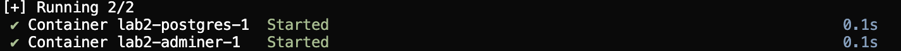
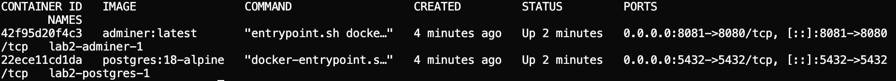
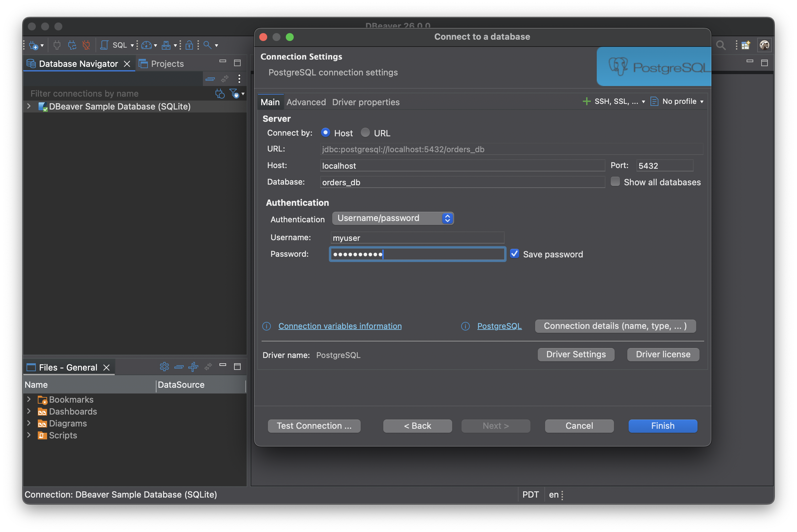
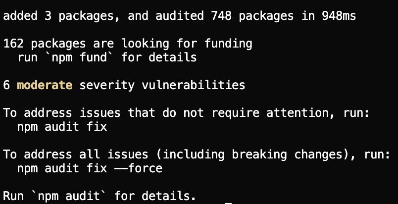
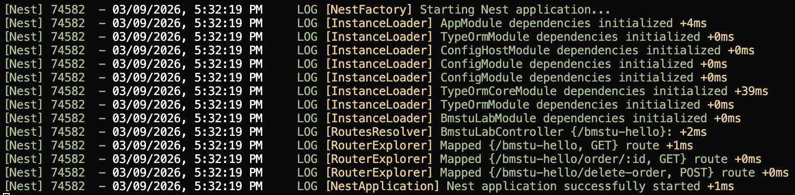
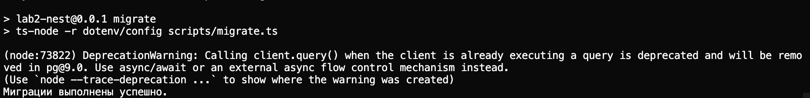
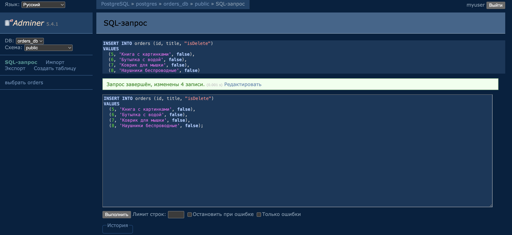
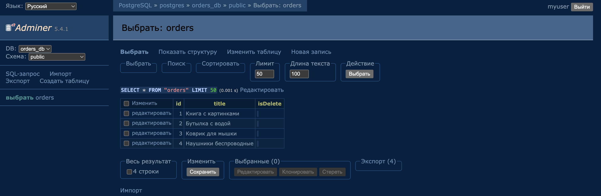
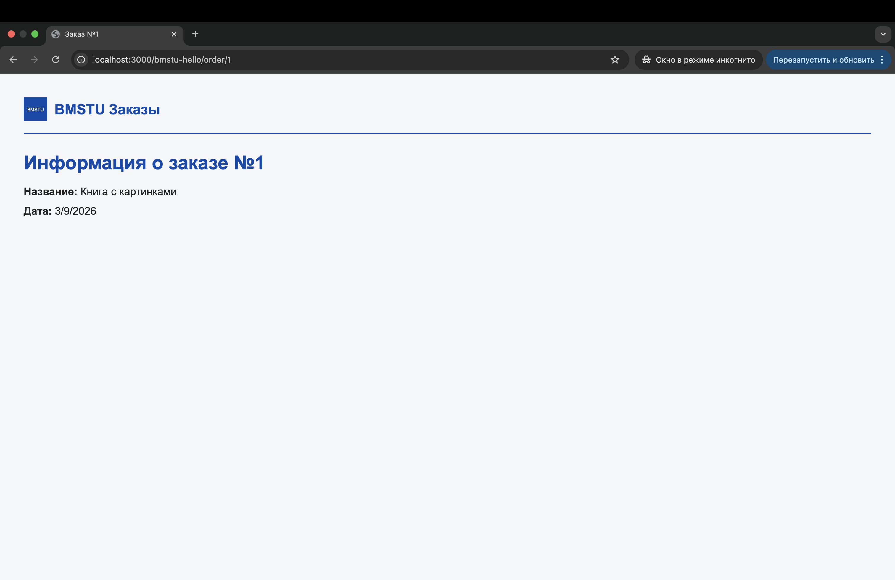
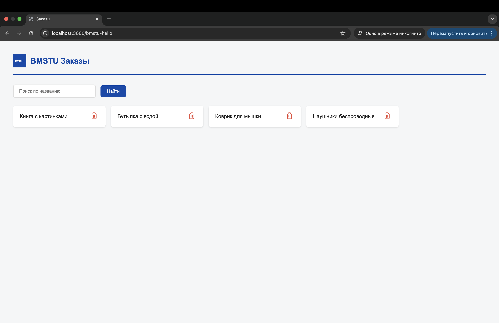

# Методические указания №2 NestJS (TS, Nest, PostgreSQL, TypeORM)

Для выполнения потребуется:
- **[Node.js (LTS)](https://nodejs.org/en/download/)**
- **npm** или **yarn**
- **[Docker](https://www.docker.com/products/docker-desktop/)** и **Docker Compose** (для PostgreSQL)
- Редактор кода **[Visual Studio Code](https://code.visualstudio.com/)**

---

## План работы

1. Работа с PostgreSQL
   - Запуск БД в Docker
   - Создание базы данных
2. Подключение к БД через IDE
   - DBeaver, pgAdmin или DataGrip
3. Конфигурация и переменные окружения
   - ConfigModule
   - Файл `.env`
4. Подключение к БД (TypeORM)
   - Установка зависимостей
   - Настройка модуля
   - Миграции (отдельная команда)
5. Перенос заказов в PostgreSQL 
   - Сущность Order
   - Сервис, контроллер, шаблоны
   - Заполнение БД
6. Страница «подробнее» (заказ). Пользуемся курсором
7. Удаление заказа (мягкое удаление)
8. FAQ

---

# 1. Работа с PostgreSQL

PostgreSQL — это мощная реляционная СУБД с открытым исходным кодом. В этой лабораторной мы используем её как постоянное хранилище заказов вместо массива в памяти.

**Что делаем на этапе:** поднимаем БД и веб-инструмент Adminer в контейнерах.

**Зачем это нужно:** вы получаете одинаковую среду на любой машине, без ручной установки PostgreSQL в систему и с быстрым перезапуском через одну команду.

## Запуск PostgreSQL в Docker

Процесс запуска и настройки PostgreSQL в Docker-контейнере при помощи docker-compose подробно описан в методических указаниях вашего курса. Ниже приведён минимальный пример конфигурации.

Создайте в корне проекта (рядом с `package.json`) файл `docker-compose.yml`:

```yaml
services:
  postgres:
    image: postgres:18-alpine
    environment:
      POSTGRES_USER: myuser
      POSTGRES_PASSWORD: mypassword
      POSTGRES_DB: orders_db
    ports:
      - "5432:5432"
    volumes:
      - postgres_data:/var/lib/postgresql/data

  adminer:
    image: adminer:latest
    ports:
      - "8081:8080"
    depends_on:
      - postgres

volumes:
  postgres_data:
```

**Объяснение:**
- `postgres` — сервис с базой данных PostgreSQL 18
- `adminer` — веб-интерфейс для работы с БД (альтернатива pgAdmin)
- `postgres_data` — том для сохранения данных между перезапусками контейнера

Запуск выполняется командой:

```bash
docker-compose up -d
```




Проверить статус контейнеров можно командой `docker ps`. Убедитесь, что контейнеры `postgres` и `adminer` находятся в состоянии «Up».



---

# 2. Подключение к БД через IDE

Перед тем как подключать NestJS к базе данных, полезно убедиться, что подключение работает. Для этого используйте один из инструментов: **DBeaver**, **pgAdmin** или **DataGrip**.

**Что делаем на этапе:** вручную подключаемся к БД клиентом.

**Зачем это нужно:** если подключение не работает уже здесь, дальнейшая отладка NestJS будет сложнее — лучше сразу проверить хост, порт и креды отдельно от приложения.

## Создание соединения в DBeaver

1. Откройте DBeaver и создайте новое соединение (Database → New Database Connection).
2. Выберите **PostgreSQL**.
3. Укажите параметры:
   - **Host:** `localhost`
   - **Port:** `5432`
   - **Database:** `orders_db`
   - **Username:** `myuser`
   - **Password:** `mypassword`
4. Нажмите «Test Connection» для проверки.
5. Сохраните соединение.




Аналогичные шаги выполняются в pgAdmin или DataGrip — параметры подключения остаются теми же.

---

# 3. Конфигурация и переменные окружения

В реальных проектах параметры подключения к БД, порты и секреты не хранят в коде. Их выносят в **переменные окружения** или файлы конфигурации.

## Файлы конфигурации vs переменные окружения

### Файлы конфигурации
Обычно это `json`, `yaml`, `toml` и другие форматы, где хранятся настройки приложения.

**Плюсы:**
- удобно хранить структурированные параметры;
- легко читать и документировать.

**Минусы:**
- не подходят для секретов, если файл может попасть в репозиторий;
- сложнее переопределять значения в CI/CD и контейнерах.

### Переменные окружения (`.env`)
Это пары ключ-значение, которые приложение читает при запуске (`DB_HOST`, `DB_PORT` и т.д.).

**Плюсы:**
- стандартный подход для Docker и deployment;
- легко менять окружения (`dev`, `test`, `prod`) без правки кода.

**Минусы:**
- при большом количестве переменных сложнее поддерживать порядок без документации.

**Почему в этой лабораторной выбираем `.env`:** так проще показать переносимые настройки БД и сделать запуск проекта одинаковым для всех.

## Установка ConfigModule

NestJS предоставляет модуль `@nestjs/config` для работы с переменными окружения. Установите его:

```bash
npm install @nestjs/config
```


## Файл переменных окружения

Создайте в корне проекта файл `.env`:

```env
DB_HOST=localhost
DB_PORT=5432
DB_USERNAME=postgres
DB_PASSWORD=postgres
DB_DATABASE=orders_db
```

**Важно:** Добавьте `.env` в `.gitignore`, чтобы не допустить попадания паролей в репозиторий.


## Подключение ConfigModule в приложении

В `app.module.ts` импортируйте `ConfigModule` и сделайте его глобальным:

```ts
import { Module } from '@nestjs/common';
import { ConfigModule } from '@nestjs/config';
import { BmstuLabModule } from './bmstu_lab/bmstu_lab.module';

@Module({
  imports: [
    ConfigModule.forRoot({
      isGlobal: true,
    }),
    BmstuLabModule,
  ],
})
export class AppModule {}
```

Теперь переменные из `.env` будут доступны во всём приложении через `ConfigService`.

---

# 4. Подключение к БД (TypeORM)

**TypeORM** — популярный ORM для TypeScript и Node.js. Он позволяет работать с базой данных через объекты и сущности вместо сырых SQL-запросов.

**Что делаем на этапе:** подключаем ORM к PostgreSQL через `ConfigService` и `.env`.

**Зачем это нужно:** код становится чище, а структура таблиц описывается в сущностях TypeScript.

## Установка зависимостей

Установите TypeORM, драйвер PostgreSQL и адаптер для NestJS:

```bash
npm install @nestjs/typeorm typeorm pg
```




## Настройка TypeORM в AppModule

Обновите `app.module.ts`, добавив асинхронную конфигурацию TypeORM:

```ts
import { Module } from '@nestjs/common';
import { ConfigModule, ConfigService } from '@nestjs/config';
import { TypeOrmModule } from '@nestjs/typeorm';
import { BmstuLabModule } from './bmstu_lab/bmstu_lab.module';

@Module({
  imports: [
    ConfigModule.forRoot({ isGlobal: true }),
    TypeOrmModule.forRootAsync({
      imports: [ConfigModule],
      inject: [ConfigService],
      useFactory: (config: ConfigService) => ({
        type: 'postgres',
        host: config.get('DB_HOST', 'localhost'),
        port: config.get('DB_PORT', 5432),
        username: config.get('DB_USERNAME'),
        password: config.get('DB_PASSWORD'),
        database: config.get('DB_DATABASE'),
        autoLoadEntities: true,
        synchronize: false,
      }),
    }),
    BmstuLabModule,
  ],
})
export class AppModule {}
```

> **Важно:** `synchronize: false` — таблицы создаются отдельной командой миграции (см. ниже).



## Миграции (отдельная команда)

Таблицы создаются **отдельной командой**, а не при каждом запуске приложения. Создайте скрипт `scripts/migrate.ts`:

```ts
import { DataSource } from 'typeorm';
import { Order } from '../src/bmstu_lab/entities/order.entity';

const dataSource = new DataSource({
  type: 'postgres',
  host: process.env.DB_HOST || 'localhost',
  port: parseInt(process.env.DB_PORT || '5432', 10),
  username: process.env.DB_USERNAME,
  password: process.env.DB_PASSWORD,
  database: process.env.DB_DATABASE,
  entities: [Order],
  synchronize: true,
});

async function run() {
  await dataSource.initialize();
  await dataSource.synchronize();
  console.log('Миграции выполнены успешно.');
  await dataSource.destroy();
  process.exit(0);
}

run().catch((err) => {
  console.error('Ошибка миграций:', err);
  process.exit(1);
});
```

Добавьте в `package.json` скрипт:

```json
"migrate": "ts-node -r dotenv/config scripts/migrate.ts"
```

Установите dotenv (если ещё не установлен): `npm install dotenv`

Запуск миграций:

```bash
npm run migrate
```



---

# 5. Перенос заказов в PostgreSQL 

Теперь данные хранятся в PostgreSQL вместо массива в памяти. Добавляются поиск, страница «подробнее» и мягкое удаление.

**Что делаем на этапе:** переносим модель заказа в сущность, подключаем репозиторий, обновляем сервис и контроллер.

**Зачем это нужно:** логика Lab 1 сохраняется, но источник данных становится реальным и масштабируемым.

## Сущность Order

Создайте папку `src/bmstu_lab/entities` и файл `order.entity.ts`:

```ts
import { Entity, PrimaryColumn, Column } from 'typeorm';

@Entity('orders')
export class Order {
  @PrimaryColumn()
  id: number;

  @Column({ type: 'varchar', length: 100 })
  title: string;

  @Column({ type: 'boolean', default: false })
  isDelete: boolean;
}
```

Поле `isDelete` используется для **мягкого удаления** — мы не удаляем запись из БД, а помечаем её как удалённую.

## Регистрация сущности в модуле

Обновите `bmstu_lab.module.ts`:

```ts
import { Module } from '@nestjs/common';
import { TypeOrmModule } from '@nestjs/typeorm';
import { BmstuLabController } from './bmstu_lab.controller';
import { BmstuLabService } from './bmstu_lab.service';
import { Order } from './entities/order.entity';

@Module({
  imports: [TypeOrmModule.forFeature([Order])],
  controllers: [BmstuLabController],
  providers: [BmstuLabService],
})
export class BmstuLabModule {}
```

## Сервис (bmstu_lab.service.ts)

Сервис отвечает за работу с данными. Вместо массива в памяти теперь используем репозиторий TypeORM:

```ts
import { Injectable } from '@nestjs/common';
import { InjectRepository } from '@nestjs/typeorm';
import { Repository, Like } from 'typeorm';
import { Order } from './entities/order.entity';

@Injectable()
export class BmstuLabService {
  constructor(
    @InjectRepository(Order)
    private orderRepository: Repository<Order>,
  ) {}

  async getAllOrders(): Promise<Order[]> {
    return this.orderRepository.find({ where: { isDelete: false } });
  }

  async searchOrdersByTitle(title: string): Promise<Order[]> {
    return this.orderRepository.find({
      where: {
        title: Like(`%${title}%`),
        isDelete: false,
      },
    });
  }

  /**
   * Получение заказа по ID — реализовано через КУРСОР (raw SQL).
   */
  async getOrderById(id: number): Promise<Order | null> {
    const rows = await this.orderRepository.query(
      `SELECT id, title
       FROM orders
       WHERE id = $1 AND "isDelete" = false`,
      [id],
    );
    return rows[0] ?? null;
  }

  async deleteOrder(orderId: number): Promise<void> {
    await this.orderRepository.update({ id: orderId }, { isDelete: true });
  }
}
```

> **Примечание:** Метод `getOrderById` реализован через **курсор** — сырой SQL-запрос и чтение одной строки результата. В отличие от `findOne()`, здесь явно выполняется запрос и читается первая строка.

## Контроллер (bmstu_lab.controller.ts)

Контроллер сохраняет префикс маршрутов `bmstu-hello`:

```ts
import { Controller, Get, Post, Param, Render, Query, Body, ParseIntPipe, NotFoundException, Redirect } from '@nestjs/common';
import { BmstuLabService } from './bmstu_lab.service';

@Controller('bmstu-hello')
export class BmstuLabController {
  constructor(private readonly bmstuLabService: BmstuLabService) {}

  @Get()
  @Render('orders')
  async getAllOrders(@Query('search') search?: string) {
    const data = search
      ? await this.bmstuLabService.searchOrdersByTitle(search)
      : await this.bmstuLabService.getAllOrders();
    return { data, search: search || '' };
  }

  @Get('order/:id')
  @Render('order')
  async getOrderById(@Param('id', ParseIntPipe) id: number) {
    const order = await this.bmstuLabService.getOrderById(id);
    if (!order) {
      throw new NotFoundException('Заказ не найден');
    }
    return { ...order, current_date: new Date().toLocaleDateString() };
  }

  @Post('delete-order')
  @Redirect('/bmstu-hello', 302)
  async deleteOrder(@Body('order_id') orderId: string) {
    const id = parseInt(orderId, 10);
    if (!isNaN(id)) {
      await this.bmstuLabService.deleteOrder(id);
    }
  }
}
```

## Шаблон списка заказов (views/orders.hbs)

Создайте `views/orders.hbs`:

```html
<!DOCTYPE html>
<html lang="ru">
<head>
  <meta charset="UTF-8">
  <meta name="viewport" content="width=device-width, initial-scale=1.0">
  <title>Заказы</title>
  <link rel="stylesheet" href="/styles/orders.css">
</head>
<body>
  <header class="site-header">
    <a href="/bmstu-hello" class="home-link">
      
      <span class="logo-text">BMSTU Заказы</span>
    </a>
  </header>
  <div class="container">
    <form action="/bmstu-hello" method="GET" class="search-bar">
      <input type="text" name="search" placeholder="Поиск по названию" value="{{search}}">
      <button type="submit">Найти</button>
    </form>
    <div class="content">
      {{#each data}}
      <div class="order-card-wrapper">
        <a href="/bmstu-hello/order/{{this.id}}" class="order-card">
          <h3>{{this.title}}</h3>
        </a>
        <form action="/bmstu-hello/delete-order" method="POST" class="delete-form">
          <input type="hidden" name="order_id" value="{{this.id}}">
          <button type="submit" class="delete-btn">
            
          </button>
        </form>
      </div>
      {{/each}}
    </div>
  </div>
</body>
</html>
```

## Заполнение базы данных

После выполнения `npm run migrate` таблица `orders` будет создана. Заполните её тестовыми данными через Adminer, DBeaver или pgAdmin.

Откройте Adminer: [http://localhost:8081](http://localhost:8081) (логин: `myuser`, пароль: `mypassword`, БД: `orders_db`).

Выполните SQL-запрос:

```sql
INSERT INTO orders (id, title, "isDelete")
VALUES
  (1, 'Книга с картинками', false),
  (2, 'Бутылка с водой', false),
  (3, 'Коврик для мышки', false),
  (4, 'Наушники беспроводные', false);
 ``` 






---

# 6. Страница «подробнее» (страница заказа). Пользуемся курсором

Для получения данных одного заказа по ID используется метод `getOrderById`, реализованный через **курсор** — сырой SQL-запрос и чтение одной строки результата. Это демонстрирует работу с БД на уровне raw-запросов.

Метод `getOrderById` в сервисе выполняет `query()` и возвращает `rows[0]` — первую строку результата.

## Шаблон страницы заказа (views/order.hbs)

Создайте `views/order.hbs` для детальной информации о заказе:

```html
<!DOCTYPE html>
<html lang="ru">
<head>
  <meta charset="UTF-8">
  <meta name="viewport" content="width=device-width, initial-scale=1.0">
  <title>Заказ №{{id}}</title>
  <link rel="stylesheet" href="/styles/order.css">
</head>
<body>
  <header class="site-header">
    <a href="/bmstu-hello" class="home-link">
      
      <span class="logo-text">BMSTU Заказы</span>
    </a>
  </header>
  <div class="container">
    <h1>Информация о заказе №{{id}}</h1>
    <p><b>Название:</b> {{title}}</p>
    <p><b>Дата:</b> {{current_date}}</p>
  </div>
</body>
</html>
```



---

# 7. Удаление заказа (мягкое удаление)

Мягкое удаление — это не физическое удаление записи из БД, а установка флага `isDelete = true`. Такие записи не показываются в списках, но остаются в базе для аудита.

## Метод в сервисе

```ts
async deleteOrder(orderId: number): Promise<void> {
  await this.orderRepository.update(
    { id: orderId },
    { isDelete: true },
  );
}
```

## Обработчик в контроллере

```ts
@Post('delete-order')
@Redirect('/bmstu-hello', 302)
async deleteOrder(@Body('order_id') orderId: string) {
  const id = parseInt(orderId, 10);
  if (!isNaN(id)) {
    await this.bmstuLabService.deleteOrder(id);
  }
}
```

Не забудьте импортировать `Redirect` и `Body` из `@nestjs/common`.

## Форма удаления в шаблоне

В `views/orders.hbs` в каждой карточке заказа добавлена форма с кнопкой удаления (см. пример в разделе 5).




---

## Итоговая структура проекта

```
bmstu_lab/
├── src/
│   ├── main.ts
│   ├── app.module.ts
│   └── bmstu_lab/
│       ├── bmstu_lab.module.ts
│       ├── bmstu_lab.controller.ts
│       ├── bmstu_lab.service.ts
│       └── entities/
│           └── order.entity.ts
├── views/
│   ├── orders.hbs
│   └── order.hbs
├── public/
│   ├── styles/
│   │   ├── orders.css
│   │   └── order.css
│   └── img/
│       ├── logo.svg
│       └── deleteicon.svg
├── scripts/
│   └── seed.sql
├── .env
├── docker-compose.yml
└── package.json
```

# FAQ

#### Где изучить больше по NestJS и TypeORM?

- [NestJS Documentation](https://docs.nestjs.com)
- [TypeORM Documentation](https://typeorm.io)
