# Методические указания по выполнению лабораторной работы №2

## Работа с PostgreSQL

Процесс запуска и настройки PostgreSQL в Docker-контейнере при помощи docker-compose подробно описан в [соответствующих методических указаниях](../lab2-db/README.md).

При объяснении интеграции Python и Django с PostgreSQL я буду исходить из того, что сам PostgreSQL у вас уже поднят и доступен для подключения.

## Работа с PostgreSQL из Python

Для начала разберём пример работы с PostgreSQL из Python **без Django ORM**.

Установим при помощи пакетного менеджера `pip` пакет `psycopg2-binary`, который содержит классы и функции для взаимодействия с PostgreSQL:

```shell
pip install psycopg2-binary
```

Создадим в нашей БД таблицу `books`:

```sql
CREATE TABLE books (
    id SERIAL PRIMARY KEY,
    name VARCHAR(30) NOT NULL,
    description VARCHAR(255) NOT NULL
);
```

Напишем небольшой скрипт, который:
1. Подключается к БД
2. Добавляет новую запись в таблицу в таблицу `books`

```python
import psycopg2


conn = psycopg2.connect(
            host="localhost",
            port="5432",
            user="postgres",
            password="postgres",
            dbname="postgres")

cursor = conn.cursor()

query = "INSERT INTO books (id, name, description) VALUES(1, 'Мастер и Маргарита', 'Крутая книга')"

cursor.execute(query)

conn.commit()

cursor.close()
conn.close()
```

## Работа с Django ORM

Django ORM позволяет работать с БД как с Python-объектами, что облегчает и ускоряет разработку. Однако стоит помнить, что в некоторых случаях сложные SQL-запросы, составленные при помощи ORM, могут быть менее оптимальны, чем составленные разработчиком вручную.

С полными возможностями Django ORM можно ознакомиться в [официальной документации](https://docs.djangoproject.com/en/5.1/topics/db/).

Перейдем к рассмотрению возможностей Django ORM для решения задач лабораторной работы. Возьмём за основу проект, созданный в рамках [предыдущей лабораторной работы](../lab1-py/lab1_tutorial.md) и добавим в него интеграцию с PostgreSQL.

Разобьём всю работу на 5 этапов:

1. Реализация без Django ORM
2. Настройка подключения к БД и создание модели услуг
3. Создание моделей заявок и модели для связи many-to-many (услуги в заявке)
4. Получение данных об услуге при помощи курсора
5. Удаление и фильтрация услуг

Для простоты объяснения выберем предметную область "Интернет-магазин". Услуги - товары, заявки - заказы, который собирает и оформляет покупатель.

### Реализация без Django ORM

#### База

Будем основываться на проекте, созданном в [предыдущей лабораторной работе](../lab1-py/lab1_tutorial.md).

**Структура проекта**

```
.
├── bmstu
│   ├── asgi.py
│   ├── __init__.py
│   ├── settings.py
│   ├── urls.py
│   └── wsgi.py
├── bmstu_lab
│   ├── admin.py
│   ├── apps.py
│   ├── __init__.py
│   ├── migrations
│   │   ├── __init__.py
│   ├── models.py
│   ├── templates
│   │   ├── base.html
│   │   ├── product.html
│   │   └── products_list.html
│   ├── tests.py
│   └── views.py
├── db.sqlite3
└── manage.py
```

**urls.py**

```python
from django.contrib import admin
from django.urls import path

from bmstu_lab import views


urlpatterns = [
    path('admin/', admin.site.urls),
    path('products/', views.get_products_list_page, name='products_list'),
    path('products/<int:product_id>/', views.get_product_page, name='product'),
]
```

Файл, в котором сопоставляются URL и функции-обработчики.

**base.html**
```html
<!doctype html>
<html lang="en" class="h-100">
<head>
    <meta charset="utf-8">
    <title></title>
</head>
<body>
<div class="container">
    
</div>
</body>
</html>
```

Базовый шаблон страницы, который наследуют остальные страницы. Удобно использовать, чтобы не дублировать общую структуру html-документа.

**views.py**

```python
PRODUCTS_LIST = [
    {
        "id": 1,
        "title": "Хлеб",
        "price": 35,
    },
    {
        "id": 2,
        "title": "Молоко",
        "price": 80,
    },
    {
        "id": 3,
        "title": "Сыр",
        "price": 300,
    },
    {
        "id": 4,
        "title": "Сыр косичка",
        "price": 300,
    },
    {
        "id": 5,
        "title": "Колбаса",
        "price": 500,
    }
]

ITEMS_IN_CART = 2
```

Файл, в котором задаются функции-обработчики, рендерящие страницы приложения.

#### Страница списка услуг

**views.py**
```python
def get_products_list_page(request):
    """
    Получение страницы списка товаров
    """
    product_title = request.GET.get('product_title', '')
    products = [product for product in PRODUCTS_LIST if product['title'].lower().startswith(product_title.lower())]
    return render(request,
                  'products_list.html',
                  {
                      "data": {
                          "products": products, 
                          "product_title": product_title,
                          "items_in_cart": ITEMS_IN_CART,
                      }
                  })

```

Функция-обработчик для рендера страницы списка заказов.

**products_list.html**
```html


Товары


    Корзина [{{ data.items_in_cart }}]
    <h1>Список товаров</h1>
    <form action="" method="get" class="d-flex mt-4 mb-4">
        <input class="form-control" placeholder="Поиск" aria-label="Поиск" name="product_title" type="text"
               value="{{ data.product_title }}">
        <input type="submit" class="btn dark-blue-btn ml-3 mr-3" value="Поиск">
    </form>
    <ul>
        
            <li><a href="">{{ product.title }}</a> - {{ product.price }} руб.</li>
        
            Товаров нет
        
    </ul>

```

Шаблон для рендера страницы списка заказов.

На странице реализован регистронезависимый поиск товаров по названию.

**Страница**

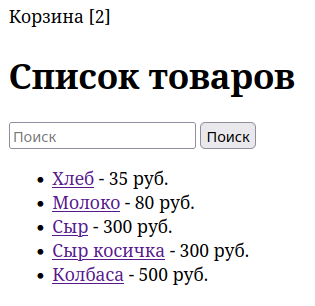

Пример работы поиска:

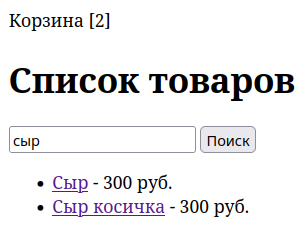
#### Страница услуги

**views.py**
```python
def get_product_page(request, product_id):
    """
    Получение страницы товара
    """

    for product in PRODUCTS_LIST:
        if product["id"] == product_id:
            return render(request,
                          "product.html",
                          {
                              "data": product
                          })
    return render(request, "product.html")
```

Функция-обработчик для рендера страницы заказа.

**product.html**
```html


Товар


    <h1>Информация о товаре "{{ data.title }}"</h1>
    <li>Название: <strong>{{ data.title }}</strong></li>
    <li>Цена: <strong>{{ data.price }} руб.</strong></li>

```

Шаблон для рендера страницы заказа.

**Страница**

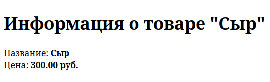
### Настройка подключения к БД и создание модели услуг

#### Настройка подключения к PostgreSQL

Добавим в наше приложение работу с PostgreSQL.

Для этого в **settings.py** необходимо указать:

```python
DATABASES = {
    'default': {
        'ENGINE': 'django.db.backends.postgresql',
        'NAME': 'postgres',
        'USER': 'postgres',
        'PASSWORD': 'postgres',
        'HOST': 'localhost',
        'PORT': 5432,
    }
}
```

После чего применим автоматически созданные миграции Django:

```shell
python3 manage.py migrate
```

Если все подключения настроены верно, в терминале увидим сообщение:

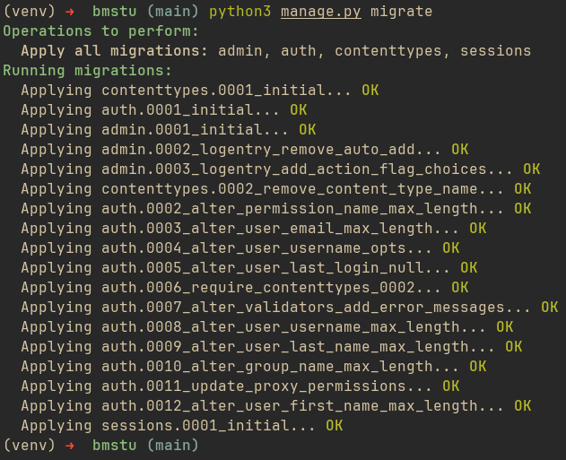
#### Создание модели услуг

Добавим модель товара (услуги) в **models.py**:

```python
from django.db import models

class Product(models.Model):
    title = models.CharField(max_length=255)
    price = models.DecimalField(max_digits=10, decimal_places=2)
    is_active = models.BooleanField(default=True)

    def __str__(self):
        return self.title
```

При помощи [dunder-метода](https://tproger.ru/articles/dunder-metody-zachem-oni-nuzhny-i-chto-mogut) "\_\_str\_\_"  можно задать строкое представление модели. Оно будет использоваться, в том числе на странице списка объектов модели в [админке Django](https://docs.djangoproject.com/en/5.1/ref/contrib/admin/).

Если не добавляеть метод "\_\_str\_\_", страница будет выглядеть так:

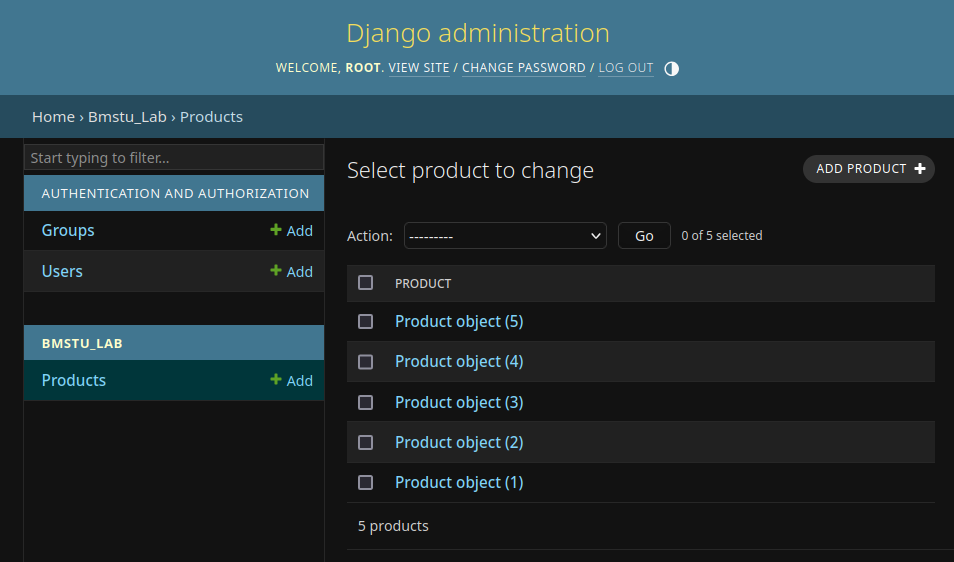

а если добавить, то так:


Согласитесь, второй вариант нагляднее.

Создадим миграцию:

```shell
python3 manage.py makemigrations
```

Если миграция создана успешно, увидим сообщение:

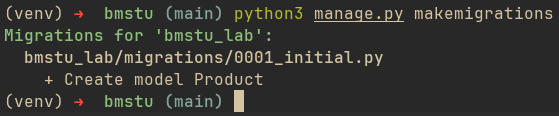

Применим созданную миграцию:

```shell
python3 manage.py migrate
```

Если миграция применена успешно, увидим сообщение:

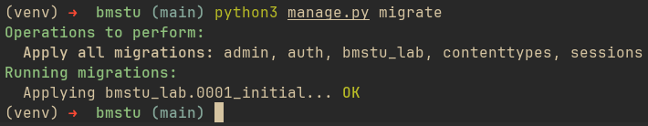

Добавим товары в таблицу SQL-запросом, например, при помощи [PgAdmin](https://www.pgadmin.org/):

```sql
INSERT INTO public.bmstu_lab_product (id, title, price, is_active) VALUES
(1, 'Хлеб', 35, True),
(2, 'Молоко', 80, True),
(3, 'Сыр', 300, True),
(4, 'Сыр косичка', 300, True),
(5, 'Колбаса', 500, True);
```

Посмотрим на получившуюся табличку:

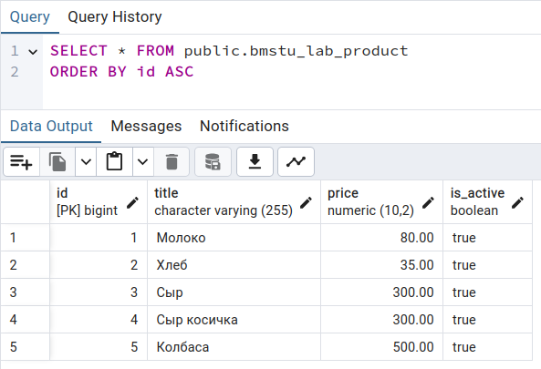

Перепишем метод получения страницы списка товаров. Добавим использование Django ORM:

```python
def get_products_list_page(request):
    """
    Получение страницы списка товаров
    """
    product_title = request.GET.get('product_title', '')

    return render(request,
                  'products_list.html',
                  {
                      "data": {
                          "products": Product.objects.filter(title__istartswith=product_title),
                          "items_in_cart": ITEMS_IN_CART, 
                          "product_title": product_title,
                      }
                  })

```

При помощи функции `Product.objects.filter(title__istartswith=product_title)` выбираем из БД объекты модели `Product`, у которых название (`title`) начинается со (`startswith`) строки `product_title` без учета регистра символов в строках (`i`).

### Создание моделей заявок и связи услуги-заявки

Добавим 2 оставшиеся модели (заявок и связи услуги-заявки) в файл **models.py**

#### Создание модели заявки

```python
from django.contrib.auth.models import User

# ...

class Order(models.Model):
    class OrderStatus(models.TextChoices):
        DRAFT = "DRAFT"
        DELETED = "DELETED"
        FORMED = "FORMED"
        COMPLETED = "COMPLETED"
        REJECTED = "REJECTED"

    status = models.CharField(
        max_length=10,
        choices=OrderStatus.choices,
        default=OrderStatus.DRAFT,
    )

    creation_datetime = models.DateTimeField(auto_now_add=True)
    formation_datetime = models.DateTimeField(blank=True, null=True)
    completion_datetime = models.DateTimeField(blank=True, null=True)
    client = models.ForeignKey(User, on_delete=models.DO_NOTHING, related_name='created_orders')
    manager = models.ForeignKey(User, on_delete=models.DO_NOTHING, related_name='managed_orders', blank=True, null=True)

    def __str__(self):
        return f"Заказ № {self.id}"
```

Поскольку множество статусов, в которых может находиться заказ, ограничено, создадим класс `OrderStatus`, в котором опишем все возможные статусы.

Далее зададим ограничения для поля status: `choices=OrderStatus.choices` и установим дефолтное значение: `default=OrderStatus.DRAFT`.

С методом \_\_str\_\_ вы уже знакомы. Зададим в нём челочеко-читаемое строковое представление объекта заказа.

#### Создание модели связи "услуги-заявки"

```python
class ProductInOrder(models.Model):
    order = models.ForeignKey(Order)
    product = models.ForeignKey(Product)
    quantity = models.CharField(max_length=255)

    def __str__(self):
        return f"{self.order_id}-{self.product_id}"

    class Meta:
        unique_together = ('order', 'product'),
```

Поскольку в одной заявке не может быть 2 одинаковых услуги, зададим это ограничение:

```python
    class Meta:
        unique_together = ('order', 'product'),
```

Пара значений "заказ-продукт" должны быть уникальны в рамах одной строки. При этом один заказ может содержать несколько продуктов и один продукт может находиться в нескольких заказах.

#### Регистрация в админке

Для того, чтобы объектами созданных моделей можно было управлять в админке Django, их необходимо зарегистрировать в файле **admin.py**:

```python
from django.contrib import admin

from bmstu_lab.models import Product, Order, ProductInOrder

admin.site.register(Product)
admin.site.register(Order)
admin.site.register(ProductInOrder)
```

#### Миграции и заполнение данными

Создадим и применим миграции:


Если ранее вы не создавали супер-пользователя для нашего проекта, самое время это сделать. Выполним команду:

```shell
python3 manage.py createsuperuser
```

зададим его логин и пароль:


Запись о созданном пользователе можно увидеть в таблице "auth_user":


Далее при помощи SQL-запросов создадим черновик заявки для нашего пользователя и наполним его товарами:

```sql
INSERT INTO public.bmstu_lab_order (status, creation_datetime, client_id) VALUES
('DRAFT', NOW(), 1);
```

```sql
INSERT INTO public.bmstu_lab_productinorder (quantity, order_id, product_id) VALUES
(2, 1, 1),
(1, 1, 2),
(3, 1, 3);
```

Посмотрим на созданные объекты при помощи админки Django. Для этого откроем страницу http://127.0.0.1:8000/admin и введём логин и пароль созданного супер-пользователя.

Список услуг (товаров):


Список заявок (заказов):

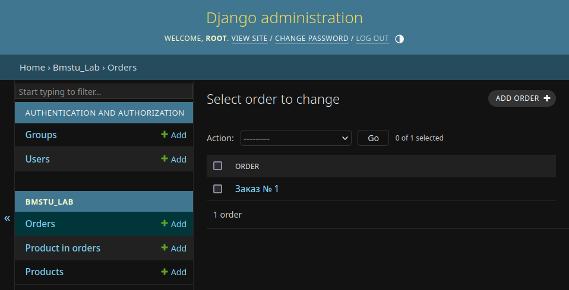

Список связей "услуга-заявка" (товары в заказах):

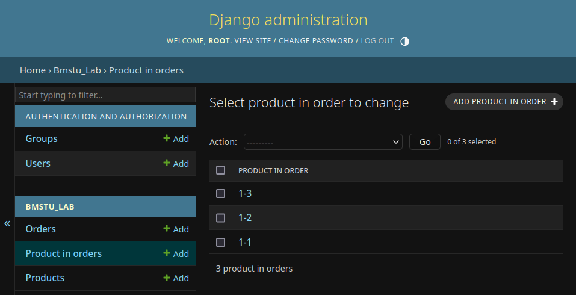

#### Метод получения страницы списка товаров

Поправим метод получения страницы списка товаров. Заменим использование константы `ITEMS_IN_CART` на запрос в БД.

```python
def get_products_list_page(request):
    """
    Получение страницы списка товаров
    """
    product_title = request.GET.get('product_title', '')

    products_in_draft_order = ProductInOrder.objects.filter(
        order__client=User.objects.get(username="root"),
        order__status=Order.OrderStatus.DRAFT
    ).count()
    return render(request,
                  'products_list.html',
                  {
                      "data": {
                          "products": Product.objects.filter(title__istartswith=product_title),
                          "product_title": product_title,
                          "items_in_cart": products_in_draft_order,
                      }
                  })

```

Запустим сервер и посмотрим на страницу списка товаров:

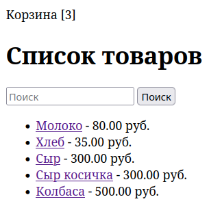

### Получение данных при помощи курсора

Перепишем метод рендеринга страницы товара. Добавим получение информации о товаре из БД.

Будем получать данные о товаре из БД при помощи raw SQL запроса

```python
def get_product_page(request, product_id):
    """
    Получение страницы товара
    """

    query = "SELECT title, price FROM bmstu_lab_product WHERE id = %s"

    with connection.cursor() as cursor:
        cursor.execute(query, [product_id])
        row = cursor.fetchone()

    if not row:
        return render(request, 'product.html')

    return render(request,
                  "product.html",
                  {
                      "data": {
	                      "id": product_id,
                          "title": row[0],
                          "price": row[1],
                      },
                  })
```

Запустим сервер и посмотрим на страницу товара:

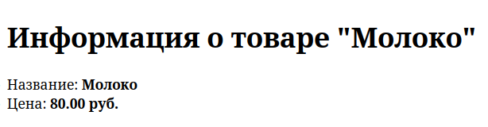
### Удаление и фильтрация услуг

#### Удаление услуг

Реализуем возможность удалять услуги. Вместо выполнения операции `DELETE` будем проставлять значение поля `isActive` = `false`.

Для начала добавим новый url в **urls.py**:

```python
# ...

urlpatterns = [
    # ...
    path('remove_product/<int:product_id>/', views.remove_product, name='remove_product'),
]
```

Затем добавим ещё один обработчик в **views.py**:

```python
def remove_product(request, product_id):
    if request.method != "POST":
        return redirect('products_list')
    try:
        product = Product.objects.get(id=product_id)
        product.is_active = False
        product.save()
        return redirect('products_list')
    except Product.DoesNotExist:
        return redirect('products_list')
```

В не зависимости от успешности удаления будем направлять пользователя на страницу списка товаров.

И добавим кнопку "Удалить товар" на страницу "Информация о товаре":

```html


Товар


    <h1>Информация о товаре "{{ data.title }}"</h1>
    <li>Название: <strong>{{ data.title }}</strong></li>
    <li>Цена: <strong>{{ data.price }} руб.</strong></li>
    <form method="post" action="">
        
        <button name="remove_product">Удалить товар</button>
    </form>

```

**Страница "Информация о товаре"**

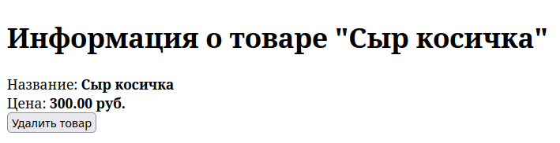

#### Фильтрация услуг

Поскольку теперь часть товаров может быть помечена как удалённые, нам не нужно выводить их в списке товаров, а так же отображать информацию по ним.

Отредактируем соответствующие обработчики, добавив фильтрации по значению поля `is_active`:

**Страница списка товаров:**

```python
def get_products_list_page(request):
    """
    Получение страницы списка товаров
    """
    product_title = request.GET.get('product_title', '')

    products_in_draft_order = ProductInOrder.objects.filter(
        order__client=User.objects.get(username="root"),
        order__status=Order.OrderStatus.DRAFT
    ).count()
    return render(request,
                  'products_list.html',
                  {
                      "data": {
                          "products": Product.objects.filter(title__istartswith=product_title, is_active=True),
                          "product_title": product_title,
                          "items_in_cart": products_in_draft_order,
                      }
                  })
```

**Страница "Информация о товаре":**

```python
def get_product_page(request, id):
    """
    Получение страницы товарa
    """

    query = "SELECT title, price FROM bmstu_lab_product WHERE id = %s AND is_active = True"

    with connection.cursor() as cursor:
        cursor.execute(query, [id])
        row = cursor.fetchone()

    if not row:
        return render(request, 'product.html')

    return render(request,
                  "product.html",
                  {
                      "data": {
						  "id": product_id,
                          "title": row[0],
                          "price": row[1],
                      },
                  })

```
#### Демонстрация

Удалим товар при помощи новой кнопки в интерфейсе.

Список товаров до удаления:

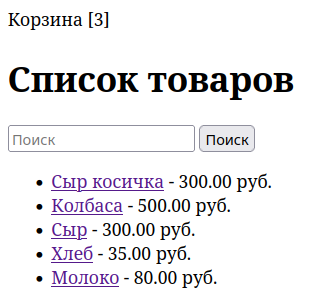

Удаляем товар (нажимаем кнопку):

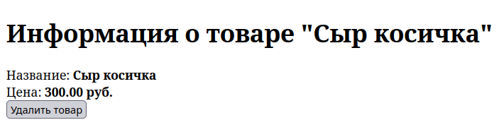

Список товаров после удаления:

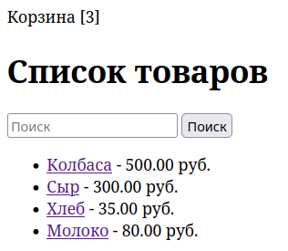

Удалим ещё один товар через админку Django. Уберём "галочку" возле поля "is active".

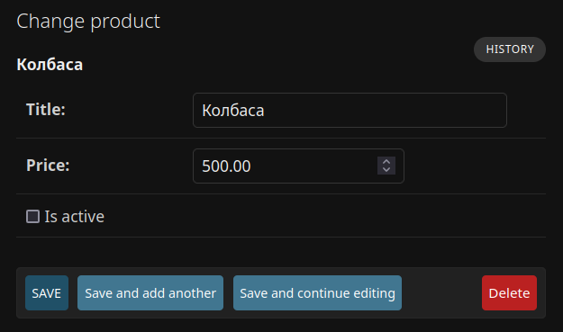

Список товаров после удаления второго товара:

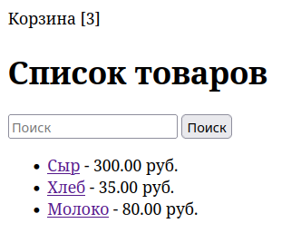
