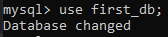
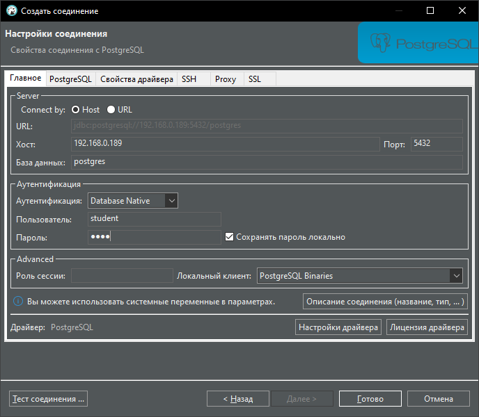
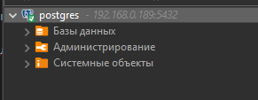
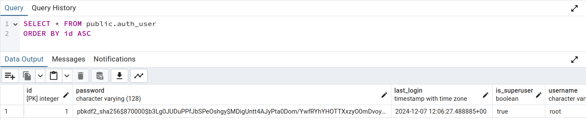
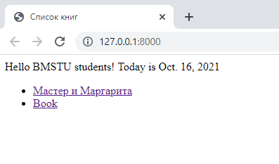
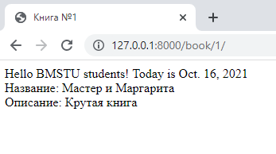
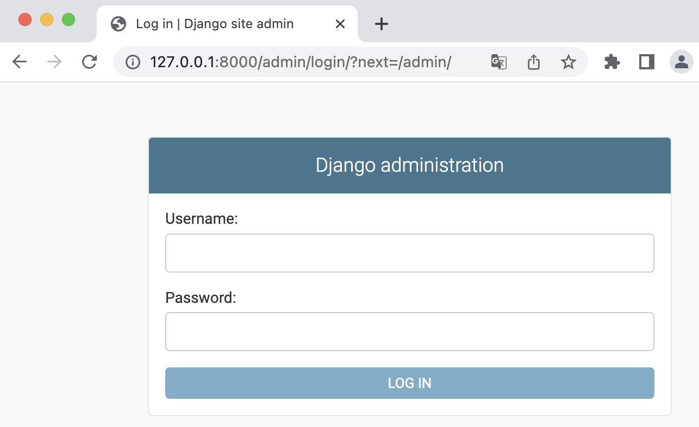

# Методические указания по выполнению лабораторной работы №2  

## Работа с PostgreSQL

На вирутальной машине уже установлен PostgreSQL, чтобы начать с ним взаимодействовать непосредственно на ВМ необходимо активировать терминальный клиент **psql** одноименной кома ндой

**ВНИМАНИЕ!** Если вы не пользуетесь кафедральной виртуальной машиной, а используете БД локально или как-то по-другому, то для активации терминального клиента в Linux надо использовать команду - **sudo -i -u postgres psql**.


Если вы устанавливаете PostgreSQL на свою машину самостоятельно, вам в помощь хорошая статья - [How To Install PostgreSQL on Ubuntu 20.04](https://www.digitalocean.com/community/tutorials/how-to-install-postgresql-on-ubuntu-20-04-quickstart)


Некоторые стандартные команды терминального клиента:
- **\l** - показать доступные базы данных
- **\с <имя базы>** - выбрать базу данных
- **\dt** - показать таблицы в выбранной базе данных
- **\d+ <имя таблицы>** - вывести схему таблицы

Для начала необходимо создать пользователя базы данных. На вирутальной машине он уже создан, его имя также - student

```sql
create user user_name with password 'mypassword';
```

После этого нужно создать базу данных. Этот шаг можно также сделать в дайльнейшем через IDE. Дефолтная база данных называется postgres.


```sql
createdb `student`;
```

И выдать права новому пользователю на эту базу данных.

```sql
grant all privileges on database student to user_name;;
```

Теперь можно создавать таблицу в этой базе данных, но сначала нужно в
нее перейти:



Чтобы создать таблицу нужно использовать команду create table.
Рассмотрим простой пример с созданием таблицы “книга”, в которой будет
название книги и ее описание:

```sql
CREATE TABLE books (
    id SERIAL PRIMARY KEY,
    name VARCHAR(30) NOT NULL,
    description VARCHAR(255) NOT NULL
);
```

Для добавления/чтения/обновления/удаления (CRUD) записей служат
команды INSERT, DELETE, UPDATE, SELECT. Подробно эти команды
рассмотрены в курсе баз данных.

```sql
INSERT INTO books (id, name, description) VALUES(1, 'Мастер и Маргарита', 'Крутая книга');

SELECT * FROM books;
```

## Подключение к БД через IDE
В данном случае пример показан на DBeaver, но вы можете использовать то IDE, которое для вас удобнее, например PG Admin или же DtaGrip

Открываем окно для создания соединения и выбираем PostgreSQL


Далее открывается окно, где необходимо прописать креды
Хост: vm_ip (в данном случае 192.168.0.189)
База данных: по умолчанию postgresql, но можно выбрать и свою: если вы создали его через psql
Пользователь: student
Пароль: root



После этого у вас должно установиться соединение с БД




## Обращение к БД из Python

В этой части лабораторной работы необходимо создать подключение из
Python к PostgreSQL, занести и выбрать несколько записей с помощью кода.

Для начала требуется установить пакет psycopg2-binary из pip. Это необходимый
набор классов и функций для работы с postgresql из вашего кода.

Команда для установки: `pip install psycopg2-binary`

В этой части вашей задачей является написание простого скрипта, который
подключается к базе данных, добавляет одну запись, затем получает и выводит
на экран все записи таблицы books, а затем удаляет все записи.

`Пример`

```python
import psycopg2

conn = psycopg2.connect(dbname="postgres", host="192.168.0.189", user="student", password="root", port="5432")

cursor = conn.cursor()
 
cursor.execute("INSERT INTO public.books (id, name, description) VALUES(1, 'Мастер и Маргарита', 'Крутая книга')")
 
conn.commit()   # реальное выполнение команд sql1
 
cursor.close()
conn.close()
```

`Итог`



## Django ORM

Django предоставляет удобные возможности для представления базы
данных в виде python-объектов. Django ORM
облегчает и ускоряет разработку. Однако необходимо помнить, что в случае
реализации сложных SQL-запросов бывает быстрее и выгоднее использовать
чистые запросы без ORM.

Для использования ORM требуется описать свои модели предметной
области в виде классов, наследованных от django.db.models.Model.

Примеры работы с ORM:
https://django.fun/docs/django/ru/3.2/topics/db/models/

Чтобы методы модели работали, необходимо указать настройки
подключения БД в `settings.py`

`settings.py`
```python
DATABASES = {
    'default': {
        'ENGINE': 'django.db.backends.postgresql',
        'NAME': 'first_db', # Имя вашей БД. Если вы создали черезе psql или IDE свою базу и хотите использовать его - пропишите его имя здесь
        'USER': 'dbuser',
        'PASSWORD': '123',
        'HOST': 'localhost',
        'PORT': 5432, # Стандартный порт PostgreSQL
    }
}
```

**ВНИМАНИЕ!** Если у вас сломались миграции и вылезают ошибки, их можно восстановить следующим образом:
1. Удалить все папки pycache
2. Удалить все файлы миграции (в папке migrations должен оставаться только файл __init__.py)
3. Удалить все таблицы из базы, она должна быть полностью пустой
4. python manage.py migrate --run-syncdb (синхронизирует приложение с бд, создает служебные таблицы)
5. python manage.py makemigrations <название вашего приложения>
6. python manage.py migrate <название вашего приложения>

**ВНИМАНИЕ!** Если у вас проект находится локально, а БД - на виртуальной машине, то в *HOST* прописываете IP виртуальной машины. Если же у вас и проект и БД на виртуальной машине или они оба на локальной машине, в *HOST* - пишете **127.0.0.1** или **localhost**.

В этой части лабораторной работы требуется самостоятельно создать
модели по предметной области из предыдущей лабораторной работы.

Вы можете создать классы моделей всех таблиц в вашей БД с помощью

```
python manage.py inspectdb
```

Все запросы к БД представляются в Django ORM в виде объектов QuerySet.
Это своеобразный “конструктор” запросов, который позволяет с помощью кода
“собрать” SQL-запрос. Примеры работы с queryset и моделями можно найти
здесь: https://django.fun/docs/django/ru/3.2/topics/db/queries/

Кроме возможности создать модели и управлять ими из кода, Django ORM
также позволяет создавать БД по описанию моделей, а также изменять
структуру БД при изменении моделей.

Для этих действий используются так называемые миграции. Это скрипты,
которыу выполняют преобразование схемы базы данных с помощью ALTER
TABLE.

Миграции в Django создаются с помощью команды `manage.py
makemigrations <название приложения>`. После того, как миграция создана
(скрипт миграции создался и добавился в папку migrations), ее нужно применить
с помощью команды `manage.py migrate <название приложения>`.

Все изменения моделей (или их создание) будут фиксироваться в
миграции. Если модели до миграции не было, значит после применения
миграции будет создана соответствующая таблица. Если модель изменена
(например, добавлено поле), после применения миграции это поле будет
добавлено в соответствующую таблицу.

`Пример`

`models.py`
```python
from django.db import models

# Create your models here.
class Book(models.Model):
    name = models.CharField(max_length=30)
    description = models.CharField(max_length=255)

    class Meta:
        managed = False
        db_table = 'books'
```

`urls.py`
```python
    path('', views.bookList),
    path('book/<int:id>/', views.GetBook, name='book_url')
```

`views.py`
```python
from bmstu_lab.models import Book

def bookList(request):
    return render(request, 'books.html', {'data' : {
        'current_date': date.today(),
        'books': Book.objects.all()
    }})

def GetBook(request, id):
    return render(request, 'book.html', {'data' : {
        'current_date': date.today(),
        'book': Book.objects.filter(id=id)[0]
    }})

```

`books.html`
```html



Список книг


<ul>
    
       
    
        <li>Список пуст</li>
    
</ul>

```

Содержимое `qw.html` здесь не описано. Его необходимо добавить самостоятельно на основе Лабораторной работы 1.

`book.html`
```html


Книга №{{ data.book.id }}


    <div>Название: {{ data.book.name }}</div>
        <div>Описание: {{ data.book.description }}</div>

```

`Итог`





## Добавление фильтрации
Методы нашего сервиса на бэкенде должны предусматривать получение значений всех фильтров в качестве входных параметров

#### filter()

`filter(*args, **kwargs)`

Возвращает новый `QuerySet`, содержащий объекты, которые соответствуют заданным параметрам поиска.

Параметры поиска (`**kwargs`) должны быть в формате, описанном в Полевые поиски ниже. Несколько параметров объединяются через "И" в базовом операторе `SQL`.

Если вам необходимо выполнить более сложные запросы (например, запросы с операторами OR), вы можете использовать `Q objects (*args)`.

#### order_by()

`order_by(*fields)`

По умолчанию результаты, возвращаемые QuerySet, упорядочиваются с помощью кортежа, заданного параметром ordering в классе Meta модели. Вы можете переопределить это для каждого QuerySet, используя метод order_by.

Пример:

```python
Entry.objects.filter(pub_date__year=2005).order_by('-pub_date', 'headline')
```

Приведенный выше результат будет упорядочен по убыванию `pub_date`, затем по возрастанию `headline`.

## Панель администратора Django

Доступ к панели администратора доступен по ссылке [http://127.0.0.1:8000/admin]()

Для администратора требуется установить пароль в командной строке:
1. python manage.py createsuperuser
2. Указать логин, почту и пароль



Для добавления доступа к редактированию ваших таблиц в интерфейсе администратора, требуется добавить классы вашей модели в `admin.py`

```python
from .models import Book

admin.site.register(Book)
```

## to-do Использование методов модели