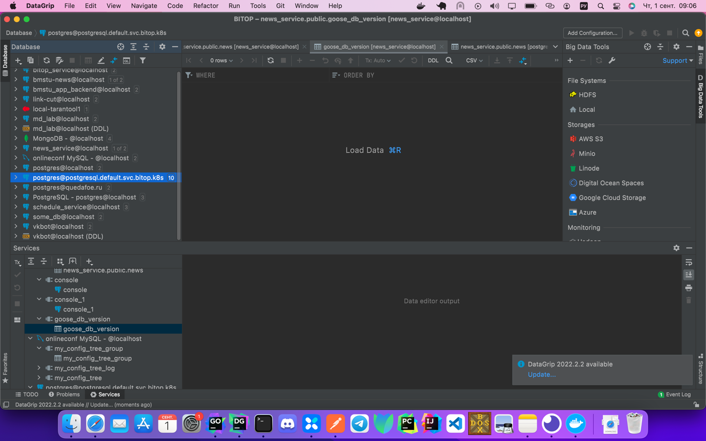
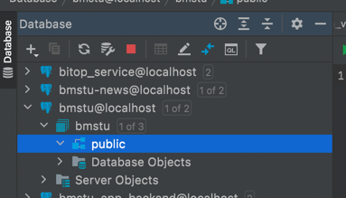

# Методические указания по выполнению лабораторной работы №2  

## Установка Postgresql и простые операции
Postgresql одна из самых известных и используемых баз данных в современном IT,
ее используют множество больших компаний: VK, Ozon и другие.

### Виды установок
##### Рекомендованная
Полезные материалы:
- Про docker: https://habr.com/ru/post/310460/?ysclid=l7ilstl2mt144186154
- Официальная документация docker: https://docs.docker.com/get-started/overview/
- Официальная документация Postgres на русском: https://postgrespro.ru/docs/postgrespro/9.5/tutorial-start

Предисловие: данный вид установки окружения
для вашего программного на данный момент 
является самым известным и используемым 
в средах разработчиков

Для начала введем для себя 3 определения:
* Docker - Программное обеспечение для автоматизации развёртывания и управления приложениями в средах с поддержкой контейнеризации, контейнеризатор приложений. Позволяет «упаковать» приложение со всем его окружением и зависимостями в контейнер.
Говоря простым языком - это программа, позволяющая упаковывать ваши приложения так, чтобы вы не замечали разницу между языками,
легко обменивались программным обеспечением.
* Docker контейнер - сущности,
которые предоставляют схожий с виртуальными машинами уровень изоляции,
но благодаря правильному задействованию низкоуровневых механизмов основной операционной системы делают это с в разы меньшей нагрузкой.
* Docker image - "образ" какого-то контейнера, контейнер который один разработчик передает другому в формате image`a

Приступим непосредственно к установке:
1. Установим Docker

Один из самых важных навыков программиста - способность читать и понимать то, что вы должны сделать,
потому постараюсь обойти подробную информацию о том как нажать на кнопочку скачать и как переводить тест на сайте.

[Windows](https://docs.docker.com/desktop/install/windows-install/)
[Linux](https://docs.docker.com/desktop/install/linux-install/)
[MacOS](https://docs.docker.com/desktop/install/mac-install/)

Проверим его работоспособность:

Откройте консоль. Введите команду 
```shell
$ docker version
Client:
 Cloud integration: v1.0.22
 Version:           20.10.12
 API version:       1.41
 Go version:        go1.16.12
 Git commit:        e91ed57
 Built:             Mon Dec 13 11:46:56 2021
 OS/Arch:           darwin/arm64
 Context:           default
 Experimental:      true

Server: Docker Desktop 4.5.0 (74594)
 Engine:
  Version:          20.10.12
  API version:      1.41 (minimum version 1.12)
  Go version:       go1.16.12
  Git commit:       459d0df
  Built:            Mon Dec 13 11:43:07 2021
  OS/Arch:          linux/arm64
  Experimental:     false
 containerd:
  Version:          1.4.12
  GitCommit:        7b11cfaabd73bb80907dd23182b9347b4245eb5d
 runc:
  Version:          1.0.2
  GitCommit:        v1.0.2-0-g52b36a2
 docker-init:
  Version:          0.19.0
  GitCommit:        de40ad0
```
Если вдруг по какой-то причине вы видите ошибку, например:
```shell
Cannot connect to the Docker daemon at unix:///var/run/docker.sock. Is the docker daemon running?
```
Значит что-то пошло не так, если вы не найдете свою проблему в FAQ, постарайтесь сначала поискать ее в интернете.

Вместе с программой докер, к вам должен был установиться docker compose. Проверим его установку:
```shell
$ docker compose version
Docker Compose version v2.2.3
# или, возможно, у вас сработает эта команда
# проблема различия возникает из-за версии приложения и ОС
$ docker-compose version
docker-compose version 1.29.2, build 5becea4c
docker-py version: 5.0.0
CPython version: 3.9.0
OpenSSL version: OpenSSL 1.1.1h  22 Sep 2020
```
Запустим нашу базу данных. На данном этапе вы поймете удобство настройки таким образом:
вы можете в любой момент заменить image postgresql имеджем, например, mysql или tarantool.
Создадим файл в корне проекта из нашего прошлого занятия:
```shell
$ nano docker-compose.yml # в unix системах это обозначает вызов тестового редактора из консоли
```
Впишем туда следующее:
```yaml
version: "3.8" # версия вашего docker-compose
services: # имеджи, которые запустятся по вашему желанию
  db: # название моего имеджа
    image: postgres:12 # скачает image postgres 12 версии
    volumes: # часть настроек для хранения данных, пока для нас это не важно
      - type: volume
        source: postgresdb-data
        target: /var/lib/postgresql/data
    ports: # порты
      - "5432:5432"
    environment: # переменные окружения, меняйте их если хотите поменять пароль, логин или название стартовой базы данных
      POSTGRES_USER: bmstu_user
      POSTGRES_DB: bmstu
      POSTGRES_PASSWORD: bmstu_password

volumes: # часть настроек для хранения данных
  postgresdb-data:
    driver: local
```
Теперь корень нашего проекта выглядит так:
```shell
# На Unix/Mac
$ ls -la 
drwxr-xr-x   6 maxim-konovalov  staff   192 Aug 31 02:28 .idea
drwxr-xr-x   3 maxim-konovalov  staff    96 Aug 31 01:05 cmd
-rw-r--r--   1 maxim-konovalov  staff   358 Sep  1 08:49 docker-compose.yml
-rw-r--r--   1 maxim-konovalov  staff  1056 Aug 31 01:39 go.mod
-rw-r--r--   1 maxim-konovalov  staff  6962 Aug 31 01:39 go.sum
drwxr-xr-x   3 maxim-konovalov  staff    96 Aug 31 01:06 internal
drwxr-xr-x   3 maxim-konovalov  staff    96 Aug 31 02:21 resources
drwxr-xr-x   3 maxim-konovalov  staff    96 Aug 31 02:21 templates
# На Windows
$ dir
...
```
Запустим наш Postgresql, для этого зайдем в терминал, убедимся что мы находимся в корне нашего проекта и введем следующее:
```shell
$ docker compose up -d # запустит ваш postgres
Creating network "awesomeproject_default" with the default driver
Creating volume "awesomeproject_postgresdb-data" with local driver
Creating awesomeproject_db_1 ... done
$ docker ps # проверим что база данных действительно запустилась
CONTAINER ID   IMAGE         COMMAND                  CREATED          STATUS          PORTS                    NAMES
2d14e669ff98   postgres:12   "docker-entrypoint.s…"   37 seconds ago   Up 35 seconds   0.0.0.0:5432->5432/tcp   awesomeproject_db_1
```

Если вы решили отключить ваш postgres
```shell
$ docker compose down
```
##### Физическим инсталлятором
Скачиваем инсталлер с официального сайта: https://www.postgresql.org/download/windows/
Далее идем согласно статье в https://winitpro.ru/index.php/2019/10/25/ustanovka-nastrojka-postgresql-v-windows/, если вы на Windows.
Если вы на lunux или macOS:
Linux:
```shell
$ apt install postgres
```
MacOS: 
```shell
$ brew install postgres 
```

## Запуск и подключение к Datagrip
Визуально с базой данных мы будем работать с клиентом Datagrip.
Datagrip также является продуктом JetBrains, потому установить его у вас не должно возникнуть трудностей. Сайт DataGrip: https://www.jetbrains.com/help/datagrip/installation-guide.html?ysclid=l7in6bbbyy935157824
. После того как вы установили программу, запустим ее
На данный момент моя программа выглядит так, но возможно вам придется еще выполнить парочку махинаций c простыми начальными настройками,
чтобы проект у вас выглядел похожим образом

Нажимаем на кнопочку добавления новой базы данных


Находим PostgreSQL и нажимаем на него(клиент DataGrip особенно удобен тем, что может работать с множеством баз данных)

Так как вы зашли первый раз - у вас отсутствует драйвер для PostgreSQL, установите его щелкнул в Download:

После скачивания драйвера введите креденшелы(пароль, логин, название базы данных). Проверяем соединение к базе данных нажав на "Test Connection"

Если все хорошо, нажимаем на "OK". После чего в левой колонке должна появиться ваша база данных(bmsty@localhost).


## Администрирование Postgresql
Начнем с того что существует много подходов к воспроизведению миграций таблиц:
- Из кода, воспроизводя исполняемые файлы
- Из кода, воспроизводя sql файлы
- Вручную клиентом(например DataGrip) исполнять миграции в базе данных

### Разберем некоторые возможные варианты:
#### Вручную
Нажав правой кнопкой мыши по любой сущности из базы данных, вы получите все необходимые операции над сущностью в формате UI. Замечу что помимо того они транслируются в реальные SQL команды прямо перед вами, подробнее можно прочитать на сайте DataGrip: 


## Масштабируем проект
### Про конфигурацию и переменные окружения
Так или иначе прежде чем запустить проект хочется менять в нем
какие-то параметры(на каком порту запустить? какую информацию писать в лог?
Всю - слишком много, только ошибки - может понадобиться когда-то это изменить и потом снова смотреть в код?)

Потому есть 2 основных способа передачи конфигурации вашему приложению:
- файлы конфигурации
- переменные окружения
#### Поговорим про файлы конфигурации
Файл конфигурации - обычный текстовый файл, в каком-либо общеизвестном 
или общепринятом формате, например: .yml, .yaml, .toml, .json, .hcl, .config

Все эти файлы - просто текстовые, с одним небольшим условием,
что декларативное описание сущностей(каких-то параметров) ведется в определенном
стандартизированном формате, приведу пару примеров файлов конфигурации:

```config.toml```
```toml 
ServiceHost = "0.0.0.0" # просто ключ значение
ServicePort = 80

[BMSTUNewsConfig] # вложенный объект
SiteAddress = "api.www.bmstu.ru" # значения полей этого объекта
Protocol = "https"
DayLimit = 30
```
```config.yaml```
```yaml
service_host: "0.0.0.0" # просто ключ значение
service_port: 80
bmstu_news_config:
  site_address: "api.www.bmstu.ru"
  protocol: "https"
  day_limit: 30
```
#### Поговорим про переменные окружения
Для начала приведем определение:
Переменные окружения — именованные переменные, содержащие текстовую информацию, которую могут использовать запускаемые программы. Такие переменные могут содержать общие настройки системы, параметры графической или командной оболочки, данные о предпочтениях пользователя и многое другое.

Потрогаем руками:

выведем переменные окружения которые сейчас у вас есть, для этого в консоли введем(далее мы не будем говорить,
что что-то нужно ввести в коносль, вам об этом говорит знак $ - это просто строка приглашения в Linux терминалах.
Он и означает что вы работаете под обычным пользователем, а # - под рутом. Это и есть его основное назначение, никаких дополнительных функций в этом символе нет.):
```shell
$ env
PWD=/Users/maxim-konovalov/MyProj/web-2022/tutorials
OLDPWD=/Users/maxim-konovalov/MyProj/web-2022/tutorials
HOMEBREW_PREFIX=/opt/homebrew
HOMEBREW_CELLAR=/opt/homebrew/Cellar
HOMEBREW_REPOSITORY=/opt/homebrew
MANPATH=/opt/homebrew/share/man::
INFOPATH=/opt/homebrew/share/info:
_=/usr/bin/env
...
```
Запишем свою переменную:
```shell
$ export test=123
```
Проверим ее наличие:
```shell
$ env | grep 123   # | grep 123 значит что вы передаете выходной поток утилите grep, эта утилита позволяет осуществлять поиск, на Windows придется искать руками            
test=123
```

Так что такое переменные окружения?

Переменные окружения - key value значния, которые могту быть локальными и глобальными(локальные - видно только в конкретной директории,
глобальные - видно во всех директориях, например переменная PWD или PATH). С помощью них можно так же передавать 
данные вашему сервису, обычно ее используют, чтобы передавать и обмениваться секретными данными пользователь-сервис, сервис - сервис
### Новое устройство проекта и чтение конфигурации
Частично расширим возможности нашего проекта и поменяем его структуру. Иначе логики станет слишком много в одном файле и не будет никакой сортировки.
Это плохо, потому давайте слегка подредактируем расположение папок в нашем проекте:
Добавим:
- internal/app/config # пакет читающий конфигурацию из /config/config.toml (любой формат)
- internal/app/repository # пакет отвечающий за обращения к хранилищам данных
- internal/pkg/app # Сердце нашего приложения - оно создает подключение к базе данных, веб сервер, создает конфиг. Может создаваться и стартоваться.
- internal/app/api # пакет отвечающий за веб серверную маршрутизацию(сейчас это почти все то что ранее было в api)
- internal/app/dsn # пакет формирующий DSN - строку подключения к postgresql
- .env  # файл, который определяет переменные окружения в вашей текущей папки(локальный энв)
- internal/app/ds # пакет в котором будут храниться структуры данных, которые мы храним в базе данных

Создадим тип Application в пакете ```app```. Пусть у него будет 1 метод Run.
А в пакете появится публичная функция New(), которая будет возвращать Application.
Функция New должна создавать объект Application, заполнять его конфигом, роутером веб сервера, подключением к базе данных.

В пакете DSN добавим 1 новый публичный метод. 
```go
package dsn

import (
	"fmt"
	"os"
)

// FromEnv собирает DSN строку из переменных окружения
func FromEnv() string {
	host := os.Getenv("DB_HOST")
	if host == "" {
		return ""
	}

	port := os.Getenv("DB_PORT")
	user := os.Getenv("DB_USER")
	pass := os.Getenv("DB_PASS")
	dbname := os.Getenv("DB_NAME")

	return fmt.Sprintf("host=%s port=%s user=%s password=%s dbname=%s sslmode=disable", host, port, user, pass, dbname)
}
```
В пакете config добавим 1 публичный метод:
```go
package config

import (
	"context"
	"os"
	"time"

	"github.com/joho/godotenv"
	log "github.com/sirupsen/logrus"
	"github.com/spf13/viper"
)

// Config Структура конфигурации;
// Содержит все конфигурационные данные о сервисе;
// автоподгружается при изменении исходного файла
type Config struct {
	ServiceHost string
	ServicePort int
}

// NewConfig Создаёт новый объект конфигурации, загружая данные из файла конфигурации
func NewConfig(ctx context.Context) (*Config, error) {
	var err error

	configName := "config"
	_ = godotenv.Load()
	if os.Getenv("CONFIG_NAME") != "" {
		configName = os.Getenv("CONFIG_NAME")
	}

	viper.SetConfigName(configName)
	viper.SetConfigType("toml")
	viper.AddConfigPath("config")
	viper.AddConfigPath(".")
	viper.WatchConfig()

	err = viper.ReadInConfig()
	if err != nil {
		return nil, err
	}

	cfg := &Config{}
	err = viper.Unmarshal(cfg)
	if err != nil {
		return nil, err
	}

	log.Info("config parsed")

	return cfg, nil
}

```

Итого мы получаем следующую цепочку пакетов:
* В main - создаем application, пишем логи что мы запустились/упали
* В app - при вызове New - создаем объект, у которого есть роутер,репозиторий и конфиг, 
* application.Run - запускает веб сервер
* В репозитории - публичный метод New() для создания объекта репозитория
* В конфиге - метод New() для создания метода конфигурации
* В api - описания всех наших эндпоинтов

Важно: далее увеличивать и улучшать наш проект по структуре мы не будим,
потому лучше изначально усвоить назначения каждого пакета.
## Обращаемся к базе из кода
Чтобы создать обращение к базе вам необходима строка DSN.
Давайте договоримся что все данные о базе данных мы будем передавать не через конфиг,
а через .env(будем считать что так безопаснее).
Создадим в корне проекта файл .env, у меня он получился таким:
```dotenv
DB_HOST=0.0.0.0
DB_NAME=bmstu
DB_PORT=5432
DB_USER=bmstu_user
DB_PASS=bmstu_password
```
Будем использовать достаточно примитивную ORM gorm.
Вот большой список гайдов на gorm: https://gorm.io/docs/index.html
Прежде чем пойти дальше, давайте скажем что у нас есть предметная область магазин компьютерной техники.
Прежде чем приступать к работе с пакетом Repository, давайте создадим миграции данных, создадим данные в таблице из кода:
Создадим ```internal/app/ds/proudcts.go```. И опишем новую таблицу:
```go
package ds

import (
	"gorm.io/gorm"
)

type Product struct {
	gorm.Model
	Code  string
	Price uint
}

```
Создадим ```cmd/migrate/main.go```. 
Это будет наш скрипт, который будет выполнять миграцию.
```go
package main

import (
	"github.com/joho/godotenv"
	"gorm.io/driver/postgres"
	"gorm.io/gorm"

	"awesomeProject/internal/app/ds"
	"awesomeProject/internal/app/dsn"
)

func main() {
	_ = godotenv.Load()
	db, err := gorm.Open(postgres.Open(dsn.FromEnv()), &gorm.Config{})
	if err != nil {
		panic("failed to connect database")
	}

	// Migrate the schema
	err = db.AutoMigrate(&ds.Product{})
	if err != nil {
		panic("cant migrate db")
	}
}
```
Проверьте в Data Grip что ваша миграция прогла успешно

Создадим пакет Repository:
По сути для нас этот пакет будет выглядеть следующим образом:
- New() - возвращает новый объект
- repo.GetCPUs() - возвращает список всех cpu
- repo.GetAllProducts() - возвращает вообще весь список товаров
- repo.GetMotherboards() - возвращает все материнские платы
- и другие ГОВОРЯЩИЕ методы.
Будьте к этому внимательны,
иначе можно забыть что делает этот метод и потратить время на изучение кода.


