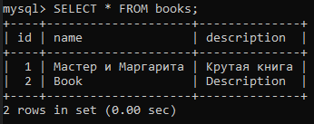

# Методические указания по выполнению лабораторной работы №2  

### Команда курса благодарит Торжкова Максима Сергеевича за активное участие в подготовке данного руководства.

## Установка MySQL и простые операции

MySQL - одна из самых популярных классических реляционных СУБД,
используемых в современном вебе.

Для работы вам потребуется установить MySQL на компьютер. Если у вас
Windows, потребуется скачать дистрибутив с сайта
http://dev.mysql.com/downloads/windows/. Также вам потребуется коннектор для Python,
чтобы выполнять запросы из кода. В большинстве случаев для проектирования баз
данных бывает полезна программа MySQL Workbench, где можно визуализировать
схему базы в виде ER-диаграм. 

После того, как вы установили MySQL, необходимо запустить сервер. В случае с
Windows можно воспользоваться этим мануалом:
https://dev.mysql.com/doc/refman/8.0/en/windows-start-command-line.html

Чтобы начать работать с сервером MySQL, нужно подсоединиться к нему из
клиента. Для этого можно открыть Workbench или использовать командную строку
("C:\Program Files\MySQL\MySQL Server 8.0\bin\mysql" в случае с windows)


Некоторые стандартные необходимые команды:
- **show databases** - показать доступные базы данных
- **use <имя базы>** - выбрать базу данных
- **show tables** - показать таблицы в выбранной базе данных
- **describe <имя таблицы>** - вывести схему таблицы

Для начала необходимо создать пользователя базы данных. У него будет
доступ к этой БД.

```
CREATE USER dbuser@'localhost' IDENTIFIED BY '123';
```

После этого нужно создать базу данных.


```
CREATE DATABASE `first_db` CHARACTER SET utf8 COLLATE utf8_general_ci;
```

И выдать права новому пользователю на эту базу данных.

```
GRANT ALL PRIVILEGES ON first_db.* TO dbuser@'localhost';
```

Если эта команда не срабатывает, то права доступа можно выдать через Workbench.


Теперь можно создавать таблицу в этой базе данных, но сначала нужно в
нее перейти:


Чтобы создать таблицу нужно использовать команду create table.
Рассмотрим простой пример с созданием таблицы “книга”, в которой будет
название книги и ее описание:

```
CREATE TABLE `books` (
    `id` INT(11) NOT NULL AUTO_INCREMENT,
    `name` CHAR(30) NOT NULL,
    `dicription` CHAR(255) NOT NULL,
    PRIMARY KEY (`id`)
);
```

Для добавления/чтения/обновления/удаления (CRUD) записей служат
команды INSERT, DELETE, UPDATE, SELECT. Подробно эти команды
рассмотрены в курсе баз данных.

```
INSERT INTO books VALUES(1, 'Мастер и Маргарита', 'Крутая книга');

SELECT * FROM books;
```


## Обращение к БД из Python

В этой части лабораторной работы необходимо создать подключение из
Python к MySQL, занести и выбрать несколько записей с помощью кода.

Для начала требуется установить пакет mysqlclient из pip. Это необходимый
набор классов и функций для работы с mysql из вашего кода.

Ссылка на репозиторий на github:
https://github.com/PyMySQL/mysqlclient-python

Команда для установки: `pip install mysqlclient`

В этой части вашей задачей является написание простого скрипта, который
подключается к базе данных, добавляет одну запись, затем получает и выводит
на экран все записи таблицы books, а затем удаляет все записи.

`Пример`

```
import MySQLdb

db = MySQLdb.connect(
    host="localhost",
    user="dbuser",
    passwd="123",
    db="first_db"
)

c=db.cursor()
c.execute("INSERT INTO books (name, description) VALUES (%s, %s);", ('Book', 'Description'))
db.commit()
c.close()
db.close()
```

`Итог`



## Django ORM

Django предоставляет удобные возможности для представления базы
данных в виде python-объектов. Django ORM
облегчает и ускоряет разработку. Однако необходимо помнить, что в случае
реализации сложных SQL-запросов бывает быстрее и выгоднее использовать
чистые запросы без ORM.

Для использования ORM требуется описать свои модели предметной
области в виде классов, наследованных от django.db.models.Model.

Примеры работы с ORM:
https://django.fun/docs/django/ru/3.2/topics/db/models/

Чтобы методы модели работали, необходимо указать настройки
подключения БД в `settings.py`

`settings.py`
```
DATABASES = {
    'default': {
        'ENGINE': 'django.db.backends.mysql',
        'NAME': 'first_db',
        'USER': 'dbuser',
        'PASSWORD': '123',
        'HOST': 'localhost',
        'PORT': 3306, # Стандартный порт MySQL
        'OPTIONS': {'charset': 'utf8'},
        'TEST_CHARSET': 'utf8',
    }
}
```

В этой части лабораторной работы требуется самостоятельно создать
модели по предметной области из предыдущей лабораторной работы.

Вы можете создать классы моделей всех таблиц в вашей БД с помощью

```
python manage.py inspectdb
```

Все запросы к БД представляются в Django ORM в виде объектов QuerySet.
Это своеобразный “конструктор” запросов, который позволяет с помощью кода
“собрать” SQL-запрос. Примеры работы с queryset и моделями можно найти
здесь: https://django.fun/docs/django/ru/3.2/topics/db/queries/

Кроме возможности создать модели и управлять ими из кода, Django ORM
также позволяет создавать БД по описанию моделей, а также изменять
структуру БД при изменении моделей.

Для этих действий используются так называемые миграции. Это скрипты,
которыу выполняют преобразование схемы базы данных с помощью ALTER
TABLE.

Миграции в Django создаются с помощью команды `manage.py
makemigrations <название приложения>`. После того, как миграция создана
(скрипт миграции создался и добавился в папку migrations), ее нужно применить
с помощью команды `manage.py migrate <название приложения>`.

Все изменения моделей (или их создание) будут фиксироваться в
миграции. Если модели до миграции не было, значит после применения
миграции будет создана соответствующая таблица. Если модель изменена
(например, добавлено поле), после применения миграции это поле будет
добавлено в соответствующую таблицу.

`Пример`

`models.py`
```
from django.db import models

# Create your models here.
class Book(models.Model):
    name = models.CharField(max_length=30)
    description = models.CharField(max_length=255)

    class Meta:
        managed = False
        db_table = 'books'
```

`urls.py`
```
    path('', views.bookList),
    path('book/<int:id>/', views.GetBook, name='book_url')
```

`views.py`
```
from bmstu_lab.models import Book

def bookList(request):
    return render(request, 'books.html', {'data' : {
        'current_date': date.today(),
        'books': Book.objects.all()
    }})

def GetBook(request, id):
    return render(request, 'book.html', {'data' : {
        'current_date': date.today(),
        'book': Book.objects.filter(id=id)[0]
    }})

```

`books.html`
```



Список книг


<ul>
    
       
    
        <li>Список пуст</li>
    
</ul>

```

Содержимое `qw.html` здесь не описано. Его необходимо добавить самостоятельно на основе Лабораторной работы 1.

`book.html`
```


Книга №{{ data.book.id }}


    <div>Название: {{ data.book.name }}</div>
        <div>Описание: {{ data.book.description }}</div>

```

`Итог`


