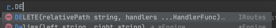

# Методические указания по выполнению лабораторной работы №3

В этой лабораторной работе мы разработаем простой веб-сервер на основе языка Golang и фреймворка gin-gonic.

## План

1. Вводная часть: новый проект
2. Выбираем технологии: почему не подходят шаблоны?
3. API и REST: что это и почему это удобно?

   3.1 Что такое API?

   3.2 Что такое REST? Как его применить для нашей задачи?

4. Написание миграций схемы
5. Написание бизнес логики для API
6. HTTP клиент. Утилиты Postman, curl, insomnia. Устанавливаем Postman.
7. Проверяем правильность работы API
8. Полезные ссылки

## 1. Вводная часть: новый проект

Ранее мы уже познакомились с тем, что такое проект на Go: увидели структуру проекта, поработали с шаблонами, присоеденили базу данных.

Сегодня мы напишем уже реальный аналог проекта.

Ваша задача — это написать единый сервис, в который будут обращаться все приложения компании для получения последних данных об изменениях курса акций.
#### На деле выбираем свою тему!!!

## 2. Выбираем технологии: почему не подходят шаблоны?

HTML нужен для передачи информации от компьютера(сайта) к человеку, а нам нужно решить задачу передачи информации от компьютера к компьютеру. То есть сделать такой сервис, куда бы приходил телеграмм бот(или мобильное приложение или сайт) задавал бы вопрос: "сколько стоят акции Apple сейчас?" и получал бы ответ. Поэтому шаблоны тут не подойдут, они нужны для людей, а не для машин.

## 3. API и REST: что это и почему это удобно?

Теперь мы поняли, что нам не подходят шаблоны, ведь нам нужно создать решение для передачи данных от программы к программе. Для решения таких задач обычно используют API.

### 3.1 Что такое API?

Определение API можно посмотреть [здесь.](https://ru.wikipedia.org/wiki/API)

В нашем случае это будет выглядеть так:

.png)

То есть каждая из платформ приходит к нам в API за актуальной информацией о курсах акций. И это удобно, ведь нам не нужно писать программу для получения акций для каждой платформы отдельно, вместо этого можно написать один сервер, где будет вся информация. Это чем-то похоже на вызов функции в коде, только эта функция вызывается с помощью HTTP. Все, что нам осталось — это описать наше API, то есть задать набор правил, по которым все платформы будут общаться с нашим сервером.

*Более подробное объяснение дано [в статье](https://habr.com/ru/post/464261/).*

### 3.2 Что такое REST? Как его применить для нашей задачи?

Нам осталось описать набор правил, которые станут нашим API. Для этого есть REST — набор правил и рекомендаций для того, чтобы создать как можно более удобное API. Это дизайн, но для компьютерных интерфейсов.

Давайте представим, как может выглядеть архитектура нашего API для курса акций.

Для начала нужно понять, какие действия в целом с акциями можно делать:

1. **Получение списка всех акций**, чтобы узнать какие акции есть у нас в системе
2. **Создание новой компании в системе**, чтобы добавить новую компанию в нашу базу данных
3. **Получение стоимости акций конкретной компании**, чтобы узнать стоимость акции не загружая огромного списка
4. **Изменение стоимости акций конкретной компании**, чтобы поддерживать стоимость акций актуальными
5. **Удаление акции компании из базы**, чтобы перестать отображать компанию если она, например, закрылась

В REST мы всё проектируем исходя из ресурса(модели). Способ, которым мы идентифицируем ресурс для предоставления, состоит в том, чтобы назначить ему URI — универсальный идентификатор ресурса. Перепишем тот же самый список сверху, но уже по REST:

1. **Получение списка всех акций:**  *GET /stocks*
2. **Создание новой компании в системе:** *POST* *****/stocks/*
3. **Получение стоимости акций конкретной компании:** *GET /stocks/1*
4. **Изменение стоимости акций конкретной компании:** *PUT /stocks/1/*
5. **Удаление акции компании из базы:** *DELETE /stocks/1/*

*Пожалуйста, посмотрите дополнительные материалы [в статье.](https://habr.com/ru/post/483202/)*

## 4. Написание миграций схемы
Определим структуру акции:
1. uuid (аналог ID, почему именно uuid вы можете прочитать здесь: https://mareks-082.medium.com/auto-increment-keys-vs-uuid-a74d81f7476a)
2. name (название акции)
3. purchase_price (цена покупки)
4. sale_price (цена продажи)
5. count (число акций компании)
6. company_name (название компании)
7. inn (инн компании)

И определим ее в коде(не забывая раскаладывать все по пакетам,
которые мы обсуждали во 2 ЛР):
```go
type Stock struct {
	UUID          uint `sql:"type:uuid;primary_key;default:uuid_generate_v4()"`
	Name          string
	PurchasePrice uint64
	SalePrice     uint64
	Count         uint64
	CompanyName   string
	INN           string
}
```
## 5. Написание бизнес логики для API
Для разграничения действий с ресурсами на уровне HTTP-методов и были придуманы следующие варианты:
* GET — получение ресурса
* POST — создание ресурса
* PUT — обновление ресурса
* DELETE — удаление ресурса

По умолчанию заходя на ресурс в браузере как мы делали ранее - мы делали GET запрос. 
Теперь же познакмомимся с ними всеми.
В нашем фреймворке у объекта роутер есть реализации всех вышеперечисленных видов запроса, к примеру можем увидеть запрос DELETE:



В прочем, из того что могло бы оказаться для вас новым стоит рассмотреть запросы где параметры передаются внутри пути.
Подробнее об этом вы можете узнать в документации фреймворка: https://github.com/gin-gonic/gin?ysclid=l8rr0pd0vx287684334#parameters-in-path.
```go
func main() {
  router := gin.Default()

  // This handler will match /user/john but will not match /user/ or /user
  router.GET("/user/:name", func(c *gin.Context) {
    name := c.Param("name")
    c.String(http.StatusOK, "Hello %s", name)
  })

  // However, this one will match /user/john/ and also /user/john/send
  // If no other routers match /user/john, it will redirect to /user/john/
  router.GET("/user/:name/*action", func(c *gin.Context) {
    name := c.Param("name")
    action := c.Param("action")
    message := name + " is " + action
    c.String(http.StatusOK, message)
  })

  // For each matched request Context will hold the route definition
  router.POST("/user/:name/*action", func(c *gin.Context) {
    b := c.FullPath() == "/user/:name/*action" // true
    c.String(http.StatusOK, "%t", b)
  })

  // This handler will add a new router for /user/groups.
  // Exact routes are resolved before param routes, regardless of the order they were defined.
  // Routes starting with /user/groups are never interpreted as /user/:name/... routes
  router.GET("/user/groups", func(c *gin.Context) {
    c.String(http.StatusOK, "The available groups are [...]")
  })

  router.Run(":8080")
}
```
В случае плохих ответов(н-р пользователь не ввел все данные или какие-то ввел не верно), стоит соблюдать следующие пункты:
1. Ответ в json 
```json
{
   "status": "fail",
   "message": "invalid id, it must be >= 0"
}
```
2. Соответсующий http status code(20* - ok, 40* - client errors, 50* - server errors)

Дальнейшие пункты, которые могут вызывать сложности,
вы можете изучить в документации. В частности изучите вопрос удаления данных,
полной выборки из таблицы и другие. Подробнее на https://gorm.io/docs/index.html

## 7. Сериализация и десериализация данных.
Для того, чтобы передавать данные по сети (ответы на запросы) нам необходимо привести их в какой-то формат, который будет понятен программе. Это можеть быть строка, JSON или бинарный формат данных. Это называется сериализация данных.
В примерах выше мы сериализовали данные в строку при отдаче ответа.
```go
  router.GET("/user/groups", func(c *gin.Context) {
    c.String(http.StatusOK, "The available groups are [...]")
  })
```

Но данный формат не самый удобен с точки зрения систематизации и обработки. Например, фронтенду придется парсить строку, чтобы достать все доступные группы, что может быть очень затратно по времени и памяти. Поэтому использует формат JSON:
```go
  type Resp struct {
     Groups []string `json:"groups"`
  }
  resp := Resp {
   Groups: []string{"group1", "group2"},
  }
  router.GET("/user/groups", func(c *gin.Context) {
    c.JSON(http.StatusOK, resp)
  })
```

С другой стороны, к нам в запросе данные также будут приходить в формате JSON. Для того чтобы с ними работать, нам необходимо десериализовать их, то есть привести их какой-то заданной структуре.
```go
  type Req struct {
     ID int64 `json:"id"`
     Info string `json:"info"`
  }
  func ExampleFunction(c *gin.Context) {
     var request Req
     if err := c.BindJSON(&request); err != nil {
       // DO SOMETHING WITH THE ERROR
     }
     fmt.Println(request.Info)
   }
```


## 6. HTTP клиент. Утилиты Postman, curl, insomnia. Устанавливаем Postman.
HTTP клиент - инцициатор общения по протоколу по http, а так же инструменты которые позволяют ему это сделать.
Когда мы проверяли запросы в браузере - наш браузер является http клиентом. Правда браузер как клиент достаточно спецефичен. 
Он по определению создан для другого - он получает файлы фронтенда, которые уже внутри JS кода делают свои запросы на ваш сервер.
Чтобы иммитировать все возможные http запросы есть множество утилит. Самые популярные из них:
1. Postman (имеет огромную функциональность, которая поможет в тестировании и шаринге ваших запросов в команде, но самая продвинутая платная)
2. Insomnia(менее функциональный для команды, но все так же может делать любые запросы)
4. curl (http клиент из консоли, как правильно обмениваясь запросами - обмениваются curl запросами, поскольку это просто строка, в дальнейшем вы можете его интерпретировать в postman или другом клиенте). На самом деле, curl - это больше чем просто утилита командной строки для Linux или Windows. Это набор библиотек, в которых реализуются базовые возможности работы с URL страницами и передачи файлов. Библиотека поддерживает работу с протоколами: FTP, FTPS, HTTP, HTTPS, TFTP, SCP, SFTP, Telnet, DICT, LDAP, а также POP3, IMAP и SMTP. Она отлично подходит для имитации действий пользователя на страницах и других операций с URL адресами.
## 7. Проверяем правильность работы API
Проверять правильность выполнения ЛР будем через утилиту Postman. Для создания отчета создайте Postman коллекцию запросов. 
Подробнее документацию вы можете почитать на https://learning.postman.com/docs/publishing-your-api/documenting-your-api/
В конечном итоге у вас должна появиться коллекция запросов, которыми вы сможете провести ручное тестирование вашего API.

Составьте план ручного тестирования.
Убедитесь что все данные возвращаются в формате JSON. Проверьте краевые случаи(id = -1, id=999999999999, id = """) и корректность возвращаемого ответа-ошибки.

Проверьте что у вас присуствуют правильные коды ошибок(у вас обязательно должно быть больше 2 кодов ответа):
- 400 Bad Request — сервер обнаружил в запросе клиента синтаксическую ошибку. Появился в HTTP/1.0.
- 200 OK — успешный запрос. Если клиентом были запрошены какие-либо данные, то они находятся в заголовке и/или теле сообщения. Появился в HTTP/1.0.
- 201 Created — в результате успешного выполнения запроса был создан новый ресурс. Сервер может указать адреса (их может быть несколько) созданного ресурса в теле ответа, при этом предпочтительный адрес указывается в заголовке Location. Серверу рекомендуется указывать в теле ответа характеристики созданного ресурса и его адреса, формат тела ответа определяется заголовком Content-Type. При обработке запроса новый ресурс должен быть создан до отправки ответа клиенту, иначе следует использовать ответ с кодом 202. Появился в HTTP/1.0.
- 500 Internal Server Error — любая внутренняя ошибка сервера, которая не входит в рамки остальных ошибок класса. Появился в HTTP/1.0.

Результат выполненной работы:
1. Работующее API для вашего сервера по вашей теме в сооствествии с запросами выше.
2. Документация swagger openapi
3. Postman коллекция запросов с правильными запросами и запросами на тестирования(с плохими ответами)
4. Консистентность статуса ответа и записи в БД. Ваш сервис не может ответить ок, не изменив базу данных в конкретной задаче.
## 8. Полезные ссылки

* Документация Postman - https://learning.postman.com/docs/publishing-your-api/documenting-your-api/
* Как пользоваться curl - https://losst.ru/kak-polzovatsya-curl?ysclid=l91dvjg4xg818007414
* Документация gin-gonic - https://github.com/gin-gonic/gin?ysclid=l8rr0pd0vx287684334
* Документация gorm - https://gorm.io/docs/
* Список кодов состояния http - https://ru.wikipedia.org/wiki/Список_кодов_состояния_HTTP
