# Методические указания по выполнению лабораторной работы №3

В этой лабораторной работе мы разработаем простой веб-сервер на основе языка __Golang__ и фреймворка __gin-gonic__.

# План работы

## 1. Создание базового API
1.1. Вводная часть: новый проект

1.2. Выбираем технологии: почему не подходят шаблоны?

1.3. API и REST: что это и почему это удобно?

-   1.3.1 Что такое API?

-   1.3.2 Что такое REST? Как его применить для нашей задачи?

1.4. Написание миграций схемы

1.5. Принципы бизнес-логики для API

1.6. Сериализация и десериализация данных

1.7. Модификация Repository

1.8. Обработчики в Handler

1.9. Эндпоинты

1.10. HTTP клиент. Утилиты Postman, curl, Insomnia

1.11. Проверяем правильность работы API

1.12. Полезные ссылки

## 2. Добавление изображения
2.1. Постановка задачи и миграции

2.2. Функция добавления изображения

2.3. Изменение API

2.4. Проверка измемений

## 3. Вложенная сериализация
3.1. Что такое вложенная сериализация?

3.2. Сущности и миграция

3.3. Изменение репозитория

3.4. Изменение API

3.5. Эндпоинты

3.6. Проверка работы API

# 1. Создание базового API
## 1.1. Вводная часть: новый проект

Ранее мы уже познакомились с тем, что такое проект на Go: увидели структуру проекта, поработали с шаблонами, присоединили базу данных.

Сегодня мы напишем уже реальный аналог проекта.

Наша задача — это написать единый сервис, к которому будут обращаться все приложения компании для получения последних данных об изменениях курса акций.
#### На практике же вы выбираете свою тему!!!

## 1.2. Выбираем технологии: почему не подходят шаблоны?

Шаблоны нужны для формирования HTML-документов. HTML, как следует из названия - язык разметки гипертекста (HyperText Markup Language). Он описывает внешний вид страницы, предназначенной для человека. Это и определённым образом распределённый текст, и медиа-элементы. Отображение информации в виде такой страницы удобно для нашего зрения, но удобно ли это для компьютера?

Чтобы проанализировать информацию с конкретной HTML-страницы, компьютер должен её распарсить (прочитать и разбить на элементы по определённой логике). Как правило, результат такого парсинга занимает намного меньше памяти, чем занимала исходная страница — компьютер отбросил "шелуху" (теги, стили, ненужный текст). Напрашивается идея: Почему бы не наладить общение между компьютерами без необходимости обрабатывать излишние данные?

Именно это мы и делаем, отказываясь от шаблонов. В наш сервис будет приходить Telegram-бот (мобильное приложение, сайт и т.п.), задавать, например, вопрос: "Сколько стоят акции Apple сейчас?" и получать простой (по меркам машины) ответ.

## 1.3. API и REST: что это и почему это удобно?

Теперь мы поняли, что нам не подходят шаблоны, ведь нам нужно создать решение для передачи данных от программы к программе. Для решения таких задач обычно используют API.

### 1.3.1 Что такое API?

Определение API можно посмотреть [здесь.](https://ru.wikipedia.org/wiki/API)

В нашем случае это будет выглядеть так:

.png)

То есть, каждая из платформ приходит к нам в API за актуальной информацией о курсах акций. Это удобно, ведь нам не нужно писать программу для получения акций для каждой платформы отдельно, а вместо этого можно написать один сервер, где будет вся информация. Это чем-то похоже на вызов функции в коде, только эта функция вызывается с помощью HTTP. Всё, что нам осталось — это описать наше API, то есть задать набор правил, по которым все платформы будут общаться с нашим сервером.

*Более подробное объяснение дано [в статье](https://habr.com/ru/post/464261/).*

### 1.3.2 Что такое REST? Как его применить для нашей задачи?

Нам осталось описать набор правил, которые станут нашим API. Для этого есть REST — набор правил и рекомендаций для того, чтобы создать как можно более удобное API. Это дизайн, но для компьютерных интерфейсов.

Давайте представим, как может выглядеть архитектура нашего API для курса акций.

Для начала нужно понять, какие действия в целом с акциями можно делать:

1. **Получение списка всех акций**, чтобы узнать, какие акции есть у нас в системе;
2. **Создание новой компании в системе**, чтобы добавить новую компанию в нашу базу данных;
3. **Получение стоимости акций конкретной компании**, чтобы узнать стоимость акции, не загружая огромный список;
4. **Изменение стоимости акций конкретной компании**, чтобы поддерживать стоимость акций актуальной;
5. **Удаление акции компании из базы**, чтобы перестать отображать компанию, если она, например, закрылась;

В REST мы всё проектируем исходя из ресурса (модели). Способ, которым мы идентифицируем ресурс для предоставления, состоит в том, чтобы назначить ему URI — универсальный идентификатор ресурса. Перепишем тот же самый список сверху, но уже по REST:

1. **Получение списка всех акций:**  *GET /stocks*
2. **Создание новой компании в системе:** *POST* *****/stocks/*
3. **Получение стоимости акций конкретной компании:** *GET /stocks/1*
4. **Изменение стоимости акций конкретной компании:** *PUT /stocks/1/*
5. **Удаление акции компании из базы:** *DELETE /stocks/1/*

*Пожалуйста, посмотрите дополнительные материалы [в статье.](https://habr.com/ru/post/483202/)*

## 1.4. Написание миграций схемы

Итак, далее работа с кодом будет производиться в проекте, имеющем структуру, аналогичную той, что у вас имеется после выполнения второй лабораторной работы. Чтобы было понятно, какими сущностями будет оперировать наш простой API, начнём с описания миграций схемы.

Определим структуру акции:
1. id
2. name (название акции)
3. purchase_price (цена покупки)
4. sale_price (цена продажи)
5. count (число акций компании)
6. company_name (название компании)
7. inn (ИНН компании)
8. pic (ссылка на изображение акции)

Затем определим её в коде (не забывая раскаладывать всё по пакетам, которые мы обсуждали во 2-й ЛР):
```go
type Stock struct {
	ID          uint `gorm:"primaryKey"`
	Name          string
	PurchasePrice uint64
	SalePrice     uint64
	Count         uint64
	CompanyName   string
	INN           string
	Pic           string
}
```

Файл `cmd/migrate/main.go`:

```go
package main

import (
	"metoda/internal/app/ds"
	"metoda/internal/app/dsn"
	"github.com/joho/godotenv"
	"gorm.io/driver/postgres"
	"gorm.io/gorm"
)

func main() {
	_ = godotenv.Load()
	db, err := gorm.Open(postgres.Open(dsn.FromEnv()), &gorm.Config{})
	if err != nil {
		panic("failed to connect database")
	}

	// Migrate the schema
	err = db.AutoMigrate(
		&ds.Stock{},
	)
	if err != nil {
		panic("cant migrate db")
	}
}
```

Запускаем данный файл, чтобы произвести миграцию модели в БД.

## 1.5. Принципы бизнес-логики для API
Для разграничения действий с ресурсами на уровне HTTP-методов и были придуманы следующие варианты:
* GET — получение ресурса
* POST — создание ресурса
* PUT — обновление ресурса
* DELETE — удаление ресурса

По умолчанию, заходя на ресурс в браузере (как мы делали ранее), мы делали GET-запрос. 
Теперь же познакомимся с остальными HTTP-методами.
В нашем фреймворке у объекта роутер есть реализации всех вышеперечисленных видов запроса. К примеру, можем увидеть запрос DELETE:


Впрочем, из того, что могло бы оказаться для вас новым, стоит рассмотреть запросы, где параметры передаются внутри пути.
Подробнее об этом вы можете узнать в документации фреймворка: https://github.com/gin-gonic/gin?ysclid=l8rr0pd0vx287684334#parameters-in-path.
```go
func main() {
  router := gin.Default()

  // This handler will match /user/john but will not match /user/ or /user
  router.GET("/user/:name", func(c *gin.Context) {
    name := c.Param("name")
    c.String(http.StatusOK, "Hello %s", name)
  })

  // However, this one will match /user/john/ and also /user/john/send
  // If no other routers match /user/john, it will redirect to /user/john/
  router.GET("/user/:name/*action", func(c *gin.Context) {
    name := c.Param("name")
    action := c.Param("action")
    message := name + " is " + action
    c.String(http.StatusOK, message)
  })

  // For each matched request Context will hold the route definition
  router.POST("/user/:name/*action", func(c *gin.Context) {
    b := c.FullPath() == "/user/:name/*action" // true
    c.String(http.StatusOK, "%t", b)
  })

  // This handler will add a new router for /user/groups.
  // Exact routes are resolved before param routes, regardless of the order they were defined.
  // Routes starting with /user/groups are never interpreted as /user/:name/... routes
  router.GET("/user/groups", func(c *gin.Context) {
    c.String(http.StatusOK, "The available groups are [...]")
  })

  router.Run(":8080")
}
```
В случае плохих ответов (н-р, пользователь не ввёл все данные или какие-то ввёл неверно) стоит соблюдать следующие пункты:
1. Ответ в json 
```json
{
   "status": "fail",
   "message": "invalid id, it must be >= 0"
}
```
2. Соответствующий HTTP Status Code (20* - OK, 40* - Client Errors, 50* - Server Errors)

## 1.6. Сериализация и десериализация данных.
Для того, чтобы передавать данные по сети (ответы на запросы), нам необходимо привести их в какой-то формат, который будет понятен программе. Это может быть строка, JSON или бинарный формат данных. Это называется сериализацией данных.
В примерах выше мы сериализовали данные в строку при отдаче ответа.
```go
  router.GET("/user/groups", func(c *gin.Context) {
    c.String(http.StatusOK, "The available groups are [...]")
  })
```

Данный формат не очень удобен с точки зрения систематизации и обработки. В примере выше фронтенду придётся парсить строку, чтобы достать все доступные группы, что может быть очень затратно по времени и памяти. Поэтому используют формат JSON:
```go
  type Resp struct {
     Groups []string `json:"groups"`
  }
  resp := Resp {
   Groups: []string{"group1", "group2"},
  }
  router.GET("/user/groups", func(c *gin.Context) {
    c.JSON(http.StatusOK, resp)
  })
```

С другой стороны, к нам в запросе данные также будут приходить в формате JSON. Для того, чтобы с ними работать, нам необходимо десериализовать их, то есть привести их к какому-то объекту определённого формата.
```go
  type Req struct {
     ID int64 `json:"id"`
     Info string `json:"info"`
  }
  func ExampleFunction(c *gin.Context) {
     var request Req
     if err := c.BindJSON(&request); err != nil {
       // DO SOMETHING WITH THE ERROR
     }
     fmt.Println(request.Info)
   }
```

Обратите внимание на теги _\`json\`_ в определении структур данных. Это ключевой инструмент для решения задачи сериализации и десериализации в Go. С помощью тега _\`json\`_ поле структуры можно сопоставить с полем JSON и наоборот. Кроме того, фреймворк Gin предоставляет нам тег _\`binding\`_, который позволяет обязать помеченное поле присутствовать в JSON, который мы десериализуем (например, тег _\`json:"info" binding:"required"\`_ делает обязательным поле "info" в принимаемом JSON).

Применим эту информацию к нашей сущности Stock:

```go
type Stock struct {
	ID          uint `gorm:"primaryKey" json:"id"`
	Name          string `json:"name"`
	PurchasePrice uint64 `json:"purchase_price"`
	SalePrice     uint64 `json:"sale_price"`
	Count         uint64 `json:"count"`
	CompanyName   string `json:"company_name"`
	INN           string `json:"inn"`
	Pic           string `json:"pic"`
}
```

## 1.7. Модификация Repository 

Нам требуется реализовать пять методов API. Начнём с реализации требуемого функционала в Repository.

Если вы выполнили вторую лабораторную работу, то у вас должен присутствовать файл `internal/app/repository/stock.go`. В нём мы и будем реализовывать функционал, необходимый API.

```go
func (r *Repository) GetStocks() ([]ds.Stock, error) {
	var stocks []ds.Stock
	err := r.db.Find(&stocks).Error
	// обязательно проверяем ошибки, и если они появились - передаем выше, то есть хендлеру
	if err != nil {
		return nil, err
	}
	if len(stocks) == 0 {
		return nil, fmt.Errorf("массив пустой")
	}

	return stocks, nil
}

func (r *Repository) AddStock(stock *ds.Stock) error {
	err := r.db.Model(&ds.Stock{}).Create(stock).Error
	if err != nil {
		return fmt.Errorf("ошибка при добавлении акции: %w", err)
	}

	return nil
}

func (r *Repository) GetStock(id int) (ds.Stock, error) {
	stock := ds.Stock{}
	err := r.db.Where("id = ?", id).First(&stock).Error
	if err != nil {
		return ds.Stock{}, err
	}
	return stock, nil
}

func (r *Repository) DeleteStock(stockID uint) error {
	// Обратите внимание: жёсткое удаление, не логическое
	err := r.db.Delete(&ds.Stock{}, stockID).Error
	if err != nil {
		return fmt.Errorf("ошибка при удалении команды с id %d: %w", stockID, err)
	}

	return nil
}

func (r *Repository) ModifyStock(id uint, stock *ds.Stock) error {

	var old_stock ds.Stock

	err := r.db.Model(&ds.Stock{}).Where("id = ?", id).First(&old_stock).Error

	if err != nil {
		return fmt.Errorf("не удалось найти команду с id %d: %w", id, err)
	}

	// Попытки изменения ID акции нужно предотвращать
	// Создаем структуру для обновления без UUID
	updateData := map[string]interface{}{
		"name":           stock.Name,
		"purchase_price": stock.PurchasePrice,
		"sale_price":     stock.SalePrice,
		"count":          stock.Count,
		"company_name":   stock.CompanyName,
		"inn":            stock.INN,
	}

	err = r.db.Model(&ds.Stock{}).Where("id = ?", id).Updates(&updateData).Error

	if err != nil {
		return fmt.Errorf("ошибка при обновлении акции с id %d: %w", id, err)
	}

	return nil
}
```

## 1.8. Обработчики в Handler

Каждый метод API будет вызывать соответствующий обработчик в Handler. `internal/app/handler/stock.go`:

```go
package handler

import (
	"net/http"
	"strconv"

	"metoda/internal/app/ds"

	"github.com/gin-gonic/gin"
)

func (h *Handler) GetStocksAPI(ctx *gin.Context) {
	var stocks []ds.Stock
	var err error

	stocks, err = h.Repository.GetStocks()

	if err != nil {
		if err.Error() != "массив пустой" {
			h.errorHandler(ctx, http.StatusInternalServerError, err)
			return
		} else {
			stocks = []ds.Stock{}
		}
	}

	ctx.JSON(http.StatusOK, gin.H{
		"status": "success",
		"data":   stocks,
	})
}

func (h *Handler) GetStockByIdAPI(ctx *gin.Context) {
	strId := ctx.Param("id")
	id, err := strconv.Atoi(strId)
	if err != nil {
		h.errorHandler(ctx, http.StatusInternalServerError, err)
		return
	}

	stock, err := h.Repository.GetStock(id)
	if err != nil {
		h.errorHandler(ctx, http.StatusInternalServerError, err)
		return
	}

	ctx.JSON(http.StatusOK, gin.H{
		"status": "success",
		"data":   stock,
	})
}

func (h *Handler) AddStockAPI(ctx *gin.Context) {
	// Прочитаем в ОЗУ 2 Мб данных формы
	// Позже поймёте, почему так много

	err := ctx.Request.ParseMultipartForm(2 << 20)

	if err != nil {
		h.errorHandler(ctx, http.StatusBadRequest, err)
		return
	}

	stock := ds.Stock{
		Name:        ctx.Request.FormValue("name"),
		CompanyName: ctx.Request.FormValue("company_name"),
		INN:         ctx.Request.FormValue("inn"),
	}

	if ctx.Request.FormValue("purchase_price") != "" {
		stock.PurchasePrice, err = strconv.ParseUint(ctx.Request.FormValue("purchase_price"), 10, 64)
		if err != nil {
			h.errorHandler(ctx, http.StatusBadRequest, err)
			return
		}
	}

	if ctx.Request.FormValue("sale_price") != "" {
		stock.SalePrice, err = strconv.ParseUint(ctx.Request.FormValue("sale_price"), 10, 64)
		if err != nil {
			h.errorHandler(ctx, http.StatusBadRequest, err)
			return
		}
	}

	if ctx.Request.FormValue("count") != "" {
		stock.Count, err = strconv.ParseUint(ctx.Request.FormValue("count"), 10, 64)
		if err != nil {
			h.errorHandler(ctx, http.StatusBadRequest, err)
			return
		}
	}

	err = h.Repository.AddStock(&stock)

	if err != nil {
		h.errorHandler(ctx, http.StatusInternalServerError, err)
		return
	}

	ctx.JSON(http.StatusCreated, gin.H{
		"status":  "success",
		"data":    stock,
		"message": "акция успешно добавлена",
	})
}

func (h *Handler) ModifyStockAPI(ctx *gin.Context) {
	strId := ctx.Param("id")
	id, err := strconv.Atoi(strId)

	if err != nil {
		h.errorHandler(ctx, http.StatusInternalServerError, err)
		return
	}

	// Прочитаем в ОЗУ 2 Мб данных формы
	// Позже поймёте, почему так много
	if err := ctx.Request.ParseMultipartForm(2 << 20); err != nil {
		h.errorHandler(ctx, http.StatusBadRequest, err)
		return
	}

	// Загружаем старые данные, а поля на новые значения будем менять по ходу
	// Потенциально неоптимально, но так мы точно не опустошим лишние поля
	stock, err := h.Repository.GetStock(int(id))
	if err != nil {
		h.errorHandler(ctx, http.StatusInternalServerError, err)
		return
	}

	if ctx.Request.PostForm.Has("name") {
		stock.Name = ctx.Request.FormValue("name")
	}
	if ctx.Request.PostForm.Has("company_name") {
		stock.CompanyName = ctx.Request.FormValue("company_name")
	}
	if ctx.Request.PostForm.Has("inn") {
		stock.INN = ctx.Request.FormValue("inn")
	}

	if ctx.Request.FormValue("purchase_price") != "" {
		stock.PurchasePrice, err = strconv.ParseUint(ctx.Request.FormValue("purchase_price"), 10, 64)
		if err != nil {
			h.errorHandler(ctx, http.StatusBadRequest, err)
			return
		}
	}

	if ctx.Request.FormValue("sale_price") != "" {
		stock.SalePrice, err = strconv.ParseUint(ctx.Request.FormValue("sale_price"), 10, 64)
		if err != nil {
			h.errorHandler(ctx, http.StatusBadRequest, err)
			return
		}
	}

	if ctx.Request.FormValue("count") != "" {
		stock.Count, err = strconv.ParseUint(ctx.Request.FormValue("count"), 10, 64)
		if err != nil {
			h.errorHandler(ctx, http.StatusBadRequest, err)
			return
		}
	}

	if err = h.Repository.ModifyStock(uint(id), &stock); err != nil {
		h.errorHandler(ctx, http.StatusInternalServerError, err)
		return
	}

	updatedStock, err := h.Repository.GetStock(int(id))
	if err != nil {
		h.errorHandler(ctx, http.StatusInternalServerError, err)
		return
	}

	ctx.JSON(http.StatusOK, gin.H{
		"status":  "success",
		"data":    updatedStock,
		"message": "запись успешно обновлена",
	})
}

func (h *Handler) DeleteStockAPI(ctx *gin.Context) {
	strId := ctx.Param("id")
	id, err := strconv.Atoi(strId)
	if err != nil {
		h.errorHandler(ctx, http.StatusInternalServerError, err)
		return
	}

	err = h.Repository.DeleteStock(uint(id))
	if err != nil {
		h.errorHandler(ctx, http.StatusInternalServerError, err)
		return
	}

	ctx.JSON(http.StatusOK, gin.H{
		"status":  "success",
		"message": "команда успешно удалена",
	})
}
```

## 1.9. Эндпоинты

Теперь нам нужен способ вызывать методы API: URL-эндпоинты. Если вы помните, маршруты добавляются в файл `metoda\internal\app\handler\handler.go`. Убедитесь, что все наши методы API могут быть вызваны через эндпоинты:

```go
	router.GET("/stocks", h.GetStocksAPI)
	router.GET("/stocks/:id", h.GetStockByIdAPI)
	router.POST("/stocks", h.AddStockAPI)
	router.PUT("/stocks/:id", h.ModifyStockAPI)
	router.DELETE("/stocks/:id", h.DeleteStockAPI)
```

## 1.10. HTTP-клиент. Утилиты Postman, curl, Insomnia.
HTTP-клиент - иницициатор общения по протоколу HTTP, а также инструменты, которые позволяют ему это сделать.
Когда мы проверяли запросы в браузере, наш браузер является HTTP-клиентом. Правда, браузер как клиент достаточно специфичен. 
Браузер обычно используется для другого - получения файлов фронтенда, которые уже внутри JS-кода делают свои запросы на ваш сервер.
Для выполнения всевозможных HTTP-запросов есть множество утилит. Самые популярные из них:
1. Postman - имеет огромную функциональность, которая поможет в тестировании и шаринге ваших запросов в команде, но функциональность эта в основном доступна по платной подписке;
2. Insomnia - менее функциональна для команды, но минималистична и также может делать любые запросы. Ситуация с платными подписками схожа с Postman;
4. curl - помимо всего прочего, консольный HTTP-клиент. Как правило, обмениваясь запросами, обмениваются curl-запросами, поскольку это просто строка, в дальнейшем вы можете её интерпретировать в Postman или другом клиенте. На самом деле, curl - это больше, чем просто утилита командной строки для Linux или Windows. Это набор библиотек, в которых реализуются базовые возможности работы с URL-страницами и передачи файлов. Библиотека поддерживает работу с протоколами FTP, FTPS, HTTP, HTTPS, TFTP, SCP, SFTP, Telnet, DICT, LDAP, а также POP3, IMAP и SMTP. Она отлично подходит для имитации действий пользователя на страницах и других операций с URL-адресами.

## 1.11. Проверяем правильность работы API
Проверять правильность выполнения ЛР будем через утилиту Amnesia. Для удобства создайте в Amnesia коллекцию запросов. 
Если вы выбрали Postman, то документацию вы можете почитать на https://learning.postman.com/docs/publishing-your-api/documenting-your-api/
Коллекция запросов позволит вам быстро переключаться между уже заполненными запросами, минимизируя количество данных, которые необходимо перезаполнить.

Составьте план ручного тестирования.
Убедитесь, что все данные возвращаются в формате JSON. Проверьте краевые случаи (id = -1, id=999999999999, id = """) и корректность возвращаемого ответа-ошибки.

Проверьте, что у вас присуствуют правильные коды ошибок (у вас обязательно должно быть больше 2 кодов ответа):
- 400 Bad Request — сервер обнаружил в запросе клиента синтаксическую ошибку. Появился в HTTP/1.0.
- 200 OK — успешный запрос. Если клиентом были запрошены какие-либо данные, то они находятся в заголовке и/или теле сообщения. Появился в HTTP/1.0.
- 201 Created — в результате успешного выполнения запроса был создан новый ресурс. Сервер может указать адреса (их может быть несколько) созданного ресурса в теле ответа, при этом предпочтительный адрес указывается в заголовке Location. Серверу рекомендуется указывать в теле ответа характеристики созданного ресурса и его адреса, формат тела ответа определяется заголовком Content-Type. При обработке запроса новый ресурс должен быть создан до отправки ответа клиенту, иначе следует использовать ответ с кодом 202. Появился в HTTP/1.0.
- 500 Internal Server Error — любая внутренняя ошибка сервера, которая не входит в рамки остальных ошибок класса. Появился в HTTP/1.0.

Для примера протестируем работу запроса списка акций и запроса добавления акции в нормальном сценарии.

1. Кнопка добавления HTTP-запроса в коллекцию подсвечена на скриншоте. Создайте по запросу для каждого метода API, не забыв дать им имена, по которым удобно будет выполнять поиск:
   
    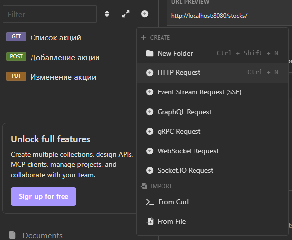
    
2. Попробуем запросить список всех акций. Для этого выберем HTTP метод GET и введём соответствующий путь.
   
    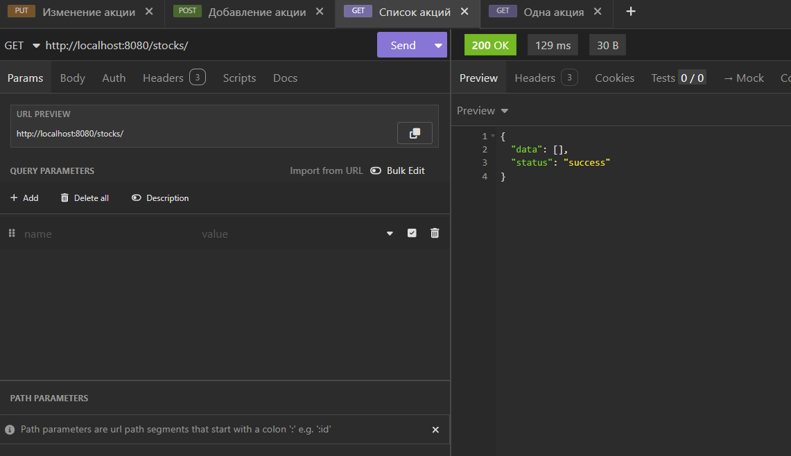
    
3. Как можно увидеть, нам пришел пустой список `[]`. Для добавления новой акции воспользуемся методом POST. Переключимся на запрос добавления акции, убедимся, что выбран метод POST, введём нужный путь, а также добавим в тело запроса форму, описывающую новый объект. Повторим это несколько раз, чтобы данных было больше.
   
    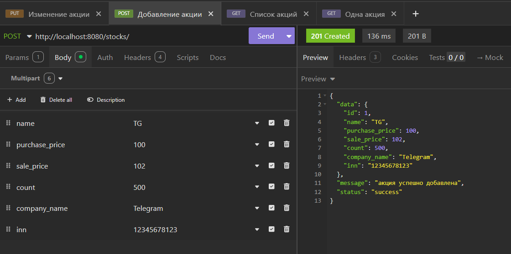

4. Посмотрим детальную информацию об объекте с ID = 3. Убедитесь, что параметр пути задан верно.

    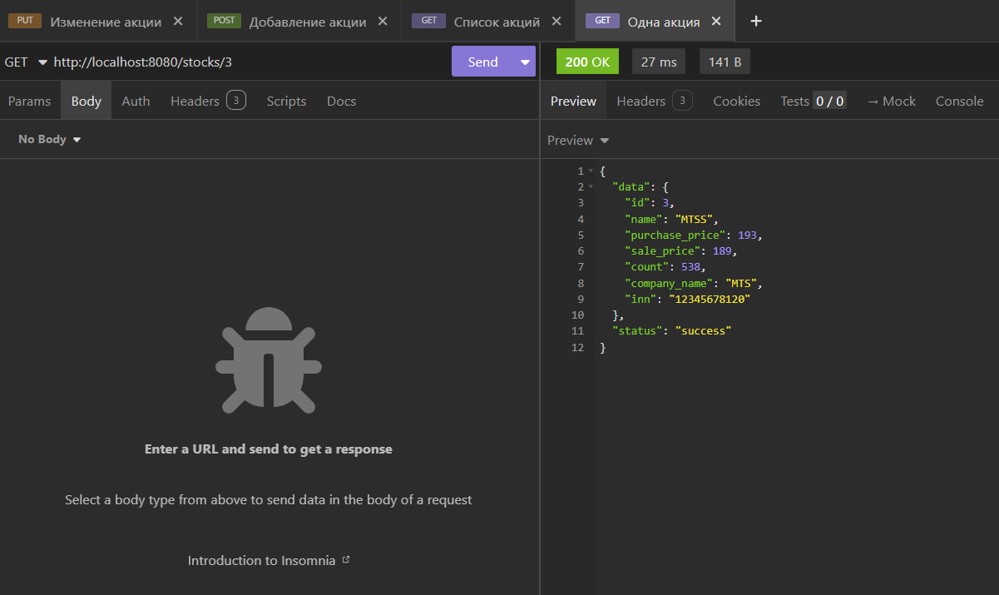

5. Давайте попробуем изменить у объекта с ID = 3 название. Для этого перейдём на наш PUT-метод, добавим корректный ID в путь и передадим изменяемые поля.
   
    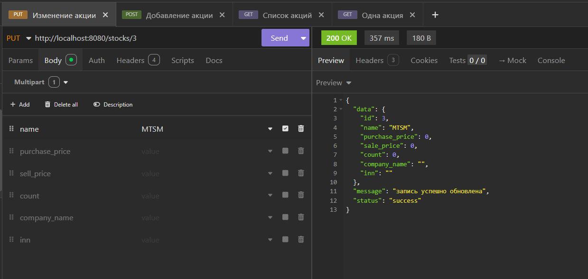

6. Далее удалим объект с ID = 2. Выбрав запрос удаления акции с методом DELETE, в пути аргументом укажем ID. Тело запроса не нужно.
   
    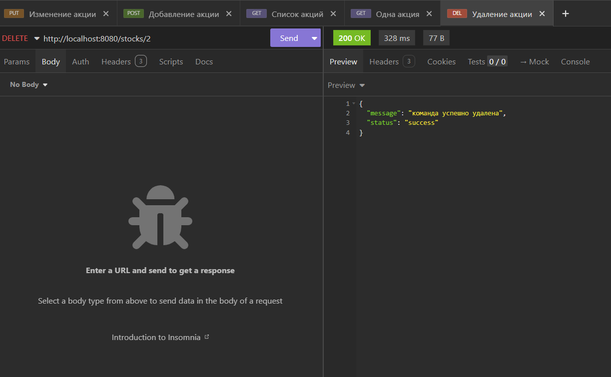

Результат выполненной работы:
1. Рабочий API для вашего сервера по вашей теме.
2. Коллекция запросов с правильными запросами и запросами на тестирование (с плохими ответами)
3. Консистентность статуса ответа и записи в БД. Ваш сервис не может ответить "OK", не изменив базу данных в конкретной задаче.

## 1.12. Полезные ссылки

* Документация Postman - https://learning.postman.com/docs/publishing-your-api/documenting-your-api/
* Как пользоваться curl - https://losst.ru/kak-polzovatsya-curl?ysclid=l91dvjg4xg818007414
* Документация gin-gonic - https://github.com/gin-gonic/gin?ysclid=l8rr0pd0vx287684334
* Документация gorm - https://gorm.io/docs/
* Список кодов состояния HTTP - https://ru.wikipedia.org/wiki/Список_кодов_состояния_HTTP

# 2. Добавление изображения
## 2.1. Постановка задачи и миграции

Для работы с MinIO нам потребуется использовать клиент для Go. Выполним в терминале в директории проекта:

```go get github.com/minio/minio-go/v7```

Также нам потребуется бакет MinIO. Пусть это будет бакет logo, в котором будут храниться логотипы компаний.

Итак, есть хранилище данных. Если мы вспомним лабораторную работу №1, то за работу с хранилищами данных отвечает Repository. Значит, функционал взаимодействия с MinIO будет реализован через него.

Но картинки, передаваемые по API, приходят на Handler. Значит, нам потребуется передавать картинки из Handler в Repository. Описав логику работы, перейдём к её реализации.

Начнём с изменения структуры акции в БД и приложении на Go. Измеменение простое - будем хранить в структуре ссылку на картинку-логотип (можно задать полю тип VARCHAR определённой длины с помощью тега _`gorm`_, что полезно для спецификации, но над этим вы можете подумать сами):

```go
type Stock struct {
	ID            uint   `gorm:"primaryKey" json:"id"`
	Name          string `json:"name"`
	PurchasePrice uint64 `json:"purchase_price"`
	SalePrice     uint64 `json:"sale_price"`
	Count         uint64 `json:"count"`
	CompanyName   string `json:"company_name"`
	INN           string `json:"inn"`
	Pic           string `json:"pic"`
}
```

Запустите файл миграции и убедитесь, что новое поле было добавлено в БД.

## 2.2. Функция добавления изображения

Так как мы собираемся модифицировать содержимое бакета, потребуется авторизация. Хорошим тоном будет сделать конфигурацию подключения к MinIO в том же духе, как мы делали конфигурацию подключения к PostgreSQL в первой лабораторной работе.

`.env`:

```
MINIO_ENDPOINT = "localhost:9000"
MINIO_ACCESS_KEY = "minio"
MINIO_SECRET_KEY = "minio124"
MINIO_BUCKET_NAME = "logo"
```

Теперь добавим в структуру Repository поле minio для клиента MinIO и поле minio_bucket для хранения названия нашего бакета. Импортируем minio-go в `internal/app/repository/repository.go`:

```go
import (
	"github.com/minio/minio-go"
	"github.com/minio/minio-go/pkg/credentials"
	"gorm.io/driver/postgres"
	"gorm.io/gorm"
)
```

Определим требуемые поля. В файле `internal/app/repository/repository.go` изменим определение структуры Repository:

```go
type Repository struct {
	db                *gorm.DB
	minio             *minio.Client
	minio_bucket_name string
}
```

Загрузка конфигурации PostgreSQL имеет довольно минималистичный вид, посколько GORM подключается к БД с помощью DSN (Data Source Name), он же "connection string" - одной строки, описывающей параметры соединения. Подключение к MinIO осуществляется более сложным образом, поэтому придётся модифицировать процесс загрузки конфигурации репозитория.

Организуем инициализацию новых полей структуры. Создадим структуру для передачи параметров подключения к сервисам, с которыми будет взаимодействовать Repository. Добавьте в `internal/app/repository/repository.go`:

```go
type RepositorySettings struct {
	PostgresDSN string
	MinioEndpoint string
	MinioAccessKey string
	MinioSecretKey string
	MinioBucketName string
}
```

Изменим функцию New в `internal/app/repository/repository.go`:

```go
func New(settings *RepositorySettings) (*Repository, error) {
	db, err := gorm.Open(postgres.Open(settings.PostgresDSN), &gorm.Config{}) // подключаемся к БД
	if err != nil {
		return nil, err
	}

	useSSL := false // при true подключаемся к MinIO по HTTPS

	minioClient, err := minio.NewWithOptions(minio_endpoint, &minio.Options{
		Creds:  credentials.NewStaticV4(settings.MinioAccessKey, settings.MinioSecretKey, ""),
		Secure: useSSL,
	})

	if err != nil {
		return nil, err
	}

	// Возвращаем указатель на получившийся Repository
	return &Repository{
		db:                db,
		minio:             minioClient,
		minio_bucket_name: settings.MinioBucketName,
	}, nil
}
```

Скорректируем файл `cmd/projectName/main.go`, чтобы репозиторий создавался корректно:

```go
	rep, errRep := repository.New(&repository.RepositorySettings{
		PostgresDSN: postgresString,
		MinioEndpoint: os.Getenv("MINIO_ENDPOINT"),
		MinioAccessKey: os.Getenv("MINIO_ACCESS_KEY"),
		MinioSecretKey: os.Getenv("MINIO_SECRET_KEY"),
		MinioBucketName: os.Getenv("MINIO_BUCKET_NAME"),	
	})
	if errRep != nil {
		logrus.Fatalf("error initializing repository: %v", errRep)
	}
```

Теперь мы можем взаимодействовать с MinIO. В Repository реализуем добавление изображений. `internal/app/repository/stocks.go`:

```go
func (r *Repository) AddOrReplaceStockImage(stockID uint, header *multipart.FileHeader) error {
	// Название будущего файла - <номер акции>.png

	filename := strconv.FormatUint(uint64(stockID), 10)

	// Расширение .png будет даже у картинок, исходно его не имевших.
	// Это не совсем хорошо, но отображаться всё будет.

	// Открываем файл
	file, err := header.Open()
	if err != nil {
		return fmt.Errorf("ошибка открытия файла: %w", err);
	}
	// Как бы мы ни вышли из этой функции, файл обязательно будет закрыт
	defer file.Close();

	// header уже содержит заголовок с типом файла, но для пущей уверенности
	// мы получим Content-Type на базе реального содержимого файла

	// Тип полученного файла хранится в его первых 512 байтах
	buffer := make([]byte, 512);
	_, err = file.Read(buffer);

	if err != nil {
		return fmt.Errorf("ошибка чтения файла: %w", err);
	}

	// Определяем тип файла по его содержимому
	contentType := http.DetectContentType(buffer)

	// Позиция чтения файла возвращается к исходной
	_, err = file.Seek(0, 0)
	if err != nil {
		return fmt.Errorf("ошибка перемещения по файловому потоку: %w", err);
	}

	_, err = r.minio.PutObject(
		r.minio_bucket_name,
		filename,
		file,
		header.Size,
		minio.PutObjectOptions{
			ContentType: contentType,
		})

	if err != nil {
		return fmt.Errorf("не удалось добавить объект в хранилище minio: %w", err)
	}

	// Эндпоинт здесь должен совпадать с эндпоинтом MinIO в конфигурации
	err = r.db.Model(&ds.Stock{}).Where("id = ?", stockID).UpdateColumn("pic", "http://127.0.0.1:9000/"+r.minio_bucket_name+"/"+filename).Error
	if err != nil {
		// Если не удалось сохранить в БД, удаляем из MinIO
		r.minio.RemoveObject(r.minio_bucket_name, filename)
		return fmt.Errorf("ошибка сохранения пути к изображению: %w", err)
	}

	return nil
}
```

## 2.3. Изменение API 

Итак, в Repository реализован функционал взаимодействия с MinIO. Теперь изменим обработчики методов нашего API: при создании и изменении акций станет возможно добавлять и изменять соответственно ассоциированное изображение. Логика обработки файла одна и та же, поэтому по принципу DRY мы вынесём её в вспомогательную функцию. `internal/app/handler/stocks.go`:

```go

// Вспомогательная функция, определяющая по заголовку 
// Content-File файла, является ли тот изображением
func isImage(contentType string) bool {
	imageTypes := []string{
		"image/jpeg",
		"image/jpg",
		"image/png",
		"image/gif",
		"image/webp",
	}

	for _, t := range imageTypes {
		if contentType == t {
			return true
		}
	}
	return false
}

// Вспомогательная функция, выполняющая валидацию загруженного файла
func validateFileUpload(header *multipart.FileHeader) (int, error) {
	// Окрываем чтение файлового потока
	file, err := header.Open()

	if err != nil {
		return http.StatusBadRequest, fmt.Errorf("не удалось получить файл")
	}

	defer file.Close()

	// Знакомая логика определения типа содержимого...

	buffer := make([]byte, 512)
	_, err = file.Read(buffer)

	if err != nil {
		return http.StatusInternalServerError, fmt.Errorf("не удалось прочитать файл")
	}

	contentType := http.DetectContentType(buffer)

	if !isImage(contentType) {
		return http.StatusBadRequest, fmt.Errorf("файл должен быть изображением")
	}

	// Позиция чтения файла возвращается к исходной
	_, err = file.Seek(0, 0)
	if err != nil {
		return http.StatusInternalServerError, fmt.Errorf("ошибка при обработке файла")
	}

	return 0, nil
}

```

Там же изменим методы для добавления записи об акции в базу данных и редактирования информации о ней:

```go

func (h *Handler) AddStockAPI(ctx *gin.Context) {
	// Прочитаем в ОЗУ 2 Мб данных формы
	// Этого должно хватить для текстовых полей и несложных изображений (логотипов)

	err := ctx.Request.ParseMultipartForm(2 << 20)

	if err != nil {
		h.errorHandler(ctx, http.StatusBadRequest, err)
		return
	}

	// Пытаемся получить файл из формы
	// header имеет тип *multipart.FileHeader и является указателем
	// на метаданные файла
	header, err := ctx.FormFile("pic")

	// Флаг, устанавливаемый, когда поле pic сопоставлено с неким файлом
	fileFound := false

	if err != nil {
		// Файла в запросе нет - допустимая ситуация
		if err != http.ErrMissingFile {
			h.errorHandler(ctx, http.StatusBadRequest, err)
			ctx.JSON(http.StatusBadRequest, gin.H{"error": "File error: " + err.Error()})
			return
		}
	} else {
		fileFound = true
	}

	if fileFound {
		code, err := validateFileUpload(header)

		if err != nil {
			h.errorHandler(ctx, code, err)
			return
		}
	}

	stock := ds.Stock{
		Name:        ctx.Request.FormValue("name"),
		CompanyName: ctx.Request.FormValue("company_name"),
		INN:         ctx.Request.FormValue("inn"),
	}

	if ctx.Request.FormValue("purchase_price") != "" {
		stock.PurchasePrice, err = strconv.ParseUint(ctx.Request.FormValue("purchase_price"), 10, 64)
		if err != nil {
			h.errorHandler(ctx, http.StatusBadRequest, err)
			return
		}
	}

	if ctx.Request.FormValue("sale_price") != "" {
		stock.SalePrice, err = strconv.ParseUint(ctx.Request.FormValue("sale_price"), 10, 64)
		if err != nil {
			h.errorHandler(ctx, http.StatusBadRequest, err)
			return
		}
	}

	if ctx.Request.FormValue("count") != "" {
		stock.Count, err = strconv.ParseUint(ctx.Request.FormValue("count"), 10, 64)
		if err != nil {
			h.errorHandler(ctx, http.StatusBadRequest, err)
			return
		}
	}

	err = h.Repository.AddStock(&stock)

	if err != nil {
		h.errorHandler(ctx, http.StatusInternalServerError, err)
		return
	}

	if fileFound {
		if err = h.Repository.AddOrReplaceStockImage(stock.ID, header); err != nil {
			h.errorHandler(ctx, http.StatusInternalServerError, err)
			return
		}
	}

	ctx.JSON(http.StatusCreated, gin.H{
		"status":  "success",
		"data":    stock,
		"message": "акция успешно добавлена",
	})
}

func (h *Handler) ModifyStockAPI(ctx *gin.Context) {
	strId := ctx.Param("id")
	id, err := strconv.Atoi(strId)

	if err != nil {
		h.errorHandler(ctx, http.StatusInternalServerError, err)
		return
	}

	if err := ctx.Request.ParseMultipartForm(2 << 20); err != nil {
		h.errorHandler(ctx, http.StatusBadRequest, err)
		return
	}

	// Загружаем старые данные, а поля на новые значения будем менять по ходу
	// Потенциально неоптимально, но так мы точно не опустошим лишние поля
	stock, err := h.Repository.GetStock(int(id))
	if err != nil {
		h.errorHandler(ctx, http.StatusInternalServerError, err)
		return
	}

	if ctx.Request.PostForm.Has("name") {
		stock.Name = ctx.Request.FormValue("name")
	}
	if ctx.Request.PostForm.Has("company_name") {
		stock.CompanyName = ctx.Request.FormValue("company_name")
	}
	if ctx.Request.PostForm.Has("inn") {
		stock.INN = ctx.Request.FormValue("inn")
	}

	if ctx.Request.FormValue("purchase_price") != "" {
		stock.PurchasePrice, err = strconv.ParseUint(ctx.Request.FormValue("purchase_price"), 10, 64)
		if err != nil {
			h.errorHandler(ctx, http.StatusBadRequest, err)
			return
		}
	}

	if ctx.Request.FormValue("sale_price") != "" {
		stock.SalePrice, err = strconv.ParseUint(ctx.Request.FormValue("sale_price"), 10, 64)
		if err != nil {
			h.errorHandler(ctx, http.StatusBadRequest, err)
			return
		}
	}

	if ctx.Request.FormValue("count") != "" {
		stock.Count, err = strconv.ParseUint(ctx.Request.FormValue("count"), 10, 64)
		if err != nil {
			h.errorHandler(ctx, http.StatusBadRequest, err)
			return
		}
	}

	header, err := ctx.FormFile("pic")

	var fileFound bool

	if err != nil {
		// Файла в запросе нет - допустимая ситуация
		if err != http.ErrMissingFile {
			h.errorHandler(ctx, http.StatusBadRequest, err)
			ctx.JSON(http.StatusBadRequest, gin.H{"error": "File error: " + err.Error()})
			return
		}
	} else {
		fileFound = true
	}

	if fileFound {
		code, err := validateFileUpload(header)

		if err != nil {
			h.errorHandler(ctx, code, err)
			return
		}
	}

	if err = h.Repository.ModifyStock(uint(id), &stock); err != nil {
		h.errorHandler(ctx, http.StatusInternalServerError, err)
		return
	}

	if fileFound {
		if err = h.Repository.AddOrReplaceStockImage(stock.ID, header); err != nil {
			h.errorHandler(ctx, http.StatusInternalServerError, err)
			return
		}
	}

	updatedStock, err := h.Repository.GetStock(int(id))
	if err != nil {
		h.errorHandler(ctx, http.StatusInternalServerError, err)
		return
	}

	ctx.JSON(http.StatusOK, gin.H{
		"status":  "success",
		"data":    updatedStock,
		"message": "запись успешно обновлена",
	})
}
```

## 2.4. Проверка изменений

Проведём тестирование изменений API в Insomnia, чтобы убедиться, что логика работы с изображениями работоспособна.

1. Выберем метод POST, введём нужный путь. Заполним форму добавления акции, но поле `pic` заполним текстом. Бекенд, приняв запрос, должен добавить акцию, но проигнорировать некорректные данные (текст в поле `pic`).

    

2. Теперь заполним форму корректно. Бекенд должен вернуть сообщение об успешном запросе и передать данные добавленной акции.

    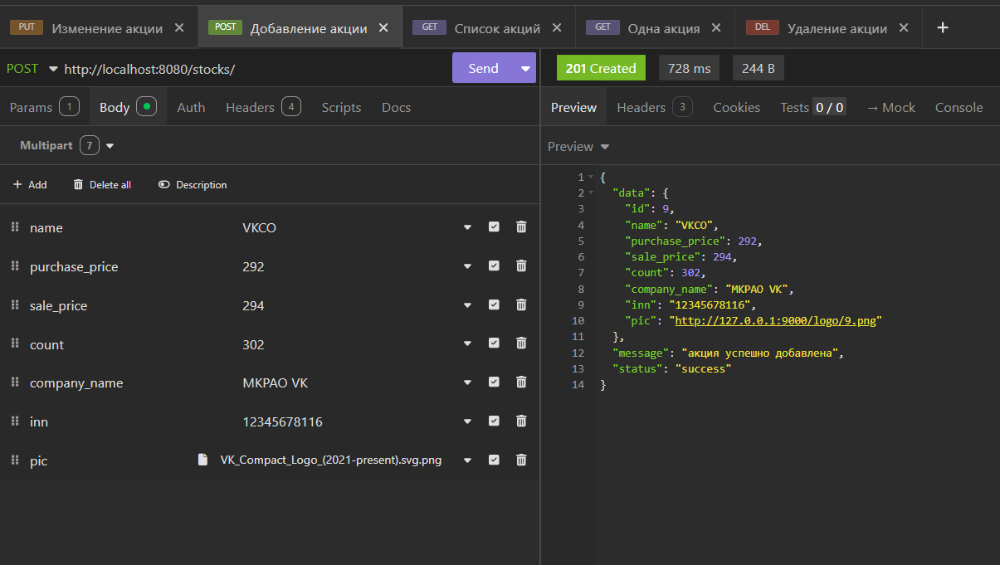

3. Попробуем изменить акцию. Перейдём к запросу PUT изменения акции. Передадим через форму новые значения каких-нибудь полей акции (например, новые логотип и название фирмы). Бекенд должен вернуть данные обновлённой записи и сообщение об успехе.

    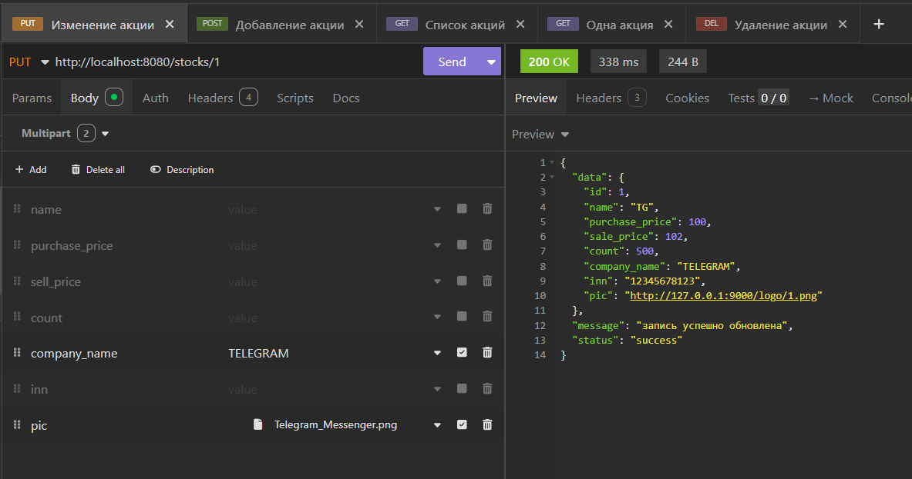

4. Проверим хранилище MinIO, в частности - содержимое бакета logo. В нём должны присутствовать файлы изображений, названные по заданному нами шаблону.

    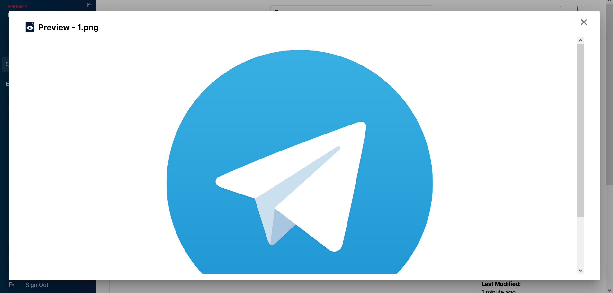

# 3. Вложенная сериализация

## 3.1. Что такое вложенная сериализация?

Вложенная сериализация - процесс сериализации структуры, содержащей вложенные структуры. То есть, такой процесс сериализации, в ходе которого требуется обращение к сторонним сериализаторам, знающим, как "разложить" данные текстового поля-объекта в структуру-объект.

Вложенная сериализация понадобится нам, чтобы работать со связанными сущностями. Достаточно просто собрать их в единую структуру вручную (получить из таблиц, задать структуру или интерфейсы, передать значения в её поля), но мы доверимся средствам языка, чтобы автоматизировать этот процесс.

## 3.2. Сущности и миграция

Попробуем связать сущности акций и пользователей. Сущность пользователя задана в ```internal/app/ds/Users.go```, добавим туда теги `json` для обеспечения сериализации данных:

```go
package ds

type User struct {
	ID          uint   `gorm:"primary_key" json:"id"`
	Login       string `gorm:"type:varchar(25);unique;not null" json:"login"`
	Password    string `gorm:"type:varchar(100);not null" json:"-"`
	IsModerator bool   `gorm:"type:boolean;default:false" json:"is_moderator"`
}
```

Тег `json:"-"` означает, что поле нужно **не** сериализовать.

Далее API будет работать таким образом, что вместе с данными пользователя возвращается список акций, созданных им. Для этого мы создадим отдельную структуру `UserStocks` и задействуем функционал встаиваемых полей (подробнее: https://go.dev/ref/spec#Struct_types), чтобы удобно расширить набор полей. Добавим в ```internal/app/ds/Users.go```:

```go
type UserStocks struct {
	User   User
	Stocks []Stock `json:"stocks"`
}
```

Добавим в Stock поле ID создателя акции. ```internal/app/ds/Stocks.go```:

```go
type Stock struct {
	ID            uint   `gorm:"primaryKey" json:"id"`
	Name          string `json:"name"`
	PurchasePrice uint64 `json:"purchase_price"`
	SalePrice     uint64 `json:"sale_price"`
	Count         uint64 `json:"count"`
	CompanyName   string `json:"company_name"`
	INN           string `json:"inn"`
	Pic           string `json:"pic"`
	CreatorID     uint   `json:"-"`
	Creator       User   `gorm:"foreignKey:CreatorID" json:"-"`
}
```

Как можно заметить, на самом деле мы добавили два поля. Тег, применённый к полю Creator, даёт подсказку GORM, благодаря которой при выборе любой записи Stock поле Creator будет содержать данные ассоциированной записи.

Мы заведём два сериализатора: один будет содержать общую информацию об акции, второй - подробную. У нас есть первый сериализатор, создадим второй как новую структуру. ```internal/app/ds/Stocks.go```:

```go
type FullStockSerializer struct {
	Stock
	Creator User `json:"creator"`
}
```

Этот тип функционально аналогичен Stock, но имеет переопределённое поле Creator.

Далее нам потребуются данные какого-нибудь пользователя. Настоящую авторизацию вы реализуется позже по курсу, а пока зададим в плане миграции запись пользователя по умолчанию, которая будет работать как заглушка-единственный создатель записей. ```cmd/migrate/main.go```:

```go
package main

import (
	"metoda/internal/app/ds"
	"metoda/internal/app/dsn"

	"github.com/joho/godotenv"
	"gorm.io/driver/postgres"
	"gorm.io/gorm"
)

func main() {
	_ = godotenv.Load()
	db, err := gorm.Open(postgres.Open(dsn.PostgresFromEnv()), &gorm.Config{})
	if err != nil {
		panic("failed to connect database")
	}

	// Migrate the schema
	err = db.AutoMigrate(
		&ds.Stock{},
		&ds.User{},
	)
	if err != nil {
		panic("cant migrate db")
	}

	// Check if there is a default user row and add one if it's missing
	var count int64

	db.Model(&ds.User{}).Where("login = ?", "test").Count(&count)
	if count == 0 {
		defaultUser := ds.User{Login: "test", Password: "test123", IsModerator: false}

		err := db.Create(&defaultUser).Error

		if err != nil {
			panic("error creating default user")
		}
	}
}
```

Теперь сущности готовы к дальнейшей работе. Запустите файл миграции, чтобы актуализировать структуру базы данных.

## 3.3. Изменение репозитория

У нас имеется схема пользователя, но бекенд не имеет функционала работы с этой таблицей БД. Исправим это. Создадим файл `internal/app/repository/user.go` и пропишем в нём требуемую функцию:

```go
package repository

import (
	"metoda/internal/app/ds"
)

func (r *Repository) GetUserStocks(id int) (*ds.UserStocks, error) {

	var userStocks ds.UserStocks

	err := r.db.Where("id = ?", id).First(&userStocks.User).Error

	if err != nil {
		return nil, err
	}

	err = r.db.Find(&userStocks.Stocks).Error

	if err != nil {
		return nil, err
	}

	return &userStocks, nil
}
```

Также нам потребуется задействовать функционал жадной загрузки при получении подробной информации об акции. `internal/app/repository/stock.go`:

```go
func (r *Repository) GetStock(id int) (ds.Stock, error) {
	stock := ds.Stock{}
	err := r.db.Preload("Creator").Where("id = ?", id).First(&stock).Error
	if err != nil {
		return ds.Stock{}, err
	}
	return stock, nil
}
```

## 3.4. Изменение API

Нам потребуется изменить старые методы API и добавить новые.

```go
func (h *Handler) GetStockByIdAPI(ctx *gin.Context) {
	strId := ctx.Param("id")
	id, err := strconv.Atoi(strId)
	if err != nil {
		h.errorHandler(ctx, http.StatusInternalServerError, err)
		return
	}

	stock, err := h.Repository.GetStockByID(id)
	if err != nil {
		h.errorHandler(ctx, http.StatusInternalServerError, err)
		return
	}

	// Т.к. мы получаем подробную информацию об акции, используем расширенный сериализатор
	fullStock := ds.FullStockSerializer{Stock: stock}
	fullStock.Creator = stock.Creator

	ctx.JSON(http.StatusOK, gin.H{
		"status": "success",
		"data":   fullStock,
	})
}

func (h *Handler) AddStockAPI(ctx *gin.Context) {
	// Прочитаем в ОЗУ 2 Мб данных формы
	// Этого должно хватить для текстовых полей и несложных изображений (логотипов)

	err := ctx.Request.ParseMultipartForm(2 << 20)

	if err != nil {
		h.errorHandler(ctx, http.StatusBadRequest, err)
		return
	}

	// Пытаемся получить файл из формы
	// header имеет тип *multipart.FileHeader и является указателем
	// на метаданные файла
	header, err := ctx.FormFile("pic")

	// Флаг, устанавливаемый, когда поле pic сопоставлено с неким файлом
	fileFound := false

	if err != nil {
		// Файла в запросе нет - допустимая ситуация
		if err != http.ErrMissingFile {
			h.errorHandler(ctx, http.StatusBadRequest, err)
			return
		}
	} else {
		fileFound = true
	}

	if fileFound {
		code, err := validateFileUpload(header)

		if err != nil {
			h.errorHandler(ctx, code, err)
			return
		}
	}

	stock := ds.Stock{
		Name:        ctx.Request.FormValue("name"),
		CompanyName: ctx.Request.FormValue("company_name"),
		INN:         ctx.Request.FormValue("inn"),
		CreatorID:   1, // временный хардкод
	}

	if ctx.Request.FormValue("purchase_price") != "" {
		stock.PurchasePrice, err = strconv.ParseUint(ctx.Request.FormValue("purchase_price"), 10, 64)
		if err != nil {
			h.errorHandler(ctx, http.StatusBadRequest, err)
			return
		}
	}

	if ctx.Request.FormValue("sale_price") != "" {
		stock.SalePrice, err = strconv.ParseUint(ctx.Request.FormValue("sale_price"), 10, 64)
		if err != nil {
			h.errorHandler(ctx, http.StatusBadRequest, err)
			return
		}
	}

	if ctx.Request.FormValue("count") != "" {
		stock.Count, err = strconv.ParseUint(ctx.Request.FormValue("count"), 10, 64)
		if err != nil {
			h.errorHandler(ctx, http.StatusBadRequest, err)
			return
		}
	}

	err = h.Repository.AddStock(&stock)

	if err != nil {
		h.errorHandler(ctx, http.StatusInternalServerError, err)
		return
	}

	if fileFound {
		if err = h.Repository.AddOrReplaceStockImage(stock.ID, header); err != nil {
			h.errorHandler(ctx, http.StatusInternalServerError, err)
			return
		}

		// К сожалению, данные в stock после заполнения pic устарели

		updatedStock, err := h.Repository.GetStock(int(stock.ID))
		if err != nil {
			h.errorHandler(ctx, http.StatusInternalServerError, err)
			return
		}

		ctx.JSON(http.StatusCreated, gin.H{
			"status":  "success",
			"data":    updatedStock,
			"message": "акция успешно добавлена",
		})
	} else {
		ctx.JSON(http.StatusCreated, gin.H{
			"status":  "success",
			"data":    stock,
			"message": "акция успешно добавлена",
		})
	}
}
```

```go
CreatorID: 1, // временный хардкод
```

Добавим метод API для получения данных пользователя. Создадим файл `internal/app/repository/user.go`:

```go
func (h *Handler) GetUserStocksAPI(ctx *gin.Context) {
	strId := ctx.Param("id")
	id, err := strconv.Atoi(strId)
	if err != nil {
		h.errorHandler(ctx, http.StatusInternalServerError, err)
		return
	}

	userStocks, err := h.Repository.GetUserStocks(id)
	if err != nil {
		h.errorHandler(ctx, http.StatusInternalServerError, err)
		return
	}

	ctx.JSON(http.StatusOK, gin.H{
		"status": "success",
		"data":   userStocks,
	})
}
```

## 3.5. Эндпоинты

Нам потребуется один новый эндпоинт, чтобы получить данные пользователей. В `metoda\internal\app\handler\handler.go` в функцию RegisterHandler добавим маршрут:

```go
	router.POST("/users/:id", h.GetUserStocksAPI)
```

## 3.6. Проверка работы API

Проведём тестирование изменений API в Insomnia.

1. Заполним форму добавления акции в методе добавления акции. Пока ничего не должно быть видно.

    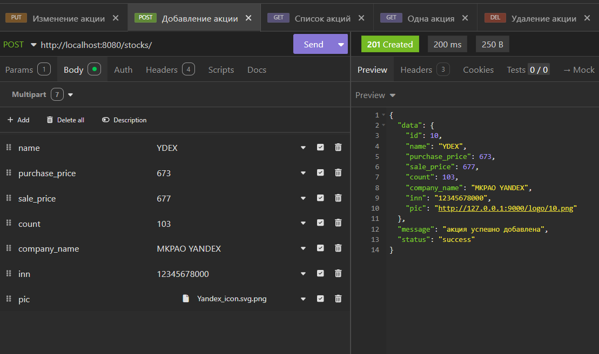

2. Теперь получим свежесозданную акцию. Полученная до этого информация должна быть дополнена информацией о пользователе-создателе.

    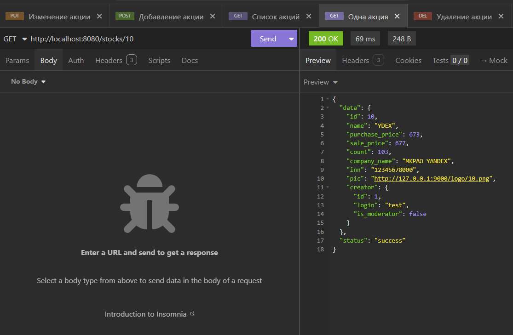

3. Дополним коллекцию запросом обращением к новому эндпоинту API. Запросим данные пользователя с ID = 1. В массиве акций пользователя обязательно должны быть все акции, созданные после добавления ID создателя как внешнего ключа.

    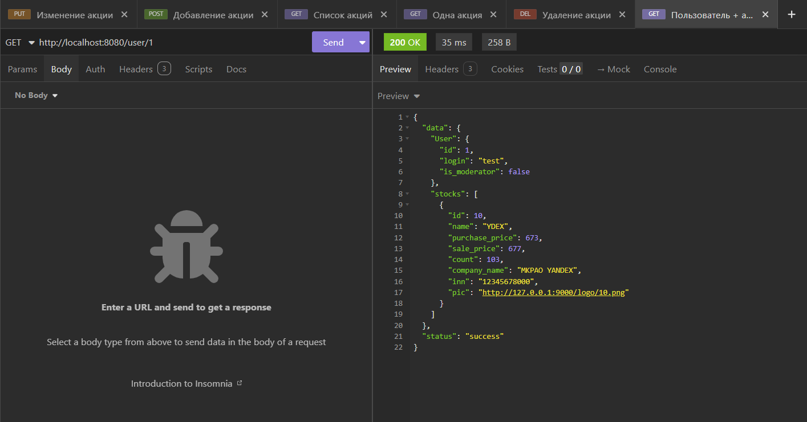

Таким образом, получен __веб-сервис__ с рабочим __API__, интегрированный с __MinIO__. Если вы усвоили описанные здесь принципы, то реализовать более сложный сервис по требованиям лабораторной работы не составит труда. Обратите внимание на вариант передачи данных в теле запроса в формате JSON - в отличие от формы с отдельно обрабатываемыми ключами полей, это переиспользуемые структуры, тривиально маппящиеся на переменную через функцию ShouldBindJSON.