# Методические указания по выполнению лабораторной работы №3

## Тема: Разработка REST API веб-сервиса для интернет-магазина на NestJS

### Оглавление

1. [Введение](#1-введение)
2. [Что такое API и REST](#2-что-такое-api-и-rest)
3. [Описание проекта](#3-описание-проекта)
4. [Установка проекта и настройка окружения](#4-установка-проекта-и-настройка-окружения)
5. [Конфигурация TypeORM в app.module.ts](#5-конфигурация-typeorm-в-appmodulets)
6. [Создание сущностей (Entity)](#6-создание-сущностей-entity)
7. [Реализация репозитория для работы с БД](#7-реализация-репозитория-для-работы-с-бд)
8. [DTO. Сервис с бизнес-логикой](#8-dto-сервис-с-бизнес-логикой)
9. [Контроллер и REST API маршруты](#9-контроллер-и-rest-api-маршруты)
10. [Модуль ProductsModule](#10-модуль-ProductsModule)
11. [Валидация и глобальные пайпы](#11-валидация-и-глобальные-пайпы)
12. [Тестирование GET в Postman](#12-тестирование-GET-в-Postman)
13. [POST запрос](#13-POST-запрос)
14. [GET запрос одной услуги и фильтры](#14-GET-запрос-одной-услуги-и-фильтры)
15. [PUT и DELETE запросы](#15-PUT-и-DELETE-запросы)
16. [MinIo](#16-MinIo)
17. [Итоговая структура проекта](#17-итоговая-структура-проекта)
18. [Полезные ссылки](#18-полезные-ссылки)

---

## 1. Введение

В этой лабораторной работе мы разработаем **REST API веб-сервис** для управления товарами интернет-магазина. В отличие от предыдущих работ, где мы использовали шаблонизацию для взаимодействия с пользователями, здесь мы сосредоточимся на **программном интерфейсе** для взаимодействия между приложениями.

Мы реализуем полный цикл **CRUD операций**:
- **Create** — создание нового товара
- **Read** — получение списка товаров или конкретного товара по ID
- **Update** — обновление существующего товара
- **Delete** — мягкое удаление товара

### Архитектурные слои проекта:

```
┌─────────────────────────────────────────┐
│           Контроллер (Controller)       │ ← HTTP-запросы, маршрутизация
│               @Controller()             │
└─────────────────┬───────────────────────┘
                  │
┌─────────────────▼───────────────────────┐
│            Сервис (Service)             │ ← Бизнес-логика, правила
│               @Injectable()             │
└─────────────────┬───────────────────────┘
                  │
┌─────────────────▼───────────────────────┐
│          Репозиторий (Repository)       │ ← Работа с базой данных
│               @Injectable()             │
└─────────────────┬───────────────────────┘
                  │
┌─────────────────▼───────────────────────┐
│           Сущность (Entity)             │ ← Модель данных, структура таблицы
│               @Entity()                 │
└─────────────────────────────────────────┘
                  │
┌─────────────────▼───────────────────────┐
│          DTO (Data Transfer Object)     │ ← Валидация входных данных
│               class-validator            │
└─────────────────────────────────────────┘
```

---

## 2. Что такое API и REST

### 2.1 API (Application Programming Interface)
**API** — это набор правил и инструментов для взаимодействия программных компонентов. В контексте веб-разработки, API определяет способ, которым клиентские приложения могут взаимодействовать с сервером.

### 2.2 REST (Representational State Transfer)
**REST** — архитектурный стиль для распределенных систем, основанный на следующих принципах:

1. **Клиент-серверная архитектура** — разделение клиента и сервера
2. **Отсутствие состояния** — каждый запрос содержит всю необходимую информацию
3. **Кэширование** — ответы могут быть кэшированы
4. **Единообразие интерфейса** — стандартные HTTP-методы и форматы данных
5. **Слоистая система** — система может состоять из нескольких слоев

---
### 2.3 HTTP-методы в REST API:

| Метод   | Описание                     | Пример использования           |
|---------|------------------------------|--------------------------------|
| **GET**    | Получение ресурса            | `GET /api/products`            |
| **POST**   | Создание нового ресурса      | `POST /api/products`           |
| **PUT**    | Полное обновление ресурса    | `PUT /api/products/1`          |
| **DELETE** | Удаление ресурса             | `DELETE /api/products/1`       |
| **PATCH**  | Частичное обновление ресурса | `PATCH /api/products/1`        |

---

### 2.4 Форматы данных
В REST API данные передаются в формате **JSON** (JavaScript Object Notation):

```json
{
  "id": 1,
  "name": "Ноутбук ASUS VivoBook",
  "price": 54999,
  "category": "Электроника",
  "inStock": true
}
```

---

## 3. Описание проекта

Мы разрабатываем REST API для **интернет-магазина**. Каждый товар имеет следующие характеристики:

### Атрибуты товара:
- **id** — уникальный идентификатор (автоинкремент)
- **name** — название товара (строка, ≥3 символов)
- **description** — описание товара (опционально)
- **price** — цена товара (число, ≥0)
- **category** — категория товара (например, "Электроника", "Книги")
- **inStock** — наличие на складе (булево значение)
- **stockQuantity** — количество на складе (целое число, ≥0)
- **isDeleted** — флаг мягкого удаления (скрыто от клиента)
- **createdAt** — дата создания записи
- **updatedAt** — дата последнего обновления

### Бизнес-правила:
1. При `stockQuantity: 0` автоматически устанавливается `inStock: false`
2. Удаление товара происходит через мягкое удаление (`isDeleted: true`)
3. Удаленные товары не показываются в общих списках
4. Нельзя обновлять удаленные товары
5. Цена товара не может быть отрицательной

---

## 4. Установка проекта и настройка окружения

### 4.1 Установка NestJS CLI

```bash
# Установка NestJS CLI глобально
npm install -g @nestjs/cli

# Проверка установки
nest --version
```
---

### 4.2 Создание нового проекта

```bash
# Создание проекта
nest new bmstu-lab

# Выбор менеджера пакетов (выберите npm)
? Which package manager would you ❤️ to use?
  npm
  yarn
  pnpm

# Переход в папку проекта
cd bmstu-lab
```
---

### 4.3 Установка необходимых зависимостей

```bash
# Основные зависимости для REST API
npm install @nestjs/typeorm typeorm pg @nestjs/config
npm install class-validator class-transformer

# Разработческие зависимости
npm install --save-dev @types/node
```
---

### 4.4 Настройка Docker для PostgreSQL, MinIo

Для выполнения лабораторной работы потребуется развернуть два сервиса:

    PostgreSQL — база данных для хранения структурированной информации

    MinIO — объектное хранилище для загрузки и хранения изображений

Создайте файл docker-compose.yml в корневой директории проекта. Этот файл содержит конфигурацию для одновременного запуска всех необходимых сервисов.

**Важно**: порты на вашем компьютере могут быть заняты другими приложениями. Если при запуске возникают ошибки связанные с портами — измените их в конфигурации.

Пример:
По умолчанию PostgreSQL использует порт 5432:5432. Если он занят, измените конфигурацию на 5439:5432. В этом случае:

- Внутри контейнера PostgreSQL останется на порту 5432

- На вашем компьютере база будет доступна по порту 5439

Аналогично можно настроить порты для MinIO и других сервисов.

```yaml
version: '3.8'

services:
  postgres:
    image: postgres:15-alpine
    container_name: bmstu_postgres
    environment:
      POSTGRES_USER: bmstu_user
      POSTGRES_PASSWORD: bmstu_password
      POSTGRES_DB: bmstu_lab_db
    ports:
      - "5439:5432"
    volumes:
      - postgres_data:/var/lib/postgresql/data
      - ./init.sql:/docker-entrypoint-initdb.d/init.sql
    networks:
      - bmstu_network

  pgadmin:
    image: dpage/pgadmin4
    container_name: bmstu_pgadmin
    environment:
      PGADMIN_DEFAULT_EMAIL: admin@bmstu.ru
      PGADMIN_DEFAULT_PASSWORD: admin
    ports:
      - "5050:80"
    depends_on:
      - postgres
    networks:
      - bmstu_network

  minio:
    image: minio/minio:latest
    container_name: bmstu_minio
    command: server /data --console-address ":9001"
    environment:
      MINIO_ROOT_USER: minioadmin
      MINIO_ROOT_PASSWORD: minioadmin
    ports:
      - "9090:9000"  
      - "9091:9001"  
    volumes:
      - minio_data:/data
    networks:
      - bmstu_network
    healthcheck:
      test: ["CMD", "curl", "-f", "http://localhost:9000/minio/health/live"]
      interval: 30s
      timeout: 20s
      retries: 3

volumes:
  postgres_data:
  minio_data:

networks:
  bmstu_network:
    driver: bridge
```

Заполним БД любым удобным для вас способом, например с помощью PgAdmin:

```sql
CREATE TABLE IF NOT EXISTS products (
    id SERIAL PRIMARY KEY,
    name VARCHAR(255) NOT NULL,
    description TEXT,
    price DECIMAL(10, 2) NOT NULL,
    category VARCHAR(100),
    in_stock BOOLEAN DEFAULT true,
    stock_quantity INTEGER DEFAULT 0,
    is_deleted BOOLEAN DEFAULT false,
    created_at TIMESTAMP DEFAULT CURRENT_TIMESTAMP,
    updated_at TIMESTAMP DEFAULT CURRENT_TIMESTAMP
);
INSERT INTO products (name, description, price, category, stock_quantity) VALUES
    ('Ноутбук ASUS VivoBook', '15.6 дюймов, Intel Core i5, 8GB RAM, 512GB SSD', 54999, 'Электроника', 10),
    ('Смартфон Xiaomi Redmi Note', '6.7" AMOLED, 128GB, 5000mAh', 19999, 'Электроника', 15),
    ('Книга "Чистый код"', 'Роберт Мартин, руководство для разработчиков', 1499, 'Книги', 20),
    ('Кофемашина De''Longhi', 'Автоматическая кофемашина с капучинатором', 24999, 'Бытовая техника', 5),
    ('Наушники Sony WH-1000XM4', 'Беспроводные, шумоподавление', 24999, 'Электроника', 8);
```

---


### 4.5 Конфигурационный файл `.env`

Использование .env файла для хранения конфигурации и секретов — это хорошая практика любого современного проекта, так как она отделяет код от настроек, повышает безопасность и упрощает развертывание в разных окружениях. Создайте файл `.env` в корне проекта и запишите туда данные из `.yaml`:

```env
DB_HOST=localhost
DB_PORT=5439
DB_USERNAME=bmstu_user
DB_PASSWORD=bmstu_password
DB_DATABASE=bmstu_lab_db
DB_SYNCHRONIZE=true
DB_LOGGING=true

MINIO_ENDPOINT=localhost
MINIO_PORT=9090
MINIO_ACCESS_KEY=minioadmin
MINIO_SECRET_KEY=minioadmin
MINIO_BUCKET=bmstu-bucket
MINIO_USE_SSL=false
```
---

### 5 Конфигурация TypeORM в `app.module.ts`

**AppModule** — это главный модуль приложения, где собираются и настраиваются все компоненты (база данных, конфигурация, бизнес-логика). Он подключает TypeORM к PostgreSQL, используя параметры из `.env`, чтобы пароли и настройки не хранились в коде.

**TypeORM** — это ORM (Object-Relational Mapping), который преобразует:
- TypeScript-классы → таблицы в БД
- Объекты → записи в таблицах
- Методы → SQL-запросы

```typescript
import { Module } from '@nestjs/common';
import { ConfigModule, ConfigService } from '@nestjs/config';
import { TypeOrmModule } from '@nestjs/typeorm';
import { ProductsModule } from './modules/products/products.module';

@Module({
  imports: [
    ConfigModule.forRoot({
      isGlobal: true,
      envFilePath: '.env', // явно указываем путь (опционально)
    }),
    TypeOrmModule.forRootAsync({
      imports: [ConfigModule],
      useFactory: (configService: ConfigService) => ({
        type: 'postgres',
        host: configService.get('DB_HOST'),
        port: configService.get<number>('DB_PORT'),
        username: configService.get('DB_USERNAME'),
        password: configService.get('DB_PASSWORD'),
        database: configService.get('DB_DATABASE'),
        entities: [__dirname + '/**/*.entity{.ts,.js}'],
        synchronize: configService.get('DB_SYNCHRONIZE') === 'true',
        logging: configService.get('DB_LOGGING') === 'true',
      }),
      inject: [ConfigService],
    }),
    ProductsModule,
  ],
})
export class AppModule {}
```
**Синхронизация (synchronize: true):**  
Включайте ТОЛЬКО для разработки. В продакшене используйте миграции, иначе можно потерять данные!
---

## 6. Создание сущностей (Entity)

 После настройки TypeORM нужно создать сущности (entities) — это TypeScript-классы, которые описывают таблицы в базе данных. Каждая сущность соответствует одной таблице, а её свойства — колонкам. Создадим сущность `product` со следующими атрибутами:
- **id** — уникальный идентификатор (автоинкремент)
- **name** — название товара (строка, ≥3 символов)
- **description** — описание товара (опционально)
- **price** — цена товара (число, ≥0)
- **category** — категория товара (например, "Электроника", "Книги")
- **inStock** — наличие на складе (булево значение)
- **stockQuantity** — количество на складе (целое число, ≥0)
- **isDeleted** — флаг мягкого удаления (скрыто от клиента)
- **createdAt** — дата создания записи
- **updatedAt** — дата последнего обновления

**Файл:** `src/entities/product.entity.ts`

```typescript
import {
  Entity,
  Column,
  PrimaryGeneratedColumn,
  CreateDateColumn,
  UpdateDateColumn,
} from 'typeorm';
import { Exclude } from 'class-transformer';

// Трансформер decimal → number
const numberTransformer = {
  to: (value: number) => value,
  from: (value: string | null) =>
    value !== null ? parseFloat(value) : null,
};

@Entity('products')
export class ProductEntity {
  @PrimaryGeneratedColumn()
  id: number;

  @Column({ length: 255 })
  name: string;

  @Column('text', { nullable: true })
  description: string;

  @Column('decimal', {
    precision: 10,
    scale: 2,
    transformer: numberTransformer,
  })
  price: number;

  @Column({ name: 'category', length: 100, nullable: true })
  category: string;

  @Column({ name: 'in_stock', default: true })
  inStock: boolean;

  @Column({ name: 'stock_quantity', default: 0 })
  stockQuantity: number;

  @Exclude()
  @Column({ name: 'is_deleted', default: false })
  isDeleted: boolean;

  @CreateDateColumn({ name: 'created_at' })
  createdAt: Date;

  @UpdateDateColumn({ name: 'updated_at' })
  updatedAt: Date;
}

**Зачем нужен @Exclude()?**  
Этот декоратор скрывает поле `isDeleted` при преобразовании в JSON. Клиент не должен видеть флаг удаления.

```

| Декоратор | Описание | Пример |
|-----------|----------|--------|
| `@Entity()` | Помечает класс как сущность базы данных | `@Entity('products')` |
| `@PrimaryGeneratedColumn()` | Автоинкрементный первичный ключ | `@PrimaryGeneratedColumn()` |
| `@Column()` | Обычное поле таблицы | `@Column({ length: 255 })` |
| `@CreateDateColumn()` | Автоматически заполняемая дата создания | `@CreateDateColumn()` |
| `@UpdateDateColumn()` | Автоматически обновляемая дата изменения | `@UpdateDateColumn()` |

---

## 7. Реализация репозитория для работы с БД

**Репозиторий — это "посредник" между сервисом и БД.**  
Задачи репозитория:
1. Выполнять SQL-запросы
2. Преобразовывать данные из БД в объекты
3. Скрывать сложность SQL от бизнес-логики

**@Injectable()** — это пометка, что класс можно "инжектировать" (внедрять) в другие классы через конструктор, как зависимость.

**TypeORM** сам создаёт репозитории, потому что они стандартные для каждой сущности: `find`, `save`, `delete` и другие базовые методы одинаковы для всех таблиц.

Для начала попробуем реализовать метод `GET` запроса:

**Файл:** `src/modules/products/repositories/typeorm-products.repository.ts`

```typescript
import { Injectable } from '@nestjs/common';
import { InjectRepository } from '@nestjs/typeorm';
import { Repository } from 'typeorm';
import { ProductEntity } from '../../../entities/product.entity';

@Injectable()
export class TypeORMProductsRepository {
  constructor(
    @InjectRepository(ProductEntity)
    private repository: Repository<ProductEntity>,
  ) {}

  async findAll(): Promise<ProductEntity[]> {
    // Возвращаем все продукты без фильтрации
    return await this.repository.find();
  }
}
```

---

## 8. DTO. Сервис с бизнес-логикой

По заданию при `GET` запросе, мы не должны видеть удаленные продукты. Для этого реализуем `DTO`.
**DTO (Data Transfer Object)** — это классы для передачи данных между клиентом и сервером.
Представьте, что вы отправляете посылку:

    - Сущность (Entity) — это весь ваш дом со всеми вещами внутри

    - DTO — это коробка, в которую вы кладете только нужные вещи для отправки. В нашем случае мы положим все кроме поля IsDeleted.

**Файл:** `src/modules/products/dto/product-response.dto.ts`

```typescript
export class ProductResponseDto {
  id: number;
  name: string;
  description: string | null;
  price: number;
  category: string | null;
  inStock: boolean;
  stockQuantity: number;
  createdAt: Date;
  updatedAt: Date;
}
```
**Файл `products.service.ts` — это бизнес-логика приложения.** Здесь пишут всю работу с данными: фильтрацию, преобразование сущностей в `DTO`, проверки, расчеты. Это посредник между контроллером (получает запрос) и репозиторием (работает с базой).

**Файл:** `src/modules/products/services/products.service.ts`

```typescript
import { Injectable } from '@nestjs/common';
import { TypeORMProductsRepository } from './repositories/typeorm-products.repository';
import { ProductResponseDto } from './dto/product-response.dto';

@Injectable()
export class ProductsService {
  constructor(
    private readonly productsRepository: TypeORMProductsRepository,
  ) {}

async findAll(): Promise<ProductResponseDto[]> {
  const products = await this.productsRepository.findAll();
  const activeProducts = products.filter(product => !product.isDeleted);
  
  return activeProducts.map(product => {
    const { isDeleted, ...productData } = product;
    return productData as ProductResponseDto;
  });
}
}
```
---

## 9. Контроллер и REST API маршруты

**Контроллер — это "входная дверь" API:**
- Принимает HTTP-запросы
- Проверяет данные (валидация)
- Вызывает сервис для обработки
- Возвращает ответ клиенту

**Файл:** `src/modules/products/controllers/products.controller.ts`

```typescript
import { Controller, Get } from '@nestjs/common';
import { ProductsService } from './services/products.service';
import { ProductResponseDto } from './dto/product-response.dto';

@Controller('products')
export class ProductsController {
  constructor(private readonly productsService: ProductsService) {}

  @Get()
  async getAllProducts(): Promise<ProductResponseDto[]> {
    return this.productsService.findAll();
  }
}
```
---

### Что делает этот контроллер:
1. `@Controller('products')` — слушает запросы по пути `/products`
2. `@Get()` — обрабатывает GET-запрос на `/products`
3. Вызывает `productsService.findAll()` для получения данных
4. Возвращает DTO-объекты клиенту

---

## 10. Модуль ProductsModule

**Модуль в NestJS — это "контейнер":**  
Он группирует связанные компоненты:
- Контроллеры (обработчики запросов)
- Сервисы (бизнес-логика)
- Репозитории (работа с БД)

**Без модуля NestJS не поймет,** как связать контроллер, сервис и репозиторий.

**Файл:** `src/modules/products/products.module.ts`

```typescript
import { Module } from '@nestjs/common';
import { TypeOrmModule } from '@nestjs/typeorm';
import { ProductEntity } from '../../entities/product.entity';
import { ProductsController } from './controllers/products.controller';
import { ProductsService } from './services/products.service';
import { TypeORMProductsRepository } from './repositories/typeorm-products.repository';

@Module({
  imports: [TypeOrmModule.forFeature([ProductEntity])],
  controllers: [ProductsController],
  providers: [
    ProductsService,
    TypeORMProductsRepository, // Просто добавляем репозиторий
  ],
  exports: [ProductsService],
})
export class ProductsModule {}
```

---

## 11. Валидация и глобальные пайпы

**Зачем валидация?**  
Чтобы защитить API от некорректных данных:
- Проверка типов (число/строка/булево)
- Проверка диапазонов (цена ≥ 0)
- Проверка обязательных полей

**Пайпы (Pipes) в NestJS** — это middleware для трансформации и валидации данных перед попаданием в контроллер.

### 11.1 Настройка глобальной валидации в `main.ts`

```typescript
import { NestFactory } from '@nestjs/core';
import { AppModule } from './app.module';
import { ValidationPipe } from '@nestjs/common';
import { ClassSerializerInterceptor } from '@nestjs/common';
import { Reflector } from '@nestjs/core';

async function bootstrap() {
  const app = await NestFactory.create(AppModule);
  app.setGlobalPrefix('api');
  // Валидация DTO
  app.useGlobalPipes(new ValidationPipe({
    whitelist: true,
    forbidNonWhitelisted: true,
    transform: true,
  }));

  // Автоматически скрывает поля с @Exclude() (например, isDeleted)
  app.useGlobalInterceptors(new ClassSerializerInterceptor(app.get(Reflector)));

  await app.listen(3000);
  console.log(`Application is running on: http://localhost:3000`);
}
bootstrap();
```
---

### 11.2 Параметры ValidationPipe:

| Параметр | Значение по умолчанию | Описание |
|----------|----------------------|----------|
| `whitelist` | `false` | Удаляет поля, не описанные в DTO |
| `forbidNonWhitelisted` | `false` | Выбрасывает ошибку при лишних полях |
| `transform` | `false` | Преобразует типы данных |
| `disableErrorMessages` | `false` | Отключает сообщения об ошибках |

---


## 12. Тестирование GET в Postman
1. Поднимете `docke контейнер` командой `docker compose up`:

   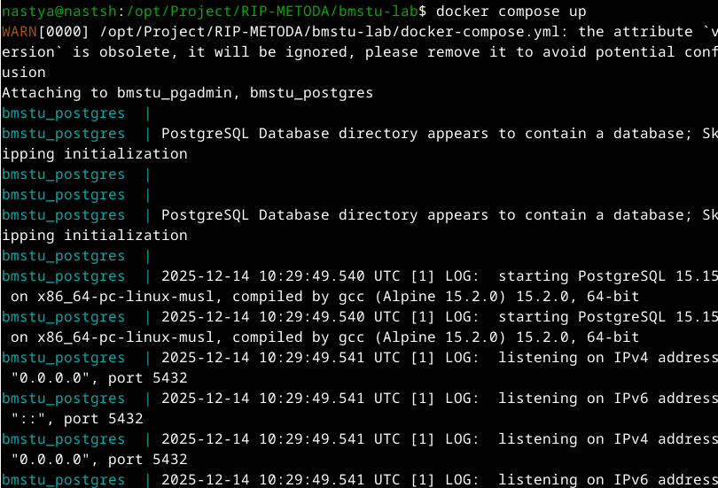

2. Проверьте, что `PostgreSQL` и `MinIo`в состоянии `listening`
3. Запустите ваш проект: `npm run start:dev`

    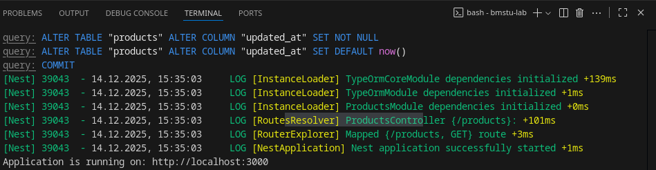

4. Скачайте `Postman` с официального сайта: https://www.postman.com/downloads/
5. Установите и откройте приложение
6. Создайте новый `GET` запрос: 

```text
http://localhost:3000/api/products
```

  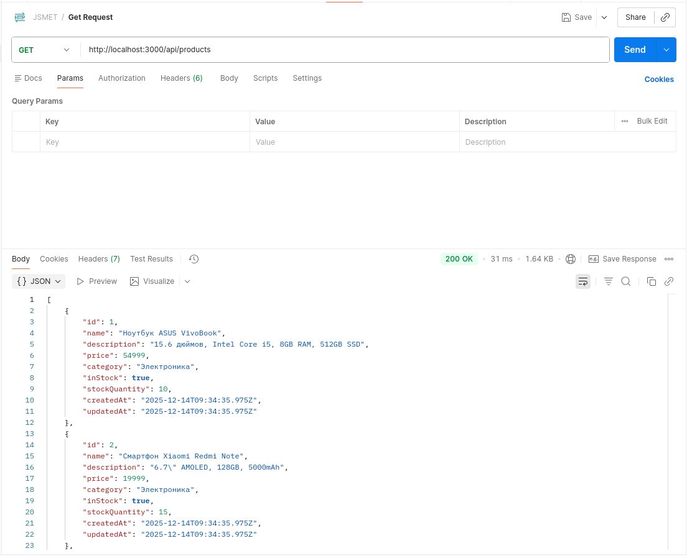

Отлично! Вы сделали первый `REST IP` запрос! Теперь давайте реализуем `POST` запрос.

---

## 13. POST запрос

**Как работает POST-запрос:**
1. Клиент отправляет JSON в теле запроса
2. NestJS автоматически преобразует JSON в DTO
3. `class-validator` проверяет данные по правилам из DTO
4. Если ошибок нет — данные попадают в сервис


Создайте `dto` для `POST` запроса. Добавьте сюда немного логики обработки ошибок, например цена не может быть отрицательной.
**Файл:** `src/modules/products/dto/create-product.dto.ts`

```typescript
import {
  IsString,
  IsNumber,
  Min,
  MinLength,
  IsOptional,
  IsBoolean,
} from 'class-validator';
import { Type } from 'class-transformer';

export class CreateProductDto {
  @IsString()
  @MinLength(3, { message: 'Название должно быть не менее 3 символов' })
  name: string;

  @IsString()
  @IsOptional()
  description?: string;

  @Type(() => Number)
  @IsNumber()
  @Min(0, { message: 'Цена не может быть отрицательной' })
  price: number;

  @IsString()
  @IsOptional()
  category?: string;

  @IsBoolean()
  @IsOptional()
  inStock?: boolean;

  @Type(() => Number)
  @Min(0)
  @IsOptional()
  @IsNumber()
  stockQuantity?: number;
}

```
**Важно:** `@Type(() => Number)` преобразует строку из JSON в число, так как в HTTP все данные передаются как строки.

В репозиторий также добавим метод POST:

**Файл:** `src/modules/products/repositories/typeorm-products.repository.ts`

```typescript
  async create(data: Partial<ProductEntity>): Promise<ProductEntity> {
  const product = this.repository.create(data);
  return await this.repository.save(product);
  }
```
В **файле:** `src/modules/products/services/products.service.ts` сделайте импорт
```typescript
import { CreateProductDto } from './dto/create-product.dto';
```
и добавте следующий код:

```typescript
async create(createProductDto: CreateProductDto): Promise<ProductResponseDto> {
  if (createProductDto.stockQuantity === 0) {
    createProductDto.inStock = false;
  }
    
  const product = await this.productsRepository.create(createProductDto);
  const { isDeleted, ...productWithoutDeleted } = product;
  return productWithoutDeleted as ProductResponseDto;
}
```

В **файле:** `src/modules/products/controllers/products.controller.ts` сделайте импорт
```typescript
import { CreateProductDto } from './dto/create-product.dto';
```
и добавте следующий код:

```typescript
  @Post()
  async createProduct(
    @Body() createProductDto: CreateProductDto
  ): Promise<ProductResponseDto> {
    return this.productsService.create(createProductDto);
  }
```

Снова запустите код приложения и сделайте пост запрос в `Postman`:
```text
http://localhost:3000/api/products
```
Тело json:
```json
{
  "name": "test",
  "description": "этот объект должен стать 6 в бд",
  "price": 1000,
  "category": "Электроника",
  "stockQuantity": 10
}
```

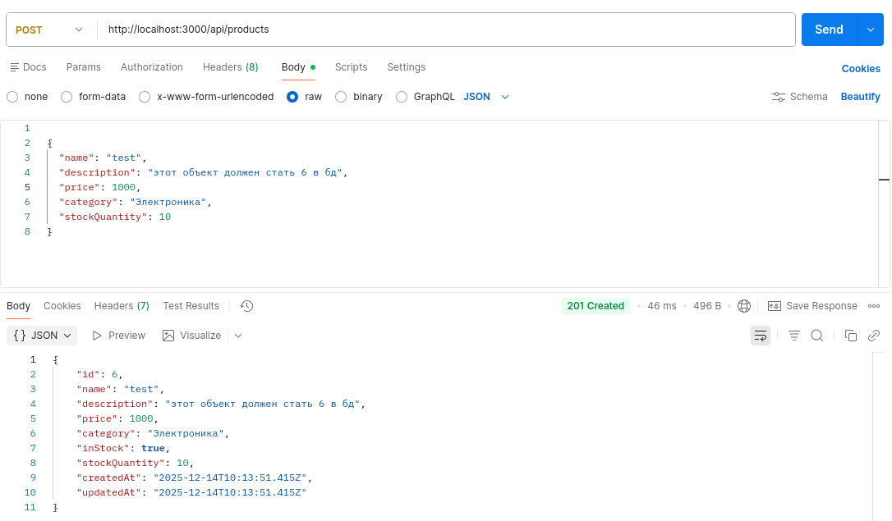

---

## 14. GET запрос одной услуги и фильтры

**Фильтрация — важная функция API,** которая позволяет:
- Искать товары по названию/описанию
- Фильтровать по категории, цене, наличию
- Сортировать результаты

**Почему Query-параметры?**  
Для фильтрации используем query-параметры (`?category=Электроника`), а не path-параметры (`/category/Электроника`), потому что:
1. Можно комбинировать фильтры
2. Неограниченное количество параметров
3. Стандартная практика REST

Чтобы было удобнее отслеживать услуги и сортировать, необходимо добавить вызов одной услуги, а также фильтры на вызов всех услуг. Давайте это реализуем.
**Файл:** `src/modules/products/dto/product-filters.dto.ts`
```typescript
import { IsOptional, IsString, IsBoolean, IsNumber, Min } from 'class-validator';
import { Type } from 'class-transformer';

export class ProductFiltersDto {
  @IsOptional()
  @IsString()
  search?: string;

  @IsOptional()
  @IsString()
  category?: string;

  @IsOptional()
  @Type(() => Boolean)
  @IsBoolean()
  inStock?: boolean;

  @IsOptional()
  @Type(() => Number)
  @IsNumber()
  @Min(0)
  minPrice?: number;

  @IsOptional()
  @Type(() => Number)
  @IsNumber()
  @Min(0)
  maxPrice?: number;

  @IsOptional()
  @Type(() => Boolean)
  @IsBoolean()
  includeDeleted?: boolean;
}

```

Изменим репозиторий. Добавим `findById`, а также изменим `findAll`, добавив туда фильтры.
```typescript
import { Injectable } from '@nestjs/common';
import { InjectRepository } from '@nestjs/typeorm';
import { Repository } from 'typeorm';
import { ProductEntity } from '../../../entities/product.entity';
import { ProductFiltersDto } from '../dto/product-filters.dto'; // путь поправь под себя

@Injectable()
export class TypeORMProductsRepository {
  constructor(
    @InjectRepository(ProductEntity)
    private readonly repository: Repository<ProductEntity>,
  ) {}

  async findAll(filters?: ProductFiltersDto): Promise<ProductEntity[]> {
    const query = this.repository.createQueryBuilder('product');

    if (!filters?.includeDeleted) {
      query.where('product.is_deleted = false');
    }

    if (filters?.search) {
      query.andWhere(
        '(product.name ILIKE :search OR product.description ILIKE :search)',
        { search: `%${filters.search}%` },
      );
    }

    if (filters?.category) {
      query.andWhere('product.category = :category', {
        category: filters.category,
      });
    }

    if (filters?.inStock !== undefined) {
      query.andWhere('product.in_stock = :inStock', {
        inStock: filters.inStock,
      });
    }

    if (filters?.minPrice !== undefined) {
      query.andWhere('product.price >= :minPrice', {
        minPrice: filters.minPrice,
      });
    }

    if (filters?.maxPrice !== undefined) {
      query.andWhere('product.price <= :maxPrice', {
        maxPrice: filters.maxPrice,
      });
    }

    return await query.getMany();
  }

  async findById(id: number): Promise<ProductEntity | null> {
    return await this.repository.findOne({
      where: { id },
    });
  }

  async create(data: Partial<ProductEntity>): Promise<ProductEntity> {
    const product = this.repository.create(data);
    return await this.repository.save(product);
  }
}
```
В **файле:** `src/modules/products/services/products.service.ts` сделайте импорт

```typescript
import { Injectable, NotFoundException } from '@nestjs/common';
import { TypeORMProductsRepository } from './repositories/typeorm-products.repository';
import { ProductResponseDto } from './dto/product-response.dto';
import { CreateProductDto } from './dto/create-product.dto';
import { ProductFiltersDto } from './dto/product-filters.dto';

@Injectable()
export class ProductsService {
  constructor(
    private readonly productsRepository: TypeORMProductsRepository,
  ) {}

  async findAll(filters: ProductFiltersDto): Promise<ProductResponseDto[]> {
    // по умолчанию не показываем удалённые
    if (filters.includeDeleted === undefined) {
      filters.includeDeleted = false;
    }

    const products = await this.productsRepository.findAll(filters);

    return products.map(product => {
      const { isDeleted, ...productData } = product;
      return productData as ProductResponseDto;
    });
  }

  async findById(id: number): Promise<ProductResponseDto> {
    const product = await this.productsRepository.findById(id);

    if (!product || product.isDeleted) {
      throw new NotFoundException(`Товар с ID ${id} не найден`);
    }

    const { isDeleted, ...productData } = product;
    return productData as ProductResponseDto;
  }

  async create(
    createProductDto: CreateProductDto,
  ): Promise<ProductResponseDto> {
    if (createProductDto.stockQuantity === 0) {
      createProductDto.inStock = false;
    }

    const product = await this.productsRepository.create(createProductDto);
    const { isDeleted, ...productData } = product;

    return productData as ProductResponseDto;
  }
}

```
В **файле:** `src/modules/products/controllers/products.controller.ts` сделайте новые импорты и добавьте методы.
```typescript
import {
  Controller,
  Get,
  Post,
  Body,
  Param,
  Query,
  ParseIntPipe,
} from '@nestjs/common';
import { ProductsService } from './services/products.service';
import { ProductResponseDto } from './dto/product-response.dto';
import { CreateProductDto } from './dto/create-product.dto';
import { ProductFiltersDto } from './dto/product-filters.dto';

@Controller('products')
export class ProductsController {
  constructor(private readonly productsService: ProductsService) {}

  @Get()
  async getAllProducts(
    @Query() filters: ProductFiltersDto,
  ): Promise<ProductResponseDto[]> {
    return this.productsService.findAll(filters);
  }

  @Get(':id')
  async getProductById(
    @Param('id', ParseIntPipe) id: number,
  ): Promise<ProductResponseDto> {
    return this.productsService.findById(id);
  }

  @Post()
  async createProduct(
    @Body() createProductDto: CreateProductDto,
  ): Promise<ProductResponseDto> {
    return this.productsService.create(createProductDto);
  }
}
```
Отлично! Давайте запустим проект и проверим новые запросы.

1. `GET` фильтр:
```text
 http://localhost:3000/api/products?category=Электроника&inStock=true&minPrice=1000&maxPrice=25000&search=test
 ```

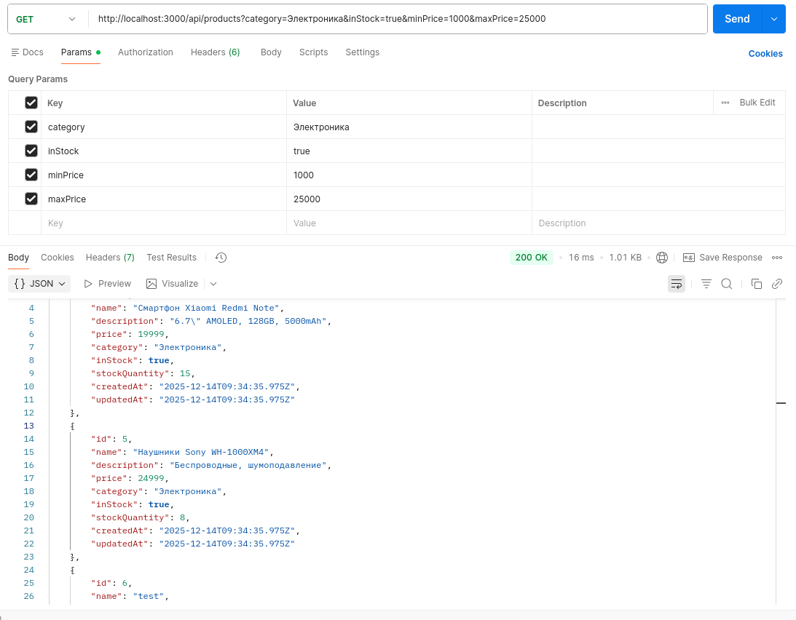

2. `GET` 1 услуги:

```text
http://localhost:3000/api/products/2
```

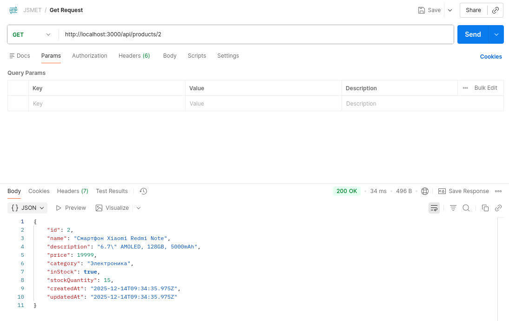

---

## 15. PUT и DELETE запросы

**Мягкое удаление (soft delete) vs физическое удаление:**
- **Мягкое** — ставим флаг `isDeleted: true`, товар скрывается
- **Физическое** — удаляем запись из БД навсегда

**Почему мягкое удаление лучше?**
1. Можно восстановить товар
2. Сохраняется история заказов
3. Не нарушаются внешние ключи

Реализуем метод `DELETE`. Важно! В данном примере мы не будем удалять записать из самой БД, а будем лишь её скрывать. Это значит, что мы будем изменять соответсвующее поле, поэтому вместе с методом `DELETE` нам нужно реализовать `PUT`.

Создайте `dto` для `PUT` запроса. 
**Файл:** `src/modules/products/dto/update-product.dto.ts`
```typescript
import {
  IsString,
  IsNumber,
  Min,
  MinLength,
  IsOptional,
  IsBoolean,
} from 'class-validator';
import { Type } from 'class-transformer';

export class UpdateProductDto {
  @IsString()
  @IsOptional()
  @MinLength(3)
  name?: string;

  @IsString()
  @IsOptional()
  description?: string;

  @Type(() => Number)
  @IsNumber()
  @Min(0)
  @IsOptional()
  price?: number;

  @IsString()
  @IsOptional()
  category?: string;

  @IsBoolean()
  @IsOptional()
  inStock?: boolean;

  @Type(() => Number)
  @IsNumber()
  @Min(0)
  @IsOptional()
  stockQuantity?: number;
}
```

  Внесем изменения в репозиторий:
  **Файл:** `src/modules/products/repositories/typeorm-products.repository.ts`
```typescript
    async update(
    id: number,
    data: Partial<ProductEntity>,
  ): Promise<ProductEntity> {
    await this.repository.update(id, data);

    const updatedProduct = await this.findById(id);
    if (!updatedProduct) {
      throw new Error(`Product with id ${id} not found after update`);
    }

    return updatedProduct;
  }

  async softDelete(id: number): Promise<void> {
    await this.repository.update(id, {
      isDeleted: true,
      inStock: false,
    });
  }
```

В **файле:** `src/modules/products/services/products.service.ts` сделайте импорт
```typescript
import { Injectable, NotFoundException, BadRequestException, } from '@nestjs/common';
import { UpdateProductDto } from './dto/update-product.dto';
```
И добавьте методы:
```typescript
  async update(
    id: number,
    updateProductDto: UpdateProductDto,
  ): Promise<ProductResponseDto> {
    const product = await this.productsRepository.findById(id);

    if (!product) {
      throw new NotFoundException(`Товар с ID ${id} не найден`);
    }

    if (product.isDeleted) {
      throw new BadRequestException('Нельзя обновлять удалённый товар');
    }

    if (updateProductDto.stockQuantity !== undefined) {
      updateProductDto.inStock = updateProductDto.stockQuantity > 0;
    }

    const updatedProduct = await this.productsRepository.update(
      id,
      updateProductDto,
    );

    const { isDeleted, ...productData } = updatedProduct;
    return productData as ProductResponseDto;
  }
  async remove(id: number): Promise<void> {
    const product = await this.productsRepository.findById(id);

    if (!product || product.isDeleted) {
      throw new NotFoundException(`Товар с ID ${id} не найден`);
    }

    await this.productsRepository.softDelete(id);
  }
```
В **файле:** `src/modules/products/controllers/products.controller.ts` сделайте новые импорты и добавьте методы. Итоговый файл выглядит так:

```typescript
import {
  Controller,
  Get,
  Post,
  Put,
  Delete,
  Body,
  Param,
  Query,
  ParseIntPipe,
} from '@nestjs/common';
import { ProductsService } from './services/products.service';
import { ProductResponseDto } from './dto/product-response.dto';
import { CreateProductDto } from './dto/create-product.dto';
import { ProductFiltersDto } from './dto/product-filters.dto';
import { UpdateProductDto } from './dto/update-product.dto';

@Controller('products')
export class ProductsController {
  constructor(private readonly productsService: ProductsService) {}

  @Get()
  async getAllProducts(
    @Query() filters: ProductFiltersDto,
  ): Promise<ProductResponseDto[]> {
    return this.productsService.findAll(filters);
  }

  @Get(':id')
  async getProductById(
    @Param('id', ParseIntPipe) id: number,
  ): Promise<ProductResponseDto> {
    return this.productsService.findById(id);
  }

  @Post()
  async createProduct(
    @Body() createProductDto: CreateProductDto,
  ): Promise<ProductResponseDto> {
    return this.productsService.create(createProductDto);
  }
  @Put(':id')
  async updateProduct(
    @Param('id', ParseIntPipe) id: number,
    @Body() updateProductDto: UpdateProductDto,
  ): Promise<ProductResponseDto> {
    return this.productsService.update(id, updateProductDto);
  }

@Delete(':id')
async deleteProduct(
  @Param('id', ParseIntPipe) id: number,
) {
  await this.productsService.remove(id);
  return {
    message: `Товар с ID ${id} успешно удален`,
    status: 'success',
    timestamp: new Date().toISOString()
  };
}
}

```

1. Проверим `PUT` запрос:

```text
http://localhost:3000/api/products/6
```

```json
{
  "name": "Ноутбук Asus",
  "price": 52999,
  "stockQuantity": 8
}
```

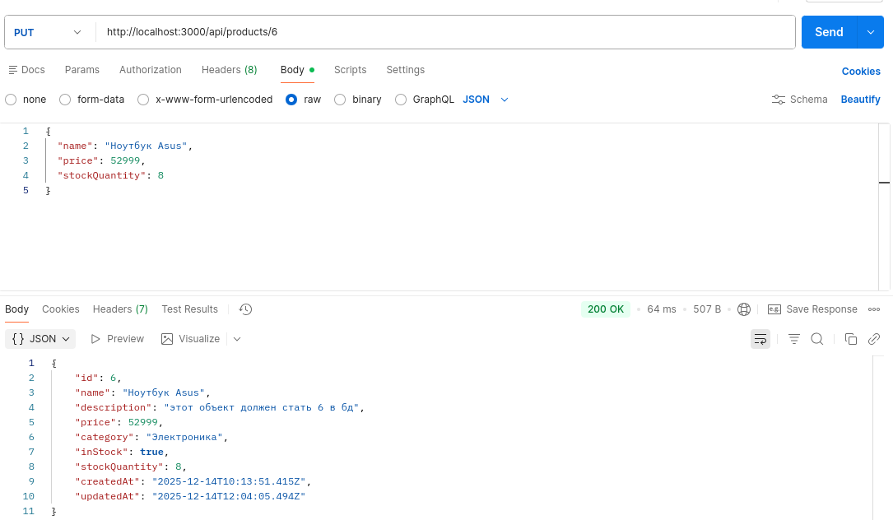

Проверим что услуга действительно изменилась:

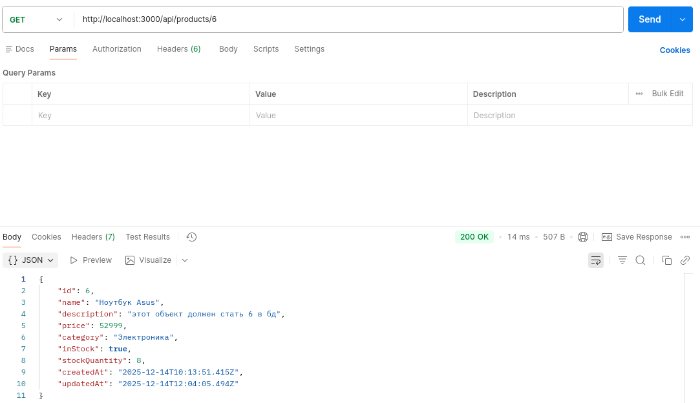


2. Проверим `DELETE` запрос:

```text
http://localhost:3000/api/products/1
```

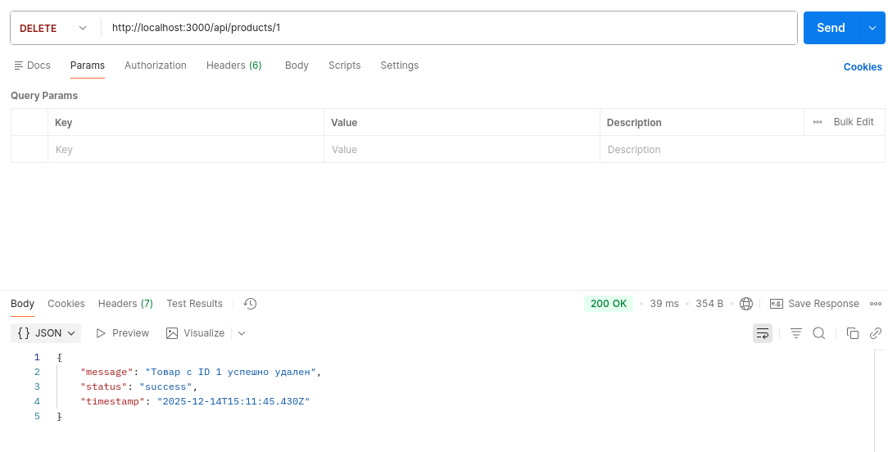

Проверим что услуга действительно удалилась:

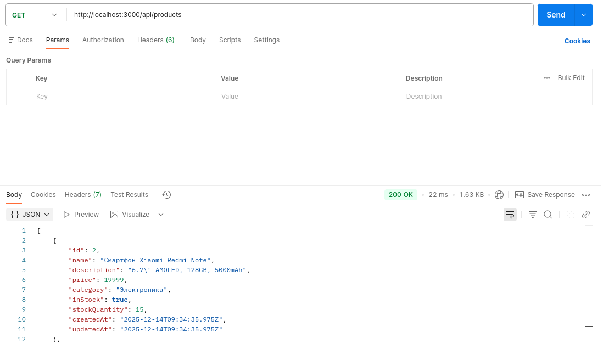

Отлично! Мы реализовали основные запросы необходимые для сервиса. Остальные запросы буду делаться аналогично, просто выполняться с другими сущностями и с другой бизнес-логикой.

---

## 16. MinIo

**MinIO — это S3-совместимое объектное хранилище.**  
Зачем оно нужно вместо сохранения файлов на диск сервера?
1. **Масштабируемость** — файлы отдельно от приложения
2. **Надежность** — репликация данных
3. **Производительность** — отдача файлов напрямую из хранилища

**Как это работает:**
1. Файл → MinIO → возвращает URL
2. URL сохраняем в БД
3. При запросе генерируем временную ссылку (signed URL)

Давайте реализуем сервис связанный с картинками:
`POST` добавление изображения.Добавление изображения по id услуги, старое изображение заменяется/удаляется. Название изображение генерируется на латинице.

Установим зависимости:

```bash
npm install minio
npm install multer
npm install -D @types/multer
```
Создадим простой `MinIo` сервис
**файл:** `rc/modules/products/services/minio.service.ts`

```typescript
import { Injectable } from '@nestjs/common';
import { ConfigService } from '@nestjs/config';
import * as Minio from 'minio';

@Injectable()
export class MinioSimpleService {
  private minioClient: Minio.Client;
  private bucketName: string;

  constructor(private configService: ConfigService) {
    this.bucketName = this.configService.get<string>('MINIO_BUCKET')!;
    
    this.minioClient = new Minio.Client({
      endPoint: this.configService.get<string>('MINIO_ENDPOINT')!,
      port: this.configService.get<number>('MINIO_PORT')!,
      useSSL: this.configService.get<string>('MINIO_USE_SSL')! === 'true',
      accessKey: this.configService.get<string>('MINIO_ACCESS_KEY')!,
      secretKey: this.configService.get<string>('MINIO_SECRET_KEY')!,
    });

    this.initializeBucket();
  }

  private async initializeBucket() {
    try {
      const exists = await this.minioClient.bucketExists(this.bucketName);
      if (!exists) {
        await this.minioClient.makeBucket(this.bucketName, 'us-east-1');
        console.log(`Бакет "${this.bucketName}" создан в MinIO`);
      }
    } catch (error) {
      console.error('Ошибка при инициализации бакета MinIO:', error.message);
    }
  }

  async uploadProductImage(file: Buffer, productId: number): Promise<string> {
    const fileName = `product-${productId}-${Date.now()}.jpg`;
    
    await this.minioClient.putObject(
      this.bucketName,
      fileName,
      file,
      file.length,
      { 'Content-Type': 'image/jpeg' }
    );

    const protocol = this.configService.get<string>('MINIO_USE_SSL') === 'true' ? 'https' : 'http';
    const endpoint = this.configService.get<string>('MINIO_ENDPOINT');
    const port = this.configService.get<number>('MINIO_PORT');
    
    return `${protocol}://${endpoint}:${port}/${this.bucketName}/${fileName}`;
  }

  async getSignedUrl(fileName: string | undefined): Promise<string | null> {
    if (!fileName) {
      return null;
    }
    
    // 7 дней = 7 * 24 * 60 * 60 секунд
    const expiresIn = 7 * 24 * 60 * 60;
    
    try {
      const signedUrl = await this.minioClient.presignedGetObject(
        this.bucketName,
        fileName,
        expiresIn
      );
      return signedUrl;
    } catch (error) {
      console.error('Ошибка при генерации подписанной ссылки:', error.message);
      return null;
    }
  }

  async deleteFile(fileName: string): Promise<void> {
    try {
      await this.minioClient.removeObject(this.bucketName, fileName);
    } catch (error) {
      console.error('Ошибка при удалении файла из MinIO:', error.message);
      throw error;
    }
  }
}
```
Обновим **файл:** `dto/product-response.dto.ts`:
```typescript
// dto/product-response.dto.ts
export class ProductResponseDto {
  id: number;
  name: string;
  imageUrl: string | null; // Добавьте это поле
  description: string | null;
  price: number;
  category: string | null;
  inStock: boolean;
  stockQuantity: number;
  createdAt: Date;
  updatedAt: Date;
}
```
В **файле:** `src/entities/product.entity.ts` добавим колонку для картинки:
```typescript
  @Column({ name: 'image_url', nullable: true })
  imageUrl?: string;
  
```
В **файле:** `src/modules/products/services/products.service.ts` добавьте новую реализацию методов:
```typescript
import { Injectable, NotFoundException, BadRequestException, InternalServerErrorException } from '@nestjs/common';
import { TypeORMProductsRepository } from './repositories/typeorm-products.repository';
import { ProductResponseDto } from './dto/product-response.dto';
import { CreateProductDto } from './dto/create-product.dto';
import { ProductFiltersDto } from './dto/product-filters.dto';
import { UpdateProductDto } from './dto/update-product.dto';
import { MinioSimpleService } from './services/minio.service';

@Injectable()
export class ProductsService {
  constructor(
    private readonly productsRepository: TypeORMProductsRepository,
    private minioService: MinioSimpleService,
  ) {}

  async findAll(filters: ProductFiltersDto): Promise<ProductResponseDto[]> {
    // по умолчанию не показываем удалённые
    if (filters.includeDeleted === undefined) {
      filters.includeDeleted = false;
    }

    const products = await this.productsRepository.findAll(filters);

    // Для каждого продукта с изображением генерируем подписанную ссылку
    const productsWithSignedUrls = await Promise.all(
      products.map(async (product) => {
        if (product.imageUrl) {
          const fileName = product.imageUrl.split('/').pop();
          try {
            const signedUrl = await this.minioService.getSignedUrl(fileName);
            if (signedUrl) {
              product.imageUrl = signedUrl;
            } else {
              delete product.imageUrl;
            }
          } catch (error) {
            console.warn(`Не удалось получить ссылку для файла:`, error);
            delete product.imageUrl;
          }
        }

        const { isDeleted, ...productData } = product;
        return productData as ProductResponseDto;
      })
    );

    return productsWithSignedUrls;
  }

  async findById(id: number): Promise<ProductResponseDto> {
    const product = await this.productsRepository.findById(id);

    if (!product || product.isDeleted) {
      throw new NotFoundException(`Товар с ID ${id} не найден`);
    }

    // Генерируем подписанную ссылку для изображения
    if (product.imageUrl) {
      const fileName = product.imageUrl.split('/').pop();
      try {
        const signedUrl = await this.minioService.getSignedUrl(fileName);
        if (signedUrl) {
          product.imageUrl = signedUrl;
        } else {
          delete product.imageUrl;
        }
      } catch (error) {
        delete product.imageUrl;
      }
    }

    const { isDeleted, ...productData } = product;
    return productData as ProductResponseDto;
  }

  async create(
    createProductDto: CreateProductDto,
  ): Promise<ProductResponseDto> {
    if (createProductDto.stockQuantity === 0) {
      createProductDto.inStock = false;
    }

    const product = await this.productsRepository.create(createProductDto);
    const { isDeleted, ...productData } = product;

    return productData as ProductResponseDto;
  }

  async update(
    id: number,
    updateProductDto: UpdateProductDto,
  ): Promise<ProductResponseDto> {
    const product = await this.productsRepository.findById(id);

    if (!product) {
      throw new NotFoundException(`Товар с ID ${id} не найден`);
    }

    if (product.isDeleted) {
      throw new BadRequestException('Нельзя обновлять удалённый товар');
    }

    if (updateProductDto.stockQuantity !== undefined) {
      updateProductDto.inStock = updateProductDto.stockQuantity > 0;
    }

    const updatedProduct = await this.productsRepository.update(
      id,
      updateProductDto,
    );

    // Генерируем подписанную ссылку для обновленного продукта
    if (updatedProduct.imageUrl) {
      const fileName = updatedProduct.imageUrl.split('/').pop();
      try {
        const signedUrl = await this.minioService.getSignedUrl(fileName);
        if (signedUrl) {
          updatedProduct.imageUrl = signedUrl;
        } else {
          delete updatedProduct.imageUrl;
        }
      } catch (error) {
        delete updatedProduct.imageUrl;
      }
    }

    const { isDeleted, ...productData } = updatedProduct;
    return productData as ProductResponseDto;
  }

  async remove(id: number): Promise<void> {
    const product = await this.productsRepository.findById(id);

    if (!product || product.isDeleted) {
      throw new NotFoundException(`Товар с ID ${id} не найден`);
    }

    await this.productsRepository.softDelete(id);
  }

  async uploadImage(
    id: number,
    file: Express.Multer.File,
  ): Promise<ProductResponseDto> {
    // Проверяем существование товара
    const product = await this.productsRepository.findById(id);
    
    if (!product || product.isDeleted) {
      throw new NotFoundException(`Товар с ID ${id} не найден`);
    }

    // Проверяем файл
    if (!file) {
      throw new BadRequestException('Файл не предоставлен');
    }

    if (!file.mimetype.startsWith('image/')) {
      throw new BadRequestException('Файл должен быть изображением');
    }

    try {
      // Удаляем старое изображение, если оно существует
      if (product.imageUrl) {
        await this.deleteOldImage(product.imageUrl);
      }

      // Загружаем новое изображение в MinIO
      const imageUrl = await this.minioService.uploadProductImage(
        file.buffer,
        id,
      );

      // Обновляем запись товара с новым URL изображения
      const updatedProduct = await this.productsRepository.update(id, {
        imageUrl,
      });

      // Генерируем подписанную ссылку для нового изображения
      if (updatedProduct.imageUrl) {
        const fileName = updatedProduct.imageUrl.split('/').pop();
        try {
          const signedUrl = await this.minioService.getSignedUrl(fileName);
          if (signedUrl) {
            updatedProduct.imageUrl = signedUrl;
          } else {
            delete updatedProduct.imageUrl;
          }
        } catch (error) {
          delete updatedProduct.imageUrl;
        }
      }

      const { isDeleted, ...productData } = updatedProduct;
      return productData as ProductResponseDto;
    } catch (error) {
      console.error('Ошибка при загрузке изображения:', error);
      throw new InternalServerErrorException('Не удалось загрузить изображение');
    }
  }

  private async deleteOldImage(imageUrl: string): Promise<void> {
    try {
      // Извлекаем имя файла из URL
      const urlParts = imageUrl.split('/');
      const fileName = urlParts[urlParts.length - 1];
      
      // Удаляем файл из MinIO
      await this.minioService.deleteFile(fileName);
    } catch (error) {
      console.warn('Не удалось удалить старое изображение:', error.message);
      // Не выбрасываем ошибку, так как это не критично
    }
  }
}
```
В **файле:** `src/modules/products/products.contoller.ts` добавьте новый метод:
```typescript
import {
  Controller,
  Get,
  Post,
  Put,
  Delete,
  Param,
  Body,
  Query,
  UseInterceptors,
  UploadedFile,
  ParseIntPipe,
  BadRequestException,
} from '@nestjs/common';
import { FileInterceptor } from '@nestjs/platform-express';
import { memoryStorage } from 'multer';
import { ProductsService } from './services/products.service';
import { ProductResponseDto } from './dto/product-response.dto';
import { CreateProductDto } from './dto/create-product.dto';
import { ProductFiltersDto } from './dto/product-filters.dto';
import { UpdateProductDto } from './dto/update-product.dto';

@Controller('products')
export class ProductsController {
  constructor(private readonly productsService: ProductsService) {}

  @Get()
  async getAllProducts(
    @Query() filters: ProductFiltersDto,
  ): Promise<ProductResponseDto[]> {
    return this.productsService.findAll(filters);
  }

  @Get(':id')
  async getProductById(
    @Param('id', ParseIntPipe) id: number,
  ): Promise<ProductResponseDto> {
    return this.productsService.findById(id);
  }

  @Post()
  async createProduct(
    @Body() createProductDto: CreateProductDto,
  ): Promise<ProductResponseDto> {
    return this.productsService.create(createProductDto);
  }

  @Put(':id')
  async updateProduct(
    @Param('id', ParseIntPipe) id: number,
    @Body() updateProductDto: UpdateProductDto,
  ): Promise<ProductResponseDto> {
    return this.productsService.update(id, updateProductDto);
  }

  @Delete(':id')
  async deleteProduct(
    @Param('id', ParseIntPipe) id: number,
  ) {
    await this.productsService.remove(id);
    return {
      message: `Товар с ID ${id} успешно удален`,
      status: 'success',
      timestamp: new Date().toISOString()
    };
  }

  @Post(':id/image')
  @UseInterceptors(
    FileInterceptor('image', {
      storage: memoryStorage(),
      limits: {
        fileSize: 5 * 1024 * 1024, // 5MB
      },
      fileFilter: (req, file, callback) => {
        if (!file.mimetype.match(/\/(jpg|jpeg|png|gif|webp)$/)) {
          return callback(
            new BadRequestException('Поддерживаются только изображения (jpg, jpeg, png, gif, webp)'),
            false,
          );
        }
        callback(null, true);
      },
    }),
  )
  async uploadImage(
    @Param('id', ParseIntPipe) id: number,
    @UploadedFile() image: Express.Multer.File,
  ) {
    return this.productsService.uploadImage(id, image);
  }
}
```
**Файл:** `src/modules/products/products.module.ts`
```typescript
import { Module } from '@nestjs/common';
import { TypeOrmModule } from '@nestjs/typeorm';
import { ProductEntity } from '../../entities/product.entity';
import { ProductsController } from './controllers/products.controller';
import { ProductsService } from './services/products.service';
import { TypeORMProductsRepository } from './repositories/typeorm-products.repository';
import { MinioSimpleService } from './services/minio.service'; // Добавьте этот импорт

@Module({
  imports: [TypeOrmModule.forFeature([ProductEntity])],
  controllers: [ProductsController],
  providers: [
    ProductsService,
    TypeORMProductsRepository,
    MinioSimpleService, // Добавьте сюда
  ],
  exports: [ProductsService],
})
export class ProductsModule {}
```

Теперь попробуем протестировать наш `POST` метод

```text
http://localhost:3000/api/products/2/image
```
Body:
1. Выберите form-data
2. Добавьте ключ: image
3.  Тип: File (не Text!)
4.  Нажмите "Select Files" и выберите любое изображение (jpg, png и т.д.)


Отлично! Проверим открывается ли само изображение:

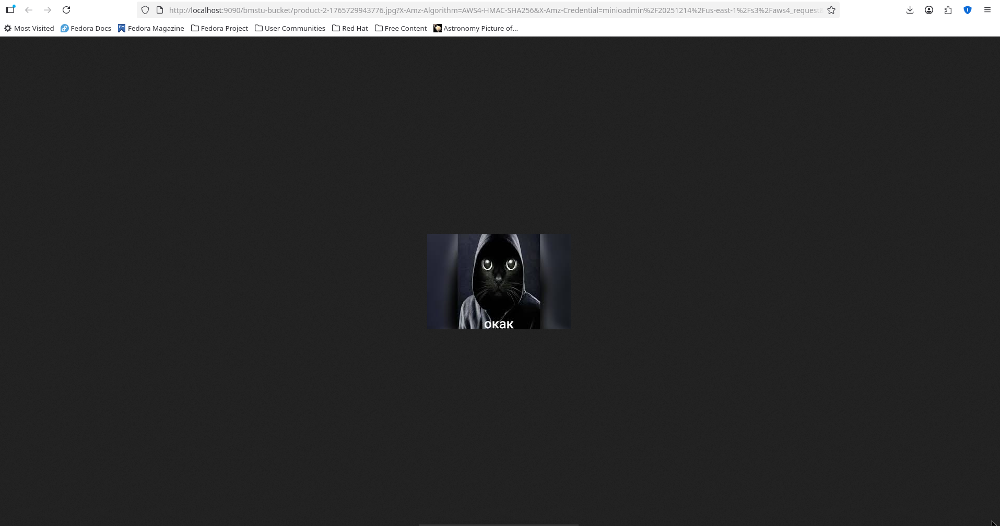

---

## 17. Итоговая структура проекта
```text
bmstu-lab/
├── src/
│   ├── entities/
│   │   └── product.entity.ts
│   ├── modules/
│   │   └── products/
│   │       ├── controllers/
│   │       │   └── products.controller.ts
│   │       ├── services/
│   │       │   └── products.service.ts
│   │       │   └── minio.service.ts
│   │       ├── repositories/
│   │       │   └── typeorm-products.repository.ts
│   │       ├── dto/
│   │       │   ├── create-product.dto.ts
│   │       │   ├── update-product.dto.ts
│   │       │   ├── product-response.dto.ts
│   │       │   └── product-filters.dto.ts
│   │       └── products.module.ts
│   ├── app.module.ts
│   └── main.ts
├── docker-compose.yml
├── init.sql
└── .env
```

---

## 18. Полезные ссылки

### Официальная документация
1. **NestJS**
   - [Официальная документация NestJS](https://docs.nestjs.com/)
   - [Основы NestJS](https://docs.nestjs.com/first-steps)
   - [Техники работы с базой данных](https://docs.nestjs.com/techniques/database)
   - [Валидация](https://docs.nestjs.com/techniques/validation)

2. **TypeORM**
   - [Документация TypeORM](https://typeorm.io/)
   - [Сущности и декораторы](https://typeorm.io/entities)
   - [Миграции](https://typeorm.io/migrations)

3. **PostgreSQL**
   - [Официальная документация](https://www.postgresql.org/docs/)
   - [Руководство по установке](https://www.postgresql.org/download/)

4. **MinIO**
   - [Документация MinIO](https://min.io/docs/minio/linux/index.html)

---
