# Методические указания по выполнению лабораторной работы №3  

В этой лабораторной работе мы разработаем простой веб-сервер на основе Django REST Framework (DRF).

# План

## 1. Создание базового API

     1.1. Вводная часть: новый проект
     1.2. Выбираем технологии: почему не подходят Django-шаблоны?
     1.3. API и REST: что это и почему это удобно?
        1.3.1. Что такое API?
        1.3.2. Что такое REST? Как его применить для нашей задачи?
     1.4. Создание проекта
     1.5. Написание модели
     1.6. Написание сериализатора
     1.7. Написание View
     1.8. Добавление View в URL'ы нашего приложения
     1.9. Проверяем правильность работы API

## 2. Добавление изображения

     2.1. Написание функции
     2.2. Изменение View
     2.3. Проверка добавления и изменения акции

## 3. Добавление пользователя и вложенного сериализатора

     3.1. Изменение модели 
     3.2. Добавление вложенного сериализатора
     3.3. Изменение View
     3.4. Изменение Urls


# 1. Создание базового API

## 1.1. Вводная часть: новый проект

В первых лабораторных мы уже познакомились с тем, что такое Django: увидели структуру проекта, поработали с шаблонами и стали начинающими веб-разработчиками.

С таким багажом Вас взяли на стажировку и сегодня Ваш первый рабочий день. Вы уже настраиваете свежий ноутбук, который Вам выдали на работе и тут коллеги зовут Вас на встречу про будущее Вашего приложения. На встрече Вам сообщают следующее: "Аналитики изучили рынок и поняли, что люди хотят получать обновления курса акций со всех своих устройств: телефонов, компьютеров, умных часов и телеграмм ботов. Нужно дать пользователям такую возможность в кратчайшие сроки".

После встречи к Вам подходит тимлид и говорит, что Ваша задача на весь испытательный срок — это написать единый сервис, в который будут обращаться все приложения компании для получения последних данных об изменениях курса акций. 

## 1.2. Выбираем технологии: почему не подходят шаблоны?

Получив задание Вы сразу ринулись в бой, применяя имеющиеся знания, и написали за ночь проект на Django с шаблонами, к которому должны будут обращаться все устройства пользователей

Вы приносите свой проект тимлиду прямо на следующий день. Он смотрит с удивлением и говорит: "Здорово, что ты написал проект так быстро, но это не совсем то, что нужно. Как, например, телеграмм бот возьмет данные со страницы на HTML? Нужно писать отдельный парсер, чтобы получить из нее данные, а лишнее время и деньги. Необходимо провести дополнительное исследование".

Если подумать, то HTML нужен для передачи информации от компьютера(сайта) к человеку, а нам нужно решить задачу передачи информации от компьютера к компьютеру. То есть сделать такой сервис, куда бы приходил телеграмм бот(или мобильное приложение или сайт) задавал бы вопрос: "сколько стоят акции Apple сейчас?" на своем компьютерном, а потом на компьютерном получал бы ответ. Поэтому шаблоны тут не подойдут, они нужны для людей, а не для машин.

## 1.3. API и REST: что это и почему это удобно?

Теперь мы поняли, что нам не подходят Django шаблоны, ведь нам нужно создать решение для передачи данных от программы к программе. Для решения таких задач обычно используют API.

### 1.3.1 Что такое API?

Определение API можно посмотреть [здесь.](https://ru.wikipedia.org/wiki/API)

В нашем случае это будет выглядеть так:

.png)

То есть каждая из платформ приходит к нам в API за актуальной информацией о курсах акций. И это удобно, ведь нам не нужно писать программу для получения акций для каждой платформы отдельно, вместо этого можно написать один сервер, где будет вся информация. Это чем-то похоже на вызов функции в коде, только эта функция вызывается с помощью HTTP. Все, что нам осталось — это описать наше API, то есть задать набор правил, по которым все платформы будут общаться с нашим сервером. 

*Очень понятное объяснение дано [в статье](https://habr.com/ru/post/464261/).*

### 1.3.2 Что такое REST? Как его применить для нашей задачи?

Нам осталось описать набор правил, которые станут нашим API. К счастью для этого есть REST — набор правил и рекомендаций для того, чтобы создать как можно более удобное API. Это как дизайн, но для компьютерных интерфейсов. Ведь нам, людям, удобнее читать информацию с сайта, который хорошо задизайнен и выглядит красиво. Также и машинам удобнее получать информацию с помощью API, который хорошо задизайнен. И REST — это как раз дизайн для нашего API.

Давайте представим, как может выглядеть архитектура нашего API для курса акций. 

Для начала нужно понять, какие действия в целом с акциями можно делать:

1. **Получение списка всех акций**, чтобы узнать какие акции есть у нас в системе
2. **Создание новой компании в системе**, чтобы добавить новую компанию в нашу базу данных
3. **Получение стоимости акций конкретной компании**, чтобы узнать стоимость акции не загржая огромного списка
4. **Изменение стоимости акций конкретной компании**, чтобы поддерживать стоимость акций актуальными
5. **Удаление акции компании из базы**, чтобы перестать отображать компанию если она, например, закрылась

В REST мы всё проектируем исходя из ресурса(модели). Способ, которым мы идентифицируем ресурс для предоставления, состоит в том, чтобы назначить ему URI — универсальный идентификатор ресурса. Перепишем тот же самый список сверху, но уже по REST:

1. **Получение списка всех акций:**  *GET /stocks*
2. **Создание новой компании в системе:** *POST* *****/stocks/*
3. **Получение стоимости акций конкретной компании:** *GET /stocks/1*
4. **Изменение стоимости акций конкретной компании:** *PUT /stocks/1/*
5. **Удаление акции компании из базы:** *DELETE /stocks/1/*

Эту архитектуру мы показали тимлиду, утвердили ее и теперь преступаем к написанию приложения на Django REST Framework (DRF).

*Пожалуйста, посмотрите дополнительные материалы [в статье.](https://habr.com/ru/post/483202/)*

## 1.4. Создание проекта

Писать сервер с API мы будем на Django Rest Framework (DRF). Это надстройка над Django, которая позволяет нам писать REST приложения. 

Сетап DRF проекта очень похож на сетап обычного Django проекта, но с небольшим исключением: нам понадобиться еще библиотека  `djangorestframework`

В [1 лабораторной](https://github.com/iu5git/Web/blob/main/tutorials/lab1-py/lab1_tutorial.md) описано, как создать проект на виртуальной машине (удалённо).Согласно инструкциям оттуда подключаемся к ВМ через VS Code и оттуда во вкладке Terminaд:
1. Создаём виртуальную среду командой `python3 -m venv env` и активируем ее `source env/bin/activate`. Устанавливаем зависимости командами `pip install Django==4.2.4` и `pip install djangorestframework` 
2. Cоздаём проект lab3 с помощью команды `django-admin startproject lab3`. В файл settings.py в ALLOWED_HOSTS добавляем звездочку '*'.
3. Создадим приложение stocks с помощью команды `django-admin startapp stocks`


4. Применим все миграции проекта: `python manage.py migrate`
5. В файле lab3/lab3/settings.py в листе `INSTALLED_APPS` добавим название нашего приложения и название модуля DRF:
   
    ```python
    INSTALLED_APPS = [
        'django.contrib.admin',
        'django.contrib.auth',
        'django.contrib.contenttypes',
        'django.contrib.sessions',
        'django.contrib.messages',
        'django.contrib.staticfiles',
    
        # DRF
        'rest_framework',
    
        # Наше приложение
        'stocks',
    ]
    ```
    

В итоге структура приложения должна стать похожа на такую:


## 1.5. Написание модели

Архитектура DRF — это MVC (Model-View-Controller), разделяющая приложение на три части: модель, представление и контроллер, каждую из которых можно менять независимо.

Сейчас мы будем писать модель — сущность, над которой мы будем производить все действия и то, что будет лежать в базе данных.

В файле **lab3/stocks/models.py** напишем представление модели акции:

```python
from django.db import models

class Stock(models.Model):
    company_name = models.CharField(max_length=50, verbose_name="Название компании")
    price = models.DecimalField(max_digits=8, decimal_places=2, verbose_name="Цена акции")
    is_growing = models.BooleanField(verbose_name="Растет ли акция в цене?")
    date_modified = models.DateTimeField(auto_now=True, verbose_name="Когда последний раз обновлялось значение акции?")
    url = models.CharField(max_length=255, blank=True, null=True, verbose_name="Фото логотипа компании")
```

После того как мы создали модель в коде, нужно сделать миграцию базы данных, чтобы создать такую таблицу. Исполним в терминале:

1. `python manage.py makemigrations` (создаем файлы миграций)
2. `python manage.py migrate` (применяем файлы миграций к базе)

## 1.6. Написание сериализатора

Большая часть запросов REST — это запросы на чтение, чтобы выполнить такой запрос нам нужно отправить клиенту данные, и если в лабораторной с шаблонами мы возвращали данные в виде HTML страницы, то сейчас нам нужно вернуть данные в виде JSON-структуры, так как это самый удобный способ для обмена данными в API.

Про JSON рекомендуется посмотреть [статью](https://habr.com/ru/post/554274/). JSON - это общепринятый формат для передачи словарей, списков и других структур в вебе.

Сериализаторы были придуманы для того, чтобы преобразовывать наши модели из базы данных в JSON и наоборот.

Чтобы написать сериализатор нужно создать специальный файл `serializers.py` внутри вашего приложения. И написать там поля, которые вы хотели бы, чтобы преобразовывались в JSON и отправлялись клиенту.

Напишем сериализатор для акций в файле lab3/stocks/serializers.py:

```python
from stocks.models import Stock
from stocks.models import AuthUser
from rest_framework import serializers


class StockSerializer(serializers.ModelSerializer):
    class Meta:
        # Модель, которую мы сериализуем
        model = Stock
        # Поля, которые мы сериализуем
        fields = ["pk", "company_name", "price", "is_growing", "date_modified", "url"]

```

## 1.7. Написание View

View — это точка входа в приложение, именно view отправит запрос в базу данных и сериализует его, чтобы отдать клиенту. 
Cуществует четыре способа написания rest view:
- Представления на основе функций
- Класс APIView
- Классы-примеси (ViewSet)
В данной работе реализуем view на основе классов для пяти методов, а также одно дополнительное view на основе функций - для "пользовательского" метода put. Сейчас он почти не отличается от put-метода в классе StockDetail, но в 5 лабораторной мы добавим авторизацию и более явно разграничим этот метод "для пользователя" и "для модератора". 
Также добавим класс пользователей и реализуем 1 метод: get.

Платформа REST предоставляет класс APIView, который является подклассом класса View Django. Использование класса APIView во многом аналогично использованию обычного класса View: как обычно, входящий запрос отправляется соответствующему методу-обработчику, например .get() или .post(). Однако запросы, передаваемые методам-обработчикам, будут экземплярами Request платформы REST, а не экземплярами HttpRequest Django. А также методы-обработчики могут возвращать ответ платформы REST вместо HttpResponse Django.

Для реализации view на основе функций используется декоратор api_view, принимающий список методов HTTP, на которые представление должно реагировать. По умолчанию принимаются только методы GET. Другие методы ответят «Метод 405 не разрешен». Чтобы изменить это поведение, разрешенные методы указываются в аргументах представления, в данном случае это 'Put'. 

Напишем view в файле lab3/stocks/views.py

```python
from rest_framework.response import Response
from django.shortcuts import get_object_or_404
from rest_framework import status
from stocks.serializers import StockSerializer
from stocks.models import Stock
from rest_framework.views import APIView
from rest_framework.decorators import api_view

class StockList(APIView):
    model_class = Stock
    serializer_class = StockSerializer

    # Возвращает список акций
    def get(self, request, format=None):
        stocks = self.model_class.objects.all()
        serializer = self.serializer_class(stocks, many=True)
        return Response(serializer.data)

    # Добавляет новую акцию
    def post(self, request, format=None):
        serializer = self.serializer_class(data=request.data)
        if serializer.is_valid():
            serializer.save()
            return Response(serializer.data, status=status.HTTP_201_CREATED)
        return Response(serializer.errors, status=status.HTTP_400_BAD_REQUEST)

class StockDetail(APIView):
    model_class = Stock
    serializer_class = StockSerializer

    # Возвращает информацию об акции
    def get(self, request, pk, format=None):
        stock = get_object_or_404(self.model_class, pk=pk)
        serializer = self.serializer_class(stock)
        return Response(serializer.data)

    # Обновляет информацию об акции (для модератора)
    def put(self, request, pk, format=None):
        stock = get_object_or_404(self.model_class, pk=pk)
        serializer = self.serializer_class(stock, data=request.data, partial=True)
        if serializer.is_valid():
            serializer.save()
            return Response(serializer.data)
        return Response(serializer.errors, status=status.HTTP_400_BAD_REQUEST)

    # Удаляет информацию об акции
    def delete(self, request, pk, format=None):
        stock = get_object_or_404(self.model_class, pk=pk)
        stock.delete()
        return Response(status=status.HTTP_204_NO_CONTENT)

# Обновляет информацию об акции (для пользователя)    
@api_view(['Put'])
def put(self, request, pk, format=None):
    stock = get_object_or_404(self.model_class, pk=pk)
    serializer = self.serializer_class(stock, data=request.data, partial=True)
    if serializer.is_valid():
        serializer.save()
        return Response(serializer.data)
    return Response(serializer.errors, status=status.HTTP_400_BAD_REQUEST)

```
## 1.8. Добавление View в URL'ы нашего приложения

Добавим пути для наших view в URL'ы приложения.

Для этого в файле lab3/lab3/urls.py напишем:

```python
from django.contrib import admin
from stocks import views
from django.urls import include, path
from rest_framework import routers

router = routers.DefaultRouter()

urlpatterns = [
    path('', include(router.urls)),
    path(r'stocks/', views.StockList.as_view(), name='stocks-list'),
    path(r'stocks/<int:pk>/', views.StockDetail.as_view(), name='stocks-detail'),
    path(r'stocks/<int:pk>/put/', views.put, name='stocks-put'),
    path('api-auth/', include('rest_framework.urls', namespace='rest_framework')),
    path('admin/', admin.site.urls),
]
```

## 1.9. Проверяем правильность работы API

Запустим приложение, введя в терминале: **python manage.py runserver 0.0.0.0:8000**

Чтобы проверить правильность работы API и отослать запросы можно использовать [Insomnia](https://insomnia.rest/download) или [Postman](https://www.postman.com/), а можно использовать прямо отладочный интерфейс DRF.

Чтобы использовать стандартный отладчик DRF достаточно перейти по ссылке, которую Django показал при запуске сервера. И написать что-то вроде: [http://127.0.0.1:8000/stocks/](http://127.0.0.1:8000/stocks/).

Я буду использовать Postman, который можно скачать [здесь](https://www.postman.com/downloads/)

Первый запрос, который мы будем тестировать — это добавление новой акции. Для выполнения запроса:

1. Нажмем на New и во всплывающем меню выберем **HTTP**:
   
    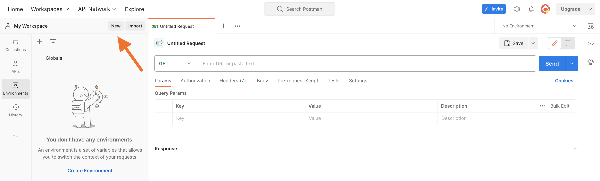
    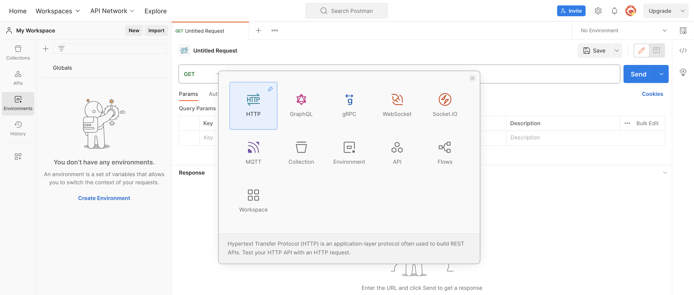
    
2. Попробуем запросить список всех акций. Для этого выберем HTTP метод GET и введём соответствующий путь.
   
    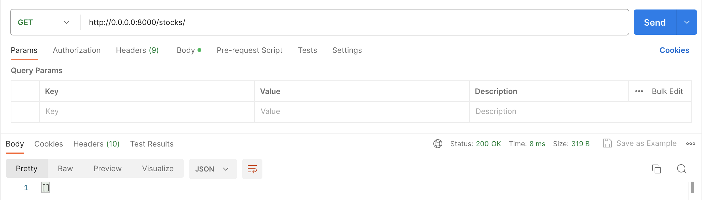
    
3. Как можно увидеть, нам пришел пустой список `[]`. Для добавления новой акции воспользуемся методом POST. Выберем метод POST, введём нужный путь, а также добавим в тело запроса форму, описывающую новый объект. Повторим это несколько раз, чтобы данных было больше.
   
    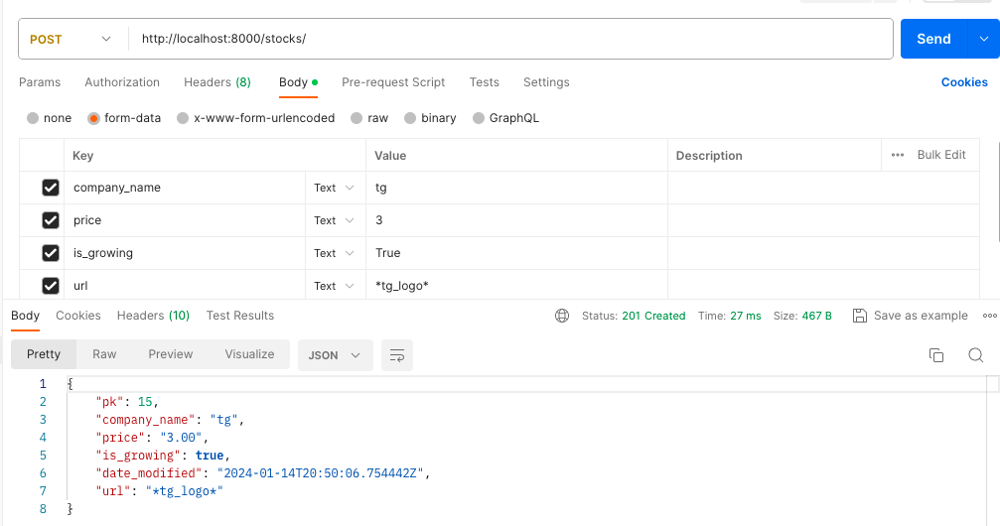

5. Посмотрим детальную информацию об объекте с pk=15.

    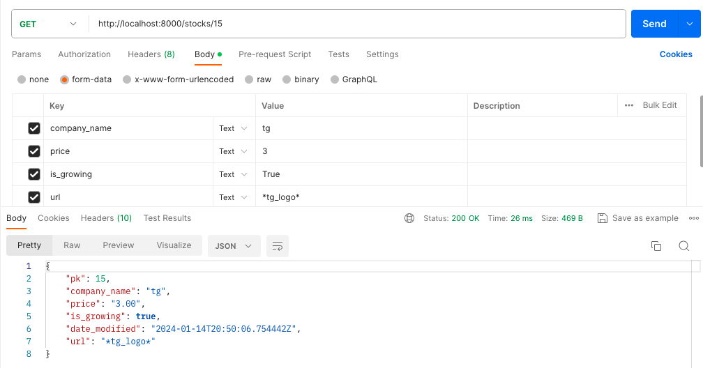

6. Можно заметить, что нам вернулись все объекты, которые мы создали, также им присвоились номера, которые написаны в поле pk (Primary Key). Давайте попробуем изменить у объекта с pk=15 название. Для этого поменяем метод на PUT (нужен для обновления объекта), добавим id в путь и передадим новый объект в body запроса.
   
    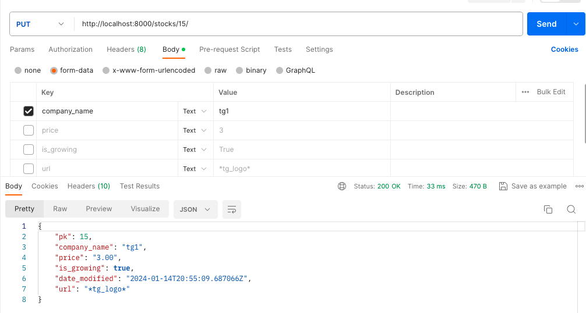

9. Далее удалим объект с pk=12. Для этого изменим HTTP метод на DELETE и в конце строки аргументом укажем pk. Все почти также, как в методе PUT, только тело запроса здесь не нужно.
   
    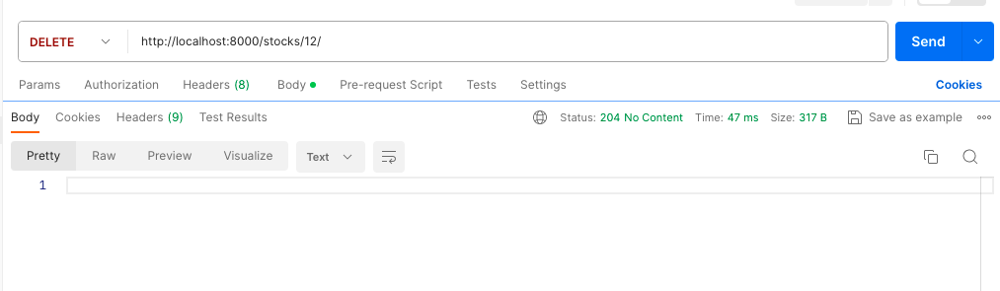

# 2. Добавление изображения

## 2.1. Написание функции

Для работы нужно установить Minio с помощью команды `pip intall minio`. Подробнее про использвание MinIO S3 на Python можно прочитать в [методичке](https://github.com/iu5git/Networking/tree/main/Minio_Python).

Создадим бакет logo, где будем хранить фото логотипов компаний.

В файле settings.py добавим параметры подключения к minio:

```python
AWS_STORAGE_BUCKET_NAME = 'logo'
AWS_ACCESS_KEY_ID = 'minioadmin'
AWS_SECRET_ACCESS_KEY = 'minioadmin'
AWS_S3_ENDPOINT_URL = 'localhost:9000'
MINIO_USE_SSL = False
```

Для загрузки фотографии при добавлении новой акции или изменении существующей будем принимать файл с фотографией, сохранять его в minio в баскете logo и хранить в базе данных в виде пути до объекта.
Создадим файл stocks/minio.py и напишем функцию **add_pic**, которая принимает объект(акцию) и файл с фотографией логотипа компании, и добавляет этот файл в баскет logo.

```python
from django.conf import settings
from minio import Minio
from django.core.files.uploadedfile import InMemoryUploadedFile
from rest_framework.response import *

def process_file_upload(file_object: InMemoryUploadedFile, client, image_name):
    try:
        client.put_object('logo', image_name, file_object, file_object.size)
        return f"http://localhost:9000/logo/{image_name}"
    except Exception as e:
        return {"error": str(e)}

def add_pic(new_stock, pic):
    client = Minio(           
            endpoint=settings.AWS_S3_ENDPOINT_URL,
           access_key=settings.AWS_ACCESS_KEY_ID,
           secret_key=settings.AWS_SECRET_ACCESS_KEY,
           secure=settings.MINIO_USE_SSL
    )
    i = new_stock.id
    img_obj_name = f"{i}.png"

    if not pic:
        return Response({"error": "Нет файла для изображения логотипа."})
    result = process_file_upload(pic, client, img_obj_name)

    if 'error' in result:
        return Response(result)

    new_stock.url = result
    new_stock.save()

    return Response({"message": "success"})
```
Готово!

## 2.2. Изменение View

Изменим методы для добавления и изменения информации об акции:

```python

class StockList(APIView):

    def post(self, request, format=None):
        serializer = self.serializer_class(data=request.data)
        if serializer.is_valid():
            stock=serializer.save()
            pic = request.FILES.get("pic")
            pic_result = add_pic(stock, pic)
            # Если в результате вызова add_pic результат - ошибка, возвращаем его.
            if 'error' in pic_result.data:    
                return pic_result
            return Response(serializer.data, status=status.HTTP_201_CREATED)
        return Response(serializer.errors, status=status.HTTP_400_BAD_REQUEST)

class StockDetail(APIView):

    def put(self, request, pk, format=None):
        stock = get_object_or_404(self.model_class, pk=pk)
        serializer = self.serializer_class(stock, data=request.data, partial=True)
        # Изменение фото логотипа
        if 'pic' in serializer.initial_data:
            pic_result = add_pic(stock, serializer.initial_data['pic'])
            if 'error' in pic_result.data:
                return pic_result
        if serializer.is_valid():
            serializer.save()
            return Response(serializer.data)
        return Response(serializer.errors, status=status.HTTP_400_BAD_REQUEST)

```
## 2.3. Проверка добавления и изменения акции

1. Выберем метод POST, введём нужный путь, а также добавим в тело запроса форму, описывающую новый объект, добавив фото как файл, а не текст.    
  
    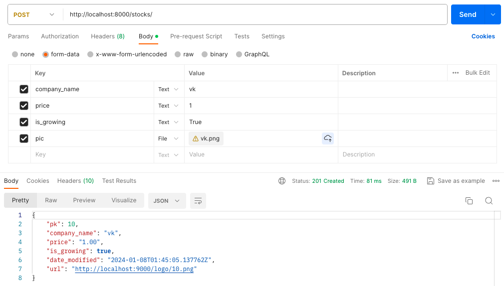

2. Попробуем изменить у объекта с pk=11 название и логотип.
  
    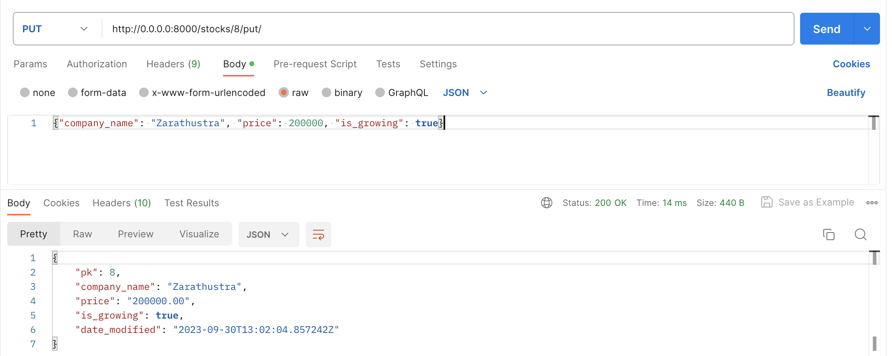
    
3. Проверим общий список. 
 
    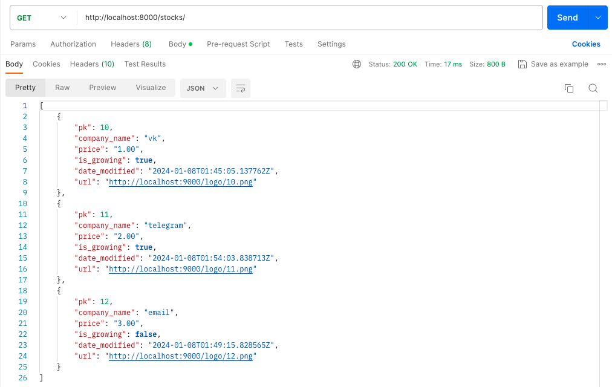
    
4. Мы успешно изменили название у компании c pk=11. Чтобы убедиться, что логотип тоже изменился проверим объект 11.png в minio. В Object browser в бакете logo выберем объект 11.png и нажмем preview:

    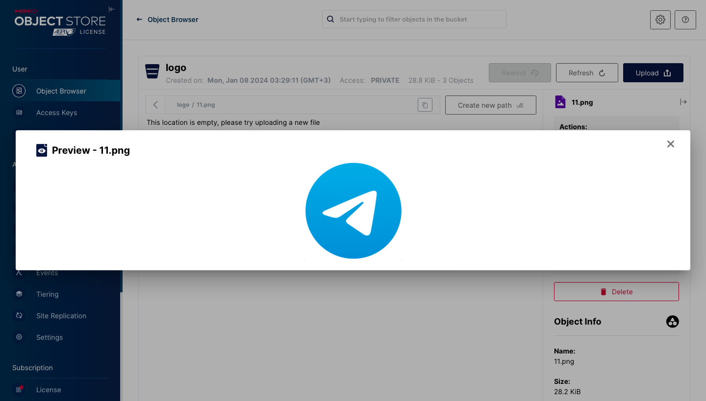

# 3. Добавление пользователя и вложенного сериализатора

## 3.1. Изменение модели 

С помощью команды `python manage.py inspectdb` можно автоматически сгенерировать модели и просмотреть их в консоли. Используем таблицу пользователей AuthUser и изменим Stock добавив создателя акций, поле user. Также для AuthUser установим значения по умолчанию для некоторых полей и добавим функцию "def __str__(self)" которая будет возвращать строковое представление объекта - полное имя пользователя:

```python
from django.db import models

class AuthUser(models.Model):
    password = models.CharField(max_length=128)
    last_login = models.DateTimeField(blank=True, null=True)
    is_superuser = models.BooleanField(default=False)
    username = models.CharField(unique=True, max_length=150)
    last_name = models.CharField(max_length=150)
    email = models.CharField(max_length=254)
    is_staff = models.BooleanField(default=False)
    is_active = models.BooleanField(default=True)
    date_joined = models.DateTimeField(auto_now=True)
    first_name = models.CharField(max_length=150)

    def __str__(self):
        return f'{self.first_name} {self.last_name}'

    class Meta:
        managed = False
        db_table = 'auth_user'

class Stock(models.Model):
    company_name = models.CharField(max_length=50, verbose_name="Название компании")
    price = models.DecimalField(max_digits=8, decimal_places=2, verbose_name="Цена акции")
    is_growing = models.BooleanField(verbose_name="Растет ли акция в цене?")
    date_modified = models.DateTimeField(auto_now=True, verbose_name="Когда последний раз обновлялось значение акции?")
    url = models.CharField(max_length=255, blank=True, null=True, verbose_name="Фото логотипа компании")
    user = models.ForeignKey('AuthUser', on_delete=models.DO_NOTHING, null=True, blank=False, verbose_name="Создатель акции")

```
После изменений нужно снова сделать миграцию базы данных:

1. `python manage.py makemigrations`
2. `python manage.py migrate`

## 3.2. Добавление вложенного сериализатора

Добавим 2 сериализатора в файле, 1 из них для акций: выведем имя создателя акций, и 1 для вывода всех пользователей и акций каждого из них, где используется вложенный сериализатор:

```python
from stocks.models import Stock
from stocks.models import AuthUser
from rest_framework import serializers

class FullStockSerializer(serializers.ModelSerializer):
    # StringRelatedField вернет строковое представление объекта, то есть его имя
    user = serializers.StringRelatedField(read_only=True)

    class Meta:
        model = Stock
        # Сериализуем все поля
        fields = ["pk", "company_name", "price", "is_growing", "date_modified", "url", "user"]


class UserSerializer(serializers.ModelSerializer):
    stock_set = StockSerializer(many=True, read_only=True)

    class Meta:
        model = AuthUser
        fields = ["id", "first_name", "last_name", "stock_set"]
```

## 3.3. Изменение View

При добавлении новой акции будет назначаться ее создатель, при просмотре детальной информации об акции можно будет увидеть имя создателя. Создадим 1 пользователя и добавлять новые акции будем от его лица:

```python
from rest_framework.response import Response
from django.shortcuts import get_object_or_404
from rest_framework import status
from stocks.serializers import StockSerializer
from stocks.serializers import FullStockSerializer
from stocks.models import Stock
from stocks.models import AuthUser
from rest_framework.views import APIView
from rest_framework.decorators import api_view
from stocks.minio import add_pic 

def user():
    try:
        user1 = AuthUser.objects.get(id=1)
    except:
        user1 = AuthUser(id=1, first_name="Иван", last_name="Иванов", password=1234, username="user1")
        user1.save()
    return user1

class StockList(APIView):
    model_class = Stock
    serializer_class = StockSerializer

    def get(self, request, format=None):
        stocks = self.model_class.objects.all()
        serializer = self.serializer_class(stocks, many=True)
        return Response(serializer.data)

    def post(self, request, format=None):
        serializer = self.serializer_class(data=request.data)
        if serializer.is_valid():
            stock=serializer.save()
            user1 = user()
            # Назначаем создателем акции польователя user1
            stock.user = user1
            stock.save()
            pic = request.FILES.get("pic")
            pic_result = add_pic(stock, pic)
            if 'error' in pic_result.data:    
                return pic_result
            return Response(serializer.data, status=status.HTTP_201_CREATED)
        return Response(serializer.errors, status=status.HTTP_400_BAD_REQUEST)

class StockDetail(APIView):
    model_class = Stock
    serializer_class = FullStockSerializer

    def get(self, request, pk, format=None):
        stock = get_object_or_404(self.model_class, pk=pk)
        serializer = self.serializer_class(stock)
        return Response(serializer.data)

    def put(self, request, pk, format=None):
        stock = get_object_or_404(self.model_class, pk=pk)
        serializer = self.serializer_class(stock, data=request.data, partial=True)
        if 'pic' in serializer.initial_data:
            pic_result = add_pic(stock, serializer.initial_data['pic'])
            if 'error' in pic_result.data:
                return pic_result
        if serializer.is_valid():
            serializer.save()
            return Response(serializer.data)
        return Response(serializer.errors, status=status.HTTP_400_BAD_REQUEST)

    def delete(self, request, pk, format=None):
        stock = get_object_or_404(self.model_class, pk=pk)
        stock.delete()
        return Response(status=status.HTTP_204_NO_CONTENT)

@api_view(['Put'])
def put_detail(request, pk, format=None):
    stock = get_object_or_404(self.model_class, pk=pk)
    serializer = self.serializer_class(stock, data=request.data, partial=True)
    if 'pic' in serializer.initial_data:
        pic_result = add_pic(stock, serializer.initial_data['pic'])
        if 'error' in pic_result.data:
            return pic_result
    if serializer.is_valid():
        serializer.save()
        return Response(serializer.data)
    return Response(serializer.errors, status=status.HTTP_400_BAD_REQUEST)

class UsersList(APIView):
    model_class = AuthUser
    serializer_class = UserSerializer

    def get(self, request, format=None):
        user = self.model_class.objects.all()
        serializer = self.serializer_class(user, many=True)
        return Response(serializer.data)
```

## 3.4. Изменение Urls

Добавим новый путь.

```python
    path(r'users/', views.UsersList.as_view(), name='users-list'),
```


# Полезные ссылки
1. Статья про API: [https://habr.com/ru/post/464261/](https://habr.com/ru/post/464261/)
2. Статья про REST: [https://habr.com/ru/post/483202/](https://habr.com/ru/post/483202/)
3. Статья про JSON: [https://habr.com/ru/post/554274/](https://habr.com/ru/post/554274/)
