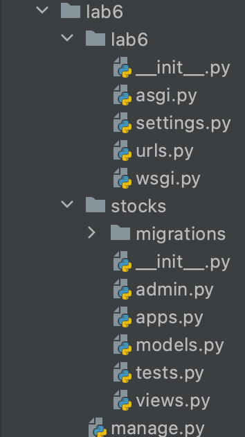

# Методические указания по выполнению лабораторной работы №3  

В этой лабораторной работе мы разработаем простой веб-сервер на основе Django REST Framework (DRF).

## План

1. Вводная часть: новый проект
2. Выбираем технологии: почему не подходят Django-шаблоны?
3. API и REST: что это и почему это удобно?
   
    3.1 Что такое API?
    
    3.2 Что такое REST? Как его применить для нашей задачи?
    
4. Создание проекта
5. Написание модели
6. Написание сериализатора
7. Написание View
8. Добавление View в URL'ы нашего приложения
9. Проверяем правильность работы API
10. Безумно полезные ссылки

## 1. Вводная часть: новый проект

В первых лабораторных мы уже познакомились с тем, что такое Django: увидели структуру проекта, поработали с шаблонами и стали начинающими веб-разработчиками.

С таким багажом Вас взяли на стажировку и сегодня Ваш первый рабочий день. Вы уже настраиваете свежий ноутбук, который Вам выдали на работе и тут коллеги зовут Вас на встречу про будущее Вашего приложения. На встрече Вам сообщают следующее: "Аналитики изучили рынок и поняли, что люди хотят получать обновления курса акций со всех своих устройств: телефонов, компьютеров, умных часов и телеграмм ботов. Нужно дать пользователям такую возможность в кратчайшие сроки".

После встречи к Вам подходит тимлид и говорит, что Ваша задача на весь испытательный срок — это написать единый сервис, в который будут обращаться все приложения компании для получения последних данных об изменениях курса акций. 

## 2. Выбираем технологии: почему не подходят шаблоны?

Получив задание Вы сразу ринулись в бой, применяя имеющиеся знания, и написали за ночь проект на Django с шаблонами, к которому должны будут обращаться все устройства пользователей

Вы приносите свой проект тимлиду прямо на следующий день. Он смотрит с удивлением и говорит: "Здорово, что ты написал проект так быстро, но это не совсем то, что нужно. Как, например, телеграмм бот возьмет данные со страницы на HTML? Нужно писать отдельный парсер, чтобы получить из нее данные, а лишнее время и деньги. Необходимо провести дополнительное исследование".

Если подумать, то HTML нужен для передачи информации от компьютера(сайта) к человеку, а нам нужно решить задачу передачи информации от компьютера к компьютеру. То есть сделать такой сервис, куда бы приходил телеграмм бот(или мобильное приложение или сайт) задавал бы вопрос: "сколько стоят акции Apple сейчас?" на своем компьютерном, а потом на компьютерном получал бы ответ. Поэтому шаблоны тут не подойдут, они нужны для людей, а не для машин.

## 3. API и REST: что это и почему это удобно?

Теперь мы поняли, что нам не подходят Django шаблоны, ведь нам нужно создать решение для передачи данных от программы к программе. Для решения таких задач обычно используют API.

### 3.1 Что такое API?

Определение API можно посмотреть [здесь.](https://ru.wikipedia.org/wiki/API)

В нашем случае это будет выглядеть так:

.png)

То есть каждая из платформ приходит к нам в API за актуальной информацией о курсах акций. И это удобно, ведь нам не нужно писать программу для получения акций для каждой платформы отдельно, вместо этого можно написать один сервер, где будет вся информация. Это чем-то похоже на вызов функции в коде, только эта функция вызывается с помощью HTTP. Все, что нам осталось — это описать наше API, то есть задать набор правил, по которым все платформы будут общаться с нашим сервером. 

*Очень понятное объяснение дано [в статье](https://habr.com/ru/post/464261/).*

### 3.2 Что такое REST? Как его применить для нашей задачи?

Нам осталось описать набор правил, которые станут нашим API. К счастью для этого есть REST — набор правил и рекомендаций для того, чтобы создать как можно более удобное API. Это как дизайн, но для компьютерных интерфейсов. Ведь нам, людям, удобнее читать информацию с сайта, который хорошо задизайнен и выглядит красиво. Также и машинам удобнее получать информацию с помощью API, который хорошо задизайнен. И REST — это как раз дизайн для нашего API.

Давайте представим, как может выглядеть архитектура нашего API для курса акций. 

Для начала нужно понять, какие действия в целом с акциями можно делать:

1. **Получение списка всех акций**, чтобы узнать какие акции есть у нас в системе
2. **Создание новой компании в системе**, чтобы добавить новую компанию в нашу базу данных
3. **Получение стоимости акций конкретной компании**, чтобы узнать стоимость акции не загржая огромного списка
4. **Изменение стоимости акций конкретной компании**, чтобы поддерживать стоимость акций актуальными
5. **Удаление акции компании из базы**, чтобы перестать отображать компанию если она, например, закрылась

В REST мы всё проектируем исходя из ресурса(модели). Способ, которым мы идентифицируем ресурс для предоставления, состоит в том, чтобы назначить ему URI — универсальный идентификатор ресурса. Перепишем тот же самый список сверху, но уже по REST:

1. **Получение списка всех акций:**  *GET /stocks*
2. **Создание новой компании в системе:** *POST* *****/stocks/*
3. **Получение стоимости акций конкретной компании:** *GET /stocks/1*
4. **Изменение стоимости акций конкретной компании:** *PUT /stocks/1/*
5. **Удаление акции компании из базы:** *DELETE /stocks/1/*

Эту архитектуру мы показали тимлиду, утвердили ее и теперь преступаем к написанию приложения на Django REST Framework (DRF).

*Пожалуйста, посмотрите дополнительные материалы [в статье.](https://habr.com/ru/post/483202/)*

## 4. Создание проекта

Писать сервер с API мы будем на Django Rest Framework (DRF). Это надстройка над Django, которая позволяет нам писать REST приложения. 

Сетап DRF проекта очень похож на сетап обычного Django проекта, но с небольшим исключением: нам понадобиться еще библиотека  `djangorestframework`

В [1 лабораторной](https://github.com/iu5git/Web/blob/main/tutorials/lab1-py/lab1_tutorial.md) описано, как создать проект на виртуальной машине (удалённо).Согласно инструкциям оттуда подключаемся к ВМ через VS Code и оттуда во вкладке Terminaд:
1. Создаём и активируем виртуальную среду. Устанавливаем зависимости командами `pip install Django==4.2.4` и `pip install djangorestframework` 
2. Cоздаём проект lab3 с помощью команды `django-admin startproject lab3`. В файл settings.py в ALLOWED_HOSTS добавляем звездочку '*'.
3. Создадим приложение stocks с помощью команды `django-admin startapp stocks`


4. Применим все миграции проекта: `python manage.py migrate`
5. В файле lab3/lab3/settings.py в листе `INSTALLED_APPS` добавим название нашего приложения и название модуля DRF:
   
    ```python
    INSTALLED_APPS = [
        'django.contrib.admin',
        'django.contrib.auth',
        'django.contrib.contenttypes',
        'django.contrib.sessions',
        'django.contrib.messages',
        'django.contrib.staticfiles',
    
        # DRF
        'rest_framework',
    
        # Наше приложение
        'stocks',
    ]
    ```
    

В итоге структура приложения должна стать похожа на такую:



## 5. Написание модели

Архитектура DRF — это MVC (Model-View-Controller), разделяющая приложение на три части: модель, представление и контроллер, каждую из которых можно менять независимо.

Сейчас мы будем писать модель — сущность, над которой мы будем производить все действия и то, что будет лежать в базе данных.

В файле **lab3/stocks/models.py** напишем представление модели акции:

```python
from django.db import models


class Stock(models.Model):
    company_name = models.CharField(max_length=50, verbose_name="Название компании")
    price = models.DecimalField(max_digits=8, decimal_places=2, verbose_name="Цена акции")
    is_growing = models.BooleanField(verbose_name="Растет ли акция в цене?")
    date_modified = models.DateTimeField(auto_now=True, verbose_name="Когда последний раз обновлялось значение акции?")
```

После того как мы создали модель в коде, нужно сделать миграцию базы данных, чтобы создать такую таблицу. Исполним в терминале:

1. `python manage.py makemigrations` (создаем файлы миграций)
2. `python manage.py migrate` (применяем файлы миграций к базе)

## 6. Написание сериализатора

Большая часть запросов REST — это запросы на чтение, чтобы выполнить такой запрос нам нужно отправить клиенту данные, и если в лабораторной с шаблонами мы возвращали данные в виде HTML страницы, то сейчас нам нужно вернуть данные в виде JSON-структуры, так как это самый удобный способ для обмена данными в API.

Про JSON рекомендуется посмотреть [статью](https://habr.com/ru/post/554274/). JSON - это общепринятый формат для передачи словарей, списков и других структур в вебе.

Сериализаторы были придуманы для того, чтобы преобразовывать наши модели из базы данных в JSON и наоборот.

Чтобы написать сериализатор нужно создать специальный файл `serializers.py` внутри вашего приложения. И написать там поля, которые вы хотели бы, чтобы преобразовывались в JSON и отправлялись клиенту.

Напишем сериализатор в файле lab3/stocks/serializers.py

```python
from stocks.models import Stock
from rest_framework import serializers


class StockSerializer(serializers.ModelSerializer):
    class Meta:
        # Модель, которую мы сериализуем
        model = Stock
        # Поля, которые мы сериализуем
        fields = ["pk", "company_name", "price", "is_growing", "date_modified"]

```

## 7. Написание View

View — это точка входа в приложение, именно view отправит запрос в базу данных и сериализует его, чтобы отдать клиенту. 
Cуществует четыре способа написания rest view:
- Представления на основе функций
- Класс APIView
- Классы-примеси (ViewSet)
В данной работе реализуем view на основе функций. Декоратор api_view принимает список методов HTTP, на которые представление должно реагировать.
stocks_list реализует работу со списком акций: get (GET /stocks/) и post (POST /stocks/). stocks_detail реализует методы для работы с отдельными акциями с pk, указанным в запросе: get (GET /stocks/1/), put (PUT /stocks/1/), delete (DELETE /stocks/1/).

Напишем view в файле lab3/stocks/views.py

```python
from rest_framework.response import Response
from django.shortcuts import get_object_or_404
from rest_framework import status
from stocks.serializers import StockSerializer
from stocks.models import Stock
from rest_framework.decorators import api_view

@api_view(['Get','Post'])
def stocks_list(request, format=None):
    if request.method == 'GET':
        """
        Возвращает список акций
        """
        stocks = Stock.objects.all()
        serializer = StockSerializer(stocks, many=True)
        return Response(serializer.data)
    elif request.method == 'POST':
        """
        Добавляет новую акцию
        """
        serializer = StockSerializer(data=request.data)
        if serializer.is_valid():
            serializer.save()
            return Response(serializer.data, status=status.HTTP_201_CREATED)
        return Response(serializer.errors, status=status.HTTP_400_BAD_REQUEST)
    else:
        return Response(serializer.errors, status=status.HTTP_400_BAD_REQUEST) 

@api_view(['Get','Put','Delete'])
def stocks_detail(request, pk, format=None):
    stock = get_object_or_404(Stock, pk=pk)
    if request.method == 'GET':
        """
        Возвращает информацию об акции
        """
        serializer = StockSerializer(stock)
        return Response(serializer.data)
    elif request.method == 'PUT':
        """
        Обновляет информацию об акции
        """
        serializer = StockSerializer(stock, data=request.data)
        if serializer.is_valid():
            serializer.save()
            return Response(serializer.data)
        return Response(serializer.errors, status=status.HTTP_400_BAD_REQUEST)
    elif request.method == 'DELETE':
        """
        Удаляет информацию об акции
        """
        stock.delete()
        return Response(status=status.HTTP_204_NO_CONTENT)
    else:
        return Response(serializer.errors, status=status.HTTP_400_BAD_REQUEST) 
```

## 8. Добавление View в URL'ы нашего приложения

Добавим пути для наших view в URL'ы приложения. 

Для этого в файле lab3/lab3/urls.py напишем:

```python
from django.contrib import admin
from stocks import views
from django.urls import include, path
from rest_framework import routers

router = routers.DefaultRouter()

urlpatterns = [
    path('', include(router.urls)),
    path(r'stocks/', views.stocks_list),
    path(r'stocks/<int:pk>/', views.stocks_detail),
    path('api-auth/', include('rest_framework.urls', namespace='rest_framework')),

    path('admin/', admin.site.urls),
]
```

## 9. Проверяем правильность работы API

Чтобы проверить правильность работы API и отослать запросы можно использовать [Insomnia](https://insomnia.rest/download) или [Postman](https://www.postman.com/), а можно использовать прямо отладочный интерфейс DRF.

Чтобы использовать стандартный отладчик DRF достаточно перейти по ссылке, которую Django показал при запуске сервера. И написать что-то вроде: [http://127.0.0.1:8000/stocks/](http://127.0.0.1:8000/stocks/).

Но мы будем использовать Insomnia, которую можно скачать по [этой ссылке](https://insomnia.rest/download). 

Первый запрос, который мы будем тестировать — это добавление новой акции. Для выполнения запроса:

1. Нажмем на плюсик и во всплывающем меню выберем **New Request**:
   
    
    
2. Во всплывшем окне напишем название запроса для удобства(оно будет отображаться в колонке слева), в качестве примера используем название *create new stock*
3. После этого мы сможем редактировать наш запрос: выбрать HTTP метод(GET/POST/...), попробуем запросить список всех акций
   
    
    
4. Как можно увидеть, нам пришел пустой список `[]`, чтобы добавить акции новой компании воспользуемся методом POST. Выбрав метод POST, нам также необходимо передать данные в теле запроса в виде JSON структуры, а затем отправить запрос(сделать это можно несколько раз, чтобы данных было больше).
   
    
    
5. Нам пришел статус 201 и вернулся объект, который мы создали, попробуем еще раз запросить список всех объектов с помощью GET запроса.
   
    
    
6. Можно заметить, что нам вернулись все объекты, которые мы создали, также им присвоились номера, которые написаны в поле pk(Primary Key), давайте попробуем изменить объект с pk=2 и поменять название компании, а также курс ее акций. Для этого поменяем метод на PUT(нужен для обновления объекта), в конце ссылки напишем id и передадим новый объект (переименуем [Mail.Ru](http://Mail.Ru) в VK).
   
    
    
7. В нашей базе данных мы сделали ребрендинг [Mail.Ru](http://Mail.Ru), теперь можно для наглядности и надежности посмотреть список объектов еще раз:
   
    
    
8. Мы успешно переименовали [Mail.Ru](http://Mail.Ru) в VK в объекте с pk=2(третий по счету) и изменили стоимость акций у этой компании.

9. Далее необходимо удалить все объекты с названием Mail.Ru. Можно заметить, что это записи с pk=3 и pk=1, чтобы удалить эти записи достаточно изменить HTTP метод на DELETE и в конце строки аргументом указать pk. Все почти также, как в методе PUT, только тело запроса здесь не нужно.
   
    
    
10. Успешно удалив два объекта Mail.Ru, давайте проверим, что в списке остался один объект с pk=2:
    
    
    
11. В итоге остался только объект с названием VK, мы считаем наше задание выполненным.

## 10. Полезные ссылки
1. Статья про API: [https://habr.com/ru/post/464261/](https://habr.com/ru/post/464261/)
2. Статья про REST: [https://habr.com/ru/post/483202/](https://habr.com/ru/post/483202/)
3. Статья про JSON: [https://habr.com/ru/post/554274/](https://habr.com/ru/post/554274/)
