# Методические указания по выполнению лабораторной работы №4  
## NestJS (TS, Nest, Handlebars, Sequelize, куки)

- **Регистрацию и аутентификацию через куки (сессии)**,  
- **Ролевую модель**: `user` и `moderator`,  
- **Автоматическое привязывание пользователя к его заявкам**,  
- **Хранение активных сессий в Redis**,  
- **HTML-демонстрацию через Handlebars**,  
- **Swagger-документацию для тестирования JSON API**.

---

# Содержание

- [Чем отличается аутентификация от авторизации?](#чем-отличается-аутентификация-от-авторизации)
- [Куки и сессии: теория и принцип работы](#куки-и-сессии-теория-и-принцип-работы)
- [Зачем нужен Redis при использовании сессий?](#зачем-нужен-redis-при-использовании-сессий)
- [Подготовка окружения](#подготовка-окружения)
- [Создание проекта NestJS](#создание-проекта-nestjs)
- [Настройка Sequelize и Handlebars](#настройка-sequelize-и-handlebars)
- [Реализация моделей User и Request](#реализация-моделей-user-и-request)
- [Аутентификация: сервис, контроллер, guard](#аутентификация-сервис-контроллер-guard)
- [Контроллеры с авторизацией](#контроллеры-с-авторизацией)
- [Настройка Handlebars](#настройка-handlebars)
- [Тестирование](#тестирование)
- [Заключение](#заключение)
  
---

## Чем отличается аутентификация от авторизации?

- **Аутентификация** — подтверждение личности: *«Кто ты?»*  
  Пример: ввод email и пароля → сервер проверяет их в БД.

- **Авторизация** — проверка прав: *«Что ты можешь?»*  
  Пример: пользователь с ролью `user` может редактировать только свои заявки, а `moderator` — все.

---

## Куки и сессии: теория и принцип работы

В отличие от JWT, **сессионная аутентификация — stateful**: сервер хранит информацию о сессии (обычно в Redis или БД).

**Как это работает**:

1. При `/api/auth/login` сервер проверяет email/пароль.  
2. Если данные верны — создаёт запись в Redis:  
   ```text
   session:abc123 → userId=1
   ```
3. Устанавливает куку:  
  ```http
  Set-Cookie: sessionId=abc123; HttpOnly; Secure; SameSite=Lax
  ```
4. Браузер автоматически отправляет эту куку при каждом запросе.
5. Сервер читает sessionId, ищет сессию в Redis → если найдена, пользователь авторизован.

>🔑 Кука с флагом HttpOnly недоступна из JavaScript → защита от XSS.

>💡 При logout сессия удаляется из Redis → мгновенная деавторизация.

---

## Зачем нужен Redis при использовании сессий?

Сессии должны храниться внешне (не в памяти процесса), чтобы:

  - Работать в кластере (несколько экземпляров NestJS),  
  - Сохранять сессии после перезапуска сервера,  
  - Быстро проверять/удалять сессии.

Redis — идеальное решение: быстрое, простое, надёжное.

---

## Подготовка окружения

Убедитесь, что установлены:

- **Node.js 18+ LTS**  
  ```bash
  node -v  # ≥ v18.0.0
  npm -v   # ≥ 8.x
  ```

- **Docker** (для PostgreSQL и Redis)  
  ```bash
  docker --version
  ```

- **NestJS CLI** (глобально):  
  ```bash
  npm install -g @nestjs/cli
  ```

- **PostgreSQL и Redis через Docker**:  
  ```bash
  docker run --name postgres-lab -e POSTGRES_USER=lab -e POSTGRES_PASSWORD=lab -e POSTGRES_DB=lab -p 5432:5432 -d postgres:15
  docker run --name redis-jwt -p 6379:6379 -d redis:7-alpine
  ```
---

## Создание проекта NestJS

```bash
nest new cookie-lab
# выберите npm как менеджер
cd cookie-lab
```

Установим зависимости:

```bash
npm install @nestjs/sequelize sequelize pg pg-hstore ioredis cookie-parser
npm install -D @types/express @types/cookie-parser
```
---

## Настройка Sequelize и Handlebars

В `main.ts` пропишем пути к папке с файлами handlebars и настроим сваггер:

```ts
import { NestFactory } from '@nestjs/core';
import { AppModule } from './app.module';
import { DocumentBuilder, SwaggerModule } from '@nestjs/swagger';
import cookieParser from 'cookie-parser';
import { NestExpressApplication } from '@nestjs/platform-express';
import { join } from 'path';

async function bootstrap() {
  const app = await NestFactory.create<NestExpressApplication>(AppModule);

  app.use(cookieParser());

  app.setBaseViewsDir(join(__dirname, '..', 'views'));
  app.setViewEngine('hbs');

  const config = new DocumentBuilder()
  .setTitle('Lab4 API')
  .setDescription('Сессионная аутентификация. После login скопируйте sessionId из Set-Cookie и вставьте в Authorize → Cookie.')
  .addCookieAuth('sessionId')
  .build();

  const document = SwaggerModule.createDocument(app, config);
  SwaggerModule.setup('api', app, document);

  await app.listen(3000);
}
bootstrap();
```
---

## Реализация моделей User и Request 

Реализуем модели заявки и пользователя, чтобы протестировать работу нашего сервиса с авторизацией.

`src/user/user.model.ts`:
```ts
import { Column, Model, Table, HasMany } from 'sequelize-typescript';
import { Request } from '../request/request.model';

@Table({ tableName: 'users' })
export class User extends Model {
  @Column({ primaryKey: true, autoIncrement: true })
  declare id: number;

  @Column({ unique: true, allowNull: false })
  declare email: string;

  @Column({ allowNull: false })
  declare password: string;

  @Column
  declare name: string;

  @Column({ defaultValue: 'user' })
  declare role: 'user' | 'moderator';

  @HasMany(() => Request)
  declare requests: Request[];
}
```
`src/request/request.model.ts`:
```ts
import { Column, Model, Table, ForeignKey } from 'sequelize-typescript';
import { User } from '../user/user.model';

@Table({ tableName: 'requests' })
export class Request extends Model {
  @Column({ primaryKey: true, autoIncrement: true })
  declare id: number;

  @Column
  declare title: string;

  @Column
  declare description: string;

  @Column({ defaultValue: 'pending' })
  declare status: 'pending' | 'approved' | 'rejected';

  @ForeignKey(() => User)
  @Column
  declare authorId: number;
}
```
Создадим шаблон для создания заявки:
`src/request/dto/create-request.dto.ts`:
```ts
import { ApiProperty } from '@nestjs/swagger';

export class CreateRequestDto {
  @ApiProperty({ example: 'Заявка на мемчик' })
  title: string;

  @ApiProperty({ example: 'Хочу мемчик', required: false })
  description?: string;
}
```
Напишем сервис для заявок:
```ts
import { Injectable, UnauthorizedException } from '@nestjs/common';
import { InjectModel } from '@nestjs/sequelize';
import { Request } from './request.model';

@Injectable()
export class RequestService {
  constructor(
    @InjectModel(Request)
    private requestModel: typeof Request,
  ) {}

  /* Создать заявку */
  async create(createDto: any, authorId: number) {
    return this.requestModel.create({
      ...createDto,
      authorId,
    });
  }

  /* Получить ВСЕ заявки пользователя */
  async findAllByAuthor(authorId: number) {
    return this.requestModel.findAll({ where: { authorId } });
  }

  /* Получить все заявки */
  async findAll() {
    return this.requestModel.findAll();
  }

  /* Найти одну заявку по ID */
  async findById(id: number) {
    return this.requestModel.findByPk(id);
  }

  /* Проверить, принадлежит ли заявка пользователю */
  async isOwner(requestId: number, userId: number): Promise<boolean> {
    const request = await this.requestModel.findByPk(requestId);
    return !!request && request.authorId === userId;
  }
}
```
Добавим логику сервиса пользователей:

`src/user/user.service.ts`:
```ts
import { Injectable } from '@nestjs/common';
import { InjectModel } from '@nestjs/sequelize';
import { User } from './user.model';

@Injectable()
export class UserService {
  constructor(
    @InjectModel(User)
    private userModel: typeof User, 
  ) {}

  async create(userData: Partial<User>): Promise<User> {
    return this.userModel.create(userData as any);
  }

  async findByEmail(email: string): Promise<User | null> {
    return this.userModel.findOne({ where: { email } });
  }

  async findById(id: number): Promise<User | null> {
    return this.userModel.findByPk(id);
  }
}
```
Для возможности экспорта модуля UserService:

`user.module.ts`:
```ts
import { Module } from '@nestjs/common';
import { SequelizeModule } from '@nestjs/sequelize';
import { User } from './user.model';
import { UserService } from './user.service';

@Module({
  imports: [
    SequelizeModule.forFeature([User]), 
  ],
  providers: [UserService],
  exports: [UserService],
})
export class UserModule {}
```

---

## Аутентификация: сервис, контроллер, guard
В этой реализации используется сессионная аутентификация через куки. Сервер хранит активные сессии в Redis, а клиент получает куку sessionId.

### SessionService - для работы с сессиями

`src/session/session.service.ts`:

```ts
import { Injectable } from '@nestjs/common';
import { Redis } from 'ioredis';

@Injectable()
export class SessionService {
  private readonly redis: Redis;

  constructor() {
    this.redis = new Redis({
      host: 'localhost',
      port: 6379,
    });
    this.redis.on('error', (err) => {
      console.error('Redis SessionStore error:', err);
    });
  }

  /**
   * Создаёт сессию в Redis
   * @param sessionId — уникальный ID сессии
   * @param userId — ID пользователя
   * @param ttlSec — время жизни в секундах (по умолчанию 1 час)
   */
  async create(sessionId: string, userId: number, ttlSec: number = 3600): Promise<void> {
    await this.redis.setex(`session:${sessionId}`, ttlSec, String(userId));
  }

  /* Получает ID пользователя по sessionId */
  async getUserId(sessionId: string): Promise<number | null> {
    const userIdStr = await this.redis.get(`session:${sessionId}`);
    return userIdStr ? parseInt(userIdStr, 10) : null;
  }

  /* Удаляет сессию (logout)*/
  async destroy(sessionId: string): Promise<void> {
    await this.redis.del(`session:${sessionId}`);
  }

  /* Проверяет, существует ли сессия */
  async exists(sessionId: string): Promise<boolean> {
    const exists = await this.redis.exists(`session:${sessionId}`);
    return exists === 1;
  }
}
```
Пропишем модуль для возможности интеграции в модуль Auth.
`src/session/session.module.ts`:
```ts
import { Module, Global } from '@nestjs/common';
import { SessionService } from './session.service';

@Global()
@Module({
  providers: [SessionService],
  exports: [SessionService],
})
export class SessionModule {}
```
Добавим написанную логику в AuthService:
`src/auth/auth.service.ts`:
```ts
import { Injectable, UnauthorizedException } from '@nestjs/common';
import { UserService } from '../user/user.service';
import { SessionService } from '../session/session.service';
import { v4 as uuidv4 } from 'uuid';

@Injectable()
export class AuthService {
  constructor(
    private userService: UserService,
    private sessionService: SessionService,
  ) {}

  async register(email: string, password: string, name?: string) {
    const existing = await this.userService.findByEmail(email);
    if (existing) throw new Error('User already exists');
    return this.userService.create({ email, password, name, role: 'user' });
  }

  async login(email: string, password: string) {
    const user = await this.userService.findByEmail(email);
    if (!user || user.password !== password) {
      throw new UnauthorizedException('Invalid credentials');
    }

    const sessionId = uuidv4();
    await this.sessionService.create(sessionId, user.id);
    return { sessionId, user: { id: user.id, email: user.email, role: user.role } };
  }

  async logout(sessionId: string): Promise<void> {
    await this.sessionService.destroy(sessionId);
  }

  async validateSession(sessionId: string) {
    const userId = await this.sessionService.getUserId(sessionId);
    if (!userId) throw new UnauthorizedException('Invalid or expired session');
    const user = await this.userService.findById(userId);
    if (!user) throw new UnauthorizedException('User not found');
    return user;
  }

  async getUserIdBySessionId(sessionId: string): Promise<number | null> {
  return this.sessionService.getUserId(sessionId); // ← возвращает number | null
}
}
```
### SessionGuard

`src/auth/guards/session.guard.ts`:

```ts
import { Injectable, CanActivate, ExecutionContext, UnauthorizedException, Inject } from '@nestjs/common';
import { JwtService } from '@nestjs/jwt';
import { Redis } from 'ioredis';

@Injectable()
export class JwtAuthGuard implements CanActivate {
  constructor(
    private jwt: JwtService,
    @Inject('REDIS_CLIENT') private readonly redis: Redis,
  ) {}

  async canActivate(context: ExecutionContext): Promise<boolean> {
    const req = context.switchToHttp().getRequest();
    const auth = req.headers.authorization;

    if (!auth || !auth.startsWith('Bearer ')) {
      throw new UnauthorizedException('Missing or invalid Authorization header');
    }

    const token = auth.split(' ')[1];

    // Проверка в blacklist
    if (await this.redis.exists(`blacklist:${token}`)) {
      throw new UnauthorizedException('Token revoked');
    }

    // Проверка подписи
    try {
      await this.jwt.verifyAsync(token, { secret: 'secret' });
      return true; // ← токен валиден
    } catch {
      throw new UnauthorizedException('Invalid token');
    }
  }
}
```
> 💡 Guard проверяет наличие куки sessionId, ищет сессию в Redis и добавляет userId в req.session.

### Auth Controller
Пропишем dto для красивого отображения данных в сваггере и быстрой работы с данными, в частности в авторизации и регистрации.
`src/auth/dto/login.dto.ts`:
```ts
import { ApiProperty } from '@nestjs/swagger';
export class LoginDto {
  @ApiProperty({ example: 'user@test.com' })
  email: string;
  @ApiProperty({ example: '123' })
  password: string;
}
```
`src/auth/dto/register.dto.ts`:
```ts
import { ApiProperty } from '@nestjs/swagger';
export class RegisterDto {
  @ApiProperty({ example: 'user@test.com' })
  email: string;
  @ApiProperty({ example: '123' })
  password: string;
  @ApiProperty({ example: 'Test User', required: false })
  name?: string;
}
```
Используем dto в контроллере:
`src/auth/auth.controller.ts`:

```ts
import { Body, Controller, Post, Res, Req, UseGuards } from '@nestjs/common';
import express from 'express';
import { AuthService } from './auth.service';
import { RegisterDto } from './dto/register.dto';
import { LoginDto } from './dto/login.dto';

@Controller('api/auth')
export class AuthController {
  constructor(private authService: AuthService) {}

  @Post('register')
  async register(@Body() dto: RegisterDto) {
    return this.authService.register(dto.email, dto.password, dto.name);
  }

  @Post('login')
  async login(
    @Body() dto: LoginDto,
    @Res({ passthrough: true }) res: express.Response,
  ) {
    const { sessionId, user } = await this.authService.login(dto.email, dto.password);
    res.cookie('sessionId', sessionId, {
      httpOnly: true,
      secure: false,
      maxAge: 3600000,
    });
    return { user };
  }

  @Post('logout')
  async logout(@Req() req: express.Request, @Res() res: express.Response) {
    const sessionId = req.cookies.sessionId;
    if (sessionId) {
      await this.authService.logout(sessionId);
    }
    res.clearCookie('sessionId');
    return res.status(200).json({ ok: true });
  }
}
```

Организуем все в модуле Auth.

```ts
import { Module } from '@nestjs/common';
import { UserModule } from '../user/user.module';
import { SessionModule } from '../session/session.module'; // для Redis-сессий
import { AuthController } from './auth.controller';
import { AuthService } from './auth.service';
import { SessionGuard } from './guards/session.guard';

@Module({
  imports: [
    UserModule,
    SessionModule, 
  ],
  controllers: [AuthController],
  providers: [
    AuthService,
    SessionGuard,
  ],
  exports: [
    AuthService,
    SessionGuard, 
  ],
})
export class AuthModule {}
```

---

## Контроллеры с авторизацией

`request.controller.ts`:

```ts
import {
  Controller,
  Get,
  Post,
  Body,
  UseGuards,
  Req,
  Param,
  NotFoundException,
  ForbiddenException,
} from '@nestjs/common';
import { Request } from '@nestjs/common';
import { RequestService } from './request.service';
import { CreateRequestDto } from './dto/create-request.dto';
import { SessionGuard } from '../auth/guards/session.guard';

@Controller('api/requests')
export class RequestController {
  constructor(private requestService: RequestService) {}

  @Post()
  @UseGuards(SessionGuard)
  async create(@Body() dto: CreateRequestDto, @Req() req: Request & { session: { userId: number } }) {
    // Автор берётся из сессии
    return this.requestService.create(dto, req.session.userId);
  }

  @Get()
  @UseGuards(SessionGuard)
  async findAll(@Req() req: Request & { session: { userId: number } }) {
    return this.requestService.findAllByAuthor(req.session.userId);
  }

  @Get(':id')
  @UseGuards(SessionGuard)
  async findOne(@Param('id') id: string, @Req() req: Request & { session: { userId: number } }) {
    const request = await this.requestService.findById(+id);
    if (!request) {
      throw new NotFoundException('Request not found');
    }
    // Проверка: только свой или модератор (опционально)
    if (request.authorId !== req.session.userId) {
      throw new ForbiddenException('Access denied');
    }
    return request;
  }
}
```

В модуле укажем все созданные модули:

```ts
import { Module } from '@nestjs/common';
import { SequelizeModule } from '@nestjs/sequelize';
import { Request } from './request.model';
import { RequestService } from './request.service';
import { AuthModule } from '../auth/auth.module'; // если используется guard
import { RequestController } from './request.controller';

@Module({
  imports: [
    SequelizeModule.forFeature([Request]), // ← обязательно!
    AuthModule,
  ],
  providers: [RequestService],
  controllers: [RequestController],
  exports: [RequestService],
})
export class RequestModule {}
```

Вынесем все созданные модули в основной модуль app:
```ts
import { Module } from '@nestjs/common';
import { SequelizeModule } from '@nestjs/sequelize';
import { AppController } from './app.controller';
import { User } from './user/user.model';
import { Request } from './request/request.model';
import { UserModule } from './user/user.module';
import { AuthModule } from './auth/auth.module';
import { RequestModule } from './request/request.module';
import { SessionModule } from './session/session.module';

@Module({
  imports: [
    SequelizeModule.forRoot({
      dialect: 'postgres',
      port: 5435,
      username: 'lab',
      password: 'lab',
      database: 'lab',
      models: [User, Request],
      autoLoadModels: true,
      synchronize: true, // только для dev!
    }),
    UserModule,
    AuthModule,
    RequestModule,
    SessionModule,
  ],
  controllers: [AppController],
})
export class AppModule {}
```
---

## Настройка Handlebars

Создадим две страницы - авторизацию и просмотр профиля, чтобы протестировать созданный апи в браузере.
`views/login.hbs`:
```hbs
<!DOCTYPE html>
<html lang="ru">
<head>
  <meta charset="UTF-8">
  <title>Login</title>
</head>
<body>
  <h1>Вход</h1>
  <form method="POST" action="/api/auth/login">
    <label>Email:</label><br>
    <input type="email" name="email" required><br><br>
    <label>Password:</label><br>
    <input type="password" name="password" required><br><br>
    <button type="submit">Login</button>
  </form>
  <p><a href="/register">Регистрация</a></p>
</body>
</html>
```
`views/profile.hbs`:
```hbs
<!DOCTYPE html>
<html lang="ru">
<head>
  <meta charset="UTF-8">
  <title>Profile</title>
</head>
<body>
  <h1>Профиль</h1>
  <p>Имя: {{ user.name }}</p>
  <p>Email: {{ user.email }}</p>
  <p>Роль: {{ user.role }}</p>
  <form action="/api/auth/logout" method="POST">
    <button type="submit">Выход</button>
  </form>
</body>
</html>
```

В `app.controller.ts` используем рендер этих двух страничек:

```ts
import { Controller, Get, Req, Res, UseGuards } from '@nestjs/common';
import express from 'express';
import { ApiExcludeEndpoint } from '@nestjs/swagger';
import { AuthService } from './auth/auth.service'; // ← импортируем сервис

@Controller()
export class AppController {
  // 🔑 Внедряем AuthService через конструктор
  constructor(private authService: AuthService) {}

  @Get('/login')
  @ApiExcludeEndpoint()
  getLogin(@Req() req: express.Request) {
    return { message: 'Please log in' };
  }

  @Get('/profile')
  @ApiExcludeEndpoint()
  async getProfile(@Req() req: express.Request, @Res() res: express.Response) {
    const sessionId = req.cookies?.sessionId;
    if (!sessionId) {
      return res.redirect('/login');
    }

    try {
      const user = await this.authService.validateSession(sessionId);
      if (!user) {
        return res.redirect('/login');
      }

      return res.render('profile', {
        title: 'Profile',
        user: {
          id: user.id,
          email: user.email,
          name: user.name,
          role: user.role,
        },
      });
    } catch (err) {
      return res.redirect('/login');
    }
  }
}
```
Итоговая структура проекта:

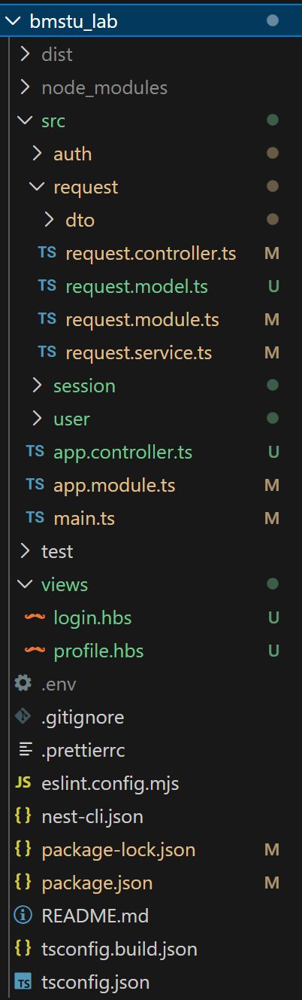

## Тестирование
## 1. Swagger
Зайдем на `http://localhost:3000/api` и посмотрим, что записалось в сваггере:


Все наши методы отразились в документации! Как тестировать? 
- Нажми **Authorize** → введи в `value` свою куку, полученную при авторизации
  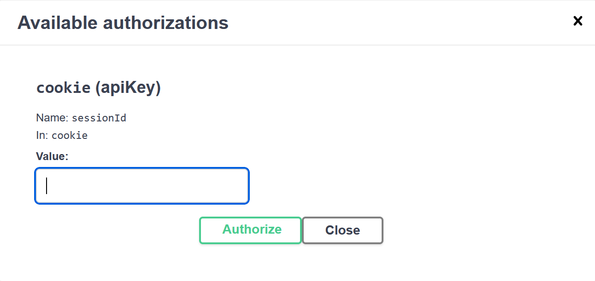
- Готово! Теперь можно тестировать методы, требующие авторизации :)

### Регистрация - `http://localhost:3000/auth/register`
Структура тела запроса:
```json
{
"email":"user@test.com",
"password":"123",
"name":"User"
}
```
Попробуем зарегистрироваться и получим 201 с данными о регистрации:
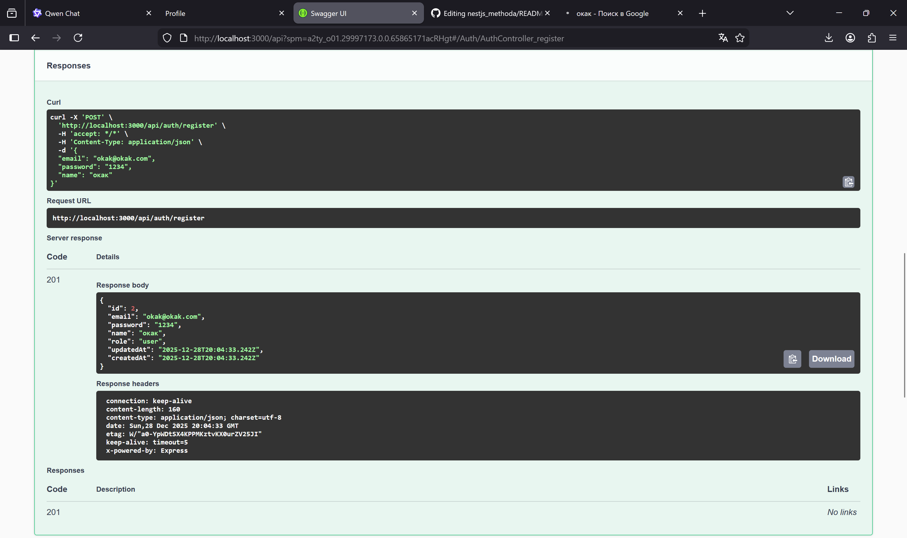

### Логин - `http://localhost:3000/auth/login`
```json
{
"email":"user@test.com",
"password":"123",
}
```
## 2. Postman
Залогинимся, предварительно открыв вкладку Сеть:
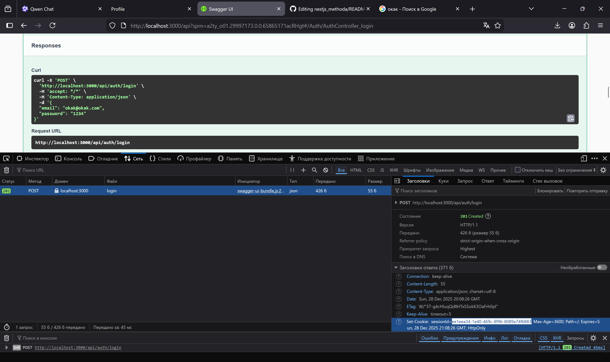
В Set-Cookie лежит заветная кука. Сохраните куку и используйте ее в следующих методах. Не потеряй ее и не сломай, как говорится.

Потестируем в Postman домен заявок. Перейдем на вкладку Cookies (чуть ниже кнопки Send) и вставим ID сессии следующим образом, не меняя ничего остального:
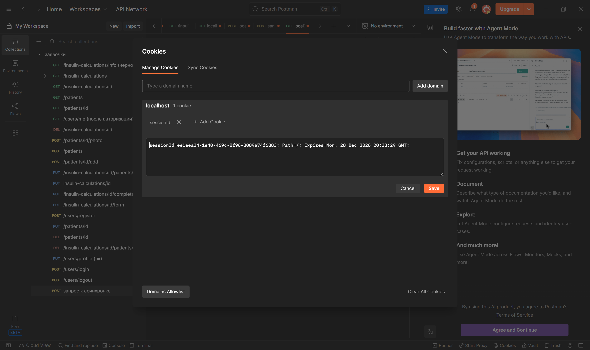

Убедимся, что правильно оформили куку, выполнив GET запрос на домен заявок. Если ответ - 200, то, поздравляю, вы верно авторизовались.
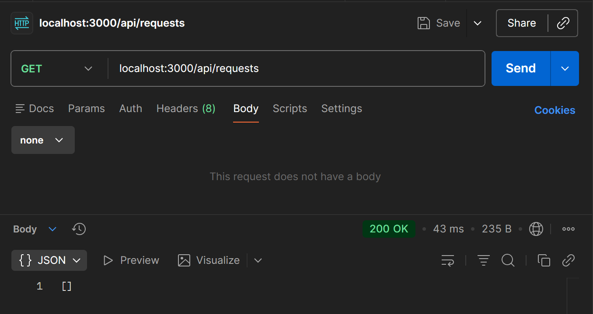


### Создание заявки
Создадим заявку и убедимся, что автор будет заполняться автоматически. Пусть наша заявка имеет следующую структуру:
```json
{
  "title": "Заявка на мемчик",
  "description": "Хочу мемчик"
}
```
После успешного создания получим всю информацию о заявке в ответе и заполненного автора:
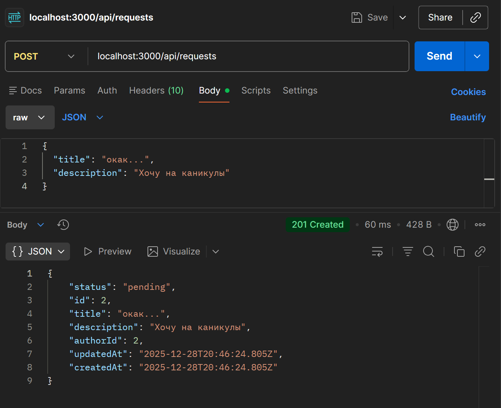

### Выход из аккаунта
Видим, что логаут прошел успешно.
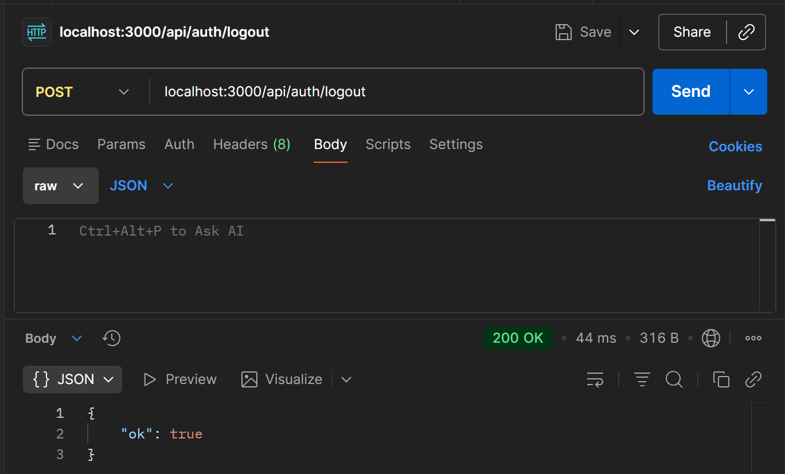

Попробуем сделать что-нибудь и увидим 401 - наша кука больше не действительна.
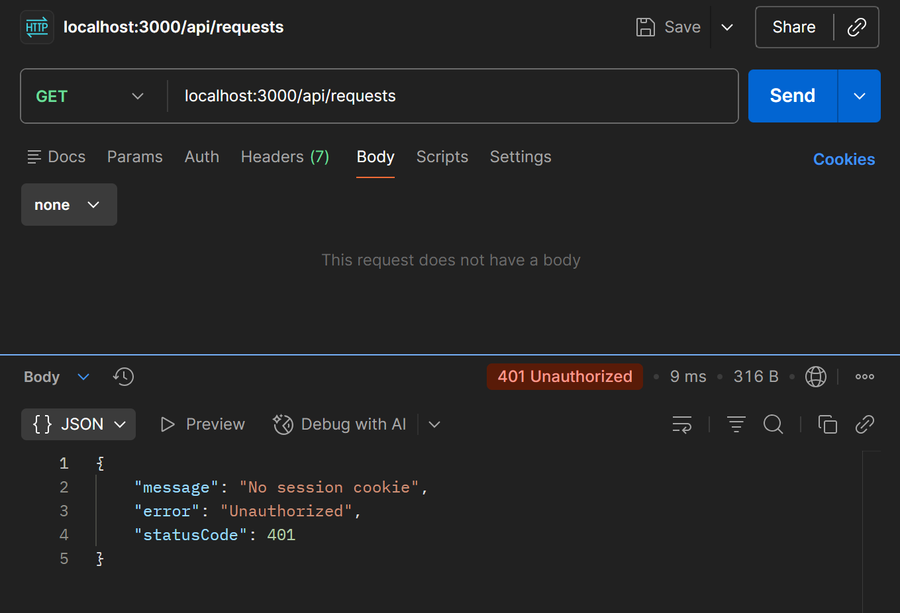
## 3. Handlebars через браузер
Залогинимся на странице `http://localhost:3000/login`:
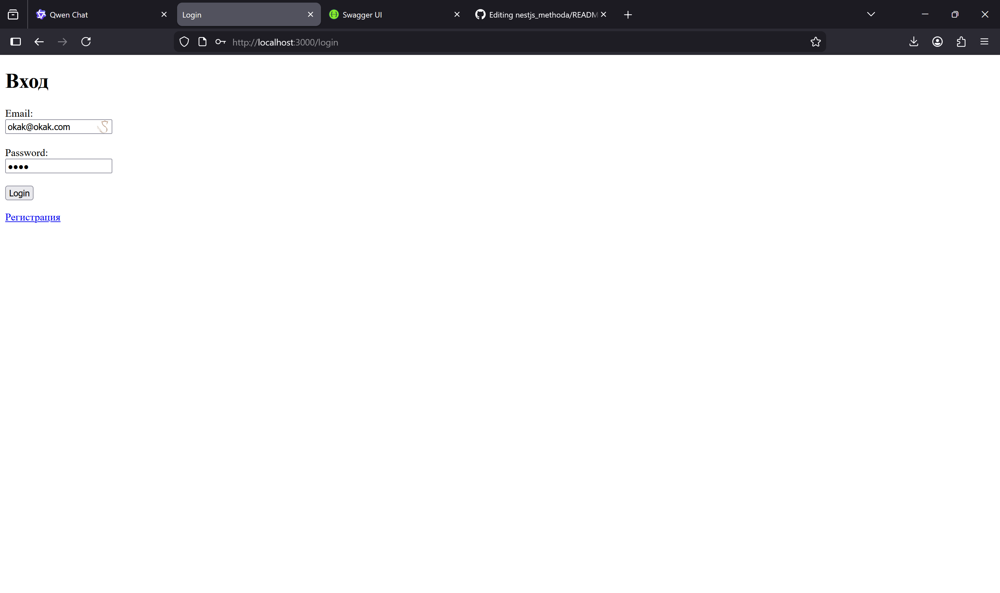
После успешной авторизации страничка вернет нам json с нашими данными. Затем зайдем на страницу профиля `http://localhost:3000/profile` и увидим все о пользователе.
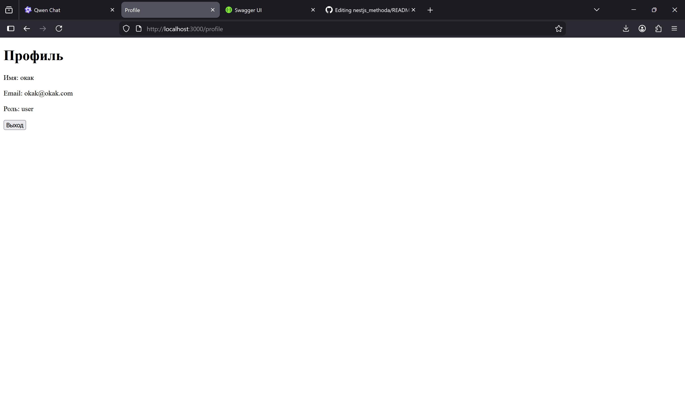
Попробуем выйти из аккаунта, нажав на кнопку "Выход". Все прошло успешно. Заметьте, что после логаута при попытке зайти на страницу профиля вас автоматически перебросит на страницу авторизации, что подтверждает, что мы все сделали верно.

---

## Заключение

Вы реализовали:

  ✅ Сессионную аутентификацию через куки,  
  ✅ Хранение данных в PostgreSQL (Sequelize),  
  ✅ Хранение сессий в Redis,  
  ✅ HTML-демо через Handlebars,  
  ✅ JSON API с тестированием в Swagger,  
  ✅ Ролевую модель и автоматическое заполнение authorId.

### Полезные ссылки

- [NestJS Docs](https://docs.nestjs.com/](https://insayt.github.io/nestjs.ru.com/guide/first-steps.html)) — документация NestJS на русском
- [OWASP: Session Management](https://cheatsheetseries.owasp.org/cheatsheets/Session_Management_Cheat_Sheet.html?spm=a2ty_o01.29997173.0.0.65865171acRHgt)
- [Express Session Best Practicesn](https://docs.nestjs.com/security/authentication](https://expressjs.com/en/resources/middleware/session.html?spm=a2ty_o01.29997173.0.0.65865171acRHgt))
- [Swagger 2.0 Spec](https://swagger.io/specification/v2/)

> 🎉 Поздравляем! Теперь вы умеете строить безопасные, stateful веб-приложения с сессиями, Redis и NestJS!
