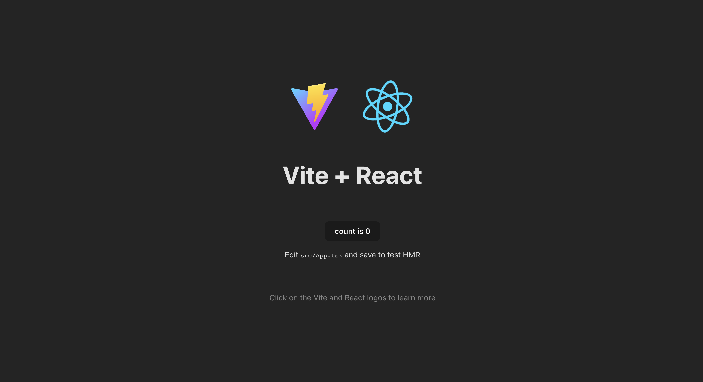
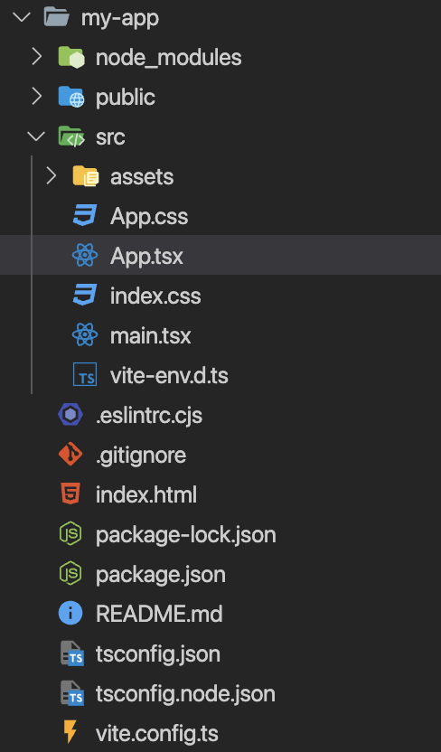

# Методические указания по выполнению лабораторной работы №4

**Цель лабораторной работы** - разработка базового приложения на React, знакомство с жизненным циклом приложения и хуками.

**Если у вас возникают сложности с выполнением данной лабораторной работы или недостаточно знаний по JavaScript рекомендуем посмотреть [курс][iu5-javascript].**

## Введение

<!-- TODO: ссылка на установку VM -->
<!-- TODO: ссылка на настройку IDE -->

### Как жить с API

В предыдущей лабораторной работе мы создали наш сервер на Django REST Framework и написали API.
Теперь попробуем написать сайт, который будет работать с нашим API.

До этого мы использовали Django шаблоны, чтобы показать пользователю интерфейс и отобразить данные, но сейчас так сделать не получится. Когда мы использовали Django шаблоны, то у нас сервер выступал в роли бекенда и фронтенда сразу, то есть в нем была реализовано бизнес логика по работе с данными (бекенд) и шаблонизатор для отдачи html (фронтенд).

Сейчас же нас сервер выступает в роли бекенда, который нам просто отдает данные, нам нужно написать приложение, которое будет уметь получать эти данные и выводить пользователю. У нас будет 2 независимых приложения. Бекенд на Django REST и фронтенд на JavaScript.

### Что такое TypeScript

TypeScript - это типизированный JavaScript. При написании кода на JavaScript мы сталкиваемся с проблемой, что у нас динамическая типизация. Это значит, что мы сможем узнать об ошибке только в момент выполнения программы. TypeScript призван решить эту проблему, потому что мы будем писать типы в нашем коде, и ошибку мы получим на этапе сборки приложения. Подробнее что такое TypeScript и какие там есть типы можно почитать в [статье][habr-typescript].

### Что такое JSX/TSX

JSX — расширение синтаксиса JavaScript. Этот синтаксис выглядит как язык шаблонов, но наделён всеми языковыми возможностями JavaScript. В результате компиляции JSX возникают простые объекты — «React-элементы». Подробнее про JSX можно почитать в [статье][habr-react-jsx]. TSX - это JSX только на языке TypeScript.

React DOM использует стиль именования camelCase для свойств вместо обычных имён HTML-атрибутов. Например, в JSX атрибут `tabindex` станет `tabIndex`. В то время как атрибут `class` записывается как `className`, поскольку слово `class` уже зарезервировано в JavaScript.

## React

React-разработка заключается в описании того, что нужно вывести на страницу (а не в составлении инструкций для браузера, посвящённых тому, как это делать). Это, кроме прочего, означает значительное сокращение объёмов шаблонного кода.

### Component

React-компоненты — это повторно используемые части кода, которые возвращают React-элементы для отображения на странице. Самый простой React-компонент — это простая функция JavaScript, которая возвращает элементы React.

```tsx
import { FC } from 'react'

const Welcome: FC = () => {
  return <h1>Привет, Мир</h1>;
}
```

Компоненты могут быть классами ES6.

```tsx
import React from 'react'

class Welcome extends React.Component {
  render() {
    return <h1>Привет, Мир</h1>;
  }
}
```

На данный момент в разработке предпочитают использовать функциональные компоненты. Подробнее о том, как они работают и чем отличаются от классовых можно узнать в [этой статье][habr-react-diff-class-function-component]. В данной лабораторной работе мы будем рассматривать **только функциональные компоненты**.

Компоненты могут состоять из других компонентов, так что по сути целая страница может считаться компонентом.

### Element

React-элементы — это составляющие блоки React-приложений. Их можно перепутать с более известной концепцией «компонентов», но в отличие от компонента, элемент описывает то, что вы хотите увидеть на экране. React-элементы иммутабельны.

В стандартном React-приложении состояние является объектом. Процесс согласования (reconciliation process) в React определяет, необходимо ли производить повторный рендеринг объекта, поэтому ему нужно следить за изменениями этого объекта.

Другими словами, если React не сможет определить изменение объекта, он не обновит виртуальный DOM.

Иммутабельность позволяет наблюдать за такими изменениями. Это, в свою очередь, позволяет React сравнивать старое и новое состояния объекта и на основе этого сравнения перерисовывать объект.

### Props

`props` (пропсы) — это входные данные React-компонентов, передаваемые от родительского компонента дочернему компоненту.

Пример простого компонента `Text` с пропсом.

```tsx
import { FC } from 'react'

interface Props {
  name: string
}

const Text: FC<Props> = (props) => {
    return <h1>Привет, {props.name}</h1>;
}
```

Этот компонент используется на главной странице, куда передаем название текста.

```tsx
import { FC } from 'react'

const MainPage: FC = () => {
  return <Text name='Мир'/>
}
```

Пропсы предназначены для чтения. Если требуется изменять данные, то необходимо использовать state (состояние приложения).

В любом компоненте доступны `props.children`. Это контент между открывающим и закрывающим тегом компонента. Например:

```tsx
<React.StrictMode>
  <App />
</React.StrictMode>
```

Для `React.StrictMode` в **children** попадает компонент `App`.

### State

Компонент нуждается в `state`, когда данные в нём со временем изменяются. Например, компоненту `Checkbox` может понадобиться состояние `isChecked`. Рассмотрим пример такого компонента.

```tsx
import { FC, useState } from 'react'

const Checkbox: FC = () => {
    const [isChecked, setIsChecked] = useState<boolean>(false)

    return <h1 onClick={() => setIsChecked((state) => !state)}>Состояние: ${isChecked}</h1>;
}
```

Разница между пропсами и состоянием заключается в основном в том, что состояние нужно для управления компонентом, а пропсы для получения информации.

Если возникла необходимость изменять пропсы, то нужно вынести их в состояние родительского компонента и пробрасывать в текущий компонент не только этот объект, но и функцию, которая изменит его.

Прежде чем перейти к примеру работы с состоянием, ознакомимся с жизненным циклом приложения.

## Создание проекта

Для разработки мы будем использовать шаблон [Vite React TS][vite-template-project] - это удобная среда для создания первого простого приложения на **React**.

Для создания первого проекта выполняем следующее.

```shell
npm create vite@latest my-app -- --template react-ts
cd my-app
npm install
```

После выполнения этих команд у нас будет готовое приложение. "Под капотом" нашего приложения используется язык [Typescript][typescript], библиотека [React][react] и сборщик [Vite][vite].

Для удобства разработки внесем изменения в `vite.config.ts`, чтобы у нас всегда локальный сервер запускался на **3000 порту**.

```ts
import { defineConfig } from 'vite'
import react from '@vitejs/plugin-react'

// https://vitejs.dev/config/
export default defineConfig({
  server: { port: 3000 },
  plugins: [react()],
})
```

Для работы с приложением у нас есть 2 основные команды:

* `npm run dev` - запуск локального сервера для разработки
* `npm run build` - создание оптимизированной сборки приложения

Выполним команду `npm run dev`, чтобы запустить локальный сервер для разработки. Страница автоматически перезагрузиться, если вы внесете изменения в код. Вы сможете увидеть ошибки сборки и предупреждения в консоли.



## Структура проекта

В папке проекта у нас будут следующие файлы:

* `package.json` - основной файл с информацией о проекте
* `package-lock.json` - лок файл со списком зависимостей
* `vite.config.ts` - конфигурационный файл сборщика Vite
* `tsconfig.json` - конфигурационный файл TypeScript
* `tsconfig.node.json` - конфигурационный файл TypeScript при запуске на Node
* `.eslintrc.cjs` - конфигурационный файл Eslint
* `index.html` - основной файл нашего приложения. Он будет первым загружаться, когда пользователь заходит на страницу
* `src/main.tsx` - основной TS файл нашего приложения. Тут мы запускаем отрисовку приложения
* `src/App.tsx` - верстка приложения. Логотип Vite и React



Рассмотрим поподробнее основные файлы нашего приложения.

### index.html

```html
<!doctype html>
<html lang="en">
  <head>
    <meta charset="UTF-8" />
    <link rel="icon" type="image/svg+xml" href="/vite.svg" />
    <meta name="viewport" content="width=device-width, initial-scale=1.0" />
    <title>Vite + React + TS</title>
  </head>
  <body>
    <div id="root"></div>
    <script type="module" src="/src/main.tsx"></script>
  </body>
</html>
```

Файл `index.html` первым загружается при стартпе приложения у пользователя. Рассмотрим основные части:

* `link` - загрузка иконки вкладки в браузере
* `title` - название вкладки в браузере
* `meta` - установка технической информации
* `script` - подключение основного TS файла нашего проекта. Когда он загрузится, то начнет исполнятся и нарисует логотипы Vite и React
* `div id=root` - технический тег. В него React будет вставлять код приложения

### src/main.tsx

```tsx
import React from 'react'
import ReactDOM from 'react-dom/client'
import App from './App.tsx'
import './index.css'

ReactDOM.createRoot(document.getElementById('root')!).render(
  <React.StrictMode>
    <App />
  </React.StrictMode>,
)
```

Файл `src/main.tsx` загружается с нашего html файла и после исполнения начнет рендерить наше приложение. Рассмотрим основные части:

* `document.getElementById('root')` - получение технического тега из `index.html` файла
* `React.StrictMode` - инструмент для обнаружения потенциальных проблем в приложении

### src/App.tsx

```tsx
import { useState } from 'react'
import reactLogo from './assets/react.svg'
import viteLogo from '/vite.svg'
import './App.css'

function App() {
  const [count, setCount] = useState(0)

  return (
    <>
      <div>
        <a href="https://vitejs.dev" target="_blank">
          
        </a>
        <a href="https://react.dev" target="_blank">
          
        </a>
      </div>
      <h1>Vite + React</h1>
      <div className="card">
        <button onClick={() => setCount((count) => count + 1)}>
          count is {count}
        </button>
        <p>
          Edit <code>src/App.tsx</code> and save to test HMR
        </p>
      </div>
      <p className="read-the-docs">
        Click on the Vite and React logos to learn more
      </p>
    </>
  )
}

export default App
```

Это основной компонент нашего приложения. В нем происходит отрисовка логотипов Vite и React.

## Роутинг

Вне зависимости от выбранной предметной области нашего приложение может состоять из нескольких страниц. Для удобного перехода между страницами будет использовать роутинг.

Для этого нам необходимо установить библиотеки `react-router-dom`, `@types/react-router-dom`

```shell
npm i react-router-dom
npm i @types/react-router-dom -D
```

Сделаем так, чтобы в `main.tsx` у нас было несколько страниц.

```tsx
import React from 'react'
import ReactDOM from 'react-dom/client'

import { createBrowserRouter, RouterProvider } from 'react-router-dom'
import './index.css'

const router = createBrowserRouter([
  {
    path: '/',
    element: <h1>Это наша стартовая страница</h1>
  },
  {
    path: '/new',
    element: <h1>Это наша страница с чем-то новеньким</h1>
  }
])

ReactDOM.createRoot(document.getElementById('root')!).render(
  <React.StrictMode>
    <RouterProvider router={router} />
  </React.StrictMode>,
)
```

### Главная страница


### Страница `/new`


Роутер позволяет нам перемещаться между разными страницами без перезагрузки. Для этого можно использовать стандартный тег `a`.

```tsx
import React from 'react'
import ReactDOM from 'react-dom/client'
import { createBrowserRouter, RouterProvider, Link } from 'react-router-dom'
import './index.css'

const router = createBrowserRouter([
  {
    path: '/',
    element: <h1>Это наша стартовая страница</h1>
  },
  {
    path: '/new',
    element: <h1>Это наша страница с чем-то новеньким</h1>
  }
])

ReactDOM.createRoot(document.getElementById('root')!).render(
  <React.StrictMode>
    <ul>
      <li>
        <a href="/">Старт</a>
      </li>
      <li>
        <a href="/new">Хочу на страницу с чем-то новеньким</a>
      </li>
    </ul>
    <hr />
    <RouterProvider router={router} />
  </React.StrictMode>,
)
```

### Финальный результат


Теперь вы знакомы с роутингом в приложении. Если потребуется обрабатывать какую-то информацию из адресной строки или использовать какой-то **особый роутер**, то подробнее о типах и работе роутеров можно ознакомиться в документации React или же на сайте [React Router][react-router] с готовыми примерами.

## Жизненный цикл

Давайте рассмотрим каждый жизненный этап, включая методы, с ними связанные. В примере будут рассмотрены методы классового компонента, потому что в функциональных компонентах используется концепция хуков, о которых будет рассказано позднее.

### Монтирование

Классовые компоненты тоже являются классами,  так что в первую очередь будет вызван `constructor()`. В нем мы выполняем инициализацию состояния компонента.

Далее компонент запускает `getDerivedStateFromProps()`, потом запускается `render()`, возвращающий JSX. React «монтируется» в DOM.

Затем происходит запуск метода `componentDidMount()`, в котором выполняются все асинхронные процессы, описанные разработчиком. После этого компонент можно считать успешно "рожденным".

### Обновление

Данный этап запускается во время каждого изменения состояния либо свойств. Как и в случае с монтированием, происходит вызов метода `getDerivedStateFromProps()`, однако в этот раз уже без конструктора. Потом происходит запуск `shouldComponentUpdate()`.

В `shouldComponentUpdate()` можно сравнить состояния **до** и **после**, чтобы лишний раз не перерисовывать компонент.

Потом React запустит `componentDidUpdate()`. Как и в случае с `componentDidMount()`, его можно применять для асинхронных вызовов либо управления DOM.

### Размонтирование

Когда компонент прожил свою жизнь, наступает размонтирование — последний жизненный этап. React выполняет запуск `componentWillUnmount()` непосредственно перед удалением из DOM. Данный метод применяется при закрытии всех открытых соединений типа web-сокетов либо тайм-аутов.

## Хуки

Хуки — нововведение в React 16.8, которое позволяет использовать состояние и другие возможности React без написания классов.

Хук - функция, которая позволяет добавлять пользовательскую логику в события жизненного цикла приложения. **Они не будут работать в классовых компонентах!**

### Хук состояния

Допустим, мы хотим инициализировать в классе состояние `count` значением `0`. Для этого в его конструкторе присваиваем `this.state` объект `{ count: 0 }`:

```tsx
import React from 'react'

class Example extends React.Component {
    constructor() {
        this.state = {
            count: 0
        };
    }
}
```

В функциональном компоненте нам недоступен `this`, поэтому мы не можем задать или считать состояние через `this.state`. Вместо этого мы вызываем хук `useState` напрямую изнутри нашего компонента.

```tsx
import { FC, useState } from 'react'

const Example: FC = () => {
    // Объявление новой переменной состояния «count»
    const [count, setCount] = useState(0);

    return <div onClick={()=>setCount(count=>count++)}>{count}</div>
}
```

### Хук эффекта

С помощью хука эффекта `useEffect` вы можете выполнять побочные эффекты из функционального компонента. Он выполняет ту же роль, что и `componentDidMount`, `componentDidUpdate` и `componentWillUnmount` в React-классах, объединив их в единый API. Вы можете найти сравнение `useEffect` и этих методов на странице [использование хука эффекта][react-hooks].

```tsx
useEffect(() => {
  // Этот код выполнится на mount`е компонента
        
  return () => {
    // Этот код выполнится на unmount`е компонента
  }

  // Это список зависимостей хука, он будет вызван каждый раз, когда зависимости будут меняться
}, [])
```

Хуки налагают два дополнительных правила для разработки:

* Не вызывайте хуки внутри циклов, условий или вложенных функций.
Они должны выполняться только **на верхнем уровне**.
* Хуки следует вызывать только из функциональных компонентов React и пользовательских хуков.

Пользовательский хук это такая функция JavaScript, внутри которой используются другие хуки. На этот хук распространяются правила хуков, которые описаны ранее.

В [этой статье][habr-react-hooks] можно посмотреть на классные реализации полезных в разработке пользовательских хуков.

### Практика

Создадим функциональный компонент на примере котором сможем наблюдать работу с состоянием и жизненным циклом приложения.

```tsx
import { FC, useEffect, useState } from 'react'

const data: string[] = [
    'Берик Дондаррион',
    'Леди Мелиссандра',
    'Полливер',
    'Уолдер Фрей',
    'Тайвин Ланнистер',
    'Сир Мерин Трэнт',
    'Король Джоффри',
    'Сир Илин Пейн',
    'Гора',
    'Пес',
    'Серсея Ланнистер',
]

const StartPage: FC = () => {
    // В функциональных компонентах для работы с состоянием можно использовать хук useState()
    // Он возвращает кортеж из двух элементов:
    // 1 элемент - объект состояния
    // 2 элемент - метод который позволит нам обновить состояние
    const [randomName, setRandomName] = useState('')

    // Кстати, это хороший пример деструктуризации массива в JavaScript
    const [names, setNames] = useState(data)

    const [showNames, setShowNames] = useState(false)

    // В данном хендлере мы изменяем состояние на какое-то конкретное
    const handleShowNames = () => {
        setShowNames(true)
    }

    // В данном хендлере мы изменяем состояние на какое-то конкретное
    const handleHideNames = () => {
        setShowNames(false)
    }

    useEffect(()=>{
        console.log('Этот код выполняется только на первом рендере компонента')
        // В данном примере можно наблюдать Spread syntax (Троеточие перед массивом)
        setNames((names) => [...names, 'Бедный студент'])

        return () => {
            console.log('Этот код выполняется, когда компонент будет размонтирован')
        }
    },[])

    useEffect(()=>{
        console.log('Этот код выполняется каждый раз, когда изменится состояние showNames')
        setRandomName(names[Math.floor(Math.random()*names.length)])
    },[showNames])

    return (
        <div>
            <h3>Случайное имя из списка: {randomName}</h3>
            {/*Кнопка для того, чтобы показать имена*/}
            <button onClick={handleShowNames}>Хочу увидеть список имен</button>
            {/*Кнопка для того, чтобы скрыть имена*/}
            <button onClick={handleHideNames}>Хочу скрыть список имен</button>

            {/*React отрисует список только если showNames будет равен true, boolean значения игнорируются при отрисовке*/}
            {showNames && (
                <ul>
                    {names.map((name, index)=> (
                        <li key={index}>
                            <span>{name}</span>
                        </li>
                    ))}
                </ul>
            )}
        </div>
    )
}

export default StartPage
```


## Реальная практика

Предположим, у нас уже есть рабочий API (В примере используется API ITunes). Мы можем получить список сущностей, отфильтровать их и вывести в понятном виде пользователю.

Для этого нам необходимо установить библиотеку `react-bootstrap` и `bootstrap`.

```shell
npm i react-bootstrap bootstrap
```

`bootstrap` необходимо испортировать в файле `main.tsx`
```tsx
import 'bootstrap/dist/css/bootstrap.min.css'
```

Создадим страницу для отрисовки треков из ITunes.

### ITunesPage

#### ITunesPage.css

```css
.container {
    display: flex;
    flex-direction: column;
    padding: 20px 40px;
    min-width: 800px;
}
.containerLoading {
    filter: blur(8px);
}

@media (max-width: 600px) {
    .container{
        min-width: auto;
    }
}
```

#### ITunesPage.tsx

```tsx
import { FC, useState} from 'react'
import { Card, Col, Row, Button, Spinner } from 'react-bootstrap'
import './ITunesPage.css'

interface ITunesMusic {
    wrapperType: string
    artworkUrl100: string
    artistName: string
    collectionCensoredName: string
    trackViewUrl: string
}

interface ITunesResult {
    resultCount: number
    results: ITunesMusic[]
}

const getMusicByName = async (name = ''): Promise<ITunesResult> =>{
    return fetch(`https://itunes.apple.com/search?term=${name}`)
        .then((response) => response.json())
        .catch(()=> ({ resultCount:0, results:[] }))
}

const ITunesPage: FC = () => {
    const [searchValue, setSearchValue] = useState('')

    const [loading, setLoading] = useState(false)

    const [music, setMusic] = useState<ITunesMusic[]>([])

    const handleSearch = async () =>{
        await setLoading(true)
        const { results } = await getMusicByName(searchValue)
        await setMusic(results.filter(item => item.wrapperType === "track"))
        await setLoading(false)
    }

    return (
        <div className={`container ${loading && 'containerLoading'}`}>
            {loading && <div className="loadingBg"><Spinner animation="border"/></div>}

            <div className="inputField">
                <input value={searchValue} onChange={(event => setSearchValue(event.target.value))}/>
                <Button disabled={loading} onClick={handleSearch}>Искать</Button>
            </div>

            {!music.length && <div>
                <h1>К сожалению, пока ничего не найдено :(</h1>
            </div>}

            <Row xs={4} md={4} className="g-4">
                {music.map((item, index)=> (
                    <Col >
                        <Card key={index} className="card">
                            <Card.Img className="cardImage" variant="top" src={item.artworkUrl100} height={100} width={100}  />
                            <Card.Body>
                            
                            <div className="textStyle">
                                <Card.Title>{item.artistName}</Card.Title>
                            </div>

                            <div className="textStyle">
                                <Card.Text>
                                    {item.collectionCensoredName}
                                </Card.Text>
                            </div>

                            <Button className="cardButton" href={item.trackViewUrl} target="_blank" variant="primary">Открыть в ITunes</Button>
                            </Card.Body>
                        </Card>
                    </Col>
                ))}
            </Row>
        </div>
    )
}

export default ITunesPage
```


Для того, чтобы в будущем было куда удобнее разрабатывать, стоит разделять страницу на компоненты, и разделять логику в разных файлах.

На данном этапе у нас есть тонна кода в одном файле. Вынесем в директорию `components` карточку и поле ввода. Работу с сетью вынесем в директорию `modules`.

### components/InputField

#### InputField.css

```css
.inputField {
    display: flex;
    padding: 12px 0;
}
.inputField > input {
    width: 200px;
    margin-right: 12px;
    border: 2px solid black;
    border-radius: 4px;
    outline: none;
}
```

#### InputField.tsx

```tsx
import { FC } from 'react'
import { Button } from 'react-bootstrap'
import './InputField.css'

interface Props {
    value: string
    setValue: (value: string) => void
    onSubmit: () => void
    loading?: boolean
    placeholder?: string
    buttonTitle?: string
}

const InputField: FC<Props> = ({ value, setValue, onSubmit, loading, placeholder, buttonTitle = 'Искать' }) => (
    <div className="inputField">
        <input value={value} placeholder={placeholder} onChange={(event => setValue(event.target.value))}/>
        <Button disabled={loading} onClick={onSubmit}>{buttonTitle}</Button>
    </div>
)

export default InputField
```

### components/MusicCard

#### MusicCard.css

```css
.card {
    padding: 8px;
}
.loadingBg {
    z-index: 999;
    position: fixed;
    height: 100%;
    width: 100%;
    display: flex;
    justify-content: center;
    align-items: center;
}
.textStyle {
    height:48px;
    overflow:hidden;
    text-overflow:ellipsis;
    margin-bottom:12px;
}
.cardImage {
    object-fit: contain;
}
.cardButton {
    width: 100%;
}
```

#### MusicCard.tsx

```tsx
import { FC } from 'react'
import { Button, Card } from 'react-bootstrap'
import './MusicCard.css'

interface Props {
    artworkUrl100: string
    artistName: string
    collectionCensoredName: string
    trackViewUrl: string
}

const MusicCard: FC<Props> = ({ artworkUrl100, artistName, collectionCensoredName, trackViewUrl }) => (
    <Card className="card">
        <Card.Img className="cardImage" variant="top" src={artworkUrl100} height={100} width={100}  />
        <Card.Body>                
            <div className="textStyle">
                <Card.Title>{artistName}</Card.Title>
            </div>
            <div className="textStyle">
                <Card.Text>
                    {collectionCensoredName}
                </Card.Text>
            </div>
            <Button className="cardButton" href={trackViewUrl} target="_blank" variant="primary">Открыть в ITunes</Button>
        </Card.Body>
    </Card>
)

export default MusicCard;
```

### modules/get-music-by-name.ts

```ts
export interface ITunesMusic {
    wrapperType: string
    artworkUrl100: string
    artistName: string
    collectionCensoredName: string
    trackViewUrl: string
}

export interface ITunesResult {
    resultCount: number
    results: ITunesMusic[]
}

export const getMusicByName = async (name = ''): Promise<ITunesResult> =>{
    return fetch(`https://itunes.apple.com/search?term=${name}`)
        .then((response) => response.json())
        .catch(()=> ({ resultCount:0, results:[] }))
}
```

### ITunesPage.tsx

```tsx
import { FC, useState} from 'react'
import { Col, Row, Spinner } from 'react-bootstrap'
import { ITunesMusic, getMusicByName } from './modules/get-music-by-name'
import { InputField } from './components/InputField'
import { MusicCard } from './components/MusicCard'
import './ITunesPage.css'

const ITunesPage: FC = () => {
    const [searchValue, setSearchValue] = useState('')

    const [loading, setLoading] = useState(false)

    const [music, setMusic] = useState<ITunesMusic[]>([])

    const handleSearch = async () =>{
        await setLoading(true)
        const { results } = await getMusicByName(searchValue)
        await setMusic(results.filter(item => item.wrapperType === "track"))
        await setLoading(false)
    }

    return (
        <div className={`container ${loading && 'containerLoading'}`}>
            {loading && <div className="loadingBg"><Spinner animation="border"/></div>}

            <InputField
                value={searchValue}
                setValue={(value) => setSearchValue(value)}
                loading={loading}
                onSubmit={handleSearch}
            />

            {!music.length && <div>
                <h1>К сожалению, пока ничего не найдено :(</h1>
            </div>}

            <Row xs={4} md={4} className="g-4">
                {music.map((item, index)=> (
                    <Col key={index}>
                        <MusicCard {...item} />
                    </Col>
                ))}
            </Row>
        </div>
    )
}

export default ITunesPage
```

В итоге у нас получилось приложение для поиска музыки в ITunes. В этом приложении мы использовали функциональные компоненты, хуки жизненного цикла и стейт приложения.

## Доработка React приложения по варианту

### Реализовать получение данных из mock-объектов

Доработать страницу приложения по вашему варианту. Наполнение данных осуществить через mock-объекты.

### Добавить Навигационную цепочку и страницу Подробнее

Добавить страницу Подробнее для просмотра данных о вашем товаре/услуге.

Для удобной навигации добавить Навигационную цепочку `Breadcrumbs`: [Магазин](/README.md) / [Название услуги](/README.md).

### Подключение к собственному API из web-сервиса

Вернемся к нашему примеру с iTunes. Теперь нам требуется заменить наши запросы `fetch` к сервису iTunes на обращение к нашему сервису `Django` или `Golang`.

## Важный момент. CORS

У вас возникнет проблема с отображением проекта React с частью, связанной с json'ом, при подключении приложения к вашему веб-сервису.

Как понять, что пустой экран связан с этой ошибкой?

Нажимаем правой кнопкой мыши на любое место на странице, после чего нажимаем на кнопку **Посмотреть код**. После чего переходим во вкладку **Console**, где и ищем ошибку связанную с `CORS`-политикой. Если она есть, то просто отключаем CORS.

Мы предлагаем 3 способа решения этой проблемы.

### CORS. Проксирование на фронтенде

Мы можем проксировать запросы через наш dev сервер. Схема проксирования такая: фронт -> прокси -> бек. В таком случае у нас не будет проблем с `CORS` запросами.

Для настройки необходимо в файле `vite.config.ts` указать поле [proxy][vite-proxy]. К примеру, если мы будем делать запрос на `/api`, то наш dev сервер будет проксировать его на `http://localhost:8080/api`.

```ts
export default defineConfig({
  server: {
    proxy: {
      // string shorthand: http://localhost:3000/api -> http://localhost:8080/api
      '/api': 'http://localhost:8080',
    },
  },
})
```

Важно момент, что такое решение работает только при локальной разработке. Если мы будем разворачивать приложение в prod окружении, то нам нужно будет настраивать `proxy` другим способом.

### CORS. Настройка на бекенде

Необходимо на бекенде настроить отдачу `CORS` заголовков. Как это сделать можно почитать [тут][habr-cors1] или [тут][habr-cors2].

### CORS. Отключение на фронтенде

С помощью специальных расширений мы можем отключить работу `CORS` политик на фронтенде. К пример, вот полезное расширение для [Google Chrome][chrome-cors-unblock]. Но расширение браузера не лучшее решение данной проблемы, это небезопасно при использовании в сторонних сайтах. Поэтому его можно использовать только для отладки на этапе разработки, но не для конечного решения.

## Развертывание приложения React в GitHub Pages

С помощью `GitHub Pages` возможно развернуть статическое приложение, например наш React проект. Но развернуть наш бекенд здесь не получится.

[Пример развертывания React + Vite][vite-gh-pages]

### Обратите внимание

При развертывании приложения `React` через `GitHub Pages`, ваши `AJAX` запросы будут идти по `http`, в то время как приложение будет доступно по `https`. Работать это будет только при использовании адреса `localhost` в `AJAX` запросах.

## Главное меню приложения

Для создания главного меню приложения будем использовать `Navbar` из `react-bootstrap`

[Подробнее](https://react-bootstrap.github.io/components/navbar/)

```jsx
import Container from 'react-bootstrap/Container';
import Nav from 'react-bootstrap/Nav';
import Navbar from 'react-bootstrap/Navbar';
import NavDropdown from 'react-bootstrap/NavDropdown';

function BasicExample() {
  return (
    <Navbar bg="light" expand="lg">
      <Container>
        <Navbar.Brand href="#home">React-Bootstrap</Navbar.Brand>
        <Navbar.Toggle aria-controls="basic-navbar-nav" />
        <Navbar.Collapse id="basic-navbar-nav">
          <Nav className="me-auto">
            <Nav.Link href="#home">Home</Nav.Link>
            <Nav.Link href="#link">Link</Nav.Link>
            <NavDropdown title="Dropdown" id="basic-nav-dropdown">
              <NavDropdown.Item href="#action/3.1">Action</NavDropdown.Item>
              <NavDropdown.Item href="#action/3.2">
                Another action
              </NavDropdown.Item>
              <NavDropdown.Item href="#action/3.3">Something</NavDropdown.Item>
              <NavDropdown.Divider />
              <NavDropdown.Item href="#action/3.4">
                Separated link
              </NavDropdown.Item>
            </NavDropdown>
          </Nav>
        </Navbar.Collapse>
      </Container>
    </Navbar>
  );
}

export default BasicExample;
```

## Полезные ссылки

* [React][react]
* [React Router][react-router]
* [Typescript][typescript]
* [Vite][vite]

[iu5-javascript]: https://github.com/iu5git/JavaScript
[react]: https://react.dev
[react-hooks]: https://react.dev/reference/react
[react-router]: https://reactrouter.com
[vite]: https://vitejs.dev
[vite-proxy]: https://vitejs.dev/config/server-options.html#server-proxy
[vite-template-project]: https://vitejs.dev/guide/#scaffolding-your-first-vite-project
[vite-gh-pages]: https://rashidshamloo.hashnode.dev/deploying-vite-react-app-to-github-pages
[typescript]: https://www.typescriptlang.org/
[habr-react-diff-class-function-component]: https://habr.com/ru/company/ruvds/blog/444348
[habr-react-hooks]: https://habr.com/ru/company/ruvds/blog/554280
[habr-react-jsx]: https://habr.com/ru/articles/319270
[habr-typescript]: https://habr.com/ru/articles/663964
[habr-cors1]: https://habr.com/ru/companies/macloud/articles/553826
[habr-cors2]: https://habr.com/ru/articles/514684
[chrome-cors-unblock]: https://chrome.google.com/webstore/detail/cors-unblock/lfhmikememgdcahcdlaciloancbhjino