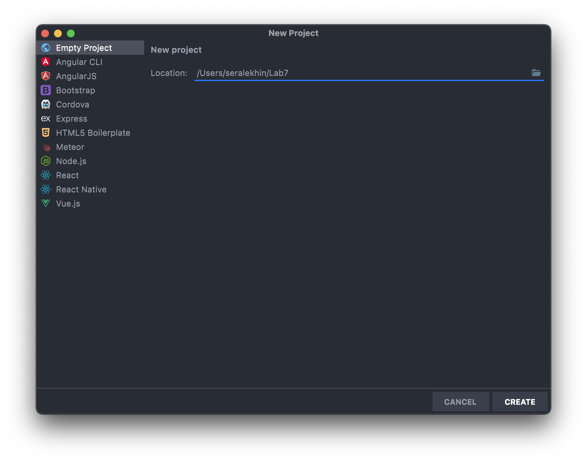
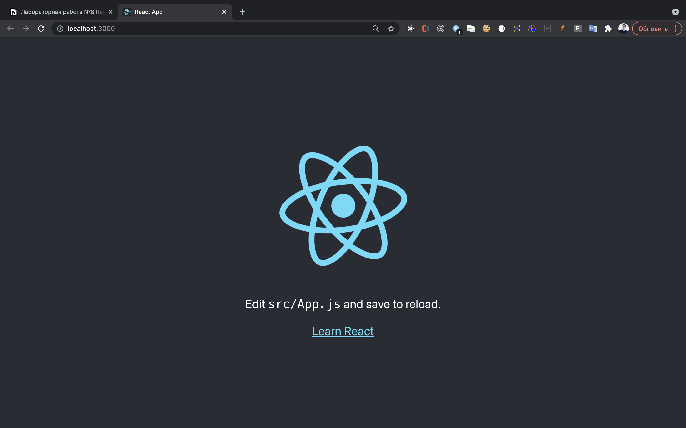
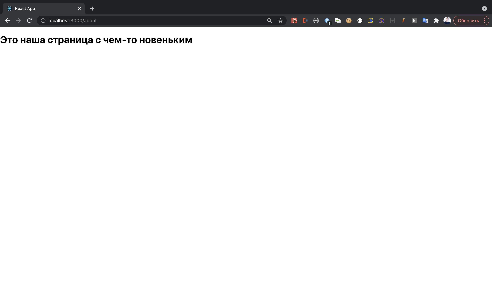
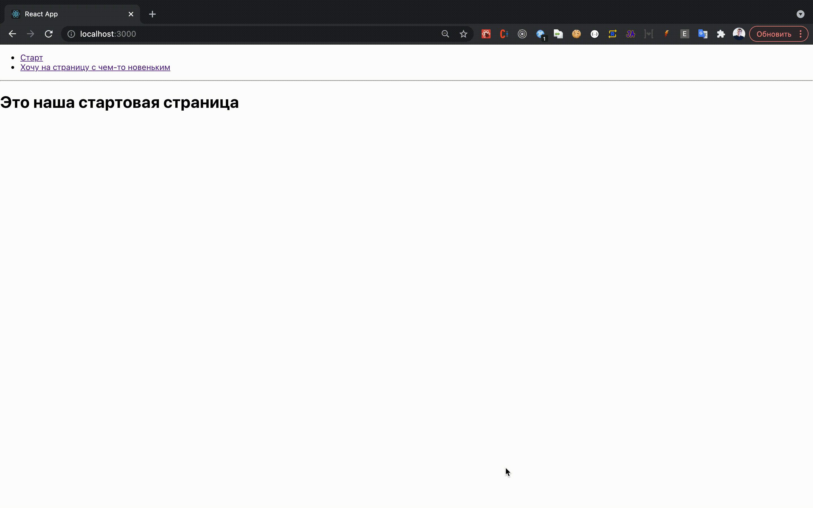

# Методические указания по выполнению лабораторной работы №4-5

### Команда курса благодарит Петренко Сергея Сергеевича за активное участие в подготовке данного руководства.

# План

1. Введение и установка проекта
2. Роутинг в react приложении
3. Терминология
    1. JSX
    2. Component
    3. Element
    4. Props
    5. State
4. Жизненный цикл react приложения
    1. Монтирование
    2. Обновление
    3. Размонтирование
5. Функциональные компоненты и хуки
    1. Функциональные компоненты
    2. Хуки
        1. Хук состояния
        2. Хук Эффекта
        3. Пользовательские хуки
6. Практика
    1. Пример работы с хуками эффекта и состояния на простом приложении
    2. Разработка с компонентным подходом.Пример работы с API, библиотеками и пользовательскими хуками
7. Полезные ссылки

# Введение и установка проекта

## Что такое npm и package.json

Когда мы работали с питоном, то у нас был venv, где мы хранили все наши пакеты. На фронтенде для этого используется пакетный менеджер [npm](https://www.npmjs.com). С помощью него мы можем скачивать нужные нам пакеты, все скаченные пакеты храняться в папке `node_modules`, а вот информация о том, какие пакеты используются в приложении хранится в `package.json`, подробнее [тут](https://proglib.io/p/chto-takoe-npm-gayd-po-node-package-manager-dlya-nachinayushchih-2020-07-21). Этот файл хранит в себе не только информацию о скаченных пакетах, но и название приложения, версию, описание, скрипты. `package.json` можно назвать файлом, в котором хранится сведение о проекте. Он как краткое описание проекта, по нему можно понять из чего состоит проект.

## Как работать с html в JS

Когда мы пишем код на JS, то нам достаточно часто нужно обращаться к верстке, для этого у нас есть общирное API по работе с [DOM деревом](https://learn.javascript.ru/dom-nodes). У нас есть все нужны для нас инструменты, чтобы мы могли обратиться к нужному нам элементу и изменить его как мы хотим. Сегодня мы будем использовать **getElementById** и **insertAdjacentHTML**, но функций намного больше.

## Вводная часть: как жить с API

В предыдущей лабораторной работе мы создали наш сервер на Django REST Framework и написали API.
Теперь попробуем написать сайт, который будет работать с нашим API.
До этого мы использовали Django шаблоны, чтобы показать пользователю интерфейс и отобразить данные, но сейчас так сделать не получится. Когда мы использовали Django шаблоны, то у нас сервер выступал в роли бекенда и фронтенда сразу, то есть в нем была реализовано бизнес логика по работе с данными (бекенд) и шаблонизатор для отдачи html (фронтенд). Сейчас же нас сервер выступает в роли бекенда, который нам просто отдает данные, нам нужно написать приложение, которое будет уметь получать эти данные и выводить пользователю. У нас будет 2 независимых приложения. Бекенд на Django REST и фронтенд на JS. Сегодня в примере будет работать с API по акциям, но немного модифицированном. Приступим к делу.

## Создание проекта

Для работы на фронтенде посоветуем использовать IDE [WebStrom](https://www.jetbrains.com/ru-ru/webstorm/). Это инструмент от команды JetBrains, которые создали PyCharm. Только PyCharm заточен для работы с питоном, а WebStrom для работы на фронтенде.

* Заходим в меню создания проекта: **File -> New Project**
* В открывшемся окне выбираем **Empty Project**
* Задаем путь к проекту **Location**



## React

React-разработка заключается в описании того, что нужно вывести на страницу (а не в составлении инструкций для браузера, посвящённых тому, как это делать). Это, кроме прочего, означает значительное сокращение объёмов шаблонного кода.

[Create React App](https://github.com/facebookincubator/create-react-app) — удобная среда для **изучения React** и лучший способ начать создание **нового [одностраничного](https://ru.reactjs.org/docs/glossary.html#single-page-application) приложения** на React.

Для запуска create-react-app убедитесь, что 

```
npx create-react-app my-app
cd my-app
npm start
```

Когда ваше приложение готово, запуск команды `npm run build` создаст оптимизированную сборку вашего приложения в папке `build`. Вы можете узнать больше о Create React App [из его README](https://github.com/facebookincubator/create-react-app#create-react-app--) и [его пользовательского руководства](https://facebook.github.io/create-react-app/).

Create React App не обрабатывает бэкенд логику или базы данных, он только предоставляет команды для сборки фронтенда, поэтому вы можете использовать его с любым бэкэндом. «Под капотом» используются [Babel](https://babeljs.io/) и [webpack](https://webpack.js.org/), но вам не нужно ничего знать о них **на момент выполнения данной лабораторной работы**.

Запуск команды `npm run start` позволит запустить локальный сервер для разработки.

Страница автоматически перезагрузится, если вы внесете изменения в код.
Вы сможете увидеть ошибки сборки и предупреждения в консоли.



В данной лабораторной работе Вам предстоит узнать о жизненном цикле React-приложения. Наиболее подробно с ним можно ознакомиться в документации React. Также полезной может оказаться эта [статья](https://habr.com/ru/post/358090/).

После запуска `create-react-app` в директории появится вполне живой стартовый проект.

В файле `index.js` директории `src` находится тот самый код, что оживляет наше приложение:

```
import React from 'react';
import ReactDOM from 'react-dom';
import './index.css';
import App from './App';
import reportWebVitals from './reportWebVitals';

ReactDOM.render(
  <React.StrictMode>
    <App />
  </React.StrictMode>,
document.getElementById('root')
);

// If you want to start measuring performance in your app, pass a function
// to log results (for example: reportWebVitals(console.log))
// or send to an analytics endpoint. Learn more: https://bit.ly/CRA-vitals
reportWebVitals();
```

`StrictMode` — инструмент для обнаружения потенциальных проблем в приложении.

`reportWebVitals` — позволяет вам измерять производительность и скорость отклика вашего приложения.

Стандартная `"Hello World"` страничка лежит в файле `App.js`

```
import logo from './logo.svg';
import './App.css';

function App() {
  return (
    <div className="App">
      <header className="App-header">
        
        <p>
          Edit <code>src/App.js</code> and save to reload.
        </p>
        <a
          className="App-link"
          href="https://reactjs.org"
          target="_blank"
          rel="noopener noreferrer"
        >
          Learn React
        </a>
      </header>
    </div>
  );
}

export default App;

```

# Роутинг в react приложении

Вне зависимости от выбранной вами предметной области, наше приложение может состоять из нескольких страниц. Предлагаю познакомиться с `роутингом` прежде чем мы приступим к созданию страниц приложения и изучению терминологии. 

Оставим в покое нашу точку входа в приложение `index.js`, и потрем содержимое `App.js`

Добавьте зависимости и установите библиотеки `react-router-dom` и `react-router`

```jsx
"react-router": "^5.0.0",
"react-router-dom": "^5.0.0",
```

Сделаем так, что App.js будет отвечать за роутинг в нашем приложении

```
import { BrowserRouter, Route, Switch } from "react-router-dom";

function App() {

  return (
      <BrowserRouter basename="/">
          <Switch>
            <Route exact path="/">
              <h1>Это наша стартовая страница</h1>
            </Route>
            <Route path="/new">
              <h1>Это наша страница с чем-то новеньким</h1>
            </Route>
          </Switch>
      </BrowserRouter>
  );
}

export default App;

```




Роутер позволяет нам перемещаться между разными страницами приложения без перезагрузки. Вы можете переходить по ним без перезагрузки, используя `Link`

```
import { BrowserRouter, Route, Link, Switch } from "react-router-dom";

function App() {

  return (
      <BrowserRouter basename="/" >
        <div>
          <ul>
            <li>
              <Link to="/">Старт</Link>
            </li>
            <li>
              <Link to="/new">Хочу на страницу с чем-то новеньким</Link>
            </li>
          </ul>
          <hr />
          <Switch>
            <Route exact path="/">
              <h1>Это наша стартовая страница</h1>
            </Route>
            <Route path="/new">
              <h1>Это наша страница с чем-то новеньким</h1>
            </Route>
          </Switch>
        </div>
      </BrowserRouter>
  );
}

export default App;
```



Теперь вы знакомы с роутингом в приложении. Если потребуется обрабатывать какую-то информацию из адресной строки или использовать какой-то **особый роутер**, то подробнее о типах и работе роутеров можно ознакомиться в документации React или же на [этом прекрасном сайте](https://v5.reactrouter.com/) с готовыми примерами.

Чтобы понимать, как все это работает, обратимся к терминологии

# Терминология

## JSX

JSX — расширение синтаксиса JavaScript. Этот синтаксис выглядит как язык шаблонов, но наделён всеми языковыми возможностями JavaScript. В результате компиляции JSX возникают простые объекты — «React-элементы». Чтобы ознакомиться с введением в JSX.

React DOM использует стиль именования camelCase для свойств вместо обычных имён HTML-атрибутов. Например, в JSX атрибут `tabindex` станет `tabIndex`. В то время как атрибут `class` записывается как `className`, поскольку слово `class` уже зарезервировано в JavaScript

## Component

React-компоненты — это повторно используемые части кода, которые возвращают React-элементы для отображения на странице. Самый простой React-компонент — это простая функция JavaScript, которая возвращает элементы React:

```jsx
function Welcome(props) {
  return <h1>Привет, {props.name}</h1>;
}
```

Компоненты могут быть классами ES6:

```jsx
class Welcome extends React.Component {
  render() {
    return <h1>Привет, {this.props.name}</h1>;
  }
}
```

На данный момент в разработке предпочитают использовать функциональные компоненты. Подробнее о том, как они работают и чем отличаются от классовых можно узнать в [этой статье](https://habr.com/ru/company/ruvds/blog/444348/)

Компоненты могут состоять из других компонентов, так что по сути целая страница может считаться компонентом.

## Element

React-элементы — это составляющие блоки React-приложений. Их можно перепутать с более известной концепцией «компонентов», но в отличие от компонента, элемент описывает то, что вы хотите увидеть на экране. React-элементы иммутабельны.

В стандартном React-приложении состояние является объектом. Процесс согласования (reconciliation process) в React определяет, необходимо ли производить повторный рендеринг объекта, поэтому ему нужно следить за изменениями этого объекта.

Другими словами, если React не сможет определить изменение объекта, он не обновит виртуальный DOM.

Иммутабельность позволяет наблюдать за такими изменениями. Это, в свою очередь, позволяет React сравнивать старое и новое состояния объекта и на основе этого сравнения перерисовывать объект.

```jsx
const element = <h1>Привет, мир</h1>;
```

## Props

`props` (пропсы) — это входные данные React-компонентов, передаваемые от родительского компонента дочернему компоненту.

Пропсы предназначены для чтения. Если требуется изменять данные, то необходимо использовать state(состояние приложения)

В любом компоненте доступны `props.children`. Это контент между открывающим и закрывающим тегом компонента. Например:

```jsx
<BrowserRouter basename="/">
          <Switch>
            <Route exact path="/">
              <h1>Это наша стартовая страница</h1>
            </Route>
            <Route path="/new">
              <h1>Это наша страница с чем-то новеньким</h1>
            </Route>
          </Switch>
</BrowserRouter>
```

> Для классовых компонентов используйте `this.props.children` !
> 

### Рассмотрим наш код:

Для `BrowserRouter` в **children** попадает только один компонент `Switch`

В свою очередь, в **children** у `Switch` попадает несколько `Route`

К слову, мы передали один пропс в `BrowserRouter` - `basename` , хотя интерфейс `BrowserRouter` позволяет передать в него еще много других пропсов:

```
export interface BrowserRouterProps {
    basename?: string | undefined;
    children?: React.ReactNode;
    getUserConfirmation?: ((message: string, callback: (ok: boolean) => void) => void) | undefined;
    forceRefresh?: boolean | undefined;
    keyLength?: number | undefined;
}
```

## State

Компонент нуждается в `state`, когда данные в нём со временем изменяются. Например, компоненту `Checkbox` может понадобиться состояние `isChecked`.

Разница между пропсами и состоянием заключается в основном в том, что состояние нужно для управления компонентом, а пропсы для получения информации.

Если возникла необходимость изменять пропсы, то нужно вынести их в состояние родительского компонента и пробрасывать в текущий компонент не только этот объект, но и функцию, которая изменит его.

Прежде чем перейти к примеру работы с состоянием, ознакомимся с жизненным циклом приложения. 

# Жизненный цикл react приложения

Давайте рассмотрим каждый жизненный этап, включая методы, с ними связанные.

## **№1: Монтирование**

Классовые компоненты тоже являются классами,  так что в первую очередь будет вызван constructor(). В нем мы выполняем инициализацию состояния компонента.

Далее компонент запускает getDerivedStateFromProps(), потом запускается render(), возвращающий JSX. React «монтируется» в DOM.

Затем происходит запуск метода componentDidMount(), в котором выполняются все асинхронные процессы, описанные разработчиком. После этого компонент можно считать успешно "рожденным"

## **№2: Обновление**

Данный этап запускается во время каждого изменения состояния либо свойств. Как и в случае с монтированием, происходит вызов метода getDerivedStateFromProps(), однако в этот раз уже без конструктора.

Потом происходит запуск shouldComponentUpdate(). 

В shouldComponentUpdate() можно сравнить состояния **до** и **после** , чтобы лишний раз не перерисовывать компонент.

Потом React запустит componentDidUpdate(). Как и в случае с componentDidMount(), его можно применять для асинхронных вызовов либо управления DOM.

## №3: Ра**змонтирование**

Когда компонент прожил свою жизнь, наступает размонтирование — последний жизненный этап. React выполняет запуск componentWillUnmount() непосредственно перед удалением из DOM. Данный метод применяется при закрытии всех открытых соединений типа web-сокетов либо тайм-аутов.

В этой лабораторной работе мы будем работать с функциональными компонентами.

# Функциональные компоненты

1. Описание компонентов с помощью чистых функций создает меньше кода, а значит его легче поддерживать.
2. Чистые функции намного проще тестировать. Вы просто передаете props на вход и ожидаете какую то разметку.
3. В будущем чистые функции будут выигрывать по скорости работы в сравнении с классами из-за отсутствия методов жизненного цикла

# Хуки 🪝🪝🪝

Хуки — нововведение в React 16.8, которое позволяет использовать состояние и другие возможности React без написания классов.

Хук - функция, которая позволяет добавлять пользовательскую логику в события жизненного цикла приложения. **Они не будут работать в классовых компонентах!**

## Хук состояния

Допустим, мы хотим инициализировать в классе состояние `count` значением `0`. Для этого в его конструкторе присваиваем `this.state` объект `{ count: 0 }`:

```jsx
class Example extends React.Component {
  constructor(props) {
    super(props);
    this.state = {
      count: 0
    };
  }
```

В функциональном компоненте нам недоступен `this`, поэтому мы не можем задать или считать состояние через `this.state`. Вместо этого мы вызываем хук `useState` напрямую изнутри нашего компонента.

```jsx
import React, { useState } from 'react';

function Example() {
  // Объявление новой переменной состояния «count»
  const [count, setCount] = useState(0);
	return <div onClick={()=>setCount(count=>count++)}>{count}</div>
}
```

## Хук эффекта

С помощью хука эффекта `useEffect` вы можете выполнять побочные эффекты из функционального компонента. Он выполняет ту же роль, что и `componentDidMount`, `componentDidUpdate` и `componentWillUnmount` в React-классах, объединив их в единый API. Вы можете найти сравнение `useEffect` и этих методов на странице [использование хука эффекта](https://ru.reactjs.org/docs/hooks-effect.html).

```jsx
useEffect(() => {
    // код выполнится на mount`е компонента
		return () => {
			 // код выполнится на unmount`е компонента
		}
  }, 
[] // Это список зависимостей хука, он будет вызван каждый раз, когда зависимости будут меняться
)
```

Хуки налагают два дополнительных правила для разработки:

- Не вызывайте хуки внутри циклов, условий или вложенных функций.
Они должны выполняться только **на верхнем уровне**.
- Хуки следует вызывать только из функциональных компонентов React и пользовательских хуков.

Пользовательский хук это такая функция JavaScript, внутри которой используются другие хуки. На этот хук распространяются правила хуков, которые описаны ранее.

В [этой статье](https://habr.com/ru/company/ruvds/blog/554280/) можно посмотреть на классные реализации полезных в разработке пользовательских хуков

```jsx
// Пример пользовательского хука (Называйте пользовательские хуки с use в начале!)
function useWindowSize() {
	// в данном пользовательском хуке мы используем хук состояния и хук эффекта
  const [windowSize, setWindowSize] = useState({
    width: undefined,
    height: undefined,
  });
  useEffect(() => {
		// при вызове этой функции, мы будем "класть" в состояние актуальную высоту и ширирну экрана
    function handleResize() {
      setWindowSize({
        width: window.innerWidth,
        height: window.innerHeight,
      });
    }
		// В данном примере мы будет подписываться на изменение размеров экрана, чтобы всегда иметь актуальные данные
    window.addEventListener("resize", handleResize);
    handleResize();
    // После того, как компонент "уничтожается", желательно избавиться от всех "слушателей", чтобы не тратить ресурсы браузера
    return () => window.removeEventListener("resize", handleResize);
  }, []);

  return windowSize;
}
```

# Практика

Создадим директорию со страницами нашего приложения:

Пример функционального компонента, на котором можно наблюдать работу с состоянием и жизненным циклом приложения:

```jsx
import React, {useEffect, useState} from 'react';

const data = [
    'Берик Дондаррион',
    'Леди Мелиссандра',
    'Полливер',
    'Уолдер Фрей',
    'Тайвин Ланнистер',
    'Сир Мерин Трэнт',
    'Король Джоффри',
    'Сир Илин Пейн',
    'Гора',
    'Пес',
    'Серсея Ланнистер',
]

function StartPage() {

    // В функциональных компонентах для работы с состоянием можно использовать хук useState()
    // Он возвращает кортеж из двух элементов:
    // 1 элемент - объект состояния
    // 2 элемент - метод который позволит нам обновить состояние
    const [randomName, setRandomName] = useState();

    // Кстати, это хороший пример деструктуризации массива в JavaScript
    const [names, setNames] = useState(data);

    const [showNames, setShowNames] = useState(false);

    // В данном хендлере мы изменяем состояние на какое-то конкретное
    const handleShowNames = () =>{
        setShowNames(true)
    }

    // В данном хендлере мы изменяем состояние на какое-то конкретное
    const handleHideNames = () =>{
        setShowNames(false)
    }

    // В данном хендлере мы изменяем состояние в зависимости от его прошлого значения
    const handleSwitch = () =>{
        // метод из useState может принимать как определенное значение, так и метод,
        // принимающий прошлое значение и возвращающий новое
        setShowNames(state => !state)
    }

    useEffect(()=>{
        console.log('Этот код выполняется только на первом рендере компонента')
        // В данном примере можно наблюдать Spread syntax (Троеточие перед массивом)
        setNames(names=>[...names, 'Бедный студент'])

        return () => {
            console.log('Этот код выполняется, когда компонент будет размонтирован')
        }
    },[])

    useEffect(()=>{
        console.log('Этот код выполняется каждый раз, когда изменится состояние showNames ')
        setRandomName(names[Math.floor(Math.random()*names.length)])
    },[showNames])

    
    return (
        <div>
            <h3>Случайное имя из списка: {randomName}</h3>
            {/*Кнопка для того, чтобы показать имена*/}
            <button onClick={handleShowNames}>Хочу увидеть список имен</button>
            {/*Кнопка для того, чтобы скрыть имена*/}
            <button onClick={handleHideNames}>Хочу скрыть список имен</button>

            {/*Универсальная кнопка*/}
            <button onClick={handleSwitch}>{showNames ? 'Хочу скрыть список имен' :'Хочу увидеть список имен' }</button>

            {/*React отрисует список только если showNames будет равен true, boolean значения игнорируются при отрисовке*/}
            {showNames && <ul>
            {/*Рекомендую почитать про прекрасные встроенные методы массивов в JavaScript    */}
            {names.map((name, index)=>{
                return (
                    <li key={index}>
                        <span>{name}</span>
                    </li>
                )
            })}
            </ul>
            }
        </div>
    );
}

export default StartPage;
```


# Практика, которая похожа на настоящую практику

Предположим, у нас уже есть рабочий API (В примере используется API ITunes).

Мы можем получить список сущностей, отфильтровать их и вывести в понятном виде пользователю.

Создадим страницу для отрисовки треков из ITunes

```jsx
import React, {useEffect, useState} from 'react';
import {Card, Col, Row, Button, Spinner} from "react-bootstrap";
import './ITunesPage.css';

const DEFAULT_SEARCH_VALUE = 'radiohead';

const getMusicByName = async (name = DEFAULT_SEARCH_VALUE) =>{
    const res = await fetch(`https://itunes.apple.com/search?term=${name}`)
        .then((response) => {
            return response.json();
        }).catch(()=>{
            return {resultCount:0, results:[]}
        })
    return res
}

function ITunesPage() {

    const [searchValue, setSearchValue] = useState('radiohead');

    const [loading, setLoading] = useState(false)

    const [music, setMusic] = useState([])

    const handleSearch = async () =>{
        await setLoading(true);
        const { results } = await getMusicByName(searchValue);
        await setMusic(results.filter(item => item.wrapperType === "track"));
        await setLoading(false)
    }

    return (
        <div className={`container ${loading && 'containerLoading'}`}>
            {loading && <div className="loadingBg"><Spinner animation="border"/></div>}
            <div className="inputField">
                <input value={searchValue} onChange={(event => setSearchValue(event.target.value))}/>
                <Button disabled={loading} onClick={handleSearch}>Искать</Button>
            </div>
            {!music.length && <div>
                <h1>К сожалению, пока ничего не найдено :(</h1>
            </div>}

            <Row xs={4} md={4} className="g-4">
                {music.map((item, index)=>{
                return<Col >
                <Card key={index} className="card">
                    <Card.Img className="cardImage" variant="top" src={item.artworkUrl100} height={100} width={100}  />
                    <Card.Body>
                        <div className="textStyle">
                            <Card.Title>{item.artistName}</Card.Title>
                        </div>
                        <div  className="textStyle">
                            <Card.Text>
                                {item.collectionCensoredName}
                            </Card.Text>
                        </div>
                        <Button className="cardButton" href={item.trackViewUrl} target="_blank" variant="primary">Открыть в ITunes</Button>
                    </Card.Body>
                </Card>
                </Col>
            })}
            </Row>
    </div>
    );
}

export default ITunesPage;
```


Для того, чтобы в будущем было куда удобнее разрабатывать, стоит разделять страницу на компоненты, и разделять логику в разных файлах.

На данном этапе у нас есть тонна кода в одном файле.

Вынесем в директорию components  карточку и поле ввода .

Работу с сетью вынесем в директорию modules

```jsx
import React, {useState} from 'react';
import { Col, Row, Spinner} from "react-bootstrap";
import MusicCard from "../../components/MusicCard";
import InputField from "../../components/InputField";
import { getMusicByName } from '../../modules'
import './ITunesPage.css';

function ITunesPage() {

    const [searchValue, setSearchValue] = useState('radiohead');

    const [loading, setLoading] = useState(false)

    const [music, setMusic] = useState([])

    const handleSearch = async () => {
        await setLoading(true);
        const { results } = await getMusicByName(searchValue);
        await setMusic(results.filter(item => item.wrapperType === "track"));
        await setLoading(false)
    }

    return (
        <div className={`container ${loading && 'containerLoading'}`}>
            {loading && <div className="loadingBg"><Spinner animation="border"/></div>}
            <InputField value={searchValue} setValue={setSearchValue} loading={loading} onSubmit={handleSearch} buttonTitle="Искать"/>
            {!music.length ? <h1>К сожалению, пока ничего не найдено :(</h1>:
                <Row xs={4} md={4} className="g-4">
                {music.map((item, index)=>{
                    return(
                        <Col key={index}>
                            <MusicCard {...item}/>
                        </Col>
                    )
                })}
            </Row>
            }
    </div>
    );
}

export default ITunesPage;
```

```jsx
import {Button} from "react-bootstrap";
import React from "react";
import './InputField.css';

const InputField = ({ value, setValue, onSubmit, loading, placeholder, buttonTitle = 'Поиск'}) => {
    return <div className="inputField">
        <input value={value} placeholder={placeholder} onChange={(event => setValue(event.target.value))}/>
        <Button disabled={loading} onClick={onSubmit}>{buttonTitle}</Button>
    </div>
}

export default InputField
```

```jsx
import {Button, Card} from "react-bootstrap";
import React from "react";
import './MusicCard.css';

const MusicCard = ({artworkUrl100, artistName, collectionCensoredName, trackViewUrl}) => {

    return <Card className="card">
        <Card.Img className="cardImage" variant="top" src={artworkUrl100} height={100} width={100}  />
        <Card.Body>
            <div className="textStyle">
                <Card.Title>{artistName}</Card.Title>
            </div>
            <div  className="textStyle">
                <Card.Text>
                    {collectionCensoredName}
                </Card.Text>
            </div>
            <Button className="cardButton" href={trackViewUrl} target="_blank" variant="primary">Открыть в ITunes</Button>
        </Card.Body>
    </Card>
}

export default MusicCard;
```

Теперь, когда мы разделили код, можно приступать к совершенствованию функционала.

Внезапно, у нас появилась необходимость добавить поиск по названию для уже загруженного списка. 

Добавим на страницу еще один компонент InputField, который будет отвечать за поиск по автору в загруженном списке

```jsx
import React, {useState} from 'react';
import { Col, Row, Spinner} from "react-bootstrap";
import MusicCard from "../../components/MusicCard";
import InputField from "../../components/InputField";
import { getMusicByName } from '../../modules'
import './ITunesPage.css';

function ITunesPage() {

    const [searchValue, setSearchValue] = useState('radiohead');

    const [filter, setFilter] = useState('');

    const [loading, setLoading] = useState(false)

    const [music, setMusic] = useState([])

    const handleSearch = async () => {
        // Сбрасываем фильтр
        await setFilter('');
        // Ставим загрузку
        await setLoading(true);
        const { results } = await getMusicByName(searchValue);
        // Добавляем в состояние только треки
        await setMusic(results.filter(item => item.wrapperType === "track"));
        // Убираем загрузку
        await setLoading(false)
    }

    const handleFilter = ()=> {
        setMusic(music => music.filter(item=>item.artistName && item.artistName.includes(filter)));
    }

    return (
        <div className={`container ${loading && 'containerLoading'}`}>
            {loading && <div className="loadingBg"><Spinner animation="border"/></div>}
            <InputField value={searchValue} setValue={setSearchValue} placeholder="поиск" loading={loading} onSubmit={handleSearch} buttonTitle="Искать"/>
            <InputField value={filter} setValue={setFilter} placeholder="Автор" loading={loading} onSubmit={handleFilter} buttonTitle="Отфильтровать"/>
            {!music.length ? <h1>К сожалению, пока ничего не найдено :(</h1>:
                <Row xs={1} md={4} className="g-4">
                {music.map((item, index)=>{
                    return(
                        <Col key={index}>
                            <MusicCard {...item}/>
                        </Col>
                    )
                })}
            </Row>
            }
    </div>
    );
}

export default ITunesPage;
```

Для осуществления нашей цели нам потребовалось добавить еще одно состояние и функцию для фильтрации. После добавления нового инпута с фильтрацией, можем видеть результат:


В данном примере используется библиотека компонентов react-bootstrap.

К сожалению, на странице отсутствует адаптивная верстка. Учитывая факт, что мы уже ознакомились с пользовательскими хуками, предлагаю экспресс решение для добавления адаптивной верстки на эту страницу.

Компонент Row может принимать пропс md, от которого зависит количество колонок.

Если в момент рендера мы будем знать ширину экрана, то мы сможем регулировать количество колонок в компоненте.

Добавим на страницу наш ранее описанный пользовательский хук `useWindowSize()`

```jsx
		const { width } = useWindowSize();
    const isMobile = width && width <= 600;

    return (
        <div className={`container ${loading && 'containerLoading'}`}>
            {loading && <div className="loadingBg"><Spinner animation="border"/></div>}
            <InputField value={searchValue} setValue={setSearchValue} placeholder="поиск" loading={loading} onSubmit={handleSearch} buttonTitle="Искать"/>
            <InputField value={filter} setValue={setFilter} placeholder="Автор" loading={loading} onSubmit={handleFilter} buttonTitle="Отфильтровать"/>
            {!music.length ? <h1>К сожалению, пока ничего не найдено :(</h1>:
                <Row xs={1} md={isMobile ? 1 : 4} className="g-4">
                {music.map((item, index)=>{
                    return isMobile ? <MusicCard {...item} key={index}/> :(
                        <Col key={index}>
                            <MusicCard {...item}/>
                        </Col>
                    )
                })}
            </Row>
            }
    </div>
    );
```

Для устройств с шириной экрана меньше 600 мы будем изменять количество колонок на странице.

# Полезные ссылки

1. [Официальный сайт React](https://reactjs.org/)
2. [Официальный перевод документации](https://ru.reactjs.org/)

