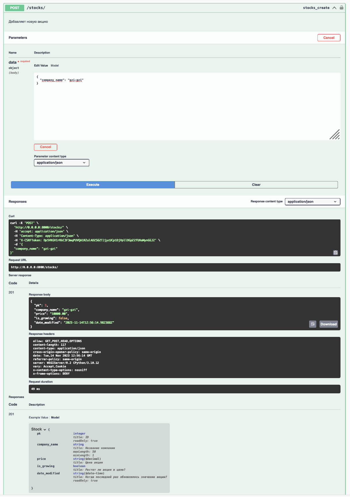
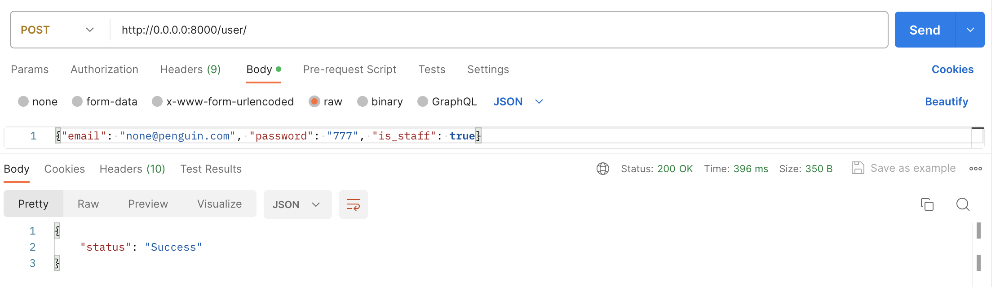
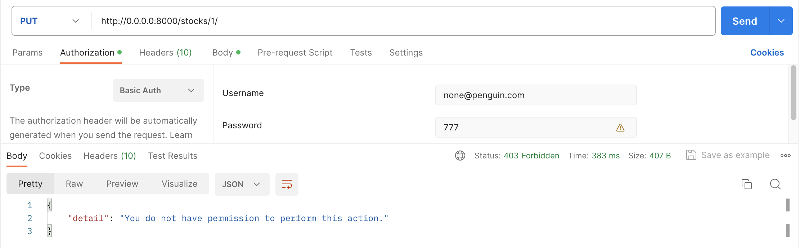
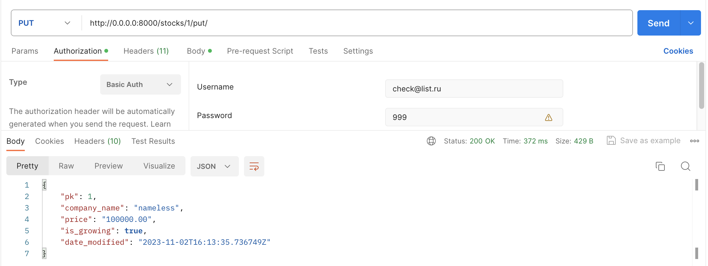
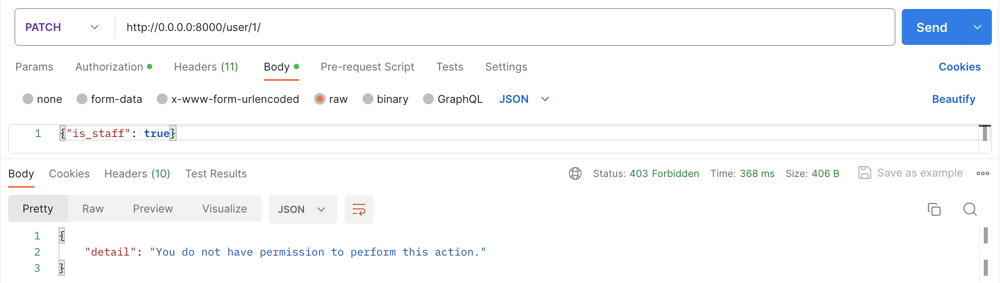

# Методические указания по выполнению лабораторной работы №5

## Задачи:

- добавить Swagger
- реализовать сущность пользователя;
- предоставить возможность пользователем создавать и использовать учетные записи;
- связать пользователей с уже имеющимися бизнес-сущностями(фактами).


## Добавление Swagger

Swagger — это набор инструментов, который позволяет автоматически описывать API на основе его кода. На основе кода или набора правил Swagger автоматически генерирует документацию в формате JSON-файла. Ее можно встроить на страницу сайта или в приложение, чтобы пользователи могли интерактивно знакомиться с документацией, можно отправлять клиентам — сгенерировать такое описание намного быстрее, чем написать с нуля.


Подключение swagger к Django Rest Framework выполнить просто. Для начала необходимо скачать зависимость:

`pip install -U drf-yasg`

Далее в файле *settings.py* подлючаем:

```python
INSTALLED_APPS = [
   ...
   'django.contrib.staticfiles',  #Необходим для  swagger ui's css/js файлов (По умолчанию включен)
   'drf_yasg',
   ...
]
```

Затем в файле *urls.py*:

```python
from rest_framework import permissions
from django.urls import path, include
from drf_yasg.views import get_schema_view
from drf_yasg import openapi

...

schema_view = get_schema_view(
   openapi.Info(
      title="Snippets API",
      default_version='v1',
      description="Test description",
      terms_of_service="https://www.google.com/policies/terms/",
      contact=openapi.Contact(email="contact@snippets.local"),
      license=openapi.License(name="BSD License"),
   ),
   public=True,
   permission_classes=(permissions.AllowAny,),
)

urlpatterns = [
    ...
    path('swagger/', schema_view.with_ui('swagger', cache_timeout=0), name='schema-swagger-ui'),
   ...
]
```
Добавим в view.py декораторы swagger_auto_schema для методов 'post' и 'put' и укажем структуру запроса. Также можно задать структуру ответа в поле responses.

```python
from drf_yasg.utils import swagger_auto_schema

class StockList(APIView):

    @swagger_auto_schema(request_body=StockSerializer)
    def post(self, request, format=None):
	...

class StockDetail(APIView):
    @swagger_auto_schema(request_body=StockSerializer)
    def put(self, request, pk, format=None):
	...

@swagger_auto_schema(method='put', request_body=StockSerializer)
@api_view(['Put'])
def put_detail(request, pk, format=None):
    ...

```

Также добавим в serializer.py метод get_field, чтобы было возможно передавать только часть полей в запросах. В models.py можете обозначить также default значения для необязательных полей.

```python
from collections import OrderedDict

class StockSerializer(serializers.ModelSerializer):
    class Meta:
        # Модель, которую мы сериализуем
        model = Stock
        # Поля, которые мы сериализуем
        fields = ["pk", "company_name", "price", "is_growing", "date_modified"]

        def get_fields(self):
            new_fields = OrderedDict()
            for name, field in super().get_fields().items():
                field.required = False
                new_fields[name] = field
            return new_fields 
```

Запускаем приложение и переходим по адресу: *http://127.0.0.1/swagger/* и видим:


Далее при добавлении новый обработчиков, `drf_yasg` будет автоматически добавлять их в swagger. Также сгенерируется файл в формате json из которого мы сможем при надобности сгенерировать типы данных на фронтенде. Этот файл доступен по ссылке http://127.0.0.1:8000/swagger/?format=openapi

Попробуем выполнить запрос через swagger:



## Сущность пользователя

Мы уже знаем как создавать и внедрять новые сущности в наше приложение. Например, мы делали это в [третьей лабораторной](../lab3-py/lab3_tutorial.md)
в пункте написания моделей.

Концептуально сущность пользователя должна содержать его личные данные, такие данные:

- номер телефона
- почта
- имя
- никнейм
- и тд...

AbstractBaseUser имеет только функцию аутентификации, у него нет фактических полей, вы предоставите поля для использования при создании подкласса. Вы также должны указать, какое поле будет представлять имя пользователя, обязательные поля и способы управления этими пользователями.

Добавим класс CustomUser в models.py. Заменять username на email, как это сделано в примере, необязательно (в таком случае вам не нужен будет NewUserManager и поле USERNAME_FIELD). С помощью UserManager мы переопределяем метод  create_user, чтобы поле username было необязательно. 

- `is_staff` - показывает, является ли пользователь менеджером;
- `is_superuser` - показывает, является ли пользователь админом.

(Эти поля будут нужны нам в части с permissions)

```python
class NewUserManager(UserManager):
    def create_user(self,email,password=None, **extra_fields):
        if not email:
            raise ValueError('User must have an email address')
        
        email = self.normalize_email(email) 
        user = self.model(email=email, **extra_fields) 
        user.set_password(password)
        user.save(using=self.db)
        return user

class CustomUser(AbstractBaseUser, PermissionsMixin):
    email = models.EmailField(("email адрес"), unique=True)
    password = models.CharField(max_length=50, verbose_name="Пароль")    
    is_staff = models.BooleanField(default=False, verbose_name="Является ли пользователь менеджером?")
    is_superuser = models.BooleanField(default=False, verbose_name="Является ли пользователь админом?")

    USERNAME_FIELD = 'email'

    objects =  NewUserManager()
```
Также сразу создадим класс для сериализации CustomUser. В serializers.py:

```python
from stocks.models import CustomUser
...
class UserSerializer(serializers.ModelSerializer):
    is_staff = serializers.BooleanField(default=False, required=False)
    is_superuser = serializers.BooleanField(default=False, required=False)
    class Meta:
        model = CustomUser
        fields = ['email', 'password', 'is_staff', 'is_superuser']
..
```

Не забудьте создать и применить миграции:
```
python manage.py makemigrations
python manage.py migrate
```

(если возникнут проблемы с переопределением CustomUser, удалите файлы из директории с миграциями и бд, а потом запустите создание миграций заново)

## Авторизация и регистрация

Представим ситуацию, мы создаем профиль в какой-либо социальной сети, авторизуемся. Теперь, когда бы мы не перешли во вкладку
с этой социальной сетью, мы всегда (точнее в течении какого-то длительного времени) будем авторизованы. Это достигается при помощи
механизма браузера, называемого cookie.

Куки – это небольшие строки данных, которые хранятся непосредственно в браузере. Они являются частью HTTP-протокола.
Куки обычно устанавливаются веб-сервером при помощи заголовка Set-Cookie. Затем браузер будет автоматически добавлять 
их в (почти) каждый запрос на тот же домен при помощи заголовка Cookie.

Один из наиболее частых случаев использования куки – это аутентификация:

При авторизации на сайте сервер отсылает в ответ HTTP-заголовок Set-Cookie для того, чтобы сохранить куки в браузере 
со специальным уникальным идентификатором сессии («session identifier»). Это идентификатор будет являться ключом уникальным сессии пользователя.

Во время любого следующего запроса к этому же серверу за какими-либо данными браузер посылает на сервер HTTP-заголовок Cookie, 
в которым в формате `<ключ>=<значение>`.
Таким образом, сервер понимает, кто сделал запрос.

Подробнее можно почитать вот здесь: [статья](https://developer.mozilla.org/ru/docs/Web/HTTP/Cookies)

Теперь на данном этапе необходимо на клиентской части создать формы авторизации и регистрации. 
Теперь нам необходимо создать следующие обработчики на серверной части:

- `POST /login` - обработчик для авторизации, принимает логин/телефон/почту и пароль;
- `POST /logout` - обработчик для "выхода из профиля", сбрасывает cookie.  
- `POST /user` - обработчик для регистрации, принимает в себя все заполненные личные данные и создает пользователя.

Для создания новых пользователей (то есть регистрации) создадим представление UserViewSet. Раньше мы уже создавали View-классы с помощью наследования от класса APIView. Класс ModelViewSet наследуется от GenericAPIView, и в нём по умолчанию реализованы стандартные методы для просмотра, добавления и удаления элементов списка объектов, который задаётся  в параметре queryset. Действия, предоставляемые классом ModelViewSet, — это .list(), .retrive(), .create(), .update(), .partial_update() и .destroy(). 
Достаточно задать параметры queryset и serializer_class, чтобы все нужные методы работали, однако мы всё же покажем реализацию create (то есть post) для наглядности.

```python
class UserViewSet(viewsets.ModelViewSet):
    """Класс, описывающий методы работы с пользователями
    Осуществляет связь с таблицей пользователей в базе данных
    """
    queryset = CustomUser.objects.all()
    serializer_class = UserSerializer
    model_class = CustomUser

    def create(self, request):
        """
        Функция регистрации новых пользователей
        Если пользователя c указанным в request email ещё нет, в БД будет добавлен новый пользователь.
        """
        if self.model_class.objects.filter(email=request.data['email']).exists():
            return Response({'status': 'Exist'}, status=400)
        serializer = self.serializer_class(data=request.data)
        if serializer.is_valid():
            print(serializer.data)
            self.model_class.objects.create_user(email=serializer.data['email'],
                                     password=serializer.data['password'],
                                     is_superuser=serializer.data['is_superuser'],
                                     is_staff=serializer.data['is_staff'])
            return Response({'status': 'Success'}, status=200)
        return Response({'status': 'Error', 'error': serializer.errors}, status=status.HTTP_400_BAD_REQUEST)
```
В urls.py также нужно добавить:

```python
from rest_framework import routers
...
router.register(r'user', views.UserViewSet, basename='user')
...
urlpatterns = [
...
]
```

Опишем организацию аутентификации в Django REST Framework. Благо, в DRF есть встроенный механизм аутентификации пользователей.

Аутентификация — это механизм связывания входящего запроса с набором идентифицирующих учетных данных, таких как пользователь, от которого поступил запрос, или токен, которым он был подписан.

В settings.py рядом с `INSTALLED_APPS` положим данный конфиг:

```python
REST_FRAMEWORK = {
    'DEFAULT_AUTHENTICATION_CLASSES': [
        'rest_framework.authentication.BasicAuthentication',
        'rest_framework.authentication.SessionAuthentication',
    ]
}
```

Здесь мы подключаем библиотеки встроенной в DRF аутентификации. 

Basic Authentication определяет пользователя по имени и пароля. Базовая аутентификация обычно подходит только для тестирования. В случае успешной аутентификации BasicAuthentication для каждого запроса request.user будет экземпляром пользователя Django. 

SessionAuthentication подходит для клиентов AJAX, которые работают в том же контексте сеанса, что и ваш веб-сайт.

Далее создадим view для авторизации пользователей (доступ к этому методу должны иметь пока незарегистрированные пользователи, так что укажем  в декораторах разрешение AllowAny. Про permission подробнее будет далее).
При использовании класса с username замените все "email" на "username".

```python
from django.contrib.auth import authenticate, login, logout
from django.http import HttpResponse
from rest_framework.permissions import AllowAny
from django.views.decorators.csrf import csrf_exempt

@permission_classes([AllowAny])
@authentication_classes([])
@csrf_exempt
@swagger_auto_schema(method='post', request_body=UserSerializer)
@api_view(['Post'])
def login_view(request):
    email = request.POST["email"] # допустим передали username и password
    password = request.POST["password"]
    user = authenticate(request, email=email, password=password)
    if user is not None:
        login(request, user)
        return HttpResponse("{'status': 'ok'}")
    else:
        return HttpResponse("{'status': 'error', 'error': 'login failed'}")

def logout_view(request):
    logout(request._request)
    return Response({'status': 'Success'})
```
Добавим в urls.py

```python
from stocks import views
from django.urls import include, path

urlpatterns = [
...
    path('api-auth/', include('rest_framework.urls', namespace='rest_framework')),
    path('login',  views.login_view, name='login'),
    path('logout', views.logout_view, name='logout'),
...
]
```
api-auth добавлять необязательно. Это шаблон, включающий представления login и logout для использования в браузере при *тестировании*.Теперь, если вы откроете браузер и обновите страницу с api, вы увидите ссылку «Войти» в правом верхнем углу страницы.  

Далее для того, чтобы ограничить неавторизованным пользователем доступ к контенту, добавим в view-классы методы, а в view-функции декораторы `authentication_classes` и `permission_classes`, например:

```python
from rest_framework.authentication import SessionAuthentication, BasicAuthentication
from rest_framework.decorators import authentication_classes

@authentication_classes([])
def login_view(request):
    ...

class UserViewSet(viewsets.ModelViewSet):
    authentication_classes = [SessionAuthentication, BasicAuthentication]
    ...

class StockList(APIView):
    authentication_classes = [SessionAuthentication, BasicAuthentication]
    ...

class StockDetail(APIView):
    authentication_classes = [SessionAuthentication, BasicAuthentication]
    ...

```

Если честно, задавать сейчас вручную [SessionAuthentication, BasicAuthentication] необязательно, ведь именно такой набор классов аутентификации мы установили по умолчанию в settings.py

## Настройка ограничений на вызов методов веб-сервиса для разных ролей пользователей

Аутентификация сама по себе не разрешает или запрещает входящий запрос, она просто идентифицирует учетные данные, с которыми был сделан запрос. Для ограничения доступа незарегистрированным пользователям или разным типам зарегистрированных нужно использовать permissions.

Подробно можно прочитать вот [здесь.](https://django.fun/ru/docs/django-rest-framework/3.12/api-guide/permissions/)

Разрешения используются для предоставления или запрета доступа различных классов пользователей к различным частям API. По умолчанию существуют следующие ограничения:
- IsAuthenticated
Класс разрешений IsAuthenticated откажет в разрешении любому неаутентифицированному пользователю и разрешит разрешение в противном случае.
Это разрешение подходит, если вы хотите, чтобы ваш API был доступен только зарегистрированным пользователям.
- IsAuthenticatedOrReadOnly
IsAuthenticatedOrReadOnly позволит прошедшим проверку подлинности пользователям выполнять любой запрос. Запросы неавторизованных пользователей будут разрешены только в том случае, если метод запроса является одним из «безопасных» методов; GET, HEAD или ОПЦИИ.
Это разрешение подходит, если вы хотите, чтобы ваш API предоставлял разрешения на чтение анонимным пользователям и разрешал разрешения на запись только аутентифицированным пользователям.
- AllowAny
Класс разрешений AllowAny разрешит неограниченный доступ независимо от того, был ли запрос аутентифицирован или не аутентифицирован.
Это разрешение не является строго обязательным, поскольку вы можете добиться того же результата, используя пустой список или кортеж для настройки разрешений, но вам может оказаться полезным указать этот класс, поскольку он делает намерение явным.
- IsAdminUser
Класс разрешений IsAdminUser откажет в разрешении любому пользователю, если только user.is_staff не имеет значения True, и в этом случае разрешение будет разрешено.
Это разрешение подходит, если вы хотите, чтобы ваш API был доступен только ограниченному кругу доверенных администраторов.

Политика разрешений по умолчанию может быть установлена с помощью параметра `DEFAULT_PERMISSION_CLASSES`. Например, мы хотим дать аутентифицированным пользователям возможность выполнять любые запросы, а анонимным - только запросы на чтение. Тогда в файле `settings.py` нашего проекта нужно указать:
```python
REST_FRAMEWORK = {
    'DEFAULT_PERMISSION_CLASSES': [
        'rest_framework.permissions.IsAuthenticatedOrReadOnly',
    ]
}
```
Разрешения в REST-фреймворке всегда определяются как список классов-ограничений в методе view-класса permission_classes или в декораторе view-функции @permission_classes. Ограничения можно комбинировать с помощью логических функций (по умолчанию AND).

```python
from rest_framework.permissions import IsAuthenticated, AllowAny
from rest_framework.decorators import permission_classes

@permission_classes([AllowAny])
def login_view(request):
   ...

class StockList(APIView):
   permission_classes = [IsAuthenticatedOrReadOnly]
   ...

class StockDetail(APIView):
   permission_classes = [IsAuthenticatedOrReadOnly]
   ...
```
IsAuthenticatedOrReadOnly указано по умолчанию в settings.py, так что снова приводить это в атрибутах классов Stock было необязательно. 

Перечисленных способов недостаточно для нашего проекта. Аутентифицированные пользователи у нас делятся на клиента, менеджера и администратора. Клиент должен иметь доступ только к части запросов. Например, он может выполнить запрос на запись при добавлении нового бронирования, но не может добавить новую услугу. Поэтому нам необходимо реализовать пользовательские разрешения.

Наша модель пользователя `User` содержит, помимо прочих, следующие логические поля:
- `is_staff` - показывает, является ли пользователь менеджером;
- `is_superuser` - показывает, является ли пользователь админом.

Создадим файл `permissions.py`:
```python
from rest_framework import permissions

class IsManager(permissions.BasePermission):
    def has_permission(self, request, view):
        return bool(request.user and (request.user.is_staff or request.user.is_superuser))

class IsAdmin(permissions.BasePermission):
    def has_permission(self, request, view):
        return bool(request.user and request.user.is_superuser)
```

Здесь мы переопределили класс `BasePermission` и реализовали метод `has_permission`, который возвращает `True`, если пользователь `request.user` имеет право выполнить запрос `request`, и `False` в противном случае. В классе `IsManager` этот метод проверяет, является ли пользователь менеджером (или администратором, т.к. ему тоже доступны полномочия менеджера). В классе `IsAdmin` метод проверяет, является ли пользователь администратором.

Можно использовать пользовательские ограничения точно так же, как и стандартные: указать список ограничений в методе класса permission_classes или в декораторе функции @permission_classes. Установим ограничение IsAdmin для дополнительного метода put.

Альтернативой определению фиксированного списка permission_classes = (IsAuthenticated, ) для ViewSet является переопределение get_permissions() и назначение разных разрешений для разных методов HTTP, как описано здесь.
Для класса UserViewSet сделаем так, чтобы метод `create` был доступен всем пользователям, метод `list` доступен менеджеру и администратору, а метод `destroy` - только администратору.

```python
class UserViewSet(viewsets.ModelViewSet):
    """Класс, описывающий методы работы с пользователями
    Осуществляет связь с таблицей пользователей в базе данных
    """
    queryset = CustomUser.objects.all()
    serializer_class = UserSerializer

    def get_permissions(self):
        if self.action in ['create']:
            permission_classes = [AllowAny]
        elif self.action in ['list']:
            permission_classes = [IsAdmin | IsManager]
        else:
            permission_classes = [IsAdmin]
        return [permission() for permission in permission_classes]

def method_permission_classes(classes):
    def decorator(func):
        def decorated_func(self, *args, **kwargs):
            self.permission_classes = classes        
            self.check_permissions(self.request)
            return func(self, *args, **kwargs)
        return decorated_func
    return decorator

class StockList(APIView):
    authentication_classes = [SessionAuthentication, BasicAuthentication]
    permission_classes = [IsAuthenticatedOrReadOnly]

    def get(self, request, format=None):
	...

    @swagger_auto_schema(request_body=StockSerializer)
    def post(self, request, format=None):
	...

class StockDetail(APIView):
    authentication_classes = [SessionAuthentication, BasicAuthentication]
    permission_classes = [IsAuthenticatedOrReadOnly]

    def get(self, request, pk, format=None):
        ...

    @swagger_auto_schema(request_body=StockSerializer)
    @method_permission_classes((IsAdmin,))
    def put(self, request, pk, format=None):
        ...

    @method_permission_classes((IsAdmin,))
    def put(self, request, pk, format=None):
        ...

@swagger_auto_schema(method='put', request_body=StockSerializer)
@api_view(['Put'])
@permission_classes([AllowAny])
@authentication_classes([])
def put_detail(request, pk, format=None):
    ...

```
Таким образом, мы разделили методы на группы на основании того, какое разрешение нужно проверять при попытке вызова этих методов. Если аутентифицированный пользователь попытается выполнить запрос, который ему не разрешено выполнять, он получит ответ ` 403 Permission Denied`.

Проверим работу ограничений. Для начала создадим трёх пользователей: обычного, менеджера и администратора.
```
{"email": "nameless@dao.ru", "password": "000"}
{"email": "none@penguin.com", "password": "777", "is_staff": true}
{"email": "check@list.ru", "password": "999", "is_superuser": true}
```



Будем использовать Authorization в Postman, чтобы делать запросы от имени разных пользователей. Для put-методов в StockDetail установлено ограничение IsAdmin, так что пользователю none@penguin.com не удаётся его использовать, а вот у пользователя check@list.ru не возникает никаких проблем. 






Список пользователей ('list' в UserViewSet) могут просматривать менеджеры и администраторы.


Для использования всех остальных методов, кроме 'list' и 'create', нужно быть администратором. Так что check@list.ru успешно меняет статус одного из пользователей, а вот всем остальным для этого недостаточно прав.





## Использование авторизации Django на фронтенде

К запросам из фронтенда должны прилагаться cookie с данными о текущей сессии, чтобы в ответ бэкенд отправлял ответы, как прежде, а не запреты со статусом 403 Forbidden. Для этого при использовании async в запрос достаточно добавить credentials: 'include', и cookie будут включаться в запрос.

С fetch это выглядит так (требуется дополнительно добавить в запросы работу с `CSRFToken`):

```js
const options = {
   method: 'PATCH',
   credentials: 'include',
   headers: {
       'Content-Type': 'application/json',
       "X-CSRFToken": document.cookie
           .split('; ')
           .filter(row => row.startsWith('csrftoken='))
           .map(c => c.split('=')[1])[0]
   },
       body: JSON.stringify({
           order_statusid: 8,
            order_date: new Date().toISOString()
       })
};
fetch(`http://${api_socket}/orders/${user_cart[user_cart.length - 1].order_id}/`, options)
   .then(response => response.json())
   .then(response => console.log(response))
   .catch(err => console.error(err));
```

Среди заголовков запроса появляется Cookie, а в них - sessionid и csrftoken.


## СУБД для хранения сессий

Выше мы использовали встроенные механизмы аутентификации в Django. Но для достаточно нагруженных приложений, это не всегда может быть выгодно по производительности,
так как под капотом у Django для хранения сессий используется подключенная нами ранее MySQL.

Хранить сессий выгодно в in-memory хранилищах, таких как:

- Redis
- Memcache
- Tarantool

Давайте возьмем одну из них и попробуем воссоздать руками хранение и проверку сессий. Для этого будем использовать Redis.


### Установка Redis

Установим в Docker-контейнере с Ubuntu Redis. Для этого выполним действия:

```shell
sudo apt install lsb-release curl gpg

curl -fsSL https://packages.redis.io/gpg | sudo gpg --dearmor -o /usr/share/keyrings/redis-archive-keyring.gpg

echo "deb [signed-by=/usr/share/keyrings/redis-archive-keyring.gpg] https://packages.redis.io/deb $(lsb_release -cs) main" | sudo tee /etc/apt/sources.list.d/redis.list

sudo apt-get update
sudo apt-get install redis
```

Чтобы запустить демон Redis, пишем:
```shell
sudo service redis-server start
```

И наконец запускаем:
```shell
redis-cli 
127.0.0.1:6379> ping
PONG
```

6379 - это порт на котором автоматически запускается Redis. 

В одном терминале будет крутиться Redis, а в другом - наш бэкенд на Django.

### Использование Redis с Python

Чтобы установить библиотеку для работы с Redis пропишем:

```shell
pip3 install redis
```

Далее рассмотрим пример кода, в котором она используется:

```python
import redis

# создаем инстанс и указываем координаты БД на локальной машине
r = redis.Redis(
    host= '0.0.0.0',
    port= '6379')

r.set('somekey', '1000-7') # сохраняем ключ 'somekey' с значением '1000-7!'
value = r.get('somekey') # получаем значение по ключу
print(value)
```

### Интеграция Redis с Django

Для начала нам нужно канонично встроить подключение к БД через Django. Для этого зайдем в файл `settings.py` и пропишем туда координаты запущенной БД:

```python
REDIS_HOST = '0.0.0.0'
REDIS_PORT = 6379
```

Далее создадим библиотечный инстанс нашего хранилища сессий в файле `views.py`:

```python
from django.conf import settings
import redis

# Connect to our Redis instance
session_storage = redis.StrictRedis(host=settings.REDIS_HOST, port=settings.REDIS_PORT)
```

Теперь внутри наших обработчиков мы можем использовать `session_storage` для того, чтобы понять, можно ли данному юзер просматривать контент.
Для этого при авторизации пользователя, мы должно сгенерировать случайное значение (можно использовать uuid_v4), и сохранить запись, 
где ключом будет случайно сгенерированная строка, а значением будет первичный ключ сущности пользователя (в нашем примере это username, т.к. он уникальный). 

Итоговый обработчик `login_view` преватится во что-то такое:

```python
from django.contrib.auth import authenticate, login
from django.http import HttpResponse
import uuid

@permission_classes([AllowAny])
@authentication_classes([])
def login_view(request):
    username = request.POST["email"] 
    password = request.POST["password"]
    user = authenticate(request, email=username, password=password)
    if user is not None:
        random_key = uuid.uuid4()
        session_storage.set(random_key, username)

        response = HttpResponse("{'status': 'ok'}")
        response.set_cookie("session_id", random_key)

        return response
    else:
        return HttpResponse("{'status': 'error', 'error': 'login failed'}")
```

## Ограничение прав на приложение для гостей

Соответственно в методах, в которых нужно проверить, имеет ли пользователя доступ к запрашиваемой информации, мы должны:

- взять из запроса куки (через `ssid = request.COOKIES["session_id"]`)
- посмотреть есть ли в хранилище сессий такая запись, и достать идентификатор пользователя (`session_storage.get(ssid)`)
- проверить, можно ли данному пользователю смотреть запрошенную информацию (зависит от бизнес-логики вашего проекта)

Предлагаем вам такую проверку написать в коде самостоятельно.

Для продвинутых студентов предлагается логику проверки доступности контента вынести в middleware.

