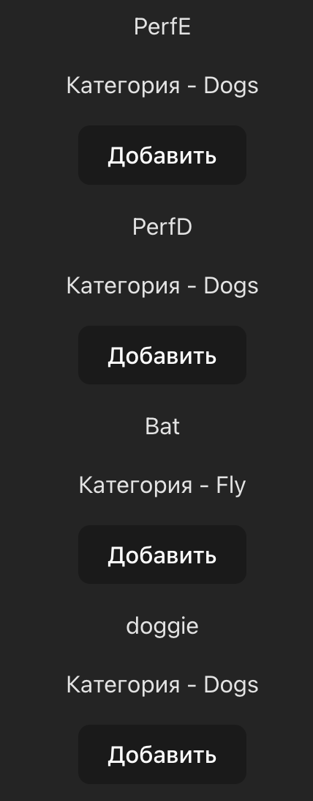

# Методические указания по выполнению лабораторной работы №6

**Цель лабораторной работы** - знакомство с axios, swagger. Работа с менеджером состояний.

## Введение

### Axios

Axios - это фронтовая библиотека, которая позволяет выполнять HTTP запросы. Ее удобство заключается в расширяемости и простоте. Подробнее про эту билиотеку можно почитать в [документации]axios].

#### Примеры

* HTTP GET запрос на fetch

```ts
fetch('http://localhost/api/user', { method: 'GET' })
```

* HTTP GET запрос на axios

```ts
axios.get('http://localhost/api/user')
```

* HTTP POST запрос на fetch

```ts
fetch('http://localhost/api/user', {
  method: 'POST',
  body: JSON.stringify({
    firstName: 'Ivan',
    lastName: 'Kopeikin',
  })
})
```

* HTTP POST запрос на axios

```ts
axios.post('http://localhost/api/user', {
  firstName: 'Ivan',
  lastName: 'Kopeikin',
})
```

Как можно видеть билиотека axios очень простая в использовании и решает за нас базовые вопросы.

### Swagger

Swagger или OpenAPI - это спецификация, которая позволяет нашему бекенду описывать запросы. При взаимодействии между фронтендом и бекендом нам нужно как-то хранить контракт на основе которого мы будем работать. Swagger решает эту проблему позволяя легко и просто описать этот контракт. Как правильно описывать контракт прописано в [спецификации OpenAPI](openapi-spec). Примеры описания контракта в Swagger можно посмотреть [тут][habr-openapi].

### Стейт менеджеры

Стейт менеджер – инструмент, который используется в разработке программного обеспечения для управления состоянием приложения. В основе работы стейт менеджера лежит концепция хранения и изменения данных (состояния) приложения. В нашем случае мы будем использовать библиотеку [Redux][redux] и ее дополнение [Redux Toolkit][redux-toolkit]. Подробнее про эти библиотеки можно почитать [тут][habr-redux] и [тут][habr-redux-toolkit].

## Кодогенерация api

Как мы уже знаем при взаимодействии фронтенда и бекенда мы делаем запросы используя какой-то контракт. Для описания контракта можно использовать Swagger/OpenAPI.

Для того, чтобы после каждого изменения контракта на стороне бекенда нам не приходилось вручную вносить изменения в фронтенде придумали кодогенерацию.

### Добавление кодогенерации

Для примера возьмем [зоомагазин][swagger-petstore-spec]. Для него сгенерируем код на основе OpenAPI контракта:

1) Скачаем контракт из [примера][swagger-petstore-spec], положим его в `swagger/petstore.yml`

2) Установим библиотеку для генерации api, мы будем использовать [swagger-typescript-api][npm-swagger-typescript-api]

```shell
npm i swagger-typescript-api -D`
```

3) Подготовим код для генерации, положим его в `scripts/generate-api.mjs`

```ts
import { resolve } from 'path';

import { generateApi } from 'swagger-typescript-api';

generateApi({
    name: 'Api.ts',
    output: resolve(process.cwd(), './src/api'),
    input: resolve(process.cwd(), './swagger/petstore.yml'),
    httpClientType: 'axios',
});
```

4) Добавим в `package.json` команду для запуска кодогенерации

```json
{
    "scripts": {
        "generate-api": "node scripts/generate-api.mjs"
    }
}
```

5) Запускаем генерацию через команду `npm run generate-api`

После запуска генерации у нас появится файл `src/api/Api.ts` в котором будет сгенерированный код для работы с бекендом.

### Использование кодогенерации

У нас уже есть полностью сгенерированное Api бекенда, нужно только начать его использовать.

Для того, чтобы начать использовать наше Api нам нужно создать инстанс класса Api:

1) Создаем файл `src/api/index.ts`

```ts
import { Api } from './Api';

export const api = new Api({
    baseURL: 'https://petstore3.swagger.io/api/v3',
});
```

2) Используем Api у себя в компонентах

```tsx
import { api } from './api'

export const Test = () => {
    const handleClick = async () => {
        const { data } = await api.pet.findPetsByStatus({
            status: 'available',
        })

        console.log(data)
    }
    
    return (
        <button onClick={handleClick}>Кнопочка</button>
    )
}
```

Если вы запустите этот код, то увидите в консоле список животных. Таким образом мы смогли использовать у себя сгенерированное Api.

Основной плюс заключается в том, что Api полностью типизировано. Вы не сможете передать параметры, которые ваш бекенд не ожидает. Так же важным плюсом является, что при изменении Api на бекенде вам нужно будет просто заново запустить команду кодогенерации и все будет готово.

### Кодогенерация Django

Для кодогенерации Django надо немного изменить наш скрипт. Добавим получение OpenAPI спецификации по урлу.

```ts
import { resolve } from 'path';

import { generateApi } from 'swagger-typescript-api';

generateApi({
    name: 'Api.ts',
    output: resolve(process.cwd(), './src/api'),
    url: 'http://127.0.0.1:8000/swagger/?format=openapi',
    httpClientType: 'axios',
});
```

Наш новый скрипт будет ожидать OpenAPI спецификацию на localhost на 8000 порту по урлу `/swagger`.

## Менеджеры состояний

Добавим в нашу библиотеку Redux Toolkit и напишем стор. Для этого установим необходимые библиотеки `npm i react-redux @reduxjs/toolkit`.

### Создание тестового стора

Создадим небольшой проект, чтобы разобраться Redux. Структура проекта:

TODO: добавить

#### Создадим slice и selectors

Начнем погружаться в Toolkit со слайсов. Сразу с главного. Что бы мы ни делали внутри слайсов, в конце концов они генерируют обычные редьюсеры и действия, которые затем передаются в Redux. То есть слайсы не добавляют никаких новых возможностей в сам Redux. Они автоматизируют рутину, сокращают количество кода и предоставляют более удобные "ручки" для управления действиями и состоянием.

Для создания слайса нам нужно как минимум три компонента: имя, начальное состояние, набор редьюсеров. В директории стора создадим файл `store/data/slice.ts` и `store/data/selectors.ts`

```ts
import { createSlice } from "@reduxjs/toolkit"

const dataSlice = createSlice({
    name: "data",
    // в initialState мы указываем начальное состояние нашего глобального хранилища
    initialState: {
        data: []
    },
    // Редьюсеры в слайсах мутируют состояние и ничего не возвращают наружу
    reducers: {
        setData(state, {payload}) {
            state.data = payload
        }
    }
})

export const { actions: dataActions, reducer: dataReducer } = dataSlice
```

```ts
import { useSelector } from "react-redux";
import { RootState } from "../types";

export const useData = () => useSelector((state: RootState) => state.data.data)
```

Дополнительно создадим файл `store/index.ts`, чтобы экспортировать наш стор.

```ts
export { dataActions, dataReducer } from './slice'
export { useData } from './selectors'
```

Мы тут видим `dataSlice` - имя, `initialState` - начальное состояние и `reducers` - набор редьюсеров. Под начальным состоянием понимается базовая структура данных и какие-то статические данные, если они есть, например значение 0 для счетчика. А вот те данные, которые нужно выкачать по API, к начальным не относятся. Они заполняются уже потом, через действия (actions).

`Action` — это структуры, которые передают данные из вашего приложения в `store`. Они являются единственными источниками информации для `store`.

Мы можем считывать данные из хранилища с помощью `useSelector()` и отправлять действия с помощью `useDispatch()`

#### Создадим store

Теперь создадим файл `store/store.ts` в директории проекта. Простейшим способом создания и настройки хранилища является передача в `configureStore()` корневого reducer в качестве аргумента reducer, с вызовом `combineReducers()`

```ts
import { configureStore, combineReducers } from '@reduxjs/toolkit';
import { dataReducers } from "./data/slice";

export const store = configureStore({
    reducer: combineReducers({
        data: dataReducers,
    }),
});
```

Дополнительно создадим файл `store/index.ts`, чтобы экспортировать наш стор.

```ts
export { store } from './store'
```

#### Добавляем типы и хуки

Для работы со стором добавим дополнительные типы в файл `store/types.ts`

```ts
import type { store } from './store'

export type RootState = ReturnType<typeof store.getState>;
export type AppDispatch = typeof store.dispatch;
```

Тип `RootState` - это информация о всех слайсах в сторе. Тип `AppDispatch` - это типизация вызова функции `useDispatch`

Добавим типизированные хуки для работы со стором в `store/hooks.ts`

```ts
import { useDispatch } from 'react-redux';

import type { AppDispatch } from './types'

export const useAppDispatch: () => AppDispatch = useDispatch;
```

`useAppDispatch` - это типизированная функция `useDispatch`. Добавим хук в экспорты `store/index.ts`

```ts
export { store } from './store'
export { useAppDispatch } from './hooks'
```

#### Инициализируем store

Закончим с верхнего уровня. Здесь нам понадобится компонент `Provider`, который содержит хранилище и прокидывает его вглубь дерева компонентов через контекст. В файле `index.ts` добавим `Provider`

```tsx
import React from 'react'
import ReactDOM from 'react-dom/client'
import App from './App.tsx'
import './index.css'
import { store } from './store'
import { Provider } from "react-redux";

ReactDOM.createRoot(document.getElementById('root')!).render(
  <React.StrictMode>
    <Provider store={store}>
      <App />
    </Provider>
  </React.StrictMode>,
)
```

Теперь у нас есть глобальное хранилище. Применим его на практике.

### Практическое применение стора без AJAX запроса

Допустим нам нужно создать корзину, с помощью которой мы хотим считать сумму наших покупок. Добавим в начальное состояния `Data` глобального хранилища несколько товаров, и создадим новое начальное состояние `SumShoppingCart` в котором мы будем хранить сумму нашей покупки. (Здесь мы объявили за начальное состояние 0, так как это счетчик). Изменим наш `store/data/slice.ts` и `store/data/selectors.ts`

```ts
import { createSlice } from "@reduxjs/toolkit"

const dataSlice = createSlice({
    name: "data",
    initialState: {
        data: [
            {
                "id": 1,
                "name": "PerfE",
                "category": {
                    "id": 4,
                    "name": "Dogs"
                }
            },
            {
                "id": 2,
                "name": "Tostik",
                "category": {
                    "id": 4,
                    "name": "Dogs"
                }
            },
        ],
        сountCart: 0,
    },
    reducers: {
        setData(state, {payload}) {  // изменяем состояние на полученные данные
            state.data = payload
        },
        addCount(state) {  // добавляем животного
            state.сountCart += 1
        },
        clearCount(state) {  // обнуляем количество животных
            state.сountCart = 0
        }
    }
})

export const { actions: dataActions, reducer: dataReducer } = dataSlice
```

```ts
import { useSelector } from "react-redux";
import { RootState } from "../types";

export const useData = () => useSelector((state: RootState) => state.data.data)
export const useCount = () => useSelector((state: RootState) => state.data.сountCart)
```

Создадим компонент `PetsList.tsx`

```tsx
import {dataActions, useData, useCount} from './store/data'
import {useAppDispatch} from "./store";

export const PetsList = () => {
    const dispatch = useAppDispatch()

    const count = useCount()
    const data = useData()

    return (
        <div>
            <div>Количество животных: {count}</div>
            {
                data.map((good) =>
                    <div key={good.id}>
                        <p>
                            {good.name}
                        </p>
                        <p>
                            Категория - {good.category.name}
                        </p>
                        <button
                            onClick={() => {
                                dispatch(dataActions.addCount())
                            }}
                        >
                            Добавить
                        </button>
                    </div>
                )
            }
            <button 
                onClick={() => {
                    dispatch(dataActions.clearCount())
                }}
            >
                Обнулить
            </button>
        </div>
    )
}
```

И выведем компонент на страницу в `App.tsx`

```tsx
import { PetsList } from './PetsList'
import './App.css'

function App() {

  return (
    <PetsList/>
  )
}

export default App
```

Откроем страницу и увидим следующее. Можно понажимать на кнопки "Добавить" и "Обнулить" и посмотреть, что значение будет меняться.


### Практическое применение стора с AJAX запросом

Задача осталась той же, что и в предыдущем пункте, однако мы будем получать товары с помощью AJAX запроса, а не изначально их хранить в `initialState`. Изменим наш `stora/data/slice.ts`.

В `initialState` изменим начальное состояние, опустошив `data`, так как будем его изменять, беря данные из API.

```ts
initialState: {
    data: [], 
    сountCart: 0,
},
```

Создадим пользовательский хук с AJAX запросом `api/getData.ts`, тут мы будем использовать Api из нашей кодогенерации. Получаем нужные данные с помощью `createAsyncThunk`. Создадим файл `store/data/getPetsByStatus.ts`.

```ts
import { createAsyncThunk } from '@reduxjs/toolkit';

import { api, Pet } from '../../api';

export const getPetsByStatus = createAsyncThunk<Pet[], "available" | "pending" | "sold">('data/findByStatus', async (status) =>
    api.pet.findPetsByStatus({ status }).then(({ data }) => data)
)
```

Теперь добавим вызов этой функции на странице в `PetsList.tsx`.

```tsx
import { useEffect } from 'react';
import {dataActions, useData, useCount, getPetsByStatus} from './store/data'
import {useAppDispatch} from "./store/hooks";

export const PetsList = () => {
    const dispatch = useAppDispatch()

    useEffect(() => {
        dispatch(getPetsByStatus('available'))
    }, [dispatch])

    const count = useCount()
    const data = useData()

    return (
        <div>
            <div>Количество животных: {count}</div>
            {
                data.map((good) =>
                    <div key={good.id}>
                        <p>
                            {good.name}
                        </p>
                        <p>
                            Категория - {good.category?.name}
                        </p>
                        <button
                            onClick={() => {
                                dispatch(dataActions.addCount())
                            }}
                        >
                            Добавить
                        </button>
                    </div>
                )
            }
            <button 
                onClick={() => {
                    dispatch(dataActions.clearCount())
                }}
            >
                Обнулить
            </button>
        </div>
    )
}
```

В конечном итоге получим следующее.



[axios]: https://axios-http.com/ru/
[redux]: https://redux.js.org
[redux-toolkit]: https://redux-toolkit.js.org

[npm-swagger-typescript-api]: https://www.npmjs.com/package/swagger-typescript-api

[openapi-spec]: https://spec.openapis.org/oas/latest.html
[swagger-petstore-spec]: https://github.com/swagger-api/swagger-petstore/blob/master/src/main/resources/openapi.yaml

[habr-openapi]: https://habr.com/ru/articles/776538/
[habr-redux]: https://habr.com/ru/articles/333848/
[habr-redux-toolkit]: https://habr.com/ru/companies/inobitec/articles/481288/