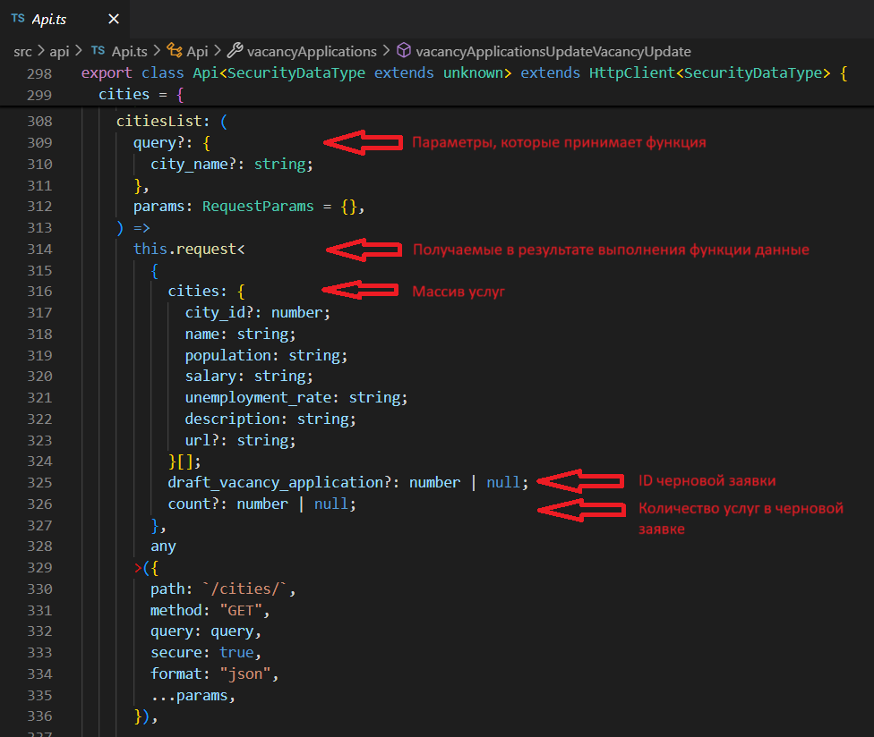
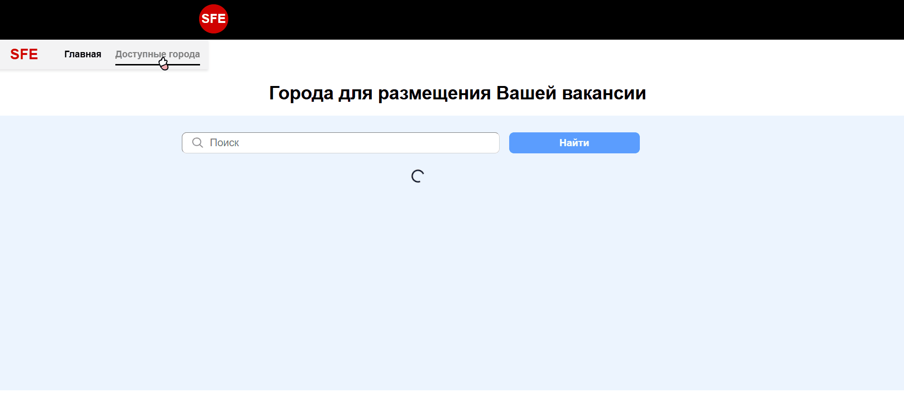
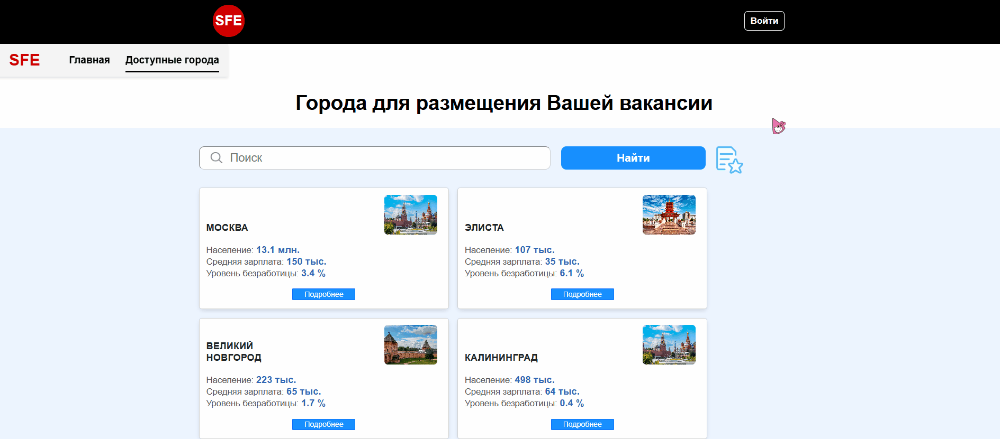
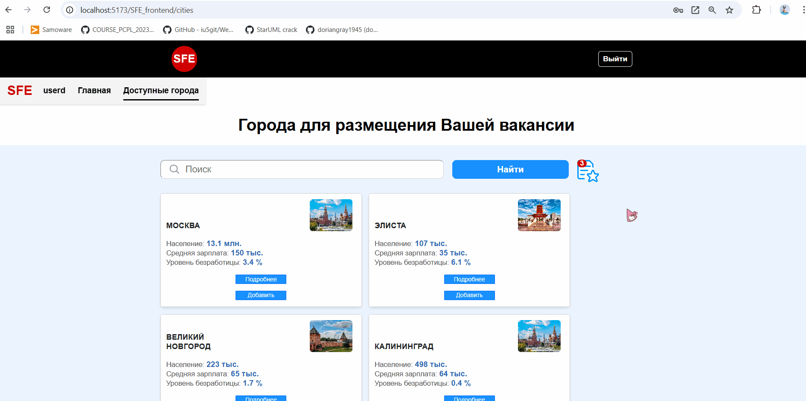
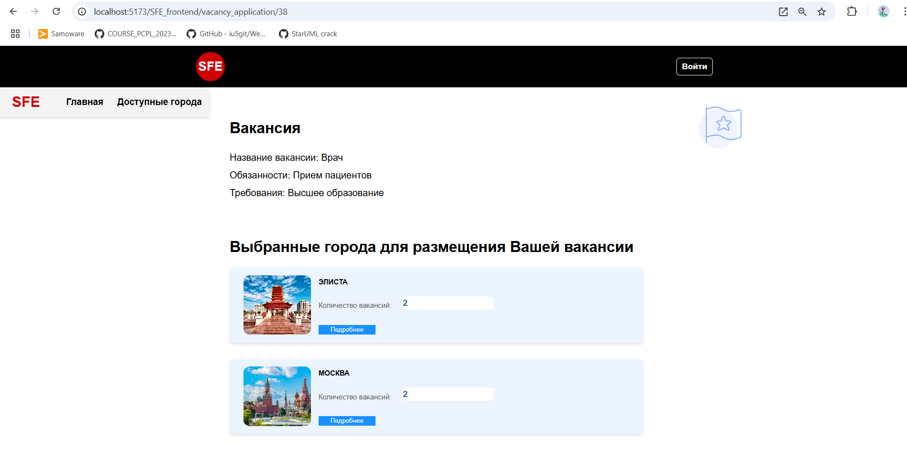
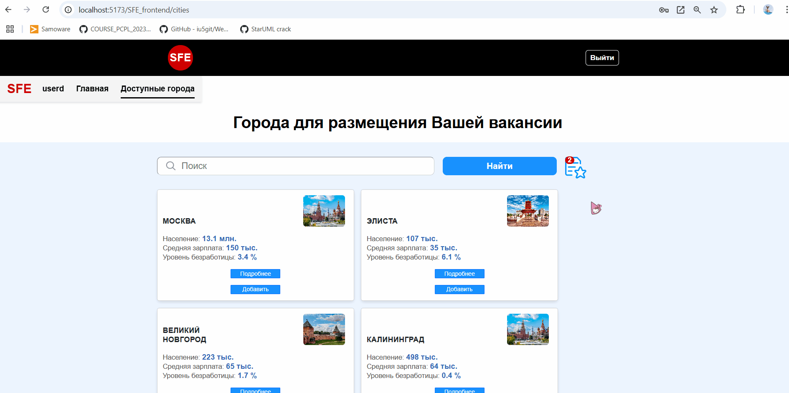

# Методические указания по выполнению лабораторной работы №7

**Цель лабораторной работы** - знакомство с axios, swagger, Redux Thunk middleware, создание страниц заявки, авторизации и страницы со списком услуг с использованием Redux Thunk middleware и кодогенерации.

## Введение

### Axios

Axios - это фронтовая библиотека, которая позволяет выполнять HTTP запросы. Ее удобство заключается в расширяемости и простоте. Подробнее про эту билиотеку можно почитать в [документации](axios).

#### Пример

* HTTP POST запрос на fetch

```ts
fetch('http://localhost/api/user', {
  method: 'POST',
  body: JSON.stringify({
    firstName: 'Ivan',
    lastName: 'Kopeikin',
  })
})
```

* HTTP POST запрос на axios

```ts
axios.post('http://localhost/api/user', {
  firstName: 'Ivan',
  lastName: 'Kopeikin',
})
```

### Swagger

Swagger или OpenAPI - это спецификация, которая позволяет нашему бэкенду описывать запросы. При взаимодействии между фронтендом и бэкендом нам нужно как-то хранить контракт на основе которого мы будем работать. Swagger решает эту проблему позволяя легко и просто описать этот контракт. Как правильно описывать контракт прописано в [спецификации OpenAPI](openapi-spec). Примеры описания контракта в Swagger можно посмотреть [тут](habr-openapi).

### Стейт менеджеры

Стейт менеджер – инструмент, который используется в разработке программного обеспечения для управления состоянием приложения. В основе работы стейт менеджера лежит концепция хранения и изменения данных (состояния) приложения. В нашем случае мы будем использовать библиотеку [Redux](redux) и ее дополнение [Redux Toolkit](redux-toolkit). Подробнее про эти библиотеки можно почитать [тут](habr-redux) и [тут](habr-redux-toolkit).

### Кодогенерация api

Как мы уже знаем при взаимодействии фронтенда и бэкенда мы делаем запросы используя какой-то контракт. Для описания контракта можно использовать Swagger/OpenAPI.

Для того, чтобы после каждого изменения контракта на стороне бэкенда нам не приходилось вручную вносить изменения в фронтенде придумали кодогенерацию.

## Шаг 1. Добавление кодогенерации.

1) Установим библиотеку для генерации api, мы будем использовать [swagger-typescript-api](npm-swagger-typescript-api)

```shell
npm i swagger-typescript-api -D
```

2) Подготовим код для генерации, положим его в `scripts/generate-api.mjs`

```ts
import { resolve } from 'path';

import { generateApi } from 'swagger-typescript-api';

generateApi({
    name: 'Api.ts',
    output: resolve(process.cwd(), './src/api'),
    url: 'http://localhost:8000/swagger/?format=openapi',
    httpClientType: 'axios',
});
```

3) Добавим в `package.json` команду для запуска кодогенерации

```json
{
    "scripts": {
        "generate-api": "node scripts/generate-api.mjs"
    }
}
```

4) Создаем файл `src/api/Api.ts`, в котором будет сгенерированный код для работы с бэкендом.

5) Запускаем генерацию через команду `npm run generate-api`

### Использование кодогенерации

У нас уже есть полностью сгенерированное API бэкенда, нужно только начать его использовать.

Для того, чтобы начать использовать наше API нам нужно создать инстанс класса API:

1) Создаем файл `src/api/index.ts`

```ts
import { Api } from './Api';

export const api = new Api({
    baseURL: 'http://localhost:5173/api',
});
```

2) Используем API (рассмотрим пример использования в компоненте):

Расмотрим ПРИМЕР, где метод api.cities.citiesList обращается к эндпоинту метода GET /cities/citiesList на сервере Swagger. Этот метод был автоматически сгенерирован в файле Api.ts на основе спецификации OpenAPI:

```tsx
import { useState } from "react";
import { Cities } from '../../api/Api';
import { api } from '../../api';

const CitiesPage: FC = () => {
  
  const [cities, setCities] = useState<Cities[]>([]);

  useEffect(() => {
    const handleSearch = async () => {
      const response = await api.cities.citiesList();
        
      setCities(response.data);
    }
  }, []);

  return (
  
  );
};

export default CitiesPage;
```

Сам сгенерированный метод выглядит так:



Основной плюс заключается в том, что API полностью типизировано. Вы не сможете передать параметры, которые ваш бэкенд не ожидает. Также важным плюсом является то, что при изменении API на бэкенде вам нужно будет просто заново запустить команду кодогенерации и все будет готово.

## Шаг 2. Страница со списком услуг с использованием redux-toolkit и кодогенерации.

### Redux Thunk middleware

**Redux Thunk** - это middleware библиотека, которая позволяет вам вызвать action creator, возвращая при этом функцию вместо объекта.

*Подробнее можно ознакомиться по [ссылке](https://github.com/reduxjs/redux-thunk)*

Ранее у нас был метод обращения к API, который вызывался внутри компонента и затем клал полученные данные внутрь Store. Сейчас у нас запрос перенесен внутрь специального middleware, который называется AsyncThunk, теперь мы не выполняем запрос в самом компоненте, а просто делаем dispatch этого action.

### 2.1. Редактирование слайса

Модифицируем слайс для работы с услугами.

У нас уже есть слайс (в данном случае `citiesSlice`) для управления состоянием поиска услуг, в данном случае услуги - это города (cities):

```ts
import { createSlice } from '@reduxjs/toolkit';

const initialState = {
  searchValue: '',
  cities: [],
  loading: false,
};

const citiesSlice = createSlice({
  name: 'cities',
  initialState,
  reducers: {
    setSearchValue(state, action) {
      state.searchValue = action.payload;
    },
  },
});

export const { setSearchValue } = citiesSlice.actions;
export default citiesSlice.reducer;
```

У нас есть API, который возвращает список услуг. Мы создадим функцию `getCitiesList` с AJAX запросом для получения списка услуг из API через функцию [createAsyncThunk](https://redux-toolkit.js.org/api/createAsyncThunk) из Redux Toolkit:

```ts
import { createSlice, createAsyncThunk } from '@reduxjs/toolkit';
import { api } from '../api';

const initialState = {
  searchValue: '',
  cities: [],
  loading: false,
};

export const getCitiesList = createAsyncThunk(
  'cities/getCitiesList',
  async (_, { getState, dispatch, rejectWithValue }) => {
    const { cities }: any = getState();
    try {
      const response = await api.cities.citiesList({city_name: cities.searchValue});

      return response.data;
    } catch (error) {
      return rejectWithValue('Ошибка при загрузке данных');
    }
  }
);

const citiesSlice = createSlice({
  name: 'cities',
  initialState,
  reducers: {
    setSearchValue(state, action) {
      state.searchValue = action.payload;
    },
  },
});

export const { setSearchValue } = citiesSlice.actions;
export default citiesSlice.reducer;
```

* `cities/getCitiesList ` — уникальный тип действия для Redux. Оно используется для идентификации действия в слайсе.

* Функция принимает:
    * Использует метод getState, чтобы получить текущее состояние Redux, включая searchValue из слайса cities. Это значение затем передаётся в запрос к API.
    * Второй параметр `{ rejectWithValue }` предоставляет метод для обработки ошибок.

Функция `createAsyncThunk` обрабатывает жизненные циклы:
* pending: когда запрос начинается.
* fulfilled: если запрос завершился успешно. Данные из return передаются в Redux.
* rejected: если запрос завершился с ошибкой. Сообщение из rejectWithValue передаётся в Redux.

Добавим интерфейс `CitiesState` для определения свойств, которые нам необходимо сохранять (поле поиска `searchValue`, массив услуг `cities`, состояние загрузки `loading`), а также обработаем состояния жизненного цикла, добавив `extraReducers` — это специальное свойство в объекте для описания того, как слайс должен реагировать на действия, созданные вне этого слайса.

```ts
import { createSlice, createAsyncThunk } from '@reduxjs/toolkit';
import { api } from '../api';
import { Cities } from '../api/Api';
import { CITIES_MOCK } from "../modules/mock"; // мок-данные

interface CitiesState {
  searchValue: string;
  cities: Cities[];
  loading: boolean;
}

const initialState: CitiesState = {
  searchValue: '',
  cities: [],
  loading: false,
};

export const getCitiesList = createAsyncThunk(
  'cities/getCitiesList',
  async (_, { getState, dispatch, rejectWithValue }) => {
    const { cities }: any = getState();
    try {
      const response = await api.cities.citiesList({city_name: cities.searchValue});

      return response.data;
    } catch (error) {
      return rejectWithValue('Ошибка при загрузке данных');
    }
  }
);

const citiesSlice = createSlice({
  name: 'cities',
  initialState,
  reducers: {
    setSearchValue(state, action) {
      state.searchValue = action.payload;
    },
  },
  extraReducers: (builder) => {
    builder
      .addCase(getCitiesList.pending, (state) => {
        state.loading = true;
      })
      .addCase(getCitiesList.fulfilled, (state, action) => {
        state.loading = false;
        state.cities = action.payload.cities;
      })
      .addCase(getCitiesList.rejected, (state) => {
        state.loading = false;
        state.cities = CITIES_MOCK.cities.filter((item) =>
          item.name.toLocaleLowerCase().startsWith(state.searchValue.toLocaleLowerCase())
        );
      });
  },
});

export const { setSearchValue } = citiesSlice.actions;
export default citiesSlice.reducer;
```

Если запрос к `getCitiesList` завершился ошибкой (`getCitiesList.rejected`), то подтягиваются мок-данные.

### 2.2. Редактирование компонента

Теперь преобразуем наш компонент (в данном случае `CitiesPage`) с учетом того, что запрос выполняется уже не в нем, а внутри middleware.

Выполнение запроса должно происходить при монтировании компонента, поэтому пропишем вызов функции `getCitiesList` в useEffect:

```tsx
import "./CitiesSearchPage.css";
import { FC, useEffect } from "react";
import { Col, Spinner } from "react-bootstrap";

import { ROUTES } from '../../../Routes';
import { CityCard } from '../../components/CityCard/CityCard';
import Header from "../../components/Header/Header"; // компонент шапки
import InputField from "../../components/InputField/InputField"; // компонент поля поиска

import { useSelector, useDispatch } from 'react-redux';
import { useNavigate } from "react-router-dom";
import { AppDispatch, RootState } from '../../store';
import { getCitiesList } from '../../slices/citiesSlice';
import { Cities } from '../../api/Api';


const CitiesPage: FC = () => {
  const dispatch = useDispatch<AppDispatch>();
  const navigate = useNavigate();

  const { searchValue, cities, loading } = useSelector((state: RootState) => state.cities); // получение данных из стора

  useEffect(() => {
    dispatch(getCitiesList()); // отправляем `thunk`
  }, [dispatch]);

  const handleCardClick = (city_id: number | undefined) => {
    navigate(`${ROUTES.CITIES}/${city_id}`);
  };

  return (
    // Рендеринг компонента
  );
};

export default CitiesPage;
```

При монтировании компонента выполняется хук `useEffect`, в котором мы создаем действие (action) с нужными параметрами, а средствами Redux Toolkit выполняется запрос и заполняется payload. 

Рендеринг компонента выглядит следующим образом:

```tsx
return (
    <div>
      <Header/>
        <div className="container-2">
          <div className="cities-title">
              <h1>Города для размещения Вашей вакансии</h1>
          </div>
      
          <div className="cities-and-search">
            <InputField
              value={searchValue}
              loading={loading}
            />
      
            {loading ? (
              <div className="containerLoading">
                <Spinner animation="border" />
              </div>
            ) : (
              <div className="g-4 cards-wrapper">
                {cities.length ? (
                  cities.map((item: Cities) => (
                    <Col key={item.city_id}>
                      <CityCard
                        city_id={item.city_id}
                        url={item.url}
                        city_name={item.name}
                        population={item.population}
                        salary={item.salary}
                        unemployment_rate={item.unemployment_rate}
                        imageClickHandler={() => handleCardClick(item.city_id)}
                      />
                    </Col>
                  ))
                ) : (
                  <section className="cities-not-found">
                    <h1>К сожалению, пока ничего не найдено :(</h1>
                  </section>
                )}
              </div> 
            )}
          </div>
        </div>
    </div>
  );
};
```

Компонент поля поиска `InputField` реализован так:

```tsx
import './InputField.css'
import { FC } from 'react'
import { Col, Row, Button } from "react-bootstrap";
import searchImg from "../../static/images/search-image.png";
import favoriteImg from "../../static/images/favorites-btn.png"

import { ROUTES } from '../../../Routes';
import { useNavigate } from "react-router-dom";
import { useSelector, useDispatch } from 'react-redux'; 
import { RootState, AppDispatch } from '../../store';
import { getCitiesList, setSearchValue } from '../../slices/citiesSlice';


interface Props {
    value: string
    loading?: boolean
}

const InputField: FC<Props> = ({ value, loading }) => {

    const dispatch = useDispatch<AppDispatch>();

    return (  
        <div className="search-bar">
            <Row>
                <Col xs={7} sm={7} md={7}>
                    <div className="search-input">
                        
                        <input
                            type="text"
                            placeholder="Поиск"
                            value={value}
                            onChange={(event => dispatch(setSearchValue(event.target.value)))}
                            className="inp-text"
                        />
                    </div>
                </Col>
                <Col xs={3} sm={3} md={3}>
                    <Button disabled={loading} className="search-button" onClick={() => dispatch(getCitiesList())}>
                        Найти
                    </Button>
                </Col>
            </Row>
        </div>
    );
};

export default InputField
```

В результате получим: Страница со списком услуг с работающим поиском, сохранение поля поиска в сторе.



## Шаг 3. Страница авторизации. Реализация двух состояний приложения (Гость/Авторизированный пользователь). Добавление иконки "корзины".

### 3.1. Страница авторизации

#### Создание слайса

Создадим в той же директории, где хранится слайс для работы с услугами, слайс `userSlice.ts` для управления действиями для работы с пользователями.

```ts
import { createSlice } from '@reduxjs/toolkit';

interface UserState {
  username: string;
  isAuthenticated: boolean;
  error?: string | null; 
}

const initialState: UserState = {
  username: '',
  isAuthenticated: false,
  error: null,
};

const userSlice = createSlice({
  name: 'user',
  initialState,
  reducers: {},
});

export const {} = userSlice.actions;
export default userSlice.reducer;
```

Создадим асинхронные действия (преобразователи) `loginUserAsync` и `logoutUserAsync` для процесса авторизации и деавторизации:

```ts
import { createSlice, createAsyncThunk } from '@reduxjs/toolkit';
import { api } from '../api';

interface UserState {
  username: string;
  isAuthenticated: boolean;
  error?: string | null; 
}

const initialState: UserState = {
  username: '',
  isAuthenticated: false,
  error: null,
};
 
// Асинхронное действие для авторизации
export const loginUserAsync = createAsyncThunk(
  'user/loginUserAsync',
  async (credentials: { username: string; password: string }, { rejectWithValue }) => {
    try {
      const response = await api.login.loginCreate(credentials);
      return response.data; 
    } catch (error) {
      return rejectWithValue('Ошибка авторизации'); // Возвращаем ошибку в случае неудачи
    }
  }
);

// Асинхронное действие для деавторизации
export const logoutUserAsync = createAsyncThunk(
  'user/logoutUserAsync',
  async (_, { rejectWithValue }) => {
    try {
      const response = await api.logout.logoutCreate();
      return response.data; 
    } catch (error) {
      return rejectWithValue('Ошибка при выходе из системы'); 
    }
  }
);

const userSlice = createSlice({
  name: 'user',
  initialState,
  reducers: {},
});

export const {} = userSlice.actions;
export default userSlice.reducer;
```

Добавим интерфейс `UserState` для хранения свойств: имя пользователя `username`, флаг состояния приложения `isAuthenticated` (`isAuthenticated == false` для гостя и `isAuthenticated == true` для авторизированного пользователя), текст ошибки `error`. Также обработаем состояния жизненного цикла, добавив `extraReducers`.

```ts
import { createSlice, createAsyncThunk } from '@reduxjs/toolkit';
import { api } from '../api';

interface UserState {
  username: string;
  isAuthenticated: boolean;
  error?: string | null; 
}

const initialState: UserState = {
  username: '',
  isAuthenticated: false,
  error: null,
};

// Асинхронное действие для авторизации
export const loginUserAsync = createAsyncThunk(
  'user/loginUserAsync',
  async (credentials: { username: string; password: string }, { rejectWithValue }) => {
    try {
      const response = await api.login.loginCreate(credentials);
      return response.data; 
    } catch (error) {
      return rejectWithValue('Ошибка авторизации'); // Возвращаем ошибку в случае неудачи
    }
  }
);

// Асинхронное действие для деавторизации
export const logoutUserAsync = createAsyncThunk(
  'user/logoutUserAsync',
  async (_, { rejectWithValue }) => {
    try {
      const response = await api.logout.logoutCreate();
      return response.data; 
    } catch (error) {
      return rejectWithValue('Ошибка при выходе из системы'); 
    }
  }
);

const userSlice = createSlice({
  name: 'user',
  initialState,
  reducers: {},
  extraReducers: (builder) => {
    builder
      .addCase(loginUserAsync.pending, (state) => {
        state.error = null;
      })
      .addCase(loginUserAsync.fulfilled, (state, action) => {
        const { username } = action.payload;
        state.username = username;
        state.isAuthenticated = true;
        state.error = null;
      })
      .addCase(loginUserAsync.rejected, (state, action) => {
        state.error = action.payload as string;
        state.isAuthenticated = false; 
      })

      .addCase(logoutUserAsync.fulfilled, (state) => {
        state.username = '';
        state.isAuthenticated = false;
        state.error = null;
      })
      .addCase(logoutUserAsync.rejected, (state, action) => {
        state.error = action.payload as string;
      });      
  },
});

export const {} = userSlice.actions;
export default userSlice.reducer;
```

В `store.ts` пропишем:

```ts
import userReducer from './slices/userSlice'; 
```

```ts
user: userReducer,  
```

#### Создание компонента

Приступим к созданию страницы авторизации.

В директории с нашими страницами добавим файл `LoginPage.tsx`, в котором создадим компонент `LoginPage`:

```tsx
import React, { useState, ChangeEvent, FormEvent } from 'react';
import { Form, Button, Alert, Container } from 'react-bootstrap';
import { useDispatch, useSelector } from 'react-redux';
import { AppDispatch, RootState } from '../../store';
import { loginUserAsync } from '../../slices/userSlice';
import { useNavigate } from "react-router-dom";
import Header from "../../components/Header/Header";
import { ROUTES } from '../../../Routes';

const LoginPage: React.FC = () => {
    const dispatch = useDispatch<AppDispatch>();
    const navigate = useNavigate();

    const [formData, setFormData] = useState({ username: '', password: '' });
    const error = useSelector((state: RootState) => state.user.error);

    // Обработчик события изменения полей ввода (username и password)
    const handleChange = (e: ChangeEvent<HTMLInputElement>) => {
        setFormData({ ...formData, [e.target.name]: e.target.value });
    };

    // Обработчки события нажатия на кнопку "Войти"
    const handleSubmit = async (e: FormEvent) => {
        e.preventDefault();
        if (formData.username && formData.password) {
            await dispatch(loginUserAsync(formData)); // Отправляем 'thunk'
            navigate(`${ROUTES.CITIES}`); // переход на страницу услуг
        }
    };

    return (
        <Container style={{ maxWidth: '100%', marginTop: '0' }}> 
            <Header/>
            <Container style={{ maxWidth: '400px', marginTop: '150px' }}>
                <h2 style={{ textAlign: 'center', marginBottom: '20px' }}>Рады снова Вас видеть!</h2>
                {error && <Alert variant="danger">{error}</Alert>}
                <Form onSubmit={handleSubmit}>
                    <Form.Group controlId="username" style={{ marginBottom: '15px' }}>
                        <Form.Label>Имя пользователя</Form.Label>
                        <Form.Control
                            type="text"
                            name="username"
                            value={formData.username}
                            onChange={handleChange}
                            placeholder="Введите имя пользователя"
                        />
                    </Form.Group>
                    <Form.Group controlId="password" style={{ marginBottom: '20px' }}>
                        <Form.Label>Пароль</Form.Label>
                        <Form.Control
                            type="password"
                            name="password"
                            value={formData.password}
                            onChange={handleChange}
                            placeholder="Введите пароль"
                        />
                    </Form.Group>
                    <Button variant="primary" type="submit" style={{ width: '100%' }}>
                        Войти
                    </Button>
                </Form>
            </Container>
        </Container>
    );
};

export default LoginPage;
```

Нам осталось организовать роутинг для страницы авторизации, добавить кнопки "Войти" (для гостя) и "Выйти" (для авторизированного пользователя) на хедере и организовать показ `username` авторизированного пользователя в меню.

1) Роутинг

В `Routes.tsx` в `ROUTES = {}` к существующему добавим:

```tsx
LOGIN: "/login",
```

В `ROUTE_LABELS = {}` также добавим:

```tsx
LOGIN: "Авторизация",
```

Свяжем компонент страницы с роутингом. Добавим в `App.tsx`:

```tsx
import LoginPage from "./pages/LoginPage/LoginPage"
```

```tsx
<Route path={ROUTES.LOGIN} element={<LoginPage />} />
```

2) Кнопки "Войти" и "Выйти" на хедере

В компоненте хедера (в данном случае`Header`) добавим:

```tsx
import { useDispatch, useSelector } from 'react-redux';
import { useNavigate } from "react-router-dom";
import { AppDispatch, RootState } from '../../store';
import { logoutUserAsync } from '../../slices/userSlice'; 
import { setSearchValue, getCitiesList } from '../../slices/citiesSlice'; 
```

Перед return добавим:

```tsx
const navigate = useNavigate();
const dispatch = useDispatch<AppDispatch>();

const isAuthenticated = useSelector((state: RootState) => state.user.isAuthenticated); // получение из стора значения флага состояния приложения

// Обработчик события нажатия на кнопку "Выйти"
const handleExit = async ()  => {
    await dispatch(logoutUserAsync());

    dispatch(setSearchValue('')); // можно реализовать в `extrareducers` у функции logoutUserAsynс
    
    navigate('/cities'); // переход на страницу списка услуг

    await dispatch(getCitiesList()); // для показа очищения поля поиска
}
```

В рендере компонента, в котором мы добавим сами кнопки, добавим проверку пользователя на авторизацию `isAuthenticated` (если `isAuthenticated == false`, будет отображаться кнопка "Войти", иначе - "Выйти"):

```tsx
{(isAuthenticated == false ) && (
    <Link to={ROUTES.LOGIN}>
        <Button className="login-btn">Войти</Button>
    </Link>
)}

{(isAuthenticated == true) && (
    <Button variant="primary" type="submit" className="login-btn" onClick={ handleExit }>
        Выйти
    </Button>
)}
```

3) Показ `username` авторизированного пользователя в меню

В компоненте меню добавим:

```tsx
import { useSelector } from 'react-redux'; 
import { RootState } from '../../store';
```

Перед return добавим:

```tsx
const username = useSelector((state: RootState) => state.user.username); // получение значения username из стора
const isAuthenticated = useSelector((state: RootState) => state.user.isAuthenticated);
```

В самом return добавим:

```tsx
<NavLink to={/*Страница личного кабинета пользователя*/} className='nav__link'>{ username }</NavLink>       
```

### 3.2. Иконка "корзины"

Нам необходимо, чтобы в сторе также сохранялись ID черновой заявки и количество услуг в ней. Для этого создадим отдельный слайс (в данном случае в файле `vacancyApplicationDraftSlice.ts` в директории с остальными слайсами), где интерфейс `VacancyApplicationState` для хранения данных характеристик черновой заявки:

```ts
import { createSlice, createAsyncThunk } from '@reduxjs/toolkit';
import { api } from '../api';

interface VacancyApplicationState {
  app_id?: number;
  count: number | undefined;
}

const initialState: VacancyApplicationState = {
  app_id: NaN,
  count: NaN,
};

const vacancyApplicationDraftSlice = createSlice({
  name: 'vacancyApplicationDraft',
  initialState,
  reducers: {},
  },
});

export const {} = vacancyApplicationDraftSlice.actions;
export default vacancyApplicationDraftSlice.reducer;
```

Чтобы сохранить ID черновой заявки `app_id` и количество услуг в ней `count` (которые возвращаются со списком услуг), в этом слайсе мы создадим редьюсеры `setAppId` и `setCount`: 

```ts
const vacancyApplicationDraftSlice = createSlice({
  name: 'vacancyApplicationDraft',
  initialState,
  reducers: {
    setAppId: (state, action) => {
      state.app_id = action.payload;
    },
    setCount: (state, action) => {
      state.count = action.payload;
    },
  },
});

export const { setAppId, setCount } = vacancyApplicationDraftSlice.actions;
export default vacancyApplicationDraftSlice.reducer;
```

Тогда в преобразователе `getCitiesList` добавим следующие строчки:

```ts
import { setAppId, setCount } from './vacancyApplicationDraftSlice';

export const getCitiesList = createAsyncThunk(
  'cities/getCitiesList',
  async (_, { getState, dispatch, rejectWithValue }) => {
    const { cities }: any = getState();
    try {
      const response = await api.cities.citiesList({city_name: cities.searchValue});

      const app_id = response.data.draft_vacancy_application; // ID черновой заявки
      const count = response.data.count; // количество услуг в черновой заявке

      dispatch(setAppId(app_id));
      dispatch(setCount(count));

      return response.data;
    } catch (error) {
      return rejectWithValue('Ошибка при загрузке данных');
    }
  }
);
```

В `store.ts` пропишем:

```ts
import vacancyApplicationDraftReducer from './slices/vacancyApplicationDraftSlice';
```

```ts
vacancyApplicationDraft: vacancyApplicationDraftReducer, 
```

Теперь, когда у нас `app_id` и `count` сохраняются в Store, мы можем реализовать иконку заявки. В данном случае это будет происходить в компоненте `InputField`:

```tsx
const InputField: FC<Props> = ({ value, loading }) => {

    const dispatch = useDispatch<AppDispatch>();
    
    const isAuthenticated = useSelector((state: RootState) => state.user.isAuthenticated);
    const app_id = useSelector((state: RootState) => state.vacancyApplicationDraft.app_id);
    const count = useSelector((state: RootState) => state.vacancyApplicationDraft.count);

    return (  
        <div className="search-bar">
            <Row>
                <Col xs={7} sm={7} md={7}>
                    <div className="search-input">
                        
                        <input
                            type="text"
                            placeholder="Поиск"
                            value={value}
                            onChange={(event => dispatch(setSearchValue(event.target.value)))}
                            className="inp-text"
                        />
                    </div>
                </Col>
                <Col xs={3} sm={3} md={3}>
                    <Button disabled={loading} className="search-button" onClick={() => dispatch(getCitiesList())}>
                        Найти
                    </Button>
                </Col>

                <Col xs={2} sm={2} md={2}>
                    <Button className="btn-favorites">
                        
                        {(!isAuthenticated || !app_id) ? null : (
                            <span className="badge rounded-pill position-absolute">{count}</span>
                        )}
                    </Button>
                </Col>

            </Row>
        </div>
    );
};
```

В результате получим: Авторизация и активация кнопки "корзины" с появлением логина в меню, деавторизация и деактивация кнопки "корзины" с очищением фильтра поиска и логина в меню.  



## Шаг 4. Страница заявки. Добавление услуги в заявку.

### 4.1. Страница заявки

#### Редактирование слайса

В файле `vacancyApplicationDraftSlice.ts` добавим следующие интерфейсы:

* `City` (это массив услуг в заявке, для каждой услуги возвращается ее количество):

```ts
interface City {
    city_id?: { 
        city_id?: number | undefined; 
        name: string; 
        population: string; 
        salary: string; 
        unemployment_rate: string; 
        description: string; 
        url?: string | undefined; 
    } | undefined;
    count?: number | undefined;  
}
```

* `VacancyData` (это поля заявки):

```ts
interface VacancyData {
    vacancy_name?: string | null;
    vacancy_responsibilities?: string | null;
    vacancy_requirements?: string | null;
}
```

* В интерфейс данных самой заявки (в данном случае `VacancyApplicationState`) добавим следующие свойства:

```ts
interface VacancyApplicationState {
  app_id?: number;
  count: number | undefined;

  cities: City[]; // массив услуг
  vacancyData: VacancyData; // поля заявки
  error: string | null;
}
```

```ts
const initialState: VacancyApplicationState = {
  app_id: NaN,
  count: NaN,

  cities: [],
  vacancyData: {
    vacancy_name: '',
    vacancy_responsibilities: '',
    vacancy_requirements: ''
  },
  error: null,
};
```

Также для успешного отображения страницы заявки, ее полей и реализации добавления услуги в заявку нам необходимо прописать реализацию следующих функций:

* Получение данных заявки (ее поля и массив услуг в ней (для каждой услуги также необходимо возвращать ее количество) - грамотно пропишите формат swagger спецификации):

```ts
export const getVacancyApplication = createAsyncThunk(
  'vacancyApplication/getVacancyApplication',
  async (appId: string) => {
    const response = await api.vacancyApplications.vacancyApplicationsRead(appId);
    return response.data;
  }
);
```

* Добавление услуги в заявку:

```ts
export const addCityToVacancyApplication = createAsyncThunk(
  'cities/addCityToVacancyApplication',
  async (cityId: number) => {
    const response = await api.cities.citiesAddToVacancyApplicationCreate(cityId.toString());
    return response.data;
  }
);
```

`extrareducers` для этих функций будут выглядеть так:

```ts
extraReducers: (builder) => {
    builder
      .addCase(getVacancyApplication.fulfilled, (state, action) => {
        const { vacancy_application, cities } = action.payload;
        if (vacancy_application && cities) {
            state.app_id = vacancy_application.app_id;
            state.vacancyData = {
                vacancy_name: vacancy_application.vacancy_name,
                vacancy_responsibilities: vacancy_application.vacancy_responsibilities,
                vacancy_requirements: vacancy_application.vacancy_requirements
            };
            state.cities = cities || [];
        }
      })
      .addCase(getVacancyApplication.rejected, (state) => {
        state.error = 'Ошибка при загрузке данных';
      });
  }
});
```

#### Создание компонента

Теперь создадим саму страницу заявки.

```tsx
import "./VacancyApplicationPage.css"
import { FC } from 'react';
import { Col, Row, Image, Alert } from "react-bootstrap";
import FavImage from "../../static/images/favorites.png"

import { ROUTES } from '../../../Routes';
import { CityCard } from '../../components/CityCard/CityCard';
import Header from "../../components/Header/Header";
import { ROUTE_LABELS } from '../../../Routes';

import { useEffect } from 'react';
import { useNavigate } from 'react-router-dom';
import { useParams } from "react-router-dom";
import { useSelector, useDispatch } from 'react-redux';
import { AppDispatch, RootState } from '../../store';
import { getVacancyApplication, } from '../../slices/vacancyApplicationDraftSlice';

const VacancyApplicationPage: FC = () => {
  const { app_id } = useParams();

  const dispatch = useDispatch<AppDispatch>();
  const navigate = useNavigate();

  const {
    cities,
    vacancyData,
    error,
  } = useSelector((state: RootState) => state.vacancyApplicationDraft);

  useEffect(() => {
    if (app_id) {
      dispatch(getVacancyApplication(app_id));
    }
  }, [dispatch]);

  const handleCardClick = (city_id: number | undefined) => {
    navigate(`${ROUTES.CITIES}/${city_id}`);
  };

  return (
    <div>
      <Header />
      <div className="container-2">  
        <div className="fav-content">
          {error && <Alert variant="danger" style={{ width: '15vw'}}>{error}</Alert>}
          <Row>
              <Col md={8} xs={8}>
                <h1>Вакансия</h1>
              </Col>
              <Col md={4} xs={4}>
                <Image src={FavImage}></Image>
              </Col>
          </Row>
          <div>
            <h4>Название вакансии: {vacancyData.vacancy_name}</h4>
            <h4>Обязанности: {vacancyData.vacancy_responsibilities}</h4>
            <h4>Требования: {vacancyData.vacancy_requirements}</h4>
          </div>
          <h1>Выбранные города для размещения Вашей вакансии</h1>
          <div className="cards-wrapper-2 d-flex flex-column">
            {cities.length ? (
              cities.map((item) => (
                <Col key={item.city_id?.city_id}>
                  <CityCard
                    city_id={item.city_id?.city_id}
                    url={item.city_id?.url}
                    city_name={item.city_id?.name}
                    population={item.city_id?.population}
                    salary={item.city_id?.salary}
                    unemployment_rate={item.city_id?.unemployment_rate}
                    imageClickHandler={() => handleCardClick(item.city_id?.city_id)}
                    count={item.count}
                  />
                </Col>
              ))
            ) : (
              <section className="cities-not-found">
                <h1>К сожалению, пока ничего не найдено :(</h1>
              </section>
            )}
          </div>
        </div>
      </div>
    </div>
  );
};

export default VacancyApplicationPage;
```

В компоненте карточек услуг добавим сразу второй вариант отображения на странице заявки. Для этого добавим строчки:

```tsx
import { useLocation } from 'react-router-dom';
```

Перед return:

```tsx
const { pathname } = useLocation();
```

Далее разделим варианты отображения: 

1) на странице услуг

```tsx
if (pathname === "/cities") {
        return (/*Отображение на странице услуг у нас уже есть*/)
```

2) на странице заявки

```tsx
if (pathname.includes("/vacancy_application")) {
    return (
        <div className="fav-card">
            <Row>
                <Col xs={2} sm={2} md={2}>
                    <div className="d-flex justify-center">
                        
                    </div>
                </Col>
                <Col xs={10} sm={10} md={10}>
                    <div className="fav-card-body">
                        <h5>{city_name}</h5>
                        <div className="form-group">
                            <Row>
                                <Col xs={3} sm={3} md={3}>
                                    <label className="form-label">Количество вакансий: </label>
                                </Col>
                                <Col xs={9} sm={9} md={9}>
                                    <input
                                        type="number"
                                        className="localcount"
                                        value={count}
                                        disabled
                                    />
                                </Col>
                            </Row>
                        </div>
                        <Row>
                            <Col md={3} xs={3}>
                                <a onClick={() => imageClickHandler()} className="fav-btn-open">
                                    Подробнее
                                </a>
                            </Col>
                            <Col md={3} xs={3}>
                            </Col>
                        </Row>
                    </div>
                </Col>
            </Row>
        </div>
    );
}
```

Нам осталось реализовать роутинг страницы заявки и функциональность иконки "корзины":

1) Роутинг:

В `Routes.tsx` в `ROUTES = {}` к существующему добавим:

```tsx
VACANCYAPPLICATION: "/vacancy_application",
```

В `ROUTE_LABELS = {}` также добавим:

```tsx
VACANCYAPPLICATION: "Заявки",
```

Свяжем компонент страницы с роутингом. Добавим в `App.tsx`:

```tsx
import VacancyApplicationPage from "./pages/VacancyApplicationPage/VacancyApplicationPage"
```

```tsx
<Route path={`${ROUTES.VACANCYAPPLICATION}/:app_id`} element={<VacancyApplicationPage />} />
```

2) Кнопка "корзины":

Добавим в компоненте (в данном случае в `InputField`), где реализована иконка "корзины", событие нажатия на нее:

```tsx
import { useNavigate } from "react-router-dom";
```

Перед return:

```tsx
const navigate = useNavigate();

// Событие нажатия на иконку "корзины"
const handleClick = (app_id: number | null) => {
    navigate(`${ROUTES.VACANCYAPPLICATION}/${app_id}`);
};
```

В return сама кнопка теперь должна выглядеть так:

```tsx
<Button className="btn-favorites" onClick={() => handleClick(app_id? app_id : NaN)} disabled={(!isAuthenticated) || (!app_id)}>
  
  {(!isAuthenticated || !app_id) ? null : (
      <span className="badge rounded-pill position-absolute">{count}</span>
  )}
</Button>
```

### 4.2. Добавление услуги в заявку

В файле `vacancyApplicationDraftSlice.ts` у нас уже реализован преобразователь `addCityToVacancyApplication` для добавления услуги в заявку. Теперь нам необходимо создать кнопку "Добавить" на карточке услуги и использовать данный преобразователь.

На карточке услуги в варианте ее отображения на странице услуг добавим:

```tsx
import { addCityToVacancyApplication, } from '../../slices/vacancyApplicationDraftSlice';
import { getCitiesList } from '../../slices/citiesSlice';
import { useDispatch, useSelector } from 'react-redux';
import { AppDispatch, RootState } from '../../store';
```

Перед return:

```tsx
const dispatch = useDispatch<AppDispatch>();
const isAuthenticated = useSelector((state: RootState) => state.user isAuthenticated);

// Обработчик события нажатия на кнопку "Добавить"
const handleAdd = async () => {
    if (city_id) {
        await dispatch(addCityToVacancyApplication(city_id));
        await dispatch(getCitiesList()); // Для обновления отображения состояния иконки "корзины" 
    }
}
```

В return:

```tsx
{(isAuthenticated == true ) && (
    <Button className="city-btn" onClick={() => handleAdd() }>
        Добавить
    </Button>
)}
```

В результате получим: Страница заявки и возможность добавления услуг в заявку (при деавторизации происходит редирект на страницу услуг).


## Шаг 5. Удалить заявку. Сохранить заявку. Удалить услугу из заявки.

### 5.1. Удалить заявку

#### Редактирование слайса

Удалить и редактировать заявку пользователь может только тогда, когда заявка является черновиком, поэтому создадим флаг `isDraft` (если `isDraft == false`, то заявка не является черновиком). Это потребуется не только для редактирования заявки, но и для просмотра заявок в других статусах.

В файле `vacancyApplicationDraftSlice.ts` в интерфейсе для хранения состояния заявки добавим:

```ts
isDraft: boolean;
```

В `initialState` добавим:

```ts
isDraft: false,
```

В `extraReducers` при успешном выполнении запроса данных заявки добавим, где `vacancy_application` это массив данных самой заявки:

```ts
state.isDraft = vacancy_application.status === 1;
```

Для удаления заявки нам необходимо в этом же файле создать преобразователь:

```ts
export const deleteVacancyApplication = createAsyncThunk(
  'vacancyApplication/deleteVacancyApplication',
  async (appId: string) => {
    const response = await api.vacancyApplications.vacancyApplicationsDeleteVacancyApplicationDelete(appId);
    return response.data;
  }
);
```

А также добавить в `extrareducers` следующее:

```ts
.addCase(deleteVacancyApplication.fulfilled, (state) => {
  state.app_id = NaN;
  state.count = NaN;
  state.cities = [];
  state.vacancyData = {
    vacancy_name: '',
    vacancy_responsibilities: '',
    vacancy_requirements: ''
  };
})
.addCase(deleteVacancyApplication.rejected, (state) => {
  state.error = 'Ошибка при удалении вакансии';
})
```

Для отображения ошибок в этом файле добавим редьюсер для состояния `error`:

```ts
setError: (state, action) => {
  state.error = action.payload;
}
```

```ts
export const { setError, setAppId, setCount } = vacancyApplicationDraftSlice.actions;
```

#### Редактирование компонента

Теперь добавим в компонент заявки реализацию кнопки "Очистить":

```tsx
import { deleteVacancyApplication, setError } from '../../slices/vacancyApplicationDraftSlice';
```

До return добавим обработчик события нажатия на кнопку "Очистить" и получение значения флага `isDraft` из стора:

```tsx
const isDraft = useSelector((state: RootState) => state.vacancyApplicationDraft.isDraft);

const handleDelete = async (e: React.FormEvent) => {
  e.preventDefault();
  if (app_id) {
    try {
      await dispatch(deleteVacancyApplication(app_id)).unwrap();
      navigate(ROUTES.CITIES);
    } catch (error) {
      dispatch(setError(error));
    }
  }
};
```

В return само отображение кнопки (если `isDraft == false`, кнопка отображаться не будет):

```tsx
{(isDraft) &&
  <Button className="save-button" onClick={handleDelete}>
    Очистить
  </Button>
)}
```

### 5.2. Сохранить заявку

#### Редактирование слайса

Добавим в файле `vacancyApplicationDraftSlice.ts` редьюсер для сохранения состояния полей заявки (в данном случае `vacancyData`):

```ts
setVacancyData: (state, action) => {
  state.vacancyData = {
      ...state.vacancyData,
      ...action.payload,
  };
},
```

```ts
export const { setVacancyData, setError, setAppId, setCount } = vacancyApplicationDraftSlice.actions;
```

Также добавим преобразователь для сохранения полей заявки при нажатии на кнопку "Сохранить" (в данном примере данные перед отправлением сначала форматируются):

```ts
export const updateVacancyApplication = createAsyncThunk(
  'vacancyApplication/updateVacancyApplication',
  async ({ appId, vacancyData }: { appId: string; vacancyData: VacancyData }) => {
    const vacancyDataToSend = {
      vacancy_name: vacancyData.vacancy_name ?? '', 
      vacancy_responsibilities: vacancyData.vacancy_responsibilities ?? '',
      vacancy_requirements: vacancyData.vacancy_requirements ?? ''
    };
    const response = await api.vacancyApplications.vacancyApplicationsUpdateVacancyUpdate(appId, vacancyDataToSend);
    return response.data;
  }
);
```

В `extraReducers` добавим:

```ts
.addCase(updateVacancyApplication.fulfilled, (state, action) => {
  state.vacancyData = action.payload;
})
.addCase(updateVacancyApplication.rejected, (state) => {
  state.error = 'Ошибка при обновлении данных';
})
```

#### Редактирование компонента

В самом компоненте до рендеринга пропишем обработчики событий:

* изменения полей заявки:

```tsx
import { setVacancyData } from '../../slices/vacancyApplicationDraftSlice';
```

```tsx
const handleInputChange = (e: React.ChangeEvent<HTMLInputElement | HTMLTextAreaElement>) => {
  const { name, value } = e.target;
  dispatch(
      setVacancyData({
          ...vacancyData,
          [name]: value,
      })
  );
};
```

* нажатие на кнопку "Сохранить":

```tsx
import { updateVacancyApplication } from '../../slices/vacancyApplicationDraftSlice';
```

```tsx
const handleSaveVacancy = () => {
  if (app_id) {
    const vacancyDataToSend = {
      vacancy_name: vacancyData.vacancy_name ?? '',
      vacancy_responsibilities: vacancyData.vacancy_responsibilities ?? '',
      vacancy_requirements: vacancyData.vacancy_requirements ?? ''
    };
    try {
      dispatch(updateVacancyApplication({ appId: app_id, vacancyData: vacancyDataToSend }));
    } catch (error) {
      dispatch(setError(error));
    }
  }
}
```

Теперь приступим к самому рендерингу компонента. Нам необходимо сделать поля заявки редактируемыми, если заявка - черновик, и статичными в обратном случае, поэтому в return вместо:

```tsx
<div>
  <h4>Название вакансии: {vacancyData.vacancy_name}</h4>
  <h4>Обязанности: {vacancyData.vacancy_responsibilities}</h4>
  <h4>Требования: {vacancyData.vacancy_requirements}</h4>
</div>
```

прописываем следующее:

```tsx
{(!isDraft) ? (
  <div>
    <h4>Название вакансии: {vacancyData.vacancy_name}</h4>
    <h4>Обязанности: {vacancyData.vacancy_responsibilities}</h4>
    <h4>Требования: {vacancyData.vacancy_requirements}</h4>
  </div>
) : (
  <div>
    <Form.Group controlId="vacancy_name">
      <h4>Название вакансии</h4>
      <Form.Control
        type="text"
        name="vacancy_name"
        value={vacancyData.vacancy_name ?? ''}
        onChange={handleInputChange}
        required
        disabled={!isDraft}
      />
    </Form.Group>

    <Form.Group controlId="vacancy_responsibilities">
      <h4>Обязанности</h4>
      <Form.Control
        as="textarea"
        name="vacancy_responsibilities"
        value={vacancyData.vacancy_responsibilities ?? ''}
        onChange={handleInputChange}
        rows={4}
        required
        disabled={!isDraft}
      />
    </Form.Group>

    <Form.Group controlId="vacancy_requirements">
      <h4>Требования</h4>
      <Form.Control
        as="textarea"
        name="vacancy_requirements"
        value={vacancyData.vacancy_requirements ?? ''} 
        onChange={handleInputChange}
        rows={4}
        required
        disabled={!isDraft}
      />
    </Form.Group>

    <Button type="submit" className="save-button" onClick={handleSaveVacancy}>
      Сохранить
    </Button>
  </div>
)}
```

### 5.3. Удалить услугу из заявки

#### Редактирование слайса

Добавим в файле `vacancyApplicationDraftSlice.ts` редьюсер для сохранения состояния массива услуг в заявке (в данном случае `setCities`):

```ts
setCities: (state, action) => {
  state.cities = action.payload;
},
```

```ts
export const { setCities, setVacancyData, setError, setAppId, setCount } = vacancyApplicationDraftSlice.actions;
```

Также добавим преобразователь для удаления услуги из заявки:

```ts
export const deleteCityFromVacancyApplication = createAsyncThunk(
  'cities/deleteCityFromVacancyApplication',
  async ({ appId, cityId }: { appId: number; cityId: number }) => {
    await api.citiesVacancyApplications.citiesVacancyApplicationsDeleteCityFromVacancyApplicationDelete(
      appId.toString(),
      cityId.toString()
    ); 
  }
);
```

#### Редактирование компонента

Кнопка удаления услуги из заявки будет реализована на карточке услуги. Обратим внимание, что кнопка будет доступна только если заявка является черновиком, поэтому в пропс к компоненту карточки добавим:

```tsx
isDraft?: boolean;
```

И в компоненте заявки в рендеринге карточки в пропсе отправим данные флага:

```tsx
isDraft={isDraft}
```

Теперь в компоненте карточки добавим обработчик события нажатия на кнопку "Удалить":

```tsx
import { deleteCityFromVacancyApplication, setCities } from '../../slices/vacancyApplicationDraftSlice';
```

```tsx
const handleDeleteCity = async () => {
    if (city_id && app_id) {
        await dispatch(deleteCityFromVacancyApplication({ appId: app_id, cityId: city_id }));
        dispatch(setCities(cities.filter(city => city.city_id?.city_id !== city_id)));
    }
}
```

Как мы видим, после запроса на удаление услуги из заявки у нас происходит обновление состояния массива услуг в заявке (можно реализовать через `extrareducers`), благодаря чему мы сможем сразу видеть исчезновение карточки удаленной услуги.

В варианте рендеринга карточки на странице заявки добавим саму кнопку "Удалить":

```tsx
{(isDraft) && (
    <Button className="fav-btn-open" onClick={() => handleDeleteCity()}>
        Удалить
    </Button>
)}
```

В результате получим: 

1) Редактирование заявки, сохранение полей заявки, удаление услуги из заявки.



2) Заявка в статусе сформирован/завершен.



3) Очистка заявки и редирект на страницу услуг.


