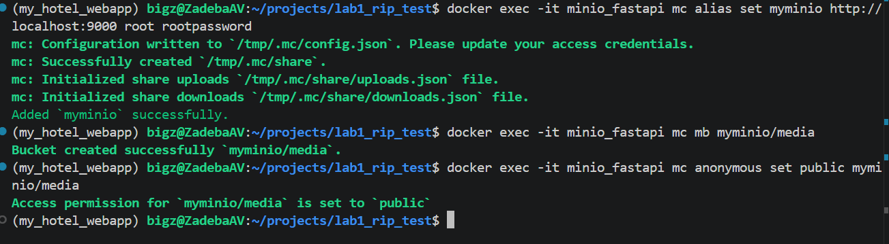
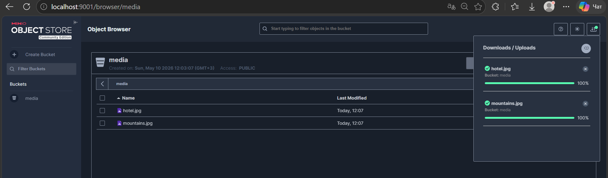

# Мини-гайд: Развертывание MinIO (Объектное хранилище)

В современных приложениях "тяжелые" файлы хранятся не на диске с кодом, а в специализированных S3-хранилищах. **MinIO** — это локальный аналог Amazon S3.

Для запуска мы опишем инфраструктуру как код с помощью **Docker Compose**.

1. Создайте в корне проекта файл `docker-compose.yml`:

```yaml
services:
  minio:
    container_name: minio_storage
    image: minio/minio:latest
    ports:
      - "9000:9000"
      - "9001:9001"
    environment:
      MINIO_ROOT_USER: root
      MINIO_ROOT_PASSWORD: rootpassword
      MINIO_CONSOLE_ADDRESS: ":9001"
    volumes:
      - minio-data:/data
    command: server /data --console-address ":9001"

volumes:
  minio-data:

```

2. **Настройка хранилища командой в терминале:**
По умолчанию корзины (бакеты) в Minio приватны. Выполните эти команды по очереди, чтобы создать бакет и сделать его публичным:

  ```bash
    # Подключаем клиента к серверу Minio(minio_storage - название контейнера из docker-compose.yml)
    docker exec -it minio_storage mc alias set myminio http://localhost:9000 root rootpassword
  ```

  ```bash
    # Создаем бакет. 'media' вы можете заменить на название вашей темы (например, 'hotel-assets', 'images')
    docker exec -it minio_storage mc mb myminio/media
  ```

  ```bash
    # Делаем бакет публичным для чтения. Обязательно замените 'media', если на предыдущем шаге выбрали другое имя!
    docker exec -it minio_storage mc anonymous set public myminio/media
  ```

3. **Загрузка файлов:**
Зайдите по адресу `http://localhost:9001` (логин `root`, пароль `rootpassword`), перейдите в бакет `media` (или тот, который вы создали) и загрузите туда изображения и видео для услуг. Ссылки на них будут выглядеть так: `http://localhost:9000/media/ваша_картинка.jpg`.




Вид хранилища с загружеными изображениями:



