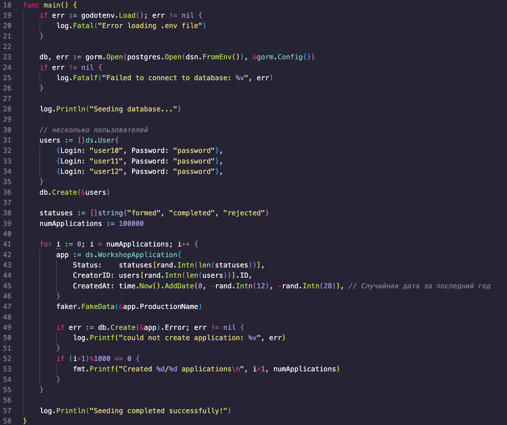
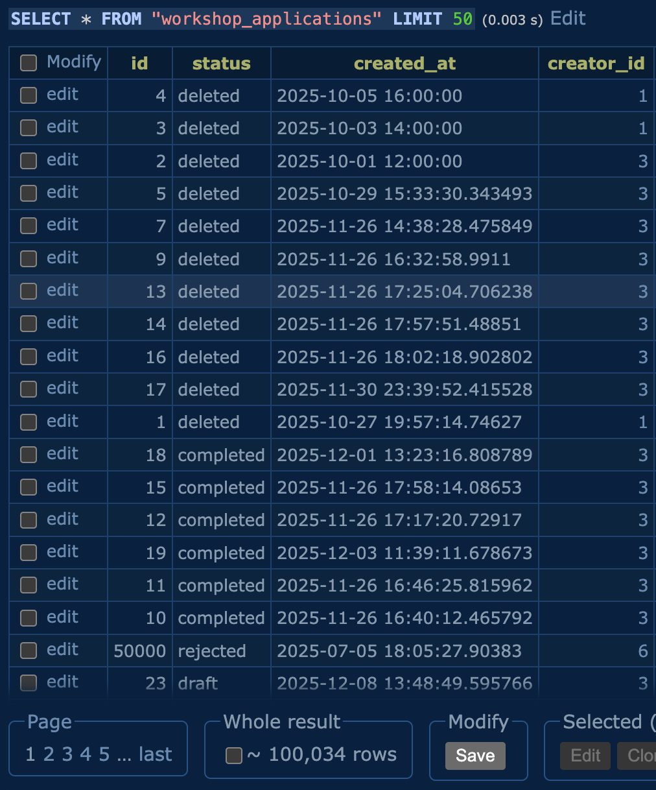
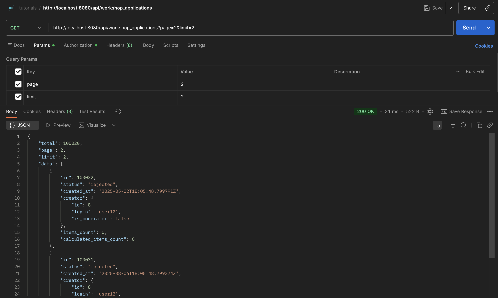
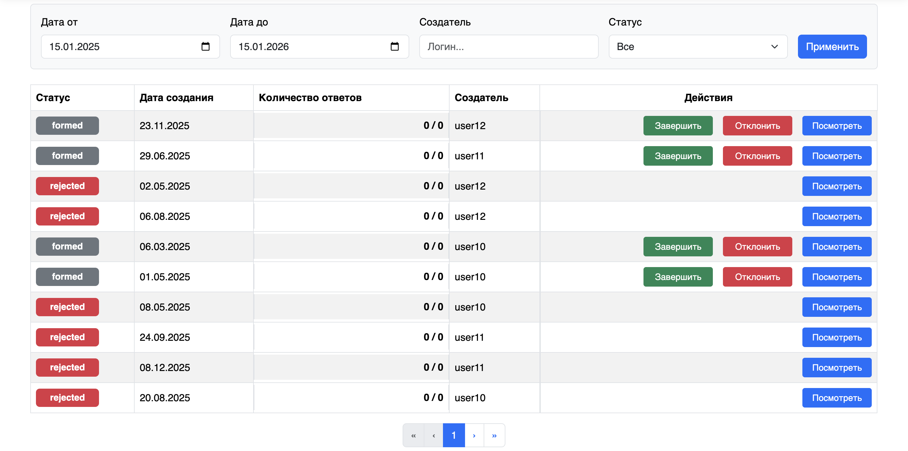
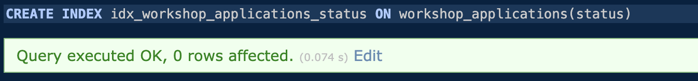
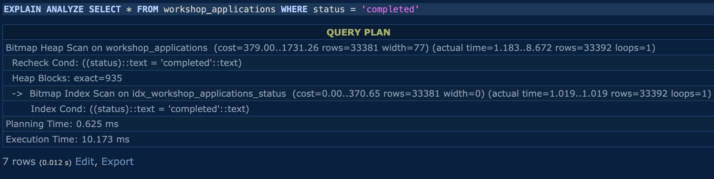
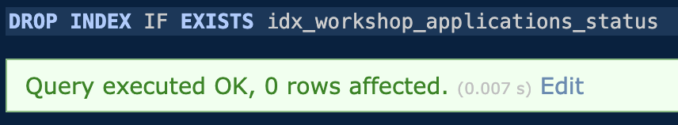
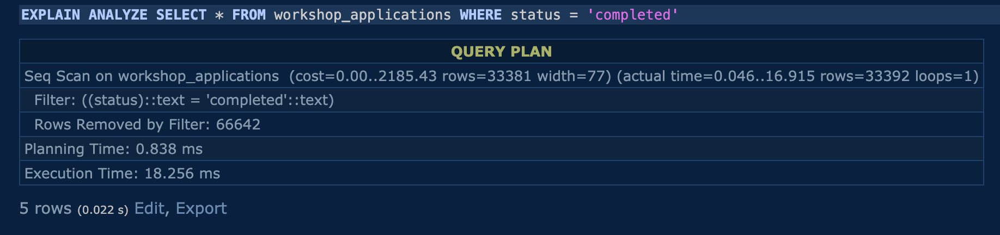

# План действий
1. Подготовить Бэкенд
	1. Сгенерировать базу данных 
	2. Реализовать пагинацию на бэкенде
	3. Проверка работы
2. Реализовать пагинацию на фронтенде
	1. Обновление Redux-слайса
	2. Создание компонента пагинации
3. Создание индексов

## Генерируем большое количество данных
Создать 100000 новых строк для базы данных легче используя генератор случайных данных. 

Установка:
```bash
go get github.com/go-faker/faker/v4
```
Добавляем новый файл в проект, в котором будет заполнятся база данных

```go
import (
	...
	...
	// импорты для подключения к БД и другие
	github.com/go-faker/faker/v4
	...
)

func main(){
	numEntries :=100000
	
	users := []ds.User{
		{Login: "user10", Password: "password"},
		{Login: "user11", Password: "password"},
		{Login: "user12", Password: "password"},
	}
	
	for i := 0; i < numEntries; i++{
			newEntry := ds.MyEntityModel{
			Status: getRandomStatus(),
			CreatorID: users[rand.Intn(len(users))].ID,
			CreatedAt: getRandomDate(),
		}
		
		faker.FakeData(&newEntry.Name)
		
		if err := db.Create(&newEntry).Error; err != nil {
			log.Printf("could not create application: %v", err)
		}
		
	}

}
```
Пример:



Запустите скрипт:
```bash
go run cmd/seed/main.go
```
Должно появиться 100000 новых строк в указаной таблице базы данных



## Реализация пагинации на бэкенде
Нужно добавить поддержку limit и offset.
Функция теперь принимает limit & offset, а возвращает не только срез данных, но и total - общее количество записей

```go
// internal/app/repository/my_repository.go

func (r *Repository) GetMyEntities(filters FilterParams, limit, offset int) ([]ds.MyEntity, int64, error) {
	var entities []ds.MyEntity
	var total int64
	query :=r.db.Model(&ds.MyEntity{})
	
	// применение фильтров отображения
	
	query.Count(&total)
	
	query.Offset(offset).Limit(limit).Find(&entities)
	
	return entities ,total, query.Error
}

```

обновляем обработчик (handler):

```go
// internal/app/handler/my_handler.go
// @Param ...
// @Param ...

func (h *Handler) GetMyEntitiesHandler( c *gin.Context){
	// здесь должны получать фильтры
	
	page, _ := strconv.Atoi(c.DefaultQuery("page", "1")
	limit, _ := strconv.Atoi(c.DefaultQuery("limit", "10")) 
	offset := (page - 1) * limit
	
	entities, total, err := h.Repository.GetMyEntities(filters, limit, offset)
	
	// здесь должны обработывать ошибки
	
	c.JSON(http.StatusOK, gin.H{
		"total": total, 
		"page": page, 
		"limit": limit, 
		"data": entities,
	})
}
```

После обновления handler нужно перегенерировать API, чтобы фронтенд узнал о новой структуре ответа и параметрах


## Обнавляем Redux-слайс

Слайс должен хранить в себе состояние пагинации и передавать его в thunk

```tsx
// src/store/slices/mySlice.ts

//1. Обновляем интерфейс
interface MyState {
	list: MyEntityType[]; 
	currentPage: number; 
	totalPages: number;
	// ...
}

// обновляем thunk для отправки параметров пагинации
export const fetchMyEntitiesAsync = createAsyncThunk<
	PaginatedResponse<myEntityType>, // возврат tuhnk в случае успеха
	void, // аргумент
	{ state: RootState }
	>(
	'myEntities/fetchAll',
	async(_, { getState, rejectWithValue }) => {
		const state = getState();
		const { filters, currentPage } = state.mySlice;
		
		try {
		const response = await api.myEntities.getMyEntiesList({
			status: filters.status || undefined,
			creator_id: filters.creator_id || undefined,
			created_at: filters.created_at || undefined,
			page: currentPage,
			limit: 10,
			},{ secure: true })
		return response.data;
		} catch (error: any) {
		return rejectWithValue(error.response?.data?.error || 'Не удалось загрузить данные');
		}
	}
);

const mySlice = createSlice({
	name: 'myEntities',
	initialState,
	// Добавляем reducer для смены страницы
	reducers: {
		setCurrentPage(state, action: PayloadAction<number>) {
		state.currentPage = action.payload;
		},
		// остальные reducers
	},
	// обновляем extraReducer для обработки пагинированного ответа
	extraReducers: (builder) => {
		builder.addCase(fetchMyEntitiesAsync.fulfilled, (state, action) => {
		state.list = action.payload.data;
		state.totalPages = Math.ceil((action.payload.total || 0) / 10);
		});
	},
	
});
export const { setCurrentPage /* здесь также должна быть логика для фильтров */ } = mySlice.actions;

```
## Проверка работы бэкенда

Нужно проверить, что бэкенд полностью рабочий и работает сам по себе.
Для этого воспользуемся Postman.
Создаем запрос, в котором задействываем page и limit.
Бэкенд должен выдать все элементы, которые находятся на этой странице



## Создание компонента с пагинацией

Создаем файл 
```
src/components/Pagination/Pagination.tsx
```
Используя bootstrap создаем компонент, в котором обрабатываем пагинацию :
```go
import { Pagination as BootstrapPagination } from 'react-bootstrap'

interface PaginationProps {
	currentPage: number;
	totalPages: number;
	onPageChange: (page: number) => void;
}

export const Pagination: React.FC<PaginationProps> = ({ currentPage, totalPages, onPageChange }) => {
	if (totalPages <=1){
		return null;
	}
	
	const items =[];
	for (let number = 1; number <= totalPages number++){
		items.push(
			<BootstrapPagination.Item
			key = {number}
			active = {number === currentPage}
			onClick = {() => onPageChange(number)}
			>
				{number}
			</BootstrapPagination.Item>,	
		);
	}
	//дальше идет обработка кнопок первая страница, следующая, предыдущая ...
	return (
	<BootstrapPagination>
		<BootstrapPagination.First onClick={() => onPageChange(1)} disabled = {currentPage === 1} />
		<BootstrapPagination.Prev onClick={() => onPageChange(currentPage - 1)} disabled = {currentPage === 1} />
		{items}
		<BootstrapPagination.Next onClick={() => onPageChange(currentPage + 1)}	disabled={currentPage === totalPages} />
		<BootstrapPagination.Last onClick={() => onPageChange(totalPages)} disabled ={currentPage === totalPages} />
		</BootstrapPagination>
	);
};
```

## Интегрируем пагинацию в страницу со списком

Добавляем компонент, который создали в предыдущем этапе, на страницу, где отображается список

```tsx
// src/pages/ModeratorPage/ModeratorPage.tsx
import {useEffect} from 'react';
import { Pagination } from '../../components/Pagination/Pagination';
// остальные импорты

export const ModeratorPage: React.FC = () => {
	const dispatch = useDispatch<AppDispatch>();
	
	const {list, loading, currentPage, totalPages} = useSelector((state: RootState) => state.myEntities);
	
	useEffect(() => {
		dispatch(fetchMyEntitiesAsync())
	}, [dispatch, currentPage]);
	
	const handlePageChange = (page: number) => {
		dispatch(setCurrentPage(page));
	};
	
	return (
		<div>
			{/* фильтры и заголовки будут тут */}
			<h1>Список элементов</h1>
			{loading === 'pending' && !list.length ? (
				<div className = "text-center">
					<Spinner animation ="border" /> 
				</div>
			) : (
				<>
					<Table>
						<thead>
							<tr>
								<th>Статус</th>
								<th>Дата создания</th>
								<th>Создатель</th>
								<th className = "text-center">Действия</th>
							</tr>
						</thead>
						<tbody>
							{list.map(entity =>(
								<tr key={entity.id}>
									<td>{enity.status}</td>
									<td>{new Date(entity.created_at).toLocaleDateString()}</td>
									<td>{entity.creator.login}</td>
									<td className="text-center">
										<Button size="sm">Посмотреть</Button>
									</td>
								</tr>
							))}
						</tbody>
					</Table>
					
					<div className = "d-flex justify-content-center">
						<Pagination
							currentPage={currentPage}
							totalPages={totalPages}
							onPageChange={handlePageChange}
						/>
					</div>
				</>		
			)} 
		</div>	
	);
};
```
Пример готовой пагинации:



## Создание и удаление индексов

Индексы создаются для полей, по которым часто происходит фильтрация

Команда для создания индекса:
```sql
CREATE INDEX idx_column_name ON table_name(column_name);
```



Для демонстрации работы индексов нужно  создать индекс, проанализировать запрос и зафиксировать время запроса :
```sql
EXPLAIN ANALYZE SELECT * FROM table_name WHERE column_name = 'some_value';
```



Команда для удаления индекса:
```sql
DROP INDEX idx_column_name;
```



Снова анализируем время запроса:
```sql
EXPLAIN ANALYZE SELECT * FROM table_name WHERE column_name = 'some_value';
```

