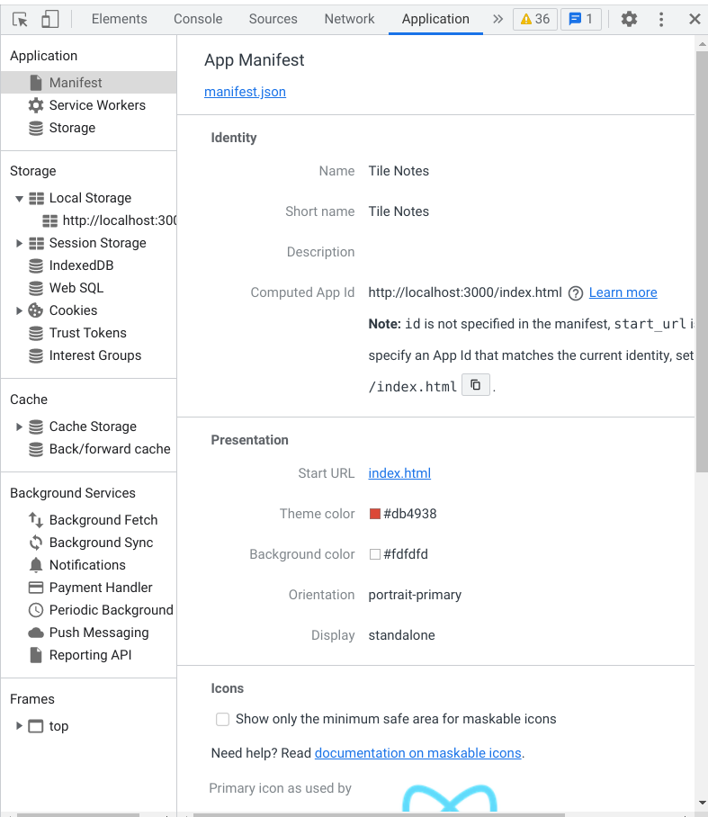
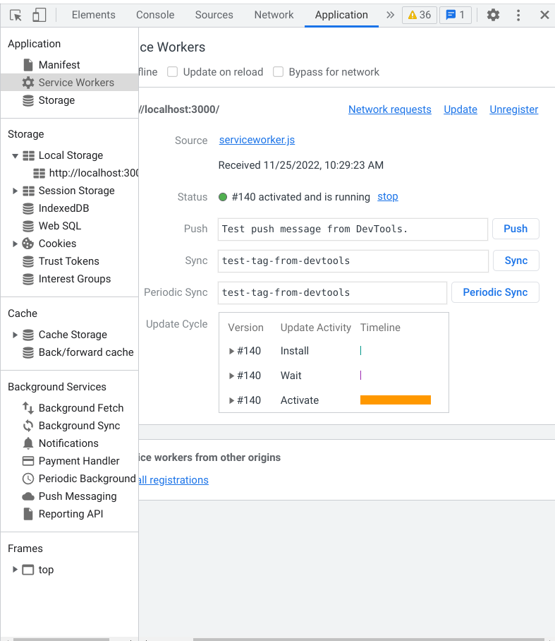
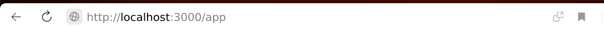
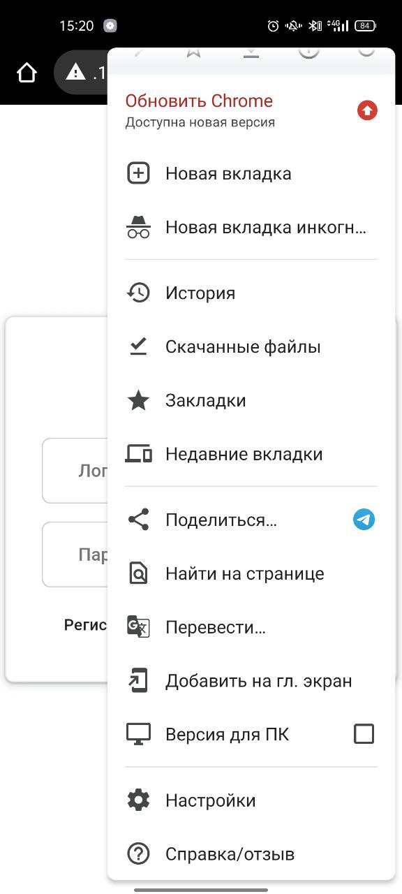
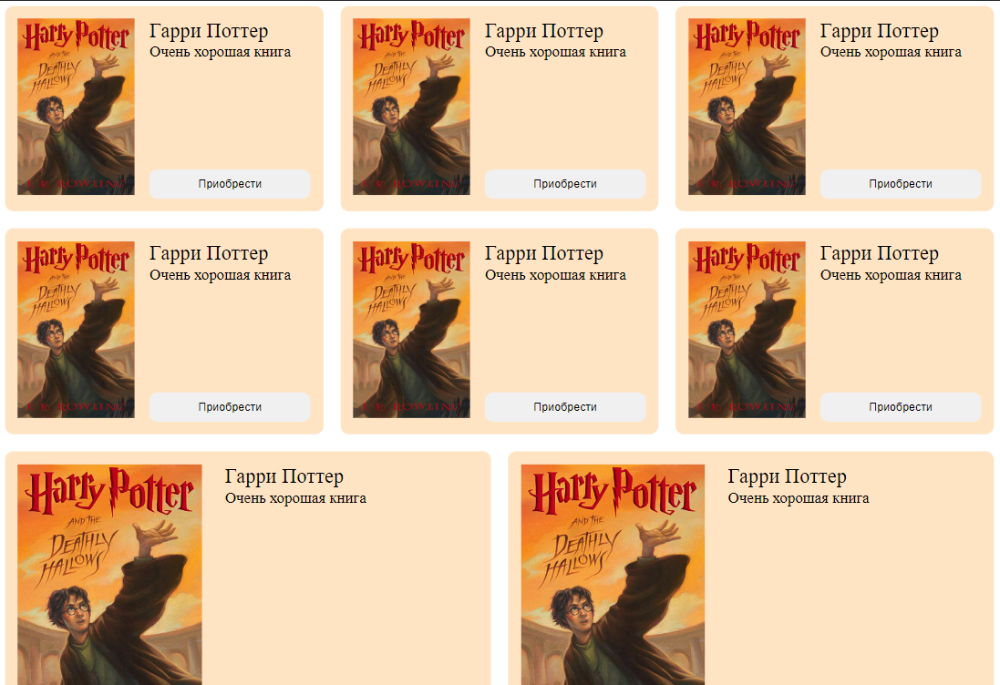
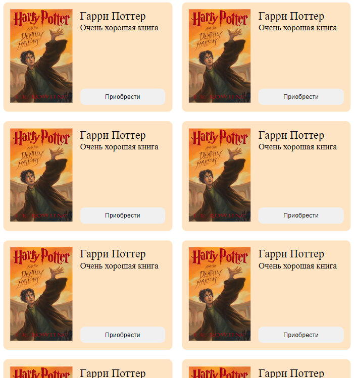
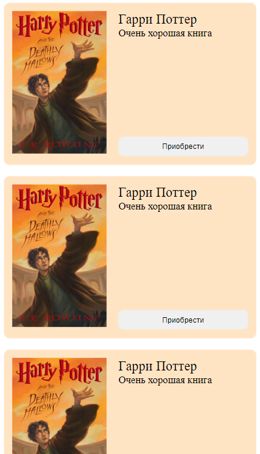
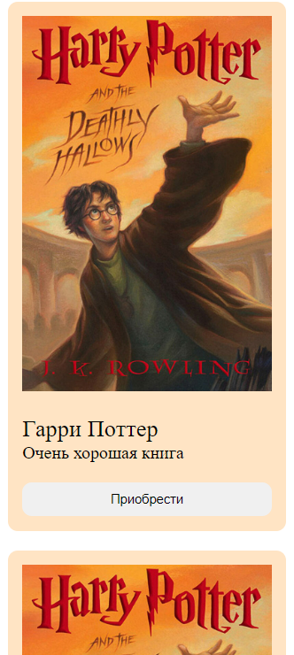

# Методические указания по выполнению задания Progressive Web App

[Решения](https://github.com/iu5git/web-2022/issues/14) для типовых проблем при выполнении задания по PWA

### Команда курса благодарит Ткаченко Владислава Львовича за активное участие в подготовке данного руководства.

[PWA](https://ru.wikipedia.org/wiki/Прогрессивное_веб-приложение) (Progressive Web Application, Прогрессивное web-приложение) - это веб-приложение с характеристиками мобильного приложения. Приложения также запускается в браузере, но браузер пустой, без тулбаров и разных менюшек.

С помощью pwa можно:

- создать иконку приложения на рабочем столе устройства
- достучаться до аппаратуры
- отправлять push уведомления
- работать в оффлайн

Подробнее про pwa можно почитать [здесь](https://habr.com/ru/post/418923/)

## Создание PWA

Для этого базово нужно 2 шага:

- иметь manifest.json
- и зарегистрированный service worker, который умеет кешировать запросы, то есть приложение может работать в оффлайн

### manifest.json

Начнем с manifest.json:

```json
{
  "name": "Tile Notes",
  "short_name": "Tile Notes",
  "start_url": "/",
  "display": "standalone",
  "background_color": "#fdfdfd",
  "theme_color": "#db4938",
  "orientation": "portrait-primary",
  "icons": [
    {
      "src": "/logo192.png",
      "type": "image/png", "sizes": "192x192"
    },
    {
      "src": "/logo512.png",
      "type": "image/png", "sizes": "512x512"
    }
  ]
}
```

Вот так он выглядит. Зачем он нужен? Он нужен, чтобы сказать браузеру, что наше приложение pwa, и задать некоторые настройки: название приложения - оно будет появляться на рабочем столе телефона, start_url - какую страницу браузеру запустить при старте, иконки, фоновый цвет и еще парочка опций.

Этот файлик должен быть доступен по пути /manifest.json относительно корня, то есть url примерно такой http://localhost:3000/manifest.json. Если мы используем react, то кладем данный файл в public директорию, которая находится в корне проекта. Туда же кладем иконки.

Проверить то, что файлик корректно подтянулся можно так:



В DevTools (инструменты разработчика, Ctrl+Shift+I, браузер Chrome). Заходим во вкладку Application, там должно быть что-то похожее как на скрине, без предупреждений и ошибок.

### Service Worker

Что это такое? Это скрипт, который выполняется в фоне, в отдельном потоке, то есть отдельно от страницы. Он умеет разные штуки, в частности, можно перехватывать все сетевые запросы и кешировать их.

Регистрируем service worker, делаем это в файле `index.js` после рендера корневого компонента:

```javascript
if ("serviceWorker" in navigator) {
  window.addEventListener("load", function() {
    navigator.serviceWorker
      .register("/serviceWorker.js")
      .then(res => console.log("service worker registered"))
      .catch(err => console.log("service worker not registered", err))
  })
}
```

Создаем файл serviceWorker.js и кладем его в директорию public:

```javascript
self.addEventListener('fetch',() => console.log("fetch"));
```

Здесь мы формально выполняем требования браузера: нужно повесить обработчик на событие fetch. Если хотите поиграться с разными стратегиями кеширования, то можно глянуть [тут](https://habr.com/ru/company/2gis/blog/345552/)

Если по пути, что-то пошло не так, то возможно нужно будет перезагрузить service worker:



Делается это нажатием кнопочки `Unregister` и перезагрузкой страницы.

Теперь можно проверить, что все работает:



Должна появиться иконочка `Install Apllication` справа в десктопном браузере. Нажимаем на нее, должно открыться отдельное окно с приложением.

Делаем то же самое на смартфоне. Для этого нужно поместить компьютер и телефон в одну сеть, взять адрес компьютера (на Linux/Mac можно сделать через `ip addr`) Должно быть что-то похожее на 192.168.199.97. Открыть приложения в мобильном браузере по ссылке http://192.168.199.97:3000. И установить приложение через меню:



Нажимаем `Добавить на главный экран`. Готово - иконка должна появиться на рабочем столе.

## Добавление адаптивности
Зачем это нужно? Адаптивность помогает вашему веб-приложению нормально выглядить на устройствах с разными размерами экрана, а также влияет на продвижение сайта в поисковых системах. Сделать это можно c помощью использования относительно новых моделей макета (flexbox, grid), а так же через media queries в css. [Здесь](https://ru.hexlet.io/courses/css-adaptive/lessons/media-queries/theory_unit) можно почитать про последние.

### Практические примеры:

1. Список товаров

Предположим, что у нас есть список товаров (в данном случае - книги), и мы должны сверстать такое расположение карточек, чтобы при уменьшении размеров экрана товары съезжали вниз и полностью покрывали новое пространство. В этом нам поможет flexbox и немного медиа запросы.

Структура карточки, обертки, в которой находятся все товары, и их css-свойства:
```html
<div class="cards__wrapper">
    <div class="card__item">
        <div class="card__img">
            
        </div>
        <div class="card__info">
            <div class="card__text">
                <div class="card__title">Название книги</div>
                <div class="card__description">Описание книги</div>
            </div>
            <button class="card__btn">Приобрести</button>
        </div>
    </div>
</div>
```

```css
.cards__wrapper {
    display: flex;
    justify-content: space-between;
    align-items: center;
    flex-wrap: wrap;
    gap: 20px;
}

.card__item {
    flex: 1 1 300px;
    padding: 15px;
    background-color: bisque;
    border-radius: 10px;
    display: flex;
    justify-content: space-between;
}

.card__img {
    width: 40%;
}

.card__img img {
    max-width: 100%;
    height: auto;
}

.card__info {
    width: 55%;
    display: flex;
    flex-direction: column;
    justify-content: space-between;
}

.card__title {
    font-size: 24px;
}

.card__description {
    font-size: 18px;
}

.card__btn {
    padding: 10px 15px;
    border-radius: 10px;
    border: none
}
```

На что здесь надо обратить внимание? 
1. на свойства обертки, которые позволяют переносить элементы на новую строчку, если предыдущая заполнилась (`flex-wrap`), а так же задают отступы между соседними элементами сверху и снизу (`gap`)
2. на свойства самой карточки: в данном случае нас интересует первое свойство `flex`, а точнее последнее значение в нем. Это значение определяет, в какой момент элементы переносятся на новую строчку, а именно если размер элемента становится равным `300px`

Подробнее про flexbox можете прочитать [здесь](https://medium.com/@stasonmars/%D0%B2%D0%B5%CC%88%D1%80%D1%81%D1%82%D0%BA%D0%B0-%D0%BD%D0%B0-flexbox-%D0%B2-css-%D0%BF%D0%BE%D0%BB%D0%BD%D1%8B%D0%B8%CC%86-%D1%81%D0%BF%D1%80%D0%B0%D0%B2%D0%BE%D1%87%D0%BD%D0%B8%D0%BA-e26662cf87e0)

Получается такая картина:
- 1200px


- 768px


- 545px



При этом на мобильных устройствах уже не рекомендуется ставить элементы "в строчку", так как при длинных текстах (например, большое описание книги) наша верстка будет съезжать, поэтому следует разместить картинку сверху.

Для этого нам понадобятся медиа запросы. Пишем ключение слово `@media`, и после него следует указать условие, по которому будет выполняться запрос. Например:

```css
@media (max-width: 460px) {
    .card__item {
        flex-direction: column;
        align-items: center;
        gap: 20px 0
    }

    .card__img, .card__info {
        width: 100%;
    }

    .card__btn {
        margin-top: 20px;
    }
}
```
В данном случае, если ширина viewport будет меньше либо равно `460px`, то применяются все стили к элементам, которые расположены внутри блока `@media (max-width: 460px) {}`.

Итого, при просмотре на ширине экрана `320px` наш список товаров принимает такой вид.



[//]: # (Базово в css объявляем `@media &#40;max-width: 480px`. И внутри фигурных скобок пишем стили, они будут применяться, когда разрешение устройства меньше 480px. Обычно телефоны примерно таких размером, можно отдельно сделать для совсем маленьких телефонов 320px &#40;iPhone SE&#41;. Или для планшетов 768px.)