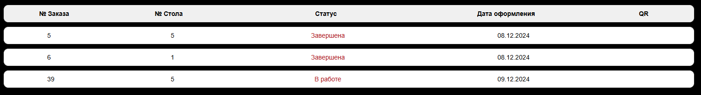
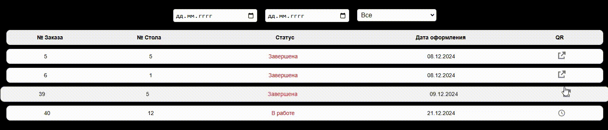
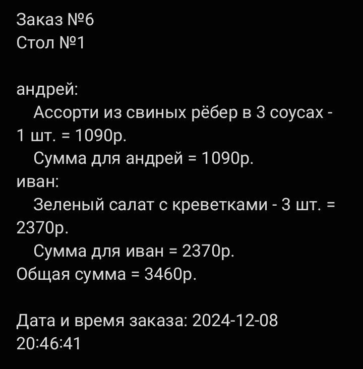

# Генерация и внедрение QR кода в проект

Давайте представим, что нас приняли на работу, как фулстэк-разработчиков с солидной зарплатой и сплоченной командой. Продукт, который разрабатывает и поддерживает наша команда, - веб-сайт ресторана с обширным меню и возможностью оформления заказов. В один день к нам приходит тим-лид и докладывает, что посетители ресторана стали забывать состав предыдущих заказов и им необходима возможность даже спустя длительное время просмотреть их и всю доступную о них информацию, включая сумму заказа, номер стола, дату оформления и непосредственно сами блюда. Тим-лид ставит перед нами задачу - добавить в наш сервис генерацию QR-кода на бэкенде со всей необходимой информацией после подтверждения заказа менеджером, а затем отображать его в списке заказов этого пользователя. Сегодня мы выполним поставленную задачу.

## Бэкенд

Давайте посмотрим текущее состояние дел на бэкенде. Наш бэкенд написан на Python, а конкретно, на Django Rest Framework. Вот как выглядит метод завершения заказа менеджером.
```python
@method_permission_classes([IsManager])  # Разрешаем только модераторам
def put_moderator(self, request, pk):
    dinner = get_object_or_404(self.model_class, pk=pk)
    user = request.user
    
    if 'status' in request.data:
        status_value = request.data['status']

        # Модератор может завершить ('c') или отклонить ('r') заявку
        if status_value in ['c', 'r']:
            if dinner.status != 'f':
                return Response({"error": "Заявка должна быть сначала сформирована."}, status=status.HTTP_403_FORBIDDEN)

            # Установка даты завершения и расчёт стоимости для завершённых заявок
            if status_value == 'c':
                real_time = timezone.now()
                dinner.completed_at = real_time
                total_cost = self.calculate_total_cost(dinner)
                updated_data = request.data.copy()
                updated_data['total_cost'] = total_cost

            elif status_value == 'r':
                dinner.completed_at = timezone.now()
                updated_data = request.data.copy()

            serializer = self.serializer_class(dinner, data=updated_data, partial=True)
            if serializer.is_valid():
                serializer.save(moderator=user)
                return Response(serializer.data)
            return Response(serializer.errors, status=status.HTTP_400_BAD_REQUEST)

    return Response({"error": "Модератор может только завершить или отклонить заявку."}, status=status.HTTP_400_BAD_REQUEST)
```

Также, для полноты погружения в контекст, приведу модель сущности Dinner и его сериалайзер.
```python
class Dinner(models.Model):
    STATUS_CHOICES = [
        ('dr', "Draft"),
        ('del', "Deleted"), 
        ('f', "Formed"), 
        ('c', "Completed"), 
        ('r', "Rejected")
    ]
    table_number = models.IntegerField()
    status = models.CharField(choices=STATUS_CHOICES, max_length=9, default='dr')
    created_at = models.DateTimeField(auto_now_add=True)
    formed_at = models.DateTimeField(blank=True, null=True)
    completed_at = models.DateTimeField(blank=True, null=True)
    creator = models.ForeignKey(CustomUser, related_name='dinners_created', on_delete=models.SET_NULL, null=True)
    moderator = models.ForeignKey(CustomUser, related_name='dinners_moderated', on_delete=models.SET_NULL, null=True, blank=True)
    total_cost = models.IntegerField(default=0)
```
```python
class DinnerSerializer(serializers.ModelSerializer):
    
    class Meta:
        model = Dinner
        fields = ['id', 'table_number', 'total_cost', 'status', 'created_at', 'formed_at', 'completed_at', 'creator', 'moderator']
```

Приступим к выполнению задачи. Первым делом, добавим в модель Dinner новое поле - qr. Поле будет текстовым, так как генерироваться QR-код будет в формате [base64](https://developer.mozilla.org/en-US/docs/Glossary/Base64). Кроме того, наше поле может быть пустым в базе данных, например, если заказ находится в статусе черновика или только сформирован, но еще не одобрен менеджером. Учитывая это, добавляем новое поле:
```python
qr = models.TextField(null=True, blank=True)
```

Не забываем применить миграцию
```shell
python manage.py makemigrations
python manage.py migrate
```

Добавим новое поле в сериалайзер:
```python
class DinnerSerializer(serializers.ModelSerializer):
    
    class Meta:
        model = Dinner
        fields = ['id', 'table_number', 'total_cost', 'status', 'created_at', 'formed_at', 'completed_at', 'creator', 'moderator', 'qr']
```

Подготовка завершена, приступим к реализации бизнес-логики. Хорошим тоном является разделение контроллеров и самой бизнес-логики. Такой подход называется *Thin Views*, он подразумевает вынесение бизнес-процессов в отдельный сервисный слой, сами контроллеры при этом остаются "узкими" и удобными для чтения. Подробнее можете прочитать [здесь](https://habr.com/ru/articles/581964/). Создадим в папке с нашим djago-приложением директорию ```services/```. В ней создадим файл ```qr_generate.py``` - файл, отвечающий непосредственно за создание qr-кода. Поместим туда следующий несложный код:
```python
import segno
import base64
from io import BytesIO

def generate_dinner_qr(dinner, dinner_dishes, time):
    # Формируем информацию для QR-кода
    info = f"Заказ №{dinner.id}\nСтол №{dinner.table_number}\n\n"
    person_orders = {}

    for dinner_dish in dinner_dishes:
        guest = dinner_dish.guest
        dish_info = {
            'name': dinner_dish.dish.name,
            'price': dinner_dish.dish.price,
            'count': dinner_dish.count
        }
        if guest not in person_orders:
            person_orders[guest] = []
        person_orders[guest].append(dish_info)

    # Суммируем стоимость для каждого гостя
    total_cost = 0
    for guest, dishes in person_orders.items():
        info += f'{guest}:\n'
        guest_cost = 0
        for dish in dishes:
            cost = dish['price'] * dish['count']
            guest_cost += cost
            info += f"\t{dish['name']} - {dish['count']} шт. = {cost}р.\n"
        total_cost += guest_cost
        info += f"\tСумма для {guest} = {guest_cost}р.\n"
    
    info += f"Общая сумма = {total_cost}р.\n\n"

    completed_at_str = time.strftime('%Y-%m-%d %H:%M:%S')
    info += f"Дата и время заказа: {completed_at_str}"

    # Генерация QR-кода
    qr = segno.make(info)
    buffer = BytesIO()
    qr.save(buffer, kind='png')
    buffer.seek(0)

    # Конвертация изображения в base64
    qr_image_base64 = base64.b64encode(buffer.read()).decode('utf-8')

    return qr_image_base64
```

Первым делом в коде импортируются необходимые нам библиотеки. Библиотека ```segno``` нам интересна больше всего. Именно она будет гененрировать qr-код на основе той строки, которую мы ей передадим. Данная библиотека не предоставляется из коробки, поэтому её необходимо установить (```pip install segno```). Далее в функцию ```generate_dinner_qr``` передается вся имеющаяся информация о блюде, включая данные заказа, блюда, входящие в его состав, и дата его завершения. Создается строка ```info``` в которую мы будем помещать всю необходимую пользователю информацию. Затем блюда в заказе разделяются по посетителям для формирования их индивидуального списка блюд и стоимости их заказа. Время, которое будет приходить к нам в формате *Date* мы также приводим к строке, используя ```time.strftime()``` и помещаем в строку с информацией. Дальше к самому интересному. <br>

Строка ```qr = segno.make(info)``` использует библиотеку *segno* для создания QR-кода. Функция make() принимает данные (info), которые нужно закодировать в QR-код, и возвращает объект, представляющий этот код. В строке ```buffer = BytesIO()``` создается объект типа BytesIO, который представляет собой буфер в памяти, используемый для хранения данных в двоичном формате. Это позволяет записывать данные без необходимости создавать файл на диске. Далее метод ```qr.save()``` сохраняет созданный QR-код в виде PNG-изображения в ранее созданный буфер. Параметр kind='png' указывает формат файла, в котором будет сохранено изображение. Метод seek(0) перемещает указатель позиции чтения/записи в начало буфера. Это необходимо, чтобы при чтении данных мы начинали с самого начала содержимого буфера. Наконец, в строке ```qr_image_base64 = base64.b64encode(buffer.read()).decode('utf-8')``` происходит чтение всего содержимого буфера методом read(). Затем данные преобразуются в строку Base64 с помощью функции b64encode(). После этого результат декодируется в строку формата UTF-8 с помощью метода .decode('utf-8'). В итоге переменная qr_image_base64 содержит строку, представляющую изображение QR-кода в формате Base64. Её мы и возвращаем в результате работы нашей функции. <br>

Осталось лишь воспользоваться написанной нами функцией внутри контроллера:
```python
@method_permission_classes([IsManager])  # Разрешаем только модераторам
def put_moderator(self, request, pk):
    dinner = get_object_or_404(self.model_class, pk=pk)
    user = request.user
    
    if 'status' in request.data:
        status_value = request.data['status']

        # Модератор может завершить ('c') или отклонить ('r') заявку
        if status_value in ['c', 'r']:
            if dinner.status != 'f':
                return Response({"error": "Заявка должна быть сначала сформирована."}, status=status.HTTP_403_FORBIDDEN)

            # Установка даты завершения и расчёт стоимости для завершённых заявок
            if status_value == 'c':
                real_time = timezone.now()
                dinner.completed_at = real_time
                total_cost = self.calculate_total_cost(dinner)
                updated_data = request.data.copy()
                updated_data['total_cost'] = total_cost

                # Генерация QR-кода
                dinner_dishes = dinner.dinnerdish_set.all()
                qr_code_base64 = generate_dinner_qr(dinner, dinner_dishes, real_time)
                updated_data['qr'] = qr_code_base64

            elif status_value == 'r':
                dinner.completed_at = timezone.now()
                updated_data = request.data.copy()

            serializer = self.serializer_class(dinner, data=updated_data, partial=True)
            if serializer.is_valid():
                serializer.save(moderator=user)
                return Response(serializer.data)
            return Response(serializer.errors, status=status.HTTP_400_BAD_REQUEST)

    return Response({"error": "Модератор может только завершить или отклонить заявку."}, status=status.HTTP_400_BAD_REQUEST)
```
Уложились всего в 3 строчки, оставив при этом контроллер достаточно "узким" для сохранения читабельности.<br>

Проверим правильность работы нашего кода через [Postman](https://www.postman.com/). Отправим на URL ```http://localhost:8000/dinners/39/complete/``` PUT-запрос с телом
```json
{
    "status": "c"
}
```
Делаем запрос от имени модератора. Предполагается, что заказ №39 уже сформирован пользователем. Если всё сделано правильно, то увидим нечто подобное:
```json
{
    "id": 39,
    "table_number": 5,
    "total_cost": 3430,
    "status": "c",
    "created_at": "2024-12-08T19:29:27.230222Z",
    "formed_at": "2024-12-09T18:38:27.249865Z",
    "completed_at": "2024-12-21T19:50:53.885165Z",
    "creator": 5,
    "moderator": 12,
    "qr": "iVBORw0KGgoAAAANSUhEUgAAAEkAAABJAQAAAABZCDZxAAACvElEQVR42mP4DwMNDASZHyTauVW/m+qwNzB8v5fq8ObMi63fGxi+hKu983kw96o4kBnr43xOKKsXxIxIDToYHL4VyPx++0ylzL61sUC1H0RDQSAEaML/z/Yld3da7Qea+5F9a7dD79mD9xsYfmZcmJfY03s5vIHhn5usi0igpXR5A8Pv4lfLLq8NXrQeKHpKxm3G1S93gAq+L/xzamXLIp39DQzfjoW4ilo6K8YDTahQWrO1frUxUO2HO7NTPmrdPQC0+M+rfS5rzsxpADI/M+YEXBQ0FLUHOtLo2bv+yT3a/kC1U47etZnxX3060GXJ695YnbRROw7UdlF1S7hooDHQF9++nnp1Wfnzbn0gk831nuiVHVOBLvtvLzLX5oYGT3sDwyeRohBP5pIbQNEfatv/SwvPWaQOVMBmGrR2y8+9QCs+PhEUW3Vz9Qqge/8w1N5xlDpeABT9X1ZePNeo+jlQ7a+wPqWrsTxXQS4rTC6bw+ngDmR+Y5hsy2g0mQHkSEOOlk6rWa39QLV3T9vInn3bA/Tmz2It7azek6uAzF9HXBz/Fwq7AsPh14cD+3nXWmsCbfs9pXXOoZnnG8yBYbZy443wOWfug6JQ4urRUEFBQaCP/yYyWb3dyr0iHejIjidqd+bOuQIU/ayU86a75/A1YLT8vfXEdX6gMBvQm1/+973TtdqwC2ju99NM36/63r0IDNS/v8W0mpZ2t24Higq9jWG2NFcBuuGD1bvP/Is3dp4HKpDoCTlx5dInUPja5yclney6AQqHrq2uwsLmrfxAb37q8uq3XrwZ5KHASTMcO6aA3Pv/y/KZMhc72/VBaUfFVVQ2OrQeaMU1vqLY2wvUgcwvAVOLGtecnAAM9S9RX80e7+hqBar9ErT3T2Byceh1oNor04u0hG+vA6UHQTGbyzVnrqsTkdYRTABeG6qCp1+CSgAAAABJRU5ErkJggg==",
}
```
Как видим, qr-код действительно создан в формате base64 и готов к использованию на фронте.

## Фронтенд

Теперь мы умеем генерировать qr-код на бэкенде, и он будет приходить к нам в теле ответа при запросе одного или нескольких заказов.<br>

На фронтенде наша команда использует React. Заказы конкретного пользователя помещены вот в такую функциональную компоненту

```typescript
import React from 'react';

interface DinnerCardProps {
  id: number;
  tableNumber: number;
  status: 'f' | 'c' | 'r';
  formedAt: string | null;
  totalCost: number;
  onClick: () => void;
}

const getStatusText = (status: 'f' | 'c' | 'r') => {
  switch (status) {
    case 'f':
      return 'В работе';
    case 'c':
      return 'Завершена';
    case 'r':
      return 'Отклонена';
    default:
      return 'Неизвестен';
  }
};

const DinnerCard: React.FC<DinnerCardProps> = ({ id, tableNumber, status, formedAt, totalCost, onClick }) => {
  return (
    <div className={`dinner-card ${status}`} onClick={onClick}>
      <div className="dinner-info">
        <p className="order-id">{id}</p>
        <p className="table-number">{tableNumber}</p>
        <p className="status">{getStatusText(status)}</p>
        <p className="date-formed">{formedAt ? new Date(formedAt).toLocaleDateString() : '—'}</p>
      </div>
    </div>
  );
};

export default DinnerCard;
```
Визуально выглядит это вот так:


Справа видим свободное место для QR-кода, но поскольку карточки слишком узкие, вместить его туда полностью не выйдет. Будем использовать навыки UI/UX и выкручиваться. Создадим внутри компоненты новый элемент, содержащий небольшое svg-изображение. Если заказ сформирован (то есть QR-кода пока нет) разместим svg-элемент часов, в противном случае, разместим контейнер с другим svg-элементом - так называемым *квадратом внешней ссылки* (безусловно, у разных разработчиков разные видения UI/UX и конечные svg-элементы, равно как и в дальнейшем применяемые стили, определяются им самим; мне данный выбор показался наиболее правильным). Идея в том, чтобы отображать QR-код только при наведении на svg-элемент квадрата. Добавим к новым элементам классы, с помощью которых и осуществим задумку. Конечный код компоненты будет выглядеть следующим образом:
```typescript
import React from 'react';

interface DinnerCardProps {
  id: number;
  tableNumber: number;
  status: 'f' | 'c' | 'r';
  formedAt: string | null;
  totalCost: number;
  qr?: string; // Новое поле в нашем интерфейсе
  onClick: () => void;
}

const getStatusText = (status: 'f' | 'c' | 'r') => {
  switch (status) {
    case 'f':
      return 'В работе';
    case 'c':
      return 'Завершена';
    case 'r':
      return 'Отклонена';
    default:
      return 'Неизвестен';
  }
};

const DinnerCard: React.FC<DinnerCardProps> = ({ id, tableNumber, status, formedAt, totalCost, qr, onClick }) => {
  return (
    <div className={`dinner-card ${status}`} onClick={onClick}>
      <div className="dinner-info">
        <p className="order-id">{id}</p>
        <p className="table-number">{tableNumber}</p>
        <p className="status">{getStatusText(status)}</p>
        <p className="date-formed">{formedAt ? new Date(formedAt).toLocaleDateString() : '—'}</p>
      </div>
      <div className="dinner-icon">
        {status === 'f' ? (
          
        ) : (
          <div className="qr-hover-wrapper">
            
            <div className="qr-hover">
              {qr && }
              <p>Общая стоимость: {totalCost} ₽</p>
            </div>
          </div>
        )}
      </div>
    </div>
  );
};

export default DinnerCard;
``` 

Здесь стоит выделить то, как мы вставляем переданный с бэкенда в формате base64 QR-код прямо в нашу верстку. Атрибут src в данном случае имеет значение ```{data:image/png;base64,{qr}}```. Данная строка - не магический набор символов, а инструкция браузеру, означающая следующее:
 * ```data``` - указывает, что далее следует встроенное представление данных.
 * ```image/png``` - MIME-тип данных, в данном случае это изображение в формате PNG. Подробнее о MIME-типах читайте [здесь](https://developer.mozilla.org/en-US/docs/Web/HTTP/MIME_types).
 * ```;base64,``` - говорит о том, что данные представлены в формате base64.
 * ```{qr}``` - само значение, переданное с бэкенда.

С помощью этих инструкций браузер корректно отобразит переданный нами QR-код.<br>

Завершим нашу идею написанием стилей для компоненты. Приведу то, что касается непосредственно всплывающей обертки с QR-кодом:
```css
.dinner-icon {
    margin-left: auto;
    position: relative;
    display: flex;
    justify-content: center;
    align-items: center;
}

.status-icon {
    width: 20px;
    height: 20px;
    cursor: pointer;
}

/* Обертка для всплывающего окна с QR-кодом */
.qr-hover-wrapper {
    position: relative;
}

/* Всплывающий блок с QR-кодом */
.qr-hover {
    display: none; /* Изначально скрыто */
    position: absolute; /* Абсолютное позиционирование относительно родителя */
    top: 50%; /* Верхний край на половине высоты родителя */
    left: calc(-100% - 100px); /* Левый край смещен на ширину родителя минус 100 пикселей */
    transform: translateY(-50%) translateX(-80%) scale(1.5);
    /*
     * Трансформация:
     *   translateY(-50%) - смещение вверх на половину своей высоты для центрирования по вертикали,
     *   translateX(-80%) - смещение влево на 80% ширины родителя,
     *   scale(1.5) - увеличение размера в 1.5 раза
     */
    z-index: 1000; /* Высокий уровень z-индекса для вывода поверх других элементов */
    background-color: white;
    border: 1px solid #ccc;
    padding: 15px;
    border-radius: 4px;
    text-align: center;
    box-shadow: 0 4px 8px rgba(0, 0, 0, 0.2);

    p {
        font-size: 12px;
    }
}

.qr-code {
    width: 120px;
    height: 120px;
}

/* При наведении на иконку QR-код становится видимым */
.qr-hover-wrapper:hover .qr-hover {
    display: block;
}

/* Псевдоэлемент для иконки статуса при наведении */
.status-icon:hover::after {
    position: absolute; /* Абсолютное позиционирование */
    bottom: -25px;
    left: 50%;
    transform: translateX(-50%); /* Центрируем по горизонтали */
    background-color: #fff;
    color: #333;
    padding: 5px;
    border: 1px solid #ddd;
    border-radius: 4px;
    box-shadow: 0 2px 4px rgba(0, 0, 0, 0.1);
    font-size: 12px;
}
```

Запускаем фронтенд и любуемся результатом:<br>


При этом содержимое QR-кода можно открыть с помощью камеры любого современного смартфона: <br>

