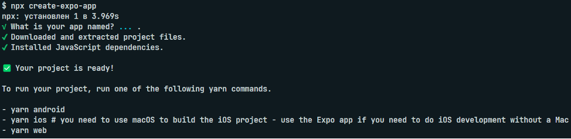
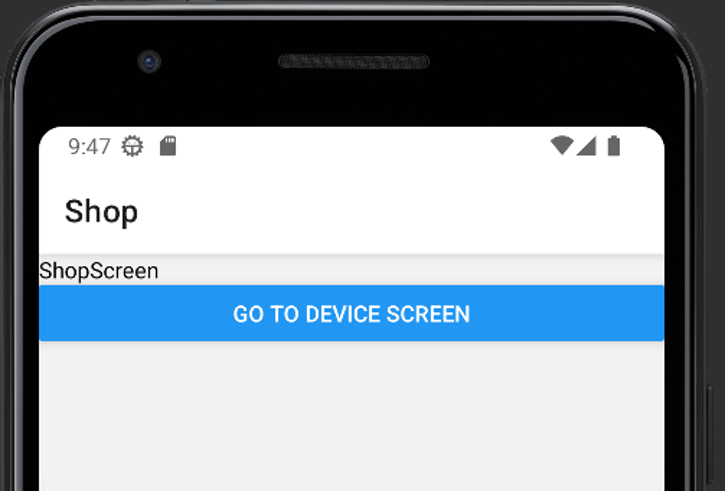

# Методические указания для React Native

Создаем проект командой

```
npx create-expo-app
```



Запускаем проект командой

```
npm start
```

Проект запущен, теперь надо где-нибудь его открыть. Можно установить на телефон приложение Expo Go (android) или просто открыть камеру и отсканировать `QR` на `iOS` и смотреть все изменения на телефоне, либо установить `Android Studio` и смотреть на все изменения там.

`developer.android.com/studio`

После установки у меня автоматически создался телефон. Открываем созданный проект в `Android Studio`. Справа нажимаем на `Device Manager`, и запускаем телефон. Ждем, пока он настроится, после видим это


Возвращаемся туда, где был запущен проект, либо можно остаться работать в `Android Studio`.


Нажимаем `a`, чтобы открыть проект на андроиде.

Проект будет запускаться долго, когда запустится, мы увидим наш `hello world` на `RN`.


Но так делать что-то неудобно, поэтому ПКМ по названию телефона, `View Mode` и выбираем Window. Уже удобнее


Для начала настроим роутинг в нашем приложении.

```
npm install @react-navigation/native @react-navigation/native-stack
```

```
expo install react-native-screens react-native-safe-area-context
```

Позднее может появиться ошибка, что `react-native-safe-area-context` есть как зависимость, но не установлена, тогда нужно просто написать

```
npm i
```

Создаем папку `screens`, в ней создадим две страницы – главную страницу магазина(`ShopScreen.jsx`) и страницу товара(`DeviceScreen.jsx`)

`ShopScreen.jsx`

```js
import { View, Text, Button } from 'react-native';
import React from 'react';

export default function ShopScreen({ navigation }) {
    return (
        <View>
            <Text>ShopScreen</Text>
            <Button title='Go to device screen' onPress={() => navigation.navigate('Device')} />
        </View>
    );
}
```

`DeviceScreen.jsx`

```js
import { View, Text } from 'react-native';
import React from 'react';

export default function DeviceScreen() {
    return (
        <View>
            <Text>DeviceScreen</Text>
        </View>
    );
}
```

А также изменим `App.js`

```js
import { NavigationContainer } from '@react-navigation/native';
import { createNativeStackNavigator } from '@react-navigation/native-stack';
import ShopScreen from './screens/ShopScreen';
import DeviceScreen from './screens/DeviceScreen';

const Stack = createNativeStackNavigator();

export default function App() {
    return (
        <NavigationContainer>
            <Stack.Navigator>
                <Stack.Screen name='Shop' component={ShopScreen} />
                <Stack.Screen name='Device' component={DeviceScreen} />
            </Stack.Navigator>
        </NavigationContainer>
    );
}
```

Теперь с главной страницы по кнопке мы можем перейти на страницу телефона


Теперь займемся хранилищем, а после визуализируем все данные

```js
npm i react-redux @reduxjs/toolkit axios
```

создаем в папке `store` файл `index.js`

```js
import { configureStore } from '@reduxjs/toolkit';

export const store = configureStore({ reducer: {} });
```

Оборачиваем наше приложение в `Provider`

```js
import { NavigationContainer } from '@react-navigation/native';
import { createNativeStackNavigator } from '@react-navigation/native-stack';
import ShopScreen from './screens/ShopScreen';
import DeviceScreen from './screens/DeviceScreen';
import { store } from './store';
import { Provider } from 'react-redux';

const Stack = createNativeStackNavigator();

export default function App() {
    return (
        <Provider store={store}>
            <NavigationContainer>
                <Stack.Navigator>
                    <Stack.Screen name='Shop' component={ShopScreen} />
                    <Stack.Screen name='Device' component={DeviceScreen} />
                </Stack.Navigator>
            </NavigationContainer>
        </Provider>
    );
}
```

Теперь в папке `store` создаем наш слайс - `deviceSlice.js`

```js
import { createSlice } from '@reduxjs/toolkit';

const initialState = {
    devices: [],
    device: {},
};

export const deviceSlice = createSlice({
    name: 'device',
    initialState,
    reducers: {
        setDevices: (state, { payload }) => {
            console.log('setDevices');
            state.devices = payload;
        },
        setDevice: (state, { payload }) => {
            console.log('setDevice');
            state.device = payload;
        },
        resetDevice: (state) => {
            console.log('resetDevice');
            state.device = {};
        },
    },
});

export const deviceReducer = deviceSlice.reducer;

export const { setDevices, setDevice, resetDevice } = deviceSlice.actions;
```

Если не уверены в том, что данные приходят так, как вы думаете, всегда можно написать `console.log(payload)` внутри редьюсера и убедиться

И добавляем его в `store`

```js
import { configureStore } from '@reduxjs/toolkit';
import { deviceReducer } from './deviceSlice';

export const store = configureStore({ reducer: { device: deviceReducer } });
```

Создаем папку `API` и в ней `index.js`

```js
import axios from 'axios';

export const axiosInstance = axios.create({ baseURL: 'http://192.168.0.104:5000/api' });
```

!!! обязательно `url` в таком виде, не `localhost`, иначе запросы будут падать
Upd: что надо сделать, чтобы запустить сервер на подобном адресе

1. Пишем в терминале ipconfig и ищем IPv4-адрес в разделе `Адаптер беспроводной локальной сети Беспроводная сеть` - в моем случае `192.168.125.34`
2. Запускаем сервер командой `python manage.py runserver 192.168.125.34:8000`
3. Если мы перейдем по этой ссылке, то в браузере будет ошибка, в которой сказано про `ALLOWED_HOSTS` - открываем `settings.py`, ищем `ALLOWED_HOSTS` и записываем в массив адрес - что-то вроде такого `ALLOWED_HOSTS = ['192.168.125.34']`
   Важно, если вы пришли сдавать лабу, а у вас все упало, повторите все эти действия и не забудьте поменять `baseURL` в `axiosInstance`

Создаем в папке components файл `DeviceCard.jsx`

```js
import { View, Text } from 'react-native';
import React from 'react';

export default function DeviceCard(props) {
    return (
        <View>
            <Text>{props.title}</Text>
        </View>
    );
}
```

После этого на странице с помощью `useEffect` отправляем запрос и через `dispatch` записываем данные в хранилище

```js
import { View } from 'react-native';
import { useDispatch, useSelector } from 'react-redux';
import React, { useEffect } from 'react';
import { axiosInstance } from '../api';
import { setDevices } from '../store/deviceSlice';
import DeviceCard from '../components/DeviceCard';

export default function ShopScreen({ navigation }) {
    const dispatch = useDispatch();
    const { devices } = useSelector((store) => store.device);

    useEffect(() => {
        async function getAllDevices() {
            await axiosInstance.get('/device').then((response) => dispatch(setDevices(response?.data)));
        }
        getAllDevices();
    }, [dispatch]);

    return <View>{!!devices && devices.map((device) => <DeviceCard key={device.id} {...device} />)}</View>;
}
```

И после сохранения видим в консоли заветное:


Теперь наведем немного красоты и сделаем нормальную карточку товара, в моем случае телефона

```js
import { ScrollView, StyleSheet, View } from 'react-native';
import { useDispatch, useSelector } from 'react-redux';
import React, { useEffect } from 'react';
import { axiosInstance } from '../api';
import { setDevices } from '../store/deviceSlice';
import DeviceCard from '../components/DeviceCard';

export default function ShopScreen({ navigation }) {
    const dispatch = useDispatch();
    const { devices } = useSelector((store) => store.device);

    useEffect(() => {
        async function getAllDevices() {
            await axiosInstance.get('/device').then((response) => dispatch(setDevices(response?.data)));
        }
        getAllDevices();
    }, [dispatch]);

    return (
        <ScrollView>
            <View style={styles.page}>
                {!!devices &&
                    devices.map((device) => <DeviceCard key={device.id} {...device} navigation={navigation} />)}
            </View>
        </ScrollView>
    );
}

const styles = StyleSheet.create({
    page: {
        display: 'flex',
        width: '100%',
        justifyContent: 'center',
        alignItems: 'center',
        backgroundColor: '#2a2a2a',
    },
});
```

```js
import { View, Text, StyleSheet, Image, Button } from 'react-native';
import React from 'react';

export default function DeviceCard({ navigation, ...props }) {
    const handlePress = () => {
        navigation.navigate('Device', { id: props.id });
    };

    return (
        <View style={styles.card}>
            <Image
                style={styles.image}
                source={{ uri: `http://192.168.0.104:5000/${props.image}` }}
                resizeMode='contain'
            />
            <View style={styles.container}>
                <Text style={styles.brandTitle}>{props.brand.title}</Text>
                <View style={styles.row}>
                    <Text style={styles.text}>{props.title}</Text>
                    <Text style={styles.text}>{props.price} р.</Text>
                </View>
            </View>
            <Button title='View details' onPress={handlePress} />
        </View>
    );
}

const styles = StyleSheet.create({
    card: {
        display: 'flex',
        justifyContent: 'flex-start',
        alignItems: 'center',
        flexDirection: 'column',
        width: 320,
        backgroundColor: '#303030',
        borderRadius: 12,
        padding: 24,
        gap: 12,
        margin: 8,
    },
    image: { height: 320, alignSelf: 'stretch' },
    container: { display: 'flex', width: '100%', margin: 8 },
    row: { display: 'flex', flexDirection: 'row', justifyContent: 'space-between' },
    brandTitle: { color: '#4287f5', fontSize: 16 },
    text: { color: '#f0f0f0', fontSize: 16 },
});
```



И посмотрим, что мы передали вместе с нажатием параметр – `id` товара (функция `handlePress`)

```js
import { View, Text } from 'react-native';
import React from 'react';

export default function DeviceScreen({ route }) {
    const { id } = route.params;
    return (
        <View>
            <Text>{id}</Text>
        </View>
    );
}
```

И перейдя на страницу, мы увидим наш переданный параметр


Теперь займемся вторым запросом на получение данных о конкретном товаре

```js
import { View, Text } from 'react-native';
import { useDispatch, useSelector } from 'react-redux';
import React, { useEffect } from 'react';
import { resetDevice, setDevice } from '../store/deviceSlice';
import { axiosInstance } from '../api';

export default function DeviceScreen({ route }) {
    const { id } = route.params;
    const dispatch = useDispatch();
    const { device } = useSelector((store) => store.device);
    useEffect(() => {
        async function getOneDevice() {
            await axiosInstance.get(`/device/${id}`).then((response) => dispatch(setDevice(response?.data)));
        }
        getOneDevice();
        return () => {
            dispatch(resetDevice());
        };
    }, [dispatch]);
    return (
        <View>
            <Text>{device.title}</Text>
        </View>
    );
}
```

В терминале видим лог о том, что данные записались в хранилище


А на странице теперь видим информацию о названии товара


Теперь вам осталось только вывести всю информацию о товаре, аналогично компоненту `DeviceCard`

Если у вас всё работало, ответы с сервера приходили, но через время запросы начали падать, обновите `URL` бэкенда
