# Как поставить Apache kafka на Windows Linux

## Предлагаем вам два способа разворачивания кафки на вашем устройстве с докером и без. Если вы используете Windows, то рекомендуем воспользоваться докером

# Без докера

1. Необходимо скачать apache [kafka](https://kafka.apache.org/downloads) с официального сайта 
2. Рекомендую на диске С создать папку kafka_logs с папками для записи логов

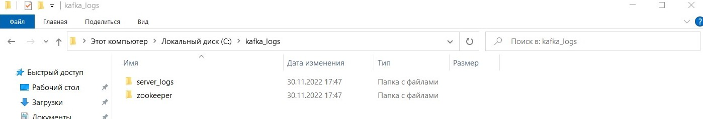

3. Откроем zookeeper.properties изменим параметр записи логов по созданному выше пути

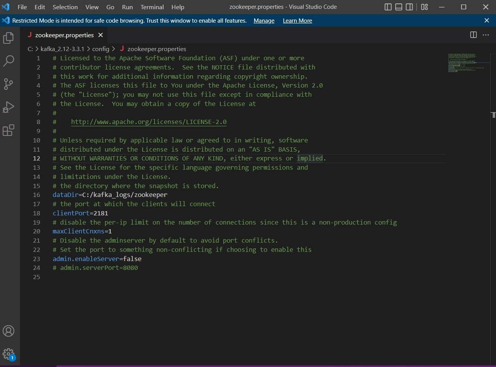

4. Аналогично откроем откроем server.properties изменим zookeeper.connection.timeout.ms=60000 и пропишем путь к лог файлу

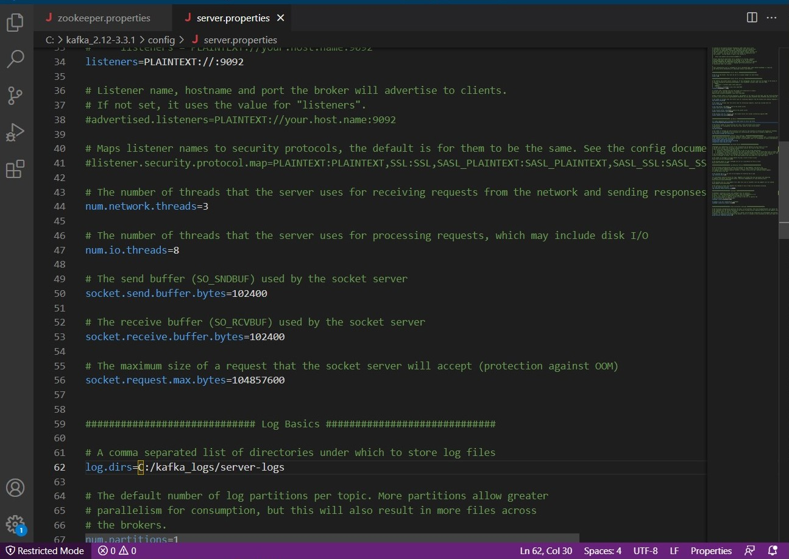

5. Скачаем [Java](https://www.java.com/ru/download/) Важно, чтобы в пути, по которому вы скачиваете Java не было пробелов, чтоюы избежать проблемы запуска в дальнейшем
6. В вашем компьютере по пути: 
*Система -> Дополнительные параметры системы -> Дополнительно -> Переменные среды* 
Необходимо добавить в PATH путь к Java, а также переменную JAVA_HOME с путём к JAVA

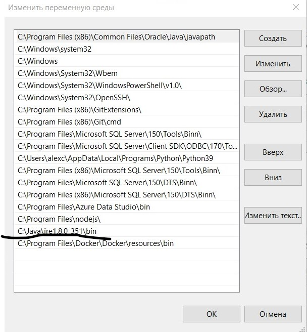
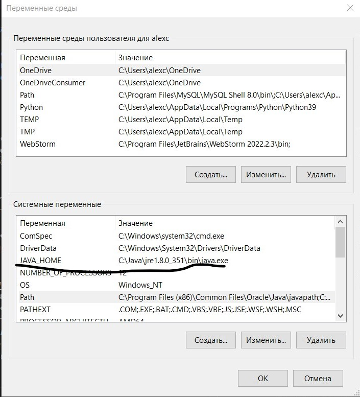

7. Создайте проект и убедитесь, что Java доступна

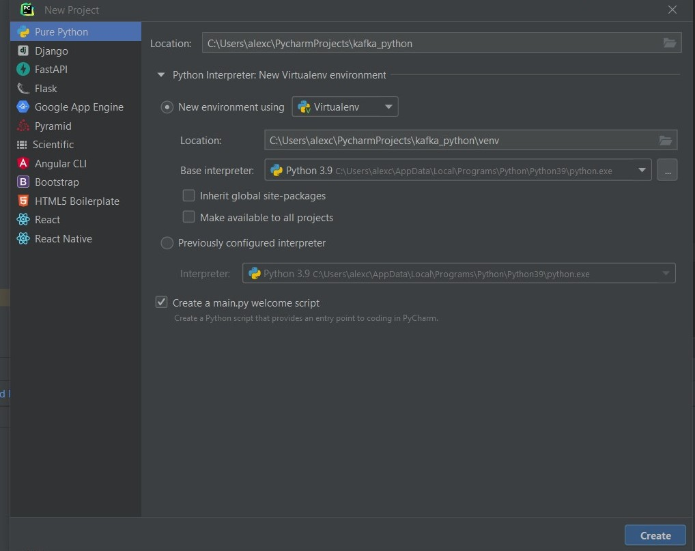
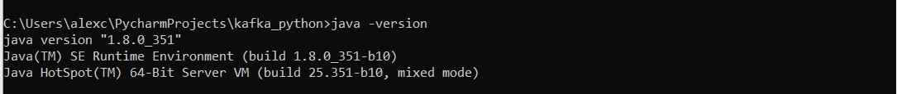

8. Start Zookeeper:
C:/kafka_2.12-3.2.0/bin/windows/zookeeper-server-start.bat C:/kafka_2.12-3.2.0/config/zookeeper.properties

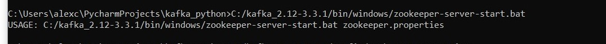

9. Start kafka:
Start Kafka-server:
C:/kafka_2.12-3.2.0/bin/windows/kafka-server-start.bat C:/kafka_2.12-3.2.0/config/server.properties

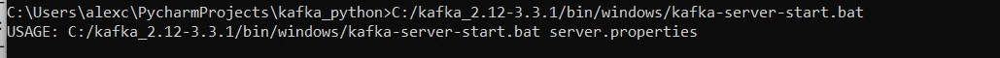

10. Не забудьте изменить путь под вашу версию кафки.
Готово!

# С докером
1. Скачайте [докер](https://www.docker.com/products/docker-desktop/) и WSL2 (В Docker desktop будет ссылка)
2. Рекомендую ознакомиться с [документацией](https://learn.microsoft.com/ru-ru/windows/wsl/tutorials/wsl-containers)
3. В корень проекта, в котором вы будете работать поместить конфигурационный [файл](docker-compose.yml) 

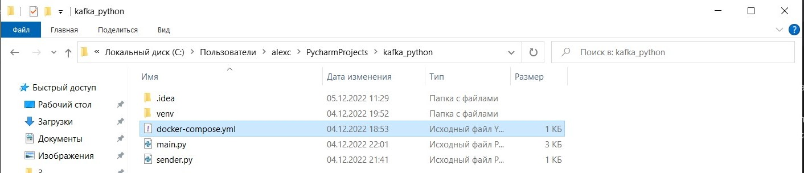

4. docker-compose.yml делается похоже на ручной запуск из первого пункта. Вот моё готовое решение:
5. В папке проекта напишите *docker compose up -d*
6. В docker должны появиться созданные контейнеры 

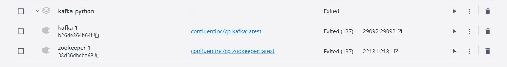

также можно проверить через *docker ps*

#### Готово. Успешной работы!
