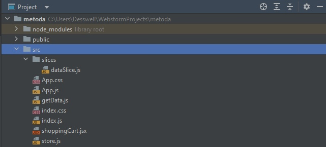
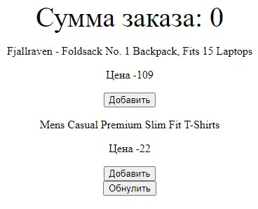
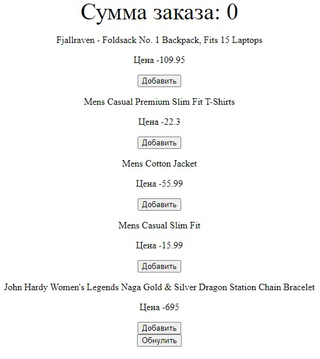

# Методические указания по выполнению менеджера состояний на Redux Toolkit

### Пару слов о менеджере состояний
Насколько вообще нужны менеджеры состояний вы можете прочесть в [Q&A habr](https://qna.habr.com/q/684020) или статью на [GitHub](https://gist.github.com/nodkz/41a5ee356581503033bd05104f5048bf)

## Установка библиотек react-redux и redux toolkit
В терминале/консоли нашего проекта прописываем команду `npm i react-redux` и `npm i @reduxjs/toolkit`

*Для понимания "что такое redux toolkit", "зачем он нужен" и т.д., прочтите документацию по [ссылке](https://redux-toolkit.js.org/usage/usage-guide)*

## Создадим небольшой проект с корзиной
### Структура проекта
В папке проекта `src`:

`getData.js` - пользовательский хук AJAX-запроса

`shoppingCart.jsx` - компонент для страницы

`store.js` - глобальное хранилище

В папке `slices`:

`dataSlice.js` - слайс



### Создадим store и slice

Начнем погружаться в Toolkit со слайсов. Сразу с главного. Что бы мы ни делали внутри слайсов, в конце концов они генерируют обычные редьюсеры и действия, которые затем передаются в Redux. То есть слайсы не добавляют никаких новых возможностей в сам Redux. Они автоматизируют рутину, сокращают количество кода и предоставляют более удобные "ручки" для управления действиями и состоянием.

Для создания слайса нам нужно как минимум три компонента: имя, начальное состояние, набор редьюсеров.

В директории проекта создаем папку slices и добавляем файл `dataSlice.js`. 

В нашем случае `dataSlice` - имя, `initialState` - начальное состояние и `reducers` - набор редьюсеров.

Под начальным состоянием понимается базовая структура данных
и какие-то статические данные, если они есть, например значение 0 для счетчика.
А вот те данные, которые нужно выкачать по API, к начальным не относятся.
Они заполняются уже потом, через действия (actions).

```JavaScript
import { createSlice } from "@reduxjs/toolkit"
import { useSelector } from "react-redux";


const dataSlice = createSlice({
    name: "data",
    // в initialState мы указываем начальное состояние нашего глобального хранилища
    initialState: {
        Data: []
    },
    // Редьюсеры в слайсах мутируют состояние и ничего не возвращают наружу
    reducers: {
        setData(state, {payload}) {
            state.Data = payload
        }
    }
})

export const useData = () =>
    useSelector((state) => state.ourData.Data)


export const {
    setData: setDataAction
} = dataSlice.actions


export default dataSlice.reducer
```
`Action` — это структуры, которые передают данные из вашего приложения в `store`.
Они являются единственными источниками информации для `store`.

Мы можем считывать данные из хранилища с помощью `useSelector()` (в нашем случае создали функцию `useData`) 
и отправлять действия с помощью `useDispatch()`


Теперь создадим файл `store.js` в директории проекта.
Простейшим способом создания и настройки хранилища является передача в `configureStore()` корневого `reducer` 
в качестве аргумента `reducer`, с вызовом `combineReducers()`:

```JavaScript
import { combineReducers, configureStore } from "@reduxjs/toolkit"
import dataReducer from "./slices/dataSlice"


export default configureStore({
    reducer: combineReducers({
        ourData: dataReducer
    })
})
```
Закончим с верхнего уровня. Здесь нам понадобится компонент `Provider`, который содержит хранилище и прокидывает его вглубь дерева компонентов через контекст.

В файле `index.js` добавим `Provider`
```JavaScript
import React from 'react';
import ReactDOM from 'react-dom/client';
import App from './App'
import store from "./store";
import { Provider } from "react-redux";


const root = ReactDOM.createRoot(
    document.getElementById('root')
);


root.render(
    <React.StrictMode>
        <Provider store={store}>
            <App />
        </Provider>
    </React.StrictMode>
);
```

Теперь у нас есть глобальное хранилище. Применим его на практике.

### Практическое применение глобального хранилища без AJAX запроса

Допустим нам нужно создать корзину, с помощью которой мы хотим считать сумму наших покупок.
Добавим в начальное состояния `Data` глобального хранилища несколько товаров, и создадим новое начальное
состояние `SumShoppingCart` в котором мы будем хранить сумму нашей покупки. 
(Здесь мы объявили за начальное состояние 0, так как это счетчик)

Изменим наш `dataSlice.js`

Здесь `reducer` `setData()` и `action` `setDataAction` пригодятся позже.

```JavaScript
import { createSlice } from "@reduxjs/toolkit"
import { useSelector } from "react-redux";


const dataSlice = createSlice({
    name: "data",
    initialState: {
        Data: [
            {
                "id": 1,
                "title": "Fjallraven - Foldsack No. 1 Backpack, Fits 15 Laptops",
                "price": 109,
                "category": "men's clothing",
                "rating": {
                    "rate": 3.9,
                    "count": 120
                }
            },
            {
                "id":2,
                "title":"Mens Casual Premium Slim Fit T-Shirts ",
                "price":22,
                "category":"men's clothing",
                "rating":{
                    "rate":4.1,
                    "count":259
                }
            }
        ],
        SumShoppingCart: 0,
    },
    reducers: {
        setData(state, {payload}) {  // изменяем состояние на полученные данные
            state.Data = payload
        },
        setSum(state, {payload}) {  // суммируем цены выбранных товаров
            state.SumShoppingCart += payload
        },
        delSum(state) {  // обнуляем сумму выбранных товаров
            state.SumShoppingCart = 0
        }
    }
})

export const useData = () =>
    useSelector((state) => state.ourData.Data)

export const useSum = () =>
    useSelector((state) => state.ourData.SumShoppingCart)

export const {
    setData: setDataAction,
    setSum: setSumAction,
    delSum: delSumAction
} = dataSlice.actions


export default dataSlice.reducer
```

Создадим компонент `shoppingCart.jsx`

```JavaScript
import React from 'react'
import {delSumAction, setSumAction, useData, useSum} from "./slices/dataSlice";
import './App.css'
import {useDispatch} from "react-redux";

export default function ShoppingCart(){
    const dispatch = useDispatch()
    const sum = useSum()
    const data = useData()
    return(
        <div>
            <div className="large"> Сумма заказа: { sum }</div>
            {
                data.map((good) =>
                    <div key={good.id}>
                        <p>
                        { good.title }
                        </p>
                        <p> Цена -
                            { good.price }
                        </p>
                        <button onClick={ () => {
                            dispatch(setSumAction( good.price ))
                            }}>
                            Добавить
                        </button>
                    </div>
                )
            }
            <button onClick={() => {
                dispatch(delSumAction())
            }
            }>
                Обнулить
            </button>
        </div>
    )
}
```
И выведем наш компонент на страницу. В `app.js`

```JavaScript
import './App.css';
import ShoppingCart from "./shoppingCart";

function App() {
    return (
        <div className="App">
            <ShoppingCart/>
        </div>
    );
}

export default App;
```

И должно получиться




### Практическое применение глобального хранилища с AJAX запросом

Задача осталась той же, что и в предыдущем пункте, однако мы будем получать товары с помощью AJAX запроса,
а не изначально их хранить в `initialState`

Изменим наш `dataSlice.js`

В `initialState` изменим начальное состояние, опустошив Data, так как будем его изменять, беря данные из API.

```JavaScript
initialState: {
        Data: [], 
        SumShoppingCart: 0,
},
```
Установим библиотеку `axios` командой `npm i axios`

Создадим пользовательский хук с AJAX запросом `getData.js`, здесь будем использовать ранее установленную библиотеку `axios`
В нем мы получаем наши данные с помощью функции `axios.get` и изменяем наше состояние глобального хранилища на полученные данные
с помощью метода `useDispatch()`. Создание пользовательских хуков позволяет нам
перенести логику компонентов в функции, которые можно повторно использовать.

`getData.js`:

```JavaScript
import {useEffect} from "react";
import axios from "axios"
import {setDataAction} from "./slices/dataSlice";
import {useDispatch} from "react-redux";

export function GetData() {
    const dispatch = useDispatch()
    async function fetchData() {
        const response = await axios.get('https://fakestoreapi.com/products?limit=5') // получение данных с API
        dispatch(setDataAction(response.data)) 
    }
    useEffect(() => {
        fetchData()
    }, [])
}
```
Как видно, мы применили хук `useDispatch()` для того, чтобы отправить наше действие в `reducer`, 
`setDataAction` - действием по которому запишем товары в наше глобальное хранилище. 


Далее в файле `shoppingCart.jsx` вызовем наш хук

```JavaScript
import React from 'react'
import {delSumAction, setSumAction, useData, useSum} from "./slices/dataSlice";
import './App.css'
import {useDispatch} from "react-redux";
import {GetData} from "./getData";

export default function ShoppingCart(){
    const dispatch = useDispatch()
    GetData()  // вызов хука
    const sum = useSum()
    const data = useData()
    return(
        <div>
            <div className="large"> Сумма заказа: { sum }</div>
            {
                data.map((good) =>
                    <div key={good.id}>
                        <p>
                        { good.title }
                        </p>
                        <p> Цена -
                            { good.price }
                        </p>
                        <button onClick={ () => {
                            dispatch(setSumAction( good.price ))
                            }}>
                            Добавить
                        </button>
                    </div>
                )
            }
            <button onClick={() => {
                dispatch(delSumAction())
            }
            }>
                Обнулить
            </button>
        </div>
    )
}
```

И в конечном итоге получим

