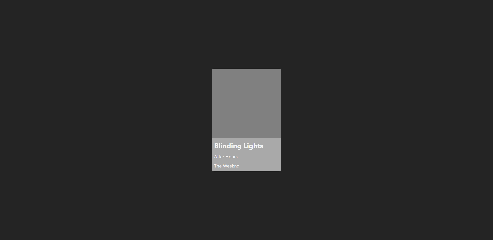
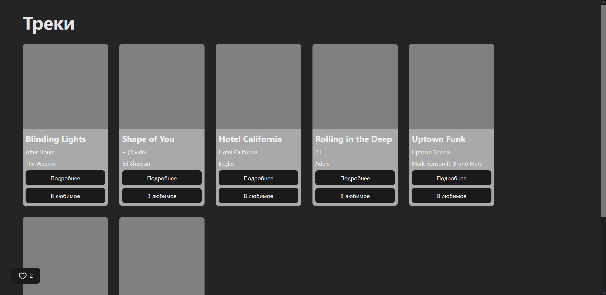

# Методические указания по созданию микрофронтенда на Svelte в приложении на React

## Задачи:

1. Создать простое приложение на React со страницей списка услуг и одной услуги
2. Добавить в проект Svelte и встроить примитивный svelte-компонент в страницу
3. Добавить верстку иконки корзины в svelte компонент
4. Добавить переход на страницу услуги при нажатии на иконку
5. Привязать svelte компонент к бэкенду

## 1. Создание приложения на React

Наше приложение будет собираться с помощью Vite. Инициализируем проект Vite+React+TypeScript:

```bash
$ npm create vite@latest react-svelte-mfe-manual
Need to install the following packages:
create-vite@8.2.0
Ok to proceed? (y) y


> npx
> create-vite react-svelte-mfe-manual

│
◇  Select a framework:
│  React
│
◇  Select a variant:
│  TypeScript
│
◇  Use rolldown-vite (Experimental)?:
│  No
│
◇  Install with npm and start now?
│  Yes
│
```

Если в последней опции выбрано Yes, будет запущен Vite dev server, и в браузере по адресу http://localhost:5173 можно будет открыть наше приложение.

Зайдем в директорию созданного проекта:

```bash
cd react-svelte-mfe-manual
```

Запустим сервер Vite вручную:

```bash
npm run dev
```

Установим react-router:

```bash
npm i react-router
```

Теперь создадим компонент услуги (музыкальный трек), компоненты страниц списка услуг и одной услуги, их соответствующие CSS файлы:

```tsx
// src/components/TrackCard.tsx

import { Link } from "react-router";
import "./TrackCard.css";

export interface TrackProps {
  id: number;
  title: string;
  album: string;
  author: string;
  page?: "tracks" | "track";
}

export function TrackCard({ id, title, album, author, page }: TrackProps) {
  return (
    <div className="track-card">
      <div className="track-card__cover"></div>
      <div className="track-card__body">
        <h2>{title}</h2>
        <p>{album}</p>
        <p>{author}</p>
        {page === "tracks" && (
          <Link to={`/tracks/${id}`}>
            <button>Подробнее</button>
          </Link>
        )}
        {page === "tracks" && (
          <button onClick={() => alert("добавлено")}>В любимое</button>
        )}
      </div>
    </div>
  );
}
```

```css
/* src/components/TrackCard.css */

.track-card {
  width: 15rem;
  background-color: darkgray;
  border-radius: 8px;
  overflow: hidden;
}

.track-card .track-card__cover {
  width: 100%;
  aspect-ratio: 1;
  background-color: gray;
}

.track-card .track-card__body {
  width: 100%;
  padding: 0.5rem;
  display: flex;
  flex-direction: column;
  gap: 0.5rem;
}

.track-card .track-card__body * {
  width: 100%;
  margin: 0;
}
```

```tsx
// src/pages/TracksPage.tsx

import { useState } from "react";
import { TrackCard, type TrackProps } from "../components/TrackCard";
import "./TracksPage.css";
import { Api } from "../api";

export function TracksPage() {
  const [tracks, setTracks] = useState<TrackProps[]>();

  const loadTracks = async () => {
    setTracks(await Api.getTracks());
  };

  if (tracks === undefined) {
    loadTracks();
  }

  return (
    <>
      <h1>Треки</h1>
      <div className="tracks">
        {tracks ? (
          tracks.map((track) => (
            <TrackCard {...track} page="tracks" key={track.id} />
          ))
        ) : (
          <p>Загрузка...</p>
        )}
      </div>
    </>
  );
}
```

```css
/* src/pages/TracksPage.css */

.tracks {
  width: 100%;
  margin-bottom: 2rem;
  display: flex;
  flex-direction: row;
  flex-wrap: wrap;
  gap: 2rem;
}
```

```tsx
// src/pages/TrackPage.tsx

import { useState } from "react";
import { TrackCard, type TrackProps } from "../components/TrackCard";
import "./TrackPage.css";
import { useParams } from "react-router";
import { Api } from "../api";

export function TrackPage() {
  const [track, setTrack] = useState<TrackProps>();
  const { id } = useParams();

  const loadTrack = async () => {
    const idNum = Number(id);
    setTrack(await Api.getTrackByID(idNum));
  };

  if (track === undefined) {
    loadTrack();
  }

  return (
    <div className="track">
      {track ? <TrackCard {...track} page="track" /> : <p>Загрузка...</p>}
    </div>
  );
}
```

```css
/* src/pages/TrackPage.css */

.track {
  width: 100%;
  display: flex;
  justify-content: center;
  align-items: center;
}
```

Настроим роутер:

```tsx
// src/App.tsx

import { BrowserRouter, Route } from "react-router";
import { TracksPage } from "./pages/TracksPage";
import { TrackPage } from "./pages/TrackPage";
import { Routes } from "react-router";
import "./App.css";

function App() {
  return (
    <BrowserRouter>
      <Routes>
        <Route path="/tracks" element={<TracksPage />} />
        <Route path="/tracks/:id" element={<TrackPage />} />
      </Routes>
    </BrowserRouter>
  );
}

export default App;
```

Изменим глобальные стили:

```css
/* src/App.css */

#root {
  width: 100%;
  padding: 0 4rem;
}

#root * {
  box-sizing: border-box;
}
```

Добавим модуль для работы с API:

```ts
// src/api.ts

import type { TrackProps } from "./components/TrackCard";

const API_BASE = "http://localhost:9000";

export const Api = {
  async getTracks(): Promise<TrackProps[]> {
    const response = await fetch(`${API_BASE}/tracks`);
    return response.json();
  },

  async getTrackByID(id: number): Promise<TrackProps> {
    const response = await fetch(`${API_BASE}/tracks/${id}`);
    return response.json();
  },
};
```

Создадим простой бэкенд на Express. Установим зависимости:

```bash
npm i express cors
```

Создадим скрипт бэкенда:

```js
// backend.js

import express from "express";
import cors from "cors";

const app = express();
const PORT = 9000;

const TRACKS = [
  {
    id: 1,
    title: "Blinding Lights",
    album: "After Hours",
    author: "The Weeknd",
  },
  {
    id: 2,
    title: "Shape of You",
    album: "÷ (Divide)",
    author: "Ed Sheeran",
  },
  {
    id: 3,
    title: "Hotel California",
    album: "Hotel California",
    author: "Eagles",
  },
  {
    id: 4,
    title: "Rolling in the Deep",
    album: "21",
    author: "Adele",
  },
  {
    id: 5,
    title: "Uptown Funk",
    album: "Uptown Special",
    author: "Mark Ronson ft. Bruno Mars",
  },
  {
    id: 6,
    title: "Levitating",
    album: "Future Nostalgia",
    author: "Dua Lipa",
  },
  {
    id: 7,
    title: "Hey Jude",
    album: "Hey Jude",
    author: "The Beatles",
  },
];

app.use(cors());

app.get("/tracks", (req, res) => {
  res.json(TRACKS);
});

app.get("/tracks/:id", (req, res) => {
  const track = TRACKS.find((track) => track.id === Number(req.params.id));
  if (track === undefined) {
    res.sendStatus(404);
    return;
  }
  res.json(track);
});

app.listen(PORT, () => {
  console.log(`API listening on port ${PORT}`);
});
```

Запустим его:

```bash
node backend.js
```

Перейдем на http://localhost:5173/tracks и убедимся, что приложение работает корректно. Треки должны отображаться, и должен работать переход по кнопке "Подробнее" на страницу трека.




## 2. Добавление Svelte в проект

Установим Svelte, его плагины для Vite и eslint:

```bash
npm i svelte
npm i @sveltejs/vite-plugin-svelte eslint-plugin-svelte -D
```

Добавим установленные плагины в конфигурации Vite и eslint:

```ts
// vite.config.ts

import { defineConfig } from "vite";
import react from "@vitejs/plugin-react";
import { svelte } from "@sveltejs/vite-plugin-svelte";

// https://vite.dev/config/
export default defineConfig({
  plugins: [react(), svelte()],
});
```

```js
// eslint.config.js

import js from "@eslint/js";
import globals from "globals";
import reactHooks from "eslint-plugin-react-hooks";
import reactRefresh from "eslint-plugin-react-refresh";
import svelte from "eslint-plugin-svelte";
import tseslint from "typescript-eslint";
import { defineConfig, globalIgnores } from "eslint/config";

export default defineConfig([
  globalIgnores(["dist"]),
  {
    files: ["**/*.{ts,tsx,svelte}"],
    extends: [
      js.configs.recommended,
      tseslint.configs.recommended,
      reactHooks.configs.flat.recommended,
      reactRefresh.configs.vite,
      svelte.configs.recommended,
    ],
    languageOptions: {
      ecmaVersion: 2020,
      globals: globals.browser,
    },
  },
]);
```

Создадим примитивный Svelte компонент:

```svelte
<!-- src/components/LikedIcon.svelte -->

<p>Привет от Svelte!</p>
```

Добавим его на страницу списка треков:

```tsx
// src/pages/TracksPage.tsx

import { useLayoutEffect, useRef, useState } from "react";
import { TrackCard, type TrackProps } from "../components/TrackCard";
import "./TracksPage.css";
import { Api } from "../api";
import LikedIcon from "../components/LikedIcon.svelte";
import { mount, unmount } from "svelte";

export function TracksPage() {
  const [tracks, setTracks] = useState<TrackProps[]>();
  const likedIconRef = useRef<HTMLDivElement>(null);

  useLayoutEffect(() => {
    const likedIcon = mount(LikedIcon, { target: likedIconRef.current! });
    return () => {
      unmount(likedIcon);
    };
  }, []);

  const loadTracks = async () => {
    setTracks(await Api.getTracks());
  };

  if (tracks === undefined) {
    loadTracks();
  }

  return (
    <>
      <h1>Треки</h1>
      <div className="tracks">
        {tracks ? (
          tracks.map((track) => (
            <TrackCard {...track} page="tracks" key={track.id} />
          ))
        ) : (
          <p>Загрузка...</p>
        )}
      </div>
      <div ref={likedIconRef}></div>
    </>
  );
}
```

Мы импортировали компонент LikedIcon.

Затем создали пустой div, в который будет монтирован наш компонент. При желании можно использовать родительский компонент с детьми. Тогда Svelte компонент будет монтироваться в начало родителя, не мешая остальным детям. Однако текущий подход гораздо более читаемый.

Атрибут `ref={likedIconRef}` сохраняет ссылку на наш div в переменную likedIconRef. Эта переменная получена из хука useRef. Данный хук подобен useState с двумя основными отличиями. Во-первых, этот хук возвращает только одно значение - саму переменную, свойство .current которой мы можем свободно изменять. Во-вторых, изменение этой переменной не вызывает перерисовку компонента. useRef полезен, когда необходимо хранить состояние, не влияющее напрямую на внешний вид компонента. Если здесь использовать useState, возникнут проблемы с чтением состояния сразу после его изменения (setState) и появятся лишние перерисовки.

Само монтирование происходит в хуке useLayoutEffect. Его отличие от useEffect в том, что useEffect вызывается асинхронно после отрисовки браузером страницы, а useLayoutEffect - синхронно до отрисовки. Данный хук лучше использовать, когда необходимо получить данные из обновленных состояний/DOM и изменить DOM, не вызывая повторной отрисовки страницы.

Функция, возвращаемая из колбека useLayoutEffect работает аналогично таковой в useEffect: это функция очистки, вызывающаяся при каждом следующем вызове колбека useLayoutEffect и при финальном демонтировании компонента. В ней мы демонтируем Svelte компонент. Вы можете убрать эту функцию и увидеть, что Svelte компонентов будет два после отрисовки данных из API.

## 3. Верстка иконки корзины

Начнем с добавления непосредственно иконки. Наша корзина - список любимых треков. Нужна иконка сердечка. Для удобного встраивания иконок на фронтенде существует библиотека иконок Lucide. Она имеет версии для всех популярных фреймворков, включая React и Svelte.

Установим Lucide для Svelte:

```bash
npm i @lucide/svelte
```

Теперь перейдем на сайт https://lucide.dev и в строку поиска введем "heart". Нажмем на иконку сердечка и внизу страницы на стрелочку кнопки "Copy ..." > "Copy Svelte". В буфере обмена будет готовый Svelte компонент с выбранной иконкой: `<Heart />`.

Теперь вокруг этой иконки наверстаем наш компонент:

```svelte
<!-- src/components/LikedIcon.svelte -->

<script lang="ts">
  import { Heart } from "@lucide/svelte";
  import "./LikedIcon.css";

  const count = 2;
</script>

<button
  class="liked-icon"
  onclick={() => alert(`У Вас ${count} любимых трека.`)}
>
  <Heart />
  {#if count > 0}
    <span>{count}</span>
  {/if}
</button>
```

```css
/* src/components/LikedIcon.css */

.liked-icon {
  position: fixed;
  bottom: 2rem;
  left: 2rem;
  z-index: 10;
  display: flex;
  flex-direction: row;
  gap: 0.5rem;
}
```

Страница списка треков должна выглядеть так:



## 4. Переход на страницу при нажатии

Чтобы переходить между страницами в React, нужна функция navigate, получаемая из хука useNavigate. Но хуки нельзя размещать вне React компонентов. Если попытаться использовать хук в Svelte компоненте, в браузере мы получим соответствующую ошибку.

Чтобы обойти это ограничение, воспользуемся передачей props из React в Svelte компонент. Получим navigate в TracksPage и передадим в LikedIcon:

```tsx
// src/pages/TracksPage.tsx

import { useLayoutEffect, useRef, useState } from "react";
import { TrackCard, type TrackProps } from "../components/TrackCard";
import "./TracksPage.css";
import { Api } from "../api";
import LikedIcon from "../components/LikedIcon.svelte";
import { mount, unmount } from "svelte";
import { useNavigate } from "react-router";

export function TracksPage() {
  const [tracks, setTracks] = useState<TrackProps[]>();
  const likedIconRef = useRef<HTMLDivElement>(null);
  const navigate = useNavigate();

  useLayoutEffect(() => {
    const likedIcon = mount(LikedIcon, {
      target: likedIconRef.current!,
      props: { navigate },
    });
    return () => {
      unmount(likedIcon);
    };
  }, [navigate]);

// ...
```

Добавим переход на страницу и сделаем, чтобы при отсутствии любимых треков иконка была некликабельной и полупрозрачной:

```svelte
<!-- src/components/LikedIcon.svelte -->

<script lang="ts">
  import { Heart } from "@lucide/svelte";
  import type { NavigateFunction } from "react-router";
  import "./LikedIcon.css";

  const { navigate }: { navigate: NavigateFunction } = $props();

  const request_id = 1;
  const count = 2;
</script>

<button
  class="liked-icon"
  class:liked-icon_disabled={count === 0}
  onclick={() => navigate(`/liked/${request_id}`)}
>
  <Heart />
  {#if count > 0}
    <span>{count}</span>
  {/if}
</button>
```

```css
/* src/components/LikedIcon.css */

/* ... */

.liked-icon_disabled {
  pointer-events: none;
  opacity: 0.5;
}
```

Чтобы не верстать страницу любимых треков, добавим немного кода напрямую в роутер:

```tsx
// src/App.tsx

// ...
<Route path="/tracks" element={<TracksPage />} />
<Route path="/tracks/:id" element={<TrackPage />} />
<Route
  path="/liked/:id"
  element={<p>Здесь будут ваши любимые треки</p>}
/>
// ...
```

Теперь при нажатии на иконку любимых треков нас должно переводить на страницу с надписью "Здесь будут ваши любимые треки".

## 5. Привязка к бэкенду

Добавим обработчик для /liked в скрипт бэкенда:

```js
// backend.js

// ...

function getRandomInt(max) {
  return Math.floor(Math.random() * max);
}

app.get("/liked", (req, res) => {
  const count = getRandomInt(TRACKS.length);
  res.json({
    request_id: count > 0 ? 1 + getRandomInt(4) : -1,
    count,
  });
});

// ...
```

Далее добавим соответствующую функцию на фронтенд:

```ts
// src/api.ts

// ...

async getLiked(): Promise<{ request_id: number; count: number }> {
  const response = await fetch(`${API_BASE}/liked`);
  return response.json();
},

// ...
```

Подключим эту функцию к компоненту иконки:

```svelte
<!-- src/components/LikedIcon.svelte -->

<script lang="ts">
  // ...
  import { Api } from "../api";
  import { onMount } from "svelte";

  const { navigate }: { navigate: NavigateFunction } = $props();

  let request_id = $state(-1);
  let count = $state(0);

  onMount(async () => {
    ({ request_id, count } = await Api.getLiked());
  });
</script>

<!-- ... -->
```

Теперь при каждой загрузке страницы списка треков мы будем получать с бэкенда случайную информацию о любимых треках.
