# Методические указания по выполнению задания для платформы iOS

## План

1. [Немного про SwiftUI](#немного-про-swiftui)
2. [Установка](#создание-проекта)
3. [Создание проекта](#создание-проекта)
4. [Мини приложение](#мини-приложение)
5. [Структура основного приложения](#структура-проекта)
6. [Начало разработки UI](#начало-разработки-ui)
7. [API](#этап-5-подключение-api)
8. [Итог](#итог)

## Немного про SwiftUI
SwiftUI - это фреймворк для создания пользовательских интерфейсов на языке программирования Swift. Он был представлен Apple на конференции WWDC 2019 и стал альтернативой фреймворку UIKit для разработки интерфейсов iOS, macOS, watchOS и tvOS.

### Плюсы:

- Декларативный подход к построению интерфейса:

- SwiftUI предлагает декларативный стиль программирования, в отличие от императивного стиля, используемого в UIKit.
Вы описываете, как должен выглядеть интерфейс и как он должен вести себя, а SwiftUI берет на себя заботу о деталях реализации.
Обновление интерфейса в реальном времени:

- SwiftUI автоматически обновляет интерфейс при изменении данных. Если ваши данные изменяются, интерфейс обновляется автоматически без явного управления обновлением.
Оптимизированная работа с данными:

- SwiftUI предлагает удобные средства для работы с данными через @State, @Binding, и другие свойства.
Он упрощает управление состоянием приложения и обеспечивает эффективное взаимодействие с интерфейсом.
Кроссплатформенность:

- Одним из ключевых преимуществ SwiftUI является поддержка кроссплатформенной разработки. Вы можете использовать его для создания интерфейсов не только для iOS, но и для macOS, watchOS и tvOS.
Компактность кода:

- Код на SwiftUI часто оказывается более компактным и читаемым по сравнению с кодом на UIKit. Вы можете достичь того же результата с меньшим количеством строк кода.
Предпросмотр и отладка:

- SwiftUI предоставляет удобные инструменты предварительного просмотра интерфейса внутри самого кода, что облегчает процесс разработки и редактирования.

### Минусы:
- Ограниченная совместимость:

- На момент последних данных, SwiftUI поддерживает версии iOS 13.0+, macOS 10.15+, watchOS 6.0+ и tvOS 13.0+. Это означает, что если ваше приложение должно поддерживать более ранние версии операционных систем, вам придется прибегнуть к использованию UIKit или AppKit.

- Отсутствие полной функциональности: Некоторые функции, доступные в UIKit/AppKit, на момент введения SwiftUI, могут не иметь полной поддержки или отсутствовать вовсе. В некоторых случаях разработчики могут быть вынуждены использовать UIKit/AppKit для определенных задач.

- Ограниченная документация и опыта: Так как SwiftUI является более новым фреймворком, документация и опыт разработки могут быть менее обширными по сравнению с UIKit. Возможно, некоторые вопросы будут требовать дополнительного исследования.

- Сложности с кастомизацией: В некоторых случаях создание кастомных и сложных интерфейсов в SwiftUI может быть сложнее, чем в UIKit, так как фреймворк создан для простоты и декларативности.

- Вероятность изменений в будущем: Поскольку SwiftUI еще развивается, возможны изменения в API и функциональности. Это может повлечь за собой необходимость внесения изменений в код при обновлении версии SwiftUI.

Проще говоря, язык ещё молод, а большинство компний продолжают поддерживать многотысячные проекты на UIKit. Некоторые начинают миксовать UIKit со SwiftUI, но польностью отказаться от кита - дорого. Но SwiftUI уже пригоден для написания новых приложений.

## Установка

Отлично, а теперь приступим к разработке. Для начала нам понадобится XCode.
Зайти на [сайт](https://xcodereleases.com/) и открыть вкладку Releases. Найти Xcode, совместимый с вашим устройством. Или можно зайти в AppStore и скачать там Xcode. После установки Xcode необходимо зарегистрировать собственный AppleID для подписи приложения. Для этого открыть Xcode->Settings->Accounts, нажать на кнопку + и выбрать AppleID.


## Создание проекта
Открываем Xcode. Нажимаем `Create New Project`. 


Выбираем iOS и App.


Product Name – указать название разрабатываемого приложения. Team – выбрать добавленный ранее AppleID. Organization Identifier – индификатор вашей организации. Т.к это ЛР, я задам свой гитхаб, можете задать что пожелаете в обратном порядке. Bundle Identifier конфигурируется автоматически, менять его не нужно. Interface – SwiftUI. Language: Swift Снимаем галочки с полей Core Data и Include Tests. Нажать Next.


Готово, приложение создано.
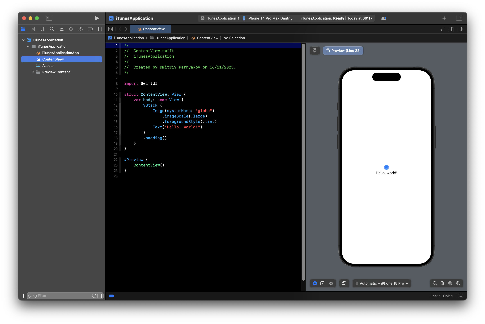

## Мини приложение

Сейчас мы напишем небольшой экран, чтобы немного познакомить вас со SwiftUI. У нас будет картинка, текст и кнопка. Для начала создадим SwiftUI файл `PlaygroundView.swift`. Для этого нажимаем на корневой файл правой кнопкой мыши, выбираме `New file...` и выбираем `SwiftUI View`. (Можно использовать command + N)


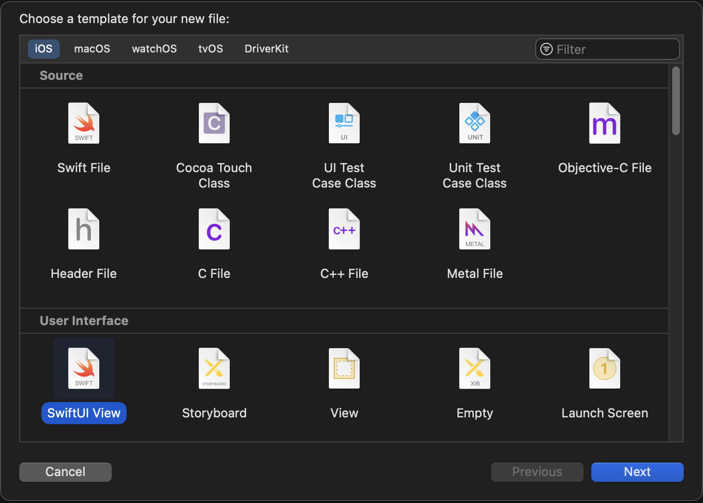

Сейчас мы имеем следущее:
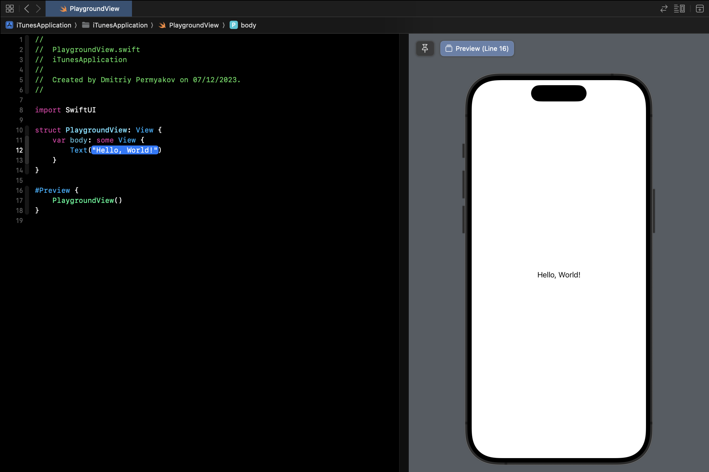

Добавим картинку. Для этого будем использовать ссылку на фото. Для UI компонента, отображающего картинку, будем использовать `AsyncImage`. Выбираем 3 конструктор.
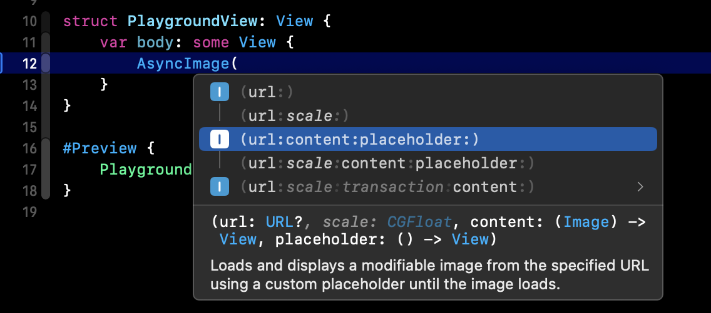

На экране у нас появится:

```swift
AsyncImage(url: <#T##URL?#>, content: <#T##(Image) -> View#>, placeholder: <#T##() -> View#>)
```
Нажмём левой кнопкой мыши на <#T##(Image) -> View#> и нажмём enter. У нас раскроются колбэк блоки, известные вам из js. У нас их зовут комплишенами(completion). Что имеем:

```swift
struct PlaygroundView: View {
    var body: some View {
        AsyncImage(url: <#T##URL?#>) { <#Image#> in
            <#code#>
        } placeholder: {
            <#code#>
        }

    }
}
```
Для отображения картинки нам необходимо вставить URL фотографии. placeholder - это View, которая будет отображаться, пока картинка подгружается из сети. Пока картинка подгружается, будем писать слово `Loading...`
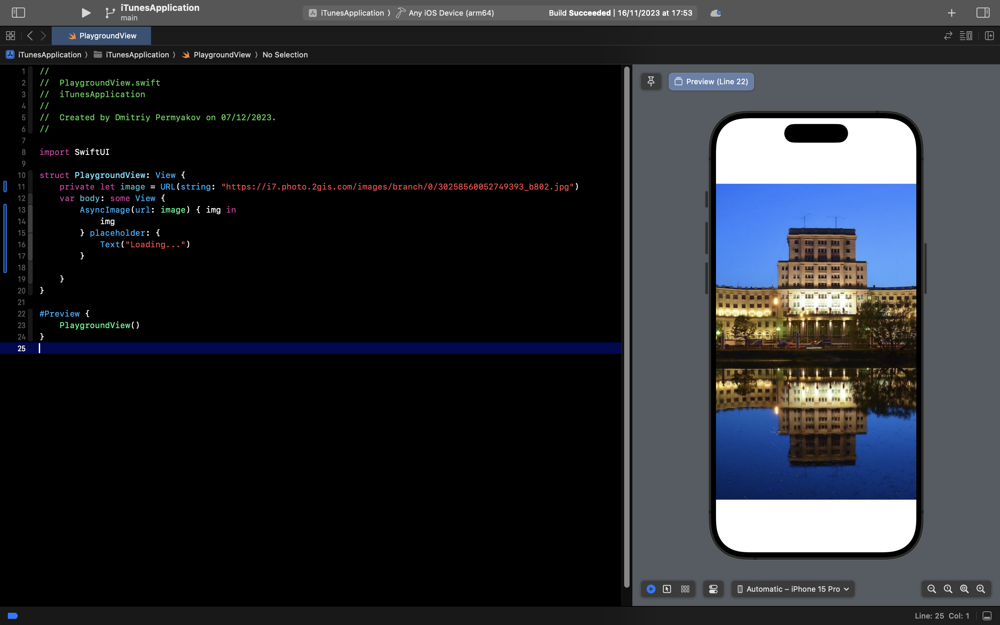
Отлично, картинка получена. Но она растянута по всему экрану. Давайте уменьшим её, зададим фрейм(frame - рамка) 300 на 50.

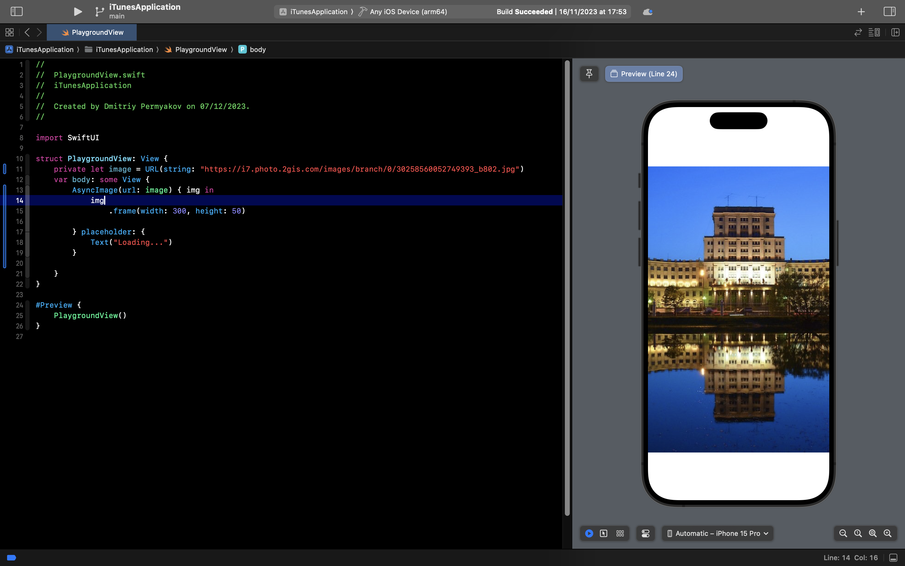
Мы добавили фрейм, но размер тот же. Как так? Всё просто, надо просто указать метод `.resizable()` перед вызовом фрейма. Готово, картинка уменьшилась.

Картинка сжалась. Чтобы такого не было, зададим `.aspectRatio(contentMode: .fill)`

Задали, но теперь высота явно не 50. Всё потому что мы не обрезали картинку. Использует `.clipped()` и получаем долгожданную картинку:
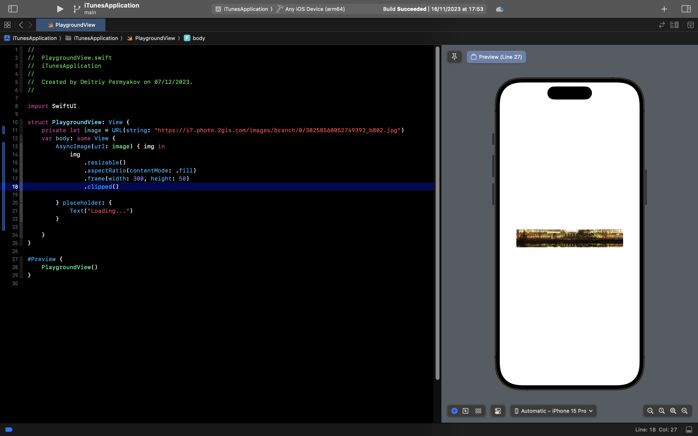

А теперь давайте растянем картинку по всей ширине а высоту сделает `fit`. Для этого будем использовать другой конструкутор фрейма с параметром maxWidth. Итоговый код:
```swift
struct PlaygroundView: View {
    private let image = URL(string: "https://i7.photo.2gis.com/images/branch/0/30258560052749393_b802.jpg")
    var body: some View {
        AsyncImage(url: image) { img in
            img
                .resizable()
                .aspectRatio(contentMode: .fit)
                .frame(maxWidth: .infinity)
                .clipped()

        } placeholder: {
            Text("Loading...")
        }
    }
}
```
Теперь давайте добавим описание к фото. Чтобы это сделать, необходимо обернуть AsyncImage в VStack - т.е в вертикальный стэк.
```swift
struct PlaygroundView: View {
    private let image = URL(string: "https://i7.photo.2gis.com/images/branch/0/30258560052749393_b802.jpg")
    var body: some View {
        VStack {
            AsyncImage(url: image) { img in
                img
                    .resizable()
                    .aspectRatio(contentMode: .fit)
                    .frame(maxWidth: .infinity)
                    .clipped()

            } placeholder: {
                Text("Loading...")
            }

            Text("""
            Московский государственный технический университет им. Н.Э. Баумана — российский национальный исследовательский университет, научный центр и особо ценный объект культурного наследия народов России.

            Индикатор успеха — формирование в массовом сознании в России и за рубежом понятия или образа «русский инженер».
            """)
        }
    }
}
```

Теперь давайте сделаем отступы у текста. Будем исользовать `.padding()`
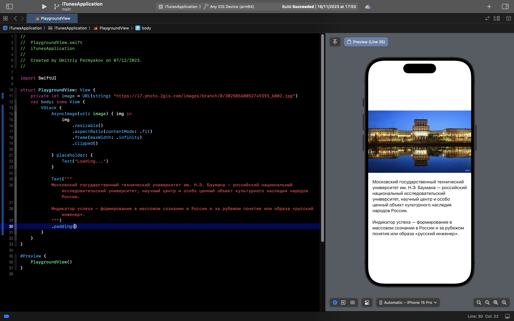
Теперь у нас есть отступы от текста по вертикале и по горизонатали. Мы можем задать параметр `.horizontal`, тогда будет горизонатльный отступ, а вертикальный 0. По дэфолту у нас отступ равен 16. Сделаем 20. Подробнее можно посмотреть в документации apple. (Зажимаете option и наводите на padding)


А теперь добавим кнопку.


Что имеем:


Приведём в порядок, убрав лишнии скобки. (Иногда генерируется сразу такой вид, иногда нет. Это баг Xcode. Он не несёт никакой ошибки, просто так мы делаем запись более читаемой)


Вот что мы имеем на данном этапе:


Давайте закастомим(custom) кнопку

> Кастомный – это переделанный под потребителя, собранный заново, вручную. Относится к любому изделию, которое изменено под конкретную аудиторию.

Добавим ей фон, покрасим её в розовый, зададим паддинги (padding), зададим шрифт и цвет текста.


```swift
Button {
    /// Эта область предназначена для логики при нажатии на кнопку. Например print("Hello, world!")
} label: {
    Text("Поступить на IU5")
    /// Делаем отступ по горизонтали
        .padding(.horizontal, 50)
    /// Делаем отстпу по вертикали
        .padding(.vertical, 12)
    /// Задаём фон кнопки
        .background(.pink)
    /// Делаем фона углы 16 градосов
        .clipShape(.rect(cornerRadius: 16))
    /// Делаем цвет текста белым
        .foregroundStyle(.white)
    /// Задаём стили текста
        .font(.system(size: 18, weight: .semibold, design: .rounded))
}
/// Делаем отступ кнопки от текст выше
.padding(.top, 20)
```

Обратите внимание на последовательность методов под `Text("Поступить на IU5")`. Мы делаем отступ по горизонтали и вертикали и потом красив уже в `pink`. Т.е сначала мы задаём паддинги, а только потом красим фон. И в самом конце делаем скругление 16 градусов.
Стоит выделить момент `.clipShape(.rect(cornerRadius: 16))`. Закругление мы совершаем путём вырезания фигуры rect - прямоугольник с радиусом 16. Есть ещё один способ сделать углы по 16, это `.cornerRadius(16)` - но он деприкейтнутый(deprecated - осуждаемый), т.е Apple сообщает нам, что в будущих версиях она избавится от этого метода и советует использовать другие, которые будут поддерживаться после удаления cornerRadius.

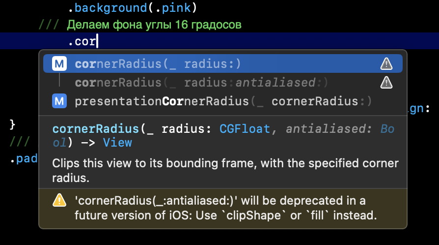

А теперь давайте добавим счётчик нажатий. Для этого создадим переменную состояния `@State private var counter = 0` и при нажатии на нашу кнопку будем увеличивать его на 1. И добавим `Text("\(counter)")` над нашей картинкой, чтобы видеть изменения счётчика.
Готово, мы написали мини приложение. Вот наш конечный код:

```swift
import SwiftUI

struct PlaygroundView: View {
    private let image = URL(string: "https://i7.photo.2gis.com/images/branch/0/30258560052749393_b802.jpg")
    @State private var counter = 0

    var body: some View {
        VStack {
            Text("\(counter)")
                .font(.title2)

            AsyncImage(url: image) { img in
                img
                    .resizable()
                    .aspectRatio(contentMode: .fit)
                    .frame(maxWidth: .infinity)
                    .clipped()

            } placeholder: {
                Text("Loading...")
            }

            Text("""
            Московский государственный технический университет им. Н.Э. Баумана — российский национальный исследовательский университет, научный центр и особо ценный объект культурного наследия народов России.

            Индикатор успеха — формирование в массовом сознании в России и за рубежом понятия или образа «русский инженер».
            """)
            .padding(.horizontal, 20)

            Button {
                counter += 1

            } label: {
                Text("Поступить на IU5")
                /// Делаем отступ по горизонтали
                    .padding(.horizontal, 50)
                /// Делаем отстпу по вертикали
                    .padding(.vertical, 12)
                /// Задаём фон кнопки
                    .background(.pink)
                /// Делаем фона углы 16 градосов
                    .clipShape(.rect(cornerRadius: 16))
                /// Делаем цвет текста белым
                    .foregroundStyle(.white)
                /// Задаём стили текста
                    .font(.system(size: 18, weight: .semibold, design: .rounded))
            }
            /// Делаем отступ кнопки от текст выше
            .padding(.top, 20)
        }
    }
}

#Preview {
    PlaygroundView()
}
```

Далее уже приступим к написанию приложения для лабораторной работы. Так что советую хорошенько разобраться с этим экраном.
[Также можете посмотреть видео по основам SwiftUI на ютубе](https://www.youtube.com/watch?v=PjyzHHE5Cx0&list=PLUb9K99oQb2t7TIFVQbht6KxWvJApvRu4)

## Структура проекта

Для того, чтобы в проекте была удобная и понятная навигация между файлами – необходимо научиться грамотно создавать структуру папок, по которым будем раскладывать файлы с кодом для наших экранов, запросов в сеть и прочего. Для того, чтобы создать новую папку – необходимо кликнуть правой кнопки мыши по папки, в который вы хотите создать новую и выбрать пункт New Group.
(Или command + option)


Файлы `iTunesApplicationApp.swift` и `Assets.xcassets` поместим в группу `Application`, а также создадим группу `Extenstions` и `Screens`

- Extenstions - здесь мы будем добавлять наши расширения. Подробнее про это поговорим дальше. Форма файлов будет следующим: `Name+Extenstions`. Например для структы String: `String+Extenstions`
- Screens - Это наши экраны

XCode автоматически сгенерировал нам `ContentView`. Это наш главный экран. В дальнейшем мы его переименуем. Что имеем сейчас:


## Начало разработки UI

В текущем проекте мы будем использовать паттерн `MVVM`.
MVVM (Model-View-ViewModel) - это элегантный паттерн проектирования, утонченный и сбалансированный, специально разработанный для современной разработки программного обеспечения. Он предоставляет эффективный метод организации кода, разделяя его на три ключевых компонента: Model (Модель), View (Представление) и ViewModel (Модель представления).

Модель (Model): Отвечает за хранение данных и бизнес-логику приложения. Модель независима от пользовательского интерфейса и предоставляет единый источник данных.

Представление (View): Отвечает за отображение данных и взаимодействие с пользователем. Однако, в отличие от MVC, представление в MVVM более пассивно и не содержит логику обработки пользовательского ввода.

Модель представления (ViewModel): Это промежуточное звено между Моделью и Представлением. ViewModel отвечает за предоставление данных, необходимых для отображения в Представлении, и обрабатывает логику взаимодействия с пользователем. Он уменьшает связь между Моделью и Представлением, делая код более поддерживаемым и тестируемым.

MVVM обеспечивает отличную разделенность ответственности, повышенную переиспользуемость кода и легкость в тестировании. В отличие от MVC, MVVM часто используется в современных фреймворках, таких как SwiftUI и Combine, что делает его актуальным и востребованным в современной разработке программного обеспечения.

### Extenstions

Что же такое extension? Это просто расширение нашего класса. Т.е это то же самое, если бы мы писали всё в одном теле класса. А так мы разбиваем код на логические блоки. Можем даже создавать отдельный файл и там прописывать расширения.

Добавим файлы `Color+Extenstions.swift` и `LinearGradient+Extenstions.swift`

```swift
//
//  LinearGradient+Extenstions.swift
//  iTunesApplication
//
//  Created by Dmitriy Permyakov on 16/11/2023.
//

import SwiftUI

extension LinearGradient {

    static let appBackground = LinearGradient(
        colors: [.black, .pink],
        startPoint: .topLeading,
        endPoint: .bottomTrailing
    )

    static let appBackgroundViolet = LinearGradient(
        colors: [.black, .purple],
        startPoint: .topLeading,
        endPoint: .bottomTrailing
    )
}
```
```swift
//
//  Color+Extenstions.swift
//  iTunesApplicatio
//
//  Created by Dmitriy Permyakov on 15/11/2023.
//

import SwiftUI

extension Color {

    static let appBackground = Color(red: 33/255, green: 22/255, blue: 71/255)
    static let searchBarBackground = Color(red: 28/255, green: 23/255, blue: 36/255, opacity: 1)
    static let shimmerColor = Color.searchBarBackground
    static let appForeground = Color.white
}
```
Тут мы просто добавили цвета, которые будем использовать в приложении.

## Этап 1. Основная верстка
### Вёрстка

А теперь давайте приступим к коду. Давайте рассмотрим конечный результат и подумаем, какие компоненты нам понядобятся. 

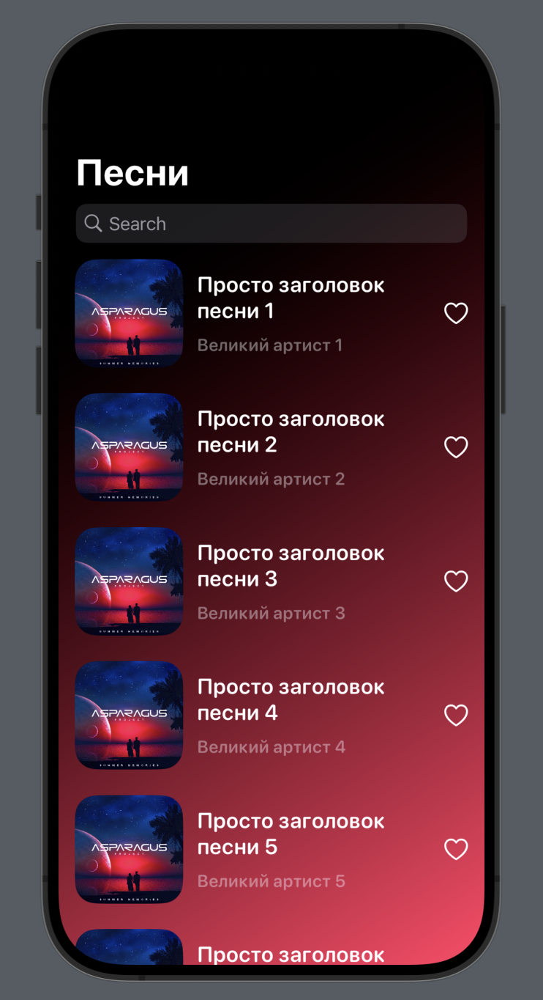


На главном экране мы видим список треков. Значит нам надо будет сверстать ячейку. Назовём её `MusicCell`. Главный экран мы назовём `SongList`. Для этого нам придётся переименовать дэфолтный `ContentView`. Есть два способа.
1. Мы ручками меняем везде `ContentView` на `SongList`. 
2. Зажимаем правой кнопкой мыши на название структуры, которую хотим переименовать, и выбираем Refactor->Rename


и даём название `SongList`

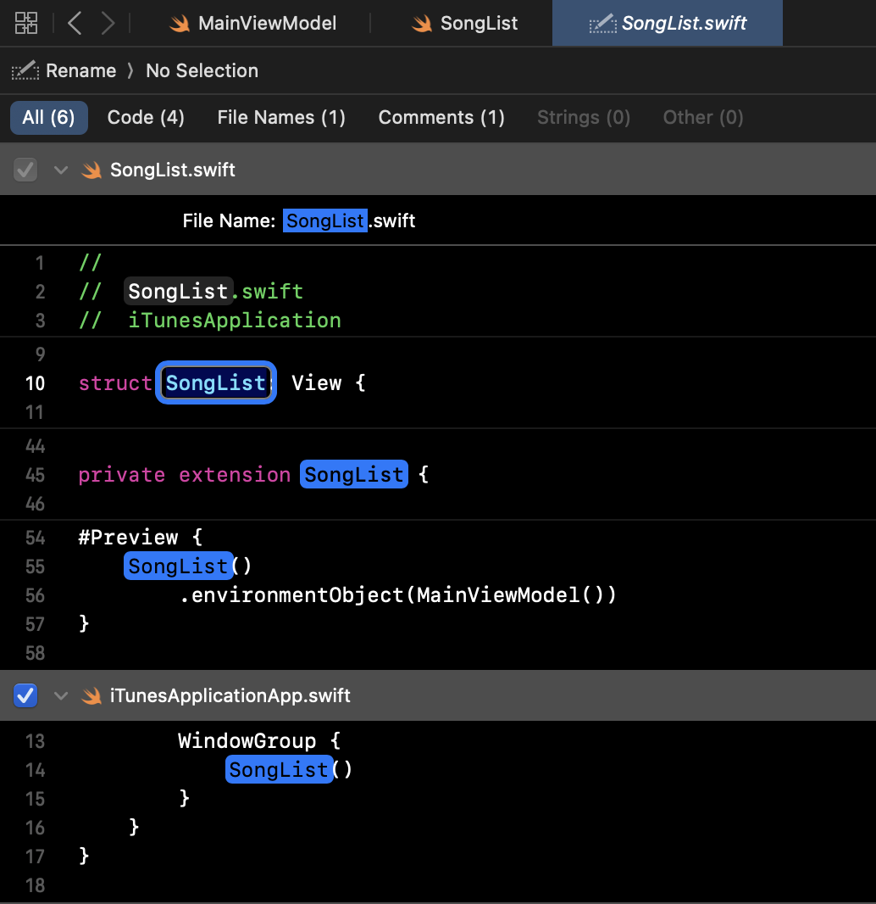

И важно подменить про файл `iTunesApplicationApp.swift`:
Это точка входа в наше приложение. Здесь мы задаём экран, который будет открываться первым. У нас это `SongList`

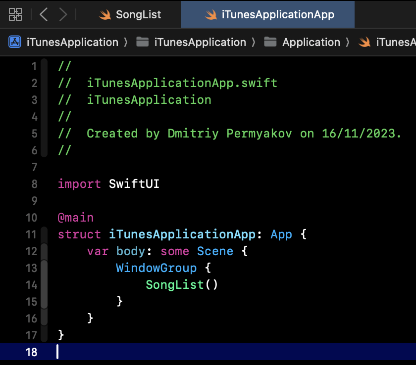

А теперь давайте приступим за разработку главного экрана `SongList`. Подготовим всю иерархию под MVVM.
В группе Sreens добавим группу `MainScreen` и в ней добавим ещё группы `SongList` и `SongDetails`.

- SongList - Список наших ячеек.
- SongDetails - Экран подробнее. 

Сейчас мы занимаеся `SongList`. Добавим группы Model ViewModel View
Что имеем:

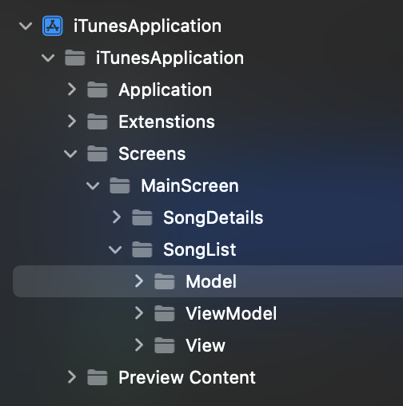

Далее добавим файлы в группы. В Model и ViewMode добавим `Swift File` а во View добавим `SwiftUI View`

Чтобы создать файлы, жмёшь command + N где хотим добавить и выбираем файл.


Вот что получили:


## Этап 2. Создание моделей

### SongModel
SongModel - это наша модель данных.
```swift
//
//  SongModel.swift
//  iTunesApplication
//
//  Created by Dmitriy Permyakov on 15/11/2023.
//

import Foundation

struct SongModel: Identifiable {
    let id = UUID()
    var trackId: Int?
    var title: String?
    var artist: String?
    var imageURL: URL?
    var releaseDate: String?
    var collectionPrice: String?
}

// MARK: - Mock data

/// Это наши моки для вёрстки для SongModel
extension SongModel {

    static let mockData = SongModel(
        trackId: 10023,
        title: "Back To Her Men Back To Her Men",
        artist: "Demien Rice",
        imageURL: .mockData
    )
}

/// Это наши моки для вёрстки для массива SongModel
extension [SongModel] {

    static let mockData = (1...20).map {
        SongModel(
            trackId: $0,
            title: "Просто заголовок песни \($0)",
            artist: "Великий артист \($0)",
            imageURL: .mockData,
            releaseDate: "\($0)/11/2023",
            collectionPrice: $0 % 2 == 0 ? nil : "\($0)"
        )
    }
}

/// Это наши мок фото из интернета.
private extension URL {

    static let mockData = URL(string: "https://static.wixstatic.com/media/5a922b_6cd50e8a382c42bd9660cadc04bae1cd~mv2_d_2000_2000_s_2.jpg")
}
```
Тут мы подписали нашу модель на протокол `Identifiable`. Что такое протокол? Те же интерфейсы. Т.е это место, где мы прописываем, что должен реализовать наш subscriber, чтобы ему соответствовать. Для этого мы добавили поле `let id = UUID()`

Теперь про `String?`. Что же это такое? Это опциальная переменная. Т.е мы говорим, что ожидаем или строку, или nil. И далее мы всегда будем расспаковывать переменную. Есть три виды распаковки:

Первый способ:
```swift
let song = SongModel(trackId: 100, title: "Заголовок")
/// Здесь мы распаковываем наш заголовок и если он не nil, то попадаем во внутрь. иначе просто продём дальше
if let title = song.title {
    print(title)
}
```
Второй способ:
```swift
let song = SongModel(trackId: 100, title: "Заголовок")
/// Тут мы задаём дэфолт значение. Т.е если есть заголовок, мы выводим его, если нет, выводим заданную строку
print(song.title ?? "Заголовок не задан")
```
Третий способ:
Используя guard. Это как if, но наоборот. Т.е мы говорим, если не получилось распаковать переменную, выходим из функции, иначе идём дальше
```swift
func someFunction(song: SongModel) {
        guard let title = song.title else { return }
        print(title)
}
```

### MainViewModel

ObservableObject - это протокол в SwiftUI и Combine, который используется для создания объектов, способных уведомлять своих подписчиков (например, представлений) об изменениях своего состояния. Этот протокол является ключевым элементом реактивного программирования в SwiftUI и играет важную роль в реализации паттерна MVVM (Model-View-ViewModel).

Когда тип объекта подписан на ObservableObject, вы можете использовать публикуемые свойства (@Published) для автоматической генерации уведомлений о изменениях свойств. Когда изменяется значение публикуемого свойства, SwiftUI автоматически оповещает представления, зависящие от этого свойства, чтобы они обновили свой интерфейс.

Проще говоря, у нас есть куча разных экранов и все они должны перекидывать данные друг другу. А так мы создаём один класс и просто обращаемся к нему в разных экранах.
```swift
import Foundation

/// Это наш собственный протокол, в котором мы будем прописывать функции, которые мы должны реализовать дальше. Например, пользователь нажал на кнопку лайка. Тогда мы добавим func tapLike(id: Int)
protocol MainViewModelProtocol {
    func seachTracks(searchText: String) -> [SongModel]
    func pressedLike(trackID: Int, isLiked: Bool, completion: (() -> Void)?)
}

/// Это наш основной класс, который будет хранить все треки, полученные из АПИ.
/// Слово final говорит, что это конечный класс и наследоваться от него мы не будем
final class MainViewModel: ObservableObject {

    @Published var songs: [SongModel] = []
}

// MARK: - MainViewModelProtocol

/// Подписываемся на наш протокл, где в дальнейшем будем реализовывать функции
extension MainViewModel: MainViewModelProtocol {

    /// Фильтрация при поиске
    /// - Parameter searchText: текст из сёрч бара
    /// - Returns: массив отфильтрованных песен
    func seachTracks(searchText: String) -> [SongModel] {
        searchText.isEmpty
        ? songs
        : songs.filter {
            ($0.title ?? "Название не указано").contains(searchText)
            || ($0.artist ?? "Исполнитель не задан").contains(searchText)
        }
    }
    
    /// Нажатие кнопки лайка у ячейки
    /// - Parameters:
    ///   - trackID: `id` нажатого трека
    ///   - isLiked: статус лайка
    func pressedLike(trackID: Int, isLiked: Bool, completion: (() -> Void)? = nil) {
        print("Вы нажали трек с id: \(trackID). Статус: \(isLiked)")

        // Дальше пишите бизнес логику ...
        
        /// Здесь мы делаем имитацию запроса в интернет, т.е задержку на 1 секунду.
        DispatchQueue.main.asyncAfter(deadline: .now() + 1) {
            completion?()
        }
    }
}
```

## Этап 3. Создание главной страницы

### MusicCell
Начнём вёрстку нашей ячейки.
HStack - это стек. Всё, что мы сюда кладём, он размещает по горизонтали. По умолчанию центрирует.

Вот перечень всех параметров. 
```swift
HStack(alignment: .center, spacing: nil, content: {
    Text("Hello")
})
```
Запись можно сократить до вида
```swift
HStack {
    Text("Hello")
}
```
Также есть `ZStack` и `VStack`. ZStack - это наслоение, т.е компоненты буду накладываться друг на друга. VStack - это вертикальный стэк, т.е будут друго под друга. 

AsyncImage - принимает url на фото и на выходе мы получаем наш img типа Image, placeholder - то, что видит пользователь, пока мы грузим image.

Text("Наш текст") - это наш текст

Spacer() в SwiftUI представляет собой простой модификатор, используемый для занимания пространства в макете. Он расширяет свое пространство до максимально возможного размера, осуществляя пружинистую автонастройку, и может использоваться для равномерного распределения пространства между другими элементами внутри стека или контейнера.
Пример:
```swift
HStack {
    Text("text 1")
    Spacer()
    Text("text 2")
}
```
Тут мы получим Текст1 ________ Текст2. Т.е между ними будем невидимый пробел.

```swift
Button(action: {
    /// Логика при нажатии на кнопку
}, label: {
    Text("Button")
})
```
тут есть действие и лейбл. В лейбле может быть что угодно. У нас это текст. Так же можно сделать фото или HStack с фото и текстом. И так далее


`@State` - В SwiftUI, State представляет собой свойство, которое хранит и управляет изменяемым состоянием внутри представления. Использование State позволяет SwiftUI отслеживать изменения этого состояния и автоматически обновлять пользовательский интерфейс при его изменении.

`EnvironmentObject` в SwiftUI - это специальный тип объекта, который используется для передачи данных между различными представлениями в приложении. Он является частью паттерна проектирования "Observable Object" и позволяет создавать глобальные объекты, которые могут быть доступны из любой части приложения.
EnvironmentObject обычно используется для хранения состояния приложения, такого как пользовательские данные, настройки и другие глобальные переменные. Он позволяет избежать передачи данных через цепочку представлений и делает код более модульным и легким для поддержки.
Для использования EnvironmentObject в SwiftUI необходимо создать объект, который соответствует протоколу ObservableObject, и затем пометить его как EnvironmentObject в представлении с помощью модификатора @EnvironmentObject. Это позволяет представлению автоматически получать доступ к этому объекту из окружения и использовать его данные.
[Подробнее можно почитать тут.](https://habr.com/ru/companies/otus/articles/527364/)

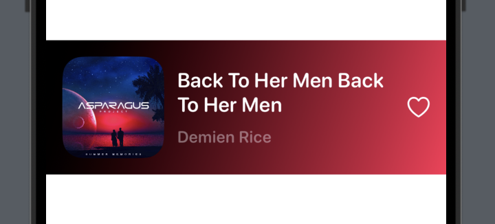

```swift
//
//  MusicCell.swift
//  iTunesApplication
//
//  Created by Dmitriy Permyakov on 15/11/2023.
//

import SwiftUI

struct MusicCell: View {

    @EnvironmentObject var viewModel: MainViewModel
    @State private var heartIsSelected = false
    var song: SongModel!
    
    /// Наша вьюха
    var body: some View {
        HStack {
            AsyncImage(url: song.imageURL) { img in
                img
                /// Говорим, что будем менять размеры фото
                    .resizable()
                /// Формат фото  ration - fill
                    .aspectRatio(contentMode: .fill)
                /// Задаём размер фото 100 на 100
                    .frame(width: 100, height: 100)
                /// Вырезаем фигуру RoundedRectangle с углами 20 градусов. Т.е просто делаем углы у нашего фото
                    .clipShape(RoundedRectangle(cornerRadius: 20))
            } placeholder: {
                ZStack {
                    /// Просто прямоугольник с углам 20
                    RoundedRectangle(cornerRadius: 20)
                    /// Это цвет прямоугольника. shimmerColor - наш кастомный цвет из файла `Color+Extenstions`
                        .fill(Color.shimmerColor)
                    /// Это наш лоудер, который крутится
                    ProgressView()
                }
                .frame(width: 100, height: 100)
            }

            VStack(spacing: 10) {
                Text(song.title ?? "Название не указано")
                /// Задаём фон текста
                    .font(.system(size: 20, weight: .semibold, design: .rounded))
                /// Тот же фрейм. Нам надо центрировать текст по левой стороне. Т.е делаем ширину infinity и выравнивание по левой части
                    .frame(maxWidth: .infinity, alignment: .leading)
                /// Выравнивание многострочного текста
                    .multilineTextAlignment(.leading)
                /// Цвет текста из `Color+Extenstions`
                    .foregroundStyle(Color.appForeground)
                /// Ограничение числа строк. `0` - это неограниченно, 1 - это одна. 2 - две и тд
                    .lineLimit(2)
                Text(song.artist ?? "Исполнитель не задан")
                    .font(.system(size: 16, weight: .semibold, design: .rounded))
                    .frame(maxWidth: .infinity, alignment: .leading)
                    .foregroundStyle(Color.appForeground.opacity(0.4))
                    .lineLimit(1)
            }
            /// Это наш отступ по горизонтали
            .padding(.horizontal, 5)

            Spacer()

            Button {
                heartIsSelected.toggle()
                viewModel.pressedLike(
                    trackID: song.trackId ?? 0,
                    isLiked: heartIsSelected
                ) {
                    print("Данные записаны в БД!")
                }

            } label: {
                Image(systemName: heartIsSelected ? "suit.heart.fill" : "suit.heart")
                    .resizable()
                    .aspectRatio(contentMode: .fit)
                    .frame(width: 22, height: 22)
                /// Задаём цвет нашего изображения
                    .foregroundStyle(Color.appForeground)
            }
        }
        /// Наш EnvironmentObject var viewModel: MainViewModel
        .environmentObject(viewModel)
    }
}

// MARK: - Preview

/// Это наше превью, которая создаём экран справа
#Preview {
    /// .mockData - наш мок данных для превью справа
    MusicCell(song: .mockData)
        .padding()
    /// Важно! Без этого не будет работать превью. Будет крашится
        .environmentObject(MainViewModel())
    /// Задаём задний фон, используя градиент
        .background(LinearGradient.appBackground)
}
```


### SongList

@StateObject - это еще один специальный модификатор в SwiftUI, который используется для создания и хранения экземпляра ObservableObject в представлении. Он похож на @ObservedObject, но с одним отличием: @StateObject создает новый экземпляр ObservableObject только один раз при первом использовании представления, и затем сохраняет его состояние в течение жизни представления.

Это особенно полезно, когда нам нужно создать экземпляр ObservableObject в представлении и гарантировать, что он будет сохранять свое состояние при пересоздании представления (например, при обновлении данных или изменении ориентации устройства).

Для использования @StateObject в SwiftUI необходимо создать свойство в представлении с аннотацией @StateObject и присвоить ему новый экземпляр ObservableObject. Далее можно использовать это свойство для доступа к данным и методам ObservableObject в представлении.


```swift
//
//  SongList.swift
//  iTunesApplication
//
//  Created by Dmitriy Permyakov on 15/11/2023.
//

import SwiftUI

struct SongList: View {

    @StateObject private var viewModel = MainViewModel()
    @State private var searchBarText = ""
    private var filteredSongs: [SongModel] {
        viewModel.seachTracks(searchText: searchBarText)
    }

    var body: some View {
        /// Навигация нашего приложения, чтобы мы могли вернуться к экрану
        NavigationStack {
            /// Скролл вью, чтобы могли скролить
            ScrollView(showsIndicators: false) {
                /// То же самое, что и VStack, но он ленивый. Т.е переиспользует ячейки. Используеют, когда данных много.
                LazyVStack {
                    /// Тут перебираем наши треки. Т.к SongModel подписан на `Identifiable` мы можем по нему итерироваться.
                    ForEach(filteredSongs) { song in
                        /// Это место, куда мы будем переходить при нажатии
                        NavigationLink {
                            /// Экран, который откроем при нажатии
                            SongDetails(song: song)
                        } label: {
                            /// наша ячейка
                            MusicCell(song: song)
                        }
                        .padding(.bottom)
                    }
                    .padding(.horizontal, 15)
                }
            }
            /// Фон
            .background(LinearGradient.appBackground)
            /// Наш сёрч бар выше
            .searchable(text: $searchBarText)
            /// Наш заголовок
            .navigationBarTitle("Песни")
        }
        /// Не теряем!
        .environmentObject(viewModel)
        /// Задаём тему всегда тёмную
        .colorScheme(.dark)
        /// Перед появлением экрана будем выполнять функцию fetchData
        .onAppear(perform: fetchData)
    }
}

// MARK: - Network

private extension SongList {

    func fetchData() {
        viewModel.songs = .mockData
    }
}

// MARK: - Preview

#Preview {
    SongList()
    /// Не теряем!
        .environmentObject(MainViewModel())
}
```


## Этап 4. Создание дополнительной страницы

### SongDetails

GeometryReader - это специальное представление в SwiftUI, которое позволяет получить информацию о геометрии родительского представления и использовать эту информацию для размещения и настройки дочерних представлений.

GeometryReader возвращает представление, которое занимает все доступное пространство в родительском представлении и предоставляет информацию о его размерах, координатах и прочих геометрических параметрах. Эта информация может быть использована для создания адаптивного и отзывчивого дизайна, например, для размещения дочерних представлений в определенном месте или с определенными размерами в зависимости от размеров родительского представления.

Для использования GeometryReader достаточно включить его в иерархию представлений и использовать полученную информацию о геометрии для настройки дочерних представлений. Это представление особенно полезно при создании динамических макетов, адаптированных под разные размеры экранов и ориентации устройств.


```swift
//
//  SongDetails.swift
//  iTunesApplication
//
//  Created by Dmitriy Permyakov on 16/11/2023.
//

import SwiftUI

struct SongDetails: View {
    @EnvironmentObject var viewModel: MainViewModel
    var song: SongModel!

    var body: some View {
        GeometryReader {
            let size = $0.size
            ScrollView {
                VStack {
                    ImageView(size)

                    SongTextInfo
                        .padding()
                }
            }
        }
        .padding(.horizontal)
        .environmentObject(viewModel)
        .navigationBarTitle("", displayMode: .inline)
        .colorScheme(.dark)
        .background(LinearGradient.appBackgroundViolet)
    }
}

// MARK: - SongDetails

private extension SongDetails {
    
    /// Вьюха картинки
    /// - Parameter size: размер фото
    /// - Returns: кастомную фотку
    func ImageView(_ size: CGSize) -> some View {
        AsyncImage(url: song.imageURL) { img in
            img
                .resizable()
                .aspectRatio(contentMode: .fill)
                .frame(width: size.width, height: size.width)
                .clipShape(RoundedRectangle(cornerRadius: 20))

        } placeholder: {
            ZStack {
                RoundedRectangle(cornerRadius: 20)
                    .fill(Color.shimmerColor)
                ProgressView()
            }
            .frame(width: size.width, height: size.width)
        }
    }
    
    /// Наше тело со всей текстой информацией
    var SongTextInfo: some View {
        VStack {
            if let releaseDate = song.releaseDate {
                Text(releaseDate)
                    .font(.caption)
                    .frame(maxWidth: .infinity, alignment: .leading)
                    .foregroundStyle(.secondary)
                    .padding(.bottom)
            }

            Text(song.title ?? "Название не указано")
                .frame(maxWidth: .infinity, alignment: .leading)
                .font(.system(size: 22, weight: .semibold, design: .rounded))

            Text(song.artist ?? "Исполнитель не задан")
                .frame(maxWidth: .infinity, alignment: .leading)
                .font(.system(size: 18, weight: .semibold, design: .rounded))
                .foregroundStyle(.secondary)

            HStack {
                Text("Цена")
                    .font(.system(size: 20, weight: .semibold, design: .rounded))
                Spacer()

                /// Если цена задана, то выводим её, иначе слово `Бесплатно`
                if let collectionPrice = song.collectionPrice {
                    Text(collectionPrice + " $")
                        .font(.system(size: 25, weight: .bold, design: .rounded))
                        .frame(maxWidth: .infinity, alignment: .trailing)
                } else {
                    Text("Бесплатно")
                        .font(.system(size: 20, weight: .bold, design: .rounded))
                        .frame(maxWidth: .infinity, alignment: .trailing)
                }
            }
            .padding(.top, 50)
        }
    }
}

// MARK: - Preview

#Preview {
    NavigationStack {
        SongDetails(song: .mockData)
    }
    .environmentObject(MainViewModel())
}
```


Отлично, наше приложение готово. Осталось только написать апишный сервис. Пока проект выглядит так:


## Этап 5. Подключение API

В корень проекта добавим группу Services/Network и Swift File `APIManager` и APIErrors

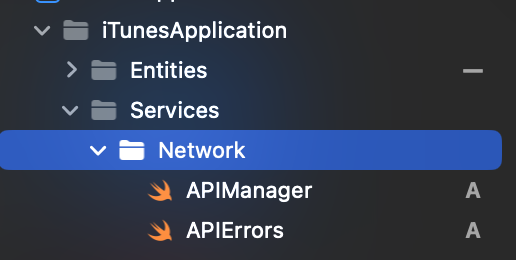

Не сложно догадаться, что это ошибки, которые мы будем отлавивать при распаршивание json (Преобразование json файла к структуре данных, с которыми мы будем работать)
```swift
//
//  APIErrors.swift
//  iTunesApplication
//
//  Created by Dmitriy Permyakov on 16/11/2023.
//

import Foundation

enum APIError: LocalizedError {
    case badParameters
    case dataIsNil
    case badStatusCode(Int)
    case error(Error)
    case responseIsNil
    case incorrectlyURL

    var errorDescription: String {
        switch self {
        case .badParameters: return "Query parameters are incorrectly"
        case .dataIsNil: return "data is nil"
        case .responseIsNil: return "response is nil"
        case .badStatusCode(let code): return "Bad statuc code: \(code)"
        case .error(let error): return error.localizedDescription
        case .incorrectlyURL: return "URL is incorrectly"
        }
    }
}
```

А теперь подготовимся к написанию нашего APIManager. Для этого мы добавим ещё два экстеншена для `String` и `Double?`

С помощью этого расширения мы будем преобразовывать Double в опциональную строку
```swift
//
//  Double+Extenstions.swift
//  iTunesApplication
//
//  Created by Dmitriy Permyakov on 16/11/2023.
//

import Foundation

extension Double? {

    var toString: String? {
        guard let self else { return nil }
        return "\(self)"
    }
}
```

С помощью этого расширения мы будем пробразовывать строку в URL?
```swift
//
//  String+Extenstions.swift
//  iTunesApplication
//
//  Created by Dmitriy Permyakov on 16/11/2023.
//

import Foundation

extension String {

    var toURL: URL? { URL(string: self) }
}
```

### Entity

При распарсе данных нам нужный вспомогательные структуры. Они называются Entity.

Вот пример JSON, с которым мы будем работать

```json
{
    "resultCount": 42,
    "results": [
        {
            "wrapperType": "track",
            "kind": "song",
            "artistId": 506587533,
            "collectionId": 1058869121,
            "trackId": 1058869145,
            "artistName": "Bowsar & Term",
            "collectionName": "Mirror Universe 2",
            "trackName": "Motion",
            "collectionCensoredName": "Mirror Universe 2",
            "trackCensoredName": "Motion",
            "collectionArtistId": 331122,
            "collectionArtistName": "Various Artists",
            "artistViewUrl": "https://music.apple.com/us/artist/bowsar/506587533?uo=4",
            "collectionViewUrl": "https://music.apple.com/us/album/motion/1058869121?i=1058869145&uo=4",
            "trackViewUrl": "https://music.apple.com/us/album/motion/1058869121?i=1058869145&uo=4",
            "previewUrl": "https://audio-ssl.itunes.apple.com/itunes-assets/AudioPreview125/v4/4c/d8/39/4cd8397b-7e26-88ca-875e-a6843b1fe581/mzaf_10818377819079898356.plus.aac.p.m4a",
            "artworkUrl30": "https://is1-ssl.mzstatic.com/image/thumb/Music113/v4/63/57/96/635796ba-e097-c687-0655-ce0935fb7d1f/8790001179608.png/30x30bb.jpg",
            "artworkUrl60": "https://is1-ssl.mzstatic.com/image/thumb/Music113/v4/63/57/96/635796ba-e097-c687-0655-ce0935fb7d1f/8790001179608.png/60x60bb.jpg",
            "artworkUrl100": "https://is1-ssl.mzstatic.com/image/thumb/Music113/v4/63/57/96/635796ba-e097-c687-0655-ce0935fb7d1f/8790001179608.png/100x100bb.jpg",
            "collectionPrice": 9.99,
            "trackPrice": 1.29,
            "releaseDate": "2015-12-14T12:00:00Z",
            "collectionExplicitness": "notExplicit",
            "trackExplicitness": "notExplicit",
            "discCount": 1,
            "discNumber": 1,
            "trackCount": 18,
            "trackNumber": 18,
            "trackTimeMillis": 293076,
            "country": "USA",
            "currency": "USD",
            "primaryGenreName": "Electronic",
            "isStreamable": true
        },
        {
            "wrapperType": "track",
            "kind": "song",
            "artistId": 274555299,
            "collectionId": 276908846,
            "trackId": 276908916,
            "artistName": "Carolina Liar",
            "collectionName": "Coming to Terms",
            "trackName": "Show Me What I'm Looking For",
            "collectionCensoredName": "Coming to Terms",
            "trackCensoredName": "Show Me What I'm Looking For",
            "artistViewUrl": "https://music.apple.com/us/artist/carolina-liar/274555299?uo=4",
            "collectionViewUrl": "https://music.apple.com/us/album/show-me-what-im-looking-for/276908846?i=276908916&uo=4",
            "trackViewUrl": "https://music.apple.com/us/album/show-me-what-im-looking-for/276908846?i=276908916&uo=4",
            "previewUrl": "https://audio-ssl.itunes.apple.com/itunes-assets/AudioPreview122/v4/68/be/9d/68be9dcb-222d-6cf7-c0cf-e2edfcfd6c8e/mzaf_2375151135634277512.plus.aac.p.m4a",
            "artworkUrl30": "https://is1-ssl.mzstatic.com/image/thumb/Music125/v4/50/0a/1e/500a1eac-b447-1299-72dc-d52bd74d3968/mzi.sdgeshou.jpg/30x30bb.jpg",
            "artworkUrl60": "https://is1-ssl.mzstatic.com/image/thumb/Music125/v4/50/0a/1e/500a1eac-b447-1299-72dc-d52bd74d3968/mzi.sdgeshou.jpg/60x60bb.jpg",
            "artworkUrl100": "https://is1-ssl.mzstatic.com/image/thumb/Music125/v4/50/0a/1e/500a1eac-b447-1299-72dc-d52bd74d3968/mzi.sdgeshou.jpg/100x100bb.jpg",
            "collectionPrice": 11.99,
            "trackPrice": 1.29,
            "releaseDate": "2008-03-05T12:00:00Z",
            "collectionExplicitness": "notExplicit",
            "trackExplicitness": "notExplicit",
            "discCount": 1,
            "discNumber": 1,
            "trackCount": 15,
            "trackNumber": 4,
            "trackTimeMillis": 240467,
            "country": "USA",
            "currency": "USD",
            "primaryGenreName": "Pop",
            "isStreamable": true
        }
    ]
}
```

Здесь мы видим массив `result` внутри которого необходимые нам треки. 

Добавим группу Entities и файл `CollectionEntity.swift`

```swift
//
//  CollectionEntity.swift
//  iTunesApplication
//
//  Created by Dmitriy Permyakov on 16/11/2023.
//

import Foundation

struct CollectionEntity: Decodable {
    var results: [SongEntity]
}
```

А теперь добавим `SongEntity.swift`

```swift
//
//  SongEntity.swift
//  iTunesApplication
//
//  Created by Dmitriy Permyakov on 16/11/2023.
//

import Foundation

struct SongEntity: Decodable {
    var trackId: Int?
    var collectionName: String?
    var artistName: String?
    var artworkUrl100: String?
    var releaseDate: String?
    var collectionPrice: Double?
}

// MARK: - Mapper

extension SongEntity {

    var mapper: SongModel {
        SongModel(
            trackId: trackId,
            title: collectionName,
            artist: artistName,
            imageURL: artworkUrl100?.toURL,
            releaseDate: releaseDate,
            collectionPrice: collectionPrice.toString
        )
    }
}
```

Обратите внимание на название переменных. В моём случае они уже были в формате камалКейса, принятов в swift, поэтому я назвал перменные также, как и в JSON. Но они могут быть иными, например_такими_вот. Как тогда быть? Два пути. Первый - плохой, назвать переменные_вот_так же. Второй - хороший. Добавить enum:

```swift
struct SongEntity: Decodable {
    var trackId: Int?
    var collectionName: String?
    var artistName: String?
    var artworkUrl100: String?
    var releaseDate: String?
    var collectionPrice: Double?

    enum CodingKeys: String, CodingKey {
        case trackId,
             collectionName,
             artistName,
             artworkUrl100,
             releaseDate,
             collectionPrice
    }
}
```
И в нём вы уже прописываете необходимые вам названия. Если они совпадают, то будет как у меня выше, а если, например, `artistName` будет как `artist_name`, тогда будет так:

```swift
struct SongEntity: Decodable {
    var trackId: Int?
    var collectionName: String?
    var artistName: String?
    var artworkUrl100: String?
    var releaseDate: String?
    var collectionPrice: Double?

    enum CodingKeys: String, CodingKey {
        case trackId,
             collectionName,
             artworkUrl100,
             releaseDate,
             collectionPrice
        case artistName = "artist_name"
    }
}
```

Ну и также у нас есть mapper, который просто преобразует SongEntity -> SongModel

### APIManager
Всё, мы прописали наши структурки, которые будет парсить. А теперь добавим синглтон APIManager

```swift
//
//  APIManager.swift
//  iTunesApplication
//
//  Created by Dmitriy Permyakov on 16/11/2023.
//

import Foundation

final class APIManager {

    private init() {}

    static let shared = APIManager()

    func getTracks(completion: @escaping (Result<[SongModel], APIError>) -> Void) {
        let urlString = "https://itunes.apple.com/search?term=${term}&media=music&entity=song"
        guard let url = URL(string: urlString) else {
            completion(.failure(.incorrectlyURL))
            return
        }
        let request = URLRequest(url: url)
        URLSession.shared.dataTask(with: request) { data, response, error in
            if let error {
                DispatchQueue.main.async {
                    completion(.failure(.error(error)))
                }
                return
            }
            /// Приводим `response` к типу HTTPURLResponse
            guard let response = response as? HTTPURLResponse else {
                DispatchQueue.main.async {
                    completion(.failure(.responseIsNil))
                }
                return
            }
            /// Проверяет код ответа, пришедшии с сервера
            guard (200..<300).contains(response.statusCode) else {
                DispatchQueue.main.async {
                    completion(.failure(APIError.badStatusCode(response.statusCode)))
                }
                return
            }
            /// Распаковка дата
            guard let data else {
                DispatchQueue.main.async {
                    completion(.failure(.dataIsNil))
                }
                return
            }
            do {
                let collections = try JSONDecoder().decode(CollectionEntity.self, from: data)
                /// Т.к в коллекциях у нас лежит массив `SongEntity`, то мы перебираем массив и маппим их в `SongModel`
                DispatchQueue.main.async {
                    completion(.success(collections.results.map { $0.mapper }))
                }
                return

            } catch {
                DispatchQueue.main.async {
                    completion(.failure(.error(error)))
                }
            }
        }.resume()
    }
}
```

В Swift тип данных Result представляет собой перечисление (enum), используемое для обработки операций, которые могут завершиться успешно или с ошибкой. Он определен следующим образом:

```swift
Copy code
enum Result<Success, Failure: Error> {
    case success(Success)
    case failure(Failure)
}
```
Где Success - это тип данных для успешного результата, а Failure - это тип данных для ошибки.

Что касается `@escaping`, это атрибут функции в Swift, который указывает на то, что замыкание, переданное в качестве параметра, может быть сохранено для последующего выполнения вне области видимости, в которой было создано. Это часто используется, например, когда замыкание передается в асинхронные функции или сохраняется для выполнения в будущем. Атрибут @escaping позволяет компилятору выполнить определенные проверки, связанные с управлением памятью, чтобы предотвратить возможные утечки памяти или другие проблемы. [Подробнее читать тут](https://yandex.ru/search?text=escaping+swift+&lr=10738&clid=2192594)

`DispatchQueue.main.async` используется в Swift для выполнения определенного кода асинхронно на главной очереди (main queue). Это необходимо в случаях, когда нужно обновить пользовательский интерфейс или выполнить какие-то операции, связанные с графическим интерфейсом, после завершения фоновой работы.
URLSession.shared.dataTask(with: request) представляет собой асинхронную функцию, выполняющую сетевой запрос. Поскольку сетевые операции могут занимать некоторое время, они обычно выполняются асинхронно, чтобы не блокировать основной поток (main thread), который отвечает за пользовательский интерфейс.


Готово, мы написали функцию, которая получает все наши треки. Теперь пойдём во `MainViewModel.swift` и добавим фукнцию получения данных с сервера из нашего API:

Сначала обновим наш протокол:

```swift
protocol MainViewModelProtocol {
    func seachTracks(searchText: String) -> [SongModel]
    func pressedLike(trackID: Int, isLiked: Bool, completion: (() -> Void)?)
    func getTracks(completion: @escaping (Error?) -> Void) /// Новая фукнция
}
```

Добавим функцию для отправки запроса на наш сервер
```swift
// MARK: - MainViewModelProtocol

extension MainViewModel: MainViewModelProtocol {
    
    /// Получение треков
    /// - Parameter completion: комлишн блок с ошибкой, если она есть
    func getTracks(completion: @escaping (Error?) -> Void) {
        APIManager.shared.getTracks { [weak self] result in
            guard let self else { return }
            switch result {
            case .success(let data):
                songs = data
                completion(nil)
            case .failure(let error):
                completion(error)
            }
        }
    }
    ...
```

В языке программирования Swift ключевое слово weak используется для предотвращения утечек памяти в замыканиях, особенно там, где может возникнуть захват сильной ссылки на объект. Это часто применяется при использовании замыканий внутри асинхронных операций, таких как работы с сетью или асинхронные анимации.
Когда замыкание захватывает объект сильной ссылкой, это может привести к циклическим зависимостям, когда объект ссылается на замыкание, а замыкание ссылается на объект. Даже после того, как объект больше не нужен, он не может быть освобожден, потому что сильная ссылка на объект все еще существует внутри замыкания.
Использование weak self в замыканиях решает эту проблему. Когда объект захватывается как weak, это означает, что замыкание содержит слабую (несильную) ссылку на объект. [Подробнее можно почитать тут.](https://habr.com/ru/companies/otus/articles/666436/)

Отлично! А теперь идём в файл `SongList.swift` и добавим запрос в интернет вместо моков. 

```swift
...
// MARK: - Network

private extension SongList {

    func fetchData() {
        viewModel.getTracks { error in
            if let error {
                print(error.localizedDescription)
                viewModel.songs = .mockData
            }
        }
    }
}
...
```

Готово, теперь мы получаем данные из веб-сервиса itunes.apple.com. А если нам пришла ошибка, мы выводим её в консоль, а на экране отображаем наши мокДанные.

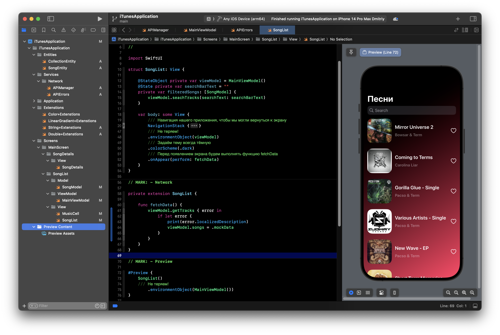

### Что можно улучшить? 
Можно все константы кода выносить в `private extenstion [NameView]` где NameView имя вьюшки.
Можно доработать АПИ, добавить роутер. Добавить шиммеры при прогрузки фото, вместо лоудера и вынести в отдельный компонент. Но это не цель текущей лабораторной работы.

## Итог

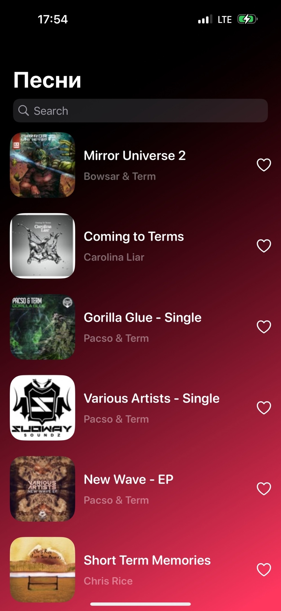
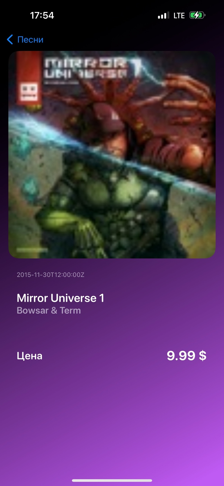
