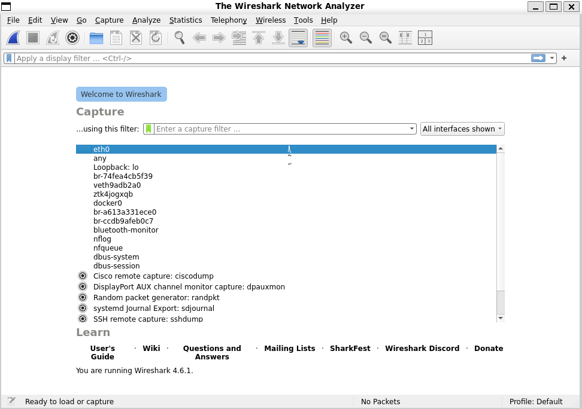
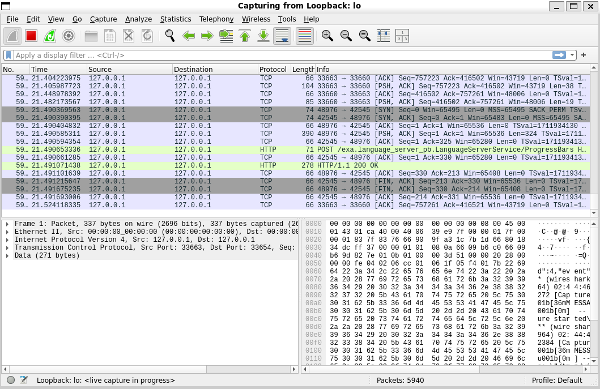
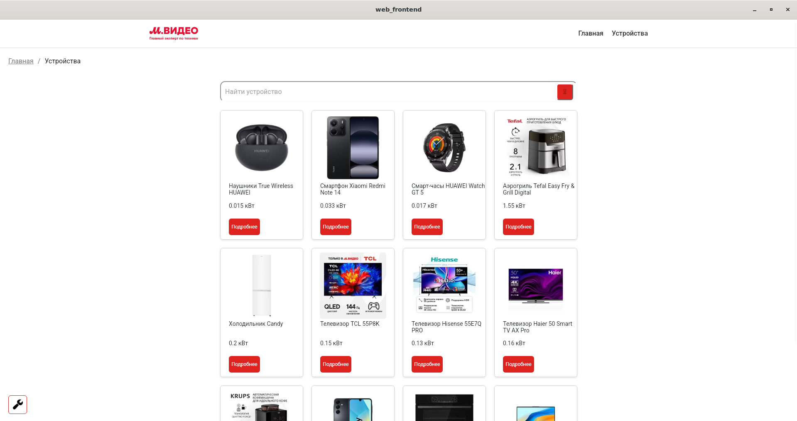
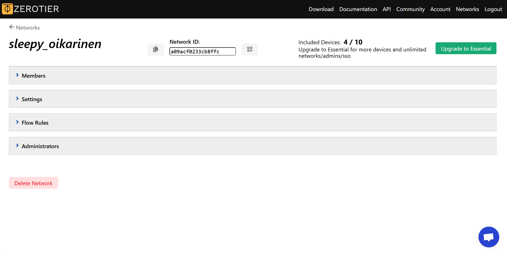
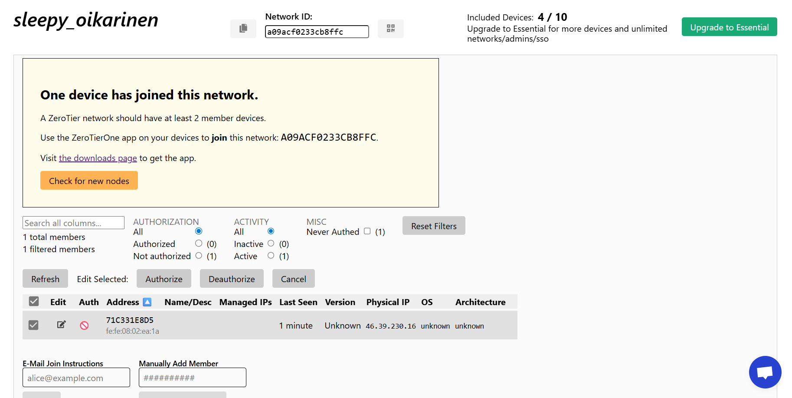
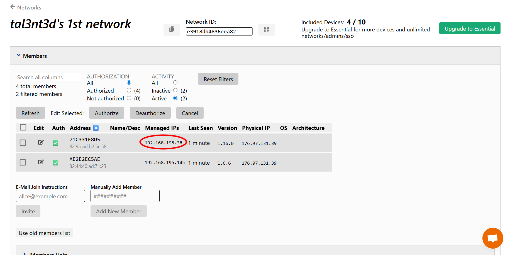

# Настройка Tauri для существующего React проекта

В данном разделе будет рассматриваться настройка Tauri 2.0 для существующего проекта React из нашего курса, который был настроен для работы с Github Pages, хотя это не является обязательным требованием.

[Создание Tauri приложения с нуля](tauri_application.md)

## План
- [Настройка Tauri для существующего react проекта](#настройка-tauri-для-существующего-react-проекта)
    * [Шаг 1: Инициализация Tauri](#шаг-1-инициализация-tauri)
    * [Шаг 2: Конфигурация Tauri dev](#шаг-2-конфигурация-tauri-dev)
    * [Шаг 3: Конфигурация Tauri build](#шаг-3-конфигурация-tauri-build)
    * [Шаг 4: Подключение к веб-сервису.](#шаг-4-подключение-к-веб-сервису)
    * [Шаг 5: Определение порта, используемого Tauri](#шаг-5-определение-порта-используемого-Tauri)
- [Подключение к виртуальной локальной сети с помощью ZeroTier One](#подключение-к-виртуальной-локальной-сети-с-помощью-zerotier-one)
    * [Шаг 1: Регистрация в ZeroTier](#шаг-1-регистрация-в-ZeroTier)
    * [Шаг 2: Создание и настройка своей локальной виртуальной сети](#шаг-2-создание-и-настройка-своей-локальной-виртуальной-сети)
    * [Шаг 3: Исправление методов](#шаг-3-исправление-методов)

## Настройка Tauri для существующего react проекта

### Шаг 1: Инициализация Tauri
Первым шагом необходимо установить инструменты npm, Node.js, Rust и Cargo. После этого необходимо установить 2 библиотеки: @tauri-apps/api и @tauri-apps/cli:
```bash
npm install --save-dev @tauri-apps/api@latest
npm install --save-dev @tauri-apps/cli@latest
```
Опция --save-dev говорит о том что данная библиотека нам нужна для разработки, но не нужна для работы программы (сервера) в нормальном режиме.

После установки библиотек необходимо перейти в файл package.json и указать новый script:
```json
"scripts": {
    "tauri": "tauri",
  }
```
Убедитесь, что у вас была установлена версия Tauri 2.0. Для этого запустите команду:
```bash
npm run tauri info
```
И найдите версию Tauri среди packages:
```
[-] Packages
    - tauri 🦀: 2.1.0
```
После этого мы можем инициализировать проект tauri:
```bash
npm run tauri init

? What is your app name? › test_app
? What should the window title be? › test_app
? Where are your web assets (HTML/CSS/JS) located, relative to the "<current dir>/src-tauri/tauri.conf.json" file that will be created? › ../build
? What is the url of your dev server? › http://localhost:3000
? What is your frontend dev command? › npm run dev
? What is your frontend build command? · npm run build
```
После выполнения данной команды должна появиться папка src-tauri, в которой мы будем работать далее. Файлы, с которыми мы будем работать:
```
src-tauri
│   tauri.conf.json
│   Cargo.toml
│
├───src
│       lib.rs
│
└───capabilities
        default.json
```
Вопросы, на которые вы отвечали при создании Tauri не влияют критично на ваш проект и все параметры, указанные при инициализации, можно найти в `src-tauri/tauri.conf.json` в данных местах:
```json
{
  "productName": "test_app",
  "build": {
    "frontendDist": "../build",
    "devUrl": "http://localhost:3000",
    "beforeDevCommand": "npm run dev",
    "beforeBuildCommand": "npm run build"
  },
  "app": {
    "windows": [
      {
        "title": "test_app",
      }
    ],
  },
}
```
### Шаг 2: Конфигурация Tauri dev
приложение Tauri, как и React может работать в двух режимах: Tauri dev и Tauri build. 

Tauri dev работает за счет запуска react сервера и подключению к нему с помощью url, который мы указали как devUrl `src-tauri/tauri.conf.json`. Затем вместо того чтобы открывать вкладку в браузере, Tauri отрисовывает вкладку сайта в нашем приложении.

Это позволяет изменять React сервер в реальном времени и видеть результаты в приложении без его перезапуска. Кроме этого, мы так же получим доступ к режиму разработчика, в котором можно смотреть ошибки, трафик сети, консоль и.т.д. Для получения доступа в нему в открытом приложении Tauri нажмите правой кнопкой мыши по экрану -> проверить.

Для того чтобы Tauri так могло работать необходимо настроить файл `App.tsx` в папке `src`:

```tsx
import { invoke } from "@tauri-apps/api/core";

function App() {
  useEffect(()=>{
    invoke('tauri', {cmd:'create'})
      .then(() =>{console.log("Tauri launched")})
      .catch(() =>{console.log("Tauri not launched")})
    return () =>{
      invoke('tauri', {cmd:'close'})
        .then(() =>{console.log("Tauri launched")})
        .catch(() =>{console.log("Tauri not launched")})
    }
  }, [])
```

Данный код при запуске Tauri будет пытаться создать окно Tauri и подключиться к нему. При этом сайт все еще можно открыть во вкладке браузера, причем выведется сообщение "Tauri not launched".

На данном этапе, если запустить Tauri командой 
```bash
npm run tauri dev
```
То мы увидим рабочее приложение, которое при правильной настройке проксирования будет получать ответы с сервера.

### Шаг 3: Конфигурация Tauri build
Для того чтобы Tauri build правильно работал, в самом начале необходимо убедиться что и в React проекте и в Tauri нет ошибок, иначе не получиться создать build.

Tauri build отличается от Tauri dev в нескольких важных местах: При прописывании команды
```bash
npm run tauri build
```
Вместо запуска приложения, у вас в каталоге появится папка `src-tauri/target/build`. Данная папка будет содержать исполняемый exe файл вашего приложения. Альтернативно, в папке `bundle` вы сможете найти два разных мастера установки, которые вы можете раздавать другим людям для установки приложения.

Кроме этого, Tauri build работает без использования React сервера и поэтому некоторый функционал, который работает именно за счет существования сервера, как например прокси, не будет работать "из коробки".

Если на данном этапе попытаться запустить Tauri build, то скорее всего вы увидите просто белый экран. Если это так, то сначала проверьте что при запуске приложения в режиме dev нету никаких ошибок, которые могли бы повлиять на работу приложения.

Кроме этого, если вы настраивали React для работы с Github Pages, вам необходимо убрать basename из Router в `App.tsx` и base из `vite.config.ts`. Эти изменения надо сделать потому что приложение Tauri с одной стороны использует webView, что означает что приложение Tauri на самом деле работает как браузер, встроенный в приложение, который отрисовывает все html страницы по их url. С другой стороны Tauri не запускает React сервер и поэтому base, который мы настроили в `vite.config.ts` ничего не делает (в то время как в react сервере эта опция перенаправляет нас с адреса '/' на адрес, указанный в base).

После исправления выданных ошибок, ваше Tauri приложение должно запуститься в режиме build, но при этом вместо получения данных с сервера, Tauri будет подгружать моки.

### Шаг 4: Подключение к веб-сервису.

Для подключения к веб-сервису необходимо решить 2 проблемы: настройка ip адресов запросов и обход cors.

Во первых, как было сказано выше, Tauri build, так как он не запускает http-сервер, не выполняет проксирование запросов. Поэтому, во всех fetch запросах и всех img тэгах необходимо напрямую указать ip адрес веб-сервиса к которому мы обращаемся. Важно уточнить, что Tauri не может взаимодействовать с https, поэтому для демонстрации его работы закомментируйте соответствующие строки в `vite.config.ts` Для того, чтобы определить этот адрес достаточно ввести команду `npm run dev -- --host` и выбрать адрес из Network (если один из адресов не подошёл, попробуйте другой, для начала проверьте на `npm run dev`, а уже потом на самом Tauri). Обратите внимание, что ip-адрес изменяется в зависимости от способа и сети подключения к Интернету. Для удобства рекомендуется создать отдельный файл или поле для быстрого изменения данного параметра.
Пример :

Создадим файл `target_config.ts`:
```tsx
const target_tauri = false

export const api_proxy_addr = "http://172.27.61.159:8080"
export const img_proxy_addr = "http://172.27.61.159:9000"
export const dest_api = (target_tauri) ? api_proxy_addr : "api"
export const dest_img =  (target_tauri) ?  img_proxy_addr : "img-proxy"
export const dest_root = (target_tauri) ? "" : "/image_editing_frontend"
```
Данное приложение в зависимости от того, создаем ли мы build для Tauri или нет, меняет несколько констант, которые затем используются в `src/api.tsx`:
```tsx
import { dest_api } from "../target_config"
export const getFiltersByTitle = async (title = ''): Promise<FilterPropWithQueue> =>{
return  fetch(dest_api + '/filters?' + new URLSearchParams({title:title}), {method: "GET", credentials: 'include'})
}
```
В тэгах :
```tsx

```
А так же в `src/App.tsx`:
```tsx
import { dest_root } from "../target_config";

<BrowserRouter basename={dest_root}>
```
и `vite.config.tsx`:
```ts
import {api_proxy_addr, img_proxy_addr, dest_root} from "./target_config"
export default defineConfig({
   base:dest_root,
   server: { 
       port:3000,
       proxy: {
         "/api": {
           target: api_proxy_addr,
           changeOrigin: true,
         },
         "/img-proxy": {
           target: img_proxy_addr,
           changeOrigin: true,
         },
       },
     },
})
```

Теперь, если мы запустим Tauri build, то, при условии что firewall был настроен правильно, увидим подгрузку статических ресурсов из Minio. Однако, карточки с услугами все еще не будут отображаться.

Если мы зайдем в консоль нашей машины, на которой запущен веб-сервис, то мы увидим, что запросы до сервера доходят. В чем дело? Проблема заключается в том, что у Tauri по умолчанию все запросы соблюдают политику CORS и поэтому ответы от сервера отвергаются нашим приложением. Для того чтобы это исправить, установим библиотеки tauri-plugin-http и tauri-plugin-cors-fetch. Для этого откроем файл `Cargo.toml` и пропишем:
```
tauri-plugin-http = "2"
tauri-plugin-cors-fetch = "2.1.1"
```
Затем необходимо либо обновить зависимости cargo, либо просто заново создать Tauri build.

После установки приложений изменим несколько файлов:

`tauri.conf.json`
```json
{
  "plugins": {
        "http": {
          "enabled": true
        }
    },
   "app": {
    "withGlobalTauri": true,
   }
}
```

Если у вас будут возникать проблемы с подгрузкой фотографий или в целом с работой бэкенда, попробуйте изменить ваш `tauri.conf.json`, добавив этот параметр внутрь секции `app` (не забудьте изменить на свой адрес):

`tauri.conf.json`
```json
  {
    "security": {
      "csp": "default-src 'self' http://172.27.61.159:3000; img-src 'self' http://172.27.61.159:9000 data: blob:; connect-src 'self' http://172.27.61.159:8080; script-src 'self'; style-src 'self' 'unsafe-inline';"
    }
  }
```

`capabilities/default.json`. В "allow" укажите ip адрес вашего веб-сервиса:
```json
{
  "permissions": [
    "cors-fetch:default",
    {
      "identifier": "http:default",
      "allow": [{ "url": "http://172.27.61.159" }],
      "deny": []
    },
    "core:default",
    "http:allow-fetch",
    "http:allow-fetch-read-body",
    "http:allow-fetch-send"
  ]
}
```
В `src\lib.rs` Добавьте запуск tauri_plugin_cors_fetch:
```rs
#[cfg_attr(mobile, tauri::mobile_entry_point)]
pub fn run() {
    tauri::Builder::default()
        .setup(|app| {
            if cfg!(debug_assertions) {
                app.handle().plugin(
                    tauri_plugin_log::Builder::default()
                        .level(log::LevelFilter::Info)
                        .build(),
                )?;
            }
            Ok(())
        }).plugin(tauri_plugin_cors_fetch::init())
        .run(tauri::generate_context!())
        .expect("error while running tauri application");
}
```

Все. После добавления данных изменений, при создании Tauri build вы должны увидеть отображение результатов, полученных с веб-сервиса.
Если у вас возникнут проблемы с тем, что Tauri build всё равно не взаимодействует с фронтендом, попробуйте обновить `middleware.go` в бэкенде, добавив обход политики CORS. 

`middleware.go` 
```go
func CORSMiddleware() gin.HandlerFunc {
	return func(c *gin.Context) {
		c.Writer.Header().Set("Access-Control-Allow-Origin", "*")
		c.Writer.Header().Set("Access-Control-Allow-Credentials", "true")
		c.Writer.Header().Set("Access-Control-Allow-Headers", "Content-Type, Content-Length, Accept-Encoding, X-CSRF-Token, Authorization, Accept, Origin, Cache-Control, X-Requested-With")
		c.Writer.Header().Set("Access-Control-Allow-Methods", "POST, OPTIONS, GET, PUT, DELETE, PATCH")
		c.Writer.Header().Set("Access-Control-Expose-Headers", "Content-Length, Authorization")
		c.Next()
	}
}
```

Также не забудьте обновить `handler.go` в бэкенде:
```go
func (h *Handler) RegisterHandler(router *gin.Engine) {
	router.Use(CORSMiddleware())

  //ваша реализация кода

}
```

### Шаг 5: Определение порта, используемого Tauri

В этой лабораторной работе вам необходимо построить диаграмму развёртывания, в которой нужно указать порт, используемый вашим Tauri приложением. Для выполнения этого задания будем использовать приложение [Wireshark](https://www.wireshark.org/download.html). Для начала установите его на своё устройство (если вы используете WSL, то установите прямо в виртуальной машине). 
Я буду использовать WSL, но для остальных ОС процесс должен быть аналогичный. 
После установки откройте приложение, перед вами появится главное окно:



Сверху мы видим панель инструментов и строку фильтрации, посередине - список сетевых интерфейсов. Данная страница позволяет нам выбрать, откуда мы будем брать трафик для просмотра. Выберем интерфейс Loopback. Перед вами откроется страница, на которой будут отображаться все пакеты, которые проходят через ваш компьютер по выбранному интерфейсу:



В верхней строке фильтрации необходимо указать `tcp.port == 8080`, где 8080 - порт нашего бэкенда. Делается это для того, чтобы оставить только те пакеты, которые будут обращаться к нашему бэкенду, то есть как раз-таки все наши запросы из Tauri build. Теперь запускаем наше собранное приложение и нажимаем на любую кнопку, которая вызывает какой-либо метод, например, получение всех услуг. Видим, что на экране появился GET-запрос зелёного цвета (подробнее про колоризацию в Wireshark можно прочитать [тут](https://www.wireshark.org/docs/wsug_html_chunked/ChCustColorizationSection.html)). Остаётся только нажать на пакет и в левом нижнем поле найти строку `Src Port: 46262`. Это и будет нужный нам порт. Сохраните скриншот для демонстрации лабораторной работы и на диаграмме укажите полученный порт.



## Подключение к виртуальной локальной сети с помощью ZeroTier One

Согласитесь, достаточно неудобно постоянно изменять ip-адрес при смене сети подключения к Интернету. Мы можем избежать этого, используя ZeroTier One. Эта утилита позволяет создать свою виртуальную локальную сеть, благодаря чему мы сможем зафиксировать ip-адрес. Также использование ZeroTier позволяет подключаться к вашему веб-сервису с любого устройства, находящегося в локальной сети, например, с телефона при демонстрации работы адаптивности.

### Шаг 1: Регистрация в ZeroTier

Для начала перейдите на сайт [ZeroTier](https://www.zerotier.com/download/) и установите его на своё устройство. Я рекомендую поставить версию 1.6.6 во избежание проблем со стабильностью работы устройства. Далее необходимо зарегистрироваться в [ZeroTier Central](https://my.zerotier.com/).

### Шаг 2: Создание и настройка своей локальной виртуальной сети

После регистрации перед вами откроется интерфейс приложения. Для создания сети нажмите на кнопку "Create A Network", в таблице появится только что созданная сеть. Нажмите на неё и перейдите в интерфейс настройки. Перед вами появятся вкладки Members, Settings, Flow Rules, Administrators. 



Здесь вы увидите Network ID - это адрес нашей виртуальной сети. Он используется для установления соединения с нашей сетью. Теперь запустите приложение на своём устройстве. Не пугайтесь, если не откроется окно, ZeroTier UI появился в трее. Скопируйте ID вашей сети из ZeroTier Central и вставьте его в поле Join в ZeroTier UI. Обновите страницу в ZeroTier Central, во вкладке Members должно появится ваше подключенное устройство. В колонке Auth будет красный крест, это означает, что соединение установлено, но заблокировано. Для разблокировки надо выбрать эту сеть и нажать кнопку Authorize. После этого в колонке Auth появится зелёная галочка, что говорит об успешном подключении.



Если вы используете WSL, то необходимо установить соединение через ZeroTier UI на вашей машине, а также внутри WSL следующим способом, иначе вы не сможете получить доступ к сайту через браузер:
```bash
sudo zerotier-cli join a0cbf4b62a8b8a8e
```

Проверить подключение можно с помощью команды `ping`. IP-адрес выдаётся каждому устройству автоматически, во вкладке Settings можно указать диапазон выдачи, рекомендую поставить `192.168.195.*`. Во вкладке Members рядом с каждым устройством появятся выданные ему IP-адреса. Я использую WSL, поэтому у меня в сети два IP-адреса, мне нужен тот, который был выдан виртуальной машине, то есть `192.168.195.38`.



### Шаг 3: Исправление методов

Отлично, мы создали нашу локальную сеть, осталось изменить все методы получения запросов.
Для начала обновим `vite.conf.ts`, изменив в target адрес на полученный:
```tsx
{
  proxy: {
    "/api": {
      target: "http://192.168.195.38:8080",
      changeOrigin: true,
      secure: false,
    },
    "/img-proxy": {
      target: "http://192.168.195.38:9000",
      changeOrigin: true,
      secure: false,
    }
  }
}
```

Если вы всё сделали правильно, то на данном этапе при переходе по адресу `http://192.168.195.38:3000/*` вы должны получить какой-либо ответ от вашего бэкенда (например, получить список всех услуг). Обратите внимание, что GET всех услуг, как и другие методы, теперь могут быть вызваны как через порт фронтенда, так и через порт бэкенда (проверьте это в браузере).
Также при вызове команды `npm run dev` ваш сайт должен корректно отображаться (не забудьте изменить адрес в методах получения картинок), а также в Network в `npm run dev -- --host` добавится ваш новый адрес.

Теперь обновим `tauri.conf.json`, заменив все адреса на полученный нами от ZeroTier:
```json
{
  "build": {
      "frontendDist": "../dist",
      "devUrl": "http://192.168.195.38:3000",
      "beforeDevCommand": "npm run dev",
      "beforeBuildCommand": "npm run build"
    },
  "app":{
    "security": {
      "csp": "default-src 'self' http://192.168.195.38:3000; img-src 'self' http://192.168.195.38:9000 data: blob:; connect-src 'self' http://192.168.195.38:8080; script-src 'self'; style-src 'self' 'unsafe-inline';"
    }
  }
}
```
Теперь попробуем собрать наше приложение через dev режим, используя `npm run tauri dev`.
Видим успешное взаимодействие с бэкендом: все карточки отрисовываются, фотографии загружаются.


Осталось проверить build режим, собираем наше приложение через `npm run tauri build`. При запуске собранного приложения видим, что наш фронтенд также взаимодействует с бэкендом, значит, мы всё сделали правильно!
