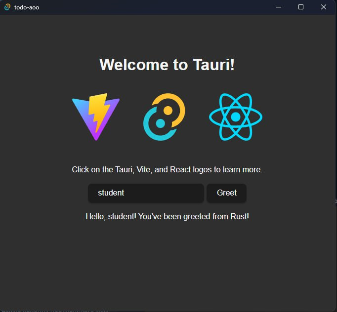
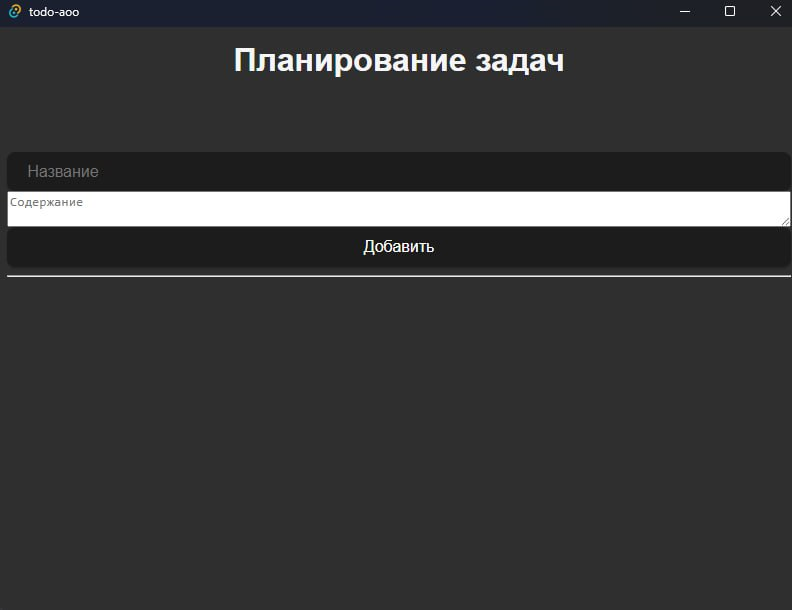
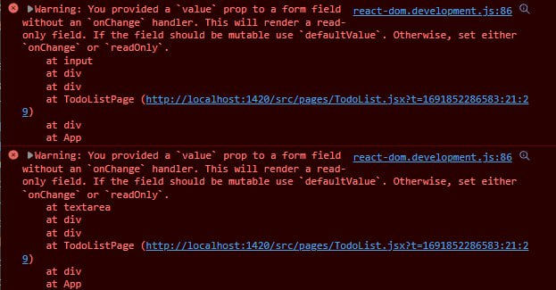
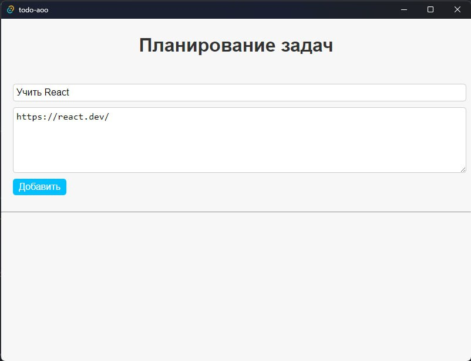
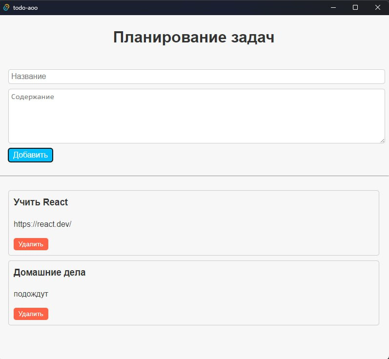
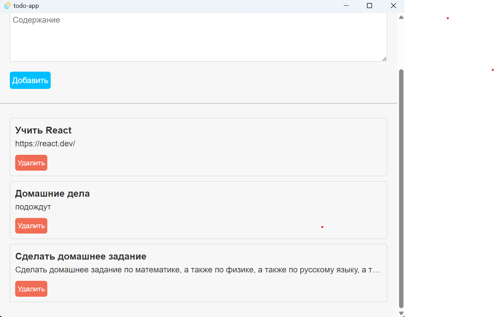
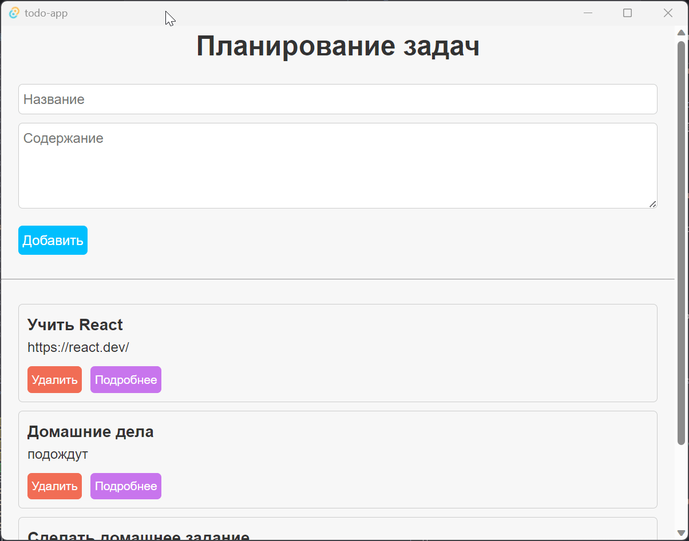
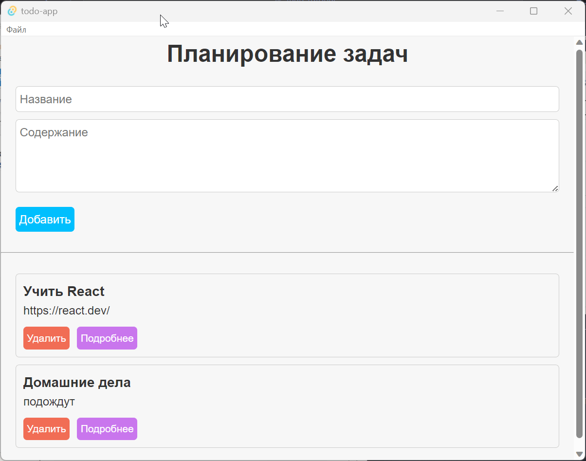

# Tauri методические инструкции

## Создание простого Back-End'а

### Шаг 1: Установка необходимых инструментов

Перед тем, как начать разрабатывать, убедитесь, что у вас установлены следующие инструменты:

1. Node.js - платформа для выполнения JavaScript кода вне браузера.
2. npm (Node Package Manager) - менеджер пакетов для Node.js (поставляется вместе с Node.js)

[Скачать](https://nodejs.dev)

### Шаг 2: Инициализация проекта

Создайте новую папку для Backend'а и перейдите в нее через терминал или командную строку.

```bash
mkdir notes-backend
cd notes-backend
```

### Шаг 3: Инициализация проекта и установка Express

Используя npm, инициализируйте проект и установите Express.

```bash
npm init -y
npm install express
```

### Шаг 4: Создание сервера с Express

Создайте файл `index.js` и подключите Express.

```javascript
// index.js
const express = require('express');
const app = express();
const port = 3000; // Вы можете использовать любой другой порт

// Добавьте промежуточное ПО (middleware) для обработки JSON
app.use(express.json());

// Простой массив для хранения заметок
let notes = [];

// Роут для получения всех заметок
app.get('/notes', (req, res) => {
  res.json(notes);
});

// Роут для создания новой заметки
app.post('/notes', (req, res) => {
  const { title, content } = req.body;
  const newNote = { title, content };
  notes.push(newNote);
  res.status(201).json(newNote);
});

// Роут для обновления существующей заметки
app.put('/notes/:id', (req, res) => {
  const id = parseInt(req.params.id);
  const { title, content } = req.body;
  const noteIndex = notes.findIndex((note) => note.id === id);

  if (noteIndex !== -1) {
    notes[noteIndex] = { id, title, content };
    res.json(notes[noteIndex]);
  } else {
    res.status(404).json({ error: 'Заметка не найдена' });
  }
});

// Роут для удаления заметки
app.delete('/notes/:id', (req, res) => {
  const id = parseInt(req.params.id);
  notes = notes.filter((note) => note.id !== id);
  res.status(204).end();
});

// Старт сервера
app.listen(port, () => {
  console.log(`Сервер запущен на порту ${port}`);
});
```

### Шаг 5: Запуск сервера

Запустите ваш сервер, выполнив следующую команду:

```bash
node index.js
```

Ваш backend для заметок с использованием Express должен быть доступен по адресу `http://localhost:3000` (или другому порту, если вы выбрали другой).

Теперь, когда вы успешно создали backend, вы можете использовать его в своем Tauri приложении.

## Разработка Tauri приложения

### Шаг 1: Установка Tauri
Установите Tauri CLI с помощью следующей команды:

```bash
npm install -g tauri
```

### Шаг 2: Создание нового Tauri приложения

Для создания нового Tauri приложения используйте:

```bash
npm create tauri@latest
```
В процессе создания укажите следующие настройки:


При желании, можно выбрать другое имя проекта, Rust для разработки интерфейса, или другие инструменты, например Vue. 

Мы же покажем далее, как использовать выбранные инструменты.

### Шаг 3: Конфигурация Tauri приложения

Нужно настроить Tauri приложение в файле `tauri.conf.js`. Этот файл находится в папке src-tauri вашего проекта и позволяет управлять различными настройками такими, как иконки, заголовок окна, настройки безопасности и т.д.

Для того, чтобы разрешить приложению обращаться к серверу, добавьте конфигурацию в `allowlist` так, чтобы он выглядел следующим образом:

```json
"allowlist": {
  "all": false,
  "shell": {
    "all": false,
    "open": true
  },
  "http": {
    "request": true,
    "scope": [
      "http://localhost:3000/**"
    ]
  }
}
```

Убедитесь, что в массиве scope присутствует адрес вашего Backend'а.

### Шаг 4: Запуск Tauri приложения

Перейдите в папку вашего Tauri приложения и запустите его, используя команды:

```bash
npm install
npm run tauri dev
```

Это запустит ваше Tauri приложение в режиме разработки. При изменении файлов с кодом ваш проект будет автоматически перезапускаться.



### Шаг 5: Разработка frontend

В папке `src` вы найдёте JSX файлы - файлы React компонентов. 
Сейчас в файле `App.jsx` сгенерированный код. Изменим его так, чтобы в нём остался только наш будущий компонент:

```jsx
import React from 'react';
import TodoListPage from './pages/TodoList';
import './styles.css';

function App() {
    return (
        <div className="App">
            <TodoListPage />
        </div>
    );
}

export default App;
```

Создадим папку `pages`, в которой будут размещены страницы нашего приложения. Добавим в папку компонент первой страницы `TodoList.jsx` - он будет отвечать за вывод списка задач и взаимодействие с ними. `TodoListPage` должен возвращать JSX-код, который [компилируется](https://ru.legacy.reactjs.org/docs/introducing-jsx.html) в вызовы `React.createElement()`, после чего полученные React-элементы [рендерятся](https://ru.legacy.reactjs.org/docs/rendering-elements.html) в DOM. Добавим в исходную функцию `TodoListPage` рендеринг, и сделаем её экспортируемой:

```jsx
import React, { useState } from 'react';

export function TodoListPage() {
    // список всех задач
    const [todos, setTodos] = useState([]);

    // новая задача
    const [newTodo, setNewTodo] = useState({ title: '', content: '' });
    
    return (
        <div>
            <h1>Планирование задач</h1>
            <div className="container">
                <input
                    className="input-title"
                    type="text"
                    placeholder="Название"
                    value={newTodo.title}
                />
                <textarea
                    className="input-content"
                    placeholder="Содержание"
                    value={newTodo.content}
                />
                <button className="button-add button-lg">Добавить</button>
            </div>
            <hr />
            <div className="container">
                {todos.map((todo) => ( // Для каждой задачи из списка 
                    <div className="todo" key={todo.id}>
                        <h3 className='todo-title'>
                            {todo.title}
                        </h3>
                        <p className="todo-content">
                            {todo.content}
                        </p>
                        <button className='button-delete'>Удалить</button>
                    </div>
                ))}
            </div>
        </div>
    );
}
```

Теперь, если у нас запущено приложение в режиме разработки, должна быть следующая картина:



Так как приложение использует стили по-умолчанию для своего шаблона, мы отредактируем `src/styles.css` так, чтобы сначала [сбросить](https://medium.com/@stasonmars/%D1%81%D0%BE%D0%B2%D1%80%D0%B5%D0%BC%D0%B5%D0%BD%D0%BD%D1%8B%D0%B8%CC%86-%D1%81%D0%B1%D1%80%D0%BE%D1%81-css-f5816963c82b) старые стили, а затем установить новые для приложения:

<details>
<summary>Новые стили `src/styles.css`</summary>

```css
/* Сброс стилей */
/* Указываем box sizing */
*,
*::before,
*::after {
  box-sizing: border-box;
}

/* Убираем внутренние отступы */
ul[class],
ol[class] {
  padding: 0;
}

/* Убираем внешние отступы */
body,
h1,
h2,
h3,
h4,
p,
ul[class],
ol[class],
li,
figure,
figcaption,
blockquote,
dl,
dd {
  margin: 0;
}

/* Выставляем основные настройки по-умолчанию для body */
body {
  min-height: 100vh;
  scroll-behavior: smooth;
  text-rendering: optimizeSpeed;
  line-height: 1.5;
}

/* Удаляем стандартную стилизацию для всех ul и il, у которых есть атрибут class*/
ul[class],
ol[class] {
  list-style: none;
}

/* Элементы a, у которых нет класса, сбрасываем до дефолтных стилей */
a:not([class]) {
  text-decoration-skip-ink: auto;
}

/* Упрощаем работу с изображениями */
img {
  max-width: 100%;
  display: block;
}

/* Указываем понятную периодичность в потоке данных у article*/
article > * + * {
  margin-top: 1em;
}

/* Наследуем шрифты для ввода и кнопок */
input,
button,
textarea,
select {
  font: inherit;
}

/* Удаляем все анимации и переходы для людей, которые предпочитай их не использовать */
@media (prefers-reduced-motion: reduce) {
  * {
    animation-duration: 0.01ms !important;
    animation-iteration-count: 1 !important;
    transition-duration: 0.01ms !important;
    scroll-behavior: auto !important;
  }
}

/* Общие стили */
body {
  font-family: Arial, sans-serif;
  font-size: 16px;
  line-height: 1.5;
  color: #333;
  background-color: #f7f7f7;
  margin: 0;
  padding: 0;
}

.container {
  max-width: 800px;
  margin: 0 auto;
  padding: 20px;
}

h1 {
  text-align: center;
}

/* Стили для формы добавления заметок */
.input-title,
.input-content {
  display: block;
  width: 100%;
  margin-bottom: 10px;
  padding: 5px;
  font-size: 16px;
  border: 1px solid #ccc;
  border-radius: 5px;
}

.input-content {
  resize: vertical;
  min-height: 100px;
}

/* Стили для списка заметок */
.todo {
  background-color: #f7f7f7;
  border: 1px solid #ccc;
  border-radius: 5px;
  padding: 10px;
  margin-bottom: 10px;
}

.todo-title {
  margin-top: 0;
}

.todo-content {
  white-space: nowrap;
  overflow: hidden;
  text-overflow: ellipsis;
  border-radius: 5px;
}

/* Текст заметки на отдельной страницу */
.large-content {
  white-space: pre-wrap;
  border: 1px solid #ccc;
  border-radius: 5px;
  height: max-content;
  padding: 5px;
}

/* стили кнопок и текста */
.button {
  display: inline-block;
  margin: 10px 10px 0 0;
  border-radius: 5px;
  border: none;
  padding: 5px;
  cursor: pointer;
  transition: ease-in-out 0.3s;
  text-decoration: none;
}

.button:hover {
  transform: scale(1.1);
  transition: ease-in-out 0.3s;
}

.button-success {
  background-color: #00bfff;
  color: #fff;
}

.button-danger {
  background-color: #f16c54;
  color: #fff;
}

.button-light {
  background-color: #f7f7f7;
  color: #333;
}

.button-info {
  background-color: #c975ed;
  color: #fff;
}

.text-lg {
  font-size: 16px;
}

.text-md {
  font-size: 14px;
}

.text-sm {
  font-size: 12px;
}
```
</details>

Теперь приложение должно выглядеть следующим образом:


Заметим, что если вы попробуете что-нибудь написать в полях `Название` и `Содержание`, то ничего не выйдет. В том числе в консоли вы увидите следующее сообщение:



Дело в том, что мы отображаем состояние компонента, но никак его не меняем. Для того, чтобы изменить состояние, нужно повесить триггер на событие изменения `OnChange`, в котором будет вызываться функция изменения состояния:

```jsx
<div className="container">
  <input
      className="input-title"
      type="text"
      placeholder="Название"
      value={newTodo.title}

      onChange={(e) => setNewTodo({ ...newTodo, title: e.target.value })}
  />
  <textarea
      className="input-content"
      placeholder="Содержание"
      value={newTodo.content}

      onChange={(e) => setNewTodo({ ...newTodo, content: e.target.value })}
  />
  {/* Код кнопки */}
</div>
```

Теперь ввод работает:



Теперь займёмся добавлением логики, которая выполнится после нажатия на кнопки.

```jsx
import React, { useState } from 'react';

const TodoListPage = () => {
    // список всех задач
    const [todos, setTodos] = useState([]);

    // новая задача
    const [newTodo, setNewTodo] = useState({ title: '', content: '' });

    // добавление новой задачи
    const handleAddTodo = () => {
        if (!newTodo.title || !newTodo.content) {
            console.error("Поля не должны быть пустыми");
            return;
        };
        const newTodoWithId = { ...newTodo, id: Date.now() };
        setTodos([...todos, newTodoWithId]);
        setNewTodo({ title: '', content: '' });
    };

    // удаление задачи
    const handleDeleteTodo = (id) => {
        const updatedTodos = todos.filter((todo) => todo.id !== id);
        setTodos(updatedTodos);
    };

    {/*return ( ... )*/}
}
```

Мы добавили две функции, изменяющие состояния при добавлении и при удалении заметки. Повесим их на события нажатия кнопок:
```jsx
<button className="button-add button-lg" onClick={handleAddTodo}>Добавить</button>
```
```jsx
<button className='button-delete' onClick={() => handleDeleteTodo(todo.id)}>Удалить</button>
```

Обратите внимание на то, как передаются аргументы функций. 



Теперь заметки добавляются и удаляются, настало время связаться с нашим сервером!

Для начала создадим файл `src/api/index.js` и добавим в него класс `TodosApi`, который будет отвечать за взаимодействие с сервером:
```javascript
import { fetch, Body } from '@tauri-apps/api/http';

export class TodosApi {
    constructor() {
        this.url = 'http://localhost:3000/todos';
    }

    async getTodos() {
        const response = await fetch(this.url, {
            method: 'GET',
            timeout: 30
        });

        if (response.ok) {
            return response.data;
        } else {
            throw new Error(response.status);
        }
    }

    async postTodos(todo) {
        const response = await fetch(this.url, {
            method: 'POST',
            headers: {
                'Content-Type': 'application/json'
            },
            body: Body.json(todo)
        });

        if (response.ok) {
            return response.data;
        } else {
            throw new Error(response.status);
        }
    }

    async putTodos(todo) {
        const response = await fetch(`${this.url}/${todo.id}`, {
            method: 'PUT',
            headers: {
                'Content-Type': 'application/json'
            },
            body: Body.json(todo)
        });

        if (response.ok) {
            return response;
        } else {
            throw new Error(response.status);
        }
    }

    async deleteTodos(id) {
        const response = await fetch(`${this.url}/${id}`, {
            method: 'DELETE',
            headers: {
                'Content-Type': 'application/json'
            }
        });

        if (response.ok) {
            return response;
        } else {
            throw new Error(response.status);
        }
    }
}
```

Важно отметить, что в данном случае мы используем `fetch` из пакета `@tauri-apps/api/http`. Tauri является мультиязычным фреймворком, и одним из основополагающих принципов является осуществление безопасности пользователя. В `tauri.conf.json` был указан параметр `scope`, в котором мы указали разрешённые адреса для запросов. Поэтому, если мы попытаемся сделать запрос на другой адрес, то получим ошибку:

`Uncaught (in promise) url not allowed on the configured scope.`

Благодаря этому мы можем быть уверены в том, что наше приложение не сможет отправлять запросы на вредоносные сайты.

Теперь перепишем наш компонент `TodoListPage` с использованием `TodosApi`:
```jsx
import React, { useEffect, useState } from 'react';
import { TodosApi } from '../api';
import { message, confirm } from '@tauri-apps/api/dialog';

export function TodoListPage() {
    // экземпляр класса TodosApi
    const todosApi = new TodosApi();

    const [todos, setTodos] = useState([]);
    const [newTodo, setNewTodo] = useState({ title: '', content: '' });

    const handleAddTodo = () => {
        if (!newTodo.title || !newTodo.content) {
            return;
        };
        const newTodoWithId = { ...newTodo, id: Date.now() };
        setTodos([...todos, newTodoWithId]);
        setNewTodo({ title: '', content: '' });

        todosApi.postTodos(newTodoWithId);
    }

    const handleDeleteTodo = (id) => {
        const updatedTodos = todos.filter((todo) => todo.id !== id);
        setTodos(updatedTodos);

        todosApi.deleteTodos(id);
    }

    // получение списка задач при загрузке страницы
    useEffect(() => {
        todosApi.getTodos().then(data => {
            setTodos(data);
        });
    }, []);

    return (
        <div>
            {/*...*/}
        </div>
    );
}
```

Теперь мы можем получать список задач при загрузке страницы, добавлять новые и удалять существующие. Но что произойдёт, если текст задачи будет слишком велик?



Наши css-стили не позволяют отображать слишком объёмный текст. Добавим возможность просмотра отдельной задачи. Для этого необходимо добавить роутинг. Для этого установим [пакет](https://reactrouter.com/) `react-router-dom`:

```bash
npm install react-router-dom
```

Теперь улучшим файловую структуру нашего проекта. Создадим папку `src/app`, `App.jsx` переименуем в `index.jsx` (отредактируйте импорт в `src/main.jsx`) и перенесём в папку `src/app`. Здесь же создадим `RouterProvider.jsx` со следующим содержимым:
```jsx
import { Route, Routes } from 'react-router-dom';
import { TodoListPage, TodoPage } from '../pages';

export function Router() {
    return (
        <Routes>
            <Route path="/" exact element={<TodoListPage />} />
            <Route path="/:id" element={<TodoPage />} />
        </Routes>
    );
}
```

Отредактируем `src/app/index.jsx`, пока добавив компонент `Router` в качестве корневого элемента, в дальнейшем мы создадим собственный провайдер, который будет оборачивать `Router`:
```jsx
import React from 'react';
import { BrowserRouter } from 'react-router-dom';
import { Router } from './RouterProvider';

function App() {
    return (
        <BrowserRouter>
            <Router />
        </BrowserRouter>
    );
}

export default App;
```

Создадим компонент `TodoPage`, который будет отображать отдельную задачу по её `id`, переданному в адресной строке:

```jsx
import { useEffect, useState } from 'react';
import { TodosApi } from '../api';

export function TodoPage() {
    const todosApi = new TodosApi();

    // получение id из адресной строки
    const { id } = useParams();

    const [todo, setTodo] = useState();

    useEffect(() => {
        todosApi.getTodos().then(todos => {
            const todo = todos.find(todo => todo.id == id);
            setTodo(todo);
        })
    }, [id]);

    return (
        <div className='container'>
            <Link to="/">
                <button className='button button-light text-lg'>
                    🔙 Вернуться
                </button>

            </Link>
            {todo &&
                <div className='vertical-center'>
                    <div>
                        <h1>{todo?.title}</h1>
                        <p className='large-content'>{todo?.content}</p>
                    </div>
                </div>}
            {!todo &&
                <h1>Задача не найдена</h1>
            }
        </div>
    );
}
```

Свяжем `TodoListPage` с `TodoPage` с помощью ссылок:
```jsx
// импорты
import { Link } from 'react-router-dom';

export function TodoListPage() {
  // хуки и хендлеры

  return (
    // ...
      <div className="container">
        {todos.map((todo) => (
              <div className="todo" key={todo.id}>
                  <h3 className='todo-title'>
                      {todo.title}
                  </h3>
                  <p className="todo-content">
                      {todo.content}
                  </p>
                  <button
                    className='button button-danger text-md'
                    onClick={() => handleDeleteTodo(todo.id)}
                  >
                      Удалить 
                  </button>
                  <Link
                    to={todo.id.toString()}
                    className='button button-info text-md'
                  >
                      Подробнее
                  </Link>
              </div>
          ))}
      </div>
    // ...
  );
}
```

Осталось только добавить [public API](https://feature-sliced.design/docs/reference/public-api#requirements-for-the-public-api) для страниц `src/pages/index.js`:
```jsx
export { TodoListPage } from './TodoListPage';
export { TodoPage } from './TodoPage';
```

После проделанной работы результат следующий:


### Шаг 6: Работа с Tauri API

Tauri API - это набор методов, которые позволяют взаимодействовать с операционной системой, на которой запущено приложение. Например, с помощью Tauri API можно получить список файлов в папке, в которой запущено приложение, или провести системный вызов.
До этого мы использовали Tauri API для отправки безопасных запросов на сервер, теперь же мы попробуем использовать системные диалоговые окна для отображения ошибок.

В конфигурацию `tauri.conf.json` добавим часть [диалогого API](https://tauri.app/v1/api/js/dialog) в `allowlist`:
```json
"dialog": {
  "confirm": true,
  "message": true
}
```

Отредактируем хендлеры в `src/pages/TodoList.jsx`:
```jsx
const handleAddTodo = () => {
    if (!newTodo.title || !newTodo.content) {
        return message(
            'Поля не могут быть пустыми',
            { title: 'Ошибка', type: 'error' }
        );
    };
    const newTodoWithId = { ...newTodo, id: Date.now() };
    setTodos([...todos, newTodoWithId]);
    setNewTodo({ title: '', content: '' });

    todosApi.postTodos(newTodoWithId);
}

const handleDeleteTodo = (id) => {
    confirm('Вы уверены, что хотите удалить задачу?')
        .then(res => {
            if (!res) return;
            const updatedTodos = todos.filter((todo) => todo.id !== id);
            setTodos(updatedTodos);

            todosApi.deleteTodos(id);
        });
}
```

Отлично! Теперь приложение будет отображать диалоговые окна при попытке удалить или добавить пустую задачу:



Во многих приложениях встречается нативное меню, которое открывается по нажатию на кнопку в верхнем левом углу. Давайте добавим такое [меню](https://tauri.app/v1/guides/features/menu) в наше приложение. Для этого необходимо отредактировать `main.rs` в папке `src-tauri/src`:
```rust
// Prevents additional console window on Windows in release, DO NOT REMOVE!!
#![cfg_attr(not(debug_assertions), windows_subsystem = "windows")]

use tauri::{CustomMenuItem, Menu, Submenu};

fn main() {
    let new_todo = CustomMenuItem::new("new".to_string(), "Новая задача");
    let close = CustomMenuItem::new("quit".to_string(), "Выйти");
    let submenu = Submenu::new("Файл", Menu::new().add_item(new_todo).add_item(close));
    let menu = Menu::new()
        .add_submenu(submenu);

    tauri::Builder::default()
        .menu(menu)
        .on_menu_event(|event| {
            match event.menu_item_id() {
              "quit" => {
                // завершаем работу приложения
                std::process::exit(0);
              }
              "new" => {
                // вызываем событие "new-todo"
                event.window().emit("new-todo", "").unwrap();
              },
              _ => {}
            }
        })
        .run(tauri::generate_context!())
        .expect("error while running tauri application");
}
```

Tauri позволяет вызывать события на стороне Rust, а также слушать их на стороне JS. Вместо добавления слушателя на каждой отдельной странице, давайте создадим провайдер (компонент высшего порядка ([HOC](https://ru.legacy.reactjs.org/docs/higher-order-components.html)), исполняющий чисто функциональную часть) `ListenerProvider`, в котором будут слушатели событий. Создадим файл `src/app/ListenerProvider.jsx`:
```jsx
import { useNavigate } from "react-router-dom";
import { listen } from "@tauri-apps/api/event";

export function Listener({ children }) {
    const navigate = useNavigate();

    listen('new-todo', () => {
        navigate('/?new-todo');
    });

    return (
        <>
            {children}
        </>
    );
}
```

Здесь мы слушаем событие `new-todo` и переходим на главную страницу с параметром `new-todo`. С помощью [аргумента](https://react.dev/reference/react/Children) `children` мы можем передавать в провайдер любые компоненты, которые будут обернуты в `ListenerProvider`. Давайте обернем в провайдер роутер в `src/app/index.jsx`:
```jsx
import { Listener } from './ListenerProvider';

function App() {
    return (
        <BrowserRouter>
            <Listener>
                <Router />
            </Listener>
        </BrowserRouter>
    );
}
```

Остаётся научиться читать параметры, переданные в адресной строке. Для этого воспользуемся [хуком](https://reactrouter.com/en/main/hooks/use-search-params) `useSearchParams` из библиотеки `react-router-dom`. Отредактируем `src/pages/TodoList.jsx`:
```jsx
// импорты
import { useSearchParams } from 'react-router-dom';

export function TodoListPage() {
  // хуки и хендлеры

  // обработка параметров в адресной строке
  const [searchParams] = useSearchParams();
  // ссылаемся на инпут
  const newTodoRef = useRef();

  useEffect(() => {
      if (searchParams.has('new-todo')) {
          newTodoRef.current.focus();
      }
  }, [searchParams]);

  return (
      // разметка
          <input
              className="input-title"
              type="text"
              placeholder="Название"
              value={newTodo.title}
              ref={newTodoRef}
              onChange={(e) => setNewTodo({ ...newTodo, title: e.target.value })}
          />
      // разметка
  );
}
```

Теперь мы можем использовать нативное меню нашего приложения:



Ну что ж, наша задача выполнена! Мы создали приложение, которое может работать с диалоговыми окнами, отправлять запросы на сервер и использовать нативное меню. Поздравляю!

### Шаг 7: Сборка Tauri приложения

Когда вы готовы опубликовать ваше Tauri приложение, вы можете выполнить команду:

```bash
tauri build
```

Это соберет ваше приложение для целевой платформы (например, Windows, macOS, Linux), и вы найдете файлы приложения в папке `src-tauri/target/release/bundle`.

## Дополнительно: Добавление Middleware для сервера

Middleware - связующее ПО, которое помогает обмену запросов между приложением и сервером. Оно снижает зависимость от API, позволяет не торопиться с обновлением старого Backend'а и снижает нагрузку.

### Шаг 1: Логирование запросов

Для логирования запросов мы будем использовать библиотеку [morgan](https://github.com/expressjs/morgan). Чтобы ее установить, перейдите в директорию `server` и напишите в командной строке:

```bash
npm install morgan
```

### Шаг 2: Установка логгера

Логгер необходим для фиксации событий в работе веб-ресурса, которая помогает выявлять и исправлять в будущем баги системы или ее сбои.

В файле `index.js` импортируйте `morgan`:

```javascript
const express = require('express');
const app = expres();
const cors = require('cors');
// Импортируем библиотеку
const morgan = require('morgan');
// ... Остальной код
```

Далее добавляем логгер и устанавливаем в режим `'combined'` для более подробного получения данных:

```javascript
// ... Остальной код

app.use(cors());
app.use(express.json());
// Устанавливаем morgan в режим 'combined'
app.use(morgan('combined'));

// ... Остальной код
```

Теперь вы можете проверить работоспособность с помощью тестового запроса:

```bash
curl -X POST -H "Content-Type: application/json" -d '{"title":"Buy groceries"}' http://localhost:3000/todos
```

```bash
curl -X POST -H "Content-Type: application/json" -d '{"content":"Oppenheimer or Barbie???"}' http://localhost:3000/todos
```

### Шаг 3: Добавление валидации задач

После того как мы с помощью `curl` попробовали внести новые данные, можно обратить внимание, что они никак не обрабатываются, т.е. спокойно можно внести запись без заголовка, описания или абсолютно пустую запись.

Чтобы этого избежать, необходимо добавить еще один "слой" Middleware, перейдите в директорию `server` и пропишите в терминале:

```bash
mkdir middleware
```

После этого создайте в этой директории файл `validation.js`.

```javascript
const validateTodo = (req, res, next) => {
    const body = req.body;

    // Проверка наличия поля "id" и "title"
    if (!body.id) {
        return res.status(400).json({ error: 'Id is required' });
    }
    if (!body.title) {
        return res.status(400).json({ error: 'Title is required' });
    }

    // Задаем значения по умолчанию для "content" и "completed"
    const content = body.content || '';
    const completed = body.completed || false;

    // Создаем объект с валидированными данными
    req.validatedTodo = {
        id: body.id,
        title: body.title,
        content: content,
        completed: completed
    };

    // Переходим к следующему обработчику
    next();
};

// Экспорт функции валидации
module.exports = {
    validateTodo
};
```

Здесь мы проверяем наличие поле title, если оно будет не заполнено, вернется ошибка с описанием `Title is required`.

Далее, если поля content и completed не заполнены, то мы заполняем их по умолчанию пустой строкой и `false` соответственно.

Функция `next()`, которую мы передаем вместе с параметрами, необходима для того, чтобы с видоизмененным запросом перейти к следующему обработчику.

### Шаг 4: Добавляем валидацию на POST-запрос

Перейдем в файл `/server/todos/app.js` и перепишем POST-запрос.

```javascript
const express = require('express');
const router = express.Router();

const todosController = require('./controller');
const validateTodo = require('../middleware/validation');

/*
*   GET-запрос.
*/

router.post('/', validateTodo, (req, res) => {
    const todo = todosController.postTodo(req.validatedTodo);
    res.send(todo);
});
```

1. Мы поменяли входные параметры, теперь обработчик принимает еще один параметр, нашу функцию `validateTodo`, которая валидирует (проверяет на корректность) запрос.

2. Теперь в метод контроллера мы отправляем свойство `req.validateTodo`, которое пришло к нам из `validateTodo`.

Если попробуем добавить какие-то некорректные данные, например:

```bash
curl -X POST -H "Content-Type: application/json" -d '{"content":"Buy fruits"}' http://localhost:3000/todos
```

Получаем на выходе ошибку:
```bash
{
  "error": "Title is required"
}
```

Теперь у вас есть простое CRUD-backend с использованием Express и Tauri приложение, которое может взаимодействовать с этим Backend'ом. Вы можете использовать Tauri для создания кросс-платформенных desktop-приложений, интегрирующих ваш CRUD-backend для заметок.
